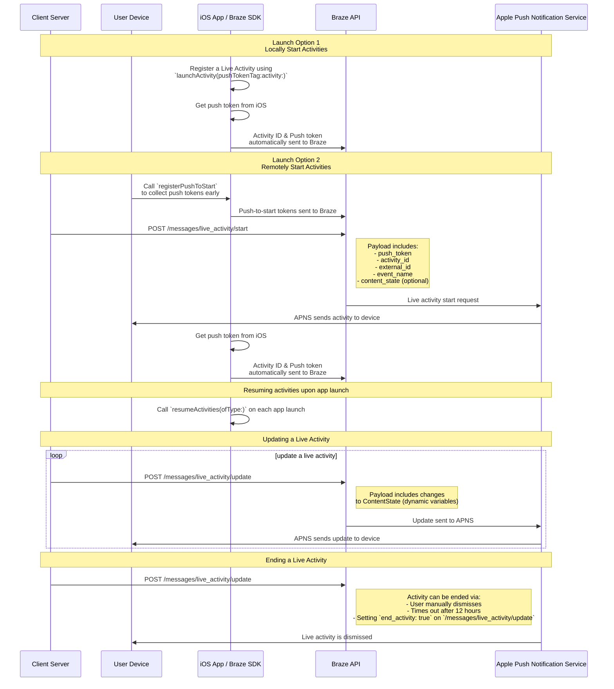

# Live Activities for Swift

> Learn how to implement Live Activities for the Swift Braze SDK. Live Activities are persistent, interactive notifications that are displayed directly on the lock screen, allowing users to get dynamic, real-time updates&#8212;without unlocking their device.

## How it works

{: style="max-width:40%;float:right;margin-left:15px;"}

Live Activities present a combination of static information and dynamic information that you update. For example, you can create a Live Activity that provides a status tracker for a delivery. This Live Activity includes your company's name as static information, as well as a dynamic "Time to delivery" that updates as the delivery driver approaches its destination.

As a developer, you can use Braze to manage your Live Activity lifecycles, make calls to the Braze REST API to make Live Activity updates, and have all subscribed devices receive the update as soon as possible. And, because you're managing Live Activities through Braze, you can use them in tandem with your other messaging channels&mdash;push notifications, in-app messages, Content Cards&mdash;to drive adoption.

## Sequence Diagram {#sequence-diagram}









## Implementing a Live Activity

# You'll also need to complete the following:

- Ensure that your project is targeting iOS 16.1 or later.
- Add the `Push Notification` entitlement under **Signing & Capabilities** in your Xcode project.
- Ensure `.p8` keys are used to send notifications. Older files such as a `.p12` or `.pem` are not supported.
- Starting with version 8.2.0 of the Braze Swift SDK, you can [remotely register a Live Activity](#swift_step-2-start-the-activity). To use this feature, iOS 17.2 or later is required.


While Live Activities and push notifications are similar, their system permissions are separate. By default, all Live Activity features are enabled, but users may disable this feature per app.




### Step 1: Create an activity {#create-an-activity}

First, ensure that you have followed [Displaying live data with Live Activities](https://developer.apple.com/documentation/activitykit/displaying-live-data-with-live-activities) in Apple’s documentation to set up Live Activities in your iOS application. As part of this task, make sure you include `NSSupportsLiveActivities` set to `YES` in your `Info.plist`.

Because the exact nature of your Live Activity is specific to your business case, set up and initialize the [Activity](https://developer.apple.com/documentation/activitykit/activityattributes) objects. Importantly, define:
* `ActivityAttributes`: This protocol defines the static (unchanging) and dynamic (changing) content that appears in your Live Activity.
* `ActivityAttributes.ContentState`: This type defines the dynamic data that updates over the course of the activity.

You also use SwiftUI to create the UI presentation of the lock screen and Dynamic Island on supported devices.

Make sure you're familiar with Apple's [prerequisites and limitations](https://developer.apple.com/documentation/activitykit/displaying-live-data-with-live-activities#Understand-constraints) for Live Activities, as these constraints are independent from Braze.


If you expect to send frequent pushes to the same Live Activity, you can avoid being throttled by Apple's budget limit by setting `NSSupportsLiveActivitiesFrequentUpdates` to `YES` in your `Info.plist` file. For more details, refer to the [`Determine the update frequency`](https://developer.apple.com/documentation/activitykit/updating-and-ending-your-live-activity-with-activitykit-push-notifications#Determine-the-update-frequency) section in the ActivityKit documentation.


#### Example

Let's imagine that we want to create a Live Activity to give our users updates for the Superb Owl show, where two competing wildlife rescues are given points for the owls they have in residence. For this example, we have created a struct called `SportsActivityAttributes`, but you may use your own implementation of `ActivityAttributes`.

```swift
#if canImport(ActivityKit)
  import ActivityKit
#endif

@available(iOS 16.1, *)
struct SportsActivityAttributes: ActivityAttributes {
  public struct ContentState: Codable, Hashable {
    var teamOneScore: Int
    var teamTwoScore: Int
  }

  var gameName: String
  var gameNumber: String
}
```

### Step 2: Start the activity {#start-the-activity}

First, choose how you want to register your activity:

- **Remote:** Use the [`registerPushToStart`](<http://braze-inc.github.io/braze-swift-sdk/documentation/brazekit/braze/liveactivities-swift.class/registerpushtostart(fortype:name:)>) method early in your user lifecycle and before the push-to-start token is needed, then start an activity using the [`/messages/live_activity/start`]({{site.baseurl}}/api/endpoints/messaging/live_activity/start) endpoint.
- **Local:** Create an instance of your Live Activity, then use the [`launchActivity`](<https://braze-inc.github.io/braze-swift-sdk/documentation/brazekit/braze/liveactivities-swift.class/launchactivity(pushtokentag:activity:fileid:line:)>) method to create push tokens for Braze to manage.




To remotely register a Live Activity, iOS 17.2 or later is required.


#### Step 2.1: Add BrazeKit to your widget extension

In your Xcode project, select your app name, then **General**. Under **Frameworks and Libraries**, confirm `BrazeKit` is listed.


#### Step 2.2: Add the BrazeLiveActivityAttributes protocol {#brazeActivityAttributes}

In your `ActivityAttributes` implementation, add conformance to the `BrazeLiveActivityAttributes` protocol, then add the `brazeActivityId` property to your attributes model.


iOS maps the `brazeActivityId` property to the corresponding field in your Live Activity push-to-start payload, so it should not be renamed or assigned any other value.


```swift
import BrazeKit

#if canImport(ActivityKit)
  import ActivityKit
#endif

@available(iOS 16.1, *)
// 1. Add the `BrazeLiveActivityAttributes` conformance to your `ActivityAttributes` struct.
struct SportsActivityAttributes: ActivityAttributes, BrazeLiveActivityAttributes {
  public struct ContentState: Codable, Hashable {
    var teamOneScore: Int
    var teamTwoScore: Int
  }

  var gameName: String
  var gameNumber: String

  // 2. Add the `String?` property to represent the activity ID.
  var brazeActivityId: String?
}
```

#### Step 2.3: Register for push-to-start

Next, register the Live Activity type, so Braze can track all push-to-start tokens and Live Activity instances associated with this type.


The iOS operating system only generates push-to-start tokens during the first app install after a device is restarted. To ensure your tokens are reliably registered, call `registerPushToStart` in your `didFinishLaunchingWithOptions` method.


##### Example

In the following example, the `LiveActivityManager` class handles Live Activity objects. Then, the `registerPushToStart` method registers `SportsActivityAttributes`:

```swift
import BrazeKit

#if canImport(ActivityKit)
  import ActivityKit
#endif

class LiveActivityManager {

  @available(iOS 17.2, *)
  func registerActivityType() {
    // This method returns a Swift background task.
    // You may keep a reference to this task if you need to cancel it wherever appropriate, or ignore the return value if you wish.
    let pushToStartObserver: Task = Self.braze?.liveActivities.registerPushToStart(
      forType: Activity<SportsActivityAttributes>.self,
      name: SportsActivityAttributes.name
    )
  }

}
```

#### Step 2.4: Send a push-to-start notification

Send a remote push-to-start notification using the [`/messages/live_activity/start`]({{site.baseurl}}/api/endpoints/messaging/live_activity/start) endpoint.



You can use [Apple's ActivityKit framework](https://developer.apple.com/documentation/activitykit) to get a push token, which the Braze SDK can manage for you. This allows you to update Live Activities through the Braze API, as Braze sends the push token to the Apple Push Notification service (APNs) on the backend.

1. Create an instance of your Live Activity implementation using Apple’s ActivityKit APIs.
2. Set the `pushType` parameter as `.token`.
3. Pass in the Live Activities `ActivitiesAttributes` and `ContentState` you defined.
4. Register your activity with your Braze instance by passing it into [`launchActivity(pushTokenTag:activity:)`](https://braze-inc.github.io/braze-swift-sdk/documentation/brazekit/braze/liveactivities-swift.class). The `pushTokenTag` parameter is a custom string you define. It should be unique for each Live Activity you create.

After you register the Live Activity, the Braze SDK extracts and observes changes in the push tokens.

#### Example

For our example, create a class called `LiveActivityManager` as an interface for our Live Activity objects. Then, set the `pushTokenTag` to `"sports-game-2024-03-15"`.

```swift
import BrazeKit

#if canImport(ActivityKit)
  import ActivityKit
#endif

class LiveActivityManager {

  @available(iOS 16.2, *)
  func createActivity() {
    let activityAttributes = SportsActivityAttributes(gameName: "Superb Owl", gameNumber: "Game 1")
    let contentState = SportsActivityAttributes.ContentState(teamOneScore: "0", teamTwoScore: "0")
    let activityContent = ActivityContent(state: contentState, staleDate: nil)
    if let activity = try? Activity.request(attributes: activityAttributes,
                                            content: activityContent,
      // Setting your pushType as .token allows the Activity to generate push tokens for the server to watch.
                                            pushType: .token) {
      // Register your Live Activity with Braze using the pushTokenTag.
      // This method returns a Swift background task.
      // You may keep a reference to this task if you need to cancel it wherever appropriate, or ignore the return value if you wish.
      let liveActivityObserver: Task = AppDelegate.braze?.liveActivities.launchActivity(pushTokenTag: "sports-game-2024-03-15",
                                                                                        activity: activity)
    }
  }

}
```

Your Live Activity widget displays this initial content to your users.

{: style="max-width:40%;"}



### Step 3: Resume activity tracking {#resume-activity-tracking}

To ensure Braze tracks your Live Activity upon app launch:

1. Open your `AppDelegate` file.
2. Import the `ActivityKit` module if it’s available.
3. Call [`resumeActivities(ofType:)`](https://braze-inc.github.io/braze-swift-sdk/documentation/brazekit/braze/liveactivities-swift.class/resumeactivities(oftype:)) in `application(_:didFinishLaunchingWithOptions:)` for all `ActivityAttributes` types you have registered in your application.

This allows Braze to resume tasks to track push token updates for all active Live Activities. Note that if a user has explicitly dismissed the Live Activity on their device, it is considered removed, and Braze no longer tracks it.

#### Example

```swift
import UIKit
import BrazeKit

#if canImport(ActivityKit)
  import ActivityKit
#endif

@main
class AppDelegate: UIResponder, UIApplicationDelegate {

  static var braze: Braze? = nil

  func application(
    _ application: UIApplication,
    didFinishLaunchingWithOptions launchOptions: [UIApplication.LaunchOptionsKey: Any]?
  ) -> Bool {

    if #available(iOS 16.1, *) {
      Self.braze?.liveActivities.resumeActivities(
        ofType: Activity<SportsActivityAttributes>.self
      )
    }

    return true
  }
}
```

### Step 4: Update the activity {#update-the-activity}

{: style="max-width:40%;float:right;margin-left:15px;"}

The [`/messages/live_activity/update`]({{site.baseurl}}/api/endpoints/messaging/live_activity/update) endpoint allows you to update a Live Activity through push notifications passed through the Braze REST API. Use this endpoint to update your Live Activity's `ContentState`.

As you update your `ContentState`, your Live Activity widget displays the new information. Here's what the Superb Owl show looks like at the end of the first half.

See our [`/messages/live_activity/update` endpoint]({{site.baseurl}}/api/endpoints/messaging/live_activity/update) article for full details.

### Step 5: End the activity {#end-the-activity}

When a Live Activity is active, it is shown on both a user's lock screen and Dynamic Island. To end it through Braze, use the [`/messages/live_activity/update`]({{site.baseurl}}/api/endpoints/messaging/live_activity/update) endpoint with `end_activity` set to `true`.

To improve reliability when ending a Live Activity, take the following optional steps:

1. Optionally include `dismissal_date` in that same `update` request to suggest when iOS should remove the Live Activity UI.
2. Verify delivery outcomes in the [Message Activity Log]({{site.baseurl}}/user_guide/administrative/app_settings/message_activity_log_tab).

#### Arranging automatic dismissal

To arrange automatic dismissal, schedule a follow-up request to the update endpoint after you start the Live Activity.

1. Send a `/messages/live_activity/start` request with an `activity_id` you can track.
2. Store that `activity_id` and your target end time in your backend scheduler.
3. At the target end time, send a `/messages/live_activity/update` request with `end_activity` set to `true`.
4. Configure dismissal date in the same update request. For details, see the [`/messages/live_activity/update`]({{site.baseurl}}/api/endpoints/messaging/live_activity/update) endpoint.

Note that dismissal timing is controlled by iOS. Even after you send a valid end request, removal from the lock screen or Dynamic Island can be delayed or behave differently based on OS-level conditions.

A Live Activity can also end outside of Braze:

* **User dismissal**: A user can manually dismiss a Live Activity.
* **Time out**: After a default time of eight hours, iOS removes the Live Activity from the user's Dynamic Island. After a default time of 12 hours, iOS removes the Live Activity from the user's lock screen.

See our [`/messages/live_activity/update` endpoint]({{site.baseurl}}/api/endpoints/messaging/live_activity/update) article for full details.

## Tracking Live Activities

Live Activity events are available in Currents, Snowflake Data Sharing, and Query Builder. The following events can help you understand and monitor the lifecycle of your Live Activities, track token availability, and independently diagnose issues or verify delivery statuses.

- [Live Activity Push To Start Token Change]({{site.baseurl}}/user_guide/data/braze_currents/event_glossary/customer_behavior_events#live-activity-push-to-start-token-change-events): Captures when a push-to-start (PTS) token is added or updated in Braze, enabling you to track token registrations and availability per user.
- [Live Activity Update Token Change]({{site.baseurl}}/user_guide/data/braze_currents/event_glossary/customer_behavior_events#live-activity-update-token-change-events): Tracks the addition, update, or removal of Live Activity Update (LAU) tokens.
- [Live Activity Send]({{site.baseurl}}/user_guide/data/braze_currents/event_glossary/message_engagement_events#live-activity-send-events): Logs each time a Live Activity is started, updated, or ended by Braze.
- [Live Activity Outcome]({{site.baseurl}}/user_guide/data/braze_currents/event_glossary/message_engagement_events#live-activity-outcome-events): Indicates the final delivery status to Apple Push Notification service (APNs) for every Live Activity sent from Braze.

## Observe Live Activity events (optional) {#observe-live-activity-events}




Do not subscribe to these ActivityKit streams directly with Apple, or it will conflict with Braze's subscriptions and prevent Live Activities from functioning correctly:

1. [`pushTokenUpdates`](https://developer.apple.com/documentation/activitykit/activity/pushtokenupdates-swift.property)
2. [`activityStateUpdates`](https://developer.apple.com/documentation/activitykit/activity/activitystateupdates-swift.property)
3. [`contentUpdates`](https://developer.apple.com/documentation/activitykit/activity/contentupdates-swift.property)
4. [`pushToStartTokenUpdates`](https://developer.apple.com/documentation/activitykit/activity/pushtostarttokenupdates)
5. [`activityUpdates`](https://developer.apple.com/documentation/activitykit/activity/activityupdates-swift.type.property)

Instead, use the subscriptions mentioned below.


The Braze SDK provides two subscription methods on `braze.liveActivities` to observe the complete Live Activity lifecycle. For a full step-by-step walkthrough, see the [Live Activities tutorial](https://braze-inc.github.io/braze-swift-sdk/tutorials/brazekit/b4-live-activities).

- [`subscribeToStateUpdates(_:)`](#subscribe-to-state-updates): Delivers lifecycle events for both push-to-start token registration and running activity instances.
- [`subscribeToErrors(_:)`](#subscribe-to-errors): Delivers SDK and server-side errors encountered during Live Activity tracking.


Both methods return a [`Braze.Cancellable`](https://braze-inc.github.io/braze-swift-sdk/documentation/brazekit/braze/cancellable-swift.typealias). The subscription stays active as long as the returned value is retained through a strong reference (for example, store it in a property with the same lifecycle as your `Braze` instance).


### Set up subscriptions

Set up subscriptions once in `application(_:didFinishLaunchingWithOptions:)` and retain them for the lifetime of your app:

```swift
class AppDelegate: UIResponder, UIApplicationDelegate {
  static var braze: Braze?

  var stateSubscription: Braze.Cancellable?
  var errorSubscription: Braze.Cancellable?

  func application(
    _ application: UIApplication,
    didFinishLaunchingWithOptions launchOptions: [UIApplication.LaunchOptionsKey: Any]?
  ) -> Bool {
    let braze = Braze(configuration: config)
    Self.braze = braze

    if #available(iOS 16.1, *) {
      stateSubscription = Self.braze?.liveActivities.subscribeToStateUpdates { event in
        self.handleStateUpdate(event)
      }
      errorSubscription = Self.braze?.liveActivities.subscribeToErrors { error in
        self.handleLiveActivityError(error)
      }
    }

    return true
  }
}
```


Callbacks are triggered for future live activity events only - they do not replay the current state at subscription time. To query the current state snapshot, use `Activity<T>.activities`.


### subscribeToStateUpdates {#subscribe-to-state-updates}

`subscribeToStateUpdates(_:)` delivers `UpdateEvent` values that cover the full Live Activity lifecycle. Events are split into two scopes:

- `.activityType(ActivityType)`: Type-level events for push-to-start token registration (iOS 17.2+). No activity instance exists yet.
- `.activityInstance(ActivityInstance)`: Instance-level events for a specific running activity.

Multiple subscribers are supported—each active subscription receives every emission independently.

#### Type-scoped events

| Event | When it fires |
| ----- | ------------- |
| `.pushToStartTokenRead(activityType:)` | A push-to-start token was read from the OS. Braze can now remotely start a new activity of this type. |
| `.pushToStartTokenFlushed(activityType:)` | The token was sent to the Braze server. Braze can send push-to-start notifications for this type. |
| `.pushToStartOptedOut(activityType:)` | The user was opted out of push-to-start for this activity type through `optOutPushToStart(type:)`. |
| `.pushToStartOptOutFlushed(activityType:)` | The opt-out was sent to the Braze server. |
{: .reset-td-br-1 .reset-td-br-2 aria-label="Type-scoped events" }

#### Instance-scoped events

| Event | When it fires |
| ----- | ------------- |
| `.started(activityId:activityType:pushTokenTag:launchSource:)` | The SDK started tracking this activity through `launchActivity(pushTokenTag:activity:)`. The `launchSource` value is `.local` for app-initiated activities or `.pushToStart` for remotely started activities. |
| `.resumed(activityId:activityType:pushTokenTag:)` | The SDK resumed tracking this activity through `resumeActivities(ofType:)`. |
| `.pushTokenFlushed(activityId:activityType:pushTokenTag:)` | The activity's push token was accepted by the Braze server—the activity can now receive remote updates. |
| `.active(activityId:activityType:)` | The activity is currently active and visible to the user. |
| `.stale(activityId:activityType:staleDate:)` | The activity's content has become stale. Only emitted on iOS 16.2 and later. |
| `.dismissed(activityId:activityType:)` | The user manually dismissed the activity. |
| `.ended(activityId:activityType:)` | The activity has ended. |
| `.contentUpdated(activityId:activityType:)` | The activity's content state was updated (iOS 16.2+). Use custom logic to look up the `Activity<T>` by ID from `Activity.activities` and access the typed state through `activity.content.state`. |
| `.pushTokenUpdated(activityId:activityType:)` | ActivityKit rotated the activity's push token. |
{: .reset-td-br-1 .reset-td-br-2 aria-label="Instance-scoped events" }

##### Example

```swift
func handleStateUpdate(_ event: Braze.LiveActivities.UpdateEvent) {
  switch event {

  // Type-scoped: push-to-start token lifecycle (iOS 17.2+)
  case .activityType(.pushToStartTokenRead(let activityType)):
    print("[\(activityType)] Push-to-start token read by SDK")

  // ...

  // Instance-scoped: SDK tracking
  case .activityInstance(.started(let id, let type, let tag, let source)):
    print("[\(type)] Activity \(id) started via \(source), tag: \(tag)")

  // ...

  // Instance-scoped: ActivityKit lifecycle
  case .activityInstance(.active(let id, let type)):
    print("[\(type)] Activity \(id) is active")

  // ...

  case .activityInstance(.ended(let id, let type)):
    print("[\(type)] Activity \(id) ended")

  // Instance-scoped: content updates (iOS 16.2+)
  case .activityInstance(.contentUpdated(let id, let type)):
    // For more advanced use cases of `contentUpdated`, see the section below
    print("[\(type)] Content updated for activity \(id)")

  case .activityInstance(.pushTokenUpdated(let id, let type)):
    print("[\(type)] Activity \(id) push token rotated")
  }
}
```

### subscribeToErrors {#subscribe-to-errors}

`subscribeToErrors(_:)` delivers `ErrorEvent` values using the same two scopes as `UpdateEvent`:

- `.activityType(ActivityType)`: Type-level errors for push-to-start registration failures.
- `.activityInstance(ActivityInstance)`: Instance-level errors for a running activity.

Use the `isTransient` flag to determine whether a retry is appropriate. The SDK automatically retries transient failures.

#### Type-scoped errors

| Error | When it fires |
| ----- | ------------- |
| `.pushToStartRegistrationFailed(activityType:isTransient:reason:)` | The push-to-start token failed to reach the Braze server. |
{: .reset-td-br-1 .reset-td-br-2 aria-label="Type-scoped errors" }

#### Instance-scoped errors

| Error | When it fires |
| ----- | ------------- |
| `.registrationFailed(activityId:activityType:pushTokenTag:isTransient:reason:)` | The activity's push token failed to register with Braze. |
| `.activityNotFound(activityId:activityType:)` | `resumeActivities(ofType:)` found a stored mapping for an activity that is no longer running—it likely ended while the app was killed. |
| `.invalidPushTokenTag(activityId:activityType:tag:)` | `launchActivity(pushTokenTag:activity:)` was called with an invalid tag. Tags must be non-empty and under 256 bytes. |
{: .reset-td-br-1 .reset-td-br-2 aria-label="Instance-scoped errors" }

##### Example

```swift
func handleLiveActivityError(_ error: Braze.LiveActivities.ErrorEvent) {
  switch error {

  // Type-scoped errors
  case .activityType(.pushToStartRegistrationFailed(let type, let isTransient, let reason)):
    if isTransient {
      print("[\(type)] Push-to-start registration failed (transient, will retry): \(reason)")
    } else {
      print("[\(type)] Push-to-start registration failed (permanent): \(reason)")
    }

  // Instance-scoped errors
  case .activityInstance(.registrationFailed(let id, let type, _, let isTransient, let reason)):
    if isTransient {
      print("[\(type)] Activity \(id) registration failed (transient, retrying): \(reason)")
    } else {
      print("[\(type)] Activity \(id) registration failed (permanent): \(reason)")
    }

  case .activityInstance(.activityNotFound(let id, let type)):
    print("[\(type)] Stored activity \(id) not found on resume")

  case .activityInstance(.invalidPushTokenTag(let id, let type, let tag)):
    print("[\(type)] Activity \(id) has invalid push token tag '\(tag)'")
  }
}
```

### Handle content state updates (optional) {#handle-content-state}

If you want to use the actual Live Activity instance's content state, follow this section.

When a `.contentUpdated` event fires, use custom logic to look up the running `Activity<T>` by its ID from `Activity.activities`, then access the typed `ContentState` through `activity.content.state`.

#### Single attributes type

```swift
case .activityInstance(.contentUpdated(let id, let type)):
  #if canImport(ActivityKit)
    // Add custom logic look up the Activity<T> by ID and access your app's typed ContentState.
    // In this example, `SportsActivityAttributes` is the app's custom type.
    if #available(iOS 16.2, *),
      let activity = findActivityInstance(id: id, as: SportsActivityAttributes.self)
    {
      // `activityContent` is now strongly typed as a `SportsActivityAttributes`
      let activityContent = activity.content.state
      print("[\(type)] Game \(id) — score: \(activityContent.teamOneScore)–\(activityContent.teamTwoScore)")
      return
    }
  #endif
  print("[\(type)] Content updated for activity \(id)")

// ...

// - MARK: Helper methods

@available(iOS 16.2, *)
func findActivityInstance<Attributes: ActivityAttributes>(
  id: String,
  as type: Attributes.Type
) -> Activity<Attributes>? {
  // Use Apple's API to find the matching Live Activity instance:
  // - https://developer.apple.com/documentation/activitykit/activity/activities
  Activity<Attributes>.activities.first(where: { $0.id == id })
}
```

#### Multiple attributes types

If your app uses multiple `ActivityAttributes` types, check the `type` string to look up the appropriate `Activity<T>`:

```swift
case .activityInstance(.contentUpdated(let id, let type)):
  #if canImport(ActivityKit)
    if #available(iOS 16.2, *) {
      if type == SportsActivityAttributes.name,
        let activity = findActivityInstance(id: id, as: SportsActivityAttributes.self)
      {
        let activityContent = activity.content.state
        print("[\(type)] Game \(id) — score: \(activityContent.teamOneScore)–\(activityContent.teamTwoScore)")
        return

      } else if type == OrderActivityAttributes.name,
        let activity = findActivityInstance(id: id, as: OrderActivityAttributes.self)
      {
        let activityContent = activity.content.state
        print("[\(type)] Order \(id) — status: \(activityContent.status), ETA: \(activityContent.eta)")
        return
      }
    }
  #endif
  print("[\(type)] Content updated for activity \(id)")

// ...

// - MARK: Helper methods

@available(iOS 16.2, *)
func findActivityInstance<Attributes: ActivityAttributes>(
  id: String,
  as type: Attributes.Type
) -> Activity<Attributes>? {
  // Use Apple's API to find the matching Live Activity instance:
  // - https://developer.apple.com/documentation/activitykit/activity/activities
  Activity<Attributes>.activities.first(where: { $0.id == id })
}
```

## Frequently Asked Questions (FAQ) {#faq}

### Functionality and support

#### What platforms support Live Activities?

Currently, Live Activities are a feature specific to iOS and iPadOS. By default, activities launched on an iPhone or iPad are additionally displayed on any paired watchOS 11+ or macOS 26+ device.

{: style="max-width:60%;"}

The Live Activities article covers the [prerequisites]({{site.baseurl}}/developer_guide/platforms/swift/live_activities#prerequisites) for managing Live Activities through the Braze Swift SDK.

#### Do React Native apps support Live Activities?

Yes, React Native SDK 3.0.0+ supports Live Activities through the Braze Swift SDK. That is, you need to write React Native iOS code directly on top of the Braze Swift SDK.

There isn't a React Native-specific JavaScript convenience API for Live Activities because the Live Activities features provided by Apple use languages untranslatable in JavaScript (for example, Swift concurrency, generics, SwiftUI).

#### Does Braze support Live Activities as a campaign or Canvas step?

No, this is not currently supported.

### Push notifications and Live Activities

#### What happens if a push notification is sent while a Live Activity is active?

{: style="max-width:30%;float:right;margin-left:15px;"}

Live Activities and push notifications occupy different screen real estate and won't conflict on a user's screen.

#### If Live Activities leverage push message functionality, do push notifications need to be enabled to receive Live Activities?

While Live Activities rely on push notifications for updates, they are controlled by different user settings. A user can opt into Live Activities but out of push notifications, and the other way around.

Live Activity update tokens expire after eight hours.

#### Do Live Activities require push primers?

[Push primers]({{site.baseurl}}/user_guide/channels/push/best_practices/push_primer_messages) are a best practice to prompt your users to opt in to push notifications from your app. However, there is no system prompt to opt into Live Activities. By default, users are opted into Live Activities for an individual app when the user installs that app on iOS 16.1 or later. This permission can be disabled or re-enabled in the device settings on a per-app basis.

### Technical topics and troubleshooting

#### How do I know if Live Activities has errors?

Any Live Activity errors are logged in the Braze dashboard in the [Message Activity Log]({{site.baseurl}}/user_guide/administer/global/workspace_settings/logs_and_alerts/message_activity_log), where you can filter by "LiveActivity Errors".

#### After sending a push-to-start notification, why haven't I received my Live Activity?

First, verify that your payload includes all the required fields described in the [`messages/live_activity/start`]({{site.baseurl}}/api/endpoints/messaging/live_activity/start) endpoint. The `activity_attributes` and `content_state` fields should match the properties defined in your project's code. If you're certain that the payload is correct, its possible you may be rate-limited by APNs. This limit is imposed by Apple and not by Braze.

To verify that your push-to-start notification successfully arrived at the device but was not displayed due to rate limits, you can debug your project using the Console app on your Mac. Attach the recording process for your desired device, then filter the logs by `process:liveactivitiesd` in the search bar.

#### After starting my Live Activity with push-to-start, why isn't it receiving new updates?

Verify that you have correctly implemented the instructions described [above](#swift_brazeActivityAttributes). Your `ActivityAttributes` should contain both the `BrazeLiveActivityAttributes` protocol conformance and the `brazeActivityId` property.

After receiving a Live Activity push-to-start notification, double-check that you can see an outgoing network request to the `/push_token_tag` endpoint of your Braze URL and that it contains the correct activity ID under the `"tag"` field.

Finally, make sure the Live Activity attribute type in your update payload matches the exact string and class used in your SDK method call to `registerPushToStart`. Use constants to avoid typos.

#### I am receiving an Access Denied response when I try to use the `live_activity/update` endpoint. Why?

The API keys you use need to be given the correct permissions to access the different Braze API endpoints. If you are using an API key that you previously created, it's possible that you neglected to update its permissions. Read our [API key security overview]({{site.baseurl}}/api/basics#rest-api-key-security) for a refresher.

#### Does the `messages/send` endpoint share rate limits with the `messages/live_activity/update` endpoint?

By default, the rate limit for the `messages/live_activity/update` endpoint is 250,000 requests per hour, per workspace, and across multiple endpoints. See the [API rate limits]({{site.baseurl}}/api/api_limits) for more information.
