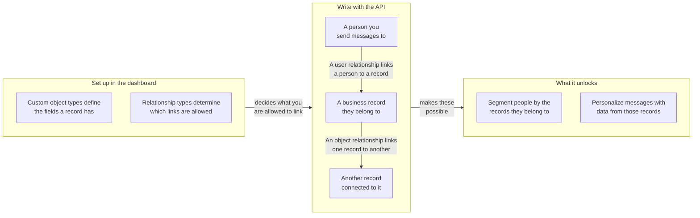

## Basis-URL und Authentifizierung {#base-url-and-authentication}

Verwenden Sie Ihren Workspace-REST-Endpunkt und senden Sie `Authorization: Bearer YOUR_REST_API_KEY`. Dieser Abschnitt erklärt, wo Custom-Objects-Endpunkte gehostet werden und wie Anfragen authentifiziert werden.

- Informationen zu Endpunkt-Hosts finden Sie in der [Braze-API-Übersicht]({{site.baseurl}}/api/basics#endpoints).
- Alle Anfrage- und Antwort-Payloads sind JSON.
- Anfragen sind auf den Workspace beschränkt, der den API-Schlüssel besitzt.
- Wenn der Schlüssel eine IP-Zulassungsliste hat, geben nicht zugelassene IP-Adressen `403` zurück.

## API-Schlüsselberechtigungen {#api-key-permissions}

Dieser Abschnitt ordnet jeden Endpunkt seiner erforderlichen Berechtigung zu, damit Sie API-Schlüssel sicher einschränken können.

| Berechtigung | Endpunkt-Gruppe |
|---|---|
| `custom_objects.read` | Typ- und Objekt-Lesevorgänge sowie Objekt-Beziehungs-Lesevorgänge |
| `custom_objects.create` | Objekt erstellen |
| `custom_objects.update` | Objekt ersetzen und aktualisieren |
| `custom_objects.delete` | Objekt löschen |
| `custom_objects.user_relationships.read` | Nutzer:innen-Beziehungs-Lesevorgänge |
| `custom_objects.user_relationships.create` | Nutzer:innen-Beziehung erstellen |
| `custom_objects.user_relationships.update` | Nutzer:innen-Beziehung ersetzen und aktualisieren |
| `custom_objects.user_relationships.delete` | Nutzer:innen-Beziehung löschen |
| `custom_objects.object_relationships.create` | Objekt-Beziehung erstellen |
| `custom_objects.object_relationships.update` | Objekt-Beziehung ersetzen und aktualisieren |
| `custom_objects.object_relationships.delete` | Objekt-Beziehung löschen |
{: .reset-td-br-1 .reset-td-br-2 aria-label="Custom-Objects-Berechtigungsgruppen" }


Objekt-Beziehungs-Lesevorgänge verwenden `custom_objects.read`. Es gibt keine Berechtigung `custom_objects.object_relationships.read`.


## Rate-Limits

Dieser Abschnitt erklärt die Standard-Anfragekontingente und Antwort-Header für Lese- und Schreibverkehr.

| Bucket | Standardlimit |
|---|---|
| Custom-Objects-Lesevorgänge | 50 Anfragen pro Minute |
| Custom-Objects-Schreibvorgänge | 50 Anfragen pro Minute |
{: .reset-td-br-1 .reset-td-br-2 aria-label="Custom-Objects-Standard-Rate-Limits" }

Jede Antwort enthält `X-RateLimit-Limit`, `X-RateLimit-Remaining` und `X-RateLimit-Reset`.

Für gedrosselte Anfragen gibt Braze `429` und ein Fehler-Payload mit `id` und `message` zurück.

```json
{
  "errors": [
    {
      "id": "rate-limit-exceeded",
      "message": "You have exceeded your limit of 50 requests per minute."
    }
  ]
}
```

## Grundlegende Konzepte {#core-concepts}

Dieser Abschnitt definiert die wichtigsten Bezeichner, die über alle Custom-Objects-Endpunkte hinweg verwendet werden.

- `type_name`: Der Maschinenname des angepassten Objekttyps, eindeutig innerhalb eines Workspace.
- `external_id`: Ihr Objektbezeichner, eindeutig innerhalb eines Typs.
- `braze_id`: Die Braze-Nutzer:innen-ID, die auf Nutzer:innen-Beziehungs-Endpunkten verwendet wird.
- `attributes`: Feldname-basiertes Objekt oder Beziehungsdaten, die gegen das konfigurierte Schema validiert werden.

## Wie Beziehungen funktionieren {#how-relationships-work}

Dieser Abschnitt erklärt Beziehungstypen, Beziehungskanten und das `anchor`-Verhalten, bevor Sie die Endpunkt-Referenzseiten verwenden.

### Beziehungsmodell auf einen Blick {#relationship-model-at-a-glance}

Verwenden Sie dieses Diagramm, um zu sehen, wie Typen, Datensätze und Beziehungen zusammenpassen und was deren Verknüpfung in Braze ermöglicht. Sie definieren die Typen im Dashboard und erstellen dann die Datensätze und die Verknüpfungen zwischen ihnen über diese Endpunkte.



### Typen und Kanten sind getrennt {#types-and-edges-are-separate}

- Beziehungstypen definieren, welche Verknüpfungen zulässig sind, und werden im Dashboard verwaltet.
- Beziehungskanten sind die tatsächlichen Verknüpfungen zwischen Datensätzen und werden über diese API-Endpunkte erstellt, aktualisiert und gelöscht.
- Bevor Sie Beziehungen schreiben, listen Sie gültige `rel_kind`-Werte auf mit:
  - `GET /custom_objects/types/{type_name}/user_relationship_types`
  - `GET /custom_objects/types/{type_name}/object_relationship_types`

### Warum Objekt-Beziehungen `related_type_name` erfordern {#why-object-relationships-require-related_type_name}

- `rel_kind` ist nicht global eindeutig über alle Objekttyppaare hinweg. Zum Beispiel kann `rel_kind` für ein Paar von Objekttypen `subaccount` und für ein anderes `partner_account` sein.
- Objekt-Beziehungs-Schreibvorgänge erfordern daher sowohl `rel_kind` als auch `related_type_name`, um den beabsichtigten Beziehungstyp zusammen mit dem anderen Objekttyp in der Zuordnung zu identifizieren.
- Wenn `related_type_name` nicht zum Beziehungstyp für diesen `rel_kind` passt, gibt die Anfrage `400` zurück.

### `anchor` steuert die Beziehungsrichtung {#anchor-controls-relationship-direction}

Objekt-Beziehungen sind gerichtet. Das URL-Objekt wird basierend auf `anchor` interpretiert.

| `anchor` | Rolle des URL-Objekts | Schlüssel des verwandten Objekts in Antworten |
|---|---|---|
| `source` (Standard) | Von-Seite (ausgehende Kante) | `to_custom_object` |
| `target` | Zu-Seite (eingehende Kante) | `from_custom_object` |
{: .reset-td-br-1 .reset-td-br-2 .reset-td-br-3 aria-label="Anchor-Verhalten für Objekt-Beziehungen" }

Das Erstellen derselben Kante aus der entgegengesetzten Anchor-Perspektive zielt weiterhin auf eine zugrunde liegende Beziehung ab. Ein zweiter Erstellungsaufruf für dieselbe Kante gibt `409` (`duplicate-object-relationship`) zurück.

### Pfad-Asymmetrie bei Nutzer:innen-Beziehungen {#path-asymmetry-for-user-relationships}

Lese- und Schreibvorgänge für Nutzer:innen-Beziehungen verwenden absichtlich unterschiedliche Endpunkt-Pfade:

- Lesen: `GET /custom_objects/objects/{type_name}/{external_id}/user_relationships`
- Schreiben: `POST|PUT|PATCH|DELETE /custom_objects/objects/{type_name}/{external_id}/users`

### Beziehungsattribute sind getrennt von Objektattributen {#relationship-attributes-are-separate-from-object-attributes}

- Beziehungs-Endpunkte geben Attribute auf Kantenebene im Top-Level-Feld `attributes` zurück.
- Objektattribute bleiben verschachtelt unter `to_custom_object` oder `from_custom_object`.
- `PUT` ersetzt Beziehungs-`attributes`, und `PATCH` führt Beziehungs-`attributes` zusammen.

### Praxisbeispiel {#worked-example}

Dieses Beispiel zeigt einen typischen Konto-Workflow:

1. Erstellen Sie `account/acct-123`.
2. Erstellen Sie `account/acct-456` als Unterkonto.
3. Verknüpfen Sie eine Nutzer:in mit `acct-123` über `rel_kind: account_user`.
4. Verknüpfen Sie `acct-123` mit `acct-456` über `rel_kind: subaccount`.

Um die Verknüpfungen zurückzulesen:

- `GET /custom_objects/objects/account/acct-123/user_relationships` für verknüpfte Nutzer:innen
- `GET /custom_objects/objects/account/acct-123/object_relationships` für ausgehende Objekt-Verknüpfungen
- `GET /custom_objects/objects/account/acct-456/object_relationships?anchor=target` für eingehende Objekt-Verknüpfungen


Die `DELETE`-Endpunkte für Objekt-Beziehungen und Nutzer:innen-Beziehungen erfordern einen JSON-Anfragekörper.


## Paginierung und Datenaktualität {#pagination-and-data-freshness}

Dieser Abschnitt behandelt das Paginierungsverhalten bei Listenabfragen und die erwartete Sichtbarkeit von Daten nach Schreibvorgängen.

- Listen-Endpunkte unterstützen `limit` und `offset`.
- `limit` ist standardmäßig `100` und wird auf `1` bis `250` begrenzt.
- `offset` ist standardmäßig `0`, und negative Werte werden auf `0` gesetzt.
- Schreibvorgänge sind sofort für Lesevorgänge und Liquid-Personalisierung sichtbar.
- Segment-Mitgliedschaften basierend auf Custom Objects können bis zu einer Stunde verzögert sein, da berechnete Filter stündlich aktualisiert werden.

## Fehlerverhalten {#error-behavior}

Dieser Abschnitt fasst Status- und Fehlerantwortmuster zusammen, die über die Custom-Objects-Endpunkte hinweg verwendet werden.

- `404`, `409`, `422` und `429` geben ein `errors`-Array mit `id` und `message` zurück.
- `400`, `401` und `403` geben einen einzelnen `error`-String zurück.
- Vertragsbasierte `422`-Limits variieren je nach Unternehmen.