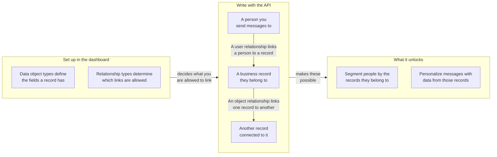

## Basis-URL und Authentifizierung {#base-url-and-authentication}

Verwenden Sie Ihren Workspace-REST-Endpunkt und senden Sie `Authorization: Bearer YOUR_REST_API_KEY`. Dieser Abschnitt erklärt, wo die Datenobjekt-Endpunkte gehostet werden und wie Anfragen authentifiziert werden.

- Informationen zu Endpunkt-Hosts finden Sie in der [Braze-API-Übersicht]({{site.baseurl}}/api/basics#endpoints).
- Alle Anfrage- und Antwort-Payloads sind JSON.
- Anfragen sind auf den Workspace beschränkt, dem der API-Schlüssel gehört.
- Wenn der Schlüssel eine IP-Zulassungsliste hat, geben nicht zugelassene IP-Adressen `403` zurück.

## API-Schlüsselberechtigungen {#api-key-permissions}

Dieser Abschnitt ordnet jedem Endpunkt die erforderliche Berechtigung zu, damit Sie API-Schlüssel sicher einschränken können.

| Berechtigung | Endpunktgruppe |
|---|---|
| `data_objects.read` | Lese-Zugriff auf Typen und Objekte sowie auf Objektbeziehungen |
| `data_objects.create` | Objekt erstellen |
| `data_objects.update` | Objekt ersetzen und aktualisieren |
| `data_objects.delete` | Objekt löschen |
| `data_objects.user_relationships.read` | Lese-Zugriff auf Nutzer:innenbeziehungen |
| `data_objects.user_relationships.create` | Nutzer:innenbeziehung erstellen |
| `data_objects.user_relationships.update` | Nutzer:innenbeziehung ersetzen und aktualisieren |
| `data_objects.user_relationships.delete` | Nutzer:innenbeziehung löschen |
| `data_objects.object_relationships.create` | Objektbeziehung erstellen |
| `data_objects.object_relationships.update` | Objektbeziehung ersetzen und aktualisieren |
| `data_objects.object_relationships.delete` | Objektbeziehung löschen |
{: .reset-td-br-1 .reset-td-br-2 aria-label="Datenobjekt-Berechtigungsgruppen" }


Lese-Zugriffe auf Objektbeziehungen verwenden `data_objects.read`. Es gibt keine separate Berechtigung `data_objects.object_relationships.read`.


## Rate-Limits

Dieser Abschnitt erklärt die standardmäßigen Anfragekontingente und Antwort-Header für Lese- und Schreib-Traffic.

| Bucket | Standard-Limit |
|---|---|
| Datenobjekte – Lesen | 50 Anfragen pro Minute |
| Datenobjekte – Schreiben | 50 Anfragen pro Minute |
{: .reset-td-br-1 .reset-td-br-2 aria-label="Standardmäßige Rate-Limits für Datenobjekte" }

Jede Antwort enthält `X-RateLimit-Limit`, `X-RateLimit-Remaining` und `X-RateLimit-Reset`.

Bei gedrosselten Anfragen gibt Braze `429` und ein Fehler-Payload mit `id` und `message` zurück.

```json
{
  "errors": [
    {
      "id": "rate-limit-exceeded",
      "message": "You have exceeded your limit of 50 requests per minute."
    }
  ]
}
```

## Kernkonzepte {#core-concepts}

Dieser Abschnitt definiert die wichtigsten Bezeichner, die über alle Datenobjekt-Endpunkte hinweg verwendet werden.

- `type_name`: Der Maschinenname des Datenobjekttyps, eindeutig innerhalb eines Workspace.
- `external_id`: Ihr Objektbezeichner, eindeutig innerhalb eines Typs.
- `braze_id`: Die Braze-Nutzer:innen-ID, die bei Nutzer:innenbeziehungs-Endpunkten verwendet wird.
- `attributes`: Ein nach Feldnamen geschlüsseltes Objekt oder Beziehungsdaten, die gegen das konfigurierte Schema validiert werden.

## Wie Beziehungen funktionieren {#how-relationships-work}

Dieser Abschnitt erklärt Beziehungstypen, Beziehungskanten und das Verhalten von `anchor`, bevor Sie die Endpunkt-Referenzseiten verwenden.

### Beziehungsmodell im Überblick {#relationship-model-at-a-glance}

Nutzen Sie dieses Diagramm, um zu sehen, wie Typen, Datensätze und Beziehungen zusammenpassen und was deren Verknüpfung in Braze ermöglicht. Sie definieren die Typen im Dashboard und schreiben die Datensätze sowie die Verknüpfungen zwischen ihnen über diese Endpunkte.



### Typen und Kanten sind getrennt {#types-and-edges-are-separate}

- Beziehungstypen definieren, welche Verknüpfungen gültig sind, und werden im Dashboard verwaltet.
- Beziehungskanten sind die tatsächlichen Verknüpfungen zwischen Datensätzen und werden über diese API-Endpunkte erstellt, aktualisiert und gelöscht.
- Bevor Sie Beziehungen schreiben, listen Sie gültige `rel_kind`-Werte auf mit:
  - `GET /data_objects/types/{type_name}/user_relationship_types`
  - `GET /data_objects/types/{type_name}/object_relationship_types`

### Warum Objektbeziehungen `related_type_name` erfordern {#why-object-relationships-require-related_type_name}

- `rel_kind` ist nicht global eindeutig über alle Objekttyp-Paare hinweg. Zum Beispiel kann `rel_kind` für ein Objekttyp-Paar `subaccount` und für ein anderes `partner_account` sein.
- Schreibvorgänge für Objektbeziehungen erfordern daher sowohl `rel_kind` als auch `related_type_name`, um den beabsichtigten Beziehungstyp zusammen mit dem anderen Objekttyp in der Zuordnung zu identifizieren.
- Wenn `related_type_name` nicht zum Beziehungstyp für diesen `rel_kind` passt, gibt die Anfrage `400` zurück.

### `anchor` steuert die Beziehungsrichtung {#anchor-controls-relationship-direction}

Objektbeziehungen sind gerichtet. Das URL-Objekt wird basierend auf `anchor` interpretiert.

| `anchor` | Rolle des URL-Objekts | Schlüssel des zugehörigen Objekts in Antworten |
|---|---|---|
| `source` (Standard) | Von-Seite (ausgehende Kante) | `to_data_object` |
| `target` | Zu-Seite (eingehende Kante) | `from_data_object` |
{: .reset-td-br-1 .reset-td-br-2 .reset-td-br-3 aria-label="Anchor-Verhalten für Objektbeziehungen" }

Das Erstellen derselben Kante aus der entgegengesetzten Anchor-Perspektive zielt weiterhin auf eine einzige zugrunde liegende Beziehung ab. Ein zweiter Erstellungsaufruf für dieselbe Kante gibt `409` (`duplicate-object-relationship`) zurück.

### Pfad-Asymmetrie bei Nutzer:innenbeziehungen {#path-asymmetry-for-user-relationships}

Lese- und Schreibvorgänge für Nutzer:innenbeziehungen verwenden absichtlich unterschiedliche Endpunkt-Pfade:

- Lesen: `GET /data_objects/objects/{type_name}/{external_id}/user_relationships`
- Schreiben: `POST|PUT|PATCH|DELETE /data_objects/objects/{type_name}/{external_id}/users`

### Beziehungsattribute sind getrennt von Objektattributen {#relationship-attributes-are-separate-from-object-attributes}

- Beziehungsendpunkte geben Attribute auf Kantenebene im `attributes`-Feld der obersten Ebene zurück.
- Objektattribute bleiben verschachtelt unter `to_data_object` oder `from_data_object`.
- `PUT` ersetzt die `attributes` der Beziehung und `PATCH` führt die `attributes` der Beziehung zusammen.

### Praxisbeispiel {#worked-example}

Dieses Beispiel zeigt einen typischen Account-Workflow:

1. Erstellen Sie `account/acct-123`.
2. Erstellen Sie `account/acct-456` als Unter-Account.
3. Verknüpfen Sie eine:n Nutzer:in mit `acct-123` über `rel_kind: account_user`.
4. Verknüpfen Sie `acct-123` mit `acct-456` über `rel_kind: subaccount`.

Um die Verknüpfungen abzurufen:

- `GET /data_objects/objects/account/acct-123/user_relationships` für verknüpfte Nutzer:innen
- `GET /data_objects/objects/account/acct-123/object_relationships` für ausgehende Objektverknüpfungen
- `GET /data_objects/objects/account/acct-456/object_relationships?anchor=target` für eingehende Objektverknüpfungen


Die `DELETE`-Endpunkte für Objektbeziehungen und Nutzer:innenbeziehungen erfordern einen JSON-Anfragekörper.


## Paginierung und Datenaktualität {#pagination-and-data-freshness}

Dieser Abschnitt behandelt das Paginierungsverhalten bei Listenendpunkten und die erwartete Datenverfügbarkeit nach Schreibvorgängen.

- Listenendpunkte unterstützen `limit` und `offset`.
- `limit` ist standardmäßig `100` und wird auf den Bereich `1` bis `250` begrenzt.
- `offset` ist standardmäßig `0`, und negative Werte werden auf `0` gerundet.
- Schreibvorgänge sind sofort für Lesezugriffe und Liquid-Personalisierung sichtbar.
- Die Segmentzugehörigkeit basierend auf Datenobjekten kann bis zu einer Stunde verzögert sein, da berechnete Filter stündlich aktualisiert werden.

## Fehlerverhalten {#error-behavior}

Dieser Abschnitt fasst die Status- und Fehlerantwortmuster zusammen, die über die Datenobjekt-Endpunkte hinweg verwendet werden.

- `404`, `409`, `422` und `429` geben ein `errors`-Array mit `id` und `message` zurück.
- `400`, `401` und `403` geben einen einzelnen `error`-String zurück.
- Vertragsbasierte `422`-Limits variieren je nach Unternehmen.