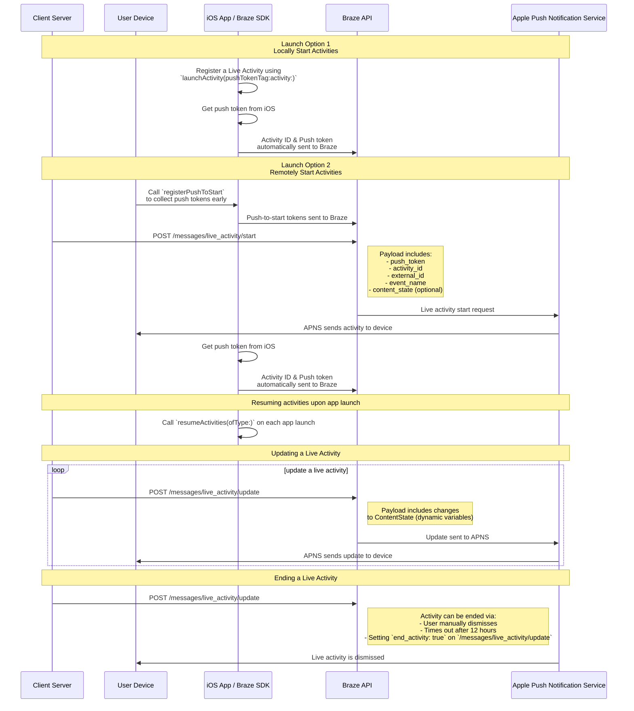

# Live-Aktivitäten für Swift

> Erfahren Sie, wie Sie Live-Aktivitäten für das Swift Braze SDK implementieren. Live-Aktivitäten sind persistente, interaktive Benachrichtigungen, die direkt auf dem Sperrbildschirm angezeigt werden und es Nutzer:innen ermöglichen, dynamische Realtime-Updates zu erhalten&#8212;ohne ihr Gerät zu entsperren.

## Funktionsweise

{: style="max-width:40%;float:right;margin-left:15px;"}

Live-Aktivitäten stellen eine Kombination aus statischen und dynamischen Informationen dar, die Sie aktualisieren. Sie können zum Beispiel eine Live-Aktivität mit einem Status-Tracker für eine Zustellung erstellen. Diese Live-Aktivität enthält den Namen Ihres Unternehmens als statische Information sowie eine dynamische „Zeit bis zur Lieferung", die aktualisiert wird, wenn sich der Zusteller seinem Ziel nähert.

Als Entwickler:in können Sie mit Braze Ihre Live-Aktivitäts-Lebenszyklen verwalten, die Braze REST API aufrufen, um Live-Aktivitäts-Updates durchzuführen, und dafür sorgen, dass alle abonnierten Geräte das Update so schnell wie möglich erhalten. Und da Sie die Live-Aktivitäten über Braze verwalten, können Sie sie zusammen mit Ihren anderen Messaging-Kanälen&mdash;Push-Benachrichtigungen, In-App-Nachrichten, Content-Cards&mdash;einsetzen, um die Akzeptanz zu steigern.

## Sequenzdiagramm {#sequence-diagram}









## Eine Live-Aktivität implementieren

# Außerdem müssen Sie Folgendes abschließen:

- Stellen Sie sicher, dass Ihr Projekt auf iOS 16.1 oder höher ausgerichtet ist.
- Fügen Sie die `Push Notification`-Berechtigung unter **Signing & Capabilities** in Ihrem Xcode-Projekt hinzu.
- Vergewissern Sie sich, dass `.p8`-Schlüssel zum Senden von Benachrichtigungen verwendet werden. Ältere Dateien wie `.p12` oder `.pem` werden nicht unterstützt.
- Ab Version 8.2.0 des Braze Swift SDK können Sie [eine Live-Aktivität remote registrieren](#swift_step-2-start-the-activity). Um dieses Feature zu nutzen, ist iOS 17.2 oder höher erforderlich.


Live-Aktivitäten und Push-Benachrichtigungen sind zwar ähnlich, aber ihre Systemberechtigungen sind unterschiedlich. Standardmäßig sind alle Features für Live-Aktivitäten aktiviert, aber Nutzer:innen können dieses Feature pro App deaktivieren.




### 1. Schritt: Eine Aktivität erstellen {#create-an-activity}

Vergewissern Sie sich zunächst, dass Sie in Ihrer iOS-Anwendung Live-Aktivitäten wie unter [Displaying live data with Live Activities](https://developer.apple.com/documentation/activitykit/displaying-live-data-with-live-activities) in der Apple-Dokumentation beschrieben eingerichtet haben. Stellen Sie dabei sicher, dass Sie `NSSupportsLiveActivities` mit der Einstellung `YES` in Ihre `Info.plist` aufnehmen.

Da die genaue Art Ihrer Live-Aktivität spezifisch für Ihren Geschäftsfall ist, müssen Sie die [Aktivitätsobjekte](https://developer.apple.com/documentation/activitykit/activityattributes) einrichten und initialisieren. Insbesondere müssen Sie Folgendes definieren:
* `ActivityAttributes`: Dieses Protokoll definiert die statischen (unveränderlichen) und die dynamischen (sich ändernden) Inhalte Ihrer Live-Aktivität.
* `ActivityAttributes.ContentState`: Dieser Typ definiert die dynamischen Daten, die im Verlauf der Aktivität aktualisiert werden.

Außerdem verwenden Sie SwiftUI, um die UI-Darstellung des Sperrbildschirms und der Dynamic Island auf unterstützten Geräten zu erstellen. 

Stellen Sie sicher, dass Sie mit den [Voraussetzungen und Einschränkungen](https://developer.apple.com/documentation/activitykit/displaying-live-data-with-live-activities#Understand-constraints) von Apple für Live-Aktivitäten vertraut sind, da diese Einschränkungen unabhängig von Braze gelten.


Wenn Sie erwarten, häufig Push-Nachrichten an dieselbe Live-Aktivität zu senden, können Sie eine Drosselung durch Apples Budgetgrenze vermeiden, indem Sie `NSSupportsLiveActivitiesFrequentUpdates` in Ihrer `Info.plist`-Datei auf `YES` setzen. Weitere Einzelheiten finden Sie im Abschnitt [`Determine the update frequency`](https://developer.apple.com/documentation/activitykit/updating-and-ending-your-live-activity-with-activitykit-push-notifications#Determine-the-update-frequency) der ActivityKit-Dokumentation.


#### Beispiel

Stellen wir uns vor, wir möchten eine Live-Aktivität erstellen, um unsere Nutzer:innen über die Superb Owl Show auf dem Laufenden zu halten, bei der zwei konkurrierende Tierrettungsorganisationen Punkte für die Eulen erhalten, die sie beherbergen. Für dieses Beispiel haben wir eine Struktur namens `SportsActivityAttributes` erstellt. Sie können jedoch auch Ihre eigene Implementierung von `ActivityAttributes` verwenden.

```swift
#if canImport(ActivityKit)
  import ActivityKit
#endif

@available(iOS 16.1, *)
struct SportsActivityAttributes: ActivityAttributes {
  public struct ContentState: Codable, Hashable {
    var teamOneScore: Int
    var teamTwoScore: Int
  }

  var gameName: String
  var gameNumber: String
}
```

### 2. Schritt: Die Aktivität starten {#start-the-activity}

Wählen Sie zunächst, wie Sie Ihre Aktivität registrieren möchten:

- **Remote:** Verwenden Sie die [`registerPushToStart`](<http://braze-inc.github.io/braze-swift-sdk/documentation/brazekit/braze/liveactivities-swift.class/registerpushtostart(fortype:name:)>)-Methode zu einem frühen Zeitpunkt im Lebenszyklus Ihrer Nutzer:innen und bevor das Push-to-Start-Token benötigt wird, und starten Sie dann eine Aktivität über den [`/messages/live_activity/start`]({{site.baseurl}}/api/endpoints/messaging/live_activity/start)-Endpunkt.
- **Lokal:** Erstellen Sie eine Instanz Ihrer Live-Aktivität und verwenden Sie dann die [`launchActivity`](<https://braze-inc.github.io/braze-swift-sdk/documentation/brazekit/braze/liveactivities-swift.class/launchactivity(pushtokentag:activity:fileid:line:)>)-Methode, um Push-Token zu erstellen, die Braze verwalten soll.




Um eine Live-Aktivität remote zu registrieren, ist iOS 17.2 oder höher erforderlich.


#### Schritt 2.1: BrazeKit zu Ihrer Widget-Erweiterung hinzufügen

Wählen Sie in Ihrem Xcode-Projekt den Namen Ihrer App und dann **General** aus. Prüfen Sie unter **Frameworks and Libraries**, ob `BrazeKit` aufgeführt ist.


#### Schritt 2.2: Das Protokoll BrazeLiveActivityAttributes hinzufügen {#brazeActivityAttributes}

Fügen Sie in Ihrer `ActivityAttributes`-Implementierung die Konformität mit dem `BrazeLiveActivityAttributes`-Protokoll hinzu und ergänzen Sie die Eigenschaft `brazeActivityId` in Ihrem Attribut-Modell.


iOS bildet die Eigenschaft `brazeActivityId` auf das entsprechende Feld in Ihrer Push-to-Start-Payload für Live-Aktivitäten ab. Sie sollte daher nicht umbenannt oder mit einem anderen Wert versehen werden.


```swift
import BrazeKit

#if canImport(ActivityKit)
  import ActivityKit
#endif

@available(iOS 16.1, *)
// 1. Add the `BrazeLiveActivityAttributes` conformance to your `ActivityAttributes` struct.
struct SportsActivityAttributes: ActivityAttributes, BrazeLiveActivityAttributes {
  public struct ContentState: Codable, Hashable {
    var teamOneScore: Int
    var teamTwoScore: Int
  }

  var gameName: String
  var gameNumber: String

  // 2. Add the `String?` property to represent the activity ID.
  var brazeActivityId: String?
}
```

#### Schritt 2.3: Für Push-to-Start registrieren

Als Nächstes registrieren Sie den Typ der Live-Aktivität, damit Braze alle Push-to-Start-Token und Live-Aktivitätsinstanzen verfolgen kann, die mit diesem Typ verknüpft sind.


Das iOS-Betriebssystem erzeugt Push-to-Start-Token nur bei der ersten App-Installation nach einem Geräteneustart. Um sicherzustellen, dass Ihre Token zuverlässig registriert werden, rufen Sie `registerPushToStart` in der Methode `didFinishLaunchingWithOptions` auf.


###### Beispiel

Im folgenden Beispiel verarbeitet die Klasse `LiveActivityManager` Live-Aktivitätsobjekte. Anschließend registriert die Methode `registerPushToStart` den Typ `SportsActivityAttributes`:

```swift
import BrazeKit

#if canImport(ActivityKit)
  import ActivityKit
#endif

class LiveActivityManager {

  @available(iOS 17.2, *)
  func registerActivityType() {
    // This method returns a Swift background task.
    // You may keep a reference to this task if you need to cancel it wherever appropriate, or ignore the return value if you wish.
    let pushToStartObserver: Task = Self.braze?.liveActivities.registerPushToStart(
      forType: Activity<SportsActivityAttributes>.self,
      name: "SportsActivityAttributes"
    )
  }

}
```

#### Schritt 2.4: Push-to-Start-Benachrichtigung senden

Senden Sie remote eine Push-to-Start-Benachrichtigung über den Endpunkt [`/messages/live_activity/start`]({{site.baseurl}}/api/endpoints/messaging/live_activity/start).



Sie können [Apples ActivityKit-Framework](https://developer.apple.com/documentation/activitykit) verwenden, um ein Push-Token zu erhalten, das das Braze SDK für Sie verwalten kann. Damit können Sie Live-Aktivitäten über die Braze API aktualisieren, da Braze das Push-Token im Backend an den Apple Push Notification Service (APNs) sendet.

1. Erstellen Sie eine Instanz Ihrer Live-Activity-Implementierung unter Verwendung der ActivityKit-APIs von Apple.
2. Setzen Sie den Parameter `pushType` auf `.token`. 
3. Übergeben Sie die von Ihnen definierten `ActivitiesAttributes` und `ContentState` für Live-Aktivitäten. 
4. Registrieren Sie Ihre Aktivität bei Ihrer Braze-Instanz, indem Sie sie an [`launchActivity(pushTokenTag:activity:)`](https://braze-inc.github.io/braze-swift-sdk/documentation/brazekit/braze/liveactivities-swift.class) übergeben. Der Parameter `pushTokenTag` ist ein von Ihnen definierter String. Er sollte für jede Live-Aktivität, die Sie erstellen, eindeutig sein.

Sobald Sie die Live-Aktivität registriert haben, extrahiert und beobachtet das Braze SDK Änderungen an den Push-Token.

#### Beispiel

Für unser Beispiel erstellen wir eine Klasse namens `LiveActivityManager` als Schnittstelle für unsere Live-Activity-Objekte. Dann setzen wir den `pushTokenTag` auf `"sports-game-2024-03-15"`.

```swift
import BrazeKit

#if canImport(ActivityKit)
  import ActivityKit
#endif

class LiveActivityManager {
  
  @available(iOS 16.2, *)
  func createActivity() {
    let activityAttributes = SportsActivityAttributes(gameName: "Superb Owl", gameNumber: "Game 1")
    let contentState = SportsActivityAttributes.ContentState(teamOneScore: "0", teamTwoScore: "0")
    let activityContent = ActivityContent(state: contentState, staleDate: nil)
    if let activity = try? Activity.request(attributes: activityAttributes,
                                            content: activityContent,
      // Setting your pushType as .token allows the Activity to generate push tokens for the server to watch.
                                            pushType: .token) {
      // Register your Live Activity with Braze using the pushTokenTag.
      // This method returns a Swift background task.
      // You may keep a reference to this task if you need to cancel it wherever appropriate, or ignore the return value if you wish.
      let liveActivityObserver: Task = AppDelegate.braze?.liveActivities.launchActivity(pushTokenTag: "sports-game-2024-03-15",
                                                                                        activity: activity)
    }
  }
  
}
```

Ihr Live-Aktivitäts-Widget zeigt Ihren Nutzer:innen diese anfänglichen Inhalte an. 

{: style="max-width:40%;"}



### 3. Schritt: Tracking der Aktivitäten fortsetzen {#resume-activity-tracking}

So stellen Sie sicher, dass Braze Ihre Live-Aktivitäten beim Start der App verfolgt:

1. Öffnen Sie Ihre `AppDelegate`-Datei.
2. Importieren Sie das Modul `ActivityKit`, wenn es verfügbar ist.
3. Rufen Sie [`resumeActivities(ofType:)`](https://braze-inc.github.io/braze-swift-sdk/documentation/brazekit/braze/liveactivities-swift.class/resumeactivities(oftype:)) in `application(_:didFinishLaunchingWithOptions:)` für alle `ActivityAttributes`-Typen auf, die Sie in Ihrer Anwendung registriert haben.

Dadurch kann Braze die Aufgaben zur Verfolgung von Push-Token-Aktualisierungen für alle aktiven Live-Aktivitäten wieder aufnehmen. Beachten Sie: Wenn Nutzer:innen die Live-Aktivität explizit auf ihrem Gerät geschlossen haben, gilt sie als entfernt und Braze verfolgt sie nicht mehr.

###### Beispiel

```swift
import UIKit
import BrazeKit

#if canImport(ActivityKit)
  import ActivityKit
#endif

@main
class AppDelegate: UIResponder, UIApplicationDelegate {

  static var braze: Braze? = nil

  func application(
    _ application: UIApplication,
    didFinishLaunchingWithOptions launchOptions: [UIApplication.LaunchOptionsKey: Any]?
  ) -> Bool {
    
    if #available(iOS 16.1, *) {
      Self.braze?.liveActivities.resumeActivities(
        ofType: Activity<SportsActivityAttributes>.self
      )
    }

    return true
  }
}
```

### 4. Schritt: Die Aktivität aktualisieren {#update-the-activity}

{: style="max-width:40%;float:right;margin-left:15px;"}

Über den Endpunkt [`/messages/live_activity/update`]({{site.baseurl}}/api/endpoints/messaging/live_activity/update) können Sie eine Live-Aktivität durch Push-Benachrichtigungen aktualisieren, die über die Braze REST API übermittelt werden. Verwenden Sie diesen Endpunkt, um den `ContentState` Ihrer Live-Aktivität zu aktualisieren.

Wenn Sie Ihren `ContentState` aktualisieren, zeigt das Live-Aktivitäts-Widget die neuen Informationen an. So könnte die Superb Owl Show am Ende der ersten Halbzeit aussehen.

Ausführliche Informationen finden Sie in unserem Artikel zum [`/messages/live_activity/update`-Endpunkt]({{site.baseurl}}/api/endpoints/messaging/live_activity/update).

### 5. Schritt: Die Aktivität beenden {#end-the-activity}

Wenn eine Live-Aktivität aktiv ist, wird sie sowohl auf dem Sperrbildschirm der Nutzer:innen als auch in der Dynamic Island angezeigt. Um sie über Braze zu beenden, verwenden Sie den Endpunkt [`/messages/live_activity/update`]({{site.baseurl}}/api/endpoints/messaging/live_activity/update) mit `end_activity` auf `true` gesetzt.

Um die Zuverlässigkeit beim Beenden einer Live-Aktivität zu verbessern, führen Sie die folgenden optionalen Schritte aus:

1. Fügen Sie optional `dismissal_date` in derselben `update`-Anfrage hinzu, um vorzuschlagen, wann iOS die Live-Aktivitäts-UI entfernen soll.
2. Überprüfen Sie die Zustellungsergebnisse im [Nachrichten-Aktivitätsprotokoll]({{site.baseurl}}/user_guide/administrative/app_settings/message_activity_log_tab/).

#### Automatisches Ausblenden einrichten

Um ein automatisches Ausblenden einzurichten, planen Sie eine Folgeanfrage an den Update-Endpunkt, nachdem Sie die Live-Aktivität gestartet haben.

1. Senden Sie eine `/messages/live_activity/start`-Anfrage mit einer `activity_id`, die Sie verfolgen können.
2. Speichern Sie diese `activity_id` und Ihre gewünschte Endzeit in Ihrem Backend-Scheduler.
3. Senden Sie zum gewünschten Endzeitpunkt eine `/messages/live_activity/update`-Anfrage mit `end_activity` auf `true` gesetzt.
4. Konfigurieren Sie das Ausblendungsdatum in derselben Update-Anfrage. Details finden Sie beim [`/messages/live_activity/update`]({{site.baseurl}}/api/endpoints/messaging/live_activity/update)-Endpunkt.

Beachten Sie, dass der Zeitpunkt des Ausblendens von iOS gesteuert wird. Auch nachdem Sie eine gültige Beendigungsanfrage gesendet haben, kann die Entfernung vom Sperrbildschirm oder der Dynamic Island verzögert sein oder sich je nach Bedingungen auf Betriebssystemebene unterschiedlich verhalten.

Eine Live-Aktivität kann auch außerhalb von Braze enden:

* **Ausblendung durch Nutzer:innen**: Nutzer:innen können eine Live-Aktivität manuell ausblenden.
* **Timeout**: Nach einer Standardzeit von 8 Stunden entfernt iOS die Live-Aktivität aus der Dynamic Island. Nach einer Standardzeit von 12 Stunden entfernt iOS die Live-Aktivität vom Sperrbildschirm.

Ausführliche Informationen finden Sie in unserem Artikel zum [`/messages/live_activity/update`-Endpunkt]({{site.baseurl}}/api/endpoints/messaging/live_activity/update).

## Tracking von Live-Aktivitäten

Live-Aktivitätsereignisse sind in Currents, Snowflake Data Sharing und Query Builder verfügbar. Die folgenden Ereignisse helfen Ihnen dabei, den Lebenszyklus Ihrer Live-Aktivitäten zu verstehen und zu überwachen, die Verfügbarkeit von Token zu verfolgen und Probleme unabhängig zu diagnostizieren oder den Zustellungsstatus zu überprüfen.

- [Änderung des Live-Aktivitäts-Push-to-Start-Tokens]({{site.baseurl}}/user_guide/data/braze_currents/event_glossary/customer_behavior_events/#live-activity-push-to-start-token-change-events): Erfasst, wenn ein Push-to-Start-Token (PTS) in Braze hinzugefügt oder aktualisiert wird, sodass Sie die Registrierung und Verfügbarkeit von Token pro Nutzer:in verfolgen können.
- [Änderung des Live-Aktivitäts-Update-Tokens]({{site.baseurl}}/user_guide/data/braze_currents/event_glossary/customer_behavior_events/#live-activity-update-token-change-events): Verfolgt das Hinzufügen, Aktualisieren oder Entfernen von Live Activity Update (LAU)-Token.
- [Live-Aktivität senden]({{site.baseurl}}/user_guide/data/braze_currents/event_glossary/message_engagement_events/#live-activity-send-events): Protokolliert jedes Mal, wenn eine Live-Aktivität von Braze gestartet, aktualisiert oder beendet wird.
- [Ergebnis der Live-Aktivität]({{site.baseurl}}/user_guide/data/braze_currents/event_glossary/message_engagement_events/#live-activity-outcome-events): Gibt den endgültigen Zustellungsstatus an den Apple Push Notification Service (APNs) für jede von Braze gesendete Live-Aktivität an.

## Häufig gestellte Fragen (FAQ) {#faq}

### Funktionalität und Unterstützung

#### Welche Plattformen unterstützen Live-Aktivitäten?

Derzeit sind Live-Aktivitäten ein Feature, das speziell für iOS und iPadOS verfügbar ist. Standardmäßig werden Aktivitäten, die auf einem iPhone oder iPad gestartet werden, zusätzlich auf allen gekoppelten Geräten mit watchOS 11+ oder macOS 26+ angezeigt.

{: style="max-width:60%;"}

Der Artikel zu Live-Aktivitäten beschreibt die [Voraussetzungen]({{site.baseurl}}/developer_guide/platforms/swift/live_activities/#prerequisites) für die Verwaltung von Live-Aktivitäten über das Braze Swift SDK.

#### Unterstützen React Native-Apps Live-Aktivitäten?

Ja, React Native SDK 3.0.0+ unterstützt Live-Aktivitäten über das Braze Swift SDK. Das bedeutet, dass Sie React Native iOS-Code direkt auf Basis des Braze Swift SDK schreiben müssen. 

Es gibt keine React Native-spezifische JavaScript-Convenience-API für Live-Aktivitäten, da die von Apple bereitgestellten Features für Live-Aktivitäten Sprachen verwenden, die nicht in JavaScript übersetzbar sind (z. B. Swift Concurrency, Generics, SwiftUI).

#### Unterstützt Braze Live-Aktivitäten als Kampagne oder Canvas-Schritt?

Nein, dies wird derzeit nicht unterstützt.

### Push-Benachrichtigungen und Live-Aktivitäten

#### Was passiert, wenn während einer aktiven Live-Aktivität eine Push-Benachrichtigung gesendet wird? 

{: style="max-width:30%;float:right;margin-left:15px;"}

Live-Aktivitäten und Push-Benachrichtigungen belegen unterschiedliche Bereiche auf dem Bildschirm und stehen nicht miteinander in Konflikt.

#### Wenn Live-Aktivitäten die Push-Nachrichtenfunktion nutzen, müssen dann Push-Benachrichtigungen aktiviert sein, um Live-Aktivitäten zu empfangen?

Obwohl Live-Aktivitäten auf Push-Benachrichtigungen für Aktualisierungen angewiesen sind, werden sie durch unterschiedliche Nutzereinstellungen gesteuert. Nutzer:innen können sich für Live-Aktivitäten anmelden und für Push-Benachrichtigungen abmelden – und umgekehrt.

Live-Activity-Update-Token verfallen nach acht Stunden.

#### Sind für Live-Aktivitäten Push-Primer erforderlich?

[Push-Primer]({{site.baseurl}}/user_guide/message_building_by_channel/push/best_practices/push_primer_messages/) sind eine bewährte Methode, um Ihre Nutzer:innen aufzufordern, Push-Benachrichtigungen von Ihrer App zu aktivieren. Es gibt jedoch keine Systemaufforderung, um sich für Live-Aktivitäten anzumelden. Standardmäßig sind Nutzer:innen für Live-Aktivitäten einer App angemeldet, wenn sie diese App unter iOS 16.1 oder höher installieren. Diese Berechtigung kann in den Geräteeinstellungen für jede App einzeln deaktiviert oder wieder aktiviert werden.

### Technische Themen und Fehlerbehebung

#### Wie erkenne ich, ob Live-Aktivitäten Fehler aufweisen?

Fehler in Bezug auf Live-Aktivitäten werden im Braze-Dashboard im [Nachrichten-Aktivitätsprotokoll]({{site.baseurl}}/user_guide/administrative/app_settings/message_activity_log_tab/) protokolliert, wo Sie nach „LiveActivity Errors" filtern können.

#### Warum habe ich nach dem Senden einer Push-to-Start-Benachrichtigung meine Live-Aktivität nicht erhalten?

Überprüfen Sie zunächst, ob Ihre Payload alle erforderlichen Felder enthält, die im Endpunkt [`messages/live_activity/start`]({{site.baseurl}}/api/endpoints/messaging/live_activity/start) beschrieben sind. Die Felder `activity_attributes` und `content_state` sollten mit den im Code Ihres Projekts definierten Eigenschaften übereinstimmen. Wenn Sie sicher sind, dass die Payload korrekt ist, werden Sie möglicherweise durch APNs gedrosselt. Dieses Limit wird von Apple und nicht von Braze festgelegt.

Um zu überprüfen, ob Ihre Push-to-Start-Benachrichtigung erfolgreich auf dem Gerät angekommen ist, aber aufgrund von Rate-Limits nicht angezeigt wurde, können Sie Ihr Projekt mit der Konsolen-App auf Ihrem Mac debuggen. Hängen Sie den Aufzeichnungsprozess für Ihr gewünschtes Gerät an und filtern Sie dann die Protokolle nach `process:liveactivitiesd` in der Suchleiste.

#### Warum empfängt meine Live-Aktivität nach dem Start mit Push-to-Start keine neuen Updates?

Überprüfen Sie, ob Sie die [oben](#swift_brazeActivityAttributes) beschriebenen Anweisungen korrekt umgesetzt haben. Ihre `ActivityAttributes` sollten sowohl die `BrazeLiveActivityAttributes`-Protokollkonformität als auch die Eigenschaft `brazeActivityId` enthalten.

Nachdem Sie eine Push-to-Start-Benachrichtigung für eine Live-Aktivität erhalten haben, überprüfen Sie, ob eine ausgehende Netzwerkanfrage an den Endpunkt `/push_token_tag` Ihrer Braze-URL zu sehen ist und ob diese die korrekte Aktivitäts-ID unter dem Feld `"tag"` enthält.

Stellen Sie abschließend sicher, dass der Attributtyp der Live-Aktivität in Ihrer Update-Payload genau mit dem String und der Klasse übereinstimmt, die in Ihrem SDK-Methodenaufruf von `registerPushToStart` verwendet werden. Verwenden Sie Konstanten, um Tippfehler zu vermeiden.  

#### Ich erhalte die Antwort „Zugriff verweigert", wenn ich versuche, den Endpunkt `live_activity/update` zu verwenden. Warum?

Die von Ihnen verwendeten API-Schlüssel müssen die richtigen Berechtigungen für den Zugriff auf die verschiedenen Braze-API-Endpunkte besitzen. Wenn Sie einen zuvor erstellten API-Schlüssel verwenden, haben Sie möglicherweise versäumt, dessen Berechtigungen zu aktualisieren. Weitere Informationen finden Sie in unserer [Übersicht zur Sicherheit von API-Schlüsseln]({{site.baseurl}}/api/basics/#rest-api-key-security).

#### Teilt der Endpunkt `messages/send` die Rate-Limits mit dem Endpunkt `messages/live_activity/update`? 

Standardmäßig liegt das Rate-Limit für den Endpunkt `messages/live_activity/update` bei 250.000 Anfragen pro Stunde und Workspace, verteilt über mehrere Endpunkte. Weitere Informationen finden Sie unter [API-Rate-Limits]({{site.baseurl}}/api/api_limits/).