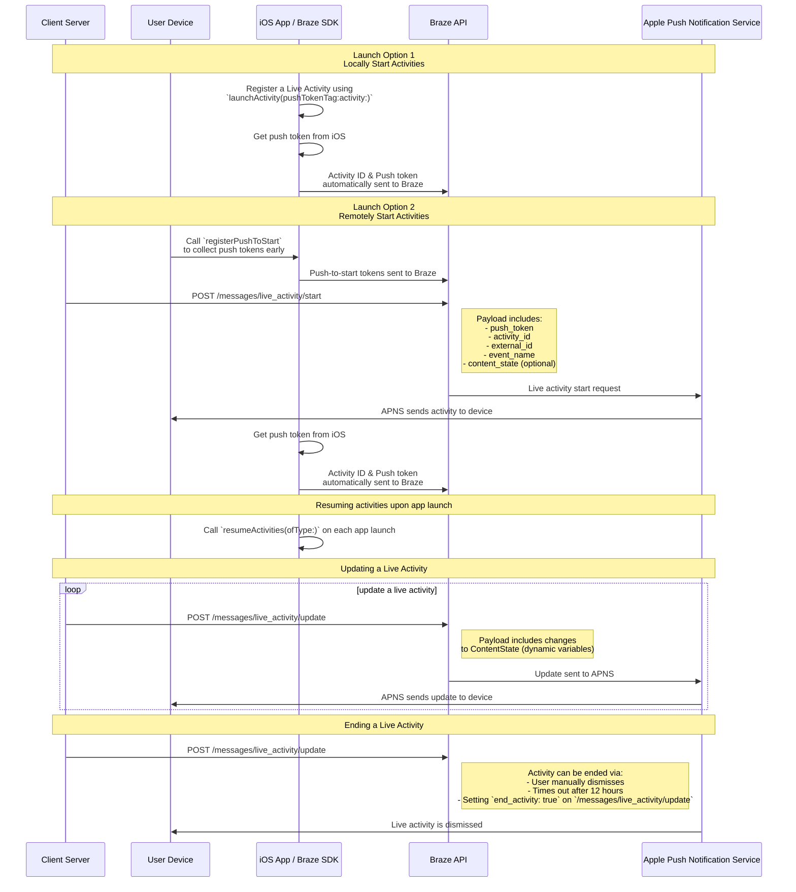

# Live-Aktivitäten für Swift {#live-activities-for-swift}

> Erfahren Sie, wie Sie Live-Aktivitäten für das Swift Braze SDK implementieren. Live-Aktivitäten sind persistente, interaktive Benachrichtigungen, die direkt auf dem Sperrbildschirm angezeigt werden und es Nutzer:innen ermöglichen, dynamische Realtime-Updates zu erhalten&#8212;ohne ihr Gerät zu entsperren.

## So funktioniert es {#how-it-works}

{: style="max-width:40%;float:right;margin-left:15px;"}

Live Activities zeigen eine Kombination aus statischen und dynamischen Informationen an, die Sie aktualisieren. Sie können zum Beispiel eine Live Activity erstellen, die einen Status-Tracker für eine Lieferung bereitstellt. Diese Live Activity enthält den Namen Ihres Unternehmens als statische Information sowie eine dynamische „Lieferzeit“, die sich aktualisiert, wenn sich der Lieferfahrer dem Ziel nähert.

Als Entwickler:in können Sie Braze nutzen, um die Lebenszyklen Ihrer Live Activities zu verwalten, Aufrufe an die Braze REST API zu senden, um Live-Activity-Updates durchzuführen, und alle abonnierten Geräte so schnell wie möglich das Update erhalten zu lassen. Und da Sie Live Activities über Braze verwalten, können Sie sie zusammen mit Ihren anderen Messaging-Kanälen einsetzen – Push-Benachrichtigungen, In-App Messages, Content Cards –, um die Akzeptanz zu steigern.

## Sequenzdiagramm {#sequence-diagram}









## Live Activity implementieren {#implementing-a-live-activity}

# Außerdem müssen Sie Folgendes abschließen:

- Stellen Sie sicher, dass Ihr Projekt auf iOS 16.1 oder höher abzielt.
- Fügen Sie die Berechtigung `Push Notification` unter **Signing & Capabilities** in Ihrem Xcode-Projekt hinzu.
- Stellen Sie sicher, dass `.p8`-Schlüssel zum Senden von Benachrichtigungen verwendet werden. Ältere Dateien wie `.p12` oder `.pem` werden nicht unterstützt.
- Ab Version 8.2.0 des Braze Swift SDK können Sie [eine Live Activity remote Registrierung](#swift_step-2-start-the-activity). Um dieses Feature zu nutzen, ist iOS 17.2 oder höher erforderlich.


Obwohl Live Activities und Push-Benachrichtigungen ähnlich sind, sind ihre Systemberechtigungen separat. Standardmäßig sind alle Live-Activity-Features aktiviert, aber Nutzer:innen können dieses Feature pro App deaktivieren.




### Schritt 1: Eine Aktivität erstellen {#create-an-activity}

Stellen Sie zunächst sicher, dass Sie [Displaying live data with Live Activities](https://developer.apple.com/documentation/activitykit/displaying-live-data-with-live-activities) in der Apple-Dokumentation befolgt haben, um Live Activities in Ihrer iOS-Anwendung einzurichten. Stellen Sie im Rahmen dieser Aufgabe sicher, dass Sie `NSSupportsLiveActivities` in Ihrer `Info.plist` auf `YES` setzen.

Da die genaue Art Ihrer Live Activity von Ihrem Geschäftsfall abhängt, richten Sie die [Activity](https://developer.apple.com/documentation/activitykit/activityattributes)-Objekte ein und initialisieren Sie sie. Definieren Sie dabei insbesondere:
* `ActivityAttributes`: Dieses Protokoll definiert die statischen (unveränderlichen) und dynamischen (veränderlichen) Inhalte, die in Ihrer Live Activity angezeigt werden.
* `ActivityAttributes.ContentState`: Dieser Typ definiert die dynamischen Daten, die sich im Laufe der Aktivität aktualisieren.

Sie verwenden auch SwiftUI, um die UI-Darstellung des Sperrbildschirms und der Dynamic Island auf unterstützten Geräten zu erstellen.

Machen Sie sich mit Apples [Voraussetzungen und Einschränkungen](https://developer.apple.com/documentation/activitykit/displaying-live-data-with-live-activities#Understand-constraints) für Live Activities vertraut, da diese Einschränkungen unabhängig von Braze sind.


Wenn Sie häufige Pushes an dieselbe Live Activity senden möchten, können Sie eine Drosselung durch Apples Budget-Limit vermeiden, indem Sie `NSSupportsLiveActivitiesFrequentUpdates` in Ihrer `Info.plist`-Datei auf `YES` setzen. Weitere Details finden Sie im Abschnitt [`Determine the update frequency`](https://developer.apple.com/documentation/activitykit/updating-and-ending-your-live-activity-with-activitykit-push-notifications#Determine-the-update-frequency) in der ActivityKit-Dokumentation.


#### Beispiel {#example}

Stellen Sie sich vor, wir möchten eine Live Activity erstellen, die unseren Nutzer:innen Updates zur Superb-Owl-Show liefert, bei der zwei konkurrierende Wildtierrettungsstationen Punkte für die Eulen erhalten, die sie beherbergen. In diesem Beispiel haben wir ein Struct namens `SportsActivityAttributes` erstellt, aber Sie können auch Ihre eigene Implementierung von `ActivityAttributes` verwenden.

```swift
#if canImport(ActivityKit)
  import ActivityKit
#endif

@available(iOS 16.1, *)
struct SportsActivityAttributes: ActivityAttributes {
  public struct ContentState: Codable, Hashable {
    var teamOneScore: Int
    var teamTwoScore: Int
  }

  var gameName: String
  var gameNumber: String
}
```

### Schritt 2: Die Aktivität starten {#start-the-activity}

Wählen Sie zunächst, wie Sie Ihre Aktivität Registrierung möchten:

- **Remote:** Verwenden Sie die Methode [`registerPushToStart`](<http://braze-inc.github.io/braze-swift-sdk/documentation/brazekit/braze/liveactivities-swift.class/registerpushtostart(fortype:name:)>) früh im Lifecycle Ihrer Nutzer:innen und bevor das Push-to-Start-Token / Textbaustein benötigt wird, und starten Sie dann eine Aktivität über den Endpunkt [`/messages/live_activity/start`]({{site.baseurl}}/api/endpoints/messaging/live_activity/start).
- **Lokal:** Erstellen Sie eine Instanz Ihrer Live Activity und verwenden Sie dann die Methode [`launchActivity`](<https://braze-inc.github.io/braze-swift-sdk/documentation/brazekit/braze/liveactivities-swift.class/launchactivity(pushtokentag:activity:fileid:line:)>), um Push-Token / Textbaustein zu erstellen, die Braze für Sie verwaltet.




Um eine Live Activity remote zu Registrierung, ist iOS 17.2 oder höher erforderlich.


#### Schritt 2.1: BrazeKit zur Widget-Erweiterung hinzufügen {#step-21-add-brazekit-to-your-widget-extension}

Wählen Sie in Ihrem Xcode-Projekt Ihren App-Namen und dann **General**. Bestätigen Sie unter **Frameworks and Libraries**, dass `BrazeKit` aufgelistet ist.


#### Schritt 2.2: Das BrazeLiveActivityAttributes-Protokoll hinzufügen {#brazeActivityAttributes}

Fügen Sie in Ihrer `ActivityAttributes`-Implementierung die Konformität zum `BrazeLiveActivityAttributes`-Protokoll hinzu und ergänzen Sie die Eigenschaft `brazeActivityId` in Ihrem Attributes-Modell.


iOS ordnet die Eigenschaft `brazeActivityId` dem entsprechenden Feld in Ihrem Live-Activity-Push-to-Start-Payload zu, daher sollte sie nicht umbenannt oder mit einem anderen Wert belegt werden.


```swift
import BrazeKit

#if canImport(ActivityKit)
  import ActivityKit
#endif

@available(iOS 16.1, *)
// 1. Add the `BrazeLiveActivityAttributes` conformance to your `ActivityAttributes` struct.
struct SportsActivityAttributes: ActivityAttributes, BrazeLiveActivityAttributes {
  public struct ContentState: Codable, Hashable {
    var teamOneScore: Int
    var teamTwoScore: Int
  }

  var gameName: String
  var gameNumber: String

  // 2. Add the `String?` property to represent the activity ID.
  var brazeActivityId: String?
}
```

#### Schritt 2.3: Für Push-to-Start Registrierung {#step-23-register-for-push-to-start}

Registrierung Sie als Nächstes den Live-Activity-Typ, damit Braze alle Push-to-Start-Token / Textbaustein und Live-Activity-Instanzen nachverfolgen kann, die mit diesem Typ verknüpft sind.


Das iOS-Betriebssystem generiert Push-to-Start-Token / Textbaustein nur bei der ersten App-Installation nach einem Geräteneustart. Um sicherzustellen, dass Ihre Token / Textbaustein zuverlässig registriert werden, rufen Sie `registerPushToStart` in Ihrer `didFinishLaunchingWithOptions`-Methode auf.


##### Beispiel

Im folgenden Beispiel verwaltet die Klasse `LiveActivityManager` die Live-Activity-Objekte. Dann registriert die Methode `registerPushToStart` `SportsActivityAttributes`:

```swift
import BrazeKit

#if canImport(ActivityKit)
  import ActivityKit
#endif

class LiveActivityManager {

  @available(iOS 17.2, *)
  func registerActivityType() {
    // This method returns a Swift background task.
    // You may keep a reference to this task if you need to cancel it wherever appropriate, or ignore the return value if you wish.
    let pushToStartObserver: Task = Self.braze?.liveActivities.registerPushToStart(
      forType: Activity<SportsActivityAttributes>.self,
      name: SportsActivityAttributes.name
    )
  }

}
```

#### Schritt 2.4: Eine Push-to-Start-Benachrichtigung senden {#step-24-send-a-push-to-start-notification}

Senden Sie eine remote Push-to-Start-Benachrichtigung über den Endpunkt [`/messages/live_activity/start`]({{site.baseurl}}/api/endpoints/messaging/live_activity/start).



Sie können [Apples ActivityKit-Framework](https://developer.apple.com/documentation/activitykit) verwenden, um ein Push-Token / Textbaustein zu erhalten, das das Braze SDK für Sie verwalten kann. So können Sie Live Activities über die Braze API aktualisieren, da Braze das Push-Token / Textbaustein im Backend an den Apple Push Notification Service (APNs) sendet.

1. Erstellen Sie eine Instanz Ihrer Live-Activity-Implementierung mithilfe der ActivityKit-APIs von Apple.
2. Setzen Sie den Parameter `pushType` auf `.token`.
3. Übergeben Sie die von Ihnen definierten `ActivitiesAttributes` und `ContentState` der Live Activities.
4. Registrierung Sie Ihre Aktivität bei Ihrer Braze-Instanz, indem Sie sie an [`launchActivity(pushTokenTag:activity:)`](https://braze-inc.github.io/braze-swift-sdk/documentation/brazekit/braze/liveactivities-swift.class) übergeben. Der Parameter `pushTokenTag` ist ein benutzerdefinierter String, den Sie festlegen. Er sollte für jede erstellte Live Activity eindeutig sein.

Nachdem Sie die Live Activity registriert haben, extrahiert das Braze SDK die Push-Token / Textbaustein und überwacht deren Änderungen.

#### Beispiel

Erstellen Sie für unser Beispiel eine Klasse namens `LiveActivityManager` als Schnittstelle für unsere Live-Activity-Objekte. Setzen Sie dann den `pushTokenTag` auf `"sports-game-2024-03-15"`.

```swift
import BrazeKit

#if canImport(ActivityKit)
  import ActivityKit
#endif

class LiveActivityManager {

  @available(iOS 16.2, *)
  func createActivity() {
    let activityAttributes = SportsActivityAttributes(gameName: "Superb Owl", gameNumber: "Game 1")
    let contentState = SportsActivityAttributes.ContentState(teamOneScore: "0", teamTwoScore: "0")
    let activityContent = ActivityContent(state: contentState, staleDate: nil)
    if let activity = try? Activity.request(attributes: activityAttributes,
                                            content: activityContent,
      // Setting your pushType as .token allows the Activity to generate push tokens for the server to watch.
                                            pushType: .token) {
      // Register your Live Activity with Braze using the pushTokenTag.
      // This method returns a Swift background task.
      // You may keep a reference to this task if you need to cancel it wherever appropriate, or ignore the return value if you wish.
      let liveActivityObserver: Task = AppDelegate.braze?.liveActivities.launchActivity(pushTokenTag: "sports-game-2024-03-15",
                                                                                        activity: activity)
    }
  }

}
```

Ihr Live-Activity-Widget zeigt diesen anfänglichen Inhalt für Ihre Nutzer:innen an.

{: style="max-width:40%;"}



### Schritt 3: Aktivitäts-Tracking fortsetzen {#resume-activity-tracking}

Um sicherzustellen, dass Braze Ihre Live Activity beim App-Start nachverfolgt:

1. Öffnen Sie Ihre `AppDelegate`-Datei.
2. Importieren Sie das `ActivityKit`-Modul, falls es verfügbar ist.
3. Rufen Sie [`resumeActivities(ofType:)`](https://braze-inc.github.io/braze-swift-sdk/documentation/brazekit/braze/liveactivities-swift.class/resumeactivities(oftype:)) in `application(_:didFinishLaunchingWithOptions:)` für alle `ActivityAttributes`-Typen auf, die Sie in Ihrer Anwendung registriert haben.

Dadurch kann Braze Aufgaben fortsetzen, um Push-Token / Textbaustein-Aktualisierungen für alle aktiven Live Activities zu verfolgen. Beachten Sie, dass Braze die Live Activity nicht mehr nachverfolgt, wenn Nutzer:innen sie auf ihrem Gerät explizit geschlossen haben — sie gilt dann als entfernt.

#### Beispiel

```swift
import UIKit
import BrazeKit

#if canImport(ActivityKit)
  import ActivityKit
#endif

@main
class AppDelegate: UIResponder, UIApplicationDelegate {

  static var braze: Braze? = nil

  func application(
    _ application: UIApplication,
    didFinishLaunchingWithOptions launchOptions: [UIApplication.LaunchOptionsKey: Any]?
  ) -> Bool {

    if #available(iOS 16.1, *) {
      Self.braze?.liveActivities.resumeActivities(
        ofType: Activity<SportsActivityAttributes>.self
      )
    }

    return true
  }
}
```

### Schritt 4: Die Aktivität aktualisieren {#update-the-activity}

{: style="max-width:40%;float:right;margin-left:15px;"}

Der Endpunkt [`/messages/live_activity/update`]({{site.baseurl}}/api/endpoints/messaging/live_activity/update) ermöglicht es Ihnen, eine Live Activity über Push-Benachrichtigungen zu aktualisieren, die über die Braze REST API gesendet werden. Verwenden Sie diesen Endpunkt, um den `ContentState` Ihrer Live Activity zu aktualisieren.

Wenn Sie Ihren `ContentState` aktualisieren, zeigt Ihr Live-Activity-Widget die neuen Informationen an. So sieht die Superb-Owl-Show am Ende der ersten Hälfte aus.

Alle Details finden Sie in unserem Artikel zum [`/messages/live_activity/update`-Endpunkt]({{site.baseurl}}/api/endpoints/messaging/live_activity/update).

### Schritt 5: Die Aktivität beenden {#end-the-activity}

Wenn eine Live Activity aktiv ist, wird sie sowohl auf dem Sperrbildschirm als auch auf der Dynamic Island der Nutzer:innen angezeigt. Um sie über Braze zu beenden, verwenden Sie den Endpunkt [`/messages/live_activity/update`]({{site.baseurl}}/api/endpoints/messaging/live_activity/update) mit `end_activity` auf `true` gesetzt.

Um die Zuverlässigkeit beim Beenden einer Live Activity zu verbessern, führen Sie die folgenden optionalen Schritte aus:

1. Fügen Sie optional `dismissal_date` in derselben `update`-Anfrage hinzu, um vorzuschlagen, wann iOS die Live-Activity-UI entfernen soll.
2. Überprüfen Sie die Zustellergebnisse im [Nachrichtenaktivitätsprotokoll]({{site.baseurl}}/user_guide/administer/global/workspace_settings/logs_and_alerts/message_activity_log).

#### Automatische Ausblendung einrichten {#arranging-automatic-dismissal}

Um eine automatische Ausblendung einzurichten, planen Sie eine Folgeanfrage an den Update-Endpunkt, nachdem Sie die Live Activity gestartet haben.

1. Senden Sie eine `/messages/live_activity/start`-Anfrage mit einer `activity_id`, die Sie nachverfolgen können.
2. Speichern Sie diese `activity_id` und Ihre Ziel-Endzeit in Ihrem Backend-Scheduler.
3. Senden Sie zur Ziel-Endzeit eine `/messages/live_activity/update`-Anfrage mit `end_activity` auf `true` gesetzt.
4. Konfigurieren Sie das Ausblendungsdatum in derselben Update-Anfrage. Details finden Sie beim [`/messages/live_activity/update`]({{site.baseurl}}/api/endpoints/messaging/live_activity/update)-Endpunkt.

Beachten Sie, dass der Zeitpunkt der Ausblendung von iOS gesteuert wird. Auch nachdem Sie eine gültige Beendigungsanfrage gesendet haben, kann die Entfernung vom Sperrbildschirm oder der Dynamic Island verzögert sein oder sich je nach Bedingungen auf Betriebssystemebene anders verhalten.

Eine Live Activity kann auch außerhalb von Braze enden:

* **Nutzer:innen-Schließung**: Nutzer:innen können eine Live Activity manuell schließen.
* **Zeitüberschreitung**: Nach einer Standardzeit von acht Stunden entfernt iOS die Live Activity von der Dynamic Island der Nutzer:innen. Nach einer Standardzeit von 12 Stunden entfernt iOS die Live Activity vom Sperrbildschirm der Nutzer:innen.

Alle Details finden Sie in unserem Artikel zum [`/messages/live_activity/update`-Endpunkt]({{site.baseurl}}/api/endpoints/messaging/live_activity/update).

## Live Activities tracken {#tracking-live-activities}

Live-Activity-Ereignisse sind in Currents, Snowflake Data Sharing und im Query Builder verfügbar. Die folgenden Ereignisse können Ihnen helfen, den Lebenszyklus Ihrer Live Activities zu verstehen und zu überwachen, die Token / Textbaustein-Verfügbarkeit zu verfolgen und Probleme unabhängig zu diagnostizieren oder Zustellungsstatus zu überprüfen.

- [Live Activity Push To Start Token / Textbaustein Change]({{site.baseurl}}/user_guide/data/distribution/braze_currents/event_glossary/customer_behavior_events): Erfasst, wenn ein Push-to-Start-Token / Textbaustein (PTS) in Braze hinzugefügt oder aktualisiert wird, und ermöglicht es Ihnen, Token / Textbaustein-Registrierungen und Verfügbarkeit pro Nutzer:in zu tracken.
- [Live Activity Update Token / Textbaustein Change]({{site.baseurl}}/user_guide/data/distribution/braze_currents/event_glossary/customer_behavior_events): Verfolgt das Hinzufügen, Aktualisieren oder Entfernen von Live Activity Update (LAU)-Token / Textbaustein.
- [Live Activity Send]({{site.baseurl}}/user_guide/data/distribution/braze_currents/event_glossary/message_engagement_events): Protokolliert jedes Mal, wenn eine Live Activity von Braze gestartet, aktualisiert oder beendet wird.
- [Live Activity Outcome]({{site.baseurl}}/user_guide/data/distribution/braze_currents/event_glossary/message_engagement_events): Gibt den endgültigen Zustellungsstatus an den Apple Push Notification Service (APNs) für jede von Braze gesendete Live Activity an.

## Live-Activity-Sends überprüfen {#verify-live-activity-sends}

Wenn Sie bestätigen müssen, ob ein Workspace iOS Live Activities sendet, können Sie die folgenden Methoden verwenden:

### Nachrichtenaktivitätsprotokoll {#message-activity-log}

Gehen Sie zu **Einstellungen** > **Nachrichtenaktivitätsprotokoll** und filtern Sie nach Live-Activity-Fehlern, um alle zustellungsbezogenen Ergebnisse für Live Activities im erwarteten Zeitraum zu sehen. Weitere Informationen finden Sie unter [Nachrichtenaktivitätsprotokoll]({{site.baseurl}}/user_guide/administer/global/workspace_settings/logs_and_alerts/message_activity_log).

### Query Builder, Currents oder Snowflake Data Sharing {#query-builder-currents-or-snowflake-data-sharing}

Prüfen Sie die folgenden Live-Activity-Ereignisse, um den Lebenszyklus und die Zustellung von Live Activities zu überprüfen:

- **Live Activity Send:** Wird jedes Mal protokolliert, wenn eine Live Activity von Braze gestartet, aktualisiert oder beendet wird.
- **Live Activity Outcome:** Der endgültige Zustellungsstatus an APNs für jede gesendete Live Activity.

Optional können Sie auch die Verfügbarkeit von Token / Textbaustein-Signalen prüfen:
- **Live Activity Push To Start Token / Textbaustein Change**
- **Live Activity Update Token / Textbaustein Change**

### API-Nutzungs-Dashboard {#api-usage-dashboard}

Gehen Sie zu **Einstellungen** > **APIs und Bezeichner** > **Dashboard**, wählen Sie **Filter** aus und filtern Sie nach **Endpunkt**, um API-Antworten zu sehen. Wählen Sie zum Beispiel `/messages/live_activity/update` (oder `/messages/live_activity/start`) und sehen Sie sich das Anfragevolumen der letzten 30 Tage an. API-Antworten zeigen an, dass die API aufgerufen wird und dass iOS-Live-Activity-Benachrichtigungen in diesem Workspace verwendet werden. Weitere Informationen finden Sie unter [API-Nutzungs-Dashboard]({{site.baseurl}}/user_guide/analytics/dashboards/api_usage).

## Ereignisse von Live-Aktivitäten beobachten (optional) {#observe-live-activity-events}




Abonnieren Sie diese ActivityKit-Streams nicht direkt über Apple, da dies mit den Abos von Braze in Konflikt gerät und die korrekte Funktion von Live-Aktivitäten verhindert:

1. [`pushTokenUpdates`](https://developer.apple.com/documentation/activitykit/activity/pushtokenupdates-swift.property)
2. [`activityStateUpdates`](https://developer.apple.com/documentation/activitykit/activity/activitystateupdates-swift.property)
3. [`contentUpdates`](https://developer.apple.com/documentation/activitykit/activity/contentupdates-swift.property)
4. [`pushToStartTokenUpdates`](https://developer.apple.com/documentation/activitykit/activity/pushtostarttokenupdates)
5. [`activityUpdates`](https://developer.apple.com/documentation/activitykit/activity/activityupdates-swift.type.property)

Verwenden Sie stattdessen die in diesem Abschnitt beschriebenen Abos.


Das Braze SDK bietet zwei Abo-Methoden auf `braze.liveActivities`, um den gesamten Lebenszyklus von Live-Aktivitäten zu beobachten. Eine vollständige Schritt-für-Schritt-Anleitung finden Sie im [Live Activities Tutorial](https://braze-inc.github.io/braze-swift-sdk/tutorials/brazekit/b4-live-activities).

- [`subscribeToStateUpdates(_:)`](#subscribe-to-state-updates): Liefert Lebenszyklus-Ereignisse sowohl für die Push-to-Start-Token / Textbaustein-Registrierung als auch für laufende Aktivitätsinstanzen.
- [`subscribeToErrors(_:)`](#subscribe-to-errors): Liefert SDK- und serverseitige Fehler, die beim Tracking von Live-Aktivitäten auftreten.


Beide Methoden geben ein [`Braze.Cancellable`](https://braze-inc.github.io/braze-swift-sdk/documentation/brazekit/braze/cancellable-swift.typealias) zurück. Das Abo bleibt aktiv, solange der zurückgegebene Wert durch eine starke Referenz gehalten wird (speichern Sie ihn z. B. in einer Eigenschaft mit demselben Lebenszyklus wie Ihre `Braze`-Instanz).


### Abos einrichten {#set-up-subscriptions}

Richten Sie Abos einmalig in `application(_:didFinishLaunchingWithOptions:)` ein und behalten Sie sie für die gesamte Lebensdauer Ihrer App bei:

```swift
class AppDelegate: UIResponder, UIApplicationDelegate {
  static var braze: Braze?

  var stateSubscription: Braze.Cancellable?
  var errorSubscription: Braze.Cancellable?

  func application(
    _ application: UIApplication,
    didFinishLaunchingWithOptions launchOptions: [UIApplication.LaunchOptionsKey: Any]?
  ) -> Bool {
    let braze = Braze(configuration: config)
    Self.braze = braze

    if #available(iOS 16.1, *) {
      stateSubscription = Self.braze?.liveActivities.subscribeToStateUpdates { event in
        self.handleStateUpdate(event)
      }
      errorSubscription = Self.braze?.liveActivities.subscribeToErrors { error in
        self.handleLiveActivityError(error)
      }
    }

    return true
  }
}
```


Callbacks werden nur für zukünftige Live-Aktivitäts-Ereignisse ausgelöst – sie geben nicht den aktuellen Zustand zum Zeitpunkt des Abos wieder. Um den aktuellen Zustandsschnappschuss abzufragen, verwenden Sie `Activity<T>.activities`.


### subscribeToStateUpdates {#subscribe-to-state-updates}

`subscribeToStateUpdates(_:)` liefert `UpdateEvent`-Werte, die den gesamten Lebenszyklus von Live-Aktivitäten abdecken. Ereignisse sind in zwei Bereiche unterteilt:

- `.activityType(ActivityType)`: Ereignisse auf Typebene für die Push-to-Start-Token / Textbaustein-Registrierung (iOS 17.2+). Es existiert noch keine Aktivitätsinstanz.
- `.activityInstance(ActivityInstance)`: Ereignisse auf Instanzebene für eine bestimmte laufende Aktivität.

Mehrere Abonnent:innen werden unterstützt – jedes aktive Abo erhält jede Emission unabhängig.

#### Ereignisse auf Typebene {#type-scoped-events}

| Ereignis | Wann es ausgelöst wird |
| ----- | ------------- |
| `.pushToStartTokenRead(activityType:)` | Ein Push-to-Start-Token / Textbaustein wurde vom Betriebssystem gelesen. Braze kann jetzt remote eine neue Aktivität dieses Typs starten. |
| `.pushToStartTokenFlushed(activityType:)` | Das Token / Textbaustein wurde an den Braze-Server gesendet. Braze kann Push-to-Start-Benachrichtigungen für diesen Typ senden. |
| `.pushToStartOptedOut(activityType:)` | Die Nutzer:innen haben sich über `optOutPushToStart(type:)` von Push-to-Start für diesen Aktivitätstyp abgemeldet. |
| `.pushToStartOptOutFlushed(activityType:)` | Die Abmeldung wurde an den Braze-Server gesendet. |
{: .reset-td-br-1 .reset-td-br-2 aria-label="Ereignisse auf Typebene" }

#### Ereignisse auf Instanzebene {#instance-scoped-events}

| Ereignis | Wann es ausgelöst wird |
| ----- | ------------- |
| `.started(activityId:activityType:pushTokenTag:launchSource:)` | Das SDK hat begonnen, diese Aktivität über `launchActivity(pushTokenTag:activity:)` zu verfolgen. Der Wert `launchSource` ist `.local` für app-initiierte Aktivitäten oder `.pushToStart` für remote gestartete Aktivitäten. |
| `.resumed(activityId:activityType:pushTokenTag:)` | Das SDK hat das Tracking dieser Aktivität über `resumeActivities(ofType:)` wieder aufgenommen. |
| `.pushTokenFlushed(activityId:activityType:pushTokenTag:)` | Das Push-Token / Textbaustein der Aktivität wurde vom Braze-Server akzeptiert – die Aktivität kann jetzt Remote-Updates empfangen. |
| `.active(activityId:activityType:)` | Die Aktivität ist derzeit aktiv und für die Nutzer:innen sichtbar. |
| `.stale(activityId:activityType:staleDate:)` | Der Inhalt der Aktivität ist veraltet. Wird nur unter iOS 16.2 und höher ausgegeben. |
| `.dismissed(activityId:activityType:)` | Die Nutzer:innen haben die Aktivität manuell ausgeblendet. |
| `.ended(activityId:activityType:)` | Die Aktivität wurde beendet. |
| `.contentUpdated(activityId:activityType:)` | Der Inhaltsstatus der Aktivität wurde aktualisiert (iOS 16.2+). Verwenden Sie benutzerdefinierte Logik, um die `Activity<T>` anhand der ID aus `Activity.activities` nachzuschlagen und über `activity.content.state` auf den typisierten Zustand zuzugreifen. |
| `.pushTokenUpdated(activityId:activityType:)` | ActivityKit hat das Push-Token / Textbaustein der Aktivität rotiert. |
{: .reset-td-br-1 .reset-td-br-2 aria-label="Ereignisse auf Instanzebene" }

##### Beispiel

```swift
func handleStateUpdate(_ event: Braze.LiveActivities.UpdateEvent) {
  switch event {

  // Type-scoped: push-to-start token lifecycle (iOS 17.2+)
  case .activityType(.pushToStartTokenRead(let activityType)):
    print("[\(activityType)] Push-to-start token read by SDK")

  // ...

  // Instance-scoped: SDK tracking
  case .activityInstance(.started(let id, let type, let tag, let source)):
    print("[\(type)] Activity \(id) started via \(source), tag: \(tag)")

  // ...

  // Instance-scoped: ActivityKit lifecycle
  case .activityInstance(.active(let id, let type)):
    print("[\(type)] Activity \(id) is active")

  // ...

  case .activityInstance(.ended(let id, let type)):
    print("[\(type)] Activity \(id) ended")

  // Instance-scoped: content updates (iOS 16.2+)
  case .activityInstance(.contentUpdated(let id, let type)):
    // For more advanced use cases of `contentUpdated`, see the section below
    print("[\(type)] Content updated for activity \(id)")

  case .activityInstance(.pushTokenUpdated(let id, let type)):
    print("[\(type)] Activity \(id) push token rotated")
  }
}
```

### subscribeToErrors {#subscribe-to-errors}

`subscribeToErrors(_:)` liefert `ErrorEvent`-Werte mit denselben zwei Bereichen wie `UpdateEvent`:

- `.activityType(ActivityType)`: Fehler auf Typebene bei fehlgeschlagener Push-to-Start-Registrierung.
- `.activityInstance(ActivityInstance)`: Fehler auf Instanzebene für eine laufende Aktivität.

Verwenden Sie das Flag `isTransient`, um zu bestimmen, ob ein erneuter Versuch sinnvoll ist. Das SDK wiederholt vorübergehende Fehler automatisch.

#### Fehler auf Typebene {#type-scoped-errors}

| Fehler | Wann er ausgelöst wird |
| ----- | ------------- |
| `.pushToStartRegistrationFailed(activityType:isTransient:reason:)` | Das Push-to-Start-Token / Textbaustein konnte den Braze-Server nicht erreichen. |
{: .reset-td-br-1 .reset-td-br-2 aria-label="Fehler auf Typebene" }

#### Fehler auf Instanzebene {#instance-scoped-errors}

| Fehler | Wann er ausgelöst wird |
| ----- | ------------- |
| `.registrationFailed(activityId:activityType:pushTokenTag:isTransient:reason:)` | Das Push-Token / Textbaustein der Aktivität konnte nicht bei Braze registriert werden. |
| `.activityNotFound(activityId:activityType:)` | `resumeActivities(ofType:)` hat eine gespeicherte Zuordnung für eine Aktivität gefunden, die nicht mehr läuft – sie wurde wahrscheinlich beendet, während die App geschlossen war. |
| `.invalidPushTokenTag(activityId:activityType:tag:)` | `launchActivity(pushTokenTag:activity:)` wurde mit einem ungültigen Tag aufgerufen. Tags müssen nicht leer und unter 256 Bytes sein. |
{: .reset-td-br-1 .reset-td-br-2 aria-label="Fehler auf Instanzebene" }

##### Beispiel

```swift
func handleLiveActivityError(_ error: Braze.LiveActivities.ErrorEvent) {
  switch error {

  // Type-scoped errors
  case .activityType(.pushToStartRegistrationFailed(let type, let isTransient, let reason)):
    if isTransient {
      print("[\(type)] Push-to-start registration failed (transient, will retry): \(reason)")
    } else {
      print("[\(type)] Push-to-start registration failed (permanent): \(reason)")
    }

  // Instance-scoped errors
  case .activityInstance(.registrationFailed(let id, let type, _, let isTransient, let reason)):
    if isTransient {
      print("[\(type)] Activity \(id) registration failed (transient, retrying): \(reason)")
    } else {
      print("[\(type)] Activity \(id) registration failed (permanent): \(reason)")
    }

  case .activityInstance(.activityNotFound(let id, let type)):
    print("[\(type)] Stored activity \(id) not found on resume")

  case .activityInstance(.invalidPushTokenTag(let id, let type, let tag)):
    print("[\(type)] Activity \(id) has invalid push token tag '\(tag)'")
  }
}
```

### Aktualisierungen des Inhaltsstatus verarbeiten (optional) {#handle-content-state}

Wenn Sie den tatsächlichen Inhaltsstatus der Live-Aktivitätsinstanz verwenden möchten, folgen Sie diesem Abschnitt.

Wenn ein `.contentUpdated`-Ereignis ausgelöst wird, verwenden Sie benutzerdefinierte Logik, um die laufende `Activity<T>` anhand ihrer ID aus `Activity.activities` nachzuschlagen und dann über `activity.content.state` auf den typisierten `ContentState` zuzugreifen.

#### Einzelner Attributtyp {#single-attributes-type}

```swift
case .activityInstance(.contentUpdated(let id, let type)):
  #if canImport(ActivityKit)
    // Add custom logic look up the Activity<T> by ID and access your app's typed ContentState.
    // In this example, `SportsActivityAttributes` is the app's custom type.
    if #available(iOS 16.2, *),
      let activity = findActivityInstance(id: id, as: SportsActivityAttributes.self)
    {
      // `activityContent` is now strongly typed as a `SportsActivityAttributes`
      let activityContent = activity.content.state
      print("[\(type)] Game \(id) — score: \(activityContent.teamOneScore)–\(activityContent.teamTwoScore)")
      return
    }
  #endif
  print("[\(type)] Content updated for activity \(id)")

// ...

// - MARK: Helper methods

@available(iOS 16.2, *)
func findActivityInstance<Attributes: ActivityAttributes>(
  id: String,
  as type: Attributes.Type
) -> Activity<Attributes>? {
  // Use Apple's API to find the matching Live Activity instance:
  // - https://developer.apple.com/documentation/activitykit/activity/activities
  Activity<Attributes>.activities.first(where: { $0.id == id })
}
```

#### Mehrere Attributtypen {#multiple-attributes-types}

Wenn Ihre App mehrere `ActivityAttributes`-Typen verwendet, prüfen Sie den `type`-String, um die passende `Activity<T>` nachzuschlagen:

```swift
case .activityInstance(.contentUpdated(let id, let type)):
  #if canImport(ActivityKit)
    if #available(iOS 16.2, *) {
      if type == SportsActivityAttributes.name,
        let activity = findActivityInstance(id: id, as: SportsActivityAttributes.self)
      {
        let activityContent = activity.content.state
        print("[\(type)] Game \(id) — score: \(activityContent.teamOneScore)–\(activityContent.teamTwoScore)")
        return

      } else if type == OrderActivityAttributes.name,
        let activity = findActivityInstance(id: id, as: OrderActivityAttributes.self)
      {
        let activityContent = activity.content.state
        print("[\(type)] Order \(id) — status: \(activityContent.status), ETA: \(activityContent.eta)")
        return
      }
    }
  #endif
  print("[\(type)] Content updated for activity \(id)")

// ...

// - MARK: Helper methods

@available(iOS 16.2, *)
func findActivityInstance<Attributes: ActivityAttributes>(
  id: String,
  as type: Attributes.Type
) -> Activity<Attributes>? {
  // Use Apple's API to find the matching Live Activity instance:
  // - https://developer.apple.com/documentation/activitykit/activity/activities
  Activity<Attributes>.activities.first(where: { $0.id == id })
}
```

## Häufig gestellte Fragen (FAQ) {#faq}

### Funktionalität und Unterstützung {#functionality-and-support}

#### Welche Plattformen unterstützen Live-Aktivitäten? {#what-platforms-support-live-activities}

Derzeit sind Live-Aktivitäten ein Feature, das speziell für iOS und iPadOS verfügbar ist. Standardmäßig werden Aktivitäten, die auf einem iPhone oder iPad gestartet werden, zusätzlich auf allen gekoppelten Geräten mit watchOS 11+ oder macOS 26+ angezeigt.

Braze bietet derzeit keine native Unterstützung für Live-Aktivitäten auf Android. Für Android können Sie Live-Update-Erlebnisse über Braze-Push-Benachrichtigungen und benutzerdefiniertes Benachrichtigungs-Rendering erstellen.

{: style="max-width:60%;"}

Der Artikel zu Live-Aktivitäten beschreibt die [Voraussetzungen]({{site.baseurl}}/developer_guide/live_notifications/live_activities#implementing-a-live-activity) für die Verwaltung von Live-Aktivitäten über das Braze Swift SDK.

#### Unterstützen React Native-Apps Live-Aktivitäten? {#do-react-native-apps-support-live-activities}

Ja, React Native SDK 3.0.0+ unterstützt Live-Aktivitäten über das Braze Swift SDK. Das bedeutet, dass Sie React Native iOS-Code direkt auf Basis des Braze Swift SDK schreiben müssen.

Es gibt keine React Native-spezifische JavaScript-Convenience-API für Live-Aktivitäten, da die von Apple bereitgestellten Features für Live-Aktivitäten Sprachen verwenden, die nicht in JavaScript übersetzbar sind (z. B. Swift Concurrency, Generics, SwiftUI).

#### Unterstützt Braze Live-Aktivitäten als Campaign oder Canvas-Schritt? {#does-braze-support-live-activities-as-a-campaign-or-canvas-step}

Nein, dies wird derzeit nicht unterstützt.

### Push-Benachrichtigungen und Live-Aktivitäten {#push-notifications-and-live-activities}

#### Was passiert, wenn während einer aktiven Live-Aktivität eine Push-Benachrichtigung gesendet wird? {#what-happens-if-a-push-notification-is-sent-while-a-live-activity-is-active}

{: style="max-width:30%;float:right;margin-left:15px;"}

Live-Aktivitäten und Push-Benachrichtigungen belegen unterschiedliche Bereiche auf dem Bildschirm und stehen nicht miteinander in Konflikt.

#### Wenn Live-Aktivitäten die Push-Nachrichtenfunktion nutzen, müssen dann Push-Benachrichtigungen aktiviert sein, um Live-Aktivitäten zu empfangen? {#if-live-activities-leverage-push-message-functionality-do-push-notifications-need-to-be-enabled-to-receive-live-activities}

Obwohl Live-Aktivitäten auf Push-Benachrichtigungen für Aktualisierungen angewiesen sind, werden sie durch unterschiedliche Nutzereinstellungen gesteuert. Nutzer:innen können sich für Live-Aktivitäten anmelden und für Push-Benachrichtigungen abmelden – und umgekehrt.

Live-Activity-Update-Token / Textbaustein verfallen nach acht Stunden.

#### Sind für Live-Aktivitäten Push-Primer erforderlich? {#do-live-activities-require-push-primers}

[Push-Primer]({{site.baseurl}}/user_guide/channels/push/best_practices/push_primer_messages) sind eine bewährte Methode, um Ihre Nutzer:innen aufzufordern, Push-Benachrichtigungen von Ihrer App zu aktivieren. Es gibt jedoch keine Systemaufforderung, um sich für Live-Aktivitäten anzumelden. Standardmäßig sind Nutzer:innen für Live-Aktivitäten einer App angemeldet, wenn sie diese App unter iOS 16.1 oder höher installieren. Diese Berechtigung kann in den Geräteeinstellungen für jede App einzeln deaktiviert oder wieder aktiviert werden.

### Technische Themen und Fehlerbehebung {#technical-topics-and-troubleshooting}

#### Wie erkenne ich, ob Live-Aktivitäten Fehler aufweisen? {#how-do-i-know-if-live-activities-has-errors}

Fehler in Bezug auf Live-Aktivitäten werden im Braze-Dashboard im [Nachrichten-Aktivitätsprotokoll]({{site.baseurl}}/user_guide/administer/global/workspace_settings/logs_and_alerts/message_activity_log) protokolliert, wo Sie nach „LiveActivity Errors“ filtern können.

#### Warum habe ich nach dem Senden einer Push-to-Start-Benachrichtigung meine Live-Aktivität nicht erhalten? {#after-sending-a-push-to-start-notification-why-havent-i-received-my-live-activity}

Überprüfen Sie zunächst, ob Ihre Payload alle erforderlichen Felder enthält, die im Endpunkt [`messages/live_activity/start`]({{site.baseurl}}/api/endpoints/messaging/live_activity/start) beschrieben sind. Die Felder `activity_attributes` und `content_state` sollten mit den im Code Ihres Projekts definierten Eigenschaften übereinstimmen. Wenn Sie sicher sind, dass die Payload korrekt ist, werden Sie möglicherweise durch APNs gedrosselt. Dieses Limit wird von Apple und nicht von Braze festgelegt.

Um zu überprüfen, ob Ihre Push-to-Start-Benachrichtigung erfolgreich auf dem Gerät angekommen ist, aber aufgrund von Rate-Limits nicht angezeigt wurde, können Sie Ihr Projekt mit der Konsolen-App auf Ihrem Mac debuggen. Hängen Sie den Aufzeichnungsprozess für Ihr gewünschtes Gerät an und filtern Sie dann die Protokolle nach `process:liveactivitiesd` in der Suchleiste.

#### Warum empfängt meine Live-Aktivität nach dem Start mit Push-to-Start keine neuen Updates? {#after-starting-my-live-activity-with-push-to-start-why-isnt-it-receiving-new-updates}

Überprüfen Sie, ob Sie die Anweisungen in [Schritt 2.2: BrazeLiveActivityAttributes-Protokoll hinzufügen](#swift_brazeActivityAttributes) korrekt umgesetzt haben. Ihre `ActivityAttributes` sollten sowohl die `BrazeLiveActivityAttributes`-Protokollkonformität als auch die Eigenschaft `brazeActivityId` enthalten.

Nachdem Sie eine Push-to-Start-Benachrichtigung für eine Live-Aktivität erhalten haben, überprüfen Sie, ob eine ausgehende Netzwerkanfrage an den Endpunkt `/push_token_tag` Ihrer Braze-URL zu sehen ist und ob diese die korrekte Aktivitäts-ID unter dem Feld `"tag"` enthält.

Stellen Sie abschließend sicher, dass der Attributtyp der Live-Aktivität in Ihrer Update-Payload genau mit dem String und der Klasse übereinstimmt, die in Ihrem SDK-Methodenaufruf von `registerPushToStart` verwendet werden. Verwenden Sie Konstanten, um Tippfehler zu vermeiden.

#### Ich erhalte die Antwort „Access Denied“, wenn ich versuche, den Endpunkt `live_activity/update` zu verwenden. Warum? {#i-am-receiving-an-access-denied-response-when-i-try-to-use-the-live_activityupdate-endpoint-why}

Die von Ihnen verwendeten API-Schlüssel müssen die richtigen Berechtigungen für den Zugriff auf die verschiedenen Braze-API-Endpunkte besitzen. Wenn Sie einen zuvor erstellten API-Schlüssel verwenden, haben Sie möglicherweise versäumt, dessen Berechtigungen zu aktualisieren. Weitere Informationen finden Sie in unserer [Übersicht zur Sicherheit von API-Schlüsseln]({{site.baseurl}}/api/basics#rest-api-key-security).

#### Teilt der Endpunkt `messages/send` die Rate-Limits mit dem Endpunkt `messages/live_activity/update`? {#does-the-messagessend-endpoint-share-rate-limits-with-the-messageslive_activityupdate-endpoint}

Standardmäßig liegt das Rate-Limit für den Endpunkt `messages/live_activity/update` bei 250.000 Anfragen pro Stunde und Workspace, verteilt über mehrere Endpunkte. Weitere Informationen finden Sie unter [API-Rate-Limits]({{site.baseurl}}/api/api_limits).