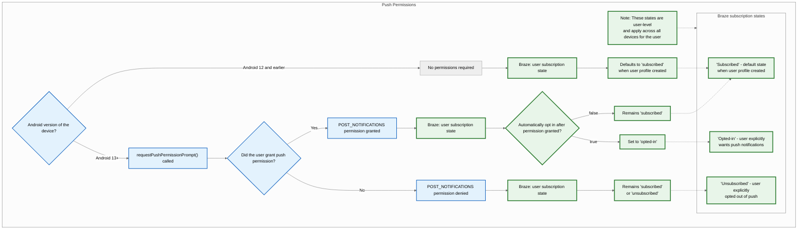
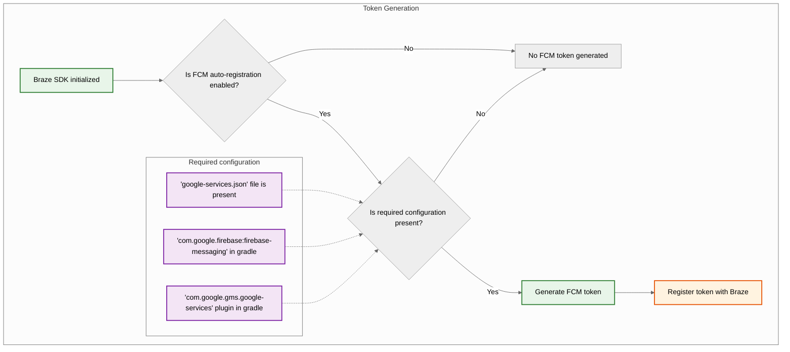
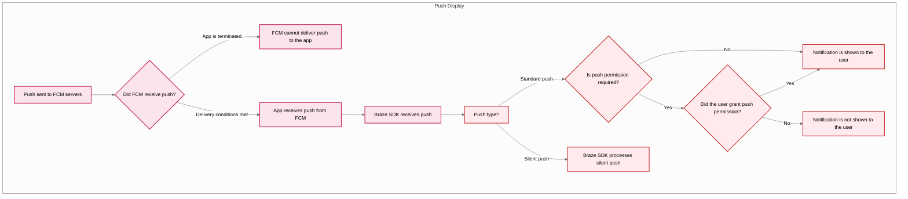



## Integrierte Features {#built-in-features}

Die folgenden Features sind im Braze Android SDK integriert. Um weitere Push-Benachrichtigungs-Features zu nutzen, müssen Sie [Push-Benachrichtigungen einrichten](#android_setting-up-push-notifications) für Ihre App.

|Feature|Beschreibung|
|-------|-----------|
|Push Stories|Android Push Stories sind standardmäßig im Braze Android SDK integriert. Weitere Informationen finden Sie unter [Push Stories]({{site.baseurl}}/user_guide/channels/push/create_a_push_message/push_stories).|
|Push-Primer|Push-Primer-Campaigns ermutigen Ihre Nutzer:innen, Push-Benachrichtigungen auf ihrem Gerät für Ihre App zu aktivieren. Dies kann ohne SDK-Anpassung mithilfe unseres [No-Code-Push-Primers]({{site.baseurl}}/user_guide/channels/push/best_practices/push_primer_messages) erfolgen.|
{: .reset-td-br-1 .reset-td-br-2 aria-label="Integrierte Features" }

## Über den Lebenszyklus der Push-Benachrichtigung {#push-notification-lifecycle}

Das folgende Flussdiagramm zeigt, wie Braze den Lebenszyklus der Push-Benachrichtigung handhabt, z. B. die Aufforderung zur Erteilung von Berechtigungen, die Generierung von Token und die Zustellung von Nachrichten.















## Push-Benachrichtigungen einrichten {#setting-up-push-notifications}


Eine Beispiel-App, die FCM mit dem Braze Android SDK verwendet, finden Sie unter [Braze: Firebase Push Sample App](https://github.com/braze-inc/braze-android-sdk/tree/master/samples/firebase-push).


### Rate-Limits

Die Firebase Cloud Messaging (FCM) API hat ein Standard-Rate-Limit von 600.000 Anfragen pro Minute. Wenn Sie dieses Limit erreichen, versucht Braze es nach wenigen Minuten automatisch erneut. Um eine Erhöhung zu beantragen, wenden Sie sich an den [Firebase-Support](https://firebase.google.com/support).

### Schritt 1: Firebase zu Ihrem Projekt hinzufügen {#step-1-add-firebase-to-your-project}

Fügen Sie zunächst Firebase zu Ihrem Android-Projekt hinzu. Eine Schritt-für-Schritt-Anleitung finden Sie in Googles [Firebase-Einrichtungsleitfaden](https://firebase.google.com/docs/android/setup).

### Schritt 2: Cloud Messaging zu Ihren Abhängigkeiten hinzufügen {#step-2-add-cloud-messaging-to-your-dependencies}

Fügen Sie als Nächstes die Cloud-Messaging-Bibliothek zu Ihren Projektabhängigkeiten hinzu. Öffnen Sie in Ihrem Android-Projekt `build.gradle` und fügen Sie die folgende Zeile zu Ihrem `dependencies`-Block hinzu.

```gradle
implementation "google.firebase:firebase-messaging:+"
```

Ihre Abhängigkeiten sollten in etwa wie folgt aussehen:

```gradle
dependencies {
  implementation project(':android-sdk-ui')
  implementation "com.google.firebase:firebase-messaging:+"
}
```

### Schritt 3: Firebase Cloud Messaging API aktivieren {#step-3-enable-the-firebase-cloud-messaging-api}

Wählen Sie in Google Cloud das Projekt aus, das Ihre Android-App verwendet, und aktivieren Sie dann die [Firebase Cloud Messaging API](https://console.cloud.google.com/apis/library/fcm.googleapis.com).

{: style="max-width:80%;"}

### Schritt 4: Ein Dienstkonto erstellen {#service-account}

Erstellen Sie als Nächstes ein neues Dienstkonto, damit Braze autorisierte API-Aufrufe bei der Registrierung von FCM-Token durchführen kann. Navigieren Sie in Google Cloud zu **Service Accounts** und wählen Sie Ihr Projekt aus. Wählen Sie auf der Seite **Service Accounts** die Option **Create Service Account**.


Geben Sie einen Namen, eine ID und eine Beschreibung für das Dienstkonto ein und wählen Sie dann **Create and continue**.

Suchen Sie im Feld **Role** den Eintrag **Firebase Cloud Messaging API Admin** aus der Rollenliste und wählen Sie ihn aus. Für einen eingeschränkteren Zugriff erstellen Sie eine [benutzerdefinierte Rolle](https://cloud.google.com/iam/docs/creating-custom-roles) mit der Berechtigung `cloudmessaging.messages.create` und wählen Sie stattdessen diese aus der Liste. Wenn Sie fertig sind, wählen Sie **Done**.


Achten Sie darauf, **Firebase Cloud Messaging _API_ Admin** auszuwählen, nicht **Firebase Cloud Messaging Admin**.



### Schritt 5: JSON-Zugangsdaten generieren {#json}

Generieren Sie als Nächstes JSON-Zugangsdaten für Ihr FCM-Dienstkonto. Navigieren Sie in Google Cloud IAM & Admin zu **Service Accounts** und wählen Sie Ihr Projekt aus. Suchen Sie das FCM-Dienstkonto, das [Sie zuvor erstellt haben](#android_service-account), und wählen Sie <i class="fa-solid fa-ellipsis-vertical" aria-label="Aktionsmenü öffnen"></i>&nbsp;**Actions** > **Manage Keys**.


Wählen Sie **Add Key** > **Create new key**.


Wählen Sie **JSON** und dann **Create**. Wenn Sie Ihr Dienstkonto mit einer anderen Google-Cloud-Projekt-ID als Ihrer FCM-Projekt-ID erstellt haben, müssen Sie den Wert von `project_id` in Ihrer JSON-Datei manuell aktualisieren.

Merken Sie sich, wohin Sie den Schlüssel heruntergeladen haben&#8212;Sie benötigen ihn im nächsten Schritt.

{: style="max-width:65%;"}


Private Keys können ein Sicherheitsrisiko darstellen, wenn sie kompromittiert werden. Bewahren Sie Ihre JSON-Zugangsdaten vorerst an einem sicheren Ort auf&#8212;Sie werden Ihren Schlüssel löschen, nachdem Sie ihn zu Braze hochgeladen haben.


### Schritt 6: JSON-Zugangsdaten zu Braze hochladen {#step-6-upload-your-json-credentials-to-braze}

Laden Sie als Nächstes Ihre JSON-Zugangsdaten in Ihr Braze-Dashboard hoch. Wählen Sie in Braze <i class="fa-solid fa-gear" aria-label="Einstellungen"></i>&nbsp;**Settings** > **App Settings**.


Wählen Sie unter den **Push Notification Settings** Ihrer Android-App **Firebase** aus, klicken Sie dann auf **Upload JSON File** und laden Sie die Zugangsdaten hoch, die [Sie zuvor generiert haben](#android_json). Wenn Sie fertig sind, wählen Sie **Save**.



Private Keys können ein Sicherheitsrisiko darstellen, wenn sie kompromittiert werden. Da Ihr Schlüssel nun zu Braze hochgeladen wurde, löschen Sie die Datei, die [Sie zuvor generiert haben](#android_json).


### Schritt 7: Automatische Token-registrieren einrichten {#step-7-set-up-automatic-token-registration}

Wenn Nutzer:innen Push-Benachrichtigungen aktivieren, muss Ihre App ein FCM-Token auf deren Gerät generieren, bevor Sie ihnen Push-Benachrichtigungen senden können. Mit dem Braze SDK können Sie die automatische FCM-Token-Registrierung für das Gerät jeder Nutzerin und jedes Nutzers in den Braze-Konfigurationsdateien Ihres Projekts aktivieren.

Öffnen Sie zunächst die Firebase Console, öffnen Sie Ihr Projekt und wählen Sie <i class="fa-solid fa-gear" aria-label="Einstellungen"></i>&nbsp;**Settings** > **Project settings**.


Wählen Sie **Cloud Messaging** und kopieren Sie unter **Firebase Cloud Messaging API (V1)** die Nummer im Feld **Sender ID**.


Öffnen Sie als Nächstes Ihr Android-Studio-Projekt und verwenden Sie Ihre Firebase-Sender-ID, um die automatische FCM-Token-Registrierung in Ihrer `braze.xml` oder `BrazeConfig` zu aktivieren.



Um die automatische FCM-Token-Registrierung zu konfigurieren, fügen Sie die folgenden Zeilen zu Ihrer `braze.xml`-Datei hinzu:

```xml
<bool translatable="false" name="com_braze_firebase_cloud_messaging_registration_enabled">true</bool>
<string translatable="false" name="com_braze_firebase_cloud_messaging_sender_id">FIREBASE_SENDER_ID</string>
```

Ersetzen Sie `FIREBASE_SENDER_ID` durch den Wert, den Sie aus Ihren Firebase-Projekteinstellungen kopiert haben. Ihre `braze.xml` sollte in etwa wie folgt aussehen:

```xml
<?xml version="1.0" encoding="utf-8"?>
<resources>
  <string translatable="false" name="com_braze_api_key">12345ABC-6789-DEFG-0123-HIJK456789LM</string>
  <bool translatable="false" name="com_braze_firebase_cloud_messaging_registration_enabled">true</bool>
<string translatable="false" name="com_braze_firebase_cloud_messaging_sender_id">603679405392</string>
</resources>
```



Um die automatische FCM-Token-Registrierung zu konfigurieren, fügen Sie die folgenden Zeilen zu Ihrer `BrazeConfig` hinzu:



```java
.setIsFirebaseCloudMessagingRegistrationEnabled(true)
.setFirebaseCloudMessagingSenderIdKey("FIREBASE_SENDER_ID")
```


```kotlin
.setIsFirebaseCloudMessagingRegistrationEnabled(true)
.setFirebaseCloudMessagingSenderIdKey("FIREBASE_SENDER_ID")
```



Ersetzen Sie `FIREBASE_SENDER_ID` durch den Wert, den Sie aus Ihren Firebase-Projekteinstellungen kopiert haben. Ihre `BrazeConfig` sollte in etwa wie folgt aussehen:



```java
BrazeConfig brazeConfig = new BrazeConfig.Builder()
  .setApiKey("12345ABC-6789-DEFG-0123-HIJK456789LM")
  .setCustomEndpoint("sdk.iad-01.braze.com")
  .setSessionTimeout(60)
  .setHandlePushDeepLinksAutomatically(true)
  .setGreatNetworkDataFlushInterval(10)
  .setIsFirebaseCloudMessagingRegistrationEnabled(true)
  .setFirebaseCloudMessagingSenderIdKey("603679405392")
  .build();
Braze.configure(this, brazeConfig);
```


```kotlin
val brazeConfig = BrazeConfig.Builder()
  .setApiKey("12345ABC-6789-DEFG-0123-HIJK456789LM")
  .setCustomEndpoint("sdk.iad-01.braze.com")
  .setSessionTimeout(60)
  .setHandlePushDeepLinksAutomatically(true)
  .setGreatNetworkDataFlushInterval(10)
  .setIsFirebaseCloudMessagingRegistrationEnabled(true)
  .setFirebaseCloudMessagingSenderIdKey("603679405392")
  .build()
Braze.configure(this, brazeConfig)
```







Wenn Sie FCM-Token stattdessen manuell registrieren möchten, setzen Sie die Eigenschaft [`registeredPushToken`](https://braze-inc.github.io/braze-android-sdk/kdoc/braze-android-sdk/com.braze/-i-braze/registered-push-token.html) auf der Braze-Instanz in der [`onCreate()`](https://developer.android.com/reference/android/app/Application.html#onCreate())-Methode Ihrer App.

```kotlin
// Kotlin
Braze.getInstance(context).registeredPushToken = "FCM_TOKEN"
```

```java
// Java
Braze.getInstance(context).setRegisteredPushToken("FCM_TOKEN");
```


#### Verwendung mehrerer Firebase-Projekte {#multiple-firebase-projects}

Wenn Ihre App mehrere Firebase-Projekte verwendet, befolgen Sie diese Schritte:

1. Belassen Sie Braze-Push im Standard-Firebase-Projekt, das über die `google-services.json` Ihrer App initialisiert wird.
2. Wenn Sie einen benutzerdefinierten Firebase-Messaging-Service verwenden, führen Sie [Installations-IDs in benutzerdefinierten Firebase-Messaging-Services registrieren](#android_register-installation-id-custom-firebase-service) durch.
3. Wenn Ihre App ein Push-Token auf anderem Wege erhält, setzen Sie `registeredPushToken` manuell, wie im vorherigen Tipp gezeigt.


Firebase Cloud Messaging bietet keine unterstützte API zum Abrufen eines Tokens von einer `FirebaseApp`, die Sie manuell initialisieren. `FirebaseMessagingService`-Callbacks wie `onNewToken` und `onRegistered` werden nur für das Standardprojekt ausgelöst. Weitere Informationen finden Sie unter [Configure multiple projects](https://firebase.google.com/docs/projects/multiprojects) in der Firebase-Dokumentation.


Einzelheiten zu Versionen finden Sie in den [SDK-Changelogs]({{site.baseurl}}/developer_guide/changelogs?sdktab=android).

### Schritt 8: Automatische Anfragen in Ihrer Application-Klasse entfernen {#step-8-remove-automatic-requests-in-your-application-class}

Um zu verhindern, dass Braze bei jedem Senden stiller Push-Benachrichtigungen unnötige Netzwerkanfragen auslöst, entfernen Sie alle automatischen Netzwerkanfragen, die in der `onCreate()`-Methode Ihrer `Application`-Klasse konfiguriert sind. Weitere Informationen finden Sie unter [Android Developer Reference: Application](https://developer.android.com/reference/android/app/Application).

## Benachrichtigungen anzeigen {#displaying-notifications}

<a id="android_step-1-register-braze-firebase-messaging-service"></a>

### Schritt 1: Braze Firebase Messaging Service registrieren {#register-braze-firebase-messaging-service}

Sie können entweder einen neuen, einen bestehenden oder einen Nicht-Braze Firebase Messaging Service erstellen. Wählen Sie die Option, die am besten zu Ihren spezifischen Anforderungen passt.



Braze enthält einen Dienst, der den Empfang und die Öffnungsabsichten von Push-Benachrichtigungen verarbeitet. Unsere Klasse `BrazeFirebaseMessagingService` muss in Ihrer `AndroidManifest.xml` registriert werden:

```xml
<service android:name="com.braze.push.BrazeFirebaseMessagingService"
  android:exported="false">
  <intent-filter>
    <action android:name="com.google.firebase.MESSAGING_EVENT" />
  </intent-filter>
</service>
```

Unser Benachrichtigungscode verwendet ebenfalls `BrazeFirebaseMessagingService`, um das Öffnen und das Klick-Tracking zu verarbeiten. Dieser Dienst muss in der `AndroidManifest.xml` registriert sein, damit er korrekt funktioniert. Denken Sie auch daran, dass Braze Benachrichtigungen aus unserem System mit einem eindeutigen Schlüssel versieht, sodass nur von unseren Systemen gesendete Benachrichtigungen gerendert werden. Sie können zusätzliche Dienste separat registrieren, um Benachrichtigungen zu rendern, die von anderen FCM-Diensten gesendet werden. Siehe [`AndroidManifest.xml`](https://github.com/braze-inc/braze-android-sdk/blob/master/samples/firebase-push/src/main/AndroidManifest.xml) in der Firebase-Push-Beispiel-App.


Vor Braze SDK 3.1.1 wurde `AppboyFcmReceiver` zur Verarbeitung von FCM-Push-Benachrichtigungen verwendet. Die Klasse `AppboyFcmReceiver` sollte aus Ihrem Manifest entfernt und durch die vorstehende Integration ersetzt werden.




Wenn Sie bereits einen Firebase Messaging Service registriert haben, können Sie [`RemoteMessage`](https://firebase.google.com/docs/reference/android/com/google/firebase/messaging/RemoteMessage)-Objekte über [`BrazeFirebaseMessagingService.handleBrazeRemoteMessage()`](https://braze-inc.github.io/braze-android-sdk/kdoc/braze-android-sdk/com.braze.push/-braze-firebase-messaging-service/-companion/handle-braze-remote-message.html) an Braze übergeben. Diese Methode zeigt nur dann eine Benachrichtigung an, wenn das [`RemoteMessage`](https://firebase.google.com/docs/reference/android/com/google/firebase/messaging/RemoteMessage)-Objekt von Braze stammt, und ignoriert es andernfalls sicher.

<a id="android_register-installation-id-custom-firebase-service"></a>

#### Installations-IDs in benutzerdefinierten Firebase Messaging Services registrieren {#register-installation-id-custom-firebase-service}

Wenn Sie `firebase-messaging` v25.1.0 oder höher verwenden, nutzt die Firebase-registrieren die Firebase Installation ID. Überschreiben Sie in Ihrem benutzerdefinierten Firebase Messaging Service `onRegistered` und setzen Sie `registeredPushToken`.




```java
public class MyFirebaseMessagingService extends FirebaseMessagingService {
  @Override
  public void onRegistered(String installationId) {
    super.onRegistered(installationId);
    Braze.getInstance(this).setRegisteredPushToken(installationId);
  }

  @Override
  public void onMessageReceived(RemoteMessage remoteMessage) {
    super.onMessageReceived(remoteMessage);
    if (BrazeFirebaseMessagingService.handleBrazeRemoteMessage(this, remoteMessage)) {
      // This Remote Message originated from Braze and a push notification was displayed.
      // No further action is needed.
    } else {
      // This Remote Message did not originate from Braze.
      // No action was taken and you can safely pass this Remote Message to other handlers.
    }
  }
}
```




```kotlin
class MyFirebaseMessagingService : FirebaseMessagingService() {
  override fun onRegistered(installationId: String) {
    super.onRegistered(installationId)
    Braze.getInstance(this).registeredPushToken = installationId
  }

  override fun onMessageReceived(remoteMessage: RemoteMessage?) {
    super.onMessageReceived(remoteMessage)
    if (BrazeFirebaseMessagingService.handleBrazeRemoteMessage(this, remoteMessage)) {
      // This Remote Message originated from Braze and a push notification was displayed.
      // No further action is needed.
    } else {
      // This Remote Message did not originate from Braze.
      // No action was taken and you can safely pass this Remote Message to other handlers.
    }
  }
}
```






Wenn Sie einen weiteren Firebase Messaging Service verwenden möchten, können Sie auch einen Fallback-Firebase-Messaging-Service angeben, der aufgerufen wird, wenn Ihre Anwendung eine Push-Benachrichtigung empfängt, die nicht von Braze stammt.

Geben Sie in Ihrer `braze.xml` Folgendes an:

```xml
<bool name="com_braze_fallback_firebase_cloud_messaging_service_enabled">true</bool>
<string name="com_braze_fallback_firebase_cloud_messaging_service_classpath">com.company.OurFirebaseMessagingService</string>
```

oder legen Sie es über die [Laufzeitkonfiguration]({{site.baseurl}}/developer_guide/sdk_integration/?sdktab=android#runtime-configuration) fest:




```java
BrazeConfig brazeConfig = new BrazeConfig.Builder()
        .setFallbackFirebaseMessagingServiceEnabled(true)
        .setFallbackFirebaseMessagingServiceClasspath("com.company.OurFirebaseMessagingService")
        .build();
Braze.configure(this, brazeConfig);
```




```kotlin
val brazeConfig = BrazeConfig.Builder()
        .setFallbackFirebaseMessagingServiceEnabled(true)
        .setFallbackFirebaseMessagingServiceClasspath("com.company.OurFirebaseMessagingService")
        .build()
Braze.configure(this, brazeConfig)
```






### Schritt 2: Kleine Symbole an die Designrichtlinien anpassen {#step-2-conform-small-icons-to-design-guidelines}

Allgemeine Informationen zu Android-Benachrichtigungssymbolen finden Sie in der [Übersicht über Benachrichtigungen](https://developer.android.com/guide/topics/ui/notifiers/notifications).

Ab Android N sollten Sie kleine Benachrichtigungssymbol-Assets, die Farbe enthalten, aktualisieren oder entfernen. Das Android-System (nicht das Braze SDK) ignoriert alle Nicht-Alpha- und Transparenzkanäle in Aktionssymbolen und dem kleinen Benachrichtigungssymbol. Anders ausgedrückt: Android konvertiert alle Teile Ihres kleinen Benachrichtigungssymbols in Monochrom – mit Ausnahme transparenter Bereiche.

So erstellen Sie ein kleines Benachrichtigungssymbol-Asset, das korrekt angezeigt wird:
- Entfernen Sie alle Farben aus dem Bild außer Weiß.
- Alle anderen nicht-weißen Bereiche des Assets sollten transparent sein.


Ein häufiges Symptom eines fehlerhaften Assets ist, dass das kleine Benachrichtigungssymbol als einfarbiges monochromes Quadrat gerendert wird. Dies liegt daran, dass das Android-System keine transparenten Bereiche im kleinen Benachrichtigungssymbol-Asset finden kann.


Die folgenden großen und kleinen Symbole sind Beispiele für korrekt gestaltete Symbole:


### Schritt 3: Benachrichtigungssymbole konfigurieren {#configure-icons}

#### Symbole in braze.xml angeben {#specifying-icons-in-brazexml}

Braze ermöglicht es Ihnen, Ihre Benachrichtigungssymbole zu konfigurieren, indem Sie Drawable-Ressourcen in Ihrer `braze.xml` angeben:

```xml
<drawable name="com_braze_push_small_notification_icon">REPLACE_WITH_YOUR_ICON</drawable>
<drawable name="com_braze_push_large_notification_icon">REPLACE_WITH_YOUR_ICON</drawable>
```

Das Festlegen eines kleinen Benachrichtigungssymbols ist erforderlich. **Wenn Sie keines festlegen, verwendet Braze standardmäßig das Anwendungssymbol als kleines Benachrichtigungssymbol, was möglicherweise suboptimal aussieht.**

Das Festlegen eines großen Benachrichtigungssymbols ist optional, wird aber empfohlen.

#### Akzentfarbe des Symbols angeben {#specifying-icon-accent-color}

Die Akzentfarbe des Benachrichtigungssymbols kann in Ihrer `braze.xml` überschrieben werden. Wenn die Farbe nicht angegeben wird, ist die Standardfarbe dasselbe Grau, das Lollipop für Systembenachrichtigungen verwendet.

```xml
<integer name="com_braze_default_notification_accent_color">0xFFf33e3e</integer>
```

Sie können optional auch eine Farbreferenz verwenden:

```xml
<color name="com_braze_default_notification_accent_color">@color/my_color_here</color>
```

### Schritt 4: Deeplinks hinzufügen {#step-4-add-deep-links}

#### Automatisches Öffnen von Deeplinks aktivieren {#enabling-automatic-deep-link-opening}

Um Braze zu ermöglichen, Ihre App und alle Deeplinks automatisch zu öffnen, wenn eine Push-Benachrichtigung angetippt wird, setzen Sie `com_braze_handle_push_deep_links_automatically` in Ihrer `braze.xml` auf `true`:

```xml
<bool name="com_braze_handle_push_deep_links_automatically">true</bool>
```

Dieses Flag kann auch über die [Laufzeitkonfiguration]({{site.baseurl}}/developer_guide/sdk_integration/?sdktab=android#runtime-configuration) festgelegt werden:




```java
BrazeConfig brazeConfig = new BrazeConfig.Builder()
        .setHandlePushDeepLinksAutomatically(true)
        .build();
Braze.configure(this, brazeConfig);
```




```kotlin
val brazeConfig = BrazeConfig.Builder()
        .setHandlePushDeepLinksAutomatically(true)
        .build()
Braze.configure(this, brazeConfig)
```




Wenn Sie Deeplinks benutzerdefiniert behandeln möchten, müssen Sie einen Push-Callback erstellen, der auf Push-Empfangs- und Öffnungsabsichten von Braze lauscht. Weitere Informationen finden Sie unter [Einen Callback für Push-Ereignisse verwenden]({{site.baseurl}}/developer_guide/push_notifications/customization#android_using-a-callback-for-push-events).

## Verarbeitung von Vordergrund-Benachrichtigungen {#handling-foreground-notifications}

Wenn eine Push-Benachrichtigung eintrifft, während Ihre App unter Android im Vordergrund läuft, zeigt das System sie standardmäßig automatisch an. Damit Braze den Push-Benachrichtigungs-Payload verarbeitet (für Analytics-Tracking, Deeplink-Verarbeitung und benutzerdefinierte Verarbeitung), leiten Sie die eingehenden Push-Daten in Ihrer `FirebaseMessagingService.onMessageReceived`-Methode an Braze weiter.

### Funktionsweise {#how-it-works}

Wenn Sie `BrazeFirebaseMessagingService.handleBrazeRemoteMessage` aufrufen, prüft Braze, ob es sich bei dem Payload um eine Braze Push-Benachrichtigung handelt, und erstellt und zeigt diese gegebenenfalls mit der `NotificationManagerCompat`-Methode an. Im Gegensatz zu iOS zeigt Android Benachrichtigungen unabhängig davon an, ob sich die App im Vordergrund oder im Hintergrund befindet.



```java
package com.example.push;

import com.braze.push.BrazeFirebaseMessagingService;
import com.google.firebase.messaging.FirebaseMessagingService;
import com.google.firebase.messaging.RemoteMessage;

public class MyFirebaseMessagingService extends FirebaseMessagingService {
    @Override
    public void onMessageReceived(RemoteMessage remoteMessage) {
        super.onMessageReceived(remoteMessage);

        // Let Braze process the payload and display the notification
        if (BrazeFirebaseMessagingService.handleBrazeRemoteMessage(this, remoteMessage)) {
            // Braze successfully handled the push notification
        } else {
            // Handle non-Braze messages
        }
    }
}
```



```kotlin
package com.example.push

import com.braze.push.BrazeFirebaseMessagingService
import com.google.firebase.messaging.FirebaseMessagingService
import com.google.firebase.messaging.RemoteMessage

class MyFirebaseMessagingService : FirebaseMessagingService() {
    override fun onMessageReceived(remoteMessage: RemoteMessage) {
        super.onMessageReceived(remoteMessage)

        // Let Braze process the payload and display the notification
        if (BrazeFirebaseMessagingService.handleBrazeRemoteMessage(this, remoteMessage)) {
            // Braze successfully handled the push notification
        } else {
            // Handle non-Braze messages
        }
    }
}
```



Weitere Informationen finden Sie im [Firebase-Integrationsbeispiel](https://github.com/braze-inc/braze-android-sdk/blob/master/samples/firebase-push/src/main/java/com/braze/firebasepush/FirebaseMessagingService.kt) im Braze Android SDK-Repository.

### Anpassen des Vordergrundverhaltens {#customizing-foreground-behavior}

Wenn Sie ein benutzerdefiniertes Vordergrundverhalten wünschen, z. B. die Systembenachrichtigung unterdrücken oder stattdessen eine In-App-UI anzeigen möchten, können Sie:

- `subscribeToPushNotificationEvents` verwenden, um auf Push-Ereignisse zu reagieren und Deeplinks mit der `BrazeNotificationUtils.routeUserWithNotificationOpenedIntent`-Methode zu verarbeiten. Weitere Informationen finden Sie im [Firebase-Push-Beispiel](https://github.com/braze-inc/braze-android-sdk/blob/master/samples/firebase-push/src/main/java/com/braze/firebasepush/FirebaseApplication.kt).
- Eine eigene Benachrichtigung mit einer benutzerdefinierten `IBrazeNotificationFactory` erstellen und veröffentlichen, oder die Benachrichtigung unterdrücken, indem Sie `notificationManager.notify` in Ihrem Verarbeitungspfad nicht aufrufen.

Weitere Informationen zum Anpassen von Benachrichtigungen finden Sie unter [Benutzerdefinierte Benachrichtigungs-Factory]({{site.baseurl}}/developer_guide/push_notifications/customization/?sdktab=android#custom-notification-factory).

#### Benutzerdefinierte Deeplinks erstellen {#creating-custom-deep-links}

Folgen Sie den Anweisungen in der [Android-Entwicklerdokumentation](http://developer.android.com/training/app-indexing/deep-linking.html) zum Deeplinking, falls Sie Ihrer App noch keine Deeplinks hinzugefügt haben. Um mehr darüber zu erfahren, was Deeplinks sind, lesen Sie unseren [FAQ-Artikel]({{site.baseurl}}/user_guide/messaging/design_and_edit/personalize/actions_and_media_urls#what-is-deep-linking).

#### Deeplinks hinzufügen {#adding-deep-links}

Das Braze-Dashboard unterstützt das Festlegen von Deeplinks oder Web-URLs in Push-Benachrichtigungs-Campaigns und Canvases, die beim Anklicken der Benachrichtigung geöffnet werden.


#### Back-Stack-Verhalten anpassen {#customizing-back-stack-behavior}

Das Android SDK platziert standardmäßig die Hauptstartaktivität Ihrer Host-App im Back-Stack, wenn Push-Deeplinks verfolgt werden. Braze ermöglicht es Ihnen, eine benutzerdefinierte Aktivität festzulegen, die anstelle Ihrer Hauptstartaktivität im Back-Stack geöffnet wird, oder den Back-Stack vollständig zu deaktivieren.

Um beispielsweise eine Aktivität namens `YourMainActivity` als Back-Stack-Aktivität mithilfe der [Laufzeitkonfiguration]({{site.baseurl}}/developer_guide/sdk_integration/?sdktab=android#runtime-configuration) festzulegen:




```java
BrazeConfig brazeConfig = new BrazeConfig.Builder()
        .setPushDeepLinkBackStackActivityEnabled(true)
        .setPushDeepLinkBackStackActivityClass(YourMainActivity.class)
        .build();
Braze.configure(this, brazeConfig);
```




```kotlin
val brazeConfig = BrazeConfig.Builder()
        .setPushDeepLinkBackStackActivityEnabled(true)
        .setPushDeepLinkBackStackActivityClass(YourMainActivity.class)
        .build()
Braze.configure(this, brazeConfig)
```




Die entsprechende Konfiguration für Ihre `braze.xml` finden Sie hier. Beachten Sie, dass der Klassenname derselbe sein muss wie der von `Class.forName()` zurückgegebene.

```xml
<bool name="com_braze_push_deep_link_back_stack_activity_enabled">true</bool>
<string name="com_braze_push_deep_link_back_stack_activity_class_name">your.package.name.YourMainActivity</string>
```

### Schritt 5: Benachrichtigungskanäle definieren {#step-5-define-notification-channels}

Das Braze Android SDK unterstützt [Android-Benachrichtigungskanäle](https://developer.android.com/preview/features/notification-channels.html). Wenn eine Braze-Benachrichtigung keine ID für einen Benachrichtigungskanal enthält oder eine ungültige Kanal-ID aufweist, zeigt Braze die Benachrichtigung mit dem im SDK definierten Standard-Benachrichtigungskanal an. Nutzer:innen verwenden [Android-Benachrichtigungskanäle]({{site.baseurl}}/user_guide/channels/push/platform_specific_resources/android/notification_channels) innerhalb der Plattform, um Benachrichtigungen zu gruppieren.

Um den für Nutzer:innen sichtbaren Namen des Standard-Braze-Benachrichtigungskanals festzulegen, verwenden Sie [`BrazeConfig.setDefaultNotificationChannelName()`](https://braze-inc.github.io/braze-android-sdk/kdoc/braze-android-sdk/com.braze.configuration/-braze-config/-builder/set-default-notification-channel-name.html).

Um die für Nutzer:innen sichtbare Beschreibung des Standard-Braze-Benachrichtigungskanals festzulegen, verwenden Sie [`BrazeConfig.setDefaultNotificationChannelDescription()`](https://braze-inc.github.io/braze-android-sdk/kdoc/braze-android-sdk/com.braze.configuration/-braze-config/-builder/set-default-notification-channel-description.html).

Aktualisieren Sie alle API-Campaigns mit dem Parameter [Android-Push-Objekt]({{site.baseurl}}/api/objects_filters/messaging/android_object), um das Feld `notification_channel` einzuschließen. Wenn dieses Feld nicht angegeben wird, sendet Braze den Benachrichtigungs-Payload mit der [Dashboard-Fallback]({{site.baseurl}}/user_guide/message_building_by_channel/push/android/notification_channels#dashboard-fallback-channel)-Kanal-ID.

Abgesehen vom Standard-Benachrichtigungskanal erstellt Braze keine weiteren Kanäle. Alle anderen Kanäle müssen programmatisch von der Host-App definiert und dann im Braze-Dashboard eingetragen werden.

Der Standardkanalname und die Beschreibung können auch in `braze.xml` konfiguriert werden.

```xml
<string name="com_braze_default_notification_channel_name">Your channel name</string>
<string name="com_braze_default_notification_channel_description">Your channel description</string>
```

### Schritt 6: Benachrichtigungsanzeige und Analytics testen {#step-6-test-notification-display-and-analytics}

#### Anzeige testen {#testing-display}

An diesem Punkt sollten Sie Benachrichtigungen sehen können, die von Braze gesendet werden. Um dies zu testen, navigieren Sie zur Seite **Campaigns** in Ihrem Braze-Dashboard und erstellen Sie eine **Push Notification**-Campaign. Wählen Sie **Android Push** und gestalten Sie Ihre Nachricht. Klicken Sie dann auf das Augensymbol im Composer, um den Testsender aufzurufen. Geben Sie die Nutzer-ID oder E-Mail-Adresse Ihres aktuellen Nutzer:innen-Profils ein und klicken Sie auf **Send Test**. Die Push-Benachrichtigung sollte auf Ihrem Gerät erscheinen.


Bei Problemen mit der Push-Anzeige lesen Sie unseren [Leitfaden zur Fehlerbehebung]({{site.baseurl}}/developer_guide/push_notifications/troubleshooting/?sdktab=android).

#### Analytics testen {#testing-analytics}

An diesem Punkt sollte auch die Analytics-Protokollierung für das Öffnen von Push-Benachrichtigungen funktionieren. Wenn Sie auf die eingehende Benachrichtigung klicken, sollte der Wert für **Direct Opens** auf Ihrer Campaign-Ergebnisseite um 1 steigen. Lesen Sie unseren Artikel zum [Push-Reporting]({{site.baseurl}}/user_guide/channels/push/reporting) für eine Aufschlüsselung der Push-Analytics.

Bei Problemen mit Push-Analytics lesen Sie unseren [Leitfaden zur Fehlerbehebung]({{site.baseurl}}/developer_guide/push_notifications/troubleshooting/?sdktab=android).

#### Testen über die Kommandozeile {#testing-from-command-line}

Wenn Sie In-App- und Push-Benachrichtigungen über die Kommandozeile testen möchten, können Sie eine einzelne Benachrichtigung über das Terminal per cURL und die [Messaging-API]({{site.baseurl}}/api/endpoints/messaging) senden. Sie müssen die folgenden Felder durch die korrekten Werte für Ihren Testfall ersetzen:

- `YOUR_API_KEY` (Navigieren Sie zu **Settings** > **API Keys**.)
- `YOUR_EXTERNAL_USER_ID` (Suchen Sie ein Profil auf der Seite **Search Users**.)
- `YOUR_KEY1` (optional)
- `YOUR_VALUE1` (optional)

```bash
curl -X POST -H "Content-Type: application/json" -H "Authorization: Bearer {YOUR_API_KEY}" -d '{
  "external_user_ids":["YOUR_EXTERNAL_USER_ID"],
  "messages": {
    "android_push": {
      "title":"Test push title",
      "alert":"Test push",
      "extra": {
        "YOUR_KEY1":"YOUR_VALUE1"
      }
    }
  }
}' https://rest.iad-01.braze.com/messages/send
```

Dieses Beispiel verwendet die `US-01`-Instanz. Wenn Sie sich nicht auf dieser Instanz befinden, ersetzen Sie den `US-01`-Endpunkt durch [Ihren Endpunkt]({{site.baseurl}}/api/basics#endpoints).

## Push-Benachrichtigungen für Unterhaltungen {#conversation-push-notifications}

{: style="float:right;max-width:35%;margin-left:15px;border: 0;"}

Die [Initiative „People and Conversations“](https://developer.android.com/guide/topics/ui/conversations) ist eine langfristig angelegte Android-Initiative, die darauf abzielt, Personen und Unterhaltungen auf den Systemoberflächen des Smartphones stärker in den Vordergrund zu rücken. Diese Priorisierung basiert auf der Tatsache, dass Kommunikation und Interaktion mit anderen Menschen nach wie vor der wichtigste und am meisten geschätzte Funktionsbereich für die Mehrheit aller Android-Nutzer:innen über alle Demografien hinweg ist.

### Nutzungsvoraussetzungen {#usage-requirements}

- Dieser Benachrichtigungstyp erfordert das Braze Android SDK v15.0.0+ und Geräte mit Android 11+.
- Nicht unterstützte Geräte oder SDKs fallen auf eine Standard-Push-Benachrichtigung zurück.

Dieses Feature ist ausschließlich über die Braze REST API verfügbar. Weitere Informationen finden Sie unter [Android-Push-Objekt]({{site.baseurl}}/api/objects_filters/messaging/android_object#android-conversation-push-object).

## FCM-Kontingent-Überschreitungsfehler {#fcm-quota-exceeded-errors}

Wenn Ihr Limit für Firebase Cloud Messaging (FCM) überschritten wird, gibt Google „Quota exceeded“-Fehler zurück. Das Standardlimit für FCM beträgt 600.000 Anfragen pro Minute. Braze wiederholt den Versand gemäß den von Google empfohlenen Best Practices. Ein hohes Aufkommen dieser Fehler kann die Sendezeit jedoch um mehrere Minuten verlängern. Um mögliche Auswirkungen zu reduzieren, sendet Braze Ihnen eine Warnung, dass das Rate-Limit überschritten wird, sowie Schritte, die Sie unternehmen können, um die Fehler zu vermeiden.

Um Ihr aktuelles Limit zu überprüfen, gehen Sie zu **Google Cloud Console** > **APIs & Services** > **Firebase Cloud Messaging API** > **Quotas & System Limits**, oder besuchen Sie die [FCM API Quotas-Seite](https://console.cloud.google.com/apis/api/fcm.googleapis.com/quotas).

### Best Practices

Wir empfehlen diese Best Practices, um das Aufkommen dieser Fehler gering zu halten.

#### Eine Rate-Limit-Erhöhung bei FCM anfragen {#request-a-rate-limit-increase-from-fcm}

Um eine Rate-Limit-Erhöhung bei FCM anzufragen, können Sie sich direkt an den [Firebase Support](https://firebase.google.com/support) wenden oder die folgenden Schritte ausführen:

1. Gehen Sie zur [FCM API Quotas-Seite](https://console.cloud.google.com/apis/api/fcm.googleapis.com/quotas).
2. Suchen Sie das Kontingent **Send requests per minute**.
3. Wählen Sie **Edit Quota** aus.
4. Geben Sie einen neuen Wert ein und senden Sie Ihre Anfrage ab.

#### Ein Workspace-Rate-Limit festlegen {#apply-a-workspace-rate-limit}

Sie können ein Workspace-Rate-Limit für Android-Push-Benachrichtigungen festlegen. Dies kann helfen, die Zustellungsrate Ihrer ausgehenden Nachrichten zu regulieren. Weitere Informationen finden Sie unter [Workspace-Messaging-Rate-Limits]({{site.baseurl}}/user_guide/administer/global/workspace_settings/messaging_rate_limits).