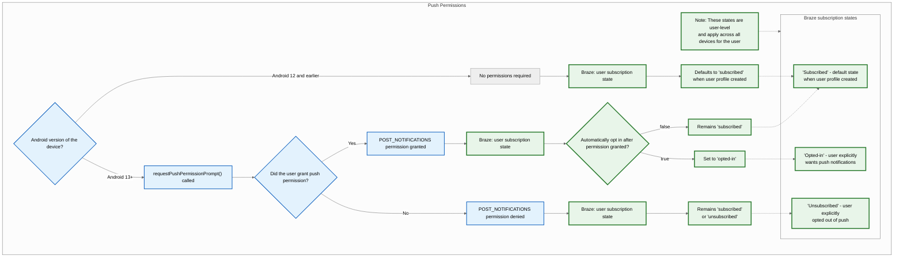
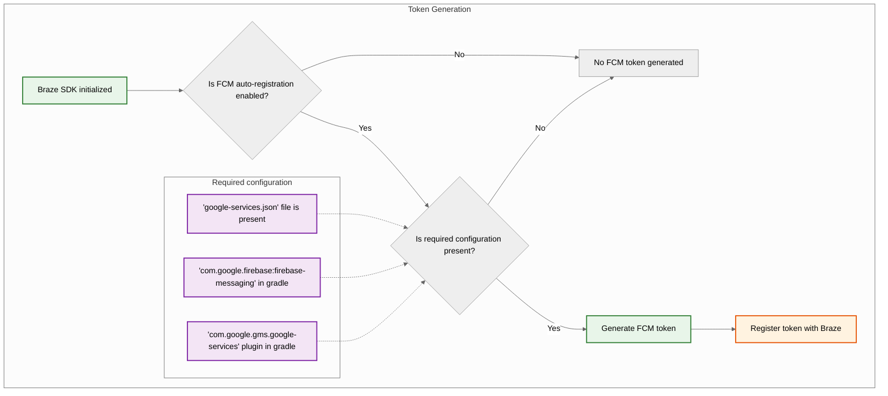
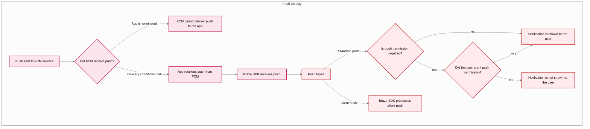



## Eingebaute Features

Die folgenden Features sind in das Braze Android SDK integriert. Um andere Features für Push-Benachrichtigungen zu nutzen, müssen Sie für Ihre App [Push-Benachrichtigungen einrichten](#android_setting-up-push-notifications).

|Feature|Beschreibung|
|-------|-----------|
|Push-Storys|Android Push-Storys sind standardmäßig in das Braze Android SDK integriert. Weitere Informationen finden Sie unter [Push-Storys]({{site.baseurl}}/user_guide/message_building_by_channel/push/advanced_push_options/push_stories/).|
|Push Primer|Push-Primer-Kampagnen ermutigen Ihre Nutzer:innen, Push-Benachrichtigungen auf ihrem Gerät für Ihre App zu aktivieren. Dies kann ohne SDK-Anpassung mit unserem [No-Code-Push-Primer]({{site.baseurl}}/user_guide/message_building_by_channel/push/best_practices/push_primer_messages/) geschehen.|
{: .reset-td-br-1 .reset-td-br-2 role="presentation"}

## Über den Lebenszyklus der Push-Benachrichtigung {#push-notification-lifecycle}

Das folgende Flussdiagramm zeigt, wie Braze den Lebenszyklus der Push-Benachrichtigung handhabt, z. B. die Aufforderung zur Erteilung von Berechtigungen, die Generierung von Token und die Zustellung von Nachrichten.















## Push-Benachrichtigungen einrichten


Ein Beispiel für eine App, die FCM mit dem Braze Android SDK verwendet, finden Sie unter [Braze: Beispiel-App für Firebase Push](https://github.com/braze-inc/braze-android-sdk/tree/master/samples/firebase-push).


### Rate-Limits

Die Firebase Cloud Messaging (FCM) API hat ein standardmäßiges Rate-Limit von 600.000 Anfragen pro Minute. Wenn Sie dieses Limit erreichen, wird Braze es in einigen Minuten automatisch erneut versuchen. Um eine Erhöhung anzufordern, wenden Sie sich an den [Firebase Support](https://firebase.google.com/support).

### 1. Schritt: Firebase zu Ihrem Projekt hinzufügen

Fügen Sie zunächst Firebase zu Ihrem Android-Projekt hinzu. Eine schrittweise Anleitung finden Sie in der [Firebase-Einrichtungsanleitung](https://firebase.google.com/docs/android/setup) von Google.

### 2. Schritt: Cloud Messaging zu Ihren Abhängigkeiten hinzufügen

Als Nächstes fügen Sie die Cloud-Messaging-Bibliothek zu Ihren Projektabhängigkeiten hinzu. Öffnen Sie in Ihrem Android-Projekt die Datei `build.gradle` und fügen Sie die folgende Zeile zum `dependencies`-Block hinzu.

```gradle
implementation "google.firebase:firebase-messaging:+"
```

Ihre Abhängigkeiten sollten in etwa wie folgt aussehen:

```gradle
dependencies {
  implementation project(':android-sdk-ui')
  implementation "com.google.firebase:firebase-messaging:+"
}
```

### 3. Schritt: Firebase Cloud Messaging API aktivieren

Wählen Sie in Google Cloud das Projekt aus, das Ihre Android-App verwendet, und aktivieren Sie dann die [Firebase Cloud Messaging API](https://console.cloud.google.com/apis/library/fcm.googleapis.com).

{: style="max-width:80%;"}

### 4. Schritt: Ein Dienstkonto erstellen {#service-account}

Als Nächstes erstellen Sie ein neues Dienstkonto, damit Braze bei der Registrierung von FCM-Token autorisierte API-Aufrufe tätigen kann. Gehen Sie in Google Cloud zu **Dienstkonten** und wählen Sie dann Ihr Projekt aus. Wählen Sie auf der Seite **Dienstkonten** die Option **Dienstkonto erstellen**.


Geben Sie einen Namen, eine ID und eine Beschreibung für das Dienstkonto ein und wählen Sie **Erstellen und fortfahren**.


Suchen Sie im Feld **Rolle** nach **Firebase Cloud Messaging API Admin** und wählen Sie den Eintrag in der Liste der Rollen aus. Für einen restriktiveren Zugriff erstellen Sie eine [angepasste Rolle](https://cloud.google.com/iam/docs/creating-custom-roles) mit der Berechtigung `cloudmessaging.messages.create` und wählen diese stattdessen aus der Liste aus. Wenn Sie fertig sind, wählen Sie **Fertig**.


Stellen Sie sicher, dass Sie **Firebase Cloud Messaging _API_ Admin** auswählen, nicht **Firebase Cloud Messaging Admin**.



### 5. Schritt: JSON-Zugangsdaten generieren {#json}

Als Nächstes generieren Sie JSON-Zugangsdaten für Ihr FCM-Dienstkonto. Gehen Sie in Google Cloud IAM & Admin zu **Dienstkonten** und wählen Sie Ihr Projekt aus. Suchen Sie das FCM-Dienstkonto, [das Sie zuvor erstellt haben](#android_service-account), und wählen Sie dann <i class="fa-solid fa-ellipsis-vertical"></i>&nbsp;**Aktionen** > **Schlüssel verwalten**.


Wählen Sie **Schlüssel hinzufügen** > **Neuen Schlüssel erstellen**.


Wählen Sie **JSON** und dann **Erstellen**. Wenn Sie Ihr Dienstkonto mit einer anderen Google-Cloud-Projekt-ID als Ihrer FCM-Projekt-ID erstellt haben, müssen Sie den der `project_id` zugewiesenen Wert in Ihrer JSON-Datei manuell aktualisieren.

Merken Sie sich, wo Sie den Schlüssel heruntergeladen haben&#8212;Sie brauchen ihn im nächsten Schritt.

{: style="max-width:65%;"}


Private Keys können ein Sicherheitsrisiko darstellen, wenn sie kompromittiert werden. Speichern Sie Ihre JSON-Zugangsdaten vorerst an einem sicheren Ort&#8212;Sie werden Ihren Schlüssel löschen, nachdem Sie ihn zu Braze hochgeladen haben.


### 6. Schritt: JSON-Zugangsdaten zu Braze hochladen

Als Nächstes laden Sie Ihre JSON-Zugangsdaten in Ihr Braze-Dashboard hoch. Wählen Sie in Braze <i class="fa-solid fa-gear"></i>&nbsp;**Einstellungen** > **App-Einstellungen**.


Wählen Sie in den **Einstellungen für Push-Benachrichtigungen** Ihrer Android-App **Firebase** aus, wählen Sie dann **JSON-Datei hochladen** und laden Sie die Zugangsdaten hoch, [die Sie zuvor generiert haben](#android_json). Wenn Sie fertig sind, wählen Sie **Speichern**.



Private Keys können ein Sicherheitsrisiko darstellen, wenn sie kompromittiert werden. Nachdem Ihr Schlüssel zu Braze hochgeladen wurde, löschen Sie die Datei, [die Sie zuvor generiert haben](#android_json).


### 7. Schritt: Automatische Token-Registrierung einrichten

Wenn einer Ihrer Nutzer:innen Push-Benachrichtigungen per Opt-in aktiviert, muss Ihre App ein FCM-Token auf dem Gerät generieren, bevor Sie Push-Benachrichtigungen senden können. Mit dem Braze SDK können Sie die automatische FCM-Token-Registrierung für das Gerät jedes Nutzers bzw. jeder Nutzerin in den Braze-Konfigurationsdateien Ihres Projekts aktivieren.

Gehen Sie zunächst zur Firebase Console, öffnen Sie Ihr Projekt und wählen Sie dann <i class="fa-solid fa-gear"></i>&nbsp;**Einstellungen** > **Projekteinstellungen**.


Wählen Sie **Cloud Messaging** und kopieren Sie dann unter **Firebase Cloud Messaging API (V1)** die Nummer im Feld **Absender-ID**.


Als Nächstes öffnen Sie Ihr Android-Studio-Projekt und verwenden Ihre Firebase-Sender-ID, um die automatische Registrierung von FCM-Token in Ihrer `braze.xml` oder `BrazeConfig` zu aktivieren.



Um die automatische FCM-Token-Registrierung zu konfigurieren, fügen Sie die folgenden Zeilen in Ihre `braze.xml`-Datei ein:

```xml
<bool translatable="false" name="com_braze_firebase_cloud_messaging_registration_enabled">true</bool>
<string translatable="false" name="com_braze_firebase_cloud_messaging_sender_id">FIREBASE_SENDER_ID</string>
```

Ersetzen Sie `FIREBASE_SENDER_ID` durch den Wert, den Sie aus den Einstellungen Ihres Firebase-Projekts kopiert haben. Ihre `braze.xml` sollte etwa so aussehen:

```xml
<?xml version="1.0" encoding="utf-8"?>
<resources>
  <string translatable="false" name="com_braze_api_key">12345ABC-6789-DEFG-0123-HIJK456789LM</string>
  <bool translatable="false" name="com_braze_firebase_cloud_messaging_registration_enabled">true</bool>
<string translatable="false" name="com_braze_firebase_cloud_messaging_sender_id">603679405392</string>
</resources>
```



Um die automatische FCM-Token-Registrierung zu konfigurieren, fügen Sie die folgenden Zeilen in Ihre `BrazeConfig` ein:



```java
.setIsFirebaseCloudMessagingRegistrationEnabled(true)
.setFirebaseCloudMessagingSenderIdKey("FIREBASE_SENDER_ID")
```


```kotlin
.setIsFirebaseCloudMessagingRegistrationEnabled(true)
.setFirebaseCloudMessagingSenderIdKey("FIREBASE_SENDER_ID")
```



Ersetzen Sie `FIREBASE_SENDER_ID` durch den Wert, den Sie aus den Einstellungen Ihres Firebase-Projekts kopiert haben. Ihre `BrazeConfig` sollte etwa so aussehen:



```java
BrazeConfig brazeConfig = new BrazeConfig.Builder()
  .setApiKey("12345ABC-6789-DEFG-0123-HIJK456789LM")
  .setCustomEndpoint("sdk.iad-01.braze.com")
  .setSessionTimeout(60)
  .setHandlePushDeepLinksAutomatically(true)
  .setGreatNetworkDataFlushInterval(10)
  .setIsFirebaseCloudMessagingRegistrationEnabled(true)
  .setFirebaseCloudMessagingSenderIdKey("603679405392")
  .build();
Braze.configure(this, brazeConfig);
```


```kotlin
val brazeConfig = BrazeConfig.Builder()
  .setApiKey("12345ABC-6789-DEFG-0123-HIJK456789LM")
  .setCustomEndpoint("sdk.iad-01.braze.com")
  .setSessionTimeout(60)
  .setHandlePushDeepLinksAutomatically(true)
  .setGreatNetworkDataFlushInterval(10)
  .setIsFirebaseCloudMessagingRegistrationEnabled(true)
  .setFirebaseCloudMessagingSenderIdKey("603679405392")
  .build()
Braze.configure(this, brazeConfig)
```




Wenn Sie FCM-Token stattdessen manuell registrieren möchten, können Sie [`Braze.setRegisteredPushToken()`](https://braze-inc.github.io/braze-android-sdk/kdoc/braze-android-sdk/com.braze/-braze/registered-push-token.html) in der [`onCreate()`](https://developer.android.com/reference/android/app/Application.html#onCreate())-Methode Ihrer App aufrufen.




### 8. Schritt: Automatische Anfragen in Ihrer Application-Klasse entfernen

Um zu verhindern, dass Braze jedes Mal unnötige Netzwerkanfragen auslöst, wenn Sie stille Push-Benachrichtigungen senden, entfernen Sie alle automatischen Netzwerkanfragen, die in der `onCreate()`-Methode Ihrer `Application`-Klasse konfiguriert sind. Weitere Informationen finden Sie unter [Android Developer Reference: Application](https://developer.android.com/reference/android/app/Application).

## Anzeigen von Benachrichtigungen

### 1. Schritt: Braze Firebase Messaging Service registrieren

Sie können entweder einen neuen, einen bestehenden oder einen nicht von Braze stammenden Firebase Messaging Service erstellen. Wählen Sie die Option, die am besten zu Ihren Anforderungen passt.



Braze enthält einen Dienst, der den Push-Empfang und das Öffnen von Intents verarbeitet. Die Klasse `BrazeFirebaseMessagingService` muss in Ihrer `AndroidManifest.xml` registriert werden:

```xml
<service android:name="com.braze.push.BrazeFirebaseMessagingService"
  android:exported="false">
  <intent-filter>
    <action android:name="com.google.firebase.MESSAGING_EVENT" />
  </intent-filter>
</service>
```

Unser Benachrichtigungscode verwendet ebenfalls `BrazeFirebaseMessagingService`, um das Tracking von Öffnungen und Klick-Aktionen zu verarbeiten. Dieser Dienst muss in der `AndroidManifest.xml` registriert sein, um korrekt zu funktionieren. Beachten Sie auch, dass Braze Benachrichtigungen aus unserem System mit einem eindeutigen Schlüssel versieht, sodass nur Benachrichtigungen gerendert werden, die von unseren Systemen gesendet wurden. Sie können zusätzliche Dienste separat registrieren, um Benachrichtigungen von anderen FCM-Diensten anzuzeigen. Siehe [`AndroidManifest.xml`](https://github.com/braze-inc/braze-android-sdk/blob/master/samples/firebase-push/src/main/AndroidManifest.xml) in der Firebase-Push-Beispiel-App.


Vor Braze SDK 3.1.1 wurde `AppboyFcmReceiver` verwendet, um FCM-Push zu verarbeiten. Die Klasse `AppboyFcmReceiver` sollte aus Ihrem Manifest entfernt und durch die vorangehende Integration ersetzt werden.




Wenn Sie bereits einen Firebase Messaging Service registriert haben, können Sie [`RemoteMessage`](https://firebase.google.com/docs/reference/android/com/google/firebase/messaging/RemoteMessage)-Objekte über [`BrazeFirebaseMessagingService.handleBrazeRemoteMessage()`](https://braze-inc.github.io/braze-android-sdk/kdoc/braze-android-sdk/com.braze.push/-braze-firebase-messaging-service/-companion/handle-braze-remote-message.html) an Braze übergeben. Diese Methode zeigt nur dann eine Benachrichtigung an, wenn das [`RemoteMessage`](https://firebase.google.com/docs/reference/android/com/google/firebase/messaging/RemoteMessage)-Objekt von Braze stammt, und ignoriert es andernfalls sicher.




```java
public class MyFirebaseMessagingService extends FirebaseMessagingService {
  @Override
  public void onMessageReceived(RemoteMessage remoteMessage) {
    super.onMessageReceived(remoteMessage);
    if (BrazeFirebaseMessagingService.handleBrazeRemoteMessage(this, remoteMessage)) {
      // This Remote Message originated from Braze and a push notification was displayed.
      // No further action is needed.
    } else {
      // This Remote Message did not originate from Braze.
      // No action was taken and you can safely pass this Remote Message to other handlers.
    }
  }
}
```




```kotlin
class MyFirebaseMessagingService : FirebaseMessagingService() {
  override fun onMessageReceived(remoteMessage: RemoteMessage?) {
    super.onMessageReceived(remoteMessage)
    if (BrazeFirebaseMessagingService.handleBrazeRemoteMessage(this, remoteMessage)) {
      // This Remote Message originated from Braze and a push notification was displayed.
      // No further action is needed.
    } else {
      // This Remote Message did not originate from Braze.
      // No action was taken and you can safely pass this Remote Message to other handlers.
    }
  }
}
```






Wenn Sie einen weiteren Firebase Messaging Service verwenden möchten, können Sie auch einen Fallback-Firebase-Messaging-Dienst angeben, der aufgerufen wird, wenn Ihre Anwendung einen Push erhält, der nicht von Braze stammt.

Geben Sie in Ihrer `braze.xml` Folgendes an:

```xml
<bool name="com_braze_fallback_firebase_cloud_messaging_service_enabled">true</bool>
<string name="com_braze_fallback_firebase_cloud_messaging_service_classpath">com.company.OurFirebaseMessagingService</string>
```

oder konfigurieren Sie es über die [Laufzeitkonfiguration]({{site.baseurl}}/developer_guide/sdk_initalization/?sdktab=android):




```java
BrazeConfig brazeConfig = new BrazeConfig.Builder()
        .setFallbackFirebaseMessagingServiceEnabled(true)
        .setFallbackFirebaseMessagingServiceClasspath("com.company.OurFirebaseMessagingService")
        .build();
Braze.configure(this, brazeConfig);
```




```kotlin
val brazeConfig = BrazeConfig.Builder()
        .setFallbackFirebaseMessagingServiceEnabled(true)
        .setFallbackFirebaseMessagingServiceClasspath("com.company.OurFirebaseMessagingService")
        .build()
Braze.configure(this, brazeConfig)
```






### 2. Schritt: Kleine Symbole an die Designrichtlinien anpassen

Allgemeine Informationen über Android-Benachrichtigungssymbole finden Sie in der [Übersicht über Benachrichtigungen](https://developer.android.com/guide/topics/ui/notifiers/notifications).

Ab Android N sollten Sie kleine Benachrichtigungssymbole, die Farbe enthalten, aktualisieren oder entfernen. Das Android-System (nicht das Braze SDK) ignoriert alle Nicht-Alpha- und Transparenzkanäle in Aktionssymbolen und dem kleinen Benachrichtigungssymbol. Mit anderen Worten: Android wandelt alle Teile Ihres kleinen Benachrichtigungssymbols in einfarbig um, mit Ausnahme der transparenten Bereiche.

So erstellen Sie ein kleines Benachrichtigungssymbol, das korrekt angezeigt wird:
- Entfernen Sie alle Farben mit Ausnahme von Weiß aus dem Bild.
- Alle anderen nicht-weißen Bereiche des Assets sollten transparent sein.


Ein häufiges Symptom für ein ungeeignetes Asset ist, dass das kleine Benachrichtigungssymbol als einfarbiges Quadrat dargestellt wird. Das liegt daran, dass das Android-System keine transparenten Bereiche im kleinen Benachrichtigungssymbol finden kann.


Die nachfolgend abgebildeten großen und kleinen Symbole sind Beispiele für richtig gestaltete Symbole:


### 3. Schritt: Benachrichtigungssymbole konfigurieren {#configure-icons}

#### Symbole in braze.xml festlegen

Braze ermöglicht es Ihnen, Ihre Benachrichtigungssymbole zu konfigurieren, indem Sie Drawable-Ressourcen in Ihrer `braze.xml` angeben:

```xml
<drawable name="com_braze_push_small_notification_icon">REPLACE_WITH_YOUR_ICON</drawable>
<drawable name="com_braze_push_large_notification_icon">REPLACE_WITH_YOUR_ICON</drawable>
```

Die Angabe eines kleinen Benachrichtigungssymbols ist erforderlich. **Wenn Sie keines festlegen, verwendet Braze standardmäßig das Anwendungssymbol als kleines Benachrichtigungssymbol, was möglicherweise nicht optimal aussieht.**

Die Angabe eines großen Benachrichtigungssymbols ist optional, wird aber empfohlen.

#### Akzentfarbe des Symbols festlegen

Die Akzentfarbe des Benachrichtigungssymbols kann in Ihrer `braze.xml` überschrieben werden. Wenn keine Farbe angegeben wird, ist die Standardfarbe das gleiche Grau, das Lollipop für Systembenachrichtigungen verwendet.

```xml
<integer name="com_braze_default_notification_accent_color">0xFFf33e3e</integer>
```

Optional können Sie auch eine Farbreferenz verwenden:

```xml
<color name="com_braze_default_notification_accent_color">@color/my_color_here</color>
```

### 4. Schritt: Deeplinks hinzufügen

#### Automatisches Öffnen von Deeplinks aktivieren

Um Braze zu ermöglichen, Ihre App und alle Deeplinks automatisch zu öffnen, wenn auf eine Push-Benachrichtigung geklickt wird, setzen Sie `com_braze_handle_push_deep_links_automatically` in Ihrer `braze.xml` auf `true`:

```xml
<bool name="com_braze_handle_push_deep_links_automatically">true</bool>
```

Dieses Flag kann auch über die [Laufzeitkonfiguration]({{site.baseurl}}/developer_guide/sdk_initalization/?sdktab=android) gesetzt werden:




```java
BrazeConfig brazeConfig = new BrazeConfig.Builder()
        .setHandlePushDeepLinksAutomatically(true)
        .build();
Braze.configure(this, brazeConfig);
```




```kotlin
val brazeConfig = BrazeConfig.Builder()
        .setHandlePushDeepLinksAutomatically(true)
        .build()
Braze.configure(this, brazeConfig)
```




Wenn Sie Deeplinks individuell verarbeiten möchten, müssen Sie einen Push-Callback erstellen, der auf empfangene und geöffnete Push-Intents von Braze reagiert. Weitere Informationen finden Sie unter [Verwendung eines Callbacks für Push-Ereignisse]({{site.baseurl}}/developer_guide/push_notifications/customization#android_using-a-callback-for-push-events).

## Behandlung von Vordergrund-Benachrichtigungen

Standardmäßig wird eine Push-Benachrichtigung, die eingeht, während sich Ihre App auf Android im Vordergrund befindet, vom System automatisch angezeigt. Damit Braze die Push-Benachrichtigungsdaten verarbeiten kann (für Analytics-Tracking, Deeplink-Verarbeitung und angepasste Verarbeitung), leiten Sie die eingehenden Push-Daten innerhalb Ihrer `FirebaseMessagingService.onMessageReceived`-Methode an Braze weiter.

### Funktionsweise

Wenn Sie `BrazeFirebaseMessagingService.handleBrazeRemoteMessage` aufrufen, ermittelt Braze, ob es sich bei der Nutzlast um eine Braze-Push-Benachrichtigung handelt. Ist dies der Fall, wird die Benachrichtigung mit der `NotificationManagerCompat`-Methode erstellt und angezeigt. Im Gegensatz zu iOS zeigt Android Benachrichtigungen unabhängig davon an, ob sich die App im Vordergrund oder im Hintergrund befindet.



```java
package com.example.push;

import com.braze.push.BrazeFirebaseMessagingService;
import com.google.firebase.messaging.FirebaseMessagingService;
import com.google.firebase.messaging.RemoteMessage;

public class MyFirebaseMessagingService extends FirebaseMessagingService {
    @Override
    public void onMessageReceived(RemoteMessage remoteMessage) {
        super.onMessageReceived(remoteMessage);
        
        // Let Braze process the payload and display the notification
        if (BrazeFirebaseMessagingService.handleBrazeRemoteMessage(this, remoteMessage)) {
            // Braze successfully handled the push notification
        } else {
            // Handle non-Braze messages
        }
    }
}
```



```kotlin
package com.example.push

import com.braze.push.BrazeFirebaseMessagingService
import com.google.firebase.messaging.FirebaseMessagingService
import com.google.firebase.messaging.RemoteMessage

class MyFirebaseMessagingService : FirebaseMessagingService() {
    override fun onMessageReceived(remoteMessage: RemoteMessage) {
        super.onMessageReceived(remoteMessage)
        
        // Let Braze process the payload and display the notification
        if (BrazeFirebaseMessagingService.handleBrazeRemoteMessage(this, remoteMessage)) {
            // Braze successfully handled the push notification
        } else {
            // Handle non-Braze messages
        }
    }
}
```



Weitere Informationen finden Sie im [Firebase-Integrationsbeispiel](https://github.com/braze-inc/braze-android-sdk/blob/master/samples/firebase-push/src/main/java/com/braze/firebasepush/FirebaseMessagingService.kt) im Braze Android SDK-Repository.

### Anpassen des Vordergrund-Verhaltens

Wenn Sie ein angepasstes Vordergrund-Verhalten wünschen, z. B. das Unterdrücken der Systembenachrichtigung oder das Anzeigen einer In-App-UI, können Sie Folgendes tun:

- Verwenden Sie `subscribeToPushNotificationEvents`, um auf Push-Ereignisse zu reagieren und Deeplinks mit der Methode `BrazeNotificationUtils.routeUserWithNotificationOpenedIntent` zu verarbeiten. Weitere Informationen finden Sie im [Firebase-Push-Beispiel](https://github.com/braze-inc/braze-android-sdk/blob/master/samples/firebase-push/src/main/java/com/braze/firebasepush/FirebaseApplication.kt).
- Erstellen und veröffentlichen Sie Ihre eigene Benachrichtigung mithilfe einer angepassten `IBrazeNotificationFactory` oder unterdrücken Sie die Benachrichtigung, indem Sie `notificationManager.notify` in Ihrem Verarbeitungspfad nicht aufrufen.

Weitere Informationen zum Anpassen von Benachrichtigungen finden Sie unter [Angepasste Benachrichtigungsfabrik]({{site.baseurl}}/developer_guide/push_notifications/customization/?sdktab=android#custom-notification-factory).

#### Angepasste Deeplinks erstellen

Befolgen Sie die Anweisungen in der [Android-Entwicklerdokumentation](http://developer.android.com/training/app-indexing/deep-linking.html) zum Thema Deeplinking, wenn Sie Ihrer App noch keine Deeplinks hinzugefügt haben. Weitere Informationen zu Deeplinks finden Sie in unserem [FAQ-Artikel]({{site.baseurl}}/user_guide/personalization_and_dynamic_content/deep_linking_to_in-app_content/#what-is-deep-linking).

#### Deeplinks hinzufügen

Das Braze-Dashboard unterstützt das Setzen von Deeplinks oder Web-URLs in Push-Benachrichtigungskampagnen und Canvasen, die beim Klick auf die Benachrichtigung geöffnet werden.


#### Anpassen des Back-Stack-Verhaltens

Standardmäßig platziert das Android SDK die Hauptaktivität Ihrer Host-App im Back Stack, wenn Push-Deeplinks verfolgt werden. Braze ermöglicht es Ihnen, eine angepasste Aktivität festzulegen, die im Back Stack anstelle der Hauptaktivität des Launchers geöffnet wird, oder den Back Stack ganz zu deaktivieren.

Um beispielsweise eine Aktivität namens `YourMainActivity` als Back-Stack-Aktivität festzulegen, verwenden Sie die [Laufzeitkonfiguration]({{site.baseurl}}/developer_guide/sdk_initalization/?sdktab=android):




```java
BrazeConfig brazeConfig = new BrazeConfig.Builder()
        .setPushDeepLinkBackStackActivityEnabled(true)
        .setPushDeepLinkBackStackActivityClass(YourMainActivity.class)
        .build();
Braze.configure(this, brazeConfig);
```




```kotlin
val brazeConfig = BrazeConfig.Builder()
        .setPushDeepLinkBackStackActivityEnabled(true)
        .setPushDeepLinkBackStackActivityClass(YourMainActivity.class)
        .build()
Braze.configure(this, brazeConfig)
```




Die entsprechende Konfiguration für Ihre `braze.xml` sieht wie folgt aus. Beachten Sie, dass der Klassenname derselbe sein muss wie der von `Class.forName()` zurückgegebene.

```xml
<bool name="com_braze_push_deep_link_back_stack_activity_enabled">true</bool>
<string name="com_braze_push_deep_link_back_stack_activity_class_name">your.package.name.YourMainActivity</string>
```

### 5. Schritt: Benachrichtigungskanäle definieren

Das Braze Android SDK unterstützt [Android-Benachrichtigungskanäle](https://developer.android.com/preview/features/notification-channels.html). Wenn eine Braze-Benachrichtigung keine ID für einen Benachrichtigungskanal enthält oder eine ungültige Kanal-ID hat, zeigt Braze die Benachrichtigung mit dem im SDK definierten Standard-Benachrichtigungskanal an. Nutzer:innen verwenden [Android-Benachrichtigungskanäle]({{site.baseurl}}/user_guide/message_building_by_channel/push/android/notification_channels/) innerhalb der Plattform, um Benachrichtigungen zu gruppieren.

Um den für Nutzer:innen sichtbaren Namen des Standard-Braze-Benachrichtigungskanals festzulegen, verwenden Sie [`BrazeConfig.setDefaultNotificationChannelName()`](https://braze-inc.github.io/braze-android-sdk/kdoc/braze-android-sdk/com.braze.configuration/-braze-config/-builder/set-default-notification-channel-name.html).

Um die für Nutzer:innen sichtbare Beschreibung des Standard-Braze-Benachrichtigungskanals festzulegen, verwenden Sie [`BrazeConfig.setDefaultNotificationChannelDescription()`](https://braze-inc.github.io/braze-android-sdk/kdoc/braze-android-sdk/com.braze.configuration/-braze-config/-builder/set-default-notification-channel-description.html).

Aktualisieren Sie alle API-Kampagnen mit dem Parameter [Android-Push-Objekt]({{site.baseurl}}/api/objects_filters/messaging/android_object/), um das Feld `notification_channel` aufzunehmen. Wenn dieses Feld nicht angegeben wird, sendet Braze die Benachrichtigungsnutzdaten mit der Kanal-ID des [Dashboard-Fallback-Kanals]({{site.baseurl}}/user_guide/message_building_by_channel/push/android/notification_channels/#dashboard-fallback-channel).

Außer dem Standard-Benachrichtigungskanal erstellt Braze keine weiteren Kanäle. Alle anderen Kanäle müssen programmatisch von der Host-App definiert und dann im Braze-Dashboard eingetragen werden.

Der Standardname und die Beschreibung des Kanals können auch in `braze.xml` konfiguriert werden.

```xml
<string name="com_braze_default_notification_channel_name">Your channel name</string>
<string name="com_braze_default_notification_channel_description">Your channel description</string>
```

### 6. Schritt: Anzeige und Analytics von Benachrichtigungen testen

#### Anzeige testen

Jetzt sollten Sie die von Braze gesendeten Benachrichtigungen sehen können. Um dies zu testen, gehen Sie auf die Seite **Kampagnen** in Ihrem Braze-Dashboard und erstellen Sie eine **Push-Benachrichtigungs**-Kampagne. Wählen Sie **Android Push** und gestalten Sie Ihre Nachricht. Klicken Sie dann auf das Augensymbol im Composer, um den Test-Sender aufzurufen. Geben Sie die Nutzer-ID oder E-Mail-Adresse Ihres aktuellen Nutzers bzw. Ihrer aktuellen Nutzerin ein und klicken Sie auf **Test senden**. Die Push-Benachrichtigung sollte auf Ihrem Gerät erscheinen.


Bei Problemen mit der Push-Anzeige lesen Sie bitte unsere [Anleitung zur Fehlerbehebung]({{site.baseurl}}/developer_guide/push_notifications/troubleshooting/?sdktab=android).

#### Analytics testen

Zu diesem Zeitpunkt sollte auch das Analytics-Logging für Push-Benachrichtigungsöffnungen funktionieren. Wenn Sie auf die eingehende Benachrichtigung klicken, sollte sich der Wert für **Direkte Öffnungen** auf der Ergebnisseite Ihrer Kampagne um 1 erhöhen. In unserem Artikel über [Push-Berichte]({{site.baseurl}}/user_guide/message_building_by_channel/push/push_reporting/) finden Sie eine ausführliche Aufschlüsselung der Push-Analytics.

Bei Problemen mit Push-Analytics lesen Sie bitte unsere [Anleitung zur Fehlerbehebung]({{site.baseurl}}/developer_guide/push_notifications/troubleshooting/?sdktab=android).

#### Testen über die Kommandozeile

Wenn Sie In-App- und Push-Benachrichtigungen über die Befehlszeilenschnittstelle testen möchten, können Sie über cURL und die [Messaging-API]({{site.baseurl}}/api/endpoints/messaging/) eine einzelne Benachrichtigung über das Terminal senden. Sie müssen die folgenden Felder durch die richtigen Werte für Ihren Testfall ersetzen:

- `YOUR_API_KEY` (Gehen Sie zu **Einstellungen** > **API-Schlüssel**.)
- `YOUR_EXTERNAL_USER_ID` (Suchen Sie auf der Seite **Nutzer:innen suchen** nach einem Profil.)
- `YOUR_KEY1` (optional)
- `YOUR_VALUE1` (optional)

```bash
curl -X POST -H "Content-Type: application/json" -H "Authorization: Bearer {YOUR_API_KEY}" -d '{
  "external_user_ids":["YOUR_EXTERNAL_USER_ID"],
  "messages": {
    "android_push": {
      "title":"Test push title",
      "alert":"Test push",
      "extra": {
        "YOUR_KEY1":"YOUR_VALUE1"
      }
    }  
  }
}' https://rest.iad-01.braze.com/messages/send
```

Dieses Beispiel verwendet die Instanz `US-01`. Wenn Sie sich nicht in dieser Instanz befinden, ersetzen Sie den `US-01`-Endpunkt durch [Ihren Endpunkt]({{site.baseurl}}/api/basics/#endpoints).

## Push-Benachrichtigungen für Konversationen

{: style="float:right;max-width:35%;margin-left:15px;border: 0;"}

Die [People-and-Conversations-Initiative](https://developer.android.com/guide/topics/ui/conversations) ist eine mehrjährige Android-Initiative, die darauf abzielt, Menschen und Gespräche in den Systemoberflächen des Smartphones hervorzuheben. Diese Priorität beruht auf der Tatsache, dass die Kommunikation und Interaktion mit anderen Menschen für die Mehrheit der Android-Nutzer:innen über alle Bevölkerungsgruppen hinweg nach wie vor der am meisten geschätzte und wichtigste Funktionsbereich ist.

### Voraussetzungen

- Dieser Benachrichtigungstyp erfordert das Braze Android SDK v15.0.0+ und Geräte mit Android 11+. 
- Bei nicht unterstützten Geräten oder SDKs wird auf eine standardmäßige Push-Benachrichtigung zurückgegriffen.

Dieses Feature ist nur über die Braze REST API verfügbar. Weitere Informationen finden Sie im [Android-Push-Objekt]({{site.baseurl}}/api/objects_filters/messaging/android_object#android-conversation-push-object).

## Fehler bei überschrittener FCM-Quote

Wenn Ihr Limit für Firebase Cloud Messaging (FCM) überschritten wird, gibt Google den Fehler „Quota exceeded" zurück. Der Standardgrenzwert für FCM liegt bei 600.000 Anfragen pro Minute. Braze wiederholt den Versand gemäß den von Google empfohlenen Best Practices. Eine große Anzahl dieser Fehler kann jedoch die Sendezeit um mehrere Minuten verlängern. Um mögliche Auswirkungen abzumildern, sendet Braze Ihnen eine Warnung, dass das Rate-Limit überschritten wird, und welche Schritte Sie unternehmen können, um die Fehler zu vermeiden.

Um Ihr aktuelles Limit zu überprüfen, gehen Sie zu **Google Cloud Console** > **APIs & Services** > **Firebase Cloud Messaging API** > **Quotas & System Limits** oder besuchen Sie die [Seite FCM API Quotas](https://console.cloud.google.com/apis/api/fcm.googleapis.com/quotas).

### Best Practices

Wir empfehlen die folgenden Best Practices, um die Fehlerquote niedrig zu halten.

#### Erhöhung des Rate-Limits bei FCM anfordern

Um eine Erhöhung des Rate-Limits bei FCM anzufordern, können Sie sich direkt an den [Firebase Support](https://firebase.google.com/support) wenden oder wie folgt vorgehen:

1. Gehen Sie zur [Seite FCM API Quotas](https://console.cloud.google.com/apis/api/fcm.googleapis.com/quotas).
2. Suchen Sie die Quote für **Sendeanfragen pro Minute**.
3. Wählen Sie **Quote bearbeiten**. 
4. Geben Sie einen neuen Wert ein und senden Sie Ihre Anfrage ab.

#### Workspace-Rate-Limit anwenden

Sie können ein Workspace-Rate-Limit für Android-Push-Benachrichtigungen festlegen. Dies kann helfen, die Zustellrate Ihrer ausgehenden Nachrichten zu regulieren. Weitere Details finden Sie unter [Workspace-Messaging-Rate-Limits]({{site.baseurl}}/user_guide/administrative/app_settings/messaging_rate_limits).