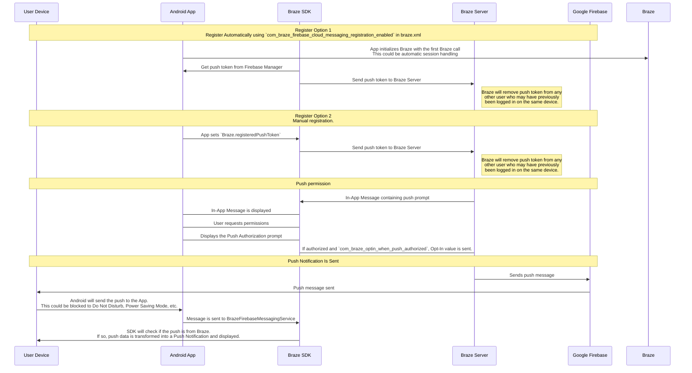

## Den Braze-Push-Workflow verstehen {#understanding-the-braze-push-workflow}

Der Firebase Cloud Messaging (FCM)-Dienst ist die Infrastruktur von Google für Push-Benachrichtigungen, die an Android-Anwendungen gesendet werden. Hier ist die vereinfachte Struktur, wie Push-Benachrichtigungen für die Geräte Ihrer Nutzer:innen aktiviert werden und wie Braze Push-Benachrichtigungen an sie senden kann:




### Schritt 1: Konfigurieren Ihres Google Cloud API-Schlüssels {#step-1-configuring-your-google-cloud-api-key}

Bei der Entwicklung Ihrer App müssen Sie dem Braze Android SDK Ihre Firebase-Sender-ID mitteilen. Außerdem müssen Sie dem Braze-Dashboard einen API-Schlüssel für Serveranwendungen zur Verfügung stellen. Braze verwendet diesen API-Schlüssel, um Nachrichten an Ihre Geräte zu senden. Darüber hinaus müssen Sie überprüfen, dass der FCM-Dienst in der Google-Entwicklerkonsole aktiviert ist.


Ein häufiger Fehler bei diesem Schritt ist die Verwendung des API-Schlüssels des App-Bezeichners anstelle des REST-API-Schlüssels.


### Schritt 2: Geräte registrieren sich für FCM und versorgen Braze mit Push-Token {#step-2-devices-register-for-fcm-and-provide-braze-with-push-tokens}

Bei typischen Integrationen übernimmt das Braze Android SDK die Registrierung von Geräten für die FCM-Funktionalität. Dies geschieht in der Regel sofort, wenn die App zum ersten Mal geöffnet wird. Nach der Registrierung erhält Braze eine FCM-Registrierungs-ID, die verwendet wird, um Nachrichten speziell an dieses Gerät zu senden. Wir speichern die Registrierungs-ID für diese:n Nutzer:in, und diese:r Nutzer:in wird als „Push-registriert“ markiert, wenn zuvor kein Push-Token für eine Ihrer Apps vorhanden war.

### Schritt 3: Starten einer Braze-Push-Campaign {#step-3-launching-a-braze-push-campaign}

Wenn eine Push-Campaign gestartet wird, stellt Braze Anfragen an FCM, um Ihre Nachricht zu übermitteln. Braze verwendet den im Dashboard kopierten API-Schlüssel, um sich zu authentifizieren und zu überprüfen, ob Push-Benachrichtigungen an die angegebenen Push-Token gesendet werden können.

### Schritt 4: Entfernen ungültiger Token {#step-4-removing-invalid-tokens}

Wenn FCM uns mitteilt, dass eines der Push-Token, an die wir eine Nachricht senden wollten, ungültig ist, entfernen wir diese Token aus den Nutzerprofilen, mit denen sie verknüpft waren. Wenn Nutzer:innen keine weiteren Push-Token haben, werden sie auf der Seite **Segments** nicht mehr als „Push-registriert“ angezeigt.

Weitere Informationen über FCM finden Sie unter [Cloud Messaging](https://firebase.google.com/docs/cloud-messaging/).

## Verwendung der Push-Fehlerprotokolle {#utilizing-the-push-error-logs}

Braze stellt Fehler bei Push-Benachrichtigungen im Nachrichten-Aktivitätsprotokoll bereit. Dieses Fehlerprotokoll enthält eine Reihe von Warnungen, die sehr hilfreich sein können, um festzustellen, warum Ihre Campaigns nicht wie erwartet funktionieren. Wenn Sie auf eine Fehlermeldung klicken, werden Sie zur entsprechenden Dokumentation weitergeleitet, die Sie bei der Fehlerbehebung unterstützt.


## Fehlerbehebungsszenarien {#troubleshooting-scenarios}

### Push wird nicht gesendet {#push-isnt-sending}

Ihre Push-Nachrichten werden möglicherweise aus folgenden Gründen nicht gesendet:

- Ihre Zugangsdaten sind in der falschen Google Cloud Platform-Projekt-ID (falsche Sender-ID) hinterlegt.
- Ihre Zugangsdaten haben den falschen Berechtigungsumfang.
- Sie haben falsche Zugangsdaten in den falschen Braze-Workspace hochgeladen (falsche Sender-ID).

Weitere Probleme, die das Senden einer Push-Nachricht verhindern können, finden Sie unter [Fehlerbehebung für Push-Benachrichtigungen]({{site.baseurl}}/user_guide/message_building_by_channel/push/troubleshooting).

### Keine „Push-registrierten“ Nutzer:innen im Braze-Dashboard angezeigt (vor dem Senden von Nachrichten) {#no-push-registered-users-showing-in-the-braze-dashboard-prior-to-sending-messages}

Stellen Sie sicher, dass Ihre App korrekt konfiguriert ist, um Push-Benachrichtigungen zuzulassen. Zu den häufig zu überprüfenden Fehlerpunkten gehören:

#### Falsche Sender-ID {#incorrect-sender-id}

Vergewissern Sie sich, dass in der Datei `braze.xml` die korrekte FCM-Sender-ID angegeben ist. Eine falsche Sender-ID führt zu Fehlern des Typs `MismatchSenderID`, die im Nachrichten-Aktivitätsprotokoll des Dashboards gemeldet werden.

#### Keine Braze-Registrierung {#braze-registration-not-occurring}

Da die FCM-Registrierung außerhalb von Braze erfolgt, kann eine fehlgeschlagene Registrierung nur an zwei Stellen auftreten:

1. Während der Registrierung bei FCM
2. Bei der Übergabe des von FCM erzeugten Push-Token an Braze

Wir empfehlen, einen Haltepunkt zu setzen oder anhand eines Protokolls zu bestätigen, dass das FCM-generierte Push-Token an Braze gesendet wird. Wenn das Token nicht korrekt oder gar nicht generiert wird, empfehlen wir Ihnen, die [FCM-Dokumentation](https://firebase.google.com/docs/cloud-messaging/android/client) zurate zu ziehen.

#### Google Play Services nicht vorhanden {#google-play-services-not-present}

Um FCM-Push nutzen zu können, müssen die Google Play Services auf dem Gerät installiert sein. Wenn die Google Play Services nicht auf einem Gerät installiert sind, erfolgt keine Push-Registrierung.

**Hinweis:** Google Play Services wird auf Android-Emulatoren ohne installierte Google APIs nicht installiert.

#### Gerät nicht mit dem Internet verbunden {#device-not-connected-to-the-internet}

Vergewissern Sie sich, dass Ihr Gerät über eine gute Internetverbindung verfügt und den Netzwerkverkehr nicht über einen Proxy leitet.

### Tippen auf die Push-Benachrichtigung öffnet die App nicht {#tapping-push-notification-doesnt-open-the-app}

Prüfen Sie, ob `com_braze_handle_push_deep_links_automatically` auf `true` oder `false` eingestellt ist. Damit Braze die App und alle Deeplinks automatisch öffnen kann, wenn auf eine Push-Benachrichtigung getippt wird, setzen Sie `com_braze_handle_push_deep_links_automatically` in der Datei `braze.xml` auf `true`.

Wenn `com_braze_handle_push_deep_links_automatically` auf den Standardwert `false` gesetzt ist, müssen Sie einen Braze-Push-Callback verwenden, um auf empfangene und geöffnete Push-Nachrichten zu achten und diese zu verarbeiten.

### Nicht zustellbare Push-Benachrichtigungen (Bounces) {#push-notifications-bounced}

Wenn eine Push-Benachrichtigung nicht zugestellt wurde, überprüfen Sie in der [Entwicklungskonsole]({{site.baseurl}}/developer_guide/platforms/android/push_notifications/troubleshooting#utilizing-the-push-error-logs), ob ein Bounce vorliegt. Im Folgenden finden Sie Beschreibungen häufiger Fehler, die in der Entwicklungskonsole protokolliert werden können:

#### Fehler: MismatchSenderID {#error-mismatchsenderid}

`MismatchSenderID` weist auf eine fehlgeschlagene Authentifizierung hin. Vergewissern Sie sich, dass Ihre Firebase-Sender-ID und Ihr FCM-API-Schlüssel korrekt sind.

#### Fehler: InvalidRegistration {#error-invalidregistration}

`InvalidRegistration` kann durch ein fehlerhaftes Push-Token verursacht werden.

1. Stellen Sie sicher, dass Sie ein gültiges Push-Token von [Firebase Cloud Messaging](https://firebase.google.com/docs/cloud-messaging/android/client#retrieve-the-current-registration-token) an Braze übergeben.

#### Fehler: NotRegistered {#error-notregistered}

1. `NotRegistered` tritt normalerweise auf, wenn eine App von einem Gerät gelöscht wurde. Braze verwendet `NotRegistered` intern, um darauf hinzuweisen, dass eine App von einem Gerät deinstalliert wurde.

2. `NotRegistered` kann auch auftreten, wenn es mehrere Registrierungen gibt und das erste Token durch eine zweite Registrierung ungültig gemacht wird.

### Push-Benachrichtigungen gesendet, aber nicht auf den Geräten der Nutzer:innen angezeigt {#push-notifications-sent-but-not-displayed-on-users-devices}

Es gibt einige Gründe, warum dies der Fall sein könnte:

#### Anwendung wurde zwangsbeendet {#application-was-force-quit}

Wenn Sie Ihre Anwendung über die Systemeinstellungen zwangsbeenden, werden Ihre Push-Benachrichtigungen nicht gesendet. Wenn Sie die App erneut starten, wird Ihr Gerät wieder für den Empfang von Push-Benachrichtigungen aktiviert.

#### BrazeFirebaseMessagingService nicht registriert {#brazefirebasemessagingservice-not-registered}

Der BrazeFirebaseMessagingService muss ordnungsgemäß in `AndroidManifest.xml` registriert sein, damit Push-Benachrichtigungen angezeigt werden können:

```xml
<service android:name="com.braze.push.BrazeFirebaseMessagingService"
  android:exported="false">
  <intent-filter>
    <action android:name="com.google.firebase.MESSAGING_EVENT" />
  </intent-filter>
</service>
```

#### Firewall blockiert Push {#firewall-is-blocking-push}

Beim Testen von Push über WLAN werden die Ports, die FCM für den Empfang von Nachrichten benötigt, möglicherweise durch Ihre Firewall blockiert. Stellen Sie sicher, dass die Ports `5228`, `5229` und `5230` offen sind. Da FCM seine IPs nicht angibt, müssen Sie außerdem Ihrer Firewall erlauben, ausgehende Verbindungen zu allen IP-Adressen zu akzeptieren, die in den IP-Blöcken enthalten sind, die in Googles ASN `15169` aufgeführt sind.

#### Angepasste Benachrichtigungs-Factory gibt null zurück {#custom-notification-factory-returning-null}

Wenn Sie eine [angepasste Benachrichtigungs-Factory]({{site.baseurl}}/developer_guide/platform_integration_guides/android/push_notifications/android/integration/standard_integration#custom-displaying-notifications) implementiert haben, stellen Sie sicher, dass diese nicht `null` zurückgibt. Dies führt dazu, dass Benachrichtigungen nicht angezeigt werden.

### „Push-registrierte“ Nutzer:innen werden nach dem Senden von Nachrichten nicht mehr aktiviert {#push-registered-users-no-longer-enabled-after-sending-messages}

Es gibt einige Gründe, warum dies der Fall sein könnte:

#### Anwendung wurde deinstalliert {#application-was-uninstalled}

Nutzer:innen haben die Anwendung deinstalliert. Dadurch wird ihr FCM-Push-Token ungültig.

#### Ungültiger Firebase Cloud Messaging-Serverschlüssel {#invalid-firebase-cloud-messaging-server-key}

Der im Braze-Dashboard angegebene Firebase Cloud Messaging-Serverschlüssel ist ungültig. Die angegebene Sender-ID sollte mit derjenigen übereinstimmen, auf die in der Datei `braze.xml` Ihrer App verwiesen wird. Den Serverschlüssel und die Sender-ID finden Sie hier in Ihrer Firebase-Konsole:


### Push-Klicks nicht protokolliert {#push-clicks-not-logged}

Braze protokolliert Push-Klicks automatisch, sodass dieses Szenario vergleichsweise selten vorkommen sollte.

Wenn Push-Klicks nicht protokolliert werden, ist es möglich, dass die Push-Klickdaten noch nicht auf unsere Server übertragen wurden. Braze drosselt die Häufigkeit der Übertragungen je nach Stärke der Netzwerkverbindung. Bei einer guten Netzwerkverbindung sollten Push-Klickdaten in der Regel innerhalb einer Minute auf dem Server eintreffen.

### Deeplinks funktionieren nicht {#deep-links-not-working}

#### Deeplink-Konfiguration überprüfen {#verify-deep-link-configuration}

Deeplinks können [mit ADB getestet](https://developer.android.com/training/app-indexing/deep-linking.html#testing-filters) werden. Wir empfehlen, Ihren Deeplink mit dem folgenden Befehl zu testen:

`adb shell am start -W -a android.intent.action.VIEW -d "THE_DEEP_LINK" THE_PACKAGE_NAME`

Wenn der Deeplink nicht funktioniert, ist er möglicherweise falsch konfiguriert. Ein falsch konfigurierter Deeplink funktioniert nicht, wenn er über Braze-Push gesendet wird.

#### Angepasste Verarbeitungslogik überprüfen {#verify-custom-handling-logic}

Wenn der Deeplink [mit ADB einwandfrei funktioniert](https://developer.android.com/training/app-indexing/deep-linking.html#testing-filters), aber über Braze-Push nicht funktioniert, prüfen Sie, ob eine [angepasste Verarbeitung von Push-Öffnungen]({{site.baseurl}}/developer_guide/platform_integration_guides/android/push_notifications/android/integration/standard_integration#android-push-listener-callback) implementiert wurde. Wenn ja, prüfen Sie, ob der eingehende Deeplink vom angepassten Code korrekt verarbeitet wird.

#### Back-Stack-Verhalten deaktivieren {#disable-back-stack-behavior}

Wenn der Deeplink [mit ADB einwandfrei funktioniert](https://developer.android.com/training/app-indexing/deep-linking.html#testing-filters), aber über Braze-Push nicht funktioniert, versuchen Sie, den [Back-Stack](https://developer.android.com/guide/components/activities/tasks-and-back-stack) zu deaktivieren. Aktualisieren Sie dazu die Datei **braze.xml** wie folgt:

```xml
<bool name="com_braze_push_deep_link_back_stack_activity_enabled">false</bool>
```
