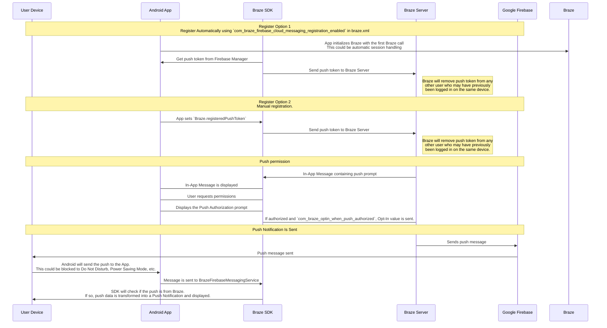

## Den Braze-Push-Workflow verstehen {#understanding-the-braze-push-workflow}

Der Firebase Cloud Messaging (FCM) Dienst ist Googles Infrastruktur für Push-Benachrichtigungen, die an Android-Anwendungen gesendet werden. Hier ist die vereinfachte Struktur, wie Push-Benachrichtigungen für die Geräte Ihrer Nutzer:innen aktiviert werden und wie Braze Push-Benachrichtigungen an diese senden kann:



### Schritt 1: Ihren Google Cloud API-Schlüssel konfigurieren {#step-1-configure-your-google-cloud-api-key}

Bei der Entwicklung Ihrer App müssen Sie dem Braze Android SDK Ihre Firebase-Sender-ID bereitstellen. Darüber hinaus müssen Sie einen API-Schlüssel für Serveranwendungen im Braze-Dashboard angeben. Braze verwendet diesen API-Schlüssel, um Nachrichten an Ihre Geräte zu senden. Sie müssen außerdem sicherstellen, dass der FCM-Dienst in der Google Developer-Konsole aktiviert ist.


Ein häufiger Fehler bei diesem Schritt ist die Verwendung des App-Bezeichner-API-Schlüssels anstelle des REST-API-Schlüssels.


### Schritt 2: Geräte registrieren sich bei FCM und stellen Braze Push-Token / Textbaustein bereit {#step-2-devices-register-for-fcm-and-provide-braze-with-push-tokens}

Bei typischen Integrationen übernimmt das Braze Android SDK die Registrierung der Geräte für die FCM-Funktionalität. Dies geschieht in der Regel direkt beim erstmaligen Öffnen der App. Nach der Registrierung erhält Braze eine FCM-Registrierungs-ID, die verwendet wird, um Nachrichten gezielt an dieses Gerät zu senden. Wir speichern die Registrierungs-ID für diese:n Nutzer:in, und diese:r Nutzer:in wird als „Push-registriert“ markiert, sofern zuvor kein Push-Token / Textbaustein für eine Ihrer Apps vorhanden war.

### Schritt 3: Eine Braze-Push-Campaign starten {#step-3-launch-a-braze-push-campaign}

Wenn eine Push-Campaign gestartet wird, sendet Braze Anfragen an FCM, um Ihre Nachricht zuzustellen. Braze verwendet den im Dashboard hinterlegten API-Schlüssel, um sich zu authentifizieren und zu bestätigen, dass Push-Benachrichtigungen an die bereitgestellten Push-Token / Textbaustein gesendet werden können.

### Schritt 4: Ungültige Token / Textbaustein entfernen {#step-4-remove-invalid-tokens}

Wenn FCM uns mitteilt, dass Push-Token / Textbaustein, an die wir eine Nachricht senden wollten, ungültig sind, entfernen wir diese Token / Textbaustein aus den zugehörigen Nutzerprofilen. Wenn Nutzer:innen keine weiteren Push-Token / Textbaustein besitzen, werden sie auf der **Segments**-Seite nicht mehr als „Push-registriert“ angezeigt.

Weitere Informationen zu FCM finden Sie unter [Cloud Messaging](https://firebase.google.com/docs/cloud-messaging/).

## Push-Fehlerprotokolle verwenden {#use-the-push-error-logs}

Braze stellt Push-Benachrichtigungsfehler im Nachrichtenaktivitätsprotokoll bereit. Dieses Fehlerprotokoll enthält verschiedene Warnungen, die sehr hilfreich sein können, um herauszufinden, warum Ihre Campaigns nicht wie erwartet funktionieren. Wenn Sie eine Fehlermeldung auswählen, werden Sie zur relevanten Dokumentation weitergeleitet, die Ihnen bei der Fehlerbehebung eines bestimmten Vorfalls hilft.


## Fehlerbehebung {#troubleshooting}

### Push wird nicht gesendet {#push-isnt-sending}

Ihre Push-Nachrichten werden möglicherweise aus folgenden Gründen nicht gesendet:

- Ihre Zugangsdaten sind im falschen Google Cloud Platform-Projekt (falsche Sender-ID) hinterlegt.
- Ihre Zugangsdaten haben den falschen Berechtigungsumfang.
- Sie haben falsche Zugangsdaten in den falschen Braze-Workspace hochgeladen (falsche Sender-ID).

Für weitere Probleme, die das Senden einer Push-Nachricht verhindern können, lesen Sie [Benutzerhandbuch: Fehlerbehebung für Push]({{site.baseurl}}/user_guide/channels/push/troubleshooting).

### Keine „Push-registrierten“ Nutzer:innen im Braze-Dashboard angezeigt (vor dem Senden von Nachrichten) {#no-push-registered-users-showing-in-the-braze-dashboard-prior-to-sending-messages}

Stellen Sie sicher, dass Ihre App korrekt für Push-Benachrichtigungen konfiguriert ist. Häufige Fehlerquellen, die Sie überprüfen sollten:

#### Falsche Sender-ID {#incorrect-sender-id}

Prüfen Sie, ob die korrekte FCM-Sender-ID in der Datei `braze.xml` enthalten ist. Eine falsche Sender-ID führt zu `MismatchSenderID`-Fehlern, die im Nachrichtenaktivitätsprotokoll des Dashboards gemeldet werden.

#### Braze-Registrierung findet nicht statt {#braze-registration-not-occurring}

Da die FCM-Registrierung außerhalb von Braze abgewickelt wird, kann ein Registrierungsfehler nur an zwei Stellen auftreten:

1. Während der Registrierung bei FCM
2. Beim Übergeben des von FCM generierten Push-Tokens an Braze

Wir empfehlen, einen Breakpoint zu setzen oder Logging zu aktivieren, um sicherzustellen, dass das von FCM generierte Push-Token / Textbaustein an Braze gesendet wird. Wenn ein Token / Textbaustein nicht korrekt oder gar nicht generiert wird, empfehlen wir, die [FCM-Dokumentation](https://firebase.google.com/docs/cloud-messaging/android/client) zu konsultieren.

#### Google Play Services nicht vorhanden {#google-play-services-not-present}

Damit FCM-Push funktioniert, müssen Google Play Services auf dem Gerät vorhanden sein. Wenn Google Play Services nicht auf einem Gerät installiert sind, findet keine Push-Registrierung statt.


Google Play Services sind auf Android-Emulatoren ohne installierte Google APIs nicht verfügbar.


#### Gerät nicht mit dem Internet verbunden {#device-not-connected-to-the-internet}

Prüfen Sie, ob Ihr Gerät über eine stabile Internetverbindung verfügt und den Netzwerkverkehr nicht über einen Proxy sendet.

### Tippen auf Push-Benachrichtigung öffnet die App nicht {#tapping-push-notification-doesnt-open-the-app}

Prüfen Sie, ob `com_braze_handle_push_deep_links_automatically` auf `true` oder `false` gesetzt ist. Um Braze zu ermöglichen, die App und alle Deeplinks beim Tippen auf eine Push-Benachrichtigung automatisch zu öffnen, setzen Sie `com_braze_handle_push_deep_links_automatically` in Ihrer `braze.xml`-Datei auf `true`.

Wenn `com_braze_handle_push_deep_links_automatically` auf den Standardwert `false` gesetzt ist, müssen Sie einen Braze-Push-Callback verwenden, um empfangene und geöffnete Push-Absichten abzufangen und zu verarbeiten.

### Push-Benachrichtigungen gebounced {#push-notifications-bounced}

Wenn eine Push-Benachrichtigung nicht zugestellt wird, stellen Sie sicher, dass sie nicht gebounced ist, indem Sie die [Entwicklungskonsole]({{site.baseurl}}/developer_guide/platforms/android/push_notifications/troubleshooting#utilizing-the-push-error-logs) prüfen. Im Folgenden finden Sie Beschreibungen häufiger Fehler, die in der Entwicklungskonsole protokolliert werden können:

#### Fehler: MismatchSenderID {#error-mismatchsenderid}

`MismatchSenderID` weist auf einen Authentifizierungsfehler hin. Stellen Sie sicher, dass Ihre Firebase-Sender-ID und Ihr FCM-API-Schlüssel korrekt sind.

#### Fehler: InvalidRegistration {#error-invalidregistration}

`InvalidRegistration` kann durch ein fehlerhaftes Push-Token / Textbaustein verursacht werden.

1. Stellen Sie sicher, dass Sie ein gültiges Push-Token / Textbaustein von [Firebase Cloud Messaging](https://firebase.google.com/docs/cloud-messaging/android/client#retrieve-the-current-registration-token) an Braze übergeben.

#### Fehler: NotRegistered {#error-notregistered}

2. `NotRegistered` kann auch auftreten, wenn mehrere Registrierungen stattfinden und eine zweite registrieren das erste Token / Textbaustein ungültig macht.

### Push-Benachrichtigungen gesendet, aber nicht auf Geräten der Nutzer:innen angezeigt {#push-notifications-sent-but-not-displayed-on-users-devices}

Es gibt mehrere mögliche Ursachen:

#### Anwendung wurde erzwungen beendet {#application-was-force-quit}

Wenn Sie Ihre Anwendung über die Systemeinstellungen erzwungen beenden, werden Ihre Push-Benachrichtigungen nicht gesendet. Durch erneutes Starten der App wird Ihr Gerät wieder für den Empfang von Push-Benachrichtigungen aktiviert.

#### BrazeFirebaseMessagingService nicht registriert {#brazefirebasemessagingservice-not-registered}

Der BrazeFirebaseMessagingService muss korrekt in der `AndroidManifest.xml` registriert sein, damit Push-Benachrichtigungen angezeigt werden:

```xml
<service android:name="com.braze.push.BrazeFirebaseMessagingService"
  android:exported="false">
  <intent-filter>
    <action android:name="com.google.firebase.MESSAGING_EVENT" />
  </intent-filter>
</service>
```

#### Firewall blockiert Push {#firewall-is-blocking-push}

Wenn Sie Push über WLAN testen, blockiert Ihre Firewall möglicherweise Ports, die FCM zum Empfangen von Nachrichten benötigt. Stellen Sie sicher, dass die Ports `5228`, `5229` und `5230` geöffnet sind. Da FCM keine festen IP-Adressen angibt, müssen Sie außerdem Ihrer Firewall erlauben, ausgehende Verbindungen zu allen IP-Adressen in den IP-Blöcken des Google ASN `15169` zu akzeptieren.

#### Benutzerdefinierte Notification Factory gibt null zurück {#custom-notification-factory-returning-null}

Wenn Sie eine [benutzerdefinierte Notification Factory]({{site.baseurl}}/developer_guide/platform_integration_guides/android/push_notifications/android/integration/standard_integration#custom-displaying-notifications) implementiert haben, stellen Sie sicher, dass diese nicht `null` zurückgibt. Dies würde dazu führen, dass Benachrichtigungen nicht angezeigt werden.

### „Push-registrierte“ Nutzer:innen nach dem Senden von Nachrichten nicht mehr aktiviert {#push-registered-users-no-longer-enabled-after-sending-messages}

Es gibt mehrere mögliche Ursachen:

#### Anwendung wurde deinstalliert {#application-was-uninstalled}

Nutzer:innen haben die Anwendung deinstalliert. Dadurch wird ihr FCM-Push-Token / Textbaustein ungültig.

#### Ungültiger Firebase Cloud Messaging-Serverschlüssel {#invalid-firebase-cloud-messaging-server-key}

Der im Braze-Dashboard hinterlegte Firebase Cloud Messaging-Serverschlüssel ist ungültig. Die angegebene Sender-ID sollte mit der in der `braze.xml`-Datei Ihrer App referenzierten übereinstimmen. Den Serverschlüssel und die Sender-ID finden Sie hier in Ihrer Firebase Console:


### Push-Klicks werden nicht protokolliert {#push-clicks-not-logged}

Wenn Push-Klicks nicht protokolliert werden, ist es möglich, dass die Push-Klick-Daten noch nicht an unsere Server übertragen wurden. Das Braze Android SDK kann Übertragungen drosseln.

Wenn Sie einen benutzerdefinierten Push-Handler implementiert haben, stellen Sie sicher, dass Sie die [nativen Push-Analytics korrekt beibehalten]({{site.baseurl}}/developer_guide/push_notifications/logging_message_data/?tab=android#preserving-native-push-analytics-with-custom-push-handling).

Das Protokollieren von Push-Klicks ist ein Netzwerkvorgang und unterliegt Netzwerkbeschränkungen. Obwohl das Braze Android SDK Netzwerkfehler berücksichtigt und fehlgeschlagene Anfragen wiederholt, ist ein gewisser Datenverlust zu erwarten.

### Deeplinks funktionieren nicht {#deep-links-not-working}

#### Deeplink-Konfiguration überprüfen {#verify-deep-link-configuration}

Deeplinks können [mit ADB getestet werden](https://developer.android.com/training/app-indexing/deep-linking.html#testing-filters). Wir empfehlen, Ihren Deeplink mit dem folgenden Befehl zu testen:

`adb shell am start -W -a android.intent.action.VIEW -d "THE_DEEP_LINK" THE_PACKAGE_NAME`

Wenn der Deeplink nicht funktioniert, ist er möglicherweise falsch konfiguriert. Ein falsch konfigurierter Deeplink funktioniert auch nicht, wenn er über Braze-Push gesendet wird.

#### Benutzerdefinierte Verarbeitungslogik überprüfen {#verify-custom-handling-logic}

Wenn der Deeplink [mit ADB korrekt funktioniert](https://developer.android.com/training/app-indexing/deep-linking.html#testing-filters), aber nicht über Braze-Push, prüfen Sie, ob eine [benutzerdefinierte Push-Open-Verarbeitung]({{site.baseurl}}/developer_guide/platform_integration_guides/android/push_notifications/android/integration/standard_integration#android-push-listener-callback) implementiert wurde. Wenn ja, stellen Sie sicher, dass der benutzerdefinierte Verarbeitungscode den eingehenden Deeplink ordnungsgemäß verarbeitet.

#### Back-Stack-Verhalten deaktivieren {#disable-back-stack-behavior}

Wenn der Deeplink [mit ADB korrekt funktioniert](https://developer.android.com/training/app-indexing/deep-linking.html#testing-filters), aber nicht über Braze-Push, versuchen Sie, den [Back-Stack](https://developer.android.com/guide/components/activities/tasks-and-back-stack) zu deaktivieren. Aktualisieren Sie dazu Ihre **braze.xml**-Datei mit folgendem Eintrag:

```xml
<bool name="com_braze_push_deep_link_back_stack_activity_enabled">false</bool>
```
