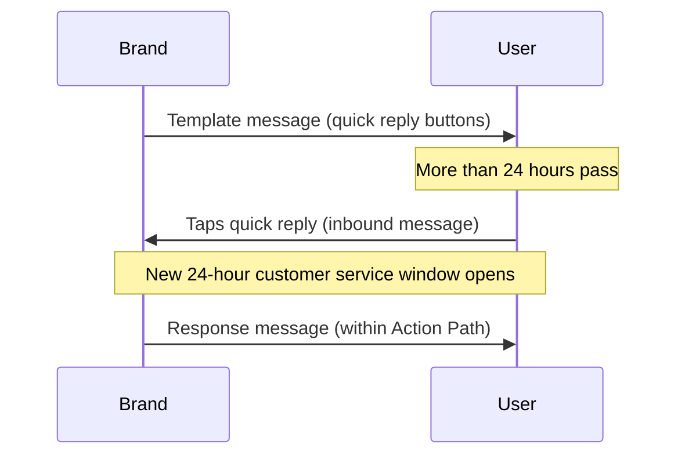

# Nutzernachrichten {#user-messages}

> WhatsApp ist ein Kanal für wechselseitige Kommunikation. Ihre Marke kann nicht nur Nachrichten an Nutzer:innen senden, sondern diese können auch über Template-Campaigns und Canvases an Konversationen teilnehmen. Es gibt verschiedene Möglichkeiten, dies zu tun, darunter WhatsApp-Schnellantworten, Listennachrichten und Trigger-Wörter. Schnellantwort- und Listennachrichten-Calls-to-Action (CTAs) sind eine großartige Möglichkeit, das Nutzer-Engagement mit Ihrem WhatsApp-Messaging zu fördern.

## Aktionsbasierte Trigger {#action-based-triggers}

Sowohl Campaigns als auch Canvases können durch eine eingehende WhatsApp-Nachricht (eine Nachricht einer Nutzer:in an Ihr WhatsApp) gestartet, verzweigt und mit Änderungen während der Journey versehen werden, z. B. durch ein Trigger-Wort.

Stellen Sie sicher, dass Ihr Trigger-Wort dem entspricht, was Sie von Nutzer:innen erwarten.

**Wichtige Hinweise:**
- Jeder Buchstabe Ihres Trigger-Worts muss bei der Konfiguration großgeschrieben werden. Braze verlangt nicht, dass eingehende Trigger-Wörter, die von Nutzer:innen gesendet werden, großgeschrieben sind. Beispielsweise löst die Nachricht „jOin2023“ trotzdem das Canvas oder die Campaign aus.
- Wenn kein Trigger-Wort im aktionsbasierten Trigger des Einstiegszeitplans angegeben ist, wird die Campaign oder das Canvas für ALLE eingehenden WhatsApp-Nachrichten ausgeführt. Dies schließt Nachrichten ein, die mit Phrasen in aktiven Campaigns und Canvases übereinstimmen. In diesem Fall erhält die Nutzer:in zwei WhatsApp-Nachrichten.










## Nicht erkannte Antworten {#unrecognized-responses}

Wir empfehlen, in interaktiven Canvases eine Option für nicht erkannte Antworten einzubauen. Dies hilft Nutzer:innen zu verstehen, welche Eingaben verfügbar sind, und setzt Erwartungen für den Kanal. Erwartungsmanagement kann besonders hilfreich sein, wenn Sie WhatsApp-Kanäle mit Live-Agent-Chat haben.
- Fügen Sie im Aktionsschritt nach dem Erstellen der Aktionsgruppen für die angepassten Filterphrasen eine zusätzliche Aktionsgruppe für „WhatsApp-Nachricht senden“ hinzu, aber **aktivieren Sie nicht die Option Wo der Nachrichtentext**. Dies fängt alle nicht erkannten Nutzerantworten auf, ähnlich wie eine „else“-Klausel.
- Wir empfehlen, eine WhatsApp-Nachricht zu senden, die Nutzer:innen darüber informiert, dass dieser Kanal nicht betreut wird, und sie bei Bedarf an einen Support-Kanal weiterzuleiten.

## Schnellantworten {#quick-replies}

{: style="float:right;max-width:25%;margin-left:15px;border: 0;"}

Schnellantworten erscheinen als anklickbare Button-Optionen innerhalb der Konversation, verhalten sich jedoch so, als hätte ein:e Nutzer:in mit Text geantwortet. Braze verarbeitet diese dann als eingehende Nachrichten und kann basierend auf dem angeklickten Button festgelegte Antworten zurücksenden. Verwenden Sie den Schritt „Eingehende WhatsApp-Nachrichtenaktion“, wenn Sie Antworten Ihrer Nutzer:innen erstellen und filtern.

{: style="max-width:50%;"}

### Schnellantwort-Erlebnis in Canvas konfigurieren {#configure-the-quick-reply-experience-in-canvas}

#### Schritt 1: CTAs erstellen {#step-1-build-out-ctas}

Erstellen Sie zunächst Ihre Schnellantwort-CTAs im [WhatsApp-Nachrichtentemplate-Manager:in](https://business.facebook.com/wa/manage/message-templates/) innerhalb eines Nachrichtentemplates.

{: style="max-width:80%;"}

Sobald Ihr Template eingereicht und von WhatsApp genehmigt wurde, können Sie es verwenden, um ein Canvas in Braze zu erstellen.


Sie können das Canvas erstellen, bevor Sie die Genehmigung für Ihr Nachrichtentemplate erhalten haben.


#### Schritt 2: Canvas erstellen {#step-2-build-your-canvas}

Erstellen Sie als Nächstes ein Canvas mit einem Nachrichten-Schritt, der Ihr erstelltes Template enthält.

Erstellen Sie einen Aktionsschritt, der auf den Nachrichten-Schritt folgt. Erstellen Sie in diesem Aktionsschritt eine Gruppe pro Schnellantwort-Option.

Geben Sie für jede Schnellantwort-Optionsgruppe den exakten Text als den Button an, den Sie abgleichen möchten. Beachten Sie, dass die Keywords in Großbuchstaben geschrieben sein müssen.

Wenn Sie eine Standardantwort für Nutzer:innen wünschen, die auf die Nachricht mit Text anstatt mit Schnellantworten antworten, erstellen Sie eine zusätzliche Gruppe ohne übereinstimmenden Nachrichtentext.

Setzen Sie den Aufbau des Canvas ab diesem Punkt wie gewohnt fort.

### Antworten {#responses}

In den meisten Fällen möchten Sie für jede Antwort eine Antwortnachricht haben. Wir empfehlen eine Auffangoption für Antworten, die außerhalb des Rahmens der Schnellantworten liegen (z. B. für Kund:innen, die mit einer allgemeinen Nachricht antworten anstatt mit einer vordefinierten Eingabeaufforderung). Zum Beispiel: „Es tut uns leid, wir konnten Ihre Antwort nicht zuordnen. Für Supportanfragen kontaktieren Sie bitte <Support-Kanal>.“

Beachten Sie, dass Sie alle nachfolgenden Aktionen nutzen können, die Braze Canvas bietet, wie z. B. Antwortnachrichten, Kundenprofil-Aktualisierungen oder Braze-zu-Braze-Webhooks.

## Listennachrichten {#list-messages}

Listennachrichten erscheinen als Textnachricht mit einer Liste anklickbarer Optionen. Jede Liste kann mehrere Abschnitte enthalten, und jede Liste kann bis zu 10 Zeilen haben.

{: style="max-width:40%;"}

### Die Listennachricht-Erfahrung in Canvas konfigurieren {#configure-the-list-message-experience-in-canvas}

#### Schritt 1: Erstellen oder bearbeiten Sie ein bestehendes aktionsbasiertes Canvas {#step-1-create-or-edit-an-existing-action-based-canvases}

Sie können WhatsApp-Listennachrichten nur zu Canvases hinzufügen, die aktionsbasiert sind, da sie eine Antwort auf eine Nutzernachricht sein müssen.

#### Schritt 2: Erstellen Sie einen WhatsApp-Nachrichten-Schritt {#step-2-create-a-whatsapp-message-step}

Fügen Sie einen WhatsApp-[Nachrichten-Schritt]({{site.baseurl}}/user_guide/messaging/canvas/canvas_components/message_step) hinzu und wählen Sie dann das Antwortnachrichtenlayout **List Message** aus.

{: style="max-width:70%;"}

Fügen Sie einen **List button**-Namen hinzu, den Nutzer:innen auswählen, um Ihre Liste anzuzeigen. Verwenden Sie dann die Felder unter **List content**, um Ihre Liste zu erstellen:

- **Section:** Fügen Sie bis zu 10 Abschnitte hinzu, um Ihre Listenelemente zu gruppieren und zu organisieren. Ein Einzelhändler für Bekleidung könnte beispielsweise Abschnitte verwenden, um nach saisonalen Stilen (wie Frühling, Sommer, Herbst und Winter) oder Kleidungsstücken (wie Oberteile, Unterteile und Schuhe) zu organisieren.
- **Row:** Fügen Sie bis zu 10 Zeilen oder Listenelemente über alle Abschnitte hinweg hinzu.
- **Row description (optional):** Fügen Sie optional eine Beschreibung zu allen Zeilen (Listenelementen) hinzu.

{: style="max-width:60%;"}

Ändern Sie die Reihenfolge von Abschnitten und Zeilen, indem Sie das Symbol neben ihren Namen auswählen und ziehen.

{: style="max-width:60%;"}

Fügen Sie im Canvas-Composer nach dem Nachrichten-Schritt einen [Aktionspfad]({{site.baseurl}}/user_guide/messaging/canvas/canvas_components/action_paths) hinzu, der eine Gruppe für jede Listenantwort enthält. In jeder Gruppe:

1. Fügen Sie einen Trigger für **Sent inbound WhatsApp subscription group** hinzu und wählen Sie die entsprechende WhatsApp-Abo-Gruppe aus.
2. Aktivieren Sie das Kontrollkästchen **Where the message body**.
3. Geben Sie den Inhalt für eine Zeile (oder ein Listenelement) an.

Fahren Sie mit dem Aufbau Ihres Canvas fort.

### Aktionspfade für lange Beschreibungen erstellen {#creating-actions-paths-for-long-descriptions}

Wenn Sie Zeilenbeschreibungen haben, müssen Sie **Matches regex** verwenden, um eine Zeile anzugeben. Wenn Sie beispielsweise eine Zeile mit der Beschreibung „Our new style that fits over your favorite pair of ankle boots“ angeben möchten, können Sie [Regex]({{site.baseurl}}/user_guide/audience/segments/regex) mit „ankle boots“ verwenden.

## Überlegungen {#considerations}

### Zeitanforderungen für Antwortnachrichten {#timing-requirements-for-response-messages}

Antwortnachrichten müssen innerhalb von 24 Stunden nach Erhalt der Nachricht einer Nutzerin oder eines Nutzers gesendet werden. Um erfolgreiche Erlebnisse aufzubauen, überprüft Braze die Nachrichtenlogik, um sicherzustellen, dass eine vorgelagerte eingehende Nutzernachricht vorhanden ist, die die Antwortnachricht freigibt.

Für Antworten im Sub-Minuten-Bereich in wechselseitigen Canvas-Flows sollten Sie die Schritte zwischen dem eingehenden Trigger und dem Versand der Antwortnachricht minimieren. Canvas-Architektur, Webhook-Roundtrips und User-Update-Batching können Latenz hinzufügen. Siehe [Antwortlatenz für wechselseitige Flows minimieren]({{site.baseurl}}/user_guide/channels/whatsapp/best_practices#minimize-response-latency-for-two-way-flows).

Die folgenden Events geben Antwortnachrichten frei:

- Eingehende Nachricht
  - [Aktionspfad]({{site.baseurl}}/action_paths) oder [aktionsbasierter Entry]({{site.baseurl}}/user_guide/messaging/campaigns/schedule_your_campaign/triggered_delivery) mit dem Trigger **Send a WhatsApp inbound message**.

- [API-getriggerter Entry]({{site.baseurl}}/user_guide/messaging/campaigns/schedule_your_campaign/api_triggered_delivery)
- Eingehende Produktnachricht
  - [`ecommerce.cart_updated`]({{site.baseurl}}/user_guide/data/activation/events/recommended_events/ecommerce_events#types-of-ecommerce-recommended-events?tab=ecommerce.cart_updated)-Event

### Schnellantworten und eingehende Nachrichten außerhalb des 24-Stunden-Fensters {#quick-replies-and-inbound-messages-outside-the-24-hour-window}

Wenn Nutzer:innen mit Ihrem Unternehmen auf WhatsApp interagieren – einschließlich dem Antippen einer Schnellantwort-Schaltfläche auf einer älteren Template-Nachricht – zählt ihre Aktion als eingehende Nachricht. Diese eingehende Nachricht öffnet ein neues 24-Stunden-Kundenservice-Fenster, auch wenn das ursprüngliche Template vor mehr als 24 Stunden gesendet wurde.

In einem Canvas mit Schnellantwort-Buttons können Nutzer:innen einen Button Tage nach dem Erhalt des Willkommens-Templates antippen und trotzdem den korrekten Aktionspfad betreten. Braze wertet den Aktionspfad aus, wenn die eingehende Nachricht eintrifft; Sie müssen die Dauer des Aktionspfads nicht über den Standard hinaus verlängern, um verspätete Antworten zu erfassen.

Das folgende Diagramm zeigt einen typischen Schnellantwort-Flow:

#### Wissenswertes {#things-to-know}

- Der Antwortnachrichten-Schritt muss weiterhin innerhalb von 24 Stunden nach der eingehenden Nachricht der Nutzerin oder des Nutzers liegen. In den meisten Canvas-Flows wird die Antwort sofort gesendet, nachdem der Aktionspfad ausgewertet wurde, sodass dies kein Problem darstellt.
- Das 24-Stunden-Kundenservice-Fenster unterscheidet sich von Canvas-[Konversions-Events]({{site.baseurl}}/user_guide/messaging/messaging_fundamentals/conversion_events), die ein Fenster von bis zu 30 Tagen verwenden können. Konversions-Fenster steuern die Attribution; sie beeinflussen nicht, ob eine Antwortnachricht gesendet werden kann.
- Informationen zur Abrechnung finden Sie unter [Sind WhatsApp-Antwortnachrichten kostenlos?]({{site.baseurl}}/user_guide/channels/whatsapp/faq#are-whatsapp-response-messages-free).

### Filtern nach einem angepassten Zeitattribut {#filtering-by-a-custom-time-attribute}

Wenn Ihre aktionsbasierte WhatsApp-Campaign oder Canvas-Zielgruppe von einem angepassten Zeitattribut abhängt, das in ein relatives Fenster fällt (zum Beispiel zwischen jetzt und den nächsten 24 Stunden), kombinieren Sie zwei Filter wie unter [Zeit]({{site.baseurl}}/user_guide/data/activation/custom_data/data_types#custom-attribute-data-types) beschrieben.

### Speicherung eingehender Medien und URL-Ablauf {#inbound-media-storage-and-url-expiration}

Wenn Nutzer:innen eine WhatsApp-Nachricht senden, die Medien enthält (wie ein Bild, eine Audio-Datei oder ein Dokument), speichert Braze diese Medien 30 Tage lang ab dem Empfangszeitpunkt der Nachricht in Amazon S3.

Das Liquid-Feld `inbound_media_urls`, das auf die URL dieser Medien verweist, ist jedoch nur sieben Tage ab dem Zeitpunkt gültig, an dem Braze die eingehende Nachricht empfängt. Da die URL einmalig beim Empfang generiert und nicht neu erstellt wird, gilt das Sieben-Tage-Fenster unabhängig davon, wann Sie auf das Feld zugreifen. Das kürzere der beiden Limits gilt, daher sollte `inbound_media_urls` in der Praxis als bis zu sieben Tage gültig behandelt werden.


Wenn Sie einen `inbound_media_urls`-Wert in einem angepassten Nutzerattribut für die spätere Verwendung speichern, beachten Sie diesen Sieben-Tage-Ablauf. Der Versuch, nach Ablauf auf die URL zuzugreifen, führt zu einem defekten Link.


### Eingehender Profilname {#inbound-profile-name}

Wenn Meta einen Anzeigenamen in einer eingehenden WhatsApp-Nachricht mitliefert, stellt Braze diesen als Liquid-Attribut `{{whats_app.${inbound_profile_name}}}` für dieses eingehende Event zur Verfügung. Dieser Wert spiegelt den Namen wider, den die Nutzerin oder der Nutzer in WhatsApp eingestellt hat, und stimmt möglicherweise nicht mit CRM-Profildaten überein. Validieren Sie die Daten, bevor Sie sie in Nutzertexten verwenden, oder nutzen Sie einen Canvas-User-Update-Schritt, um den Wert in einem Profilfeld für die spätere Verwendung zu speichern. Eine vollständige Liste der WhatsApp-Liquid-Attribute finden Sie unter [Unterstützte Personalisierungs-Tags]({{site.baseurl}}/user_guide/messaging/design_and_edit/personalize/liquid/supported_personalization_tags).