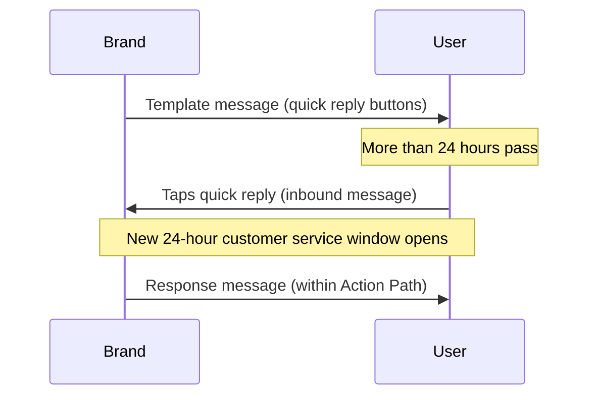

# Nutzernachrichten {#user-messages}

> WhatsApp ist ein Kanal für wechselseitige Kommunikation. Ihre Marke kann nicht nur Nachrichten an Nutzer:innen senden, sondern diese können auch über Template-Campaigns und Canvases an Konversationen teilnehmen. Es gibt verschiedene Möglichkeiten, dies zu tun, darunter WhatsApp-Schnellantworten, Listennachrichten und Trigger-Wörter. Schnellantwort- und Listennachrichten-Calls-to-Action (CTAs) sind eine großartige Möglichkeit, das Nutzer-Engagement mit Ihrem WhatsApp-Messaging zu fördern.

## Aktionsbasierte Trigger {#action-based-triggers}

Sowohl Campaigns als auch Canvases können durch eine eingehende WhatsApp-Nachricht (eine Nachricht von Nutzer:innen an Ihr WhatsApp) gestartet, verzweigt und während der Journey geändert werden, beispielsweise durch ein Trigger-Wort.

Stellen Sie sicher, dass Ihr Trigger-Wort dem entspricht, was Sie von Nutzer:innen erwarten.

**Wissenswertes:**
- Jeder Buchstabe Ihres Trigger-Worts muss bei der Konfiguration großgeschrieben werden. Braze erfordert nicht, dass eingehende Trigger-Wörter, die von Nutzer:innen gesendet werden, großgeschrieben sind. Beispielsweise wird die Nachricht „jOin2023“ trotzdem den Canvas oder die Campaign triggern.
- Wenn kein Trigger-Wort im aktionsbasierten Trigger des Entry-Zeitplans angegeben ist, wird die Campaign oder der Canvas für ALLE eingehenden WhatsApp-Nachrichten ausgeführt. Dies schließt Nachrichten ein, die übereinstimmende Phrasen in aktiven Campaigns und Canvases haben, wobei die Nutzer:innen in diesem Fall zwei WhatsApp-Nachrichten erhalten.










## Nicht erkannte Antworten {#unrecognized-responses}

Wir empfehlen, eine Option für nicht erkannte Antworten in interaktiven Canvases einzubauen. Dies hilft Nutzer:innen zu verstehen, welche Eingabeaufforderungen verfügbar sind, und setzt Erwartungen für den Kanal. Erwartungsmanagement kann besonders hilfreich sein, wenn Sie WhatsApp-Kanäle mit Live-Agent-Chat haben.
- Erstellen Sie im Aktions-Schritt nach den Aktionsgruppen für die angepassten Filterphrasen eine zusätzliche Aktionsgruppe für „WhatsApp-Nachricht senden“, aber **aktivieren Sie nicht die Option „Where the message body“**. Dies fängt alle nicht erkannten Nutzerantworten ab, ähnlich einer „else“-Klausel.
- Wir empfehlen, mit einer WhatsApp-Nachricht zu antworten, die die Nutzer:innen darüber informiert, dass dieser Kanal nicht betreut wird, und sie bei Bedarf an einen Support-Kanal weiterzuleiten.

## Schnellantworten {#quick-replies}

{: style="float:right;max-width:25%;margin-left:15px;border: 0;"}

Schnellantworten erscheinen als anklickbare Button-Optionen innerhalb der Konversation, verhalten sich aber so, als hätten Nutzer:innen mit Text geantwortet. Braze verarbeitet diese dann als eingehende Nachrichten und kann basierend auf dem angeklickten Button festgelegte Antworten zurücksenden. Verwenden Sie den Schritt „Eingehende WhatsApp-Nachrichtenaktion“, wenn Sie Antworten Ihrer Nutzer:innen erstellen und filtern.

{: style="max-width:50%;"}

### Schnellantwort-Erlebnis in Canvas konfigurieren {#configure-the-quick-reply-experience-in-canvas}

#### Schritt 1: CTAs erstellen {#step-1-build-out-ctas}

Erstellen Sie zunächst Ihre Schnellantwort-CTAs im [WhatsApp-Nachrichtentemplate-Manager](https://business.facebook.com/wa/manage/message-templates/) innerhalb eines Nachrichtentemplates.

{: style="max-width:80%;"}

Sobald Ihr Template eingereicht und von WhatsApp genehmigt wurde, können Sie es verwenden, um einen Canvas in Braze zu erstellen.


Sie können den Canvas erstellen, bevor Sie die Genehmigung für Ihr Nachrichtentemplate erhalten.


#### Schritt 2: Canvas erstellen {#step-2-build-your-canvas}

Erstellen Sie als Nächstes einen Canvas mit einem Nachrichten-Schritt, der Ihr erstelltes Template enthält.

Erstellen Sie einen Aktions-Schritt, der dem Nachrichten-Schritt folgt. Erstellen Sie in diesem Aktions-Schritt eine Gruppe pro Schnellantwort-Option.

Geben Sie für jede Schnellantwort-Optionsgruppe den exakten Text als den Button an, den Sie abgleichen möchten. Beachten Sie, dass die Schlüsselwörter in Großbuchstaben angegeben werden müssen.

Wenn Sie eine Standardantwort für Nutzer:innen wünschen, die auf die Nachricht mit Text statt mit Schnellantworten antworten, erstellen Sie eine zusätzliche Gruppe ohne übereinstimmenden Nachrichtentext.

Fahren Sie ab diesem Punkt wie gewohnt mit dem Aufbau des Canvas fort.

### Antworten {#responses}

Höchstwahrscheinlich möchten Sie für jede Antwort eine Antwortnachricht. Wir empfehlen, eine Auffangoption für Antworten außerhalb der Schnellantworten bereitzuhalten (z. B. für Kund:innen, die mit einer allgemeinen Nachricht statt einer vordefinierten Eingabeaufforderung antworten). Zum Beispiel: „Es tut uns leid, wir konnten Ihre Antwort nicht erkennen. Bei Support-Anfragen wenden Sie sich bitte an <Support-Kanal>.“

Beachten Sie, dass Sie alle nachfolgenden Aktionen nutzen können, die der Braze-Canvas bietet, wie z. B. Nachrichten als Antwort, Nutzerprofil-Updates oder Braze-zu-Braze-Webhooks.

## Listennachrichten {#list-messages}

Listennachrichten erscheinen als Textnachricht mit einer Liste anklickbarer Optionen. Jede Liste kann mehrere Abschnitte enthalten, und jede Liste kann bis zu 10 Zeilen haben.

{: style="max-width:40%;"}

### Listennachrichten-Erlebnis in Canvas konfigurieren {#configure-the-list-message-experience-in-canvas}

#### Schritt 1: Aktionsbasierte Canvases erstellen oder bearbeiten {#step-1-create-or-edit-an-existing-action-based-canvases}

Sie können WhatsApp-Listennachrichten nur zu aktionsbasierten Canvases hinzufügen, da sie als Antwort auf eine Nutzernachricht erfolgen müssen.

#### Schritt 2: WhatsApp-Nachrichten-Schritt erstellen {#step-2-create-a-whatsapp-message-step}

Fügen Sie einen WhatsApp-[Nachrichten-Schritt]({{site.baseurl}}/user_guide/messaging/canvas/canvas_components/message_step) hinzu und wählen Sie dann das Antwortnachrichten-Layout **Listennachricht** aus.

{: style="max-width:70%;"}

Fügen Sie einen **Listen-Button**-Namen hinzu, den Nutzer:innen auswählen, um Ihre Liste anzuzeigen. Verwenden Sie dann die Felder unter **Listeninhalt**, um Ihre Liste zu erstellen:

- **Abschnitt:** Fügen Sie bis zu 10 Abschnitte hinzu, um Ihre Listenelemente zu gruppieren und zu organisieren. Beispielsweise könnte ein Bekleidungshändler Abschnitte verwenden, um nach saisonalen Stilen (wie Frühling, Sommer, Herbst und Winter) oder Kleidungsstücken (wie Oberteile, Unterteile und Schuhe) zu organisieren.
- **Zeile:** Fügen Sie bis zu 10 Zeilen oder Listenelemente über alle Abschnitte hinweg hinzu.
- **Zeilenbeschreibung (optional):** Fügen Sie eine optionale Beschreibung zu allen Zeilen (Listenelementen) hinzu.

{: style="max-width:60%;"}

Ändern Sie die Reihenfolge von Abschnitten und Zeilen, indem Sie das Symbol neben ihren Namen auswählen und ziehen.

{: style="max-width:60%;"}

Fügen Sie im Canvas-Editor nach dem Nachrichten-Schritt einen [Aktionspfad]({{site.baseurl}}/user_guide/messaging/canvas/canvas_components/action_paths) hinzu, der eine Gruppe für jede Listenantwort enthält. In jeder Gruppe:

1. Fügen Sie einen Trigger für **Eingehende WhatsApp-Abo-Gruppe gesendet** hinzu und wählen Sie die entsprechende WhatsApp-Abo-Gruppe aus.
2. Aktivieren Sie das Kontrollkästchen **Where the message body**.
3. Geben Sie den Inhalt für eine Zeile (oder ein Listenelement) an.

Fahren Sie mit dem Aufbau Ihres Canvas fort.

### Aktionspfade für lange Beschreibungen erstellen {#creating-actions-paths-for-long-descriptions}

Wenn Sie Zeilenbeschreibungen haben, müssen Sie **Matches regex** verwenden, um eine Zeile anzugeben. Wenn Sie beispielsweise eine Zeile mit der Beschreibung „Unser neuer Stil, der über Ihre Lieblings-Stiefeletten passt“ angeben möchten, könnten Sie [Regex]({{site.baseurl}}/user_guide/audience/segments/regex) mit „Stiefeletten“ verwenden.

## Überlegungen {#considerations}

### Zeitanforderungen für Antwortnachrichten {#timing-requirements-for-response-messages}

Antwortnachrichten müssen innerhalb von 24 Stunden nach Erhalt einer Nutzernachricht gesendet werden. Um erfolgreiche Erlebnisse zu gewährleisten, überprüft Braze die Nachrichtenlogik, um zu bestätigen, dass es eine vorgelagerte eingehende Nutzernachricht gibt, die die Antwortnachricht freischaltet.

Für Antworten im Sekundenbereich in wechselseitigen Canvas-Abläufen minimieren Sie die Schritte zwischen dem eingehenden Trigger und dem Senden der Antwortnachricht. Canvas-Architektur, Webhook-Roundtrips und User-Update-Batching können Latenz verursachen. Siehe [Antwortlatenz für wechselseitige Abläufe minimieren]({{site.baseurl}}/user_guide/channels/whatsapp/best_practices#minimize-response-latency-for-two-way-flows).

Die folgenden Ereignisse schalten Antwortnachrichten frei:

- Eingehende Nachricht
  - [Aktionspfad]({{site.baseurl}}/action_paths) oder [aktionsbasierter Einstieg]({{site.baseurl}}/user_guide/messaging/campaigns/schedule_your_campaign/triggered_delivery) mit dem Trigger **Eine eingehende WhatsApp-Nachricht senden**.

- [API-getriggerter Einstieg]({{site.baseurl}}/user_guide/messaging/campaigns/schedule_your_campaign/api_triggered_delivery)
- Eingehende Produktnachricht
  - [`ecommerce.cart_updated`]({{site.baseurl}}/user_guide/data/activation/events/recommended_events/ecommerce_events#types-of-ecommerce-recommended-events?tab=ecommerce.cart_updated)-Event

### Schnellantworten und eingehende Nachrichten außerhalb des 24-Stunden-Fensters {#quick-replies-and-inbound-messages-outside-the-24-hour-window}

Wenn Nutzer:innen mit Ihrem Unternehmen auf WhatsApp interagieren – einschließlich durch Tippen auf einen Schnellantwort-Button einer älteren Template-Nachricht – zählt ihre Aktion als eingehende Nachricht. Diese eingehende Nachricht öffnet ein neues 24-Stunden-Kundenservice-Fenster, auch wenn das ursprüngliche Template vor mehr als 24 Stunden gesendet wurde.

In einem Canvas mit Schnellantwort-Buttons können Nutzer:innen Tage nach Erhalt des Willkommens-Templates auf einen Button tippen und trotzdem den richtigen Aktionspfad betreten. Braze wertet den Aktionspfad aus, wenn die eingehende Nachricht eintrifft; Sie müssen die Dauer des Aktionspfads nicht über den Standard hinaus verlängern, um verspätete Antworten zu erfassen.

Das folgende Diagramm zeigt einen typischen Schnellantwort-Ablauf:

#### Wissenswertes {#things-to-know}

- Der Antwortnachrichten-Schritt muss weiterhin innerhalb von 24 Stunden nach der eingehenden Nachricht der Nutzer:innen liegen. In den meisten Canvas-Abläufen wird die Antwort sofort nach der Auswertung des Aktionspfads gesendet, sodass dies kein Problem darstellt.
- Das 24-Stunden-Kundenservice-Fenster unterscheidet sich von Canvas-[Konversions-Events]({{site.baseurl}}/user_guide/messaging/messaging_fundamentals/conversion_events), die ein Fenster von bis zu 30 Tagen verwenden können. Konversions-Fenster steuern die Attribution; sie beeinflussen nicht, ob eine Antwortnachricht gesendet werden kann.
- Informationen zur Abrechnung finden Sie unter [Sind WhatsApp-Antwortnachrichten kostenlos?]({{site.baseurl}}/user_guide/channels/whatsapp/faq#are-whatsapp-response-messages-free).

### Filtern nach einem angepassten Zeitattribut {#filtering-by-a-custom-time-attribute}

Wenn Ihre aktionsbasierte WhatsApp-Campaign oder Canvas-Zielgruppe von einem angepassten Zeitattribut abhängt, das in ein relatives Fenster fällt (z. B. zwischen jetzt und den nächsten 24 Stunden), kombinieren Sie zwei Filter wie unter [Zeit]({{site.baseurl}}/user_guide/data/activation/custom_data/custom_attributes#time) beschrieben.

### Speicherung eingehender Medien und URL-Ablauf {#inbound-media-storage-and-url-expiration}

Wenn Nutzer:innen eine WhatsApp-Nachricht mit Medien senden (z. B. ein Bild, eine Audio-Datei oder ein Dokument), speichert Braze diese Medien 30 Tage lang ab dem Zeitpunkt des Nachrichteneingangs in Amazon S3.

Das Liquid-Feld `inbound_media_urls`, das auf die URL dieser Medien verweist, ist jedoch sieben Tage ab dem Zeitpunkt gültig, an dem Braze die eingehende Nachricht empfängt. Da die URL einmalig beim Empfang generiert und nicht erneut erstellt wird, gilt das Sieben-Tage-Fenster unabhängig davon, wann Sie auf das Feld zugreifen. Es gilt die kürzere der beiden Fristen, sodass `inbound_media_urls` in der Praxis als maximal sieben Tage gültig behandelt werden sollte.


Wenn Sie einen `inbound_media_urls`-Wert in einem angepassten Attribut für die spätere Verwendung speichern, beachten Sie diesen Ablauf nach sieben Tagen. Der Versuch, nach Ablauf auf die URL zuzugreifen, führt zu einem defekten Link.


### Eingehender Profilname {#inbound-profile-name}

Wenn Meta einen Anzeigenamen in einer eingehenden WhatsApp-Nachricht mitliefert, stellt Braze diesen als Liquid-Attribut `{{whats_app.${inbound_profile_name}}}` für dieses eingehende Ereignis bereit. Dieser Wert spiegelt den Namen wider, den die Nutzer:innen in WhatsApp festgelegt haben, und stimmt möglicherweise nicht mit CRM-Profildaten überein. Validieren Sie die Daten, bevor Sie sie in Nutzertexten verwenden, oder nutzen Sie einen Canvas-User-Update-Schritt, um den Wert in einem Profilfeld für die spätere Verwendung zu speichern. Eine vollständige Liste der WhatsApp-Liquid-Attribute finden Sie unter [Unterstützte Personalisierungs-Tags]({{site.baseurl}}/user_guide/messaging/design_and_edit/personalize/liquid/supported_personalization_tags).