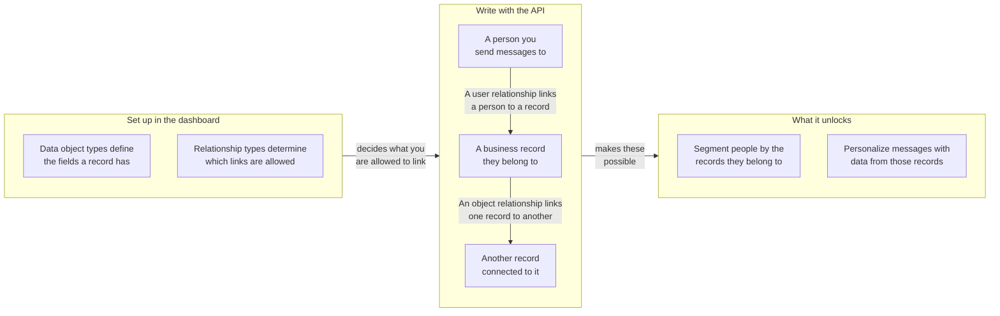

## URL base y autenticación {#base-url-and-authentication}

Usa el endpoint REST de tu espacio de trabajo y envía `Authorization: Bearer YOUR_REST_API_KEY`. Esta sección explica dónde están alojados los endpoints de objetos de datos y cómo se autentican las solicitudes.

- Para los hosts de los endpoints, consulta [Resumen de la API de Braze]({{site.baseurl}}/api/basics#endpoints).
- Todas las cargas útiles de solicitud y respuesta son JSON.
- Las solicitudes tienen como alcance el espacio de trabajo propietario de la clave de API.
- Si la clave tiene una lista de IP permitidas, las direcciones IP no incluidas en la lista devuelven `403`.

## Permisos de clave de API {#api-key-permissions}

Esta sección relaciona cada endpoint con su permiso requerido para que puedas definir el alcance de las claves de API de forma segura.

| Permiso | Grupo de endpoints |
|---|---|
| `data_objects.read` | Lectura de tipos y objetos, y lectura de relaciones de objetos |
| `data_objects.create` | Creación de objetos |
| `data_objects.update` | Reemplazo y actualización de objetos |
| `data_objects.delete` | Eliminación de objetos |
| `data_objects.user_relationships.read` | Lectura de relaciones de usuarios |
| `data_objects.user_relationships.create` | Creación de relaciones de usuarios |
| `data_objects.user_relationships.update` | Reemplazo y actualización de relaciones de usuarios |
| `data_objects.user_relationships.delete` | Eliminación de relaciones de usuarios |
| `data_objects.object_relationships.create` | Creación de relaciones de objetos |
| `data_objects.object_relationships.update` | Reemplazo y actualización de relaciones de objetos |
| `data_objects.object_relationships.delete` | Eliminación de relaciones de objetos |
{: .reset-td-br-1 .reset-td-br-2 aria-label="Grupos de permisos de objetos de datos" }


Las lecturas de relaciones de objetos usan `data_objects.read`. No existe un permiso `data_objects.object_relationships.read`.


## Límites de velocidad {#rate-limits}

Esta sección explica las cuotas de solicitudes predeterminadas y los encabezados de respuesta tanto para tráfico de lectura como de escritura.

| Contenedor | Límite predeterminado |
|---|---|
| Lecturas de objetos de datos | 50 solicitudes por minuto |
| Escrituras de objetos de datos | 50 solicitudes por minuto |
{: .reset-td-br-1 .reset-td-br-2 aria-label="Límites de velocidad predeterminados de objetos de datos" }

Cada respuesta incluye `X-RateLimit-Limit`, `X-RateLimit-Remaining` y `X-RateLimit-Reset`.

Para las solicitudes limitadas, Braze devuelve `429` y una carga útil de error con `id` y `message`.

```json
{
  "errors": [
    {
      "id": "rate-limit-exceeded",
      "message": "You have exceeded your limit of 50 requests per minute."
    }
  ]
}
```

## Conceptos principales {#core-concepts}

Esta sección define los identificadores clave utilizados en todos los endpoints de objetos de datos.

- `type_name`: el nombre de máquina del tipo de objeto de datos, único dentro de un espacio de trabajo.
- `external_id`: tu identificador de objeto, único dentro de un tipo.
- `braze_id`: el ID de usuario de Braze utilizado en los endpoints de relaciones de usuarios.
- `attributes`: datos de objeto o de relación con clave de nombre de campo, validados contra el esquema configurado.

## Cómo funcionan las relaciones {#how-relationships-work}

Esta sección explica los tipos de relaciones, los enlaces de relaciones y el comportamiento de `anchor` antes de que utilices las páginas de referencia de endpoints.

### Modelo de relaciones de un vistazo {#relationship-model-at-a-glance}

Usa este diagrama para ver cómo los tipos, registros y relaciones encajan entre sí, y qué te permite hacer vincularlos en Braze. Defines los tipos en el panel y luego escribes los registros y los vínculos entre ellos a través de estos endpoints.



### Los tipos y los enlaces son independientes {#types-and-edges-are-separate}

- Los tipos de relación definen qué vínculos son válidos y se gestionan en el panel.
- Los enlaces de relación son los vínculos reales entre registros y se crean, actualizan y eliminan a través de estos endpoints de API.
- Antes de escribir relaciones, lista los valores válidos de `rel_kind` con:
  - `GET /data_objects/types/{type_name}/user_relationship_types`
  - `GET /data_objects/types/{type_name}/object_relationship_types`

### Por qué las relaciones de objetos requieren `related_type_name` {#why-object-relationships-require-related_type_name}

- `rel_kind` no es globalmente único en todos los pares de tipos de objetos. Por ejemplo, `rel_kind` puede ser `subaccount` para un par de tipos de objetos y `partner_account` para otro.
- Por lo tanto, las escrituras de relaciones de objetos requieren tanto `rel_kind` como `related_type_name` para identificar el tipo de relación deseado junto con el otro tipo de objeto en la asociación.
- Si el `related_type_name` no coincide con el tipo de relación para ese `rel_kind`, la solicitud devuelve `400`.

### `anchor` controla la dirección de la relación {#anchor-controls-relationship-direction}

Las relaciones de objetos son direccionales. El objeto de la URL se interpreta en función de `anchor`.

| `anchor` | Rol del objeto de la URL | Clave del objeto relacionado en las respuestas |
|---|---|---|
| `source` (predeterminado) | Lado de origen (enlace saliente) | `to_data_object` |
| `target` | Lado de destino (enlace entrante) | `from_data_object` |
{: .reset-td-br-1 .reset-td-br-2 .reset-td-br-3 aria-label="Comportamiento de anchor en relaciones de objetos" }

Crear el mismo enlace desde la perspectiva de anchor opuesta sigue apuntando a una única relación subyacente. Una segunda llamada de creación para el mismo enlace devuelve `409` (`duplicate-object-relationship`).

### Asimetría de rutas en relaciones de usuarios {#path-asymmetry-for-user-relationships}

Las lecturas y escrituras de relaciones de usuarios utilizan intencionalmente rutas de endpoints diferentes:

- Lectura: `GET /data_objects/objects/{type_name}/{external_id}/user_relationships`
- Escritura: `POST|PUT|PATCH|DELETE /data_objects/objects/{type_name}/{external_id}/users`

### Los atributos de relación son independientes de los atributos de objeto {#relationship-attributes-are-separate-from-object-attributes}

- Los endpoints de relación devuelven atributos a nivel de enlace en el campo `attributes` de nivel superior.
- Los atributos de objeto permanecen anidados bajo `to_data_object` o `from_data_object`.
- `PUT` reemplaza los `attributes` de la relación, y `PATCH` fusiona los `attributes` de la relación.

### Ejemplo práctico {#worked-example}

Este ejemplo muestra un flujo de trabajo común con cuentas:

1. Crear `account/acct-123`.
2. Crear `account/acct-456` como cuenta secundaria.
3. Vincular un usuario a `acct-123` con `rel_kind: account_user`.
4. Vincular `acct-123` a `acct-456` con `rel_kind: subaccount`.

Para leer los vínculos:

- `GET /data_objects/objects/account/acct-123/user_relationships` para usuarios vinculados
- `GET /data_objects/objects/account/acct-123/object_relationships` para vínculos de objetos salientes
- `GET /data_objects/objects/account/acct-456/object_relationships?anchor=target` para vínculos de objetos entrantes


Los endpoints `DELETE` para relaciones de objetos y relaciones de usuarios requieren un cuerpo de solicitud JSON.


## Paginación y frescura de los datos {#pagination-and-data-freshness}

Esta sección cubre el comportamiento de paginación de los endpoints de lista y el tiempo esperado de visibilidad de los datos tras las escrituras.

- Los endpoints de lista admiten `limit` y `offset`.
- `limit` tiene un valor predeterminado de `100` y se limita entre `1` y `250`.
- `offset` tiene un valor predeterminado de `0`, y los valores negativos se redondean a `0`.
- Las escrituras son inmediatamente visibles para las lecturas y la personalización con Liquid.
- La pertenencia a segmentos basada en objetos de datos puede tener un retraso de hasta una hora porque los filtros calculados se actualizan cada hora.

## Comportamiento de errores {#error-behavior}

Esta sección resume los patrones de estado y respuestas de error utilizados en los endpoints de objetos de datos.

- `404`, `409`, `422` y `429` devuelven un arreglo `errors` con `id` y `message`.
- `400`, `401` y `403` devuelven una cadena `error` única.
- Los límites `422` basados en contrato varían según la empresa.