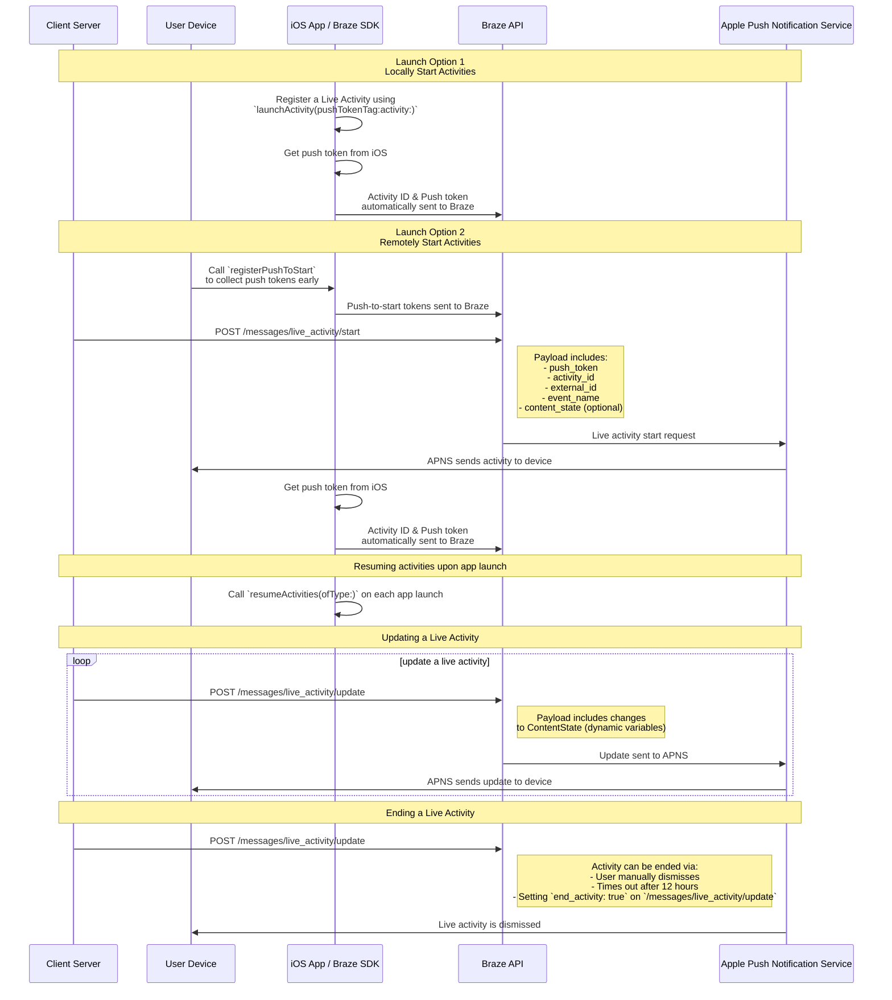

# Actividades en vivo para Swift {#live-activities-for-swift}

> Aprende a implementar las actividades en vivo para el SDK Swift de Braze. Las actividades en vivo son notificaciones persistentes e interactivas que se muestran directamente en la pantalla de bloqueo, lo que permite a los usuarios obtener actualizaciones dinámicas en tiempo real&#8212;sin necesidad de desbloquear el dispositivo.

## Cómo funciona {#how-it-works}

{: style="max-width:40%;float:right;margin-left:15px;"}

Las actividades en vivo presentan una combinación de información estática e información dinámica que tú actualizas. Por ejemplo, puedes crear una actividad en vivo que proporcione un rastreador de estado para una entrega. Esta actividad en vivo incluye el nombre de tu empresa como información estática, así como un "Tiempo de entrega" dinámico que se actualiza a medida que el repartidor se acerca a su destino.

Como desarrollador, puedes utilizar Braze para gestionar los ciclos de vida de tus actividades en vivo, realizar llamadas a la REST API de Braze para actualizar las actividades en vivo y hacer que todos los dispositivos suscritos reciban la actualización lo antes posible. Y, como gestionas las actividades en vivo a través de Braze, puedes usarlas junto con tus otros canales de mensajería&mdash;notificaciones push, mensajes dentro de la aplicación, Content Cards&mdash;para impulsar la adopción.

## Diagrama de secuencia {#sequence-diagram}









## Implementación de una Live Activity {#implementing-a-live-activity}

# También deberás completar lo siguiente:

- Asegúrate de que tu proyecto esté orientado a iOS 16.1 o posterior.
- Añade el derecho `Push Notification` en **Signing & Capabilities** en tu proyecto Xcode.
- Asegúrate de que se usen claves `.p8` para enviar notificaciones. Los archivos más antiguos como `.p12` o `.pem` no son compatibles.
- A partir de la versión 8.2.0 del SDK Swift de Braze, puedes [registrar remotamente una Live Activity](#swift_step-2-start-the-activity). Para usar esta característica, se requiere iOS 17.2 o posterior.


Aunque las Live Activities y las notificaciones push son similares, sus permisos de sistema son independientes. De forma predeterminada, todas las características de Live Activity están habilitadas, pero los usuarios pueden desactivar esta característica por aplicación.




### Paso 1: Crear una actividad {#create-an-activity}

Primero, asegúrate de haber seguido [Displaying live data with Live Activities](https://developer.apple.com/documentation/activitykit/displaying-live-data-with-live-activities) en la documentación de Apple para configurar Live Activities en tu aplicación iOS. Como parte de esta tarea, asegúrate de incluir `NSSupportsLiveActivities` configurado como `YES` en tu `Info.plist`.

Dado que la naturaleza exacta de tu Live Activity es específica de tu caso de negocio, configura e inicializa los objetos [Activity](https://developer.apple.com/documentation/activitykit/activityattributes). Es importante definir:
* `ActivityAttributes`: Este protocolo define el contenido estático (que no cambia) y dinámico (que cambia) que aparece en tu Live Activity.
* `ActivityAttributes.ContentState`: Este tipo define los datos dinámicos que se actualizan a lo largo de la actividad.

También puedes usar SwiftUI para crear la presentación de la interfaz de usuario en la pantalla de bloqueo y la Dynamic Island en dispositivos compatibles.

Asegúrate de estar familiarizado con los [prerrequisitos y limitaciones](https://developer.apple.com/documentation/activitykit/displaying-live-data-with-live-activities#Understand-constraints) de Apple para Live Activities, ya que estas restricciones son independientes de Braze.


Si esperas enviar pushes frecuentes a la misma Live Activity, puedes evitar que Apple te limite por su presupuesto configurando `NSSupportsLiveActivitiesFrequentUpdates` como `YES` en tu archivo `Info.plist`. Para más detalles, consulta la sección [`Determine the update frequency`](https://developer.apple.com/documentation/activitykit/updating-and-ending-your-live-activity-with-activitykit-push-notifications#Determine-the-update-frequency) en la documentación de ActivityKit.


#### Ejemplo {#example}

Imaginemos que queremos crear una Live Activity para dar a nuestros usuarios actualizaciones sobre el espectáculo Superb Owl, donde dos centros de rescate de fauna silvestre en competencia reciben puntos por los búhos que albergan. Para este ejemplo, hemos creado una estructura llamada `SportsActivityAttributes`, pero puedes usar tu propia implementación de `ActivityAttributes`.

```swift
#if canImport(ActivityKit)
  import ActivityKit
#endif

@available(iOS 16.1, *)
struct SportsActivityAttributes: ActivityAttributes {
  public struct ContentState: Codable, Hashable {
    var teamOneScore: Int
    var teamTwoScore: Int
  }

  var gameName: String
  var gameNumber: String
}
```

### Paso 2: Iniciar la actividad {#start-the-activity}

Primero, elige cómo deseas registrar tu actividad:

- **Remoto:** Usa el método [`registerPushToStart`](<http://braze-inc.github.io/braze-swift-sdk/documentation/brazekit/braze/liveactivities-swift.class/registerpushtostart(fortype:name:)>) temprano en el ciclo de vida del usuario y antes de que se necesite el token push-to-start, luego inicia una actividad usando el endpoint [`/messages/live_activity/start`]({{site.baseurl}}/api/endpoints/messaging/live_activity/start).
- **Local:** Crea una instancia de tu Live Activity, luego usa el método [`launchActivity`](<https://braze-inc.github.io/braze-swift-sdk/documentation/brazekit/braze/liveactivities-swift.class/launchactivity(pushtokentag:activity:fileid:line:)>) para crear tokens push que Braze pueda gestionar.




Para registrar remotamente una Live Activity, se requiere iOS 17.2 o posterior.


#### Paso 2.1: Añadir BrazeKit a tu extensión de widget {#step-21-add-brazekit-to-your-widget-extension}

En tu proyecto Xcode, selecciona el nombre de tu aplicación y luego **General**. En **Frameworks and Libraries**, confirma que `BrazeKit` aparece en la lista.


#### Paso 2.2: Añadir el protocolo BrazeLiveActivityAttributes {#brazeActivityAttributes}

En tu implementación de `ActivityAttributes`, añade conformidad con el protocolo `BrazeLiveActivityAttributes` y luego añade la propiedad `brazeActivityId` a tu modelo de atributos.


iOS mapea la propiedad `brazeActivityId` al campo correspondiente en tu carga útil push-to-start de Live Activity, por lo que no debe renombrarse ni asignársele ningún otro valor.


```swift
import BrazeKit

#if canImport(ActivityKit)
  import ActivityKit
#endif

@available(iOS 16.1, *)
// 1. Add the `BrazeLiveActivityAttributes` conformance to your `ActivityAttributes` struct.
struct SportsActivityAttributes: ActivityAttributes, BrazeLiveActivityAttributes {
  public struct ContentState: Codable, Hashable {
    var teamOneScore: Int
    var teamTwoScore: Int
  }

  var gameName: String
  var gameNumber: String

  // 2. Add the `String?` property to represent the activity ID.
  var brazeActivityId: String?
}
```

#### Paso 2.3: Registrarse para push-to-start {#step-23-register-for-push-to-start}

A continuación, registra el tipo de Live Activity para que Braze pueda rastrear todos los tokens push-to-start y las instancias de Live Activity asociadas con este tipo.


El sistema operativo iOS solo genera tokens push-to-start durante la primera instalación de la aplicación después de reiniciar el dispositivo. Para asegurar que tus tokens se registren de forma fiable, llama a `registerPushToStart` en tu método `didFinishLaunchingWithOptions`.


##### Ejemplo

En el siguiente ejemplo, la clase `LiveActivityManager` maneja objetos de Live Activity. Luego, el método `registerPushToStart` registra `SportsActivityAttributes`:

```swift
import BrazeKit

#if canImport(ActivityKit)
  import ActivityKit
#endif

class LiveActivityManager {

  @available(iOS 17.2, *)
  func registerActivityType() {
    // This method returns a Swift background task.
    // You may keep a reference to this task if you need to cancel it wherever appropriate, or ignore the return value if you wish.
    let pushToStartObserver: Task = Self.braze?.liveActivities.registerPushToStart(
      forType: Activity<SportsActivityAttributes>.self,
      name: SportsActivityAttributes.name
    )
  }

}
```

#### Paso 2.4: Enviar una notificación push-to-start {#step-24-send-a-push-to-start-notification}

Envía una notificación push-to-start remota usando el endpoint [`/messages/live_activity/start`]({{site.baseurl}}/api/endpoints/messaging/live_activity/start).



Puedes usar el [framework ActivityKit de Apple](https://developer.apple.com/documentation/activitykit) para obtener un token push, que el SDK de Braze puede gestionar por ti. Esto te permite actualizar Live Activities a través de la API de Braze, ya que Braze envía el token push al servicio de notificaciones push de Apple (APN) en el backend.

1. Crea una instancia de tu implementación de Live Activity usando las API de ActivityKit de Apple.
2. Establece el parámetro `pushType` como `.token`.
3. Pasa los `ActivitiesAttributes` y `ContentState` de Live Activities que definiste.
4. Registra tu actividad con tu instancia de Braze pasándola a [`launchActivity(pushTokenTag:activity:)`](https://braze-inc.github.io/braze-swift-sdk/documentation/brazekit/braze/liveactivities-swift.class). El parámetro `pushTokenTag` es una cadena personalizada que defines tú. Debe ser único para cada Live Activity que crees.

Después de registrar la Live Activity, el SDK de Braze extrae y observa cambios en los tokens push.

#### Ejemplo

Para nuestro ejemplo, crea una clase llamada `LiveActivityManager` como interfaz para nuestros objetos de Live Activity. Luego, establece el `pushTokenTag` como `"sports-game-2024-03-15"`.

```swift
import BrazeKit

#if canImport(ActivityKit)
  import ActivityKit
#endif

class LiveActivityManager {

  @available(iOS 16.2, *)
  func createActivity() {
    let activityAttributes = SportsActivityAttributes(gameName: "Superb Owl", gameNumber: "Game 1")
    let contentState = SportsActivityAttributes.ContentState(teamOneScore: "0", teamTwoScore: "0")
    let activityContent = ActivityContent(state: contentState, staleDate: nil)
    if let activity = try? Activity.request(attributes: activityAttributes,
                                            content: activityContent,
      // Setting your pushType as .token allows the Activity to generate push tokens for the server to watch.
                                            pushType: .token) {
      // Register your Live Activity with Braze using the pushTokenTag.
      // This method returns a Swift background task.
      // You may keep a reference to this task if you need to cancel it wherever appropriate, or ignore the return value if you wish.
      let liveActivityObserver: Task = AppDelegate.braze?.liveActivities.launchActivity(pushTokenTag: "sports-game-2024-03-15",
                                                                                        activity: activity)
    }
  }

}
```

Tu widget de Live Activity muestra este contenido inicial a tus usuarios.

{: style="max-width:40%;"}



### Paso 3: Reanudar el seguimiento de actividad {#resume-activity-tracking}

Para asegurar que Braze rastree tu Live Activity al iniciar la aplicación:

1. Abre tu archivo `AppDelegate`.
2. Importa el módulo `ActivityKit` si está disponible.
3. Llama a [`resumeActivities(ofType:)`](https://braze-inc.github.io/braze-swift-sdk/documentation/brazekit/braze/liveactivities-swift.class/resumeactivities(oftype:)) en `application(_:didFinishLaunchingWithOptions:)` para todos los tipos de `ActivityAttributes` que hayas registrado en tu aplicación.

Esto permite que Braze reanude las tareas para rastrear actualizaciones de tokens push para todas las Live Activities activas. Ten en cuenta que si un usuario ha descartado explícitamente la Live Activity en su dispositivo, se considera eliminada y Braze ya no la rastrea.

#### Ejemplo

```swift
import UIKit
import BrazeKit

#if canImport(ActivityKit)
  import ActivityKit
#endif

@main
class AppDelegate: UIResponder, UIApplicationDelegate {

  static var braze: Braze? = nil

  func application(
    _ application: UIApplication,
    didFinishLaunchingWithOptions launchOptions: [UIApplication.LaunchOptionsKey: Any]?
  ) -> Bool {

    if #available(iOS 16.1, *) {
      Self.braze?.liveActivities.resumeActivities(
        ofType: Activity<SportsActivityAttributes>.self
      )
    }

    return true
  }
}
```

### Paso 4: Actualizar la actividad {#update-the-activity}

{: style="max-width:40%;float:right;margin-left:15px;"}

El endpoint [`/messages/live_activity/update`]({{site.baseurl}}/api/endpoints/messaging/live_activity/update) te permite actualizar una Live Activity a través de notificaciones push enviadas mediante la REST API de Braze. Usa este endpoint para actualizar el `ContentState` de tu Live Activity.

A medida que actualizas tu `ContentState`, tu widget de Live Activity muestra la nueva información. Así se ve el espectáculo Superb Owl al final de la primera mitad.

Consulta nuestro artículo del [endpoint `/messages/live_activity/update`]({{site.baseurl}}/api/endpoints/messaging/live_activity/update) para obtener todos los detalles.

### Paso 5: Finalizar la actividad {#end-the-activity}

Cuando una Live Activity está activa, se muestra tanto en la pantalla de bloqueo del usuario como en la Dynamic Island. Para finalizarla a través de Braze, usa el endpoint [`/messages/live_activity/update`]({{site.baseurl}}/api/endpoints/messaging/live_activity/update) con `end_activity` configurado como `true`.

Para mejorar la fiabilidad al finalizar una Live Activity, sigue estos pasos opcionales:

1. Opcionalmente incluye `dismissal_date` en la misma solicitud `update` para sugerir cuándo iOS debe eliminar la interfaz de la Live Activity.
2. Verifica los resultados de entrega en el [registro de actividad de mensajes]({{site.baseurl}}/user_guide/administer/global/workspace_settings/logs_and_alerts/message_activity_log).

#### Programar la eliminación automática {#arranging-automatic-dismissal}

Para programar la eliminación automática, programa una solicitud de seguimiento al endpoint de actualización después de iniciar la Live Activity.

1. Envía una solicitud `/messages/live_activity/start` con un `activity_id` que puedas rastrear.
2. Almacena ese `activity_id` y tu hora de finalización objetivo en el programador de tu backend.
3. En la hora de finalización objetivo, envía una solicitud `/messages/live_activity/update` con `end_activity` configurado como `true`.
4. Configura la fecha de eliminación en la misma solicitud de actualización. Para más detalles, consulta el endpoint [`/messages/live_activity/update`]({{site.baseurl}}/api/endpoints/messaging/live_activity/update).

Ten en cuenta que el momento de la eliminación está controlado por iOS. Incluso después de enviar una solicitud de finalización válida, la eliminación de la pantalla de bloqueo o la Dynamic Island puede retrasarse o comportarse de forma diferente según las condiciones del sistema operativo.

Una Live Activity también puede finalizar fuera de Braze:

* **Descarte del usuario**: Un usuario puede descartar manualmente una Live Activity.
* **Tiempo de espera agotado**: Después de un tiempo predeterminado de ocho horas, iOS elimina la Live Activity de la Dynamic Island del usuario. Después de un tiempo predeterminado de 12 horas, iOS elimina la Live Activity de la pantalla de bloqueo del usuario.

Consulta nuestro artículo del [endpoint `/messages/live_activity/update`]({{site.baseurl}}/api/endpoints/messaging/live_activity/update) para obtener todos los detalles.

## Seguimiento de Live Activities {#tracking-live-activities}

Los eventos de Live Activity están disponibles en Currents, Snowflake Data Sharing y el generador de consultas. Los siguientes eventos pueden ayudarte a comprender y monitorizar el ciclo de vida de tus Live Activities, rastrear la disponibilidad de tokens y diagnosticar problemas de forma independiente o verificar estados de entrega.

- [Cambio de token Push To Start de Live Activity]({{site.baseurl}}/user_guide/data/distribution/braze_currents/event_glossary/customer_behavior_events): Captura cuándo se añade o actualiza un token push-to-start (PTS) en Braze, lo que te permite rastrear los registros de tokens y la disponibilidad por usuario.
- [Cambio de token de actualización de Live Activity]({{site.baseurl}}/user_guide/data/distribution/braze_currents/event_glossary/customer_behavior_events): Rastrea la adición, actualización o eliminación de tokens de actualización de Live Activity (LAU).
- [Envío de Live Activity]({{site.baseurl}}/user_guide/data/distribution/braze_currents/event_glossary/message_engagement_events): Registra cada vez que Braze inicia, actualiza o finaliza una Live Activity.
- [Resultado de Live Activity]({{site.baseurl}}/user_guide/data/distribution/braze_currents/event_glossary/message_engagement_events): Indica el estado de entrega final al servicio de notificaciones push de Apple (APN) para cada Live Activity enviada desde Braze.

## Verificar los envíos de Live Activity {#verify-live-activity-sends}

Si necesitas confirmar si un espacio de trabajo está enviando iOS Live Activities, puedes utilizar los siguientes métodos:

### Registro de actividad de mensajes {#message-activity-log}

Ve a **Configuración** > **Registro de actividad de mensajes** y filtra por errores de Live Activity para ver cualquier resultado de entrega relacionado con Live Activity durante el periodo de tiempo esperado. Para más información, consulta [Registro de actividad de mensajes]({{site.baseurl}}/user_guide/administer/global/workspace_settings/logs_and_alerts/message_activity_log).

### Query Builder, Currents o Snowflake Data Sharing {#query-builder-currents-or-snowflake-data-sharing}

Comprueba los siguientes eventos de Live Activity para verificar el ciclo de vida y la entrega de Live Activity:

- **Live Activity Send:** Se registra cada vez que Braze inicia, actualiza o finaliza una Live Activity
- **Live Activity Outcome:** Estado final de entrega a APN para cada Live Activity enviada

Opcionalmente, también puedes comprobar las señales de disponibilidad de tokens:
- **Live Activity Push To Start Token Change**
- **Live Activity Update Token Change**

### Panel de uso de API {#api-usage-dashboard}

Ve a **Configuración** > **APIs e identificadores** > **Panel**, selecciona **Filtros** y filtra por **Endpoint** para ver las respuestas de la API. Por ejemplo, selecciona `/messages/live_activity/update` (o `/messages/live_activity/start`) y consulta el volumen de solicitudes en los últimos 30 días. Las respuestas de la API indican que la API está siendo llamada y que las notificaciones de iOS Live Activity se están utilizando en este espacio de trabajo. Para más información, consulta [Panel de uso de API]({{site.baseurl}}/user_guide/analytics/dashboards/api_usage).

## Observar eventos de actividad en vivo (opcional) {#observe-live-activity-events}




No te suscribas directamente a estos flujos de ActivityKit con Apple, ya que entrará en conflicto con las suscripciones de Braze e impedirá que las actividades en vivo funcionen correctamente:

1. [`pushTokenUpdates`](https://developer.apple.com/documentation/activitykit/activity/pushtokenupdates-swift.property)
2. [`activityStateUpdates`](https://developer.apple.com/documentation/activitykit/activity/activitystateupdates-swift.property)
3. [`contentUpdates`](https://developer.apple.com/documentation/activitykit/activity/contentupdates-swift.property)
4. [`pushToStartTokenUpdates`](https://developer.apple.com/documentation/activitykit/activity/pushtostarttokenupdates)
5. [`activityUpdates`](https://developer.apple.com/documentation/activitykit/activity/activityupdates-swift.type.property)

En su lugar, utiliza las suscripciones que se mencionan en esta sección.


El SDK de Braze proporciona dos métodos de suscripción en `braze.liveActivities` para observar el ciclo de vida completo de las actividades en vivo. Para un tutorial paso a paso completo, consulta el [tutorial de actividades en vivo](https://braze-inc.github.io/braze-swift-sdk/tutorials/brazekit/b4-live-activities).

- [`subscribeToStateUpdates(_:)`](#subscribe-to-state-updates): Entrega eventos del ciclo de vida tanto para el registro de tokens push-to-start como para las instancias de actividad en ejecución.
- [`subscribeToErrors(_:)`](#subscribe-to-errors): Entrega errores del SDK y del lado del servidor encontrados durante el seguimiento de actividades en vivo.


Ambos métodos devuelven un [`Braze.Cancellable`](https://braze-inc.github.io/braze-swift-sdk/documentation/brazekit/braze/cancellable-swift.typealias). La suscripción permanece activa mientras el valor devuelto se mantenga a través de una referencia fuerte (por ejemplo, almacénalo en una propiedad con el mismo ciclo de vida que tu instancia de `Braze`).


### Configurar suscripciones {#set-up-subscriptions}

Configura las suscripciones una vez en `application(_:didFinishLaunchingWithOptions:)` y mantenlas durante toda la vida de tu aplicación:

```swift
class AppDelegate: UIResponder, UIApplicationDelegate {
  static var braze: Braze?

  var stateSubscription: Braze.Cancellable?
  var errorSubscription: Braze.Cancellable?

  func application(
    _ application: UIApplication,
    didFinishLaunchingWithOptions launchOptions: [UIApplication.LaunchOptionsKey: Any]?
  ) -> Bool {
    let braze = Braze(configuration: config)
    Self.braze = braze

    if #available(iOS 16.1, *) {
      stateSubscription = Self.braze?.liveActivities.subscribeToStateUpdates { event in
        self.handleStateUpdate(event)
      }
      errorSubscription = Self.braze?.liveActivities.subscribeToErrors { error in
        self.handleLiveActivityError(error)
      }
    }

    return true
  }
}
```


Las devoluciones de llamada solo se activan para eventos futuros de actividad en vivo; no reproducen el estado actual en el momento de la suscripción. Para consultar la instantánea del estado actual, utiliza `Activity<T>.activities`.


### subscribeToStateUpdates {#subscribe-to-state-updates}

`subscribeToStateUpdates(_:)` entrega valores `UpdateEvent` que cubren el ciclo de vida completo de las actividades en vivo. Los eventos se dividen en dos ámbitos:

- `.activityType(ActivityType)`: Eventos a nivel de tipo para el registro de tokens push-to-start (iOS 17.2+). Aún no existe ninguna instancia de actividad.
- `.activityInstance(ActivityInstance)`: Eventos a nivel de instancia para una actividad en ejecución específica.

Se admiten múltiples suscriptores: cada suscripción activa recibe cada emisión de forma independiente.

#### Eventos a nivel de tipo {#type-scoped-events}

| Evento | Cuándo se activa |
| ----- | ------------- |
| `.pushToStartTokenRead(activityType:)` | Se leyó un token push-to-start del sistema operativo. Braze ahora puede iniciar remotamente una nueva actividad de este tipo. |
| `.pushToStartTokenFlushed(activityType:)` | El token se envió al servidor de Braze. Braze puede enviar notificaciones push-to-start para este tipo. |
| `.pushToStartOptedOut(activityType:)` | El usuario fue excluido de push-to-start para este tipo de actividad a través de `optOutPushToStart(type:)`. |
| `.pushToStartOptOutFlushed(activityType:)` | La exclusión se envió al servidor de Braze. |
{: .reset-td-br-1 .reset-td-br-2 aria-label="Eventos a nivel de tipo" }

#### Eventos a nivel de instancia {#instance-scoped-events}

| Evento | Cuándo se activa |
| ----- | ------------- |
| `.started(activityId:activityType:pushTokenTag:launchSource:)` | El SDK comenzó a rastrear esta actividad a través de `launchActivity(pushTokenTag:activity:)`. El valor de `launchSource` es `.local` para actividades iniciadas por la aplicación o `.pushToStart` para actividades iniciadas remotamente. |
| `.resumed(activityId:activityType:pushTokenTag:)` | El SDK reanudó el seguimiento de esta actividad a través de `resumeActivities(ofType:)`. |
| `.pushTokenFlushed(activityId:activityType:pushTokenTag:)` | El token push de la actividad fue aceptado por el servidor de Braze; la actividad ahora puede recibir actualizaciones remotas. |
| `.active(activityId:activityType:)` | La actividad está actualmente activa y visible para el usuario. |
| `.stale(activityId:activityType:staleDate:)` | El contenido de la actividad se ha vuelto obsoleto. Solo se emite en iOS 16.2 y posterior. |
| `.dismissed(activityId:activityType:)` | El usuario descartó manualmente la actividad. |
| `.ended(activityId:activityType:)` | La actividad ha finalizado. |
| `.contentUpdated(activityId:activityType:)` | El estado del contenido de la actividad se actualizó (iOS 16.2+). Utiliza lógica personalizada para buscar la `Activity<T>` por ID desde `Activity.activities` y acceder al estado tipado a través de `activity.content.state`. |
| `.pushTokenUpdated(activityId:activityType:)` | ActivityKit rotó el token push de la actividad. |
{: .reset-td-br-1 .reset-td-br-2 aria-label="Eventos a nivel de instancia" }

##### Ejemplo

```swift
func handleStateUpdate(_ event: Braze.LiveActivities.UpdateEvent) {
  switch event {

  // Type-scoped: push-to-start token lifecycle (iOS 17.2+)
  case .activityType(.pushToStartTokenRead(let activityType)):
    print("[\(activityType)] Push-to-start token read by SDK")

  // ...

  // Instance-scoped: SDK tracking
  case .activityInstance(.started(let id, let type, let tag, let source)):
    print("[\(type)] Activity \(id) started via \(source), tag: \(tag)")

  // ...

  // Instance-scoped: ActivityKit lifecycle
  case .activityInstance(.active(let id, let type)):
    print("[\(type)] Activity \(id) is active")

  // ...

  case .activityInstance(.ended(let id, let type)):
    print("[\(type)] Activity \(id) ended")

  // Instance-scoped: content updates (iOS 16.2+)
  case .activityInstance(.contentUpdated(let id, let type)):
    // For more advanced use cases of `contentUpdated`, see the section below
    print("[\(type)] Content updated for activity \(id)")

  case .activityInstance(.pushTokenUpdated(let id, let type)):
    print("[\(type)] Activity \(id) push token rotated")
  }
}
```

### subscribeToErrors {#subscribe-to-errors}

`subscribeToErrors(_:)` entrega valores `ErrorEvent` utilizando los mismos dos ámbitos que `UpdateEvent`:

- `.activityType(ActivityType)`: Errores a nivel de tipo para fallos en el registro push-to-start.
- `.activityInstance(ActivityInstance)`: Errores a nivel de instancia para una actividad en ejecución.

Utiliza la bandera `isTransient` para determinar si es apropiado reintentar. El SDK reintenta automáticamente los fallos transitorios.

#### Errores a nivel de tipo {#type-scoped-errors}

| Error | Cuándo se activa |
| ----- | ------------- |
| `.pushToStartRegistrationFailed(activityType:isTransient:reason:)` | El token push-to-start no pudo llegar al servidor de Braze. |
{: .reset-td-br-1 .reset-td-br-2 aria-label="Errores a nivel de tipo" }

#### Errores a nivel de instancia {#instance-scoped-errors}

| Error | Cuándo se activa |
| ----- | ------------- |
| `.registrationFailed(activityId:activityType:pushTokenTag:isTransient:reason:)` | El token push de la actividad no se pudo registrar en Braze. |
| `.activityNotFound(activityId:activityType:)` | `resumeActivities(ofType:)` encontró un mapeado almacenado para una actividad que ya no está en ejecución; probablemente finalizó mientras la aplicación estaba cerrada. |
| `.invalidPushTokenTag(activityId:activityType:tag:)` | `launchActivity(pushTokenTag:activity:)` fue llamado con una etiqueta no válida. Las etiquetas deben ser no vacías y de menos de 256 bytes. |
{: .reset-td-br-1 .reset-td-br-2 aria-label="Errores a nivel de instancia" }

##### Ejemplo

```swift
func handleLiveActivityError(_ error: Braze.LiveActivities.ErrorEvent) {
  switch error {

  // Type-scoped errors
  case .activityType(.pushToStartRegistrationFailed(let type, let isTransient, let reason)):
    if isTransient {
      print("[\(type)] Push-to-start registration failed (transient, will retry): \(reason)")
    } else {
      print("[\(type)] Push-to-start registration failed (permanent): \(reason)")
    }

  // Instance-scoped errors
  case .activityInstance(.registrationFailed(let id, let type, _, let isTransient, let reason)):
    if isTransient {
      print("[\(type)] Activity \(id) registration failed (transient, retrying): \(reason)")
    } else {
      print("[\(type)] Activity \(id) registration failed (permanent): \(reason)")
    }

  case .activityInstance(.activityNotFound(let id, let type)):
    print("[\(type)] Stored activity \(id) not found on resume")

  case .activityInstance(.invalidPushTokenTag(let id, let type, let tag)):
    print("[\(type)] Activity \(id) has invalid push token tag '\(tag)'")
  }
}
```

### Manejar actualizaciones del estado del contenido (opcional) {#handle-content-state}

Si deseas utilizar el estado del contenido de la instancia real de la actividad en vivo, sigue esta sección.

Cuando se activa un evento `.contentUpdated`, utiliza lógica personalizada para buscar la `Activity<T>` en ejecución por su ID desde `Activity.activities` y luego accede al `ContentState` tipado a través de `activity.content.state`.

#### Tipo de atributos único {#single-attributes-type}

```swift
case .activityInstance(.contentUpdated(let id, let type)):
  #if canImport(ActivityKit)
    // Add custom logic look up the Activity<T> by ID and access your app's typed ContentState.
    // In this example, `SportsActivityAttributes` is the app's custom type.
    if #available(iOS 16.2, *),
      let activity = findActivityInstance(id: id, as: SportsActivityAttributes.self)
    {
      // `activityContent` is now strongly typed as a `SportsActivityAttributes`
      let activityContent = activity.content.state
      print("[\(type)] Game \(id) — score: \(activityContent.teamOneScore)–\(activityContent.teamTwoScore)")
      return
    }
  #endif
  print("[\(type)] Content updated for activity \(id)")

// ...

// - MARK: Helper methods

@available(iOS 16.2, *)
func findActivityInstance<Attributes: ActivityAttributes>(
  id: String,
  as type: Attributes.Type
) -> Activity<Attributes>? {
  // Use Apple's API to find the matching Live Activity instance:
  // - https://developer.apple.com/documentation/activitykit/activity/activities
  Activity<Attributes>.activities.first(where: { $0.id == id })
}
```

#### Múltiples tipos de atributos {#multiple-attributes-types}

Si tu aplicación utiliza múltiples tipos de `ActivityAttributes`, comprueba la cadena `type` para buscar la `Activity<T>` apropiada:

```swift
case .activityInstance(.contentUpdated(let id, let type)):
  #if canImport(ActivityKit)
    if #available(iOS 16.2, *) {
      if type == SportsActivityAttributes.name,
        let activity = findActivityInstance(id: id, as: SportsActivityAttributes.self)
      {
        let activityContent = activity.content.state
        print("[\(type)] Game \(id) — score: \(activityContent.teamOneScore)–\(activityContent.teamTwoScore)")
        return

      } else if type == OrderActivityAttributes.name,
        let activity = findActivityInstance(id: id, as: OrderActivityAttributes.self)
      {
        let activityContent = activity.content.state
        print("[\(type)] Order \(id) — status: \(activityContent.status), ETA: \(activityContent.eta)")
        return
      }
    }
  #endif
  print("[\(type)] Content updated for activity \(id)")

// ...

// - MARK: Helper methods

@available(iOS 16.2, *)
func findActivityInstance<Attributes: ActivityAttributes>(
  id: String,
  as type: Attributes.Type
) -> Activity<Attributes>? {
  // Use Apple's API to find the matching Live Activity instance:
  // - https://developer.apple.com/documentation/activitykit/activity/activities
  Activity<Attributes>.activities.first(where: { $0.id == id })
}
```

## Preguntas más frecuentes (FAQ) {#faq}

### Funcionalidad y soporte {#functionality-and-support}

#### ¿Qué plataformas admiten actividades en vivo? {#what-platforms-support-live-activities}

Actualmente, las actividades en vivo son una característica específica de iOS y iPadOS. De forma predeterminada, las actividades iniciadas en un iPhone o iPad se muestran adicionalmente en cualquier dispositivo watchOS 11+ o macOS 26+ emparejado.

Braze no ofrece actualmente soporte nativo de actividades en vivo en Android. Para Android, puedes crear experiencias de actualización en vivo a través de notificaciones push de Braze y renderizado de notificaciones personalizadas.

{: style="max-width:60%;"}

El artículo de actividades en vivo cubre los [requisitos previos]({{site.baseurl}}/developer_guide/live_notifications/live_activities#implementing-a-live-activity) para gestionar actividades en vivo a través del SDK Swift de Braze.

#### ¿Son compatibles las aplicaciones React Native con las actividades en vivo? {#do-react-native-apps-support-live-activities}

Sí, a partir de la versión 3.0.0+ del SDK de React Native se admiten actividades en vivo a través del SDK Swift de Braze. Es decir, tienes que escribir código iOS de React Native directamente sobre el SDK Swift de Braze.

No existe una API de conveniencia JavaScript específica de React Native para las actividades en vivo porque las características de las actividades en vivo proporcionadas por Apple utilizan lenguajes intraducibles en JavaScript (por ejemplo, concurrencia Swift, genéricos, SwiftUI).

#### ¿Admite Braze actividades en vivo como Campaign o paso en Canvas? {#does-braze-support-live-activities-as-a-campaign-or-canvas-step}

No, actualmente no es posible.

### Notificaciones push y actividades en vivo {#push-notifications-and-live-activities}

#### ¿Qué ocurre si se envía una notificación push mientras está activa una actividad en vivo? {#what-happens-if-a-push-notification-is-sent-while-a-live-activity-is-active}

{: style="max-width:30%;float:right;margin-left:15px;"}

Las actividades en vivo y las notificaciones push ocupan un espacio de pantalla diferente y no entrarán en conflicto en la pantalla del usuario.

#### Si las actividades en vivo aprovechan la funcionalidad de los mensajes push, ¿es necesario habilitar las notificaciones push para recibir actividades en vivo? {#if-live-activities-leverage-push-message-functionality-do-push-notifications-need-to-be-enabled-to-receive-live-activities}

Aunque las actividades en vivo se basan en notificaciones push para las actualizaciones, están controladas por diferentes configuraciones de usuario. Un usuario puede optar por las actividades en vivo pero no por las notificaciones push, y viceversa.

Los tokens de actualización de actividad en vivo caducan a las ocho horas.

#### ¿Las actividades en vivo requieren push primers? {#do-live-activities-require-push-primers}

Los [push primers]({{site.baseurl}}/user_guide/channels/push/best_practices/push_primer_messages) son una buena práctica para pedir a tus usuarios que acepten las notificaciones push de tu aplicación. Sin embargo, no hay ninguna indicación del sistema para participar en las actividades en vivo. Por defecto, los usuarios están incluidos en las actividades en vivo para una aplicación individual cuando instalan esa aplicación en iOS 16.1 o posterior. Este permiso puede habilitarse o deshabilitarse en la configuración del dispositivo para cada aplicación.

### Temas técnicos y solución de problemas {#technical-topics-and-troubleshooting}

#### ¿Cómo sé si las actividades en vivo tienen errores? {#how-do-i-know-if-live-activities-has-errors}

Cualquier error de actividad en vivo se registra en el panel de Braze, en el [Registro de actividad de mensajes]({{site.baseurl}}/user_guide/administer/global/workspace_settings/logs_and_alerts/message_activity_log), donde puedes filtrar por "LiveActivity Errors".

#### Después de enviar una notificación push-to-start, ¿por qué no he recibido mi actividad en vivo? {#after-sending-a-push-to-start-notification-why-havent-i-received-my-live-activity}

En primer lugar, comprueba que tu carga útil incluye todos los campos obligatorios descritos en el endpoint [`messages/live_activity/start`]({{site.baseurl}}/api/endpoints/messaging/live_activity/start). Los campos `activity_attributes` y `content_state` deben coincidir con las propiedades definidas en el código de tu proyecto. Si estás seguro de que la carga útil es correcta, es posible que APN te esté aplicando un límite de velocidad. Este límite lo impone Apple y no Braze.

Para verificar que tu notificación push-to-start ha llegado correctamente al dispositivo pero no se ha mostrado debido a los límites de velocidad, puedes depurar tu proyecto utilizando la aplicación Consola de tu Mac. Adjunta el proceso de grabación del dispositivo que desees y, a continuación, filtra los registros por `process:liveactivitiesd` en la barra de búsqueda.

#### Después de iniciar mi actividad en vivo con push-to-start, ¿por qué no recibe nuevas actualizaciones? {#after-starting-my-live-activity-with-push-to-start-why-isnt-it-receiving-new-updates}

Comprueba que has seguido correctamente las instrucciones del [Paso 2.2: Añadir el protocolo BrazeLiveActivityAttributes](#swift_brazeActivityAttributes). Tu `ActivityAttributes` debe contener tanto la conformidad con el protocolo `BrazeLiveActivityAttributes` como la propiedad `brazeActivityId`.

Después de recibir una notificación push-to-start de actividad en vivo, comprueba que puedes ver una solicitud de red saliente al endpoint `/push_token_tag` de tu URL de Braze y que contiene el ID de actividad correcto en el campo `"tag"`.

Por último, asegúrate de que el tipo de atributo de actividad en vivo en tu carga útil de actualización coincida exactamente con la cadena y la clase utilizadas en tu llamada al método del SDK `registerPushToStart`. Utiliza constantes para evitar errores tipográficos.

#### Recibo una respuesta de acceso denegado cuando intento utilizar el endpoint `live_activity/update`. ¿Por qué? {#i-am-receiving-an-access-denied-response-when-i-try-to-use-the-live_activityupdate-endpoint-why}

Las claves de API que utilices deben tener los permisos correctos para acceder a los distintos endpoints de la API de Braze. Si estás utilizando una clave de API que creaste anteriormente, es posible que hayas olvidado actualizar sus permisos. Lee nuestro [resumen de seguridad de la clave de API]({{site.baseurl}}/api/basics#rest-api-key-security) para refrescarte la memoria.

#### ¿Comparte el endpoint `messages/send` límites de velocidad con el endpoint `messages/live_activity/update`? {#does-the-messagessend-endpoint-share-rate-limits-with-the-messageslive_activityupdate-endpoint}

De manera predeterminada, el límite de velocidad para el endpoint `messages/live_activity/update` es de 250 000 solicitudes por hora, por espacio de trabajo y a través de múltiples endpoints. Para más información, consulta los [límites de velocidad de la API]({{site.baseurl}}/api/api_limits).