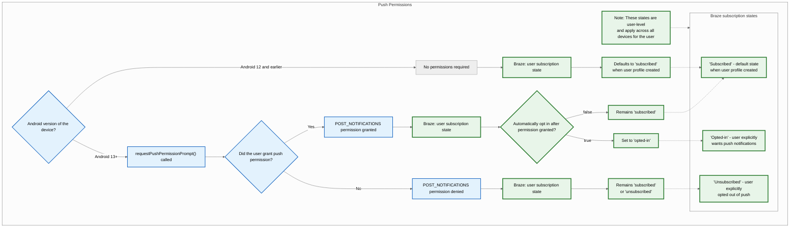
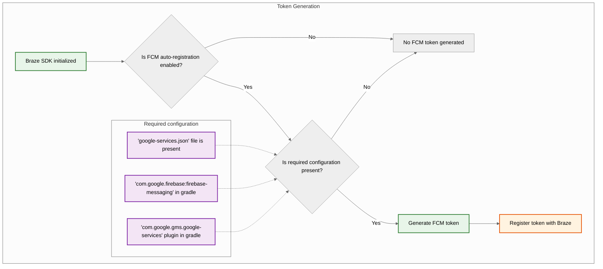
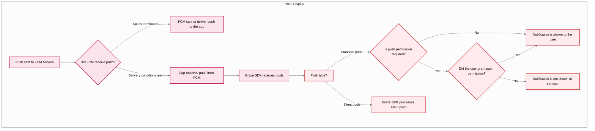



## Características integradas {#built-in-features}

Las siguientes características están integradas en el SDK de Braze para Android. Para utilizar cualquier otra característica de notificaciones push, tendrás que [configurar las notificaciones push](#android_setting-up-push-notifications) para tu aplicación.

|Característica|Descripción|
|-------|-----------|
|Push Stories|Las Push Stories de Android están integradas en el SDK de Braze para Android de forma predeterminada. Para obtener más información, consulta [Push Stories]({{site.baseurl}}/user_guide/channels/push/create_a_push_message/push_stories).|
|Push Primers|Las campañas de push primer animan a tus usuarios a habilitar las notificaciones push en su dispositivo para tu aplicación. Esto se puede hacer sin personalización del SDK utilizando nuestro [push primer sin código]({{site.baseurl}}/user_guide/channels/push/best_practices/push_primer_messages).|
{: .reset-td-br-1 .reset-td-br-2 aria-label="Características integradas" }

## Acerca del ciclo de vida de las notificaciones push {#push-notification-lifecycle}

El siguiente diagrama de flujo muestra cómo Braze gestiona el ciclo de vida de las notificaciones push, como las solicitudes de permiso, la generación de tokens y la entrega de mensajes.















## Configurar las notificaciones push {#setting-up-push-notifications}


Para consultar una aplicación de ejemplo que utiliza FCM con el SDK de Braze para Android, consulta [Braze: Firebase Push Sample App](https://github.com/braze-inc/braze-android-sdk/tree/master/samples/firebase-push).


### Límites de velocidad {#rate-limits}

La API de Firebase Cloud Messaging (FCM) tiene un límite de velocidad predeterminado de 600 000 solicitudes por minuto. Si alcanzas este límite, Braze lo reintentará automáticamente en unos minutos. Para solicitar un aumento, ponte en contacto con el [soporte de Firebase](https://firebase.google.com/support).

### Paso 1: Añade Firebase a tu proyecto {#step-1-add-firebase-to-your-project}

Primero, añade Firebase a tu proyecto de Android. Para obtener instrucciones paso a paso, consulta la [guía de configuración de Firebase](https://firebase.google.com/docs/android/setup) de Google.

### Paso 2: Añade Cloud Messaging a tus dependencias {#step-2-add-cloud-messaging-to-your-dependencies}

A continuación, añade la biblioteca de Cloud Messaging a las dependencias de tu proyecto. En tu proyecto de Android, abre `build.gradle` y añade la siguiente línea a tu bloque `dependencies`.

```gradle
implementation "google.firebase:firebase-messaging:+"
```

Tus dependencias deberían tener un aspecto similar al siguiente:

```gradle
dependencies {
  implementation project(':android-sdk-ui')
  implementation "com.google.firebase:firebase-messaging:+"
}
```

### Paso 3: Habilita la API de Firebase Cloud Messaging {#step-3-enable-the-firebase-cloud-messaging-api}

En Google Cloud, selecciona el proyecto que utiliza tu aplicación Android y, a continuación, habilita la [API de Firebase Cloud Messaging](https://console.cloud.google.com/apis/library/fcm.googleapis.com).

{: style="max-width:80%;"}

### Paso 4: Crea una cuenta de servicio {#service-account}

A continuación, crea una nueva cuenta de servicio para que Braze pueda realizar llamadas autorizadas a la API al registrar tokens de FCM. En Google Cloud, ve a **Service Accounts** y selecciona tu proyecto. En la página **Service Accounts**, selecciona **Create Service Account**.


Introduce un nombre, un ID y una descripción para la cuenta de servicio y selecciona **Create and continue**.

En el campo **Role**, busca y selecciona **Firebase Cloud Messaging API Admin** en la lista de roles. Para un acceso más restrictivo, crea un [rol personalizado](https://cloud.google.com/iam/docs/creating-custom-roles) con el permiso `cloudmessaging.messages.create` y selecciónalo de la lista en su lugar. Cuando hayas terminado, selecciona **Done**.


Asegúrate de seleccionar **Firebase Cloud Messaging _API_ Admin**, no **Firebase Cloud Messaging Admin**.



### Paso 5: Genera las credenciales JSON {#json}

A continuación, genera las credenciales JSON para tu cuenta de servicio de FCM. En Google Cloud IAM & Admin, ve a **Service Accounts** y selecciona tu proyecto. Localiza la cuenta de servicio de FCM [que creaste anteriormente](#android_service-account) y selecciona <i class="fa-solid fa-ellipsis-vertical" aria-label="Menú de acciones"></i>&nbsp;**Actions** > **Manage Keys**.


Selecciona **Add Key** > **Create new key**.


Selecciona **JSON** y luego selecciona **Create**. Si creaste tu cuenta de servicio con un ID de proyecto de Google Cloud diferente al ID de tu proyecto de FCM, tendrás que actualizar manualmente el valor asignado a `project_id` en tu archivo JSON.

Asegúrate de recordar dónde descargaste la clave&#8212;la necesitarás en el siguiente paso.

{: style="max-width:65%;"}


Las claves privadas pueden representar un riesgo de seguridad si se ven comprometidas. Guarda tus credenciales JSON en un lugar seguro por ahora&#8212;las eliminarás después de subirlas a Braze.


### Paso 6: Sube tus credenciales JSON a Braze {#step-6-upload-your-json-credentials-to-braze}

A continuación, sube tus credenciales JSON a tu panel de Braze. En Braze, selecciona <i class="fa-solid fa-gear" aria-label="Configuración"></i>&nbsp;**Configuración** > **Configuración de la aplicación**.


En la sección **Push Notification Settings** de tu aplicación Android, selecciona **Firebase**, luego selecciona **Upload JSON File** y sube las credenciales [que generaste anteriormente](#android_json). Cuando hayas terminado, selecciona **Save**.



Las claves privadas pueden representar un riesgo de seguridad si se ven comprometidas. Ahora que tu clave se ha subido a Braze, elimina el archivo [que generaste anteriormente](#android_json).


### Paso 7: Configura el registro automático de tokens {#step-7-set-up-automatic-token-registration}

Cuando uno de tus usuarios acepta recibir notificaciones push, tu aplicación necesita generar un token de FCM en su dispositivo antes de que puedas enviarle notificaciones push. Con el SDK de Braze, puedes habilitar el registro automático de tokens de FCM para el dispositivo de cada usuario en los archivos de configuración de Braze de tu proyecto.

Primero, ve a Firebase Console, abre tu proyecto y selecciona <i class="fa-solid fa-gear" aria-label="Configuración"></i>&nbsp;**Settings** > **Project settings**.


Selecciona **Cloud Messaging** y, en **Firebase Cloud Messaging API (V1)**, copia el número del campo **Sender ID**.


A continuación, abre tu proyecto de Android Studio y utiliza tu Firebase Sender ID para habilitar el registro automático de tokens de FCM en tu `braze.xml` o `BrazeConfig`.



Para configurar el registro automático de tokens de FCM, añade las siguientes líneas a tu archivo `braze.xml`:

```xml
<bool translatable="false" name="com_braze_firebase_cloud_messaging_registration_enabled">true</bool>
<string translatable="false" name="com_braze_firebase_cloud_messaging_sender_id">FIREBASE_SENDER_ID</string>
```

Sustituye `FIREBASE_SENDER_ID` por el valor que copiaste de la configuración de tu proyecto de Firebase. Tu `braze.xml` debería tener un aspecto similar al siguiente:

```xml
<?xml version="1.0" encoding="utf-8"?>
<resources>
  <string translatable="false" name="com_braze_api_key">12345ABC-6789-DEFG-0123-HIJK456789LM</string>
  <bool translatable="false" name="com_braze_firebase_cloud_messaging_registration_enabled">true</bool>
<string translatable="false" name="com_braze_firebase_cloud_messaging_sender_id">603679405392</string>
</resources>
```



Para configurar el registro automático de tokens de FCM, añade las siguientes líneas a tu `BrazeConfig`:



```java
.setIsFirebaseCloudMessagingRegistrationEnabled(true)
.setFirebaseCloudMessagingSenderIdKey("FIREBASE_SENDER_ID")
```


```kotlin
.setIsFirebaseCloudMessagingRegistrationEnabled(true)
.setFirebaseCloudMessagingSenderIdKey("FIREBASE_SENDER_ID")
```



Sustituye `FIREBASE_SENDER_ID` por el valor que copiaste de la configuración de tu proyecto de Firebase. Tu `BrazeConfig` debería tener un aspecto similar al siguiente:



```java
BrazeConfig brazeConfig = new BrazeConfig.Builder()
  .setApiKey("12345ABC-6789-DEFG-0123-HIJK456789LM")
  .setCustomEndpoint("sdk.iad-01.braze.com")
  .setSessionTimeout(60)
  .setHandlePushDeepLinksAutomatically(true)
  .setGreatNetworkDataFlushInterval(10)
  .setIsFirebaseCloudMessagingRegistrationEnabled(true)
  .setFirebaseCloudMessagingSenderIdKey("603679405392")
  .build();
Braze.configure(this, brazeConfig);
```


```kotlin
val brazeConfig = BrazeConfig.Builder()
  .setApiKey("12345ABC-6789-DEFG-0123-HIJK456789LM")
  .setCustomEndpoint("sdk.iad-01.braze.com")
  .setSessionTimeout(60)
  .setHandlePushDeepLinksAutomatically(true)
  .setGreatNetworkDataFlushInterval(10)
  .setIsFirebaseCloudMessagingRegistrationEnabled(true)
  .setFirebaseCloudMessagingSenderIdKey("603679405392")
  .build()
Braze.configure(this, brazeConfig)
```







Si prefieres registrar los tokens de FCM manualmente, establece la propiedad [`registeredPushToken`](https://braze-inc.github.io/braze-android-sdk/kdoc/braze-android-sdk/com.braze/-i-braze/registered-push-token.html) en la instancia de Braze dentro del método [`onCreate()`](https://developer.android.com/reference/android/app/Application.html#onCreate()) de tu aplicación.

```kotlin
// Kotlin
Braze.getInstance(context).registeredPushToken = "FCM_TOKEN"
```

```java
// Java
Braze.getInstance(context).setRegisteredPushToken("FCM_TOKEN");
```


#### Uso de múltiples proyectos de Firebase {#multiple-firebase-projects}

Si tu aplicación utiliza múltiples proyectos de Firebase, sigue estos pasos:

1. Mantén las notificaciones push de Braze en el proyecto predeterminado de Firebase inicializado desde el archivo `google-services.json` de tu aplicación.
2. Si utilizas un servicio de mensajería de Firebase personalizado, completa [Registrar ID de instalación en servicios de mensajería de Firebase personalizados](#android_register-installation-id-custom-firebase-service).
3. Si tu aplicación obtiene un token de push de otra manera, establece manualmente `registeredPushToken` como se muestra en el consejo anterior.


Firebase Cloud Messaging no tiene una API compatible para recuperar un token de un `FirebaseApp` que inicialices manualmente. Las devoluciones de llamada de `FirebaseMessagingService` como `onNewToken` y `onRegistered` solo se activan para el proyecto predeterminado. Para más información, consulta [Configurar múltiples proyectos](https://firebase.google.com/docs/projects/multiprojects) en la documentación de Firebase.


Para ver los detalles de la versión, consulta los [registros de cambios del SDK]({{site.baseurl}}/developer_guide/changelogs?sdktab=android).

### Paso 8: Elimina las solicitudes automáticas en tu clase de aplicación {#step-8-remove-automatic-requests-in-your-application-class}

Para evitar que Braze desencadene solicitudes de red innecesarias cada vez que envías notificaciones push silenciosas, elimina cualquier solicitud de red automática configurada en el método `onCreate()` de tu clase `Application`. Para más información, consulta la [referencia del desarrollador Android: Application](https://developer.android.com/reference/android/app/Application).

## Mostrar notificaciones {#displaying-notifications}

<a id="android_step-1-register-braze-firebase-messaging-service"></a>

### Paso 1: Registrar el servicio Braze Firebase Messaging {#register-braze-firebase-messaging-service}

Puedes crear un servicio Firebase Messaging nuevo, existente o que no sea de Braze. Elige el que mejor se adapte a tus necesidades específicas.



Braze incluye un servicio para gestionar la recepción de push y las intenciones de apertura. Nuestra clase `BrazeFirebaseMessagingService` deberá registrarse en tu `AndroidManifest.xml`:

```xml
<service android:name="com.braze.push.BrazeFirebaseMessagingService"
  android:exported="false">
  <intent-filter>
    <action android:name="com.google.firebase.MESSAGING_EVENT" />
  </intent-filter>
</service>
```

Nuestro código de notificaciones también usa `BrazeFirebaseMessagingService` para gestionar el seguimiento de acciones de apertura y clic. Este servicio debe registrarse en el `AndroidManifest.xml` para funcionar correctamente. Además, recuerda que Braze añade un prefijo con una clave única a las notificaciones de nuestro sistema para que solo se muestren las notificaciones enviadas desde nuestros sistemas. Puedes registrar servicios adicionales por separado para mostrar notificaciones enviadas desde otros servicios FCM. Consulta [`AndroidManifest.xml`](https://github.com/braze-inc/braze-android-sdk/blob/master/samples/firebase-push/src/main/AndroidManifest.xml) en la aplicación de ejemplo de push de Firebase.


Antes del SDK 3.1.1 de Braze, se utilizaba `AppboyFcmReceiver` para gestionar push de FCM. La clase `AppboyFcmReceiver` debe eliminarse de tu manifiesto y sustituirse por la integración anterior.




Si ya tienes un servicio Firebase Messaging registrado, puedes pasar objetos [`RemoteMessage`](https://firebase.google.com/docs/reference/android/com/google/firebase/messaging/RemoteMessage) a Braze mediante [`BrazeFirebaseMessagingService.handleBrazeRemoteMessage()`](https://braze-inc.github.io/braze-android-sdk/kdoc/braze-android-sdk/com.braze.push/-braze-firebase-messaging-service/-companion/handle-braze-remote-message.html). Este método solo mostrará una notificación si el objeto [`RemoteMessage`](https://firebase.google.com/docs/reference/android/com/google/firebase/messaging/RemoteMessage) se originó en Braze y lo ignorará de forma segura en caso contrario.

<a id="android_register-installation-id-custom-firebase-service"></a>

#### Registrar ID de instalación en servicios Firebase Messaging personalizados {#register-installation-id-custom-firebase-service}

Si estás usando `firebase-messaging` v25.1.0 o posterior, el registro de Firebase utiliza el ID de instalación de Firebase. En tu servicio Firebase Messaging personalizado, sobrescribe `onRegistered` y configura `registeredPushToken`.




```java
public class MyFirebaseMessagingService extends FirebaseMessagingService {
  @Override
  public void onRegistered(String installationId) {
    super.onRegistered(installationId);
    Braze.getInstance(this).setRegisteredPushToken(installationId);
  }

  @Override
  public void onMessageReceived(RemoteMessage remoteMessage) {
    super.onMessageReceived(remoteMessage);
    if (BrazeFirebaseMessagingService.handleBrazeRemoteMessage(this, remoteMessage)) {
      // This Remote Message originated from Braze and a push notification was displayed.
      // No further action is needed.
    } else {
      // This Remote Message did not originate from Braze.
      // No action was taken and you can safely pass this Remote Message to other handlers.
    }
  }
}
```




```kotlin
class MyFirebaseMessagingService : FirebaseMessagingService() {
  override fun onRegistered(installationId: String) {
    super.onRegistered(installationId)
    Braze.getInstance(this).registeredPushToken = installationId
  }

  override fun onMessageReceived(remoteMessage: RemoteMessage?) {
    super.onMessageReceived(remoteMessage)
    if (BrazeFirebaseMessagingService.handleBrazeRemoteMessage(this, remoteMessage)) {
      // This Remote Message originated from Braze and a push notification was displayed.
      // No further action is needed.
    } else {
      // This Remote Message did not originate from Braze.
      // No action was taken and you can safely pass this Remote Message to other handlers.
    }
  }
}
```






Si tienes otro servicio Firebase Messaging que también te gustaría usar, también puedes especificar un servicio Firebase Messaging alternativo que se llame si tu aplicación recibe un push que no es de Braze.

En tu `braze.xml`, especifica:

```xml
<bool name="com_braze_fallback_firebase_cloud_messaging_service_enabled">true</bool>
<string name="com_braze_fallback_firebase_cloud_messaging_service_classpath">com.company.OurFirebaseMessagingService</string>
```

o configúralo mediante [configuración en tiempo de ejecución:]({{site.baseurl}}/developer_guide/sdk_integration/?sdktab=android#runtime-configuration)




```java
BrazeConfig brazeConfig = new BrazeConfig.Builder()
        .setFallbackFirebaseMessagingServiceEnabled(true)
        .setFallbackFirebaseMessagingServiceClasspath("com.company.OurFirebaseMessagingService")
        .build();
Braze.configure(this, brazeConfig);
```




```kotlin
val brazeConfig = BrazeConfig.Builder()
        .setFallbackFirebaseMessagingServiceEnabled(true)
        .setFallbackFirebaseMessagingServiceClasspath("com.company.OurFirebaseMessagingService")
        .build()
Braze.configure(this, brazeConfig)
```






### Paso 2: Ajustar los iconos pequeños a las directrices de diseño {#step-2-conform-small-icons-to-design-guidelines}

Para información general sobre los iconos de notificación de Android, consulta la [descripción general de notificaciones](https://developer.android.com/guide/topics/ui/notifiers/notifications).

A partir de Android N, deberías actualizar o eliminar los activos de iconos de notificación pequeños que incluyan color. El sistema Android (no el SDK de Braze) ignora todos los canales no alfa y de transparencia en los iconos de acción y en el icono pequeño de notificación. En otras palabras, Android convertirá todas las partes de tu icono pequeño de notificación a monocromo, excepto las regiones transparentes.

Para crear un activo de icono pequeño de notificación que se muestre correctamente:
- Elimina todos los colores de la imagen excepto el blanco.
- Todas las demás regiones no blancas del activo deben ser transparentes.


Un síntoma común de un activo incorrecto es que el icono pequeño de notificación se muestre como un cuadrado monocromo sólido. Esto se debe a que el sistema Android no puede encontrar regiones transparentes en el activo del icono pequeño de notificación.


Los siguientes iconos grandes y pequeños que se muestran son ejemplos de iconos correctamente diseñados:


### Paso 3: Configurar los iconos de notificación {#configure-icons}

#### Especificar iconos en braze.xml {#specifying-icons-in-brazexml}

Braze te permite configurar tus iconos de notificación especificando recursos drawable en tu `braze.xml`:

```xml
<drawable name="com_braze_push_small_notification_icon">REPLACE_WITH_YOUR_ICON</drawable>
<drawable name="com_braze_push_large_notification_icon">REPLACE_WITH_YOUR_ICON</drawable>
```

Es obligatorio configurar un icono pequeño de notificación. **Si no configuras uno, Braze usará el icono de la aplicación como icono pequeño de notificación de forma predeterminada, lo que puede no verse de forma óptima.**

Configurar un icono grande de notificación es opcional pero recomendado.

#### Especificar el color de acento del icono {#specifying-icon-accent-color}

El color de acento del icono de notificación se puede sobrescribir en tu `braze.xml`. Si no se especifica el color, el color predeterminado es el mismo gris que Lollipop usa para las notificaciones del sistema.

```xml
<integer name="com_braze_default_notification_accent_color">0xFFf33e3e</integer>
```

También puedes usar opcionalmente una referencia de color:

```xml
<color name="com_braze_default_notification_accent_color">@color/my_color_here</color>
```

### Paso 4: Agregar vínculos profundos {#step-4-add-deep-links}

#### Habilitar la apertura automática de vínculos profundos {#enabling-automatic-deep-link-opening}

Para permitir que Braze abra automáticamente tu aplicación y cualquier vínculo profundo cuando se pulsa una notificación push, configura `com_braze_handle_push_deep_links_automatically` como `true` en tu `braze.xml`:

```xml
<bool name="com_braze_handle_push_deep_links_automatically">true</bool>
```

Este indicador también se puede configurar mediante [configuración en tiempo de ejecución]({{site.baseurl}}/developer_guide/sdk_integration/?sdktab=android#runtime-configuration):




```java
BrazeConfig brazeConfig = new BrazeConfig.Builder()
        .setHandlePushDeepLinksAutomatically(true)
        .build();
Braze.configure(this, brazeConfig);
```




```kotlin
val brazeConfig = BrazeConfig.Builder()
        .setHandlePushDeepLinksAutomatically(true)
        .build()
Braze.configure(this, brazeConfig)
```




Si quieres gestionar los vínculos profundos de forma personalizada, necesitarás crear una devolución de llamada de push que escuche las intenciones de push recibidas y abiertas de Braze. Para más información, consulta [Usar una devolución de llamada para eventos push]({{site.baseurl}}/developer_guide/push_notifications/customization#android_using-a-callback-for-push-events).

## Gestión de notificaciones en primer plano {#handling-foreground-notifications}

De forma predeterminada, cuando una notificación push llega mientras tu aplicación está en primer plano en Android, el sistema la muestra automáticamente. Para que Braze procese la carga útil de la notificación push (para el seguimiento de análisis, la gestión de vínculos profundos y el procesamiento personalizado), enruta los datos push entrantes a Braze dentro de tu método `FirebaseMessagingService.onMessageReceived`.

### Cómo funciona {#how-it-works}

Cuando llamas a `BrazeFirebaseMessagingService.handleBrazeRemoteMessage`, Braze determina si la carga útil es una notificación push de Braze y, de ser así, crea y muestra la notificación con el método `NotificationManagerCompat`. A diferencia de iOS, Android muestra las notificaciones independientemente de si la aplicación está en primer plano o en segundo plano.



```java
package com.example.push;

import com.braze.push.BrazeFirebaseMessagingService;
import com.google.firebase.messaging.FirebaseMessagingService;
import com.google.firebase.messaging.RemoteMessage;

public class MyFirebaseMessagingService extends FirebaseMessagingService {
    @Override
    public void onMessageReceived(RemoteMessage remoteMessage) {
        super.onMessageReceived(remoteMessage);

        // Let Braze process the payload and display the notification
        if (BrazeFirebaseMessagingService.handleBrazeRemoteMessage(this, remoteMessage)) {
            // Braze successfully handled the push notification
        } else {
            // Handle non-Braze messages
        }
    }
}
```



```kotlin
package com.example.push

import com.braze.push.BrazeFirebaseMessagingService
import com.google.firebase.messaging.FirebaseMessagingService
import com.google.firebase.messaging.RemoteMessage

class MyFirebaseMessagingService : FirebaseMessagingService() {
    override fun onMessageReceived(remoteMessage: RemoteMessage) {
        super.onMessageReceived(remoteMessage)

        // Let Braze process the payload and display the notification
        if (BrazeFirebaseMessagingService.handleBrazeRemoteMessage(this, remoteMessage)) {
            // Braze successfully handled the push notification
        } else {
            // Handle non-Braze messages
        }
    }
}
```



Para más información, consulta el [ejemplo de integración con Firebase](https://github.com/braze-inc/braze-android-sdk/blob/master/samples/firebase-push/src/main/java/com/braze/firebasepush/FirebaseMessagingService.kt) en el repositorio del SDK de Android de Braze.

### Personalizar el comportamiento en primer plano {#customizing-foreground-behavior}

Si deseas un comportamiento personalizado en primer plano, como suprimir la notificación del sistema o mostrar una interfaz dentro de la aplicación en su lugar, puedes:

- Usar `subscribeToPushNotificationEvents` para reaccionar a eventos push y gestionar vínculos profundos con el método `BrazeNotificationUtils.routeUserWithNotificationOpenedIntent`. Para más información, consulta el [ejemplo de push con Firebase](https://github.com/braze-inc/braze-android-sdk/blob/master/samples/firebase-push/src/main/java/com/braze/firebasepush/FirebaseApplication.kt).
- Crear y publicar tu propia notificación usando un `IBrazeNotificationFactory` personalizado, o suprimir la notificación al no llamar a `notificationManager.notify` en tu flujo de gestión.

Para más información sobre la personalización de notificaciones, consulta [Fábrica de notificaciones personalizada]({{site.baseurl}}/developer_guide/push_notifications/customization/?sdktab=android#custom-notification-factory).

#### Crear vínculos profundos personalizados {#creating-custom-deep-links}

Sigue las instrucciones que encontrarás en la [documentación para desarrolladores de Android](http://developer.android.com/training/app-indexing/deep-linking.html) sobre vinculación en profundidad si aún no has añadido vínculos profundos a tu aplicación. Para saber más sobre qué son los vínculos profundos, consulta nuestro [artículo de preguntas frecuentes]({{site.baseurl}}/user_guide/messaging/design_and_edit/personalize/actions_and_media_urls#what-is-deep-linking).

#### Añadir vínculos profundos {#adding-deep-links}

El panel de Braze permite configurar vínculos profundos o URL web en notificaciones push de Campaigns y Canvas que se abrirán cuando se haga clic en la notificación.


#### Personalizar el comportamiento de la pila de retroceso {#customizing-back-stack-behavior}

El SDK de Android, de forma predeterminada, colocará la actividad principal del lanzador de tu aplicación anfitriona en la pila de retroceso al seguir vínculos profundos de push. Braze te permite establecer una actividad personalizada para abrirse en la pila de retroceso en lugar de tu actividad principal del lanzador, o desactivar la pila de retroceso por completo.

Por ejemplo, para establecer una actividad llamada `YourMainActivity` como la actividad de la pila de retroceso usando la [configuración en tiempo de ejecución]({{site.baseurl}}/developer_guide/sdk_integration/?sdktab=android#runtime-configuration):




```java
BrazeConfig brazeConfig = new BrazeConfig.Builder()
        .setPushDeepLinkBackStackActivityEnabled(true)
        .setPushDeepLinkBackStackActivityClass(YourMainActivity.class)
        .build();
Braze.configure(this, brazeConfig);
```




```kotlin
val brazeConfig = BrazeConfig.Builder()
        .setPushDeepLinkBackStackActivityEnabled(true)
        .setPushDeepLinkBackStackActivityClass(YourMainActivity.class)
        .build()
Braze.configure(this, brazeConfig)
```




Consulta la configuración equivalente para tu `braze.xml`. Ten en cuenta que el nombre de la clase debe ser el mismo que devuelve `Class.forName()`.

```xml
<bool name="com_braze_push_deep_link_back_stack_activity_enabled">true</bool>
<string name="com_braze_push_deep_link_back_stack_activity_class_name">your.package.name.YourMainActivity</string>
```

### Paso 5: Definir canales de notificación {#step-5-define-notification-channels}

El SDK de Android de Braze es compatible con los [canales de notificación de Android](https://developer.android.com/preview/features/notification-channels.html). Si una notificación de Braze no contiene el ID de un canal de notificación o si contiene un ID de canal no válido, Braze mostrará la notificación con el canal de notificación predeterminado definido en el SDK. Los usuarios de la empresa utilizan los [canales de notificación de Android]({{site.baseurl}}/user_guide/channels/push/platform_specific_resources/android/notification_channels) dentro de la plataforma para agrupar notificaciones.

Para establecer el nombre del canal de notificación predeterminado de Braze visible para el usuario, usa [`BrazeConfig.setDefaultNotificationChannelName()`](https://braze-inc.github.io/braze-android-sdk/kdoc/braze-android-sdk/com.braze.configuration/-braze-config/-builder/set-default-notification-channel-name.html).

Para establecer la descripción del canal de notificación predeterminado de Braze visible para el usuario, usa [`BrazeConfig.setDefaultNotificationChannelDescription()`](https://braze-inc.github.io/braze-android-sdk/kdoc/braze-android-sdk/com.braze.configuration/-braze-config/-builder/set-default-notification-channel-description.html).

Actualiza cualquier Campaign de API con el parámetro del [objeto push de Android]({{site.baseurl}}/api/objects_filters/messaging/android_object) para incluir el campo `notification_channel`. Si no se especifica este campo, Braze enviará la carga útil de la notificación con el ID del canal [alternativo del panel]({{site.baseurl}}/user_guide/message_building_by_channel/push/android/notification_channels#dashboard-fallback-channel).

Aparte del canal de notificación predeterminado, Braze no creará ningún canal. Todos los demás canales deben definirse programáticamente por la aplicación anfitriona y luego ingresarse en el panel de Braze.

El nombre y la descripción del canal predeterminado también se pueden configurar en `braze.xml`.

```xml
<string name="com_braze_default_notification_channel_name">Your channel name</string>
<string name="com_braze_default_notification_channel_description">Your channel description</string>
```

### Paso 6: Probar la visualización y los análisis de las notificaciones {#step-6-test-notification-display-and-analytics}

#### Probar la visualización {#testing-display}

En este punto, deberías poder ver las notificaciones enviadas desde Braze. Para probarlo, ve a la página **Campaigns** en tu panel de Braze y crea una Campaign de **notificación push**. Elige **Android Push** y diseña tu mensaje. Luego haz clic en el icono del ojo en el creador para obtener el remitente de prueba. Introduce el ID de usuario o la dirección de correo electrónico de tu usuario actual y haz clic en **Send Test**. Deberías ver la notificación push aparecer en tu dispositivo.


Para problemas relacionados con la visualización de push, consulta nuestra [guía de solución de problemas]({{site.baseurl}}/developer_guide/push_notifications/troubleshooting/?sdktab=android).

#### Probar los análisis {#testing-analytics}

En este punto, también deberías tener el registro de análisis para las aperturas de notificaciones push. Hacer clic en la notificación cuando llega debería hacer que los **Direct Opens** en la página de resultados de tu Campaign aumenten en 1. Consulta nuestro artículo sobre [informes de push]({{site.baseurl}}/user_guide/channels/push/reporting) para un desglose de los análisis de push.

Para problemas relacionados con los análisis de push, consulta nuestra [guía de solución de problemas]({{site.baseurl}}/developer_guide/push_notifications/troubleshooting/?sdktab=android).

#### Probar desde la línea de comandos {#testing-from-command-line}

Si deseas probar notificaciones In-App Messages y push a través de la interfaz de línea de comandos, puedes enviar una sola notificación a través del terminal mediante cURL y la [API de mensajería]({{site.baseurl}}/api/endpoints/messaging). Necesitarás reemplazar los siguientes campos con los valores correctos para tu caso de prueba:

- `YOUR_API_KEY` (Ve a **Configuración** > **Claves de API**.)
- `YOUR_EXTERNAL_USER_ID` (Busca un perfil en la página **Buscar usuarios**.)
- `YOUR_KEY1` (opcional)
- `YOUR_VALUE1` (opcional)

```bash
curl -X POST -H "Content-Type: application/json" -H "Authorization: Bearer {YOUR_API_KEY}" -d '{
  "external_user_ids":["YOUR_EXTERNAL_USER_ID"],
  "messages": {
    "android_push": {
      "title":"Test push title",
      "alert":"Test push",
      "extra": {
        "YOUR_KEY1":"YOUR_VALUE1"
      }
    }
  }
}' https://rest.iad-01.braze.com/messages/send
```

Este ejemplo usa la instancia `US-01`. Si no estás en esta instancia, reemplaza el endpoint `US-01` con [tu endpoint]({{site.baseurl}}/api/basics#endpoints).

## Notificaciones push de conversación {#conversation-push-notifications}

{: style="float:right;max-width:35%;margin-left:15px;border: 0;"}

La [iniciativa de personas y conversaciones](https://developer.android.com/guide/topics/ui/conversations) es una iniciativa de Android a varios años que busca elevar a las personas y las conversaciones en las superficies del sistema del teléfono. Esta prioridad se basa en el hecho de que la comunicación y la interacción con otras personas sigue siendo el área funcional más valorada e importante para la mayoría de los usuarios de Android en todos los grupos demográficos.

### Requisitos de uso {#usage-requirements}

- Este tipo de notificación requiere el SDK de Braze para Android v15.0.0+ y dispositivos con Android 11+.
- Los dispositivos o SDK no compatibles recurrirán a una notificación push estándar.

Esta característica solo está disponible a través de la REST API de Braze. Consulta el [objeto push de Android]({{site.baseurl}}/api/objects_filters/messaging/android_object#android-conversation-push-object) para obtener más información.

## Errores de cuota excedida de FCM {#fcm-quota-exceeded-errors}

Cuando se excede tu límite de Firebase Cloud Messaging (FCM), Google devuelve errores de "cuota excedida". El límite predeterminado de FCM es de 600.000 solicitudes por minuto. Braze reintenta el envío de acuerdo con las prácticas recomendadas de Google. Sin embargo, un gran volumen de estos errores puede prolongar el tiempo de envío en varios minutos. Para mitigar el posible impacto, Braze te enviará una alerta de que se está excediendo el límite de velocidad y los pasos que puedes seguir para evitar los errores.

Para comprobar tu límite actual, ve a tu **Google Cloud Console** > **APIs & Services** > **Firebase Cloud Messaging API** > **Quotas & System Limits**, o visita la [página de cuotas de la API de FCM](https://console.cloud.google.com/apis/api/fcm.googleapis.com/quotas).

### Prácticas recomendadas {#best-practices}

Te recomendamos estas prácticas para mantener bajo el volumen de estos errores.

#### Solicitar un aumento del límite de velocidad a FCM {#request-a-rate-limit-increase-from-fcm}

Para solicitar un aumento del límite de velocidad a FCM, puedes contactar directamente con el [soporte de Firebase](https://firebase.google.com/support) o hacer lo siguiente:

1. Ve a la [página de cuotas de la API de FCM](https://console.cloud.google.com/apis/api/fcm.googleapis.com/quotas).
2. Localiza la cuota **Send requests per minute**.
3. Selecciona **Edit Quota**.
4. Introduce un nuevo valor y envía tu solicitud.

#### Aplicar un límite de velocidad del espacio de trabajo {#apply-a-workspace-rate-limit}

Puedes aplicar un límite de velocidad del espacio de trabajo para las notificaciones push de Android. Esto puede ayudar a regular la tasa de entrega de tus mensajes salientes. Para más detalles, consulta [Límites de velocidad de mensajería del espacio de trabajo]({{site.baseurl}}/user_guide/administer/global/workspace_settings/messaging_rate_limits).