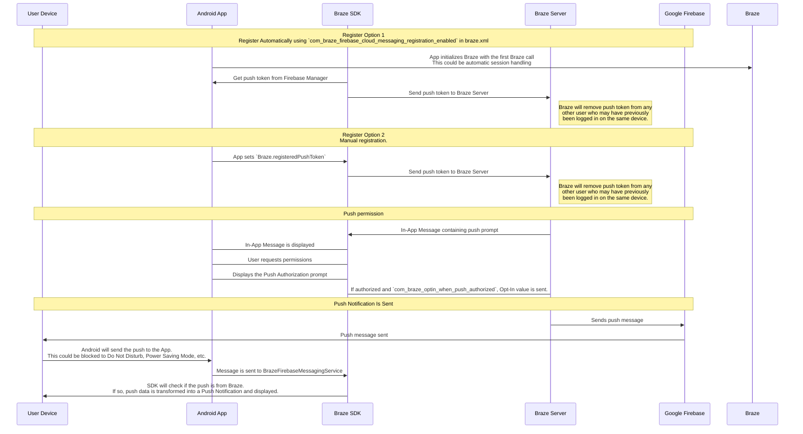

## Comprensión del flujo de trabajo push de Braze {#understanding-the-braze-push-workflow}

Firebase Cloud Messaging (FCM) es la infraestructura de Google para las notificaciones push enviadas a aplicaciones Android. Aquí se muestra la estructura simplificada de cómo se habilitan las notificaciones push para los dispositivos de tus usuarios y cómo Braze puede enviarles notificaciones push:



### Paso 1: Configura tu clave de API de Google Cloud {#step-1-configure-your-google-cloud-api-key}

Al desarrollar tu aplicación, deberás proporcionar al SDK or kit de desarrollo de software de Braze para Android tu ID de remitente de Firebase. Además, deberás proporcionar una clave de API para aplicaciones de servidor al panel de Braze. Braze utilizará esta clave de API para enviar mensajes a tus dispositivos. También deberás verificar que el servicio FCM esté habilitado en la consola para desarrolladores de Google.


Un error común durante este paso es usar la clave de API del identificador de la aplicación en lugar de la clave de API REST or transferencia de estado representacional.


### Paso 2: Los dispositivos se registran en FCM y proporcionan a Braze los tokens de notificaciones push {#step-2-devices-register-for-fcm-and-provide-braze-with-push-tokens}

En integraciones típicas, el SDK or kit de desarrollo de software de Braze para Android se encargará de registrar los dispositivos para la funcionalidad de FCM. Esto generalmente ocurre inmediatamente al abrir la aplicación por primera vez. Después del registro, Braze recibirá un ID de registro de FCM, que se utiliza para enviar mensajes a ese dispositivo específicamente. Almacenaremos el ID de registro para ese usuario, y ese usuario pasará a estar "registrado para push" si anteriormente no tenía un token de notificaciones push para ninguna de tus aplicaciones.

### Paso 3: Lanza una Campaign push de Braze {#step-3-launch-a-braze-push-campaign}

Cuando se lanza una Campaign push, Braze realiza solicitudes a FCM para entregar tu mensaje. Braze usa la clave de API copiada en el panel para autenticarse y verificar que podemos enviar notificaciones push a los tokens de notificaciones push proporcionados.

### Paso 4: Elimina los tokens no válidos {#step-4-remove-invalid-tokens}

Si FCM nos informa de que alguno de los tokens de notificaciones push a los que intentábamos enviar un mensaje no es válido, eliminamos esos tokens de los perfiles de usuario con los que estaban asociados. Si los usuarios no tienen otros tokens de notificaciones push, ya no aparecerán como "registrados para push" en la página de **Segments**.

Para más detalles sobre FCM, visita [Cloud messaging](https://firebase.google.com/docs/cloud-messaging/).

## Usa los registros de errores de push {#use-the-push-error-logs}

Braze proporciona errores de notificaciones push dentro del registro de actividad de mensajes. Este registro de errores ofrece una variedad de advertencias que pueden ser muy útiles para identificar por qué tus Campaigns no están funcionando como se esperaba. Al seleccionar un mensaje de error, se te redirige a la documentación relevante para ayudarte a solucionar un incidente en particular.


## Solución de problemas {#troubleshooting}

### Las notificaciones push no se envían {#push-isnt-sending}

Es posible que tus mensajes push no se envíen debido a las siguientes situaciones:

- Tus credenciales existen en el ID de proyecto incorrecto de Google Cloud Platform (ID de remitente incorrecto).
- Tus credenciales tienen el alcance de permisos incorrecto.
- Subiste credenciales incorrectas al espacio de trabajo de Braze equivocado (ID de remitente incorrecto).

Para otros problemas que puedan impedir el envío de un mensaje push, consulta [Guía del usuario: solución de problemas de notificaciones push]({{site.baseurl}}/user_guide/channels/push/troubleshooting).

### No se muestran usuarios "push registered" en el panel de Braze (antes de enviar mensajes) {#no-push-registered-users-showing-in-the-braze-dashboard-prior-to-sending-messages}

Confirma que tu aplicación está correctamente configurada para permitir notificaciones push. Los puntos de fallo comunes que debes verificar incluyen:

#### ID de remitente incorrecto {#incorrect-sender-id}

Verifica que el ID de remitente de FCM correcto esté incluido en el archivo `braze.xml`. Un ID de remitente incorrecto provocará errores de `MismatchSenderID` reportados en el registro de actividad de mensajes del panel.

#### El registro de Braze no se realiza {#braze-registration-not-occurring}

Dado que el registro de FCM se gestiona fuera de Braze, la falla en el registro solo puede ocurrir en dos lugares:

1. Durante el registro con FCM
2. Al pasar el token de notificaciones push generado por FCM a Braze

Recomendamos establecer un punto de interrupción o un registro para confirmar que el token de notificaciones push generado por FCM se está enviando a Braze. Si un token no se genera correctamente o no se genera en absoluto, recomendamos consultar la [documentación de FCM](https://firebase.google.com/docs/cloud-messaging/android/client).

#### Google Play Services no está presente {#google-play-services-not-present}

Para que las notificaciones push de FCM funcionen, Google Play Services debe estar presente en el dispositivo. Si Google Play Services no está en un dispositivo, el registro push no ocurrirá.


Google Play Services no se instala en emuladores de Android sin las API de Google instaladas.


#### Dispositivo no conectado a internet {#device-not-connected-to-the-internet}

Verifica que tu dispositivo tenga buena conectividad a internet y no esté enviando tráfico de red a través de un proxy.

### Tocar la notificación push no abre la aplicación {#tapping-push-notification-doesnt-open-the-app}

Verifica si `com_braze_handle_push_deep_links_automatically` está configurado como `true` o `false`. Para habilitar que Braze abra automáticamente la aplicación y cualquier vínculo profundo cuando se toca una notificación push, establece `com_braze_handle_push_deep_links_automatically` en `true` en tu archivo `braze.xml`.

Si `com_braze_handle_push_deep_links_automatically` está configurado con su valor predeterminado de `false`, necesitas usar una devolución de llamada push de Braze para escuchar y gestionar las intenciones de push recibido y abierto.

### Las notificaciones push rebotaron {#push-notifications-bounced}

Si una notificación push no se entrega, asegúrate de que no haya rebotado revisando la [consola para desarrolladores]({{site.baseurl}}/developer_guide/platforms/android/push_notifications/troubleshooting#utilizing-the-push-error-logs). A continuación se describen los errores comunes que pueden registrarse en la consola para desarrolladores:

#### Error: MismatchSenderID

`MismatchSenderID` indica una falla de autenticación. Confirma que tu ID de remitente de Firebase y tu clave de API de FCM sean correctos.

#### Error: InvalidRegistration

`InvalidRegistration` puede ser causado por un token de notificaciones push mal formado.

1. Asegúrate de pasar un token de notificaciones push válido a Braze desde [Firebase Cloud Messaging](https://firebase.google.com/docs/cloud-messaging/android/client#retrieve-the-current-registration-token).

#### Error: NotRegistered

2. `NotRegistered` también puede ocurrir cuando se realizan múltiples registros y un segundo registro invalida el primer token.

### Notificaciones push enviadas pero no mostradas en los dispositivos de los usuarios {#push-notifications-sent-but-not-displayed-on-users-devices}

Hay varias razones por las que esto podría estar ocurriendo:

#### La aplicación fue forzada a cerrarse {#application-was-force-quit}

Si fuerzas el cierre de tu aplicación a través de la configuración del sistema, tus notificaciones push no se enviarán. Volver a iniciar la aplicación habilitará nuevamente tu dispositivo para recibir notificaciones push.

#### BrazeFirebaseMessagingService no registrado {#brazefirebasemessagingservice-not-registered}

BrazeFirebaseMessagingService debe estar correctamente registrado en `AndroidManifest.xml` para que las notificaciones push aparezcan:

```xml
<service android:name="com.braze.push.BrazeFirebaseMessagingService"
  android:exported="false">
  <intent-filter>
    <action android:name="com.google.firebase.MESSAGING_EVENT" />
  </intent-filter>
</service>
```

#### El firewall está bloqueando las notificaciones push {#firewall-is-blocking-push}

Si estás probando notificaciones push a través de Wi-Fi, tu firewall podría estar bloqueando los puertos necesarios para que FCM reciba mensajes. Confirma que los puertos `5228`, `5229` y `5230` estén abiertos. Además, dado que FCM no especifica sus IPs, también debes permitir que tu firewall acepte conexiones salientes a todas las direcciones IP contenidas en los bloques de IP listados en el ASN de Google `15169`.

#### La fábrica de notificaciones personalizada devuelve null {#custom-notification-factory-returning-null}

Si has implementado una [fábrica de notificaciones personalizada]({{site.baseurl}}/developer_guide/platform_integration_guides/android/push_notifications/android/integration/standard_integration#custom-displaying-notifications), asegúrate de que no esté devolviendo `null`. Esto hará que las notificaciones no se muestren.

### Los usuarios "push registered" ya no están habilitados después de enviar mensajes {#push-registered-users-no-longer-enabled-after-sending-messages}

Hay varias razones por las que esto podría estar sucediendo:

#### La aplicación fue desinstalada {#application-was-uninstalled}

Los usuarios han desinstalado la aplicación. Esto invalidará su token de notificaciones push de FCM.

#### Clave de servidor de Firebase Cloud Messaging inválida {#invalid-firebase-cloud-messaging-server-key}

La clave de servidor de Firebase Cloud Messaging proporcionada en el panel de Braze es inválida. El ID de remitente proporcionado debe coincidir con el referenciado en el archivo `braze.xml` de tu aplicación. La clave de servidor y el ID de remitente se encuentran aquí en tu consola de Firebase:


### Los clics push no se registran {#push-clicks-not-logged}

Si los clics push no se están registrando, es posible que los datos de clics push aún no se hayan enviado a nuestros servidores. El SDK or kit de desarrollo de software de Braze para Android puede limitar la frecuencia de los envíos.

Si implementaste un controlador push personalizado, asegúrate de que estés [preservando correctamente los análisis push nativos]({{site.baseurl}}/developer_guide/push_notifications/logging_message_data/?tab=android#preserving-native-push-analytics-with-custom-push-handling).

El registro de clics push es una operación de red y está sujeto a las limitaciones de la red. Por lo tanto, aunque el SDK or kit de desarrollo de software de Braze para Android intenta acomodarse a los fallos de red y reintentará las solicitudes fallidas, se puede esperar cierta pérdida de eventos.

### Los vínculos profundos no funcionan {#deep-links-not-working}

#### Verifica la configuración de vínculos profundos {#verify-deep-link-configuration}

Los vínculos profundos se pueden [probar con ADB](https://developer.android.com/training/app-indexing/deep-linking.html#testing-filters). Recomendamos probar tu vínculo profundo con el siguiente comando:

`adb shell am start -W -a android.intent.action.VIEW -d "THE_DEEP_LINK" THE_PACKAGE_NAME`

Si el vínculo profundo no funciona, es posible que esté mal configurado. Un vínculo profundo mal configurado no funcionará cuando se envíe a través de notificaciones push de Braze.

#### Verifica la lógica de manejo personalizado {#verify-custom-handling-logic}

Si el vínculo profundo [funciona correctamente con ADB](https://developer.android.com/training/app-indexing/deep-linking.html#testing-filters) pero no funciona desde las notificaciones push de Braze, verifica si se ha implementado algún [manejo personalizado de apertura push]({{site.baseurl}}/developer_guide/platform_integration_guides/android/push_notifications/android/integration/standard_integration#android-push-listener-callback). Si es así, verifica que el código de manejo personalizado gestione correctamente el vínculo profundo entrante.

#### Deshabilitar el comportamiento de pila de retroceso {#disable-back-stack-behavior}

Si el vínculo profundo [funciona correctamente con ADB](https://developer.android.com/training/app-indexing/deep-linking.html#testing-filters) pero no funciona desde las notificaciones push de Braze, intenta deshabilitar la [pila de retroceso](https://developer.android.com/guide/components/activities/tasks-and-back-stack). Para hacerlo, actualiza tu archivo **braze.xml** para incluir:

```xml
<bool name="com_braze_push_deep_link_back_stack_activity_enabled">false</bool>
```
