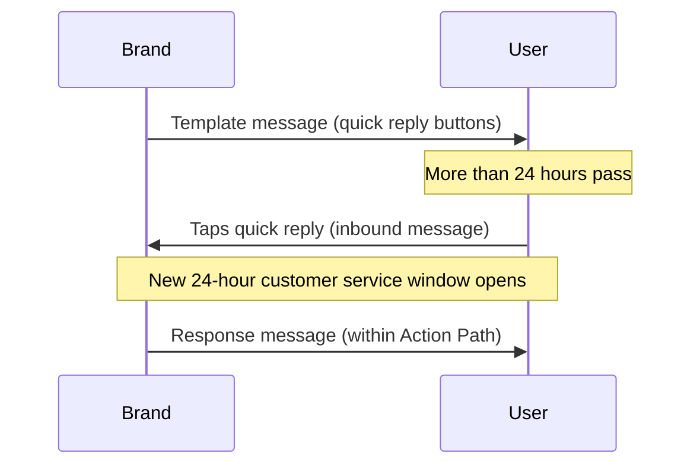

# Mensajes de usuario {#user-messages}

> WhatsApp es un canal de comunicación bidireccional. Tu marca no solo puede enviar mensajes a los usuarios, sino que ellos también pueden participar en conversaciones utilizando Campaigns y Canvas con plantillas. Hay varias formas de hacerlo, incluyendo respuestas rápidas de WhatsApp, mensajes de lista y palabras desencadenantes. Las llamadas a la acción (CTA) de respuestas rápidas y mensajes de lista son una excelente manera de fomentar la interacción de los usuarios con tu mensajería de WhatsApp.

## Desencadenadores basados en acciones {#action-based-triggers}

Tanto las Campaigns como los Canvas pueden iniciarse, ramificarse y tener cambios a mitad del recorrido a partir de un mensaje entrante de WhatsApp (un usuario que envía un mensaje a tu WhatsApp), como una palabra desencadenante.

Asegúrate de que tu palabra desencadenante coincida con lo que esperas de los usuarios.

**Cosas que debes saber:**
- Cada letra de tu palabra desencadenante debe estar en mayúsculas cuando se configure. Braze no requiere que las palabras desencadenantes entrantes enviadas por los usuarios estén en mayúsculas. Por ejemplo, enviar "jOin2023" seguirá desencadenando el Canvas o la Campaign.
- Si no se especifica ninguna palabra desencadenante en el desencadenador basado en acciones del calendario de entrada, la Campaign o el Canvas se ejecutará para TODOS los mensajes entrantes de WhatsApp. Esto incluye mensajes que coincidan con frases en Campaigns y Canvas activos, en cuyo caso el usuario recibirá dos mensajes de WhatsApp.










## Respuestas no reconocidas {#unrecognized-responses}

Te recomendamos incluir una opción para respuestas no reconocidas en Canvas interactivos. Esto guía a los usuarios a comprender cuáles son las indicaciones disponibles y establece expectativas para el canal. La gestión de expectativas puede ser especialmente útil si tienes canales de WhatsApp con chat de agente en vivo.
- En el paso de acción, después de crear los grupos de acción para las frases de filtro personalizadas, añade un grupo de acción adicional para "Enviar mensaje de WhatsApp", pero **no marques Donde el cuerpo del mensaje**. Esto capturará todas las respuestas de usuario no reconocidas, de forma similar a una cláusula "else".
- Te recomendamos dar seguimiento con un mensaje de WhatsApp informando al usuario de que este canal no está atendido y guiándolo a un canal de soporte si es necesario.

## Respuestas rápidas {#quick-replies}

{: style="float:right;max-width:25%;margin-left:15px;border: 0;"}

Las respuestas rápidas aparecen como opciones de botones clicables dentro de la conversación, pero actúan como si un usuario hubiera respondido con texto. Braze las procesa como mensajes entrantes y puede enviar respuestas predefinidas en función del botón pulsado. Utiliza el paso "Acción de mensaje entrante de WhatsApp" al crear y filtrar las respuestas de tus usuarios.

{: style="max-width:50%;"}

### Configurar la experiencia de respuesta rápida en Canvas {#configure-the-quick-reply-experience-in-canvas}

#### Paso 1: Crear los CTA {#step-1-build-out-ctas}

Primero, crea tus CTA de respuesta rápida en el [Administrador de plantillas de mensajes de WhatsApp](https://business.facebook.com/wa/manage/message-templates/) dentro de una plantilla de mensaje.

{: style="max-width:80%;"}

Una vez que tu plantilla haya sido enviada y aprobada por WhatsApp, puedes usarla para crear un Canvas dentro de Braze.


Puedes crear el Canvas antes de recibir la aprobación de tu plantilla de mensaje.


#### Paso 2: Crear tu Canvas {#step-2-build-your-canvas}

A continuación, crea un Canvas con un paso de mensaje que incluya tu plantilla creada.

Crea un paso de acción que siga al paso de mensaje. Crea un grupo por cada opción de respuesta rápida en este paso de acción.

Para cada grupo de opciones de respuesta rápida, especifica el texto exacto del botón que deseas asociar. Ten en cuenta que las palabras clave deben estar en mayúsculas.

Si deseas una respuesta predeterminada para los usuarios que responden al mensaje con texto en lugar de respuestas rápidas, crea un grupo adicional sin un cuerpo de mensaje coincidente.

Continúa construyendo el Canvas como lo harías normalmente a partir de este punto.

### Respuestas {#responses}

Lo más probable es que quieras un mensaje de respuesta para cada opción. Recomendamos tener una opción general para las respuestas fuera del alcance de las respuestas rápidas (como para los clientes que responden con un mensaje general en lugar de una indicación predeterminada). Por ejemplo, "Lo sentimos, no reconocimos tu respuesta. Para problemas de soporte, envía un mensaje a <canal de soporte>."

Ten en cuenta que puedes utilizar cualquier acción posterior que ofrece Braze Canvas, como mensajes de respuesta, actualizaciones de perfil de usuario o webhooks de Braze a Braze.

## Mensajes de lista {#list-messages}

Los mensajes de lista aparecen como un mensaje del cuerpo con una lista de opciones seleccionables. Cada lista puede tener varias secciones, y cada lista puede tener hasta 10 filas.

{: style="max-width:40%;"}

### Configurar la experiencia de mensaje de lista en Canvas {#configure-the-list-message-experience-in-canvas}

#### Paso 1: Crear o editar un Canvas existente basado en acciones {#step-1-create-or-edit-an-existing-action-based-canvases}

Solo puedes añadir mensajes de lista de WhatsApp a Canvas que estén basados en acciones, ya que deben ser una respuesta a un mensaje del usuario.

#### Paso 2: Crear un paso de mensaje de WhatsApp {#step-2-create-a-whatsapp-message-step}

Añade un [paso de mensaje]({{site.baseurl}}/user_guide/messaging/canvas/canvas_components/message_step) de WhatsApp y, a continuación, selecciona el diseño de mensaje de respuesta **List Message**.

{: style="max-width:70%;"}

Añade un nombre de **List button** que los usuarios seleccionarán para mostrar tu lista. A continuación, utiliza los campos de **List content** para crear tu lista:

- **Section:** Añade hasta 10 secciones para agrupar y organizar los elementos de tu lista. Por ejemplo, un comercio minorista de ropa podría usar secciones para organizar por estilos de temporada (como primavera, verano, otoño e invierno) o prendas de vestir (como partes de arriba, partes de abajo y zapatos).
- **Row:** Añade hasta 10 filas, o elementos de lista, en todas las secciones.
- **Row description (opcional):** Añade una descripción opcional a todas las filas (elementos de lista).

{: style="max-width:60%;"}

Cambia el orden de las secciones y filas seleccionando y arrastrando el icono junto a sus nombres.

{: style="max-width:60%;"}

De vuelta en el creador de Canvas, añade una [ruta de acción]({{site.baseurl}}/user_guide/messaging/canvas/canvas_components/action_paths) después del paso de mensaje que tenga un grupo para cada respuesta de la lista. En cada grupo:

1. Añade un desencadenante para **Sent inbound WhatsApp subscription group** y selecciona el grupo de suscripción de WhatsApp correspondiente.
2. Marca la casilla **Where the message body**.
3. Especifica el contenido de una fila (o elemento de lista).

Continúa construyendo tu Canvas.

### Crear rutas de acción para descripciones largas {#creating-actions-paths-for-long-descriptions}

Si tienes descripciones de filas, debes usar **Matches regex** para especificar una fila. Por ejemplo, si quieres especificar una fila con la descripción "Our new style that fits over your favorite pair of ankle boots", podrías usar [regex]({{site.baseurl}}/user_guide/audience/segments/regex) con "ankle boots".

## Consideraciones {#considerations}

### Requisitos de tiempo para los mensajes de respuesta {#timing-requirements-for-response-messages}

Los mensajes de respuesta deben enviarse en un plazo de 24 horas desde la recepción del mensaje del usuario. Para ayudar a crear experiencias exitosas, Braze verifica la lógica del mensaje para confirmar que existe un mensaje entrante del usuario que desbloquea el mensaje de respuesta.

Para respuestas en menos de un minuto en flujos bidireccionales de Canvas, minimiza los pasos entre el desencadenante entrante y el envío del mensaje de respuesta. La arquitectura de Canvas, los viajes de ida y vuelta de webhooks y el procesamiento por lotes de actualizaciones de usuario pueden añadir latencia. Consulta [Minimizar la latencia de respuesta para flujos bidireccionales]({{site.baseurl}}/user_guide/channels/whatsapp/best_practices#minimize-response-latency-for-two-way-flows).

Los siguientes eventos desbloquean los mensajes de respuesta:

- Mensaje entrante
  - [Action Path]({{site.baseurl}}/action_paths) o [entrada basada en acciones]({{site.baseurl}}/user_guide/messaging/campaigns/schedule_your_campaign/triggered_delivery) con el desencadenante **Send a WhatsApp inbound message**.

- [Entrada desencadenada por API]({{site.baseurl}}/user_guide/messaging/campaigns/schedule_your_campaign/api_triggered_delivery)
- Mensaje de producto entrante
  - Evento [`ecommerce.cart_updated`]({{site.baseurl}}/user_guide/data/activation/events/recommended_events/ecommerce_events#types-of-ecommerce-recommended-events?tab=ecommerce.cart_updated)

### Respuestas rápidas y mensajes entrantes fuera de la ventana de 24 horas {#quick-replies-and-inbound-messages-outside-the-24-hour-window}

Cuando un usuario interactúa con tu empresa en WhatsApp, incluyendo al pulsar un botón de respuesta rápida en una plantilla de mensaje anterior, su acción cuenta como un mensaje entrante. Ese mensaje entrante abre una nueva ventana de servicio al cliente de 24 horas, incluso si la plantilla original se envió hace más de 24 horas.

En un Canvas con botones de respuesta rápida, los usuarios pueden pulsar un botón días después de recibir la plantilla de bienvenida y aún así entrar en el Action Path correcto. Braze evalúa el Action Path cuando llega el mensaje entrante; no necesitas extender la duración del Action Path más allá del valor predeterminado para capturar respuestas tardías.

El siguiente diagrama muestra un flujo común de respuesta rápida:

#### Cosas que debes saber {#things-to-know}

- El paso del mensaje de respuesta debe seguir estando dentro de las 24 horas posteriores al mensaje entrante del usuario. En la mayoría de los flujos de Canvas, la respuesta se envía inmediatamente después de que se evalúa el Action Path, por lo que esto no suele ser un problema.
- La ventana de servicio al cliente de 24 horas es diferente de los [eventos de conversión]({{site.baseurl}}/user_guide/messaging/messaging_fundamentals/conversion_events) de Canvas, que pueden usar una ventana de hasta 30 días. Las ventanas de conversión controlan la atribución; no afectan si un mensaje de respuesta puede enviarse.
- Para información sobre facturación, consulta [¿Son gratuitos los mensajes de respuesta de WhatsApp?]({{site.baseurl}}/user_guide/channels/whatsapp/faq#are-whatsapp-response-messages-free).

### Filtrar por un atributo de tiempo personalizado {#filtering-by-a-custom-time-attribute}

Si tu Campaign de WhatsApp basada en acciones o la audiencia de tu Canvas depende de un atributo de tiempo personalizado que cae dentro de una ventana relativa (por ejemplo, entre ahora y las próximas 24 horas), combina dos filtros como se describe en [Tiempo]({{site.baseurl}}/user_guide/data/activation/custom_data/custom_attributes#time).

### Almacenamiento de medios entrantes y expiración de URL {#inbound-media-storage-and-url-expiration}

Cuando un usuario envía un mensaje de WhatsApp que contiene medios (como una imagen, un archivo de audio o un documento), Braze almacena esos medios en Amazon S3 durante 30 días a partir del momento en que se recibe el mensaje.

Sin embargo, el campo Liquid `inbound_media_urls`, que hace referencia a la URL de esos medios, es válido durante siete días a partir del momento en que Braze recibe el mensaje entrante. Dado que la URL se genera una sola vez en el momento de la recepción y no se regenera, la ventana de siete días se aplica independientemente de cuándo accedas al campo. Se aplica el límite más corto de los dos, por lo que en la práctica, `inbound_media_urls` debe considerarse válido durante un máximo de siete días.


Si guardas un valor de `inbound_media_urls` en un atributo personalizado de usuario para usarlo más adelante, ten en cuenta esta expiración de siete días. Intentar acceder a la URL después de que haya expirado resulta en un enlace roto.


### Nombre de perfil entrante {#inbound-profile-name}

Cuando Meta incluye un nombre para mostrar en un mensaje entrante de WhatsApp, Braze lo expone como el atributo Liquid `{{whats_app.${inbound_profile_name}}}` en ese evento entrante. Este valor refleja el nombre que el usuario configuró en WhatsApp y puede no coincidir con los datos del perfil del CRM. Valida los datos antes de usarlos en el texto dirigido al usuario, o utiliza un paso de actualización de usuario en Canvas para guardarlo en un campo de perfil para uso posterior. Para obtener una lista completa de los atributos Liquid de WhatsApp, consulta [Etiquetas de personalización compatibles]({{site.baseurl}}/user_guide/messaging/design_and_edit/personalize/liquid/supported_personalization_tags).