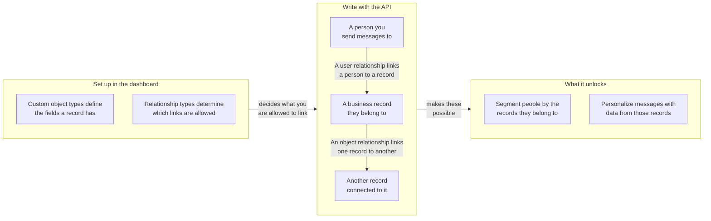

## URL de base et authentification {#base-url-and-authentication}

Utilisez votre endpoint REST d'espace de travail et envoyez `Authorization: Bearer YOUR_REST_API_KEY`. Cette section explique où sont hébergés les endpoints des objets personnalisés et comment les requêtes sont authentifiées.

- Pour les hôtes des endpoints, consultez l'[aperçu de l'API Braze]({{site.baseurl}}/api/basics#endpoints).
- Tous les payloads de requête et de réponse sont au format JSON.
- Les requêtes sont limitées à l'espace de travail propriétaire de la clé API.
- Si la clé dispose d'une liste d'adresses IP autorisées, les adresses IP non autorisées renvoient `403`.

## Permissions de clé API {#api-key-permissions}

Cette section associe chaque endpoint à la permission requise afin que vous puissiez définir les clés API en toute sécurité.

| Permission | Groupe d'endpoints |
|---|---|
| `custom_objects.read` | Lectures de types et d'objets, et lectures de relations objet |
| `custom_objects.create` | Création d'objet |
| `custom_objects.update` | Remplacement et mise à jour d'objet |
| `custom_objects.delete` | Suppression d'objet |
| `custom_objects.user_relationships.read` | Lectures de relations utilisateur |
| `custom_objects.user_relationships.create` | Création de relation utilisateur |
| `custom_objects.user_relationships.update` | Remplacement et mise à jour de relation utilisateur |
| `custom_objects.user_relationships.delete` | Suppression de relation utilisateur |
| `custom_objects.object_relationships.create` | Création de relation objet |
| `custom_objects.object_relationships.update` | Remplacement et mise à jour de relation objet |
| `custom_objects.object_relationships.delete` | Suppression de relation objet |
{: .reset-td-br-1 .reset-td-br-2 aria-label="Groupes de permissions des objets personnalisés" }


Les lectures de relations objet utilisent `custom_objects.read`. Il n'existe pas de permission `custom_objects.object_relationships.read`.


## Limites de débit {#rate-limits}

Cette section présente les quotas de requêtes par défaut et les en-têtes de réponse pour le trafic en lecture et en écriture.

| Compartiment | Limite par défaut |
|---|---|
| Lectures d'objets personnalisés | 50 requêtes par minute |
| Écritures d'objets personnalisés | 50 requêtes par minute |
{: .reset-td-br-1 .reset-td-br-2 aria-label="Limites de débit par défaut des objets personnalisés" }

Chaque réponse inclut `X-RateLimit-Limit`, `X-RateLimit-Remaining` et `X-RateLimit-Reset`.

Pour les requêtes limitées, Braze renvoie `429` ainsi qu'un payload d'erreur contenant `id` et `message`.

```json
{
  "errors": [
    {
      "id": "rate-limit-exceeded",
      "message": "You have exceeded your limit of 50 requests per minute."
    }
  ]
}
```

## Concepts fondamentaux {#core-concepts}

Cette section définit les identifiants clés utilisés dans tous les endpoints des objets personnalisés.

- `type_name` : le nom machine du type d'objet personnalisé, unique au sein d'un espace de travail.
- `external_id` : votre identifiant d'objet, unique au sein d'un type.
- `braze_id` : l'ID utilisateur Braze utilisé sur les endpoints de relations utilisateur.
- `attributes` : données d'objet ou de relation indexées par nom de champ et validées par rapport au schéma configuré.

## Fonctionnement des relations {#how-relationships-work}

Cette section explique les types de relations, les arêtes de relation et le comportement de `anchor` avant que vous n'utilisiez les pages de référence des endpoints.

### Modèle de relations en un coup d'œil {#relationship-model-at-a-glance}

Utilisez ce diagramme pour visualiser comment les types, les enregistrements et les relations s'articulent, et ce que leur liaison vous permet de faire dans Braze. Vous définissez les types dans le tableau de bord, puis vous créez les enregistrements et les liens entre eux via ces endpoints.



### Les types et les arêtes sont distincts {#types-and-edges-are-separate}

- Les types de relations définissent quels liens sont valides et sont gérés dans le tableau de bord.
- Les arêtes de relation sont les liens réels entre les enregistrements et sont créées, mises à jour et supprimées via ces endpoints API.
- Avant d'écrire des relations, listez les valeurs `rel_kind` valides avec :
  - `GET /custom_objects/types/{type_name}/user_relationship_types`
  - `GET /custom_objects/types/{type_name}/object_relationship_types`

### Pourquoi les relations objet nécessitent `related_type_name` {#why-object-relationships-require-related_type_name}

- `rel_kind` n'est pas globalement unique pour toutes les paires de types d'objets. Par exemple, `rel_kind` peut être `subaccount` pour une paire de types d'objets et `partner_account` pour une autre.
- Les écritures de relations objet nécessitent donc à la fois `rel_kind` et `related_type_name` pour identifier le type de relation visé ainsi que l'autre type d'objet dans l'association.
- Si `related_type_name` ne correspond pas au type de relation pour ce `rel_kind`, la requête renvoie `400`.

### `anchor` contrôle la direction de la relation {#anchor-controls-relationship-direction}

Les relations objet sont directionnelles. L'objet de l'URL est interprété en fonction de `anchor`.

| `anchor` | Rôle de l'objet URL | Clé de l'objet lié dans les réponses |
|---|---|---|
| `source` (par défaut) | Côté source (arête sortante) | `to_custom_object` |
| `target` | Côté cible (arête entrante) | `from_custom_object` |
{: .reset-td-br-1 .reset-td-br-2 .reset-td-br-3 aria-label="Comportement de l'ancre pour les relations objet" }

Créer la même arête depuis la perspective d'ancre opposée cible toujours une seule relation sous-jacente. Un second appel de création pour la même arête renvoie `409` (`duplicate-object-relationship`).

### Asymétrie des chemins pour les relations utilisateur {#path-asymmetry-for-user-relationships}

Les lectures et écritures de relations utilisateur utilisent intentionnellement des chemins d'endpoint différents :

- Lecture : `GET /custom_objects/objects/{type_name}/{external_id}/user_relationships`
- Écriture : `POST|PUT|PATCH|DELETE /custom_objects/objects/{type_name}/{external_id}/users`

### Les attributs de relation sont distincts des attributs d'objet {#relationship-attributes-are-separate-from-object-attributes}

- Les endpoints de relations renvoient les attributs au niveau de l'arête dans le champ `attributes` de premier niveau.
- Les attributs d'objet restent imbriqués sous `to_custom_object` ou `from_custom_object`.
- `PUT` remplace les `attributes` de la relation, et `PATCH` fusionne les `attributes` de la relation.

### Exemple pratique {#worked-example}

Cet exemple illustre un workflow de comptes courant :

1. Créer `account/acct-123`.
2. Créer `account/acct-456` en tant que compte enfant.
3. Lier un utilisateur à `acct-123` avec `rel_kind: account_user`.
4. Lier `acct-123` à `acct-456` avec `rel_kind: subaccount`.

Pour lire les liens en retour :

- `GET /custom_objects/objects/account/acct-123/user_relationships` pour les utilisateurs liés
- `GET /custom_objects/objects/account/acct-123/object_relationships` pour les liens objet sortants
- `GET /custom_objects/objects/account/acct-456/object_relationships?anchor=target` pour les liens objet entrants


Les endpoints `DELETE` pour les relations objet et les relations utilisateur nécessitent un corps de requête JSON.


## Pagination et fraîcheur des données {#pagination-and-data-freshness}

Cette section couvre le comportement de pagination des listes et le délai de visibilité attendu des données après les écritures.

- Les endpoints de liste prennent en charge `limit` et `offset`.
- `limit` est par défaut à `100` et est plafonné entre `1` et `250`.
- `offset` est par défaut à `0`, et les valeurs négatives sont ramenées à `0`.
- Les écritures sont immédiatement visibles pour les lectures et la personnalisation Liquid.
- L'appartenance à un segment basée sur les objets personnalisés peut présenter un décalage allant jusqu'à une heure, car les filtres calculés sont actualisés toutes les heures.

## Comportement des erreurs {#error-behavior}

Cette section résume les codes de statut et les formats de réponse d'erreur utilisés dans les endpoints des objets personnalisés.

- `404`, `409`, `422` et `429` renvoient un tableau `errors` contenant `id` et `message`.
- `400`, `401` et `403` renvoient une seule chaîne `error`.
- Les limites contractuelles `422` varient selon l'entreprise.