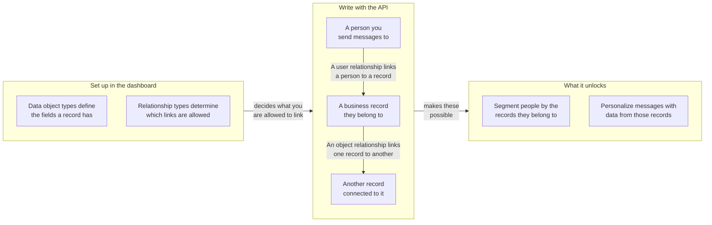

## URL de base et authentification {#base-url-and-authentication}

Utilisez votre endpoint REST d'espace de travail et envoyez `Authorization: Bearer YOUR_REST_API_KEY`. Cette section explique où les endpoints des objets de données sont hébergés et comment les requêtes sont authentifiées.

- Pour les hôtes des endpoints, consultez l'[aperçu de l'API Braze]({{site.baseurl}}/api/basics#endpoints).
- Tous les payloads de requête et de réponse sont au format JSON.
- Les requêtes sont limitées à l'espace de travail qui détient la clé API.
- Si la clé possède une liste d'adresses IP autorisées, les adresses IP non autorisées renvoient `403`.

## Permissions de clé API {#api-key-permissions}

Cette section associe chaque endpoint à sa permission requise afin que vous puissiez définir la portée de vos clés API en toute sécurité.

| Permission | Groupe d'endpoints |
|---|---|
| `data_objects.read` | Lectures de types et d'objets, et lectures de relations objet |
| `data_objects.create` | Création d'objet |
| `data_objects.update` | Remplacement et mise à jour d'objet |
| `data_objects.delete` | Suppression d'objet |
| `data_objects.user_relationships.read` | Lectures de relations utilisateur |
| `data_objects.user_relationships.create` | Création de relation utilisateur |
| `data_objects.user_relationships.update` | Remplacement et mise à jour de relation utilisateur |
| `data_objects.user_relationships.delete` | Suppression de relation utilisateur |
| `data_objects.object_relationships.create` | Création de relation objet |
| `data_objects.object_relationships.update` | Remplacement et mise à jour de relation objet |
| `data_objects.object_relationships.delete` | Suppression de relation objet |
{: .reset-td-br-1 .reset-td-br-2 aria-label="Groupes de permissions des objets de données" }


Les lectures de relations objet utilisent `data_objects.read`. Il n'existe pas de permission `data_objects.object_relationships.read`.


## Limites de débit {#rate-limits}

Cette section décrit les quotas de requêtes par défaut et les en-têtes de réponse pour le trafic en lecture et en écriture.

| Compartiment | Limite par défaut |
|---|---|
| Lectures d'objets de données | 50 requêtes par minute |
| Écritures d'objets de données | 50 requêtes par minute |
{: .reset-td-br-1 .reset-td-br-2 aria-label="Limites de débit par défaut des objets de données" }

Chaque réponse inclut `X-RateLimit-Limit`, `X-RateLimit-Remaining` et `X-RateLimit-Reset`.

Pour les requêtes limitées, Braze renvoie `429` ainsi qu'un payload d'erreur contenant `id` et `message`.

```json
{
  "errors": [
    {
      "id": "rate-limit-exceeded",
      "message": "You have exceeded your limit of 50 requests per minute."
    }
  ]
}
```

## Concepts clés {#core-concepts}

Cette section définit les identifiants clés utilisés dans l'ensemble des endpoints des objets de données.

- `type_name` : le nom machine du type d'objet de données, unique au sein d'un espace de travail.
- `external_id` : votre identifiant d'objet, unique au sein d'un type.
- `braze_id` : l'ID utilisateur Braze utilisé dans les endpoints de relations utilisateur.
- `attributes` : un objet ou des données de relation indexés par nom de champ, validés par rapport au schéma configuré.

## Fonctionnement des relations {#how-relationships-work}

Cette section explique les types de relations, les arêtes de relation et le comportement de `anchor` avant que vous n'utilisiez les pages de référence des endpoints.

### Modèle de relation en un coup d'œil {#relationship-model-at-a-glance}

Utilisez ce diagramme pour visualiser comment les types, les enregistrements et les relations s'articulent, et ce que leur liaison permet dans Braze. Vous définissez les types dans le tableau de bord, puis vous créez les enregistrements et les liens entre eux via ces endpoints.



### Types et arêtes sont distincts {#types-and-edges-are-separate}

- Les types de relations définissent quels liens sont valides et sont gérés dans le tableau de bord.
- Les arêtes de relation sont les liens effectifs entre les enregistrements ; elles sont créées, mises à jour et supprimées via ces endpoints API.
- Avant d'écrire des relations, listez les valeurs `rel_kind` valides avec :
  - `GET /data_objects/types/{type_name}/user_relationship_types`
  - `GET /data_objects/types/{type_name}/object_relationship_types`

### Pourquoi les relations objet nécessitent `related_type_name` {#why-object-relationships-require-related_type_name}

- `rel_kind` n'est pas globalement unique pour toutes les paires de types d'objet. Par exemple, `rel_kind` peut valoir `subaccount` pour une paire de types d'objet et `partner_account` pour une autre.
- Les écritures de relations objet nécessitent donc à la fois `rel_kind` et `related_type_name` pour identifier le type de relation visé ainsi que l'autre type d'objet de l'association.
- Si `related_type_name` ne correspond pas au type de relation pour ce `rel_kind`, la requête renvoie `400`.

### `anchor` contrôle la direction de la relation {#anchor-controls-relationship-direction}

Les relations objet sont directionnelles. L'objet de l'URL est interprété en fonction de `anchor`.

| `anchor` | Rôle de l'objet URL | Clé de l'objet associé dans les réponses |
|---|---|---|
| `source` (par défaut) | Côté source (arête sortante) | `to_data_object` |
| `target` | Côté cible (arête entrante) | `from_data_object` |
{: .reset-td-br-1 .reset-td-br-2 .reset-td-br-3 aria-label="Comportement de l'ancre pour les relations objet" }

Créer la même arête depuis la perspective d'ancre opposée cible toujours la même relation sous-jacente. Un deuxième appel de création pour la même arête renvoie `409` (`duplicate-object-relationship`).

### Asymétrie des chemins pour les relations utilisateur {#path-asymmetry-for-user-relationships}

Les lectures et écritures de relations utilisateur utilisent intentionnellement des chemins d'endpoint différents :

- Lecture : `GET /data_objects/objects/{type_name}/{external_id}/user_relationships`
- Écriture : `POST|PUT|PATCH|DELETE /data_objects/objects/{type_name}/{external_id}/users`

### Les attributs de relation sont distincts des attributs d'objet {#relationship-attributes-are-separate-from-object-attributes}

- Les endpoints de relation renvoient les attributs au niveau de l'arête dans le champ `attributes` de premier niveau.
- Les attributs d'objet restent imbriqués sous `to_data_object` ou `from_data_object`.
- `PUT` remplace les `attributes` de la relation, et `PATCH` les fusionne.

### Exemple pratique {#worked-example}

Cet exemple illustre un flux de travail courant de gestion de comptes :

1. Créez `account/acct-123`.
2. Créez `account/acct-456` en tant que compte enfant.
3. Liez un utilisateur à `acct-123` avec `rel_kind: account_user`.
4. Liez `acct-123` à `acct-456` avec `rel_kind: subaccount`.

Pour relire les liens :

- `GET /data_objects/objects/account/acct-123/user_relationships` pour les utilisateurs liés
- `GET /data_objects/objects/account/acct-123/object_relationships` pour les liens objet sortants
- `GET /data_objects/objects/account/acct-456/object_relationships?anchor=target` pour les liens objet entrants


Les endpoints `DELETE` pour les relations objet et les relations utilisateur nécessitent un corps de requête JSON.


## Pagination et fraîcheur des données {#pagination-and-data-freshness}

Cette section couvre le comportement de pagination des listes et le délai de visibilité attendu des données après écriture.

- Les endpoints de liste prennent en charge `limit` et `offset`.
- `limit` vaut `100` par défaut et est limité entre `1` et `250`.
- `offset` vaut `0` par défaut, et les valeurs négatives sont ramenées à `0`.
- Les écritures sont immédiatement visibles pour les lectures et la personnalisation Liquid.
- L'appartenance à un segment basée sur les objets de données peut présenter un décalage pouvant aller jusqu'à une heure, car les filtres calculés sont actualisés toutes les heures.

## Comportement des erreurs {#error-behavior}

Cette section résume les modèles de statut et de réponse d'erreur utilisés dans les endpoints des objets de données.

- `404`, `409`, `422` et `429` renvoient un tableau `errors` contenant `id` et `message`.
- `400`, `401` et `403` renvoient une chaîne `error` unique.
- Les limites contractuelles `422` varient selon l'entreprise.