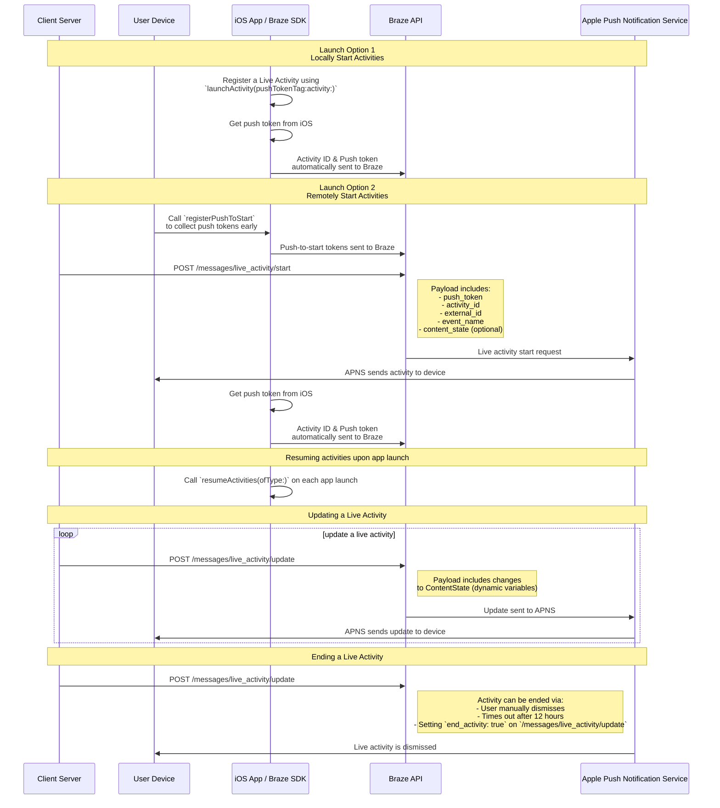

# Activités en direct or en ligne/en production/instantané pour Swift {#live-activities-for-swift}

> Découvrez comment implémenter les activités en direct or en ligne/en production/instantané pour le SDK Swift de Braze. Les activités en direct or en ligne/en production/instantané sont des notifications persistantes et interactives qui s'affichent directement sur l'écran de verrouillage, permettant aux utilisateurs d'obtenir des mises à jour dynamiques en temps réel&#8212;sans déverrouiller leur appareil.

## Fonctionnement {#how-it-works}

{: style="max-width:40%;float:right;margin-left:15px;"}

Les en direct or en ligne/en production/instantané Activities présentent une combinaison d'informations statiques et d'informations dynamiques que vous mettez à jour. Par exemple, vous pouvez créer une en direct or en ligne/en production/instantané Activity qui fournit un suivi de statut pour une livraison. Cette en direct or en ligne/en production/instantané Activity inclut le nom de votre entreprise en tant qu'information statique, ainsi qu'un « délai de livraison » dynamique qui se met à jour à mesure que le livreur s'approche de sa destination.

En tant que développeur, vous pouvez utiliser Braze pour gérer les cycles de vie de vos en direct or en ligne/en production/instantané Activities, effectuer des appels à la REST API de Braze pour mettre à jour les en direct or en ligne/en production/instantané Activities, et faire en sorte que tous les appareils abonnés reçoivent la mise à jour dès que possible. Et, parce que vous gérez les en direct or en ligne/en production/instantané Activities via Braze, vous pouvez les utiliser conjointement avec vos autres canaux de communication&mdash;notifications push, In-App Messages, Content Cards&mdash;pour favoriser l'adoption.

## Diagramme de séquence {#sequence-diagram}









## Implémenter une en direct or en ligne/en production/instantané Activity {#implementing-a-live-activity}

# Vous devrez également remplir les conditions suivantes :

- Assurez-vous que votre projet cible iOS 16.1 ou une version ultérieure.
- Ajoutez le droit `Push Notification` sous **Signing & Capabilities** dans votre projet Xcode.
- Assurez-vous que des clés `.p8` sont utilisées pour envoyer des notifications. Les fichiers plus anciens tels que `.p12` ou `.pem` ne sont pas pris en charge.
- À partir de la version 8.2.0 du SDK Swift de Braze, vous pouvez [enregistrer une en direct or en ligne/en production/instantané Activity à distance](#swift_step-2-start-the-activity). Pour utiliser cette fonctionnalité, iOS 17.2 ou une version ultérieure est requise.


Bien que les en direct or en ligne/en production/instantané Activities et les notifications push soient similaires, leurs autorisations système sont distinctes. Par défaut, toutes les fonctionnalités des en direct or en ligne/en production/instantané Activities sont activées, mais les utilisateurs peuvent désactiver cette fonctionnalité par application.




### Étape 1 : Créer une activité {#create-an-activity}

Tout d'abord, assurez-vous d'avoir suivi la documentation Apple [Displaying en direct or en ligne/en production/instantané data with en direct or en ligne/en production/instantané Activities](https://developer.apple.com/documentation/activitykit/displaying-live-data-with-live-activities) pour configurer les en direct or en ligne/en production/instantané Activities dans votre application iOS. Dans le cadre de cette tâche, assurez-vous d'inclure `NSSupportsLiveActivities` défini sur `YES` dans votre `Info.plist`.

Étant donné que la nature exacte de votre en direct or en ligne/en production/instantané Activity est propre à votre cas d'usage, configurez et initialisez les objets [Activity](https://developer.apple.com/documentation/activitykit/activityattributes). Il est important de définir :
* `ActivityAttributes` : Ce protocole définit le contenu statique (invariable) et dynamique (variable) qui apparaît dans votre en direct or en ligne/en production/instantané Activity.
* `ActivityAttributes.ContentState` : Ce type définit les données dynamiques qui sont mises à jour au cours du cycle de vie de l'activité.

Vous utilisez également SwiftUI pour créer la présentation de l'interface utilisateur sur l'écran de verrouillage et le Dynamic Island sur les appareils compatibles.

Assurez-vous de bien connaître les [prérequis et limitations](https://developer.apple.com/documentation/activitykit/displaying-live-data-with-live-activities#Understand-constraints) d'Apple pour les en direct or en ligne/en production/instantané Activities, car ces contraintes sont indépendantes de Braze.


Si vous prévoyez d'envoyer des notifications push fréquentes à la même en direct or en ligne/en production/instantané Activity, vous pouvez éviter d'être limité par le budget d'Apple en définissant `NSSupportsLiveActivitiesFrequentUpdates` sur `YES` dans votre fichier `Info.plist`. Pour plus de détails, consultez la section [`Determine the update frequency`](https://developer.apple.com/documentation/activitykit/updating-and-ending-your-live-activity-with-activitykit-push-notifications#Determine-the-update-frequency) dans la documentation ActivityKit.


#### Exemple {#example}

Imaginons que nous voulions créer une en direct or en ligne/en production/instantané Activity pour donner à nos utilisateurs des mises à jour sur le spectacle Superb Owl, où deux refuges animaliers concurrents reçoivent des points pour les chouettes qu'ils hébergent. Pour cet exemple, nous avons créé une structure appelée `SportsActivityAttributes`, mais vous pouvez utiliser votre propre implémentation d'`ActivityAttributes`.

```swift
#if canImport(ActivityKit)
  import ActivityKit
#endif

@available(iOS 16.1, *)
struct SportsActivityAttributes: ActivityAttributes {
  public struct ContentState: Codable, Hashable {
    var teamOneScore: Int
    var teamTwoScore: Int
  }

  var gameName: String
  var gameNumber: String
}
```

### Étape 2 : Démarrer l'activité {#start-the-activity}

Tout d'abord, choisissez comment vous souhaitez enregistrer votre activité :

- **À distance :** Utilisez la méthode [`registerPushToStart`](<http://braze-inc.github.io/braze-swift-sdk/documentation/brazekit/braze/liveactivities-swift.class/registerpushtostart(fortype:name:)>) tôt dans le cycle de vie de l'utilisateur et avant que le jeton push-to-start ne soit nécessaire, puis démarrez une activité en utilisant l'endpoint [`/messages/live_activity/start`]({{site.baseurl}}/api/endpoints/messaging/live_activity/start).
- **Localement :** Créez une instance de votre en direct or en ligne/en production/instantané Activity, puis utilisez la méthode [`launchActivity`](<https://braze-inc.github.io/braze-swift-sdk/documentation/brazekit/braze/liveactivities-swift.class/launchactivity(pushtokentag:activity:fileid:line:)>) pour créer des jetons push que Braze pourra gérer.




Pour enregistrer une en direct or en ligne/en production/instantané Activity à distance, iOS 17.2 ou une version ultérieure est requise.


#### Étape 2.1 : Ajouter BrazeKit à votre extension de widget {#step-21-add-brazekit-to-your-widget-extension}

Dans votre projet Xcode, sélectionnez le nom de votre application, puis **General**. Sous **Frameworks and Libraries**, confirmez que `BrazeKit` est listé.


#### Étape 2.2 : Ajouter le protocole BrazeLiveActivityAttributes {#brazeActivityAttributes}

Dans votre implémentation d'`ActivityAttributes`, ajoutez la conformité au protocole `BrazeLiveActivityAttributes`, puis ajoutez la propriété `brazeActivityId` à votre modèle d'attributs.


iOS associe la propriété `brazeActivityId` au champ correspondant dans votre payload push-to-start de en direct or en ligne/en production/instantané Activity, elle ne doit donc pas être renommée ni recevoir une autre valeur.


```swift
import BrazeKit

#if canImport(ActivityKit)
  import ActivityKit
#endif

@available(iOS 16.1, *)
// 1. Add the `BrazeLiveActivityAttributes` conformance to your `ActivityAttributes` struct.
struct SportsActivityAttributes: ActivityAttributes, BrazeLiveActivityAttributes {
  public struct ContentState: Codable, Hashable {
    var teamOneScore: Int
    var teamTwoScore: Int
  }

  var gameName: String
  var gameNumber: String

  // 2. Add the `String?` property to represent the activity ID.
  var brazeActivityId: String?
}
```

#### Étape 2.3 : S'enregistrer pour le push-to-start {#step-23-register-for-push-to-start}

Ensuite, enregistrez le type de en direct or en ligne/en production/instantané Activity afin que Braze puisse suivre tous les jetons push-to-start et les instances de en direct or en ligne/en production/instantané Activity associées à ce type.


Le système d'exploitation iOS ne génère des jetons push-to-start que lors de la première installation de l'application après un redémarrage de l'appareil. Pour vous assurer que vos jetons sont enregistrés de manière fiable, appelez `registerPushToStart` dans votre méthode `didFinishLaunchingWithOptions`.


##### Exemple

Dans l'exemple suivant, la classe `LiveActivityManager` gère les objets en direct or en ligne/en production/instantané Activity. Ensuite, la méthode `registerPushToStart` enregistre `SportsActivityAttributes` :

```swift
import BrazeKit

#if canImport(ActivityKit)
  import ActivityKit
#endif

class LiveActivityManager {

  @available(iOS 17.2, *)
  func registerActivityType() {
    // This method returns a Swift background task.
    // You may keep a reference to this task if you need to cancel it wherever appropriate, or ignore the return value if you wish.
    let pushToStartObserver: Task = Self.braze?.liveActivities.registerPushToStart(
      forType: Activity<SportsActivityAttributes>.self,
      name: SportsActivityAttributes.name
    )
  }

}
```

#### Étape 2.4 : Envoyer une notification push-to-start {#step-24-send-a-push-to-start-notification}

Envoyez une notification push-to-start à distance en utilisant l'endpoint [`/messages/live_activity/start`]({{site.baseurl}}/api/endpoints/messaging/live_activity/start).



Vous pouvez utiliser le [framework ActivityKit d'Apple](https://developer.apple.com/documentation/activitykit) pour obtenir un jeton push, que le SDK de Braze peut gérer pour vous. Cela vous permet de mettre à jour les en direct or en ligne/en production/instantané Activities via l'API Braze, car Braze envoie le jeton push au service de notification push d'Apple (APNs) en arrière-plan.

1. Créez une instance de votre implémentation de en direct or en ligne/en production/instantané Activity en utilisant les API ActivityKit d'Apple.
2. Définissez le paramètre `pushType` sur `.token`.
3. Passez les `ActivitiesAttributes` et `ContentState` des en direct or en ligne/en production/instantané Activities que vous avez définis.
4. Enregistrez votre activité auprès de votre instance Braze en la passant à [`launchActivity(pushTokenTag:activity:)`](https://braze-inc.github.io/braze-swift-sdk/documentation/brazekit/braze/liveactivities-swift.class). Le paramètre `pushTokenTag` est une chaîne de caractères personnalisée que vous définissez. Elle doit être unique pour chaque en direct or en ligne/en production/instantané Activity que vous créez.

Après avoir enregistré la en direct or en ligne/en production/instantané Activity, le SDK de Braze extrait et observe les changements dans les jetons push.

#### Exemple

Pour notre exemple, créez une classe appelée `LiveActivityManager` comme interface pour nos objets en direct or en ligne/en production/instantané Activity. Ensuite, définissez le `pushTokenTag` sur `"sports-game-2024-03-15"`.

```swift
import BrazeKit

#if canImport(ActivityKit)
  import ActivityKit
#endif

class LiveActivityManager {

  @available(iOS 16.2, *)
  func createActivity() {
    let activityAttributes = SportsActivityAttributes(gameName: "Superb Owl", gameNumber: "Game 1")
    let contentState = SportsActivityAttributes.ContentState(teamOneScore: "0", teamTwoScore: "0")
    let activityContent = ActivityContent(state: contentState, staleDate: nil)
    if let activity = try? Activity.request(attributes: activityAttributes,
                                            content: activityContent,
      // Setting your pushType as .token allows the Activity to generate push tokens for the server to watch.
                                            pushType: .token) {
      // Register your Live Activity with Braze using the pushTokenTag.
      // This method returns a Swift background task.
      // You may keep a reference to this task if you need to cancel it wherever appropriate, or ignore the return value if you wish.
      let liveActivityObserver: Task = AppDelegate.braze?.liveActivities.launchActivity(pushTokenTag: "sports-game-2024-03-15",
                                                                                        activity: activity)
    }
  }

}
```

Votre widget en direct or en ligne/en production/instantané Activity affiche ce contenu initial à vos utilisateurs.

{: style="max-width:40%;"}



### Étape 3 : Reprendre le suivi de l'activité {#resume-activity-tracking}

Pour vous assurer que Braze suit votre en direct or en ligne/en production/instantané Activity au lancement de l'application :

1. Ouvrez votre fichier `AppDelegate`.
2. Importez le module `ActivityKit` s'il est disponible.
3. Appelez [`resumeActivities(ofType:)`](https://braze-inc.github.io/braze-swift-sdk/documentation/brazekit/braze/liveactivities-swift.class/resumeactivities(oftype:)) dans `application(_:didFinishLaunchingWithOptions:)` pour tous les types `ActivityAttributes` que vous avez enregistrés dans votre application.

Cela permet à Braze de reprendre les tâches de suivi des mises à jour des jetons push pour toutes les en direct or en ligne/en production/instantané Activities actives. Notez que si un utilisateur a explicitement fermé la en direct or en ligne/en production/instantané Activity sur son appareil, elle est considérée comme supprimée et Braze ne la suit plus.

#### Exemple

```swift
import UIKit
import BrazeKit

#if canImport(ActivityKit)
  import ActivityKit
#endif

@main
class AppDelegate: UIResponder, UIApplicationDelegate {

  static var braze: Braze? = nil

  func application(
    _ application: UIApplication,
    didFinishLaunchingWithOptions launchOptions: [UIApplication.LaunchOptionsKey: Any]?
  ) -> Bool {

    if #available(iOS 16.1, *) {
      Self.braze?.liveActivities.resumeActivities(
        ofType: Activity<SportsActivityAttributes>.self
      )
    }

    return true
  }
}
```

### Étape 4 : Mettre à jour l'activité {#update-the-activity}

{: style="max-width:40%;float:right;margin-left:15px;"}

L'endpoint [`/messages/live_activity/update`]({{site.baseurl}}/api/endpoints/messaging/live_activity/update) vous permet de mettre à jour une en direct or en ligne/en production/instantané Activity via des notifications push transmises par la REST API de Braze. Utilisez cet endpoint pour mettre à jour le `ContentState` de votre en direct or en ligne/en production/instantané Activity.

Au fur et à mesure que vous mettez à jour votre `ContentState`, votre widget en direct or en ligne/en production/instantané Activity affiche les nouvelles informations. Voici à quoi ressemble le spectacle Superb Owl à la fin de la première mi-temps.

Consultez notre article sur l'[endpoint `/messages/live_activity/update`]({{site.baseurl}}/api/endpoints/messaging/live_activity/update) pour tous les détails.

### Étape 5 : Terminer l'activité {#end-the-activity}

Lorsqu'une en direct or en ligne/en production/instantané Activity est active, elle est affichée à la fois sur l'écran de verrouillage de l'utilisateur et sur le Dynamic Island. Pour la terminer via Braze, utilisez l'endpoint [`/messages/live_activity/update`]({{site.baseurl}}/api/endpoints/messaging/live_activity/update) avec `end_activity` défini sur `true`.

Pour améliorer la fiabilité lors de la terminaison d'une en direct or en ligne/en production/instantané Activity, suivez les étapes optionnelles suivantes :

1. Incluez éventuellement `dismissal_date` dans cette même requête `update` pour suggérer à iOS quand supprimer l'interface utilisateur de la en direct or en ligne/en production/instantané Activity.
2. Vérifiez les résultats de distribution dans le [Journal d'activité des messages]({{site.baseurl}}/user_guide/administer/global/workspace_settings/logs_and_alerts/message_activity_log).

#### Planifier un renvoi automatique {#arranging-automatic-dismissal}

Pour planifier un renvoi automatique, programmez une requête de suivi vers l'endpoint de mise à jour après avoir démarré la en direct or en ligne/en production/instantané Activity.

1. Envoyez une requête `/messages/live_activity/start` avec un `activity_id` que vous pouvez suivre.
2. Stockez cet `activity_id` et votre heure de fin cible dans votre planificateur backend.
3. À l'heure de fin cible, envoyez une requête `/messages/live_activity/update` avec `end_activity` défini sur `true`.
4. Configurez la date de renvoi dans la même requête de mise à jour. Pour plus de détails, consultez l'endpoint [`/messages/live_activity/update`]({{site.baseurl}}/api/endpoints/messaging/live_activity/update).

Notez que le timing du renvoi est contrôlé par iOS. Même après l'envoi d'une requête de fin valide, la suppression de l'écran de verrouillage ou du Dynamic Island peut être retardée ou se comporter différemment en fonction des conditions au niveau du système d'exploitation.

Une en direct or en ligne/en production/instantané Activity peut également se terminer en dehors de Braze :

* **Renvoi par l'utilisateur** : Un utilisateur peut manuellement fermer une en direct or en ligne/en production/instantané Activity.
* **Expiration** : Après un délai par défaut de huit heures, iOS supprime la en direct or en ligne/en production/instantané Activity du Dynamic Island de l'utilisateur. Après un délai par défaut de 12 heures, iOS supprime la en direct or en ligne/en production/instantané Activity de l'écran de verrouillage de l'utilisateur.

Consultez notre article sur l'[endpoint `/messages/live_activity/update`]({{site.baseurl}}/api/endpoints/messaging/live_activity/update) pour tous les détails.

## Suivi des en direct or en ligne/en production/instantané Activities {#tracking-live-activities}

Les événements de en direct or en ligne/en production/instantané Activity sont disponibles dans Currents, Snowflake Data Sharing et le générateur de requêtes. Les événements suivants peuvent vous aider à comprendre et à surveiller le cycle de vie de vos en direct or en ligne/en production/instantané Activities, à suivre la disponibilité des jetons et à diagnostiquer de manière indépendante les problèmes ou à vérifier les statuts de distribution.

- [en direct or en ligne/en production/instantané Activity Push To Start Token Change]({{site.baseurl}}/user_guide/data/distribution/braze_currents/event_glossary/customer_behavior_events) : capture le moment où un jeton push-to-start (PTS) est ajouté ou mis à jour dans Braze, vous permettant de suivre les enregistrements et la disponibilité des jetons par utilisateur.
- [en direct or en ligne/en production/instantané Activity Update Token Change]({{site.baseurl}}/user_guide/data/distribution/braze_currents/event_glossary/customer_behavior_events) : suit l'ajout, la mise à jour ou la suppression des jetons en direct or en ligne/en production/instantané Activity Update (LAU).
- [en direct or en ligne/en production/instantané Activity Send]({{site.baseurl}}/user_guide/data/distribution/braze_currents/event_glossary/message_engagement_events) : enregistre chaque fois qu'une en direct or en ligne/en production/instantané Activity est démarrée, mise à jour ou terminée par Braze.
- [en direct or en ligne/en production/instantané Activity Outcome]({{site.baseurl}}/user_guide/data/distribution/braze_currents/event_glossary/message_engagement_events) : indique le statut final de distribution au service Apple Push Notification (APNs) pour chaque en direct or en ligne/en production/instantané Activity envoyée depuis Braze.

## Vérifier les envois de en direct or en ligne/en production/instantané Activity {#verify-live-activity-sends}

Si vous devez confirmer si un espace de travail envoie des en direct or en ligne/en production/instantané Activities iOS, vous pouvez utiliser les méthodes suivantes :

### Journal d'activité des messages {#message-activity-log}

Accédez à **Paramètres** > **Journal d'activité des messages** et filtrez par erreurs de en direct or en ligne/en production/instantané Activity pour voir les résultats de distribution liés aux en direct or en ligne/en production/instantané Activities pendant la période prévue. Pour en savoir plus, consultez [Journal d'activité des messages]({{site.baseurl}}/user_guide/administer/global/workspace_settings/logs_and_alerts/message_activity_log).

### Query Builder, Currents ou partage de données Snowflake {#query-builder-currents-or-snowflake-data-sharing}

Vérifiez les événements de en direct or en ligne/en production/instantané Activity suivants pour confirmer le cycle de vie et la distribution des en direct or en ligne/en production/instantané Activities :

- **en direct or en ligne/en production/instantané Activity Send :** Enregistré chaque fois qu'une en direct or en ligne/en production/instantané Activity est démarrée, mise à jour ou terminée par Braze
- **en direct or en ligne/en production/instantané Activity Outcome :** Statut final de distribution vers APN pour chaque en direct or en ligne/en production/instantané Activity envoyée

Vous pouvez également vérifier les signaux de disponibilité des jetons :
- **en direct or en ligne/en production/instantané Activity Push To Start Token Change**
- **en direct or en ligne/en production/instantané Activity Update Token Change**

### Tableau de bord d'utilisation de l'API {#api-usage-dashboard}

Accédez à **Paramètres** > **API et identifiants** > **Tableau de bord**, sélectionnez **Filtres**, puis filtrez par **Endpoint** pour voir les réponses de l'API. Par exemple, sélectionnez `/messages/live_activity/update` (ou `/messages/live_activity/start`) et consultez le volume de requêtes des 30 derniers jours. Les réponses de l'API indiquent que l'API est appelée et que les notifications en direct or en ligne/en production/instantané Activity iOS sont utilisées dans cet espace de travail. Pour en savoir plus, consultez [Tableau de bord d'utilisation de l'API]({{site.baseurl}}/user_guide/analytics/dashboards/api_usage).

## Observer les événements d'activité en direct or en ligne/en production/instantané (facultatif) {#observe-live-activity-events}




Ne vous abonnez pas directement à ces flux ActivityKit avec Apple, car cela entrerait en conflit avec les abonnements de Braze et empêcherait les activités en direct or en ligne/en production/instantané de fonctionner correctement :

1. [`pushTokenUpdates`](https://developer.apple.com/documentation/activitykit/activity/pushtokenupdates-swift.property)
2. [`activityStateUpdates`](https://developer.apple.com/documentation/activitykit/activity/activitystateupdates-swift.property)
3. [`contentUpdates`](https://developer.apple.com/documentation/activitykit/activity/contentupdates-swift.property)
4. [`pushToStartTokenUpdates`](https://developer.apple.com/documentation/activitykit/activity/pushtostarttokenupdates)
5. [`activityUpdates`](https://developer.apple.com/documentation/activitykit/activity/activityupdates-swift.type.property)

Utilisez plutôt les abonnements mentionnés dans cette section.


Le SDK Braze fournit deux méthodes d'abonnement sur `braze.liveActivities` pour observer l'ensemble du cycle de vie des activités en direct or en ligne/en production/instantané. Pour un guide pas à pas complet, consultez le [tutoriel sur les activités en direct or en ligne/en production/instantané](https://braze-inc.github.io/braze-swift-sdk/tutorials/brazekit/b4-live-activities).

- [`subscribeToStateUpdates(_:)`](#subscribe-to-state-updates) : Fournit les événements du cycle de vie pour l'enregistrement des jetons push-to-start et les instances d'activité en cours d'exécution.
- [`subscribeToErrors(_:)`](#subscribe-to-errors) : Fournit les erreurs côté SDK et côté serveur rencontrées lors du suivi des activités en direct or en ligne/en production/instantané.


Les deux méthodes renvoient un [`Braze.Cancellable`](https://braze-inc.github.io/braze-swift-sdk/documentation/brazekit/braze/cancellable-swift.typealias). L'abonnement reste actif tant que la valeur renvoyée est conservée via une référence forte (par exemple, stockez-la dans une propriété ayant le même cycle de vie que votre instance `Braze`).


### Configurer les abonnements {#set-up-subscriptions}

Configurez les abonnements une seule fois dans `application(_:didFinishLaunchingWithOptions:)` et conservez-les pendant toute la durée de vie de votre application :

```swift
class AppDelegate: UIResponder, UIApplicationDelegate {
  static var braze: Braze?

  var stateSubscription: Braze.Cancellable?
  var errorSubscription: Braze.Cancellable?

  func application(
    _ application: UIApplication,
    didFinishLaunchingWithOptions launchOptions: [UIApplication.LaunchOptionsKey: Any]?
  ) -> Bool {
    let braze = Braze(configuration: config)
    Self.braze = braze

    if #available(iOS 16.1, *) {
      stateSubscription = Self.braze?.liveActivities.subscribeToStateUpdates { event in
        self.handleStateUpdate(event)
      }
      errorSubscription = Self.braze?.liveActivities.subscribeToErrors { error in
        self.handleLiveActivityError(error)
      }
    }

    return true
  }
}
```


Les rappels ne sont déclenchés que pour les futurs événements d'activité en direct or en ligne/en production/instantané — ils ne rejouent pas l'état actuel au moment de l'abonnement. Pour interroger l'instantané de l'état actuel, utilisez `Activity<T>.activities`.


### subscribeToStateUpdates {#subscribe-to-state-updates}

`subscribeToStateUpdates(_:)` fournit des valeurs `UpdateEvent` qui couvrent l'ensemble du cycle de vie des activités en direct or en ligne/en production/instantané. Les événements sont répartis en deux portées :

- `.activityType(ActivityType)` : Événements au niveau du type pour l'enregistrement des jetons push-to-start (iOS 17.2+). Aucune instance d'activité n'existe encore.
- `.activityInstance(ActivityInstance)` : Événements au niveau de l'instance pour une activité en cours d'exécution spécifique.

Plusieurs abonnés sont pris en charge — chaque abonnement actif reçoit chaque émission de manière indépendante.

#### Événements au niveau du type {#type-scoped-events}

| Événement | Quand il se déclenche |
| ----- | ------------- |
| `.pushToStartTokenRead(activityType:)` | Un jeton push-to-start a été lu depuis le système d'exploitation. Braze peut désormais démarrer à distance une nouvelle activité de ce type. |
| `.pushToStartTokenFlushed(activityType:)` | Le jeton a été envoyé au serveur Braze. Braze peut envoyer des notifications push-to-start pour ce type. |
| `.pushToStartOptedOut(activityType:)` | L'utilisateur a été désabonné du push-to-start pour ce type d'activité via `optOutPushToStart(type:)`. |
| `.pushToStartOptOutFlushed(activityType:)` | La désinscription a été envoyée au serveur Braze. |
{: .reset-td-br-1 .reset-td-br-2 aria-label="Événements au niveau du type" }

#### Événements au niveau de l'instance {#instance-scoped-events}

| Événement | Quand il se déclenche |
| ----- | ------------- |
| `.started(activityId:activityType:pushTokenTag:launchSource:)` | Le SDK a commencé à suivre cette activité via `launchActivity(pushTokenTag:activity:)`. La valeur `launchSource` est `.local` pour les activités initiées par l'application ou `.pushToStart` pour les activités démarrées à distance. |
| `.resumed(activityId:activityType:pushTokenTag:)` | Le SDK a repris le suivi de cette activité via `resumeActivities(ofType:)`. |
| `.pushTokenFlushed(activityId:activityType:pushTokenTag:)` | Le jeton de notification push de l'activité a été accepté par le serveur Braze — l'activité peut désormais recevoir des mises à jour à distance. |
| `.active(activityId:activityType:)` | L'activité est actuellement active et visible pour l'utilisateur. |
| `.stale(activityId:activityType:staleDate:)` | Le contenu de l'activité est devenu obsolète. Émis uniquement sur iOS 16.2 et versions ultérieures. |
| `.dismissed(activityId:activityType:)` | L'utilisateur a fermé manuellement l'activité. |
| `.ended(activityId:activityType:)` | L'activité s'est terminée. |
| `.contentUpdated(activityId:activityType:)` | L'état du contenu de l'activité a été mis à jour (iOS 16.2+). Utilisez une logique personnalisée pour rechercher l'`Activity<T>` par ID depuis `Activity.activities` et accéder à l'état typé via `activity.content.state`. |
| `.pushTokenUpdated(activityId:activityType:)` | ActivityKit a effectué une rotation du jeton de notification push de l'activité. |
{: .reset-td-br-1 .reset-td-br-2 aria-label="Événements au niveau de l'instance" }

##### Exemple

```swift
func handleStateUpdate(_ event: Braze.LiveActivities.UpdateEvent) {
  switch event {

  // Type-scoped: push-to-start token lifecycle (iOS 17.2+)
  case .activityType(.pushToStartTokenRead(let activityType)):
    print("[\(activityType)] Push-to-start token read by SDK")

  // ...

  // Instance-scoped: SDK tracking
  case .activityInstance(.started(let id, let type, let tag, let source)):
    print("[\(type)] Activity \(id) started via \(source), tag: \(tag)")

  // ...

  // Instance-scoped: ActivityKit lifecycle
  case .activityInstance(.active(let id, let type)):
    print("[\(type)] Activity \(id) is active")

  // ...

  case .activityInstance(.ended(let id, let type)):
    print("[\(type)] Activity \(id) ended")

  // Instance-scoped: content updates (iOS 16.2+)
  case .activityInstance(.contentUpdated(let id, let type)):
    // For more advanced use cases of `contentUpdated`, see the section below
    print("[\(type)] Content updated for activity \(id)")

  case .activityInstance(.pushTokenUpdated(let id, let type)):
    print("[\(type)] Activity \(id) push token rotated")
  }
}
```

### subscribeToErrors {#subscribe-to-errors}

`subscribeToErrors(_:)` fournit des valeurs `ErrorEvent` en utilisant les deux mêmes portées que `UpdateEvent` :

- `.activityType(ActivityType)` : Erreurs au niveau du type pour les échecs d'enregistrement push-to-start.
- `.activityInstance(ActivityInstance)` : Erreurs au niveau de l'instance pour une activité en cours d'exécution.

Utilisez le drapeau `isTransient` pour déterminer si une nouvelle tentative est appropriée. Le SDK réessaie automatiquement les échecs transitoires.

#### Erreurs au niveau du type {#type-scoped-errors}

| Erreur | Quand elle se déclenche |
| ----- | ------------- |
| `.pushToStartRegistrationFailed(activityType:isTransient:reason:)` | Le jeton push-to-start n'a pas pu atteindre le serveur Braze. |
{: .reset-td-br-1 .reset-td-br-2 aria-label="Erreurs au niveau du type" }

#### Erreurs au niveau de l'instance {#instance-scoped-errors}

| Erreur | Quand elle se déclenche |
| ----- | ------------- |
| `.registrationFailed(activityId:activityType:pushTokenTag:isTransient:reason:)` | Le jeton de notification push de l'activité n'a pas pu être enregistré auprès de Braze. |
| `.activityNotFound(activityId:activityType:)` | `resumeActivities(ofType:)` a trouvé un mappage stocké pour une activité qui n'est plus en cours d'exécution — elle s'est probablement terminée alors que l'application était fermée. |
| `.invalidPushTokenTag(activityId:activityType:tag:)` | `launchActivity(pushTokenTag:activity:)` a été appelé avec une étiquette invalide. Les étiquettes doivent être non vides et inférieures à 256 octets. |
{: .reset-td-br-1 .reset-td-br-2 aria-label="Erreurs au niveau de l'instance" }

##### Exemple

```swift
func handleLiveActivityError(_ error: Braze.LiveActivities.ErrorEvent) {
  switch error {

  // Type-scoped errors
  case .activityType(.pushToStartRegistrationFailed(let type, let isTransient, let reason)):
    if isTransient {
      print("[\(type)] Push-to-start registration failed (transient, will retry): \(reason)")
    } else {
      print("[\(type)] Push-to-start registration failed (permanent): \(reason)")
    }

  // Instance-scoped errors
  case .activityInstance(.registrationFailed(let id, let type, _, let isTransient, let reason)):
    if isTransient {
      print("[\(type)] Activity \(id) registration failed (transient, retrying): \(reason)")
    } else {
      print("[\(type)] Activity \(id) registration failed (permanent): \(reason)")
    }

  case .activityInstance(.activityNotFound(let id, let type)):
    print("[\(type)] Stored activity \(id) not found on resume")

  case .activityInstance(.invalidPushTokenTag(let id, let type, let tag)):
    print("[\(type)] Activity \(id) has invalid push token tag '\(tag)'")
  }
}
```

### Gérer les mises à jour de l'état du contenu (facultatif) {#handle-content-state}

Si vous souhaitez utiliser l'état du contenu de l'instance réelle de l'activité en direct or en ligne/en production/instantané, suivez cette section.

Lorsqu'un événement `.contentUpdated` se déclenche, utilisez une logique personnalisée pour rechercher l'`Activity<T>` en cours d'exécution par son ID depuis `Activity.activities`, puis accédez au `ContentState` typé via `activity.content.state`.

#### Type d'attributs unique {#single-attributes-type}

```swift
case .activityInstance(.contentUpdated(let id, let type)):
  #if canImport(ActivityKit)
    // Add custom logic look up the Activity<T> by ID and access your app's typed ContentState.
    // In this example, `SportsActivityAttributes` is the app's custom type.
    if #available(iOS 16.2, *),
      let activity = findActivityInstance(id: id, as: SportsActivityAttributes.self)
    {
      // `activityContent` is now strongly typed as a `SportsActivityAttributes`
      let activityContent = activity.content.state
      print("[\(type)] Game \(id) — score: \(activityContent.teamOneScore)–\(activityContent.teamTwoScore)")
      return
    }
  #endif
  print("[\(type)] Content updated for activity \(id)")

// ...

// - MARK: Helper methods

@available(iOS 16.2, *)
func findActivityInstance<Attributes: ActivityAttributes>(
  id: String,
  as type: Attributes.Type
) -> Activity<Attributes>? {
  // Use Apple's API to find the matching Live Activity instance:
  // - https://developer.apple.com/documentation/activitykit/activity/activities
  Activity<Attributes>.activities.first(where: { $0.id == id })
}
```

#### Types d'attributs multiples {#multiple-attributes-types}

Si votre application utilise plusieurs types d'`ActivityAttributes`, vérifiez la chaîne `type` pour rechercher l'`Activity<T>` approprié :

```swift
case .activityInstance(.contentUpdated(let id, let type)):
  #if canImport(ActivityKit)
    if #available(iOS 16.2, *) {
      if type == SportsActivityAttributes.name,
        let activity = findActivityInstance(id: id, as: SportsActivityAttributes.self)
      {
        let activityContent = activity.content.state
        print("[\(type)] Game \(id) — score: \(activityContent.teamOneScore)–\(activityContent.teamTwoScore)")
        return

      } else if type == OrderActivityAttributes.name,
        let activity = findActivityInstance(id: id, as: OrderActivityAttributes.self)
      {
        let activityContent = activity.content.state
        print("[\(type)] Order \(id) — status: \(activityContent.status), ETA: \(activityContent.eta)")
        return
      }
    }
  #endif
  print("[\(type)] Content updated for activity \(id)")

// ...

// - MARK: Helper methods

@available(iOS 16.2, *)
func findActivityInstance<Attributes: ActivityAttributes>(
  id: String,
  as type: Attributes.Type
) -> Activity<Attributes>? {
  // Use Apple's API to find the matching Live Activity instance:
  // - https://developer.apple.com/documentation/activitykit/activity/activities
  Activity<Attributes>.activities.first(where: { $0.id == id })
}
```

## Foire aux questions (FAQ) {#faq}

### Fonctionnalité et support {#functionality-and-support}

#### Quelles plateformes prennent en charge les activités en direct or en ligne/en production/instantané ? {#what-platforms-support-live-activities}

Actuellement, les activités en direct or en ligne/en production/instantané sont une fonctionnalité spécifique à iOS et iPadOS. Par défaut, les activités lancées sur un iPhone ou un iPad sont également affichées sur tout appareil watchOS 11+ ou macOS 26+ appairé.

Braze ne fournit pas actuellement de prise en charge native des activités en direct or en ligne/en production/instantané sur Android. Pour Android, vous pouvez créer des expériences de mise à jour en temps réel via les notifications push de Braze et le rendu de notifications personnalisées.

{: style="max-width:60%;"}

L'article sur les activités en direct or en ligne/en production/instantané couvre les [conditions préalables]({{site.baseurl}}/developer_guide/live_notifications/live_activities#implementing-a-live-activity) à la gestion des activités en direct or en ligne/en production/instantané via le SDK Swift de Braze.

#### Les applications React Native prennent-elles en charge les activités en direct or en ligne/en production/instantané ? {#do-react-native-apps-support-live-activities}

Oui, le SDK React Native 3.0.0+ prend en charge les activités en direct or en ligne/en production/instantané via le SDK Swift de Braze. Autrement dit, vous devez écrire du code iOS React Native directement au-dessus du SDK Swift de Braze.

Il n'existe pas d'API JavaScript spécifique à React Native pour les activités en direct or en ligne/en production/instantané, car les fonctionnalités des activités en direct or en ligne/en production/instantané fournies par Apple utilisent des langages non transposables en JavaScript (par exemple, la concurrence Swift, les génériques, SwiftUI).

#### Braze prend-il en charge les activités en direct or en ligne/en production/instantané en tant que Campaign ou étape Canvas ? {#does-braze-support-live-activities-as-a-campaign-or-canvas-step}

Non, cela n'est pas pris en charge actuellement.

### Notifications push et activités en direct or en ligne/en production/instantané {#push-notifications-and-live-activities}

#### Que se passe-t-il si une notification push est envoyée alors qu'une activité en direct or en ligne/en production/instantané est active ? {#what-happens-if-a-push-notification-is-sent-while-a-live-activity-is-active}

{: style="max-width:30%;float:right;margin-left:15px;"}

Les activités en direct or en ligne/en production/instantané et les notifications push occupent des zones d'écran différentes et n'entrent pas en conflit sur l'écran de l'utilisateur.

#### Si les activités en direct or en ligne/en production/instantané exploitent la fonctionnalité de notification push, les notifications push doivent-elles être activées pour recevoir les activités en direct or en ligne/en production/instantané ? {#if-live-activities-leverage-push-message-functionality-do-push-notifications-need-to-be-enabled-to-receive-live-activities}

Bien que les activités en direct or en ligne/en production/instantané reposent sur les notifications push pour les mises à jour, elles sont contrôlées par des paramètres utilisateur différents. Un utilisateur peut s'abonner aux activités en direct or en ligne/en production/instantané mais pas aux notifications push, et inversement.

Les jetons de mise à jour de l'activité en direct or en ligne/en production/instantané expirent au bout de huit heures.

#### Les activités en direct or en ligne/en production/instantané nécessitent-elles des amorces de notification push ? {#do-live-activities-require-push-primers}

Les [amorces de notification push]({{site.baseurl}}/user_guide/channels/push/best_practices/push_primer_messages) constituent une bonne pratique pour inviter vos utilisateurs à s'abonner aux notifications push de votre application. Cependant, il n'y a pas d'invite système pour s'abonner aux activités en direct or en ligne/en production/instantané. Par défaut, les utilisateurs sont abonnés aux activités en direct or en ligne/en production/instantané pour une application individuelle lorsqu'ils installent cette application sur iOS 16.1 ou une version ultérieure. Cette autorisation peut être désactivée ou réactivée dans les paramètres de l'appareil, application par application.

### Sujets techniques et résolution des problèmes {#technical-topics-and-troubleshooting}

#### Comment savoir si les activités en direct or en ligne/en production/instantané comportent des erreurs ? {#how-do-i-know-if-live-activities-has-errors}

Toute erreur d'activité en direct or en ligne/en production/instantané est consignée dans le tableau de bord de Braze dans le [Journal d'activité des messages]({{site.baseurl}}/user_guide/administer/global/workspace_settings/logs_and_alerts/message_activity_log), où vous pouvez filtrer par « LiveActivity Errors ».

#### Après avoir envoyé une notification push-to-start, pourquoi n'ai-je pas reçu mon activité en direct or en ligne/en production/instantané ? {#after-sending-a-push-to-start-notification-why-havent-i-received-my-live-activity}

Tout d'abord, vérifiez que votre payload comprend tous les champs obligatoires décrits dans l'endpoint [`messages/live_activity/start`]({{site.baseurl}}/api/endpoints/messaging/live_activity/start). Les champs `activity_attributes` et `content_state` doivent correspondre aux propriétés définies dans le code de votre projet. Si vous êtes certain que le payload est correct, il est possible que votre débit soit limité par les APN. Cette limite est imposée par Apple et non par Braze.

Pour vérifier que votre notification push-to-start est bien arrivée sur l'appareil mais n'a pas été affichée en raison des limites de débit, vous pouvez déboguer votre projet à l'aide de l'application Console sur votre Mac. Attachez le processus d'enregistrement pour l'appareil souhaité, puis filtrez les journaux par `process:liveactivitiesd` dans la barre de recherche.

#### Après avoir démarré mon activité en direct or en ligne/en production/instantané avec push-to-start, pourquoi ne reçoit-elle pas de nouvelles mises à jour ? {#after-starting-my-live-activity-with-push-to-start-why-isnt-it-receiving-new-updates}

Vérifiez que vous avez correctement implémenté les instructions de l'[étape 2.2 : Ajouter le protocole BrazeLiveActivityAttributes](#swift_brazeActivityAttributes). Votre `ActivityAttributes` doit contenir à la fois la conformité au protocole `BrazeLiveActivityAttributes` et la propriété `brazeActivityId`.

Après avoir reçu une notification push-to-start d'activité en direct or en ligne/en production/instantané, vérifiez que vous pouvez voir une requête réseau sortante vers l'endpoint `/push_token_tag` de votre URL Braze et qu'elle contient le bon ID d'activité dans le champ `"tag"`.

Enfin, assurez-vous que le type d'attribut d'activité en direct or en ligne/en production/instantané dans votre payload de mise à jour correspond exactement à la chaîne de caractères et à la classe utilisées dans votre appel de méthode SDK vers `registerPushToStart`. Utilisez des constantes pour éviter les erreurs de frappe.

#### Je reçois une réponse « Accès refusé » lorsque j'essaie d'utiliser l'endpoint `live_activity/update`. Pourquoi ? {#i-am-receiving-an-access-denied-response-when-i-try-to-use-the-live_activityupdate-endpoint-why}

Les clés API que vous utilisez doivent disposer des autorisations appropriées pour accéder aux différents endpoints de l'API Braze. Si vous utilisez une clé API que vous avez précédemment créée, il est possible que vous ayez omis de mettre à jour ses autorisations. Consultez notre [aperçu de la sécurité des clés API]({{site.baseurl}}/api/basics#rest-api-key-security) pour en savoir plus.

#### L'endpoint `messages/send` partage-t-il les limites de débit avec l'endpoint `messages/live_activity/update` ? {#does-the-messagessend-endpoint-share-rate-limits-with-the-messageslive_activityupdate-endpoint}

Par défaut, la limite de débit pour l'endpoint `messages/live_activity/update` est de 250 000 requêtes par heure, par espace de travail et sur plusieurs endpoints. Pour plus d'informations, consultez les [limites de débit de l'API]({{site.baseurl}}/api/api_limits).