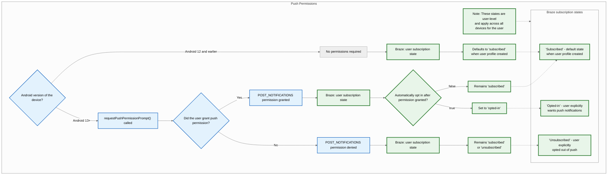
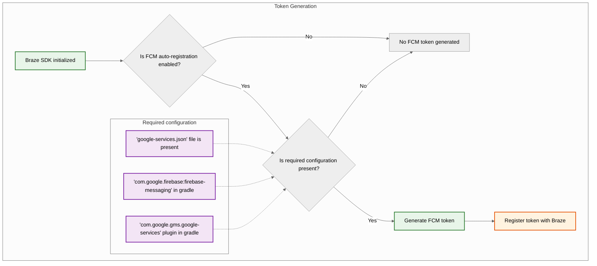
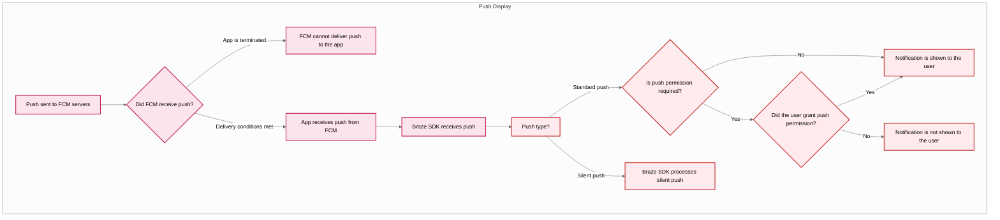



## Fonctionnalités intégrées

Les fonctionnalités suivantes sont intégrées au SDK Android de Braze. Pour utiliser d'autres fonctionnalités de notifications push, vous devrez [configurer les notifications push](#android_setting-up-push-notifications) pour votre application.

|Fonctionnalité|Description|
|-------|-----------|
|Contenu push|Le contenu push Android est intégré par défaut au SDK Android de Braze. Pour en savoir plus, consultez la section [Contenu push]({{site.baseurl}}/user_guide/message_building_by_channel/push/advanced_push_options/push_stories/).|
|Amorces de notifications push|Les campagnes d'amorces de notifications push encouragent vos utilisateurs à activer les notifications push sur leur appareil pour votre application. Ceci peut se faire sans personnalisation du SDK, grâce à notre [amorce de notifications push sans code]({{site.baseurl}}/user_guide/message_building_by_channel/push/best_practices/push_primer_messages/).|
{: .reset-td-br-1 .reset-td-br-2 role="presentation"}

## À propos du cycle de vie des notifications push {#push-notification-lifecycle}

Le diagramme suivant illustre la manière dont Braze gère le cycle de vie des notifications push, notamment les demandes d'autorisation, la génération de jetons et la distribution des messages.















## Configuration des notifications push


Pour découvrir un exemple d'application utilisant FCM avec le SDK Android de Braze, consultez [Braze : Exemple d'application Firebase Push](https://github.com/braze-inc/braze-android-sdk/tree/master/samples/firebase-push).


### Limites de débit

L'API Firebase Cloud Messaging (FCM) présente une limite de débit par défaut de 600 000 requêtes par minute. Si vous atteignez cette limite, Braze réessaiera automatiquement dans quelques minutes. Pour demander une augmentation, contactez l'[assistance Firebase](https://firebase.google.com/support).

### Étape 1 : Ajoutez Firebase à votre projet

Tout d'abord, ajoutez Firebase à votre projet Android. Pour obtenir des instructions pas à pas, consultez le [guide de configuration de Firebase](https://firebase.google.com/docs/android/setup) de Google.

### Étape 2 : Ajoutez Cloud Messaging à vos dépendances

Ensuite, ajoutez la bibliothèque Cloud Messaging aux dépendances de votre projet. Dans votre projet Android, ouvrez `build.gradle`, puis ajoutez la ligne suivante à votre bloc `dependencies`.

```gradle
implementation "google.firebase:firebase-messaging:+"
```

Vos dépendances devraient ressembler à ceci :

```gradle
dependencies {
  implementation project(':android-sdk-ui')
  implementation "com.google.firebase:firebase-messaging:+"
}
```

### Étape 3 : Activez l'API Firebase Cloud Messaging

Dans Google Cloud, sélectionnez le projet utilisé par votre application Android, puis activez l'[API Firebase Cloud Messaging](https://console.cloud.google.com/apis/library/fcm.googleapis.com).

{: style="max-width:80%;"}

### Étape 4 : Créez un compte de service {#service-account}

Ensuite, créez un nouveau compte de service afin que Braze puisse effectuer des appels API autorisés lors de l'enregistrement des jetons FCM. Dans Google Cloud, accédez à **Service Accounts**, puis choisissez votre projet. Sur la page **Service Accounts**, sélectionnez **Create Service Account**.


Saisissez un nom de compte de service, un ID et une description, puis sélectionnez **Create and continue**.


Dans le champ **Role**, recherchez et sélectionnez **Firebase Cloud Messaging API Admin** dans la liste des rôles. Pour un accès plus restrictif, créez un [rôle personnalisé](https://cloud.google.com/iam/docs/creating-custom-roles) avec l'autorisation `cloudmessaging.messages.create`, puis choisissez-le dans la liste. Lorsque vous avez terminé, sélectionnez **Done**.


Veillez à sélectionner **Firebase Cloud Messaging _API_ Admin**, et non **Firebase Cloud Messaging Admin**.



### Étape 5 : Générez des identifiants JSON {#json}

Ensuite, générez les identifiants JSON pour votre compte de service FCM. Dans Google Cloud IAM & Admin, accédez à **Service Accounts**, puis choisissez votre projet. Recherchez le compte de service FCM [que vous avez créé précédemment](#android_service-account), puis sélectionnez <i class="fa-solid fa-ellipsis-vertical"></i>&nbsp;**Actions** > **Manage Keys**.


Sélectionnez **Add Key** > **Create new key**.


Choisissez **JSON**, puis sélectionnez **Create**. Si vous avez créé votre compte de service en utilisant un ID de projet Google Cloud différent de votre ID de projet FCM, vous devrez mettre à jour manuellement la valeur attribuée à `project_id` dans votre fichier JSON.

N'oubliez pas l'emplacement de téléchargement de la clé&#8212;vous en aurez besoin à l'étape suivante.

{: style="max-width:65%;"}


Les clés privées peuvent présenter un risque de sécurité si elles sont compromises. Conservez vos identifiants JSON dans un emplacement sécurisé pour l'instant&#8212;vous supprimerez votre clé après l'avoir chargée sur Braze.


### Étape 6 : Chargez vos identifiants JSON sur Braze

Ensuite, chargez vos identifiants JSON dans votre tableau de bord de Braze. Dans Braze, sélectionnez <i class="fa-solid fa-gear"></i>&nbsp;**Paramètres** > **Paramètres de l'application**.


Sous les **paramètres de notifications push** de votre application Android, choisissez **Firebase**, puis sélectionnez **Upload JSON File** et chargez les identifiants [que vous avez générés précédemment](#android_json). Lorsque vous avez terminé, sélectionnez **Enregistrer**.



Les clés privées peuvent présenter un risque de sécurité si elles sont compromises. Maintenant que votre clé est chargée sur Braze, supprimez le fichier [que vous avez généré précédemment](#android_json).


### Étape 7 : Configurez l'enregistrement automatique des jetons

Lorsqu'un de vos utilisateurs opte pour les notifications push, votre application doit générer un jeton FCM sur son appareil avant de pouvoir lui envoyer des notifications push. Avec le SDK Braze, vous pouvez activer l'enregistrement automatique des jetons FCM pour l'appareil de chaque utilisateur dans les fichiers de configuration Braze de votre projet.

Tout d'abord, accédez à la console Firebase, ouvrez votre projet, puis sélectionnez <i class="fa-solid fa-gear"></i>&nbsp;**Settings** > **Project settings**.


Sélectionnez **Cloud Messaging**, puis sous **Firebase Cloud Messaging API (V1)**, copiez le numéro dans le champ **Sender ID**.


Ensuite, ouvrez votre projet Android Studio et utilisez votre Sender ID Firebase pour activer l'enregistrement automatique des jetons FCM dans votre `braze.xml` ou `BrazeConfig`.



Pour configurer l'enregistrement automatique des jetons FCM, ajoutez les lignes suivantes à votre fichier `braze.xml` :

```xml
<bool translatable="false" name="com_braze_firebase_cloud_messaging_registration_enabled">true</bool>
<string translatable="false" name="com_braze_firebase_cloud_messaging_sender_id">FIREBASE_SENDER_ID</string>
```

Remplacez `FIREBASE_SENDER_ID` par la valeur que vous avez copiée dans les paramètres de votre projet Firebase. Votre `braze.xml` devrait ressembler à ceci :

```xml
<?xml version="1.0" encoding="utf-8"?>
<resources>
  <string translatable="false" name="com_braze_api_key">12345ABC-6789-DEFG-0123-HIJK456789LM</string>
  <bool translatable="false" name="com_braze_firebase_cloud_messaging_registration_enabled">true</bool>
<string translatable="false" name="com_braze_firebase_cloud_messaging_sender_id">603679405392</string>
</resources>
```



Pour configurer l'enregistrement automatique des jetons FCM, ajoutez les lignes suivantes à votre `BrazeConfig` :



```java
.setIsFirebaseCloudMessagingRegistrationEnabled(true)
.setFirebaseCloudMessagingSenderIdKey("FIREBASE_SENDER_ID")
```


```kotlin
.setIsFirebaseCloudMessagingRegistrationEnabled(true)
.setFirebaseCloudMessagingSenderIdKey("FIREBASE_SENDER_ID")
```



Remplacez `FIREBASE_SENDER_ID` par la valeur que vous avez copiée dans les paramètres de votre projet Firebase. Votre `BrazeConfig` devrait ressembler à ceci :



```java
BrazeConfig brazeConfig = new BrazeConfig.Builder()
  .setApiKey("12345ABC-6789-DEFG-0123-HIJK456789LM")
  .setCustomEndpoint("sdk.iad-01.braze.com")
  .setSessionTimeout(60)
  .setHandlePushDeepLinksAutomatically(true)
  .setGreatNetworkDataFlushInterval(10)
  .setIsFirebaseCloudMessagingRegistrationEnabled(true)
  .setFirebaseCloudMessagingSenderIdKey("603679405392")
  .build();
Braze.configure(this, brazeConfig);
```


```kotlin
val brazeConfig = BrazeConfig.Builder()
  .setApiKey("12345ABC-6789-DEFG-0123-HIJK456789LM")
  .setCustomEndpoint("sdk.iad-01.braze.com")
  .setSessionTimeout(60)
  .setHandlePushDeepLinksAutomatically(true)
  .setGreatNetworkDataFlushInterval(10)
  .setIsFirebaseCloudMessagingRegistrationEnabled(true)
  .setFirebaseCloudMessagingSenderIdKey("603679405392")
  .build()
Braze.configure(this, brazeConfig)
```




Si vous souhaitez enregistrer manuellement des jetons FCM, vous pouvez appeler [`Braze.setRegisteredPushToken()`](https://braze-inc.github.io/braze-android-sdk/kdoc/braze-android-sdk/com.braze/-braze/registered-push-token.html) dans la méthode [`onCreate()`](https://developer.android.com/reference/android/app/Application.html#onCreate()) de votre application.




### Étape 8 : Supprimez les requêtes automatiques dans votre classe Application

Pour éviter que Braze ne déclenche des requêtes réseau inutiles à chaque envoi de notifications push silencieuses, supprimez toutes les requêtes réseau automatiques configurées dans la méthode `onCreate()` de votre classe `Application`. Pour plus d'informations, consultez la [référence pour les développeurs Android : Application](https://developer.android.com/reference/android/app/Application).

## Affichage des notifications

### Étape 1 : Enregistrez le service de messagerie Firebase de Braze

Vous pouvez créer un nouveau service de messagerie Firebase, utiliser un service existant ou un service non Braze. Choisissez l'option qui répond le mieux à vos besoins.



Braze inclut un service pour gérer la réception des notifications push et les intentions d'ouverture. Notre classe `BrazeFirebaseMessagingService` doit être enregistrée dans votre `AndroidManifest.xml` :

```xml
<service android:name="com.braze.push.BrazeFirebaseMessagingService"
  android:exported="false">
  <intent-filter>
    <action android:name="com.google.firebase.MESSAGING_EVENT" />
  </intent-filter>
</service>
```

Notre code de notification utilise également `BrazeFirebaseMessagingService` pour gérer le suivi des ouvertures et des clics. Ce service doit être enregistré dans le `AndroidManifest.xml` pour fonctionner correctement. N'oubliez pas que Braze préfixe les notifications provenant de notre système avec une clé unique afin de n'afficher que les notifications envoyées depuis nos systèmes. Vous pouvez enregistrer des services supplémentaires séparément pour afficher les notifications envoyées par d'autres services FCM. Consultez [`AndroidManifest.xml`](https://github.com/braze-inc/braze-android-sdk/blob/master/samples/firebase-push/src/main/AndroidManifest.xml) dans l'application exemple Firebase Push.


Avant la version 3.1.1 du SDK Braze, `AppboyFcmReceiver` était utilisé pour gérer les notifications push FCM. La classe `AppboyFcmReceiver` doit être retirée de votre manifeste et remplacée par l'intégration précédente.




Si vous avez déjà enregistré un service de messagerie Firebase, vous pouvez passer des objets [`RemoteMessage`](https://firebase.google.com/docs/reference/android/com/google/firebase/messaging/RemoteMessage) à Braze via [`BrazeFirebaseMessagingService.handleBrazeRemoteMessage()`](https://braze-inc.github.io/braze-android-sdk/kdoc/braze-android-sdk/com.braze.push/-braze-firebase-messaging-service/-companion/handle-braze-remote-message.html). Cette méthode n'affichera une notification que si l'objet [`RemoteMessage`](https://firebase.google.com/docs/reference/android/com/google/firebase/messaging/RemoteMessage) provient de Braze et l'ignorera en toute sécurité dans le cas contraire.




```java
public class MyFirebaseMessagingService extends FirebaseMessagingService {
  @Override
  public void onMessageReceived(RemoteMessage remoteMessage) {
    super.onMessageReceived(remoteMessage);
    if (BrazeFirebaseMessagingService.handleBrazeRemoteMessage(this, remoteMessage)) {
      // This Remote Message originated from Braze and a push notification was displayed.
      // No further action is needed.
    } else {
      // This Remote Message did not originate from Braze.
      // No action was taken and you can safely pass this Remote Message to other handlers.
    }
  }
}
```




```kotlin
class MyFirebaseMessagingService : FirebaseMessagingService() {
  override fun onMessageReceived(remoteMessage: RemoteMessage?) {
    super.onMessageReceived(remoteMessage)
    if (BrazeFirebaseMessagingService.handleBrazeRemoteMessage(this, remoteMessage)) {
      // This Remote Message originated from Braze and a push notification was displayed.
      // No further action is needed.
    } else {
      // This Remote Message did not originate from Braze.
      // No action was taken and you can safely pass this Remote Message to other handlers.
    }
  }
}
```






Si vous souhaitez également utiliser un autre service de messagerie Firebase, vous pouvez spécifier un service de messagerie Firebase de repli à appeler si votre application reçoit une notification push qui ne provient pas de Braze.

Dans votre `braze.xml`, précisez :

```xml
<bool name="com_braze_fallback_firebase_cloud_messaging_service_enabled">true</bool>
<string name="com_braze_fallback_firebase_cloud_messaging_service_classpath">com.company.OurFirebaseMessagingService</string>
```

ou via la [configuration d'exécution :]({{site.baseurl}}/developer_guide/sdk_initalization/?sdktab=android)




```java
BrazeConfig brazeConfig = new BrazeConfig.Builder()
        .setFallbackFirebaseMessagingServiceEnabled(true)
        .setFallbackFirebaseMessagingServiceClasspath("com.company.OurFirebaseMessagingService")
        .build();
Braze.configure(this, brazeConfig);
```




```kotlin
val brazeConfig = BrazeConfig.Builder()
        .setFallbackFirebaseMessagingServiceEnabled(true)
        .setFallbackFirebaseMessagingServiceClasspath("com.company.OurFirebaseMessagingService")
        .build()
Braze.configure(this, brazeConfig)
```






### Étape 2 : Conformez les petites icônes aux lignes directrices de conception

Pour des informations générales sur les icônes de notification Android, consultez l'[aperçu des notifications](https://developer.android.com/guide/topics/ui/notifiers/notifications).

À partir d'Android N, vous devez mettre à jour ou supprimer les ressources de petites icônes de notification qui contiennent des couleurs. Le système Android (et non le SDK Braze) ignore tous les canaux non alpha et de transparence dans les icônes d'action et les petites icônes de notification. Autrement dit, Android convertit toutes les parties de votre petite icône de notification en monochrome, à l'exception des zones transparentes.

Pour créer une ressource de petite icône de notification qui s'affiche correctement :
- Supprimez toutes les couleurs de l'image sauf le blanc.
- Toutes les autres zones non blanches de la ressource doivent être transparentes.


Un symptôme courant d'une ressource inappropriée est que la petite icône de notification s'affiche comme un carré monochrome plein. Cela est dû au fait que le système Android ne parvient pas à trouver de zone transparente dans la ressource de petite icône de notification.


Les grandes et petites icônes suivantes sont des exemples d'icônes correctement conçues :


### Étape 3 : Configurez les icônes de notification {#configure-icons}

#### Spécifier des icônes dans braze.xml

Braze vous permet de configurer vos icônes de notification en spécifiant des ressources drawable dans votre `braze.xml` :

```xml
<drawable name="com_braze_push_small_notification_icon">REPLACE_WITH_YOUR_ICON</drawable>
<drawable name="com_braze_push_large_notification_icon">REPLACE_WITH_YOUR_ICON</drawable>
```

La définition d'une petite icône de notification est requise. **Si vous n'en définissez pas, Braze utilisera par défaut l'icône de l'application comme petite icône de notification, ce qui peut ne pas être optimal.**

La définition d'une grande icône de notification est facultative, mais recommandée.

#### Spécifier la couleur d'accentuation de l'icône

La couleur d'accentuation de l'icône de notification peut être modifiée dans votre `braze.xml`. Si la couleur n'est pas spécifiée, la couleur par défaut est le même gris que celui utilisé par Lollipop pour les notifications système.

```xml
<integer name="com_braze_default_notification_accent_color">0xFFf33e3e</integer>
```

Vous pouvez également utiliser une référence de couleur :

```xml
<color name="com_braze_default_notification_accent_color">@color/my_color_here</color>
```

### Étape 4 : Ajoutez des liens profonds

#### Activer l'ouverture automatique des liens profonds

Pour permettre à Braze d'ouvrir automatiquement votre application et les liens profonds lorsqu'une notification push est cliquée, définissez `com_braze_handle_push_deep_links_automatically` sur `true` dans votre `braze.xml` :

```xml
<bool name="com_braze_handle_push_deep_links_automatically">true</bool>
```

Cet indicateur peut également être défini via la [configuration d'exécution]({{site.baseurl}}/developer_guide/sdk_initalization/?sdktab=android) :




```java
BrazeConfig brazeConfig = new BrazeConfig.Builder()
        .setHandlePushDeepLinksAutomatically(true)
        .build();
Braze.configure(this, brazeConfig);
```




```kotlin
val brazeConfig = BrazeConfig.Builder()
        .setHandlePushDeepLinksAutomatically(true)
        .build()
Braze.configure(this, brazeConfig)
```




Si vous souhaitez gérer les liens profonds de manière personnalisée, vous devrez créer un rappel push qui écoute les intentions de réception et d'ouverture de push de Braze. Pour plus d'informations, consultez la section [Utilisation d'un rappel pour les événements push]({{site.baseurl}}/developer_guide/push_notifications/customization#android_using-a-callback-for-push-events).

## Gestion des notifications au premier plan

Par défaut, lorsqu'une notification push arrive alors que votre application est au premier plan sur Android, le système l'affiche automatiquement. Pour que Braze traite la charge utile de la notification push (suivi analytique, gestion des liens profonds et traitement personnalisé), acheminez les données push entrantes vers Braze dans votre méthode `FirebaseMessagingService.onMessageReceived`.

### Fonctionnement

Lorsque vous appelez `BrazeFirebaseMessagingService.handleBrazeRemoteMessage`, Braze détermine si la charge utile est une notification push Braze et, le cas échéant, crée et affiche la notification via la méthode `NotificationManagerCompat`. Contrairement à iOS, Android affiche les notifications que l'application soit au premier plan ou en arrière-plan.



```java
package com.example.push;

import com.braze.push.BrazeFirebaseMessagingService;
import com.google.firebase.messaging.FirebaseMessagingService;
import com.google.firebase.messaging.RemoteMessage;

public class MyFirebaseMessagingService extends FirebaseMessagingService {
    @Override
    public void onMessageReceived(RemoteMessage remoteMessage) {
        super.onMessageReceived(remoteMessage);
        
        // Let Braze process the payload and display the notification
        if (BrazeFirebaseMessagingService.handleBrazeRemoteMessage(this, remoteMessage)) {
            // Braze successfully handled the push notification
        } else {
            // Handle non-Braze messages
        }
    }
}
```



```kotlin
package com.example.push

import com.braze.push.BrazeFirebaseMessagingService
import com.google.firebase.messaging.FirebaseMessagingService
import com.google.firebase.messaging.RemoteMessage

class MyFirebaseMessagingService : FirebaseMessagingService() {
    override fun onMessageReceived(remoteMessage: RemoteMessage) {
        super.onMessageReceived(remoteMessage)
        
        // Let Braze process the payload and display the notification
        if (BrazeFirebaseMessagingService.handleBrazeRemoteMessage(this, remoteMessage)) {
            // Braze successfully handled the push notification
        } else {
            // Handle non-Braze messages
        }
    }
}
```



Pour plus d'informations, consultez l'[exemple d'intégration Firebase](https://github.com/braze-inc/braze-android-sdk/blob/master/samples/firebase-push/src/main/java/com/braze/firebasepush/FirebaseMessagingService.kt) dans le dépôt du SDK Android de Braze.

### Personnalisation du comportement au premier plan

Si vous souhaitez personnaliser le comportement au premier plan, par exemple supprimer la notification système ou afficher une interface in-app à la place, vous pouvez :

- Utiliser `subscribeToPushNotificationEvents` pour réagir aux événements push et gérer les liens profonds avec la méthode `BrazeNotificationUtils.routeUserWithNotificationOpenedIntent`. Pour plus d'informations, consultez l'[exemple Firebase Push](https://github.com/braze-inc/braze-android-sdk/blob/master/samples/firebase-push/src/main/java/com/braze/firebasepush/FirebaseApplication.kt).
- Créer et publier votre propre notification à l'aide d'un `IBrazeNotificationFactory` personnalisé, ou supprimer la notification en n'appelant pas `notificationManager.notify` dans votre chemin de traitement.

Pour plus d'informations sur la personnalisation des notifications, consultez la section [Usine de notifications personnalisées]({{site.baseurl}}/developer_guide/push_notifications/customization/?sdktab=android#custom-notification-factory).

#### Création de liens profonds personnalisés

Suivez les instructions de la [documentation pour développeurs Android](http://developer.android.com/training/app-indexing/deep-linking.html) sur la création de liens profonds si vous n'en avez pas encore ajouté à votre application. Pour en savoir plus sur les liens profonds, consultez notre [article de FAQ]({{site.baseurl}}/user_guide/personalization_and_dynamic_content/deep_linking_to_in-app_content/#what-is-deep-linking).

#### Ajouter des liens profonds

Le tableau de bord de Braze permet de définir des liens profonds ou des URL Web dans les campagnes de notifications push et les Canvas, qui seront ouverts lorsque la notification est cliquée.


#### Personnaliser le comportement de la pile arrière

Par défaut, le SDK Android place l'activité du lanceur principal de votre application hôte dans la pile arrière lorsqu'il suit des liens profonds de notification push. Braze vous permet de définir une activité personnalisée à ouvrir dans la pile arrière à la place de votre activité de lanceur principal, ou de désactiver complètement la pile arrière.

Par exemple, pour définir une activité appelée `YourMainActivity` comme activité de la pile arrière via la [configuration d'exécution]({{site.baseurl}}/developer_guide/sdk_initalization/?sdktab=android) :




```java
BrazeConfig brazeConfig = new BrazeConfig.Builder()
        .setPushDeepLinkBackStackActivityEnabled(true)
        .setPushDeepLinkBackStackActivityClass(YourMainActivity.class)
        .build();
Braze.configure(this, brazeConfig);
```




```kotlin
val brazeConfig = BrazeConfig.Builder()
        .setPushDeepLinkBackStackActivityEnabled(true)
        .setPushDeepLinkBackStackActivityClass(YourMainActivity.class)
        .build()
Braze.configure(this, brazeConfig)
```




Consultez la configuration équivalente pour votre `braze.xml`. Notez que le nom de la classe doit être identique à celui renvoyé par `Class.forName()`.

```xml
<bool name="com_braze_push_deep_link_back_stack_activity_enabled">true</bool>
<string name="com_braze_push_deep_link_back_stack_activity_class_name">your.package.name.YourMainActivity</string>
```

### Étape 5 : Définissez les canaux de notification

Le SDK Android de Braze prend en charge les [canaux de notification Android](https://developer.android.com/preview/features/notification-channels.html). Si une notification Braze ne contient pas d'ID de canal de notification ou contient un ID de canal non valide, Braze affichera la notification avec le canal de notification par défaut défini dans le SDK. Les utilisateurs de la plateforme peuvent utiliser les [canaux de notification Android]({{site.baseurl}}/user_guide/message_building_by_channel/push/android/notification_channels/) pour regrouper les notifications.

Pour définir le nom du canal de notification par défaut de Braze visible par l'utilisateur, utilisez [`BrazeConfig.setDefaultNotificationChannelName()`](https://braze-inc.github.io/braze-android-sdk/kdoc/braze-android-sdk/com.braze.configuration/-braze-config/-builder/set-default-notification-channel-name.html).

Pour définir la description du canal de notification par défaut de Braze visible par l'utilisateur, utilisez [`BrazeConfig.setDefaultNotificationChannelDescription()`](https://braze-inc.github.io/braze-android-sdk/kdoc/braze-android-sdk/com.braze.configuration/-braze-config/-builder/set-default-notification-channel-description.html).

Mettez à jour toutes les campagnes API avec le paramètre [Android push object]({{site.baseurl}}/api/objects_filters/messaging/android_object/) pour inclure le champ `notification_channel`. Si ce champ n'est pas spécifié, Braze enverra la charge utile de notification avec l'ID du [canal de repli du tableau de bord]({{site.baseurl}}/user_guide/message_building_by_channel/push/android/notification_channels/#dashboard-fallback-channel).

En dehors du canal de notification par défaut, Braze ne crée aucun canal. Tous les autres canaux doivent être définis par programmation par l'application hôte, puis saisis dans le tableau de bord de Braze.

Le nom et la description par défaut du canal peuvent également être configurés dans `braze.xml`.

```xml
<string name="com_braze_default_notification_channel_name">Your channel name</string>
<string name="com_braze_default_notification_channel_description">Your channel description</string>
```

### Étape 6 : Testez l'affichage et l'analytique des notifications

#### Tester l'affichage

À ce stade, vous devriez pouvoir voir les notifications envoyées par Braze. Pour tester cela, rendez-vous sur la page **Campagnes** de votre tableau de bord de Braze et créez une campagne de **notification push**. Choisissez **Android Push** et concevez votre message. Cliquez ensuite sur l'icône en forme d'œil dans le composeur pour accéder à l'expéditeur de test. Saisissez l'ID utilisateur ou l'adresse e-mail de votre utilisateur actuel et cliquez sur **Envoyer le test**. La notification push devrait s'afficher sur votre appareil.


Pour les problèmes liés à l'affichage des notifications push, consultez notre [guide de résolution des problèmes]({{site.baseurl}}/developer_guide/push_notifications/troubleshooting/?sdktab=android).

#### Tester l'analytique

À ce stade, vous devriez également disposer de l'enregistrement analytique pour les ouvertures de notifications push. Cliquer sur la notification lorsqu'elle arrive devrait faire augmenter de 1 le compteur d'**ouvertures directes** sur la page des résultats de votre campagne. Consultez notre article sur les [rapports push]({{site.baseurl}}/user_guide/message_building_by_channel/push/push_reporting/) pour en savoir plus sur l'analytique push.

Pour les problèmes liés à l'analytique push, consultez notre [guide de résolution des problèmes]({{site.baseurl}}/developer_guide/push_notifications/troubleshooting/?sdktab=android).

#### Tester depuis la ligne de commande

Si vous souhaitez tester les notifications in-app et push via l'interface de ligne de commande, vous pouvez envoyer une seule notification via le terminal avec cURL et l'[API d'envoi de messages]({{site.baseurl}}/api/endpoints/messaging/). Vous devrez remplacer les champs suivants par les valeurs correctes pour votre cas de test :

- `YOUR_API_KEY` (Accédez à **Paramètres** > **Clés API**.)
- `YOUR_EXTERNAL_USER_ID` (Recherchez un profil sur la page **Recherche d'utilisateurs**.)
- `YOUR_KEY1` (facultatif)
- `YOUR_VALUE1` (facultatif)

```bash
curl -X POST -H "Content-Type: application/json" -H "Authorization: Bearer {YOUR_API_KEY}" -d '{
  "external_user_ids":["YOUR_EXTERNAL_USER_ID"],
  "messages": {
    "android_push": {
      "title":"Test push title",
      "alert":"Test push",
      "extra": {
        "YOUR_KEY1":"YOUR_VALUE1"
      }
    }  
  }
}' https://rest.iad-01.braze.com/messages/send
```

Cet exemple utilise l'instance `US-01`. Si vous n'êtes pas sur cette instance, remplacez l'endpoint `US-01` par [votre endpoint]({{site.baseurl}}/api/basics/#endpoints).

## Notifications push de conversation

{: style="float:right;max-width:35%;margin-left:15px;border: 0;"}

L'[initiative People and Conversations](https://developer.android.com/guide/topics/ui/conversations) est une initiative Android pluriannuelle qui vise à mettre en avant les personnes et les conversations dans les surfaces système du téléphone. Cette priorité repose sur le fait que la communication et l'interaction avec d'autres personnes restent la zone fonctionnelle la plus valorisée et la plus importante pour la majorité des utilisateurs Android, toutes tranches démographiques confondues.

### Exigences d'utilisation

- Ce type de notification nécessite le SDK Braze pour Android v15.0.0+ et des appareils Android 11+.
- Les appareils ou SDK non pris en charge basculeront sur une notification push standard.

Cette fonctionnalité est uniquement disponible via l'API REST de Braze. Consultez l'[objet push Android]({{site.baseurl}}/api/objects_filters/messaging/android_object#android-conversation-push-object) pour plus d'informations.

## Erreurs de dépassement du quota FCM

Lorsque votre limite pour Firebase Cloud Messaging (FCM) est dépassée, Google renvoie des erreurs « quota exceeded ». La limite par défaut pour FCM est de 600 000 requêtes par minute. Braze effectue de nouvelles tentatives d'envoi conformément aux bonnes pratiques recommandées par Google. Cependant, un volume important de ces erreurs peut prolonger le temps d'envoi de plusieurs minutes. Afin d'atténuer tout impact potentiel, Braze vous enverra une alerte vous informant que la limite de débit est dépassée et vous indiquera les mesures à prendre pour éviter ces erreurs.

Pour vérifier votre limite actuelle, rendez-vous dans votre **Google Cloud Console** > **APIs & Services** > **Firebase Cloud Messaging API** > **Quotas & System Limits**, ou consultez la [page Quotas de l'API FCM](https://console.cloud.google.com/apis/api/fcm.googleapis.com/quotas).

### Bonnes pratiques

Nous recommandons les bonnes pratiques suivantes pour maintenir ces volumes d'erreurs à un niveau bas.

#### Demander une augmentation de la limite de débit auprès de FCM

Pour demander une augmentation de la limite de débit auprès de FCM, vous pouvez contacter directement l'[assistance Firebase](https://firebase.google.com/support) ou suivre les étapes suivantes :

1. Rendez-vous sur la [page Quotas de l'API FCM](https://console.cloud.google.com/apis/api/fcm.googleapis.com/quotas).
2. Identifiez le quota **Send requests per minute**.
3. Sélectionnez **Edit Quota**.
4. Saisissez une nouvelle valeur et soumettez votre demande.

#### Appliquer une limite de débit au niveau de l'espace de travail

Vous pouvez appliquer une limite de débit au niveau de l'espace de travail pour les notifications push Android. Cela permet de réguler le rythme de distribution de vos messages sortants. Pour plus de détails, consultez [Limites de débit d'envoi de messages de l'espace de travail]({{site.baseurl}}/user_guide/administrative/app_settings/messaging_rate_limits).