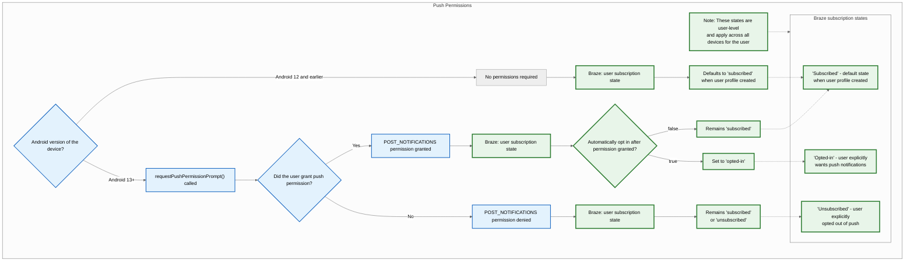
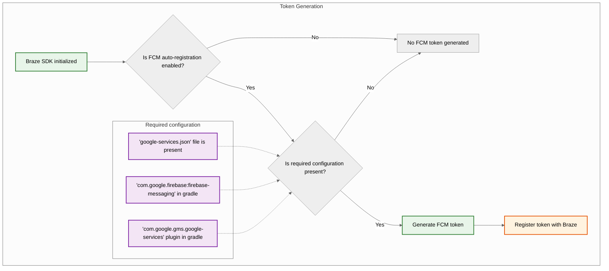
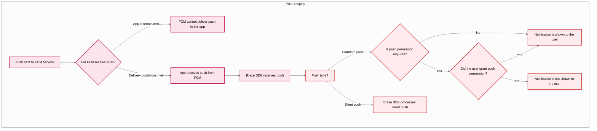



## Fonctionnalités intégrées {#built-in-features}

Les fonctionnalités suivantes sont intégrées au SDK Android de Braze. Pour utiliser d'autres fonctionnalités de notification push, vous devrez [configurer les notifications push](#android_setting-up-push-notifications) pour votre application.

|Fonctionnalité|Description|
|-------|-----------|
|Push Stories|Les Push Stories Android sont intégrées par défaut dans le SDK Android de Braze. Pour en savoir plus, consultez [Push Stories]({{site.baseurl}}/user_guide/message_building_by_channel/push/advanced_push_options/push_stories).|
|Amorces de notification push|Les Campaigns d'amorce de notification push encouragent vos utilisateurs à activer les notifications push sur leur appareil pour votre application. Cela peut être fait sans personnalisation du SDK en utilisant notre [amorce de notification push sans code]({{site.baseurl}}/user_guide/message_building_by_channel/push/best_practices/push_primer_messages).|
{: .reset-td-br-1 .reset-td-br-2 aria-label="Fonctionnalités intégrées" }

## À propos du cycle de vie des notifications push {#push-notification-lifecycle}

Le diagramme suivant illustre la manière dont Braze gère le cycle de vie des notifications push, notamment les demandes d'autorisation, la génération de jetons et la distribution des messages.















## Configuration des notifications push {#setting-up-push-notifications}


Pour consulter un exemple d'application utilisant FCM avec le SDK Android de Braze, voir [Braze : exemple d'application Firebase Push](https://github.com/braze-inc/braze-android-sdk/tree/master/samples/firebase-push).


### Limites de débit {#rate-limits}

L'API Firebase Cloud Messaging (FCM) a une limite de débit par défaut de 600 000 requêtes par minute. Si vous atteignez cette limite, Braze réessaiera automatiquement dans quelques minutes. Pour demander une augmentation, contactez le [support Firebase](https://firebase.google.com/support).

### Étape 1 : Ajouter Firebase à votre projet {#step-1-add-firebase-to-your-project}

Commencez par ajouter Firebase à votre projet Android. Pour des instructions détaillées, consultez le [guide de configuration Firebase](https://firebase.google.com/docs/android/setup) de Google.

### Étape 2 : Ajouter Cloud Messaging à vos dépendances {#step-2-add-cloud-messaging-to-your-dependencies}

Ensuite, ajoutez la bibliothèque Cloud Messaging aux dépendances de votre projet. Dans votre projet Android, ouvrez `build.gradle`, puis ajoutez la ligne suivante à votre bloc `dependencies`.

```gradle
implementation "google.firebase:firebase-messaging:+"
```

Vos dépendances devraient ressembler à ceci :

```gradle
dependencies {
  implementation project(':android-sdk-ui')
  implementation "com.google.firebase:firebase-messaging:+"
}
```

### Étape 3 : Activer l'API Firebase Cloud Messaging {#step-3-enable-the-firebase-cloud-messaging-api}

Dans Google Cloud, sélectionnez le projet utilisé par votre application Android, puis activez l'[API Firebase Cloud Messaging](https://console.cloud.google.com/apis/library/fcm.googleapis.com).

{: style="max-width:80%;"}

### Étape 4 : Créer un compte de service {#service-account}

Ensuite, créez un nouveau compte de service afin que Braze puisse effectuer des appels API autorisés lors de l'enregistrement des jetons FCM. Dans Google Cloud, accédez à **Service Accounts**, puis choisissez votre projet. Sur la page **Service Accounts**, sélectionnez **Create Service Account**.


Saisissez un nom, un ID et une description pour le compte de service, puis sélectionnez **Create and continue**.

Dans le champ **Role**, recherchez et sélectionnez **Firebase Cloud Messaging API Admin** dans la liste des rôles. Pour un accès plus restrictif, créez un [rôle personnalisé](https://cloud.google.com/iam/docs/creating-custom-roles) avec la permission `cloudmessaging.messages.create`, puis choisissez-le dans la liste à la place. Lorsque vous avez terminé, sélectionnez **Done**.


Veillez à sélectionner **Firebase Cloud Messaging _API_ Admin**, et non **Firebase Cloud Messaging Admin**.



### Étape 5 : Générer des identifiants JSON {#json}

Ensuite, générez des identifiants JSON pour votre compte de service FCM. Dans Google Cloud IAM & Admin, accédez à **Service Accounts**, puis choisissez votre projet. Localisez le compte de service FCM [que vous avez créé précédemment](#android_service-account), puis sélectionnez <i class="fa-solid fa-ellipsis-vertical" aria-label="Ouvrir le menu d'actions"></i>&nbsp;**Actions** > **Manage Keys**.


Sélectionnez **Add Key** > **Create new key**.


Choisissez **JSON**, puis sélectionnez **Create**. Si vous avez créé votre compte de service en utilisant un ID de projet Google Cloud différent de votre ID de projet FCM, vous devrez mettre à jour manuellement la valeur attribuée à `project_id` dans votre fichier JSON.

N'oubliez pas l'emplacement où vous avez téléchargé la clé&#8212;vous en aurez besoin à l'étape suivante.

{: style="max-width:65%;"}


Les clés privées peuvent présenter un risque de sécurité en cas de compromission. Conservez vos identifiants JSON dans un emplacement sécurisé pour le moment&#8212;vous supprimerez votre clé après l'avoir importée dans Braze.


### Étape 6 : Importer vos identifiants JSON dans Braze {#step-6-upload-your-json-credentials-to-braze}

Ensuite, importez vos identifiants JSON dans votre tableau de bord de Braze. Dans Braze, sélectionnez <i class="fa-solid fa-gear" aria-label="Paramètres"></i>&nbsp;**Settings** > **App Settings**.


Sous les **Push Notification Settings** de votre application Android, choisissez **Firebase**, puis sélectionnez **Upload JSON File** et importez les identifiants [que vous avez générés précédemment](#android_json). Lorsque vous avez terminé, sélectionnez **Save**.



Les clés privées peuvent présenter un risque de sécurité en cas de compromission. Maintenant que votre clé est importée dans Braze, supprimez le fichier [que vous avez généré précédemment](#android_json).


### Étape 7 : Configurer l'enregistrement automatique des jetons {#step-7-set-up-automatic-token-registration}

Lorsqu'un de vos utilisateurs accepte les notifications push, votre application doit générer un jeton FCM sur son appareil avant que vous puissiez lui envoyer des notifications push. Avec le SDK de Braze, vous pouvez activer l'enregistrement automatique des jetons FCM pour l'appareil de chaque utilisateur dans les fichiers de configuration Braze de votre projet.

Tout d'abord, accédez à la console Firebase, ouvrez votre projet, puis sélectionnez <i class="fa-solid fa-gear" aria-label="Paramètres"></i>&nbsp;**Settings** > **Project settings**.


Sélectionnez **Cloud Messaging**, puis sous **Firebase Cloud Messaging API (V1)**, copiez le numéro dans le champ **Sender ID**.


Ensuite, ouvrez votre projet Android Studio et utilisez votre Firebase Sender ID pour activer l'enregistrement automatique des jetons FCM dans votre `braze.xml` ou `BrazeConfig`.



Pour configurer l'enregistrement automatique des jetons FCM, ajoutez les lignes suivantes à votre fichier `braze.xml` :

```xml
<bool translatable="false" name="com_braze_firebase_cloud_messaging_registration_enabled">true</bool>
<string translatable="false" name="com_braze_firebase_cloud_messaging_sender_id">FIREBASE_SENDER_ID</string>
```

Remplacez `FIREBASE_SENDER_ID` par la valeur que vous avez copiée depuis les paramètres de votre projet Firebase. Votre `braze.xml` devrait ressembler à ceci :

```xml
<?xml version="1.0" encoding="utf-8"?>
<resources>
  <string translatable="false" name="com_braze_api_key">12345ABC-6789-DEFG-0123-HIJK456789LM</string>
  <bool translatable="false" name="com_braze_firebase_cloud_messaging_registration_enabled">true</bool>
<string translatable="false" name="com_braze_firebase_cloud_messaging_sender_id">603679405392</string>
</resources>
```



Pour configurer l'enregistrement automatique des jetons FCM, ajoutez les lignes suivantes à votre `BrazeConfig` :



```java
.setIsFirebaseCloudMessagingRegistrationEnabled(true)
.setFirebaseCloudMessagingSenderIdKey("FIREBASE_SENDER_ID")
```


```kotlin
.setIsFirebaseCloudMessagingRegistrationEnabled(true)
.setFirebaseCloudMessagingSenderIdKey("FIREBASE_SENDER_ID")
```



Remplacez `FIREBASE_SENDER_ID` par la valeur que vous avez copiée depuis les paramètres de votre projet Firebase. Votre `BrazeConfig` devrait ressembler à ceci :



```java
BrazeConfig brazeConfig = new BrazeConfig.Builder()
  .setApiKey("12345ABC-6789-DEFG-0123-HIJK456789LM")
  .setCustomEndpoint("sdk.iad-01.braze.com")
  .setSessionTimeout(60)
  .setHandlePushDeepLinksAutomatically(true)
  .setGreatNetworkDataFlushInterval(10)
  .setIsFirebaseCloudMessagingRegistrationEnabled(true)
  .setFirebaseCloudMessagingSenderIdKey("603679405392")
  .build();
Braze.configure(this, brazeConfig);
```


```kotlin
val brazeConfig = BrazeConfig.Builder()
  .setApiKey("12345ABC-6789-DEFG-0123-HIJK456789LM")
  .setCustomEndpoint("sdk.iad-01.braze.com")
  .setSessionTimeout(60)
  .setHandlePushDeepLinksAutomatically(true)
  .setGreatNetworkDataFlushInterval(10)
  .setIsFirebaseCloudMessagingRegistrationEnabled(true)
  .setFirebaseCloudMessagingSenderIdKey("603679405392")
  .build()
Braze.configure(this, brazeConfig)
```







Si vous préférez enregistrer manuellement les jetons FCM, définissez la propriété [`registeredPushToken`](https://braze-inc.github.io/braze-android-sdk/kdoc/braze-android-sdk/com.braze/-i-braze/registered-push-token.html) sur l'instance Braze dans la méthode [`onCreate()`](https://developer.android.com/reference/android/app/Application.html#onCreate()) de votre application.

```kotlin
// Kotlin
Braze.getInstance(context).registeredPushToken = "FCM_TOKEN"
```

```java
// Java
Braze.getInstance(context).setRegisteredPushToken("FCM_TOKEN");
```


#### Utiliser plusieurs projets Firebase {#multiple-firebase-projects}

Si votre application utilise plusieurs projets Firebase, suivez ces étapes :

1. Conservez les notifications push de Braze sur le projet Firebase par défaut initialisé à partir du fichier `google-services.json` de votre application.
2. Si vous utilisez un service de messagerie Firebase personnalisé, complétez [Enregistrer les ID d'installation dans les services de messagerie Firebase personnalisés](#android_register-installation-id-custom-firebase-service).
3. Si votre application obtient un jeton push d'une autre manière, définissez manuellement `registeredPushToken` comme indiqué dans l'astuce précédente.


Firebase Cloud Messaging ne dispose pas d'API prise en charge pour récupérer un jeton à partir d'un `FirebaseApp` que vous initialisez manuellement. Les rappels de `FirebaseMessagingService` tels que `onNewToken` et `onRegistered` ne se déclenchent que pour le projet par défaut. Pour plus d'informations, consultez [Configurer plusieurs projets](https://firebase.google.com/docs/projects/multiprojects) dans la documentation Firebase.


Pour les détails de version, consultez les [journaux des modifications du SDK]({{site.baseurl}}/developer_guide/changelogs?sdktab=android).

### Étape 8 : Supprimer les requêtes automatiques dans votre classe Application {#step-8-remove-automatic-requests-in-your-application-class}

Pour empêcher Braze de déclencher des requêtes réseau inutiles chaque fois que vous envoyez des notifications push silencieuses, supprimez toutes les requêtes réseau automatiques configurées dans la méthode `onCreate()` de votre classe `Application`. Pour plus d'informations, consultez la [référence Android Developer : Application](https://developer.android.com/reference/android/app/Application).

## Affichage des notifications {#displaying-notifications}

<a id="android_step-1-register-braze-firebase-messaging-service"></a>

### Étape 1 : Enregistrer le service de messagerie Firebase de Braze {#register-braze-firebase-messaging-service}

Vous pouvez créer un nouveau service de messagerie Firebase, utiliser un service existant ou un service non-Braze. Choisissez l'option qui correspond le mieux à vos besoins spécifiques.



Braze inclut un service pour gérer la réception des notifications push et les intentions d'ouverture. Notre classe `BrazeFirebaseMessagingService` doit être enregistrée dans votre `AndroidManifest.xml` :

```xml
<service android:name="com.braze.push.BrazeFirebaseMessagingService"
  android:exported="false">
  <intent-filter>
    <action android:name="com.google.firebase.MESSAGING_EVENT" />
  </intent-filter>
</service>
```

Notre code de notification utilise également `BrazeFirebaseMessagingService` pour gérer le suivi des ouvertures et des clics. Ce service doit être enregistré dans le fichier `AndroidManifest.xml` pour fonctionner correctement. N'oubliez pas que Braze préfixe les notifications de notre système avec une clé unique afin de n'afficher que les notifications envoyées depuis nos systèmes. Vous pouvez enregistrer des services supplémentaires séparément pour afficher les notifications envoyées par d'autres services FCM. Consultez [`AndroidManifest.xml`](https://github.com/braze-inc/braze-android-sdk/blob/master/samples/firebase-push/src/main/AndroidManifest.xml) dans l'application exemple Firebase push.


Avant la version 3.1.1 du SDK de Braze, `AppboyFcmReceiver` était utilisé pour gérer les notifications push FCM. La classe `AppboyFcmReceiver` doit être supprimée de votre manifeste et remplacée par l'intégration précédente.




Si vous avez déjà un service de messagerie Firebase enregistré, vous pouvez transmettre les objets [`RemoteMessage`](https://firebase.google.com/docs/reference/android/com/google/firebase/messaging/RemoteMessage) à Braze via [`BrazeFirebaseMessagingService.handleBrazeRemoteMessage()`](https://braze-inc.github.io/braze-android-sdk/kdoc/braze-android-sdk/com.braze.push/-braze-firebase-messaging-service/-companion/handle-braze-remote-message.html). Cette méthode n'affichera une notification que si l'objet [`RemoteMessage`](https://firebase.google.com/docs/reference/android/com/google/firebase/messaging/RemoteMessage) provient de Braze et l'ignorera en toute sécurité dans le cas contraire.

<a id="android_register-installation-id-custom-firebase-service"></a>

#### Enregistrer les ID d'installation dans les services de messagerie Firebase personnalisés {#register-installation-id-custom-firebase-service}

Si vous utilisez `firebase-messaging` v25.1.0 ou une version ultérieure, l'enregistrement Firebase utilise l'ID d'installation Firebase. Dans votre service de messagerie Firebase personnalisé, remplacez `onRegistered` et définissez `registeredPushToken`.




```java
public class MyFirebaseMessagingService extends FirebaseMessagingService {
  @Override
  public void onRegistered(String installationId) {
    super.onRegistered(installationId);
    Braze.getInstance(this).setRegisteredPushToken(installationId);
  }

  @Override
  public void onMessageReceived(RemoteMessage remoteMessage) {
    super.onMessageReceived(remoteMessage);
    if (BrazeFirebaseMessagingService.handleBrazeRemoteMessage(this, remoteMessage)) {
      // This Remote Message originated from Braze and a push notification was displayed.
      // No further action is needed.
    } else {
      // This Remote Message did not originate from Braze.
      // No action was taken and you can safely pass this Remote Message to other handlers.
    }
  }
}
```




```kotlin
class MyFirebaseMessagingService : FirebaseMessagingService() {
  override fun onRegistered(installationId: String) {
    super.onRegistered(installationId)
    Braze.getInstance(this).registeredPushToken = installationId
  }

  override fun onMessageReceived(remoteMessage: RemoteMessage?) {
    super.onMessageReceived(remoteMessage)
    if (BrazeFirebaseMessagingService.handleBrazeRemoteMessage(this, remoteMessage)) {
      // This Remote Message originated from Braze and a push notification was displayed.
      // No further action is needed.
    } else {
      // This Remote Message did not originate from Braze.
      // No action was taken and you can safely pass this Remote Message to other handlers.
    }
  }
}
```






Si vous disposez d'un autre service de messagerie Firebase que vous souhaitez également utiliser, vous pouvez spécifier un service de messagerie Firebase de secours à appeler si votre application reçoit une notification push qui ne provient pas de Braze.

Dans votre fichier `braze.xml`, spécifiez :

```xml
<bool name="com_braze_fallback_firebase_cloud_messaging_service_enabled">true</bool>
<string name="com_braze_fallback_firebase_cloud_messaging_service_classpath">com.company.OurFirebaseMessagingService</string>
```

ou définissez-le via la [configuration à l'exécution :]({{site.baseurl}}/developer_guide/sdk_integration/?sdktab=android#runtime-configuration)




```java
BrazeConfig brazeConfig = new BrazeConfig.Builder()
        .setFallbackFirebaseMessagingServiceEnabled(true)
        .setFallbackFirebaseMessagingServiceClasspath("com.company.OurFirebaseMessagingService")
        .build();
Braze.configure(this, brazeConfig);
```




```kotlin
val brazeConfig = BrazeConfig.Builder()
        .setFallbackFirebaseMessagingServiceEnabled(true)
        .setFallbackFirebaseMessagingServiceClasspath("com.company.OurFirebaseMessagingService")
        .build()
Braze.configure(this, brazeConfig)
```






### Étape 2 : Conformer les petites icônes aux directives de conception {#step-2-conform-small-icons-to-design-guidelines}

Pour des informations générales sur les icônes de notification Android, consultez l'[aperçu des notifications](https://developer.android.com/guide/topics/ui/notifiers/notifications).

À partir d'Android N, vous devez mettre à jour ou supprimer les ressources de petites icônes de notification qui comportent des couleurs. Le système Android (et non le SDK de Braze) ignore tous les canaux non-alpha et de transparence dans les icônes d'action et la petite icône de notification. En d'autres termes, Android convertira toutes les parties de votre petite icône de notification en monochrome, à l'exception des régions transparentes.

Pour créer une ressource de petite icône de notification qui s'affiche correctement :
- Supprimez toutes les couleurs de l'image, à l'exception du blanc.
- Toutes les autres régions non blanches de la ressource doivent être transparentes.


Un symptôme courant d'une ressource incorrecte est que la petite icône de notification s'affiche sous la forme d'un carré monochrome plein. Cela est dû au fait que le système Android ne parvient pas à trouver de régions transparentes dans la ressource de la petite icône de notification.


Les grandes et petites icônes illustrées ci-dessous sont des exemples d'icônes correctement conçues :


### Étape 3 : Configurer les icônes de notification {#configure-icons}

#### Spécifier les icônes dans braze.xml {#specifying-icons-in-brazexml}

Braze vous permet de configurer vos icônes de notification en spécifiant des ressources drawable dans votre fichier `braze.xml` :

```xml
<drawable name="com_braze_push_small_notification_icon">REPLACE_WITH_YOUR_ICON</drawable>
<drawable name="com_braze_push_large_notification_icon">REPLACE_WITH_YOUR_ICON</drawable>
```

La définition d'une petite icône de notification est obligatoire. **Si vous n'en définissez pas, Braze utilisera par défaut l'icône de l'application comme petite icône de notification, ce qui peut ne pas être optimal.**

La définition d'une grande icône de notification est facultative mais recommandée.

#### Spécifier la couleur d'accentuation de l'icône {#specifying-icon-accent-color}

La couleur d'accentuation de l'icône de notification peut être remplacée dans votre fichier `braze.xml`. Si la couleur n'est pas spécifiée, la couleur par défaut est le même gris que Lollipop utilise pour les notifications système.

```xml
<integer name="com_braze_default_notification_accent_color">0xFFf33e3e</integer>
```

Vous pouvez également utiliser une référence de couleur :

```xml
<color name="com_braze_default_notification_accent_color">@color/my_color_here</color>
```

### Étape 4 : Ajouter des deep links {#step-4-add-deep-links}

#### Activer l'ouverture automatique des deep links {#enabling-automatic-deep-link-opening}

Pour permettre à Braze d'ouvrir automatiquement votre application et tous les deep links lorsqu'une notification push est cliquée, définissez `com_braze_handle_push_deep_links_automatically` sur `true` dans votre fichier `braze.xml` :

```xml
<bool name="com_braze_handle_push_deep_links_automatically">true</bool>
```

Ce paramètre peut également être défini via la [configuration à l'exécution]({{site.baseurl}}/developer_guide/sdk_integration/?sdktab=android#runtime-configuration) :




```java
BrazeConfig brazeConfig = new BrazeConfig.Builder()
        .setHandlePushDeepLinksAutomatically(true)
        .build();
Braze.configure(this, brazeConfig);
```




```kotlin
val brazeConfig = BrazeConfig.Builder()
        .setHandlePushDeepLinksAutomatically(true)
        .build()
Braze.configure(this, brazeConfig)
```




Si vous souhaitez gérer les deep links de manière personnalisée, vous devrez créer un rappel push qui écoute les intentions de réception et d'ouverture des notifications push de Braze. Pour plus d'informations, consultez [Utiliser un rappel pour les événements push]({{site.baseurl}}/developer_guide/push_notifications/customization#android_using-a-callback-for-push-events).

## Gestion des notifications au premier plan {#handling-foreground-notifications}

Par défaut, lorsqu'une notification push arrive alors que votre application est au premier plan sur Android, le système l'affiche automatiquement. Pour que Braze traite le payload de la notification push (suivi analytique, gestion des deep links et traitement personnalisé), transmettez les données push entrantes à Braze dans votre méthode `FirebaseMessagingService.onMessageReceived`.

### Fonctionnement {#how-it-works}

Lorsque vous appelez `BrazeFirebaseMessagingService.handleBrazeRemoteMessage`, Braze détermine si le payload est une notification push Braze et, le cas échéant, crée et affiche la notification avec la méthode `NotificationManagerCompat`. Contrairement à iOS, Android affiche les notifications que l'application soit au premier plan ou en arrière-plan.



```java
package com.example.push;

import com.braze.push.BrazeFirebaseMessagingService;
import com.google.firebase.messaging.FirebaseMessagingService;
import com.google.firebase.messaging.RemoteMessage;

public class MyFirebaseMessagingService extends FirebaseMessagingService {
    @Override
    public void onMessageReceived(RemoteMessage remoteMessage) {
        super.onMessageReceived(remoteMessage);

        // Let Braze process the payload and display the notification
        if (BrazeFirebaseMessagingService.handleBrazeRemoteMessage(this, remoteMessage)) {
            // Braze successfully handled the push notification
        } else {
            // Handle non-Braze messages
        }
    }
}
```



```kotlin
package com.example.push

import com.braze.push.BrazeFirebaseMessagingService
import com.google.firebase.messaging.FirebaseMessagingService
import com.google.firebase.messaging.RemoteMessage

class MyFirebaseMessagingService : FirebaseMessagingService() {
    override fun onMessageReceived(remoteMessage: RemoteMessage) {
        super.onMessageReceived(remoteMessage)

        // Let Braze process the payload and display the notification
        if (BrazeFirebaseMessagingService.handleBrazeRemoteMessage(this, remoteMessage)) {
            // Braze successfully handled the push notification
        } else {
            // Handle non-Braze messages
        }
    }
}
```



Pour plus d'informations, consultez l'[exemple d'intégration Firebase](https://github.com/braze-inc/braze-android-sdk/blob/master/samples/firebase-push/src/main/java/com/braze/firebasepush/FirebaseMessagingService.kt) dans le dépôt du SDK Android de Braze.

### Personnaliser le comportement au premier plan {#customizing-foreground-behavior}

Si vous souhaitez un comportement personnalisé au premier plan, comme supprimer la notification système ou afficher une interface in-app à la place, vous pouvez :

- Utiliser `subscribeToPushNotificationEvents` pour réagir aux événements push et gérer les deep links avec la méthode `BrazeNotificationUtils.routeUserWithNotificationOpenedIntent`. Pour plus d'informations, consultez l'[exemple push Firebase](https://github.com/braze-inc/braze-android-sdk/blob/master/samples/firebase-push/src/main/java/com/braze/firebasepush/FirebaseApplication.kt).
- Créer et publier votre propre notification en utilisant un `IBrazeNotificationFactory` personnalisé, ou supprimer la notification en n'appelant pas `notificationManager.notify` dans votre flux de traitement.

Pour plus d'informations sur la personnalisation des notifications, consultez [Fabrique de notifications personnalisée]({{site.baseurl}}/developer_guide/push_notifications/customization/?sdktab=android#custom-notification-factory).

#### Créer des deep links personnalisés {#creating-custom-deep-links}

Suivez les instructions de la [documentation développeur Android](http://developer.android.com/training/app-indexing/deep-linking.html) sur la création de liens profonds si vous n'avez pas encore ajouté de deep links à votre application. Pour en savoir plus sur les deep links, consultez notre [article FAQ]({{site.baseurl}}/user_guide/messaging/design_and_edit/personalize/actions_and_media_urls#what-is-deep-linking).

#### Ajouter des deep links {#adding-deep-links}

Le tableau de bord de Braze permet de définir des deep links ou des URL web dans les Campaigns et Canvas de notifications push qui s'ouvriront lorsque la notification est cliquée.


#### Personnaliser le comportement de la pile de retour {#customizing-back-stack-behavior}

Par défaut, le SDK Android placera l'activité principale de lancement de votre application hôte dans la pile de retour lors du suivi des deep links push. Braze vous permet de définir une activité personnalisée à ouvrir dans la pile de retour à la place de votre activité principale de lancement, ou de désactiver complètement la pile de retour.

Par exemple, pour définir une activité appelée `YourMainActivity` comme activité de la pile de retour en utilisant la [configuration à l'exécution]({{site.baseurl}}/developer_guide/sdk_integration/?sdktab=android#runtime-configuration) :




```java
BrazeConfig brazeConfig = new BrazeConfig.Builder()
        .setPushDeepLinkBackStackActivityEnabled(true)
        .setPushDeepLinkBackStackActivityClass(YourMainActivity.class)
        .build();
Braze.configure(this, brazeConfig);
```




```kotlin
val brazeConfig = BrazeConfig.Builder()
        .setPushDeepLinkBackStackActivityEnabled(true)
        .setPushDeepLinkBackStackActivityClass(YourMainActivity.class)
        .build()
Braze.configure(this, brazeConfig)
```




Consultez la configuration équivalente pour votre `braze.xml`. Notez que le nom de la classe doit être identique à celui retourné par `Class.forName()`.

```xml
<bool name="com_braze_push_deep_link_back_stack_activity_enabled">true</bool>
<string name="com_braze_push_deep_link_back_stack_activity_class_name">your.package.name.YourMainActivity</string>
```

### Étape 5 : Définir les canaux de notification {#step-5-define-notification-channels}

Le SDK Android de Braze prend en charge les [canaux de notification Android](https://developer.android.com/preview/features/notification-channels.html). Si une notification Braze ne contient pas l'ID d'un canal de notification ou si une notification Braze contient un ID de canal invalide, Braze affichera la notification avec le canal de notification par défaut défini dans le SDK. Les utilisateurs de l'entreprise utilisent les [canaux de notification Android]({{site.baseurl}}/user_guide/message_building_by_channel/push/android/notification_channels) au sein de la plateforme pour regrouper les notifications.

Pour définir le nom visible par l'utilisateur du canal de notification Braze par défaut, utilisez [`BrazeConfig.setDefaultNotificationChannelName()`](https://braze-inc.github.io/braze-android-sdk/kdoc/braze-android-sdk/com.braze.configuration/-braze-config/-builder/set-default-notification-channel-name.html).

Pour définir la description visible par l'utilisateur du canal de notification Braze par défaut, utilisez [`BrazeConfig.setDefaultNotificationChannelDescription()`](https://braze-inc.github.io/braze-android-sdk/kdoc/braze-android-sdk/com.braze.configuration/-braze-config/-builder/set-default-notification-channel-description.html).

Mettez à jour toutes les Campaigns API avec le paramètre de l'[objet push Android]({{site.baseurl}}/api/objects_filters/messaging/android_object) pour inclure le champ `notification_channel`. Si ce champ n'est pas spécifié, Braze enverra le payload de notification avec l'ID du [canal de secours du tableau de bord]({{site.baseurl}}/user_guide/message_building_by_channel/push/android/notification_channels#dashboard-fallback-channel).

En dehors du canal de notification par défaut, Braze ne créera aucun canal. Tous les autres canaux doivent être définis de manière programmatique par l'application hôte, puis saisis dans le tableau de bord de Braze.

Le nom et la description du canal par défaut peuvent également être configurés dans `braze.xml`.

```xml
<string name="com_braze_default_notification_channel_name">Your channel name</string>
<string name="com_braze_default_notification_channel_description">Your channel description</string>
```

### Étape 6 : Tester l'affichage et l'analyse des notifications {#step-6-test-notification-display-and-analytics}

#### Tester l'affichage {#testing-display}

À ce stade, vous devriez pouvoir voir les notifications envoyées depuis Braze. Pour tester cela, accédez à la page **Campaigns** dans votre tableau de bord de Braze et créez une Campaign **Notification push**. Choisissez **Android Push** et concevez votre message. Cliquez ensuite sur l'icône en forme d'œil dans le composeur pour accéder à l'expéditeur de test. Saisissez l'ID utilisateur ou l'adresse e-mail de votre utilisateur actuel et cliquez sur **Send Test**. Vous devriez voir la notification push apparaître sur votre appareil.


Pour les problèmes liés à l'affichage des notifications push, consultez notre [guide de résolution des problèmes]({{site.baseurl}}/developer_guide/push_notifications/troubleshooting/?sdktab=android).

#### Tester l'analyse {#testing-analytics}

À ce stade, vous devriez également disposer de l'enregistrement analytique pour les ouvertures de notifications push. Cliquer sur la notification lorsqu'elle arrive devrait entraîner une augmentation de 1 des **Ouvertures directes** sur la page de résultats de votre Campaign. Consultez notre article sur les [rapports push]({{site.baseurl}}/user_guide/message_building_by_channel/push/push_reporting) pour un détail des analyses push.

Pour les problèmes liés à l'analyse push, consultez notre [guide de résolution des problèmes]({{site.baseurl}}/developer_guide/push_notifications/troubleshooting/?sdktab=android).

#### Tester depuis la ligne de commande {#testing-from-command-line}

Si vous souhaitez tester les notifications in-app et push via l'interface en ligne de commande, vous pouvez envoyer une notification unique via le terminal en utilisant cURL et l'[API de messaging]({{site.baseurl}}/api/endpoints/messaging). Vous devrez remplacer les champs suivants par les valeurs correctes pour votre cas de test :

- `YOUR_API_KEY` (Accédez à **Settings** > **API Keys**.)
- `YOUR_EXTERNAL_USER_ID` (Recherchez un profil sur la page **Search Users**.)
- `YOUR_KEY1` (facultatif)
- `YOUR_VALUE1` (facultatif)

```bash
curl -X POST -H "Content-Type: application/json" -H "Authorization: Bearer {YOUR_API_KEY}" -d '{
  "external_user_ids":["YOUR_EXTERNAL_USER_ID"],
  "messages": {
    "android_push": {
      "title":"Test push title",
      "alert":"Test push",
      "extra": {
        "YOUR_KEY1":"YOUR_VALUE1"
      }
    }
  }
}' https://rest.iad-01.braze.com/messages/send
```

Cet exemple utilise l'instance `US-01`. Si vous n'êtes pas sur cette instance, remplacez l'endpoint `US-01` par [votre endpoint]({{site.baseurl}}/api/basics#endpoints).

## Notifications push de conversation {#conversation-push-notifications}

{: style="float:right;max-width:35%;margin-left:15px;border: 0;"}

L'[initiative People and Conversations](https://developer.android.com/guide/topics/ui/conversations) est une initiative Android pluriannuelle qui vise à mettre en avant les personnes et les conversations dans les surfaces système du téléphone. Cette priorité repose sur le fait que la communication et l'interaction avec d'autres personnes restent le domaine fonctionnel le plus apprécié et le plus important pour la majorité des utilisateurs Android, toutes catégories démographiques confondues.

### Conditions d'utilisation {#usage-requirements}

- Ce type de notification nécessite le SDK Android de Braze v15.0.0+ et des appareils sous Android 11+.
- Les appareils ou SDK non pris en charge utiliseront par défaut une notification push standard.

Cette fonctionnalité est uniquement disponible via la REST API de Braze. Consultez l'[objet push Android]({{site.baseurl}}/api/objects_filters/messaging/android_object#android-conversation-push-object) pour plus d'informations.

## Erreurs de dépassement de quota FCM {#fcm-quota-exceeded-errors}

Lorsque votre limite pour Firebase Cloud Messaging (FCM) est dépassée, Google renvoie des erreurs « quota exceeded » (quota dépassé). La limite par défaut pour FCM est de 600 000 requêtes par minute. Braze réessaie l'envoi conformément aux bonnes pratiques recommandées par Google. Cependant, un volume important de ces erreurs peut prolonger le temps d'envoi de plusieurs minutes. Pour atténuer l'impact potentiel, Braze vous enverra une alerte indiquant que la limite de débit est dépassée, ainsi que les mesures à prendre pour éviter ces erreurs.

Pour vérifier votre limite actuelle, accédez à **Google Cloud Console** > **APIs & Services** > **Firebase Cloud Messaging API** > **Quotas & System Limits**, ou consultez la [page des quotas de l'API FCM](https://console.cloud.google.com/apis/api/fcm.googleapis.com/quotas).

### Bonnes pratiques {#best-practices}

Nous recommandons ces bonnes pratiques pour maintenir un faible volume de ces erreurs.

#### Demander une augmentation de la limite de débit auprès de FCM {#request-a-rate-limit-increase-from-fcm}

Pour demander une augmentation de la limite de débit auprès de FCM, vous pouvez contacter directement le [support Firebase](https://firebase.google.com/support) ou procéder comme suit :

1. Accédez à la [page des quotas de l'API FCM](https://console.cloud.google.com/apis/api/fcm.googleapis.com/quotas).
2. Localisez le quota **Send requests per minute**.
3. Sélectionnez **Edit Quota**.
4. Saisissez une nouvelle valeur et soumettez votre demande.

#### Appliquer une limite de débit au niveau de l'espace de travail {#apply-a-workspace-rate-limit}

Vous pouvez appliquer une limite de débit au niveau de l'espace de travail pour les notifications push Android. Cela peut aider à réguler le rythme de distribution de vos messages sortants. Pour plus de détails, consultez la section [Limites de débit de communication de l'espace de travail]({{site.baseurl}}/user_guide/administrative/app_settings/messaging_rate_limits).