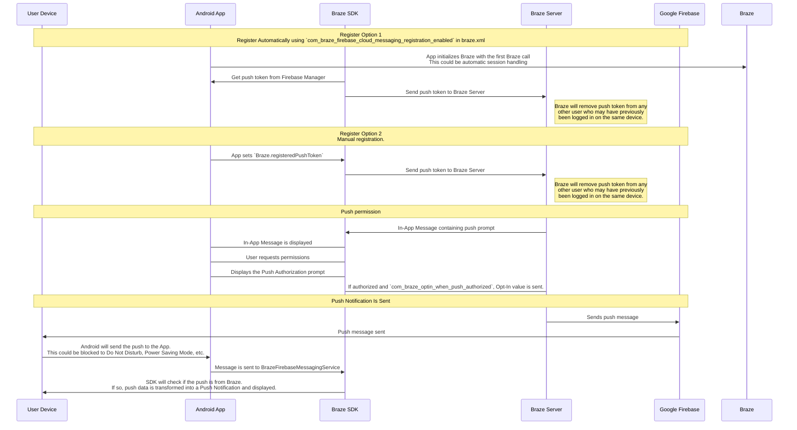

## Comprendre le flux de travail des notifications push de Braze {#understanding-the-braze-push-workflow}

Le service Firebase Cloud Messaging (FCM) est l'infrastructure de Google pour les notifications push envoyées aux applications Android. Voici la structure simplifiée de la manière dont les notifications push sont activées pour les appareils de vos utilisateurs et la façon dont Braze peut leur envoyer des notifications push :



### Étape 1 : Configurer votre clé API Google Cloud {#step-1-configure-your-google-cloud-api-key}

Pour développer votre application, vous devrez fournir votre ID d'expéditeur Firebase au SDK Braze pour Android. De plus, vous devez fournir une clé API pour les applications serveur au tableau de bord de Braze. Braze utilisera cette clé API pour envoyer des messages à vos appareils. Vous devrez également vous assurer que le service FCM est activé dans la console de développement de Google.


Une erreur courante pendant cette étape est d'utiliser la clé API d'identification de l'application plutôt que la clé API REST.


### Étape 2 : Les appareils s'inscrivent au FCM et fournissent à Braze des jetons de notification push {#step-2-devices-register-for-fcm-and-provide-braze-with-push-tokens}

Dans les intégrations typiques, le SDK Braze pour Android gère l'enregistrement des appareils pour la fonctionnalité FCM. Cela se produit généralement immédiatement après l'ouverture de l'application pour la première fois. Après l'inscription, Braze reçoit un ID d'enregistrement FCM, utilisé pour envoyer des messages spécifiquement à cet appareil. Nous stockons l'ID d'enregistrement pour cet utilisateur, et celui-ci devient « push registered » (enregistré pour les notifications push) s'il ne disposait pas au préalable d'un jeton de notification push pour l'une de vos applications.

### Étape 3 : Lancer une Campaign de notifications push Braze {#step-3-launch-a-braze-push-campaign}

Lorsqu'une Campaign de notifications push est lancée, Braze effectue des requêtes à FCM pour transmettre votre message. Braze utilise la clé API copiée dans le tableau de bord pour authentifier et vérifier que nous pouvons envoyer des notifications push aux jetons de notification push fournis.

### Étape 4 : Supprimer les jetons non valides {#step-4-remove-invalid-tokens}

Si FCM nous informe que certains des jetons de notification push auxquels nous tentions d'envoyer un message ne sont pas valides, nous supprimons ces jetons des profils utilisateur auxquels ils étaient associés. Si des utilisateurs n'ont pas d'autres jetons de notification push, ils ne s'afficheront plus en tant que « Push Registered » dans la page **Segments**.

Pour plus d'informations sur FCM, consultez [Messagerie cloud](https://firebase.google.com/docs/cloud-messaging/).

## Utiliser les journaux d'erreur de notification push {#use-the-push-error-logs}

Braze fournit des erreurs de notification push dans le journal des activités de message. Ce journal d'erreurs fournit de nombreux avertissements qui peuvent être très utiles pour identifier les raisons pour lesquelles vos Campaigns ne fonctionnent pas comme prévu. Cliquer sur un message d'erreur vous redirige vers la documentation pertinente pour vous aider à résoudre un incident particulier.


## Résolution des problèmes {#troubleshooting}

### Les notifications push ne sont pas envoyées {#push-isnt-sending}

Il se peut que vos notifications push ne soient pas envoyées en raison des situations suivantes :

- Vos identifiants existent dans le mauvais ID de projet Google Cloud Platform (ID d'expéditeur incorrect).
- Vos identifiants n'ont pas la bonne portée de permission.
- Vous avez téléchargé des identifiants erronés dans le mauvais espace de travail de Braze (mauvais ID d'expéditeur).

Pour d'autres problèmes susceptibles de vous empêcher d'envoyer une notification push, consultez le [guide d'utilisation : résolution des problèmes des notifications push]({{site.baseurl}}/user_guide/message_building_by_channel/push/troubleshooting).

### Aucun utilisateur « push registered » ne s'affiche dans le tableau de bord de Braze (avant l'envoi de messages) {#no-push-registered-users-showing-in-the-braze-dashboard-prior-to-sending-messages}

Confirmez que votre application est correctement configurée pour autoriser les notifications push. Les points de défaillance fréquents à vérifier comprennent :

#### ID d'expéditeur incorrect {#incorrect-sender-id}

Vérifiez que l'ID correct d'expéditeur FCM figure dans le fichier `braze.xml`. Un ID d'expéditeur incorrect entraîne le signalement d'erreurs `MismatchSenderID` dans le journal des activités de message du tableau de bord.

#### L'enregistrement Braze ne se fait pas {#braze-registration-not-occurring}

Puisque l'enregistrement FCM est géré en dehors de Braze, une erreur d'enregistrement ne peut se produire que dans deux endroits :

1. Lors de l'enregistrement avec FCM
2. Lors de la transmission du jeton de notification push généré par FCM à Braze

Nous recommandons de définir un point d'arrêt ou une journalisation pour confirmer que le jeton de notification push généré par FCM est bien envoyé à Braze. Si un jeton n'est pas généré correctement ou pas du tout, nous recommandons de consulter la [documentation FCM](https://firebase.google.com/docs/cloud-messaging/android/client).

#### Les services Google Play ne sont pas présents {#google-play-services-not-present}

Pour que les notifications push FCM fonctionnent, les services Google Play doivent être présents sur l'appareil. Si les services Google Play ne sont pas présents sur un appareil, l'enregistrement des notifications push ne sera pas effectué.


Les services Google Play ne sont pas installés sur les émulateurs Android qui n'ont pas les API Google installées.


#### L'appareil n'est pas connecté à Internet {#device-not-connected-to-the-internet}

Vérifiez que votre appareil dispose d'une bonne connectivité Internet et qu'il n'envoie pas le trafic réseau par l'intermédiaire d'un proxy.

### Appuyer sur une notification push n'ouvre pas l'application {#tapping-push-notification-doesnt-open-the-app}

Vérifiez si `com_braze_handle_push_deep_links_automatically` est défini sur `true` ou `false`. Pour permettre à Braze d'ouvrir automatiquement l'application et les deep links lorsqu'une notification push est touchée, définissez `com_braze_handle_push_deep_links_automatically` sur `true` dans votre fichier `braze.xml`.

Si `com_braze_handle_push_deep_links_automatically` est défini sur sa valeur par défaut de `false`, vous devez utiliser un rappel de notification push Braze pour écouter et gérer les intentions de notification push reçues et ouvertes.

### Rebonds de notifications push {#push-notifications-bounced}

Si une notification push n'est pas transmise, consultez la [console de développement]({{site.baseurl}}/developer_guide/platforms/android/push_notifications/troubleshooting#utilizing-the-push-error-logs) pour vous assurer qu'elle n'a pas été rejetée. Vous trouverez ci-dessous une description des erreurs fréquentes susceptibles d'être consignées dans la console de développement :

#### Erreur : MismatchSenderID {#error-mismatchsenderid}

`MismatchSenderID` indique une défaillance de l'authentification. Vérifiez que votre ID d'expéditeur Firebase et la clé API FCM sont corrects.

#### Erreur : InvalidRegistration {#error-invalidregistration}

`InvalidRegistration` peut être causé par un jeton de notification push mal formé.

1. Veillez à transmettre un jeton de notification push valide à Braze depuis [Firebase Cloud Messaging](https://firebase.google.com/docs/cloud-messaging/android/client#retrieve-the-current-registration-token).

#### Erreur : NotRegistered {#error-notregistered}

2. `NotRegistered` peut également se produire lorsque plusieurs enregistrements se produisent et qu'un deuxième enregistrement invalide le premier jeton.

### Les notifications push sont envoyées mais ne s'affichent pas sur les appareils des utilisateurs {#push-notifications-sent-but-not-displayed-on-users-devices}

Il y a plusieurs raisons pour lesquelles cela pourrait se produire :

#### L'application a été forcée à s'arrêter {#application-was-force-quit}

Si vous forcez votre application à quitter via les paramètres système, vos notifications push ne seront pas envoyées. Relancer l'application permettra à votre appareil de recevoir à nouveau des notifications push.

#### BrazeFirebaseMessagingService n'est pas enregistré {#brazefirebasemessagingservice-not-registered}

BrazeFirebaseMessagingService doit être correctement enregistré dans `AndroidManifest.xml` pour que les notifications push s'affichent :

```xml
<service android:name="com.braze.push.BrazeFirebaseMessagingService"
  android:exported="false">
  <intent-filter>
    <action android:name="com.google.firebase.MESSAGING_EVENT" />
  </intent-filter>
</service>
```

#### Le pare-feu bloque les notifications push {#firewall-is-blocking-push}

Si vous testez les notifications push par Wi-Fi, votre pare-feu peut bloquer les ports nécessaires pour que FCM reçoive les messages. Vérifiez que les ports `5228`, `5229` et `5230` sont ouverts. En outre, puisque FCM ne spécifie pas ses adresses IP, vous devez également autoriser votre pare-feu à accepter les connexions sortantes vers toutes les adresses IP contenues dans les blocs IP répertoriés dans l'ASN de Google `15169`.

#### La fabrique de notifications personnalisée renvoie null {#custom-notification-factory-returning-null}

Si vous avez mis en place une [fabrique de notifications personnalisée]({{site.baseurl}}/developer_guide/platform_integration_guides/android/push_notifications/android/integration/standard_integration#custom-displaying-notifications), assurez-vous qu'elle ne renvoie pas `null`. Cela empêcherait l'affichage des notifications.

### Les utilisateurs « push registered » ne sont plus activés après l'envoi de messages {#push-registered-users-no-longer-enabled-after-sending-messages}

Il y a plusieurs raisons pour lesquelles cela pourrait se produire :

#### L'application a été désinstallée {#application-was-uninstalled}

Les utilisateurs ont désinstallé l'application. Cela invalidera leur jeton de notification push FCM.

#### Clé du serveur Firebase Cloud Messaging non valide {#invalid-firebase-cloud-messaging-server-key}

La clé du serveur Firebase Cloud Messaging fournie dans le tableau de bord de Braze n'est pas valide. L'ID d'expéditeur fourni doit correspondre à celui référencé dans le fichier `braze.xml` de votre application. La clé du serveur et l'ID d'expéditeur sont disponibles ici dans votre console Firebase :


### Les clics de notification push ne sont pas enregistrés {#push-clicks-not-logged}

Si les clics push ne sont pas enregistrés, il est possible que les données de clics push n'aient pas encore été transférées vers nos serveurs. Le SDK Braze pour Android peut limiter la fréquence des transmissions.

Si vous avez mis en place un gestionnaire de notifications push personnalisé, assurez-vous de [préserver correctement l'analyse native des notifications push]({{site.baseurl}}/developer_guide/push_notifications/logging_message_data/?tab=android#preserving-native-push-analytics-with-custom-push-handling).

L'enregistrement des clics push est une opération réseau et est soumis aux limitations réseau. Ainsi, bien que le SDK Braze pour Android tente de gérer les défaillances réseau et réessaie les requêtes échouées, une certaine perte d'événements est à prévoir.

### Les deep links ne fonctionnent pas {#deep-links-not-working}

#### Vérifiez la configuration du deep link {#verify-deep-link-configuration}

Les deep links peuvent être [testés avec ADB](https://developer.android.com/training/app-indexing/deep-linking.html#testing-filters). Nous vous recommandons de tester votre deep link avec la commande suivante :

`adb shell am start -W -a android.intent.action.VIEW -d "THE_DEEP_LINK" THE_PACKAGE_NAME`

Si le deep link ne fonctionne pas, il peut être mal configuré. Un deep link mal configuré ne fonctionnera pas lorsqu'il sera envoyé via une notification push de Braze.

#### Vérifiez la logique de gestion personnalisée {#verify-custom-handling-logic}

Si le deep link [fonctionne correctement avec ADB](https://developer.android.com/training/app-indexing/deep-linking.html#testing-filters) mais ne fonctionne pas à partir d'une notification push Braze, vérifiez si une [gestion personnalisée de l'ouverture des notifications push]({{site.baseurl}}/developer_guide/platform_integration_guides/android/push_notifications/android/integration/standard_integration#android-push-listener-callback) a été mise en œuvre. Si oui, vérifiez que le code de gestion personnalisé traite correctement le deep link entrant.

#### Désactiver le comportement de la pile arrière {#disable-back-stack-behavior}

Si le deep link [fonctionne correctement avec ADB](https://developer.android.com/training/app-indexing/deep-linking.html#testing-filters) mais ne fonctionne pas à partir d'une notification push Braze, essayez de désactiver la [pile arrière](https://developer.android.com/guide/components/activities/tasks-and-back-stack). Pour ce faire, mettez à jour votre fichier **braze.xml** pour y inclure :

```xml
<bool name="com_braze_push_deep_link_back_stack_activity_enabled">false</bool>
```
