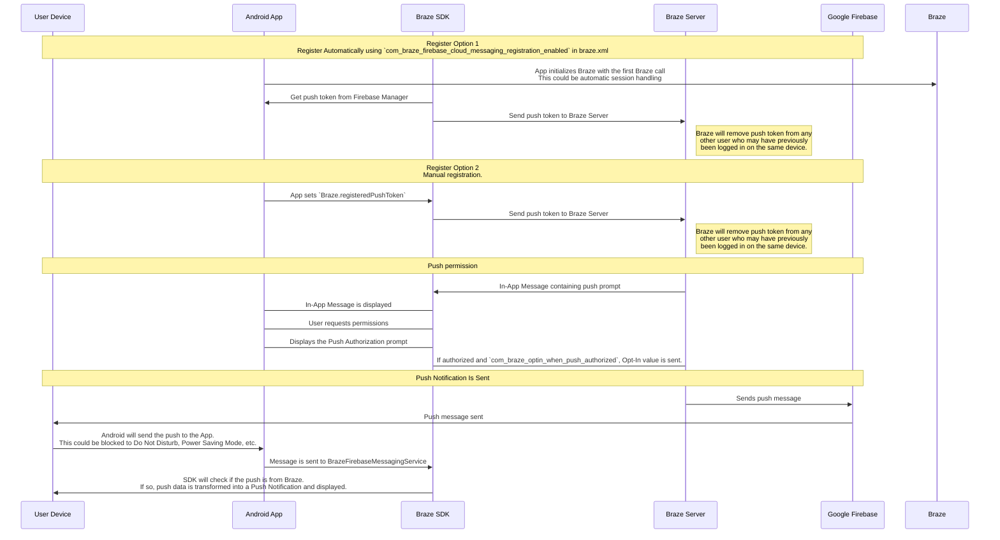

## Comprendre le flux de travail des notifications push de Braze {#understanding-the-braze-push-workflow}

Le service Firebase Cloud Messaging (FCM) est l'infrastructure de Google pour les notifications push envoyées aux applications Android. Voici la structure simplifiée de la façon dont les notifications push sont activées pour les appareils de vos utilisateurs et comment Braze peut leur envoyer des notifications push :



### Étape 1 : Configurer votre clé API Google Cloud {#step-1-configure-your-google-cloud-api-key}

Lors du développement de votre application, vous devrez fournir au SDK Android de Braze votre identifiant d'expéditeur Firebase. De plus, vous devrez fournir une clé API pour les applications serveur au tableau de bord de Braze. Braze utilisera cette clé API pour envoyer des messages à vos appareils. Vous devrez également vérifier que le service FCM est activé dans la console Google Developer.


Une erreur courante lors de cette étape est d'utiliser la clé API d'identifiant d'application au lieu de la clé REST API.


### Étape 2 : Les appareils s'enregistrent auprès de FCM et fournissent à Braze les jetons push {#step-2-devices-register-for-fcm-and-provide-braze-with-push-tokens}

Dans les intégrations classiques, le SDK Android de Braze gère l'enregistrement des appareils pour la fonctionnalité FCM. Cela se produit généralement immédiatement lors de la première ouverture de l'application. Après l'enregistrement, Braze reçoit un identifiant d'enregistrement FCM, qui est utilisé pour envoyer des messages spécifiquement à cet appareil. Nous stockons l'identifiant d'enregistrement pour cet utilisateur, et cet utilisateur devient « enregistré pour les notifications push » s'il ne disposait pas auparavant d'un jeton push pour l'une de vos applications.

### Étape 3 : Lancer une Campaign push Braze {#step-3-launch-a-braze-push-campaign}

Lorsqu'une Campaign push est lancée, Braze envoie des requêtes à FCM pour distribuer votre message. Braze utilise la clé API copiée dans le tableau de bord pour s'authentifier et vérifier que nous pouvons envoyer des notifications push aux jetons push fournis.

### Étape 4 : Supprimer les jetons invalides {#step-4-remove-invalid-tokens}

Si FCM nous informe que certains des jetons push auxquels nous tentions d'envoyer un message sont invalides, nous supprimons ces jetons des profils utilisateur auxquels ils étaient associés. Si les utilisateurs n'ont pas d'autres jetons push, ils n'apparaîtront plus comme « enregistrés pour les notifications push » sur la page **Segments**.

Pour plus de détails sur FCM, consultez [Cloud messaging](https://firebase.google.com/docs/cloud-messaging/).

## Utiliser les journaux d'erreurs push {#use-the-push-error-logs}

Braze fournit les erreurs de notification push dans le journal d'activité des messages. Ce journal d'erreurs propose divers avertissements qui peuvent être très utiles pour identifier pourquoi vos Campaigns ne fonctionnent pas comme prévu. Sélectionner un message d'erreur vous redirige vers la documentation correspondante pour vous aider à résoudre un incident particulier.


## Résolution des problèmes {#troubleshooting}

### Les notifications push ne s'envoient pas {#push-isnt-sending}

Vos notifications push peuvent ne pas s'envoyer en raison des situations suivantes :

- Vos identifiants se trouvent dans le mauvais ID de projet Google Cloud Platform (mauvais sender ID).
- Vos identifiants ont la mauvaise portée d'autorisation.
- Vous avez importé les mauvais identifiants dans le mauvais espace de travail Braze (mauvais sender ID).

Pour d'autres problèmes susceptibles d'empêcher l'envoi d'une notification push, consultez [Guide utilisateur : Résolution des problèmes des notifications push]({{site.baseurl}}/user_guide/channels/push/troubleshooting).

### Aucun utilisateur « inscrit au push » n'apparaît dans le tableau de bord de Braze (avant l'envoi de messages) {#no-push-registered-users-showing-in-the-braze-dashboard-prior-to-sending-messages}

Vérifiez que votre application est correctement configurée pour autoriser les notifications push. Les points de défaillance courants à vérifier sont les suivants :

#### Sender ID incorrect {#incorrect-sender-id}

Vérifiez que le bon sender ID FCM est inclus dans le fichier `braze.xml`. Un sender ID incorrect entraînera des erreurs `MismatchSenderID` signalées dans le journal d'activité des messages du tableau de bord.

#### L'inscription Braze ne se produit pas {#braze-registration-not-occurring}

Étant donné que l'inscription FCM est gérée en dehors de Braze, l'échec d'inscription ne peut se produire qu'à deux endroits :

1. Lors de l'inscription auprès de FCM
2. Lors de la transmission du jeton push généré par FCM à Braze

Nous recommandons de définir un point d'arrêt ou d'ajouter des logs pour confirmer que le jeton push généré par FCM est bien envoyé à Braze. Si un jeton n'est pas généré correctement ou pas du tout, nous recommandons de consulter la [documentation FCM](https://firebase.google.com/docs/cloud-messaging/android/client).

#### Google Play Services absent {#google-play-services-not-present}

Pour que le push FCM fonctionne, Google Play Services doit être présent sur l'appareil. Si Google Play Services n'est pas installé sur un appareil, l'inscription au push ne se produira pas.


Google Play Services n'est pas installé sur les émulateurs Android sans les API Google installées.


#### Appareil non connecté à Internet {#device-not-connected-to-the-internet}

Vérifiez que votre appareil dispose d'une bonne connectivité Internet et n'envoie pas le trafic réseau via un proxy.

### Appuyer sur la notification push n'ouvre pas l'application {#tapping-push-notification-doesnt-open-the-app}

Vérifiez si `com_braze_handle_push_deep_links_automatically` est défini sur `true` ou `false`. Pour permettre à Braze d'ouvrir automatiquement l'application et les deep links lorsqu'une notification push est touchée, définissez `com_braze_handle_push_deep_links_automatically` sur `true` dans votre fichier `braze.xml`.

Si `com_braze_handle_push_deep_links_automatically` est défini sur sa valeur par défaut `false`, vous devez utiliser un rappel push Braze pour écouter et gérer les intentions de réception et d'ouverture de push.

### Les notifications push ont rebondi {#push-notifications-bounced}

Si une notification push n'est pas distribuée, vérifiez qu'elle n'a pas rebondi en consultant la [console de développement]({{site.baseurl}}/developer_guide/platforms/android/push_notifications/troubleshooting#utilizing-the-push-error-logs). Voici les descriptions des erreurs courantes qui peuvent être enregistrées dans la console de développement :

#### Erreur : MismatchSenderID {#error-mismatchsenderid}

`MismatchSenderID` indique un échec d'authentification. Vérifiez que votre sender ID Firebase et votre clé API FCM sont corrects.

#### Erreur : InvalidRegistration {#error-invalidregistration}

`InvalidRegistration` peut être causé par un jeton push malformé.

1. Assurez-vous de transmettre un jeton push valide à Braze depuis [Firebase Cloud Messaging](https://firebase.google.com/docs/cloud-messaging/android/client#retrieve-the-current-registration-token).

#### Erreur : NotRegistered {#error-notregistered}

2. `NotRegistered` peut également se produire lorsque plusieurs inscriptions ont lieu et qu'une seconde inscription invalide le premier jeton.

### Les notifications push sont envoyées mais ne s'affichent pas sur les appareils des utilisateurs {#push-notifications-sent-but-not-displayed-on-users-devices}

Il y a plusieurs raisons pour lesquelles cela peut se produire :

#### L'application a été fermée de force {#application-was-force-quit}

Si vous fermez de force votre application via les paramètres système, vos notifications push ne seront pas envoyées. Relancer l'application permettra à votre appareil de recevoir à nouveau les notifications push.

#### BrazeFirebaseMessagingService non enregistré {#brazefirebasemessagingservice-not-registered}

Le BrazeFirebaseMessagingService doit être correctement enregistré dans `AndroidManifest.xml` pour que les notifications push s'affichent :

```xml
<service android:name="com.braze.push.BrazeFirebaseMessagingService"
  android:exported="false">
  <intent-filter>
    <action android:name="com.google.firebase.MESSAGING_EVENT" />
  </intent-filter>
</service>
```

#### Le pare-feu bloque les notifications push {#firewall-is-blocking-push}

Si vous testez les notifications push en Wi-Fi, votre pare-feu peut bloquer les ports nécessaires pour que FCM reçoive les messages. Vérifiez que les ports `5228`, `5229` et `5230` sont ouverts. De plus, comme FCM ne spécifie pas ses adresses IP, vous devez également autoriser votre pare-feu à accepter les connexions sortantes vers toutes les adresses IP contenues dans les blocs IP répertoriés dans l'ASN de Google `15169`.

#### La fabrique de notifications personnalisée retourne null {#custom-notification-factory-returning-null}

Si vous avez implémenté une [fabrique de notifications personnalisée]({{site.baseurl}}/developer_guide/platform_integration_guides/android/push_notifications/android/integration/standard_integration#custom-displaying-notifications), assurez-vous qu'elle ne retourne pas `null`. Cela empêcherait les notifications de s'afficher.

### Les utilisateurs « inscrits au push » ne sont plus activés après l'envoi de messages {#push-registered-users-no-longer-enabled-after-sending-messages}

Il y a plusieurs raisons pour lesquelles cela peut se produire :

#### L'application a été désinstallée {#application-was-uninstalled}

Les utilisateurs ont désinstallé l'application. Cela invalidera leur jeton push FCM.

#### Clé de serveur Firebase Cloud Messaging invalide {#invalid-firebase-cloud-messaging-server-key}

La clé de serveur Firebase Cloud Messaging fournie dans le tableau de bord de Braze est invalide. Le sender ID fourni doit correspondre à celui référencé dans le fichier `braze.xml` de votre application. La clé de serveur et le sender ID se trouvent ici dans votre console Firebase :


### Les clics sur les notifications push ne sont pas enregistrés {#push-clicks-not-logged}

Si les clics push ne sont pas enregistrés, il est possible que les données de clics push n'aient pas encore été transmises à nos serveurs. Le SDK Android de Braze peut limiter la fréquence des transmissions.

Si vous avez implémenté un gestionnaire de push personnalisé, assurez-vous de [préserver correctement les analyses natives des notifications push]({{site.baseurl}}/developer_guide/push_notifications/logging_message_data/?tab=android#preserving-native-push-analytics-with-custom-push-handling).

L'enregistrement des clics push est une opération réseau soumise aux limitations du réseau. Ainsi, bien que le SDK Android de Braze tente de gérer les échecs réseau et réessaie les requêtes échouées, une certaine perte d'événements est à prévoir.

### Les deep links ne fonctionnent pas {#deep-links-not-working}

#### Vérifier la configuration des deep links {#verify-deep-link-configuration}

Les deep links peuvent être [testés avec ADB](https://developer.android.com/training/app-indexing/deep-linking.html#testing-filters). Nous recommandons de tester votre deep link avec la commande suivante :

`adb shell am start -W -a android.intent.action.VIEW -d "THE_DEEP_LINK" THE_PACKAGE_NAME`

Si le deep link ne fonctionne pas, il est peut-être mal configuré. Un deep link mal configuré ne fonctionnera pas lorsqu'il est envoyé via une notification push Braze.

#### Vérifier la logique de gestion personnalisée {#verify-custom-handling-logic}

Si le deep link [fonctionne correctement avec ADB](https://developer.android.com/training/app-indexing/deep-linking.html#testing-filters) mais échoue à partir d'une notification push Braze, vérifiez si une [gestion personnalisée de l'ouverture push]({{site.baseurl}}/developer_guide/platform_integration_guides/android/push_notifications/android/integration/standard_integration#android-push-listener-callback) a été implémentée. Si c'est le cas, vérifiez que le code de gestion personnalisée traite correctement le deep link entrant.

#### Désactiver le comportement de la pile de retour {#disable-back-stack-behavior}

Si le deep link [fonctionne correctement avec ADB](https://developer.android.com/training/app-indexing/deep-linking.html#testing-filters) mais échoue à partir d'une notification push Braze, essayez de désactiver la [pile de retour](https://developer.android.com/guide/components/activities/tasks-and-back-stack). Pour ce faire, mettez à jour votre fichier **braze.xml** pour inclure :

```xml
<bool name="com_braze_push_deep_link_back_stack_activity_enabled">false</bool>
```
