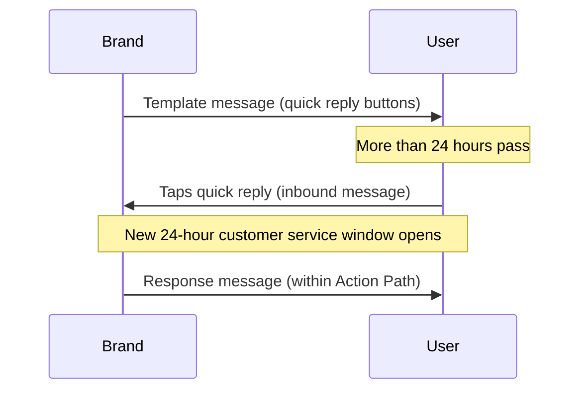

# Messages des utilisateurs {#user-messages}

> WhatsApp est un canal de communication bidirectionnelle. Non seulement votre marque peut envoyer des messages aux utilisateurs, mais ceux-ci peuvent également engager des conversations à l'aide de Campaigns et de Canvas basés sur des modèles. Il existe plusieurs façons de procéder, notamment les réponses rapides WhatsApp, les messages de liste et les mots déclencheurs. Les appels à l'action (CTA) des réponses rapides et des messages de liste sont un excellent moyen d'encourager l'engagement des utilisateurs avec vos messages WhatsApp.

## Déclencheurs basés sur l'action {#action-based-triggers}

Les Campaigns et les Canvas peuvent démarrer, se ramifier et subir des modifications en cours de parcours à partir d'un message WhatsApp entrant (un utilisateur envoyant un message à votre WhatsApp), par exemple un mot déclencheur.

Assurez-vous que votre mot déclencheur correspond à ce que vous attendez de la part des utilisateurs.

**Points à retenir :**
- Chaque lettre de votre mot déclencheur doit être en majuscule lors de la configuration. Braze n'exige pas que les mots déclencheurs entrants envoyés par les utilisateurs soient en majuscules. Par exemple, l'envoi du message « jOin2023 » déclenchera quand même le Canvas ou la Campaign.
- Si aucun mot déclencheur n'est spécifié dans le déclencheur basé sur l'action de la planification d'entrée, la Campaign ou le Canvas s'exécutera pour TOUS les messages WhatsApp entrants. Cela inclut les messages correspondant à des expressions actives dans des Campaigns et des Canvas actifs, auquel cas l'utilisateur recevra deux messages WhatsApp.










## Réponses non reconnues {#unrecognized-responses}

Nous vous recommandons d'inclure une option pour les réponses non reconnues dans les Canvas interactifs. Cela aide les utilisateurs à comprendre quelles sont les invites disponibles et définit les attentes pour le canal. La gestion des attentes peut être particulièrement utile si vous disposez de canaux WhatsApp avec un chat d'agent en direct.
- Dans l'étape d'action, après avoir créé les groupes d'actions pour les phrases de filtre personnalisées, ajoutez un groupe d'actions supplémentaire pour « Envoyer un message WhatsApp », mais **ne cochez pas Où le corps du message**. Cela interceptera toutes les réponses non reconnues des utilisateurs, de manière similaire à une clause « else ».
- Nous recommandons de faire suivre avec un message WhatsApp informant l'utilisateur que ce canal n'est pas surveillé par un agent et le dirigeant vers un canal d'assistance si nécessaire.

## Réponses rapides {#quick-replies}

{: style="float:right;max-width:25%;margin-left:15px;border: 0;"}

Les réponses rapides apparaissent sous forme de boutons cliquables dans la conversation, mais agissent comme si l'utilisateur avait répondu par du texte. Braze traite alors ces réponses comme des messages entrants et peut renvoyer des réponses prédéfinies en fonction du bouton cliqué. Utilisez l'étape « Action de message WhatsApp entrant » lors de la création et du filtrage des réponses de vos utilisateurs.

{: style="max-width:50%;"}

### Configurer l'expérience de réponse rapide dans Canvas {#configure-the-quick-reply-experience-in-canvas}

#### Étape 1 : Créer les CTA {#step-1-build-out-ctas}

Tout d'abord, créez vos CTA de réponse rapide dans le [gestionnaire de modèles de messages WhatsApp](https://business.facebook.com/wa/manage/message-templates/) au sein d'un modèle de message.

{: style="max-width:80%;"}

Une fois votre modèle soumis et approuvé par WhatsApp, vous pouvez l'utiliser pour créer un Canvas dans Braze.


Vous pouvez créer le Canvas avant de recevoir l'approbation de votre modèle de message.


#### Étape 2 : Créer votre Canvas {#step-2-build-your-canvas}

Ensuite, créez un Canvas avec une étape de message qui inclut le modèle que vous avez créé.

Créez une étape d'action qui suit l'étape de message. Créez un groupe par option de réponse rapide dans cette étape d'action.

Pour chaque groupe d'options de réponse rapide, spécifiez le texte exact correspondant au bouton que vous souhaitez faire correspondre. Notez que les mots-clés doivent être en majuscules.

Si vous souhaitez une réponse par défaut pour les utilisateurs qui répondent au message avec du texte au lieu de réponses rapides, créez un groupe supplémentaire sans corps de message correspondant.

Continuez à construire le Canvas comme vous le feriez normalement à partir de ce point.

### Réponses {#responses}

Vous souhaiterez très probablement un message de réponse pour chaque réponse. Nous recommandons d'avoir une option fourre-tout pour les réponses en dehors du cadre des réponses rapides (par exemple, pour les clients qui répondent avec un message général plutôt qu'une invite prédéterminée). Par exemple : « Nous sommes désolés, nous n'avons pas reconnu votre réponse. Pour les questions d'assistance, veuillez contacter <canal d'assistance>. »

Notez que vous pouvez utiliser toutes les actions ultérieures proposées par Canvas de Braze, telles que les messages en réponse, les mises à jour du profil utilisateur ou les webhooks Braze-to-Braze.

## Messages de type liste {#list-messages}

Les messages de type liste apparaissent sous la forme d'un message avec une liste d'options cliquables. Chaque liste peut comporter plusieurs sections, et chaque liste peut contenir jusqu'à 10 lignes.

{: style="max-width:40%;"}

### Configurer l'expérience du message de type liste dans Canvas {#configure-the-list-message-experience-in-canvas}

#### Étape 1 : Créer ou modifier un Canvas existant basé sur une action {#step-1-create-or-edit-an-existing-action-based-canvases}

Vous ne pouvez ajouter des messages de type liste WhatsApp qu'aux Canvas basés sur une action, car ils doivent être envoyés en réponse à un message de l'utilisateur.

#### Étape 2 : Créer une étape de message WhatsApp {#step-2-create-a-whatsapp-message-step}

Ajoutez une [étape de message]({{site.baseurl}}/user_guide/messaging/canvas/canvas_components/message_step) WhatsApp, puis sélectionnez la disposition de message de réponse **List Message**.

{: style="max-width:70%;"}

Ajoutez un nom de **bouton de liste** que les utilisateurs sélectionneront pour afficher votre liste. Ensuite, utilisez les champs dans **List content** pour créer votre liste :

- **Section :** Ajoutez jusqu'à 10 sections pour regrouper et organiser les éléments de votre liste. Par exemple, un détaillant de vêtements pourrait utiliser des sections pour organiser par styles saisonniers (comme printemps, été, automne et hiver) ou par articles vestimentaires (comme hauts, bas et chaussures).
- **Ligne :** Ajoutez jusqu'à 10 lignes, ou éléments de liste, répartis sur l'ensemble des sections.
- **Description de la ligne (facultatif) :** Ajoutez une description facultative à toutes les lignes (éléments de liste).

{: style="max-width:60%;"}

Modifiez l'ordre des sections et des lignes en sélectionnant et en faisant glisser l'icône située à côté de leurs noms.

{: style="max-width:60%;"}

De retour dans le compositeur Canvas, ajoutez un [parcours d'action]({{site.baseurl}}/user_guide/messaging/canvas/canvas_components/action_paths) après l'étape de message avec un groupe pour chaque réponse de la liste. Dans chaque groupe :

1. Ajoutez un déclencheur pour **Sent inbound WhatsApp subscription group** et sélectionnez le groupe d'abonnement WhatsApp correspondant.
2. Cochez la case **Where the message body**.
3. Spécifiez le contenu d'une ligne (ou d'un élément de liste).

Continuez à construire votre Canvas.

### Créer des parcours d'action pour les descriptions longues {#creating-actions-paths-for-long-descriptions}

Si vous avez des descriptions de lignes, vous devez utiliser **Matches regex** pour spécifier une ligne. Par exemple, si vous souhaitez spécifier une ligne avec la description « Our new style that fits over your favorite pair of ankle boots », vous pourriez utiliser une [expression régulière]({{site.baseurl}}/user_guide/audience/segments/regex) avec « ankle boots ».

## Considérations {#considerations}

### Exigences de délai pour les messages de réponse {#timing-requirements-for-response-messages}

Les messages de réponse doivent être envoyés dans les 24 heures suivant la réception du message d'un utilisateur. Pour contribuer à la création d'expériences réussies, Braze vérifie la logique du message pour confirmer qu'il existe un message entrant de l'utilisateur en amont qui débloque le message de réponse.

Pour des réponses en moins d'une minute dans les flux Canvas bidirectionnels, réduisez au minimum les étapes entre le déclencheur entrant et l'envoi du message de réponse. L'architecture du Canvas, les allers-retours de webhooks et le traitement par lots des mises à jour utilisateur peuvent ajouter de la latence. Consultez [Réduire la latence de réponse pour les flux bidirectionnels]({{site.baseurl}}/user_guide/channels/whatsapp/best_practices#minimize-response-latency-for-two-way-flows).

Les événements suivants débloquent les messages de réponse :

- Message entrant
  - [Parcours d'action]({{site.baseurl}}/action_paths) ou [entrée basée sur une action]({{site.baseurl}}/user_guide/messaging/campaigns/schedule_your_campaign/triggered_delivery) avec le déclencheur **Envoyer un message WhatsApp entrant**.

- [Entrée déclenchée par l'API]({{site.baseurl}}/user_guide/messaging/campaigns/schedule_your_campaign/api_triggered_delivery)
- Message produit entrant
  - Événement [`ecommerce.cart_updated`]({{site.baseurl}}/user_guide/data/activation/events/recommended_events/ecommerce_events#types-of-ecommerce-recommended-events?tab=ecommerce.cart_updated)

### Réponses rapides et messages entrants en dehors de la fenêtre de 24 heures {#quick-replies-and-inbound-messages-outside-the-24-hour-window}

Lorsqu'un utilisateur interagit avec votre entreprise sur WhatsApp — y compris en appuyant sur un bouton de réponse rapide d'un ancien modèle de message — son action est comptabilisée comme un message entrant. Ce message entrant ouvre une nouvelle fenêtre de service client de 24 heures, même si le modèle d'origine a été envoyé il y a plus de 24 heures.

Dans un Canvas avec des boutons de réponse rapide, les utilisateurs peuvent appuyer sur un bouton plusieurs jours après avoir reçu le modèle de bienvenue et entrer malgré tout dans le parcours d'action approprié. Braze évalue le parcours d'action lorsque le message entrant arrive ; vous n'avez pas besoin de prolonger la durée du parcours d'action au-delà de la valeur par défaut pour capturer les réponses tardives.

Le schéma suivant illustre un flux de réponse rapide courant :

#### Ce qu'il faut savoir {#things-to-know}

- L'étape du message de réponse doit toujours se situer dans les 24 heures suivant le message entrant de l'utilisateur. Dans la plupart des flux Canvas, la réponse est envoyée immédiatement après l'évaluation du parcours d'action, ce n'est donc généralement pas un problème.
- La fenêtre de service client de 24 heures est différente des [événements de conversion]({{site.baseurl}}/user_guide/messaging/messaging_fundamentals/conversion_events) du Canvas, qui peuvent utiliser une fenêtre allant jusqu'à 30 jours. Les fenêtres de conversion contrôlent l'attribution ; elles n'affectent pas la possibilité d'envoyer un message de réponse.
- Pour la facturation, consultez [Les messages de réponse WhatsApp sont-ils gratuits ?]({{site.baseurl}}/user_guide/channels/whatsapp/faq#are-whatsapp-response-messages-free).

### Filtrage par un attribut temporel personnalisé {#filtering-by-a-custom-time-attribute}

Si l'audience de votre Campaign ou Canvas WhatsApp basé sur une action dépend d'un attribut temporel personnalisé compris dans une fenêtre relative (par exemple, entre maintenant et les prochaines 24 heures), combinez deux filtres comme décrit dans [Temps]({{site.baseurl}}/user_guide/data/activation/custom_data/data_types#custom-attribute-data-types).

### Stockage des médias entrants et expiration des URL {#inbound-media-storage-and-url-expiration}

Lorsqu'un utilisateur envoie un message WhatsApp contenant un média (tel qu'une image, un fichier audio ou un document), Braze stocke ce média dans Amazon S3 pendant 30 jours à compter de la réception du message.

Cependant, le champ Liquid `inbound_media_urls`, qui référence l'URL de ce média, est valide pendant sept jours à compter du moment où Braze reçoit le message entrant. Comme l'URL est générée une seule fois à la réception et n'est pas régénérée, la fenêtre de sept jours s'applique indépendamment du moment où vous accédez au champ. La plus courte des deux limites s'applique, donc en pratique, `inbound_media_urls` doit être considéré comme valide pendant sept jours au maximum.


Si vous enregistrez une valeur `inbound_media_urls` dans un attribut personnalisé de l'utilisateur pour une utilisation ultérieure, tenez compte de cette expiration de sept jours. Toute tentative d'accès à l'URL après son expiration aboutira à un lien cassé.


### Nom de profil entrant {#inbound-profile-name}

Lorsque Meta inclut un nom d'affichage dans un message WhatsApp entrant, Braze l'expose en tant qu'attribut Liquid `{{whats_app.${inbound_profile_name}}}` sur cet événement entrant. Cette valeur reflète le nom que l'utilisateur a défini dans WhatsApp et peut ne pas correspondre aux données du profil CRM. Validez les données avant de les utiliser dans les messages destinés aux utilisateurs, ou utilisez une étape de mise à jour utilisateur dans un Canvas pour les enregistrer dans un champ de profil en vue d'une utilisation ultérieure. Pour obtenir la liste complète des attributs Liquid WhatsApp, consultez [Balises de personnalisation prises en charge]({{site.baseurl}}/user_guide/messaging/design_and_edit/personalize/liquid/supported_personalization_tags).