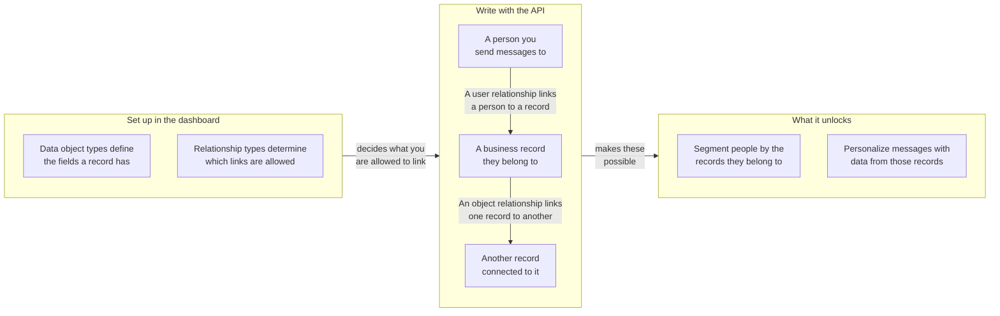

## ベースURLと認証 {#base-url-and-authentication}

ワークスペースのRESTエンドポイントを使用し、`Authorization: Bearer YOUR_REST_API_KEY` を送信します。このセクションでは、データオブジェクトエンドポイントのホスト先と、リクエストがどのように認証されるかを説明します。

- エンドポイントのホストについては、[Braze APIの概要]({{site.baseurl}}/api/basics#endpoints)を参照してください。
- すべてのリクエストおよびレスポンスのペイロードはJSON形式です。
- リクエストは、APIキーを所有するワークスペースにスコープされます。
- キーにIP許可リストが設定されている場合、許可リスト外のIPアドレスからのリクエストは `403` を返します。

## APIキーの権限 {#api-key-permissions}

このセクションでは、各エンドポイントに必要な権限を示しています。これにより、APIキーを安全にスコープできます。

| 権限 | エンドポイントグループ |
|---|---|
| `data_objects.read` | タイプおよびオブジェクトの読み取り、オブジェクトリレーションシップの読み取り |
| `data_objects.create` | オブジェクトの作成 |
| `data_objects.update` | オブジェクトの置換および更新 |
| `data_objects.delete` | オブジェクトの削除 |
| `data_objects.user_relationships.read` | ユーザーリレーションシップの読み取り |
| `data_objects.user_relationships.create` | ユーザーリレーションシップの作成 |
| `data_objects.user_relationships.update` | ユーザーリレーションシップの置換および更新 |
| `data_objects.user_relationships.delete` | ユーザーリレーションシップの削除 |
| `data_objects.object_relationships.create` | オブジェクトリレーションシップの作成 |
| `data_objects.object_relationships.update` | オブジェクトリレーションシップの置換および更新 |
| `data_objects.object_relationships.delete` | オブジェクトリレーションシップの削除 |
{: .reset-td-br-1 .reset-td-br-2 aria-label="データオブジェクトの権限グループ" }


オブジェクトリレーションシップの読み取りには `data_objects.read` を使用します。`data_objects.object_relationships.read` という権限は存在しません。


## レート制限 {#rate-limits}

このセクションでは、読み取りおよび書き込みトラフィックのデフォルトのリクエストクォータとレスポンスヘッダーについて説明します。

| バケット | デフォルトの制限 |
|---|---|
| データオブジェクトの読み取り | 1分あたり50リクエスト |
| データオブジェクトの書き込み | 1分あたり50リクエスト |
{: .reset-td-br-1 .reset-td-br-2 aria-label="データオブジェクトのデフォルトレート制限" }

すべてのレスポンスには `X-RateLimit-Limit`、`X-RateLimit-Remaining`、および `X-RateLimit-Reset` が含まれます。

スロットルされたリクエストに対しては、Brazeは `429` と、`id` および `message` を含むエラーペイロードを返します。

```json
{
  "errors": [
    {
      "id": "rate-limit-exceeded",
      "message": "You have exceeded your limit of 50 requests per minute."
    }
  ]
}
```

## 主要コンセプト {#core-concepts}

このセクションでは、すべてのデータオブジェクトエンドポイントで使用される主要な識別子を定義します。

- `type_name`: データオブジェクトタイプのマシン名。ワークスペース内で一意です。
- `external_id`: オブジェクトの識別子。タイプ内で一意です。
- `braze_id`: ユーザーリレーションシップエンドポイントで使用されるBrazeユーザーIDです。
- `attributes`: フィールド名をキーとするオブジェクトまたはリレーションシップデータで、設定されたスキーマに対してバリデーションされます。

## リレーションシップの仕組み {#how-relationships-work}

このセクションでは、エンドポイントリファレンスページを使用する前に、リレーションシップタイプ、リレーションシップエッジ、および `anchor` の動作について説明します。

### リレーションシップモデルの概要 {#relationship-model-at-a-glance}

この図を使用して、タイプ、レコード、リレーションシップがどのように組み合わさるか、およびそれらをリンクすることでBrazeで何ができるかを確認できます。タイプはダッシュボードで定義し、レコードとそれらの間のリンクはこれらのエンドポイントを通じて書き込みます。



### タイプとエッジは別々のもの {#types-and-edges-are-separate}

- リレーションシップタイプは有効なリンクを定義し、ダッシュボードで管理されます。
- リレーションシップエッジはレコード間の実際のリンクであり、これらのAPIエンドポイントを通じて作成、更新、削除されます。
- リレーションシップを書き込む前に、以下のエンドポイントで有効な `rel_kind` の値を一覧表示してください。
  - `GET /data_objects/types/{type_name}/user_relationship_types`
  - `GET /data_objects/types/{type_name}/object_relationship_types`

### オブジェクトリレーションシップで `related_type_name` が必要な理由 {#why-object-relationships-require-related_type_name}

- `rel_kind` は、すべてのオブジェクトタイプペアでグローバルに一意ではありません。例えば、`rel_kind` はあるオブジェクトタイプのペアでは `subaccount`、別のペアでは `partner_account` となる場合があります。
- そのため、オブジェクトリレーションシップの書き込みでは、意図したリレーションシップタイプと関連するオブジェクトのタイプを識別するために、`rel_kind` と `related_type_name` の両方が必要です。
- `related_type_name` がその `rel_kind` のリレーションシップタイプと一致しない場合、リクエストは `400` を返します。

### `anchor` はリレーションシップの方向を制御する {#anchor-controls-relationship-direction}

オブジェクトリレーションシップには方向があります。URLオブジェクトは `anchor` に基づいて解釈されます。

| `anchor` | URLオブジェクトの役割 | レスポンスにおける関連オブジェクトのキー |
|---|---|---|
| `source`（デフォルト） | From側（発信エッジ） | `to_data_object` |
| `target` | To側（着信エッジ） | `from_data_object` |
{: .reset-td-br-1 .reset-td-br-2 .reset-td-br-3 aria-label="オブジェクトリレーションシップにおけるanchorの動作" }

反対側のanchorの観点から同じエッジを作成しても、1つの基礎となるリレーションシップを対象とします。同じエッジに対する2回目の作成呼び出しは `409`（`duplicate-object-relationship`）を返します。

### ユーザーリレーションシップのパスの非対称性 {#path-asymmetry-for-user-relationships}

ユーザーリレーションシップの読み取りと書き込みでは、意図的に異なるエンドポイントパスを使用します。

- 読み取り: `GET /data_objects/objects/{type_name}/{external_id}/user_relationships`
- 書き込み: `POST|PUT|PATCH|DELETE /data_objects/objects/{type_name}/{external_id}/users`

### リレーションシップの属性はオブジェクトの属性とは別 {#relationship-attributes-are-separate-from-object-attributes}

- リレーションシップエンドポイントは、トップレベルの `attributes` フィールドにエッジレベルの属性を返します。
- オブジェクトの属性は、`to_data_object` または `from_data_object` の中にネストされたままです。
- `PUT` はリレーションシップの `attributes` を置換し、`PATCH` はリレーションシップの `attributes` をマージします。

### 実例 {#worked-example}

この例では、一般的なアカウントワークフローを示します。

1. `account/acct-123` を作成します。
2. 子アカウントとして `account/acct-456` を作成します。
3. `rel_kind: account_user` でユーザーを `acct-123` にリンクします。
4. `rel_kind: subaccount` で `acct-123` を `acct-456` にリンクします。

リンクを読み戻すには、以下のようにします。

- `GET /data_objects/objects/account/acct-123/user_relationships` でリンクされたユーザーを取得
- `GET /data_objects/objects/account/acct-123/object_relationships` で発信オブジェクトリンクを取得
- `GET /data_objects/objects/account/acct-456/object_relationships?anchor=target` で着信オブジェクトリンクを取得


オブジェクトリレーションシップおよびユーザーリレーションシップの `DELETE` エンドポイントには、JSONリクエストボディが必要です。


## ページネーションとデータの鮮度 {#pagination-and-data-freshness}

このセクションでは、一覧のページネーション動作と、書き込み後に期待されるデータの可視性タイミングについて説明します。

- 一覧エンドポイントは `limit` と `offset` をサポートしています。
- `limit` のデフォルトは `100` で、`1` から `250` の範囲に制限されます。
- `offset` のデフォルトは `0` で、負の値は `0` に切り上げられます。
- 書き込みは、読み取りおよびLiquidパーソナライゼーションに即座に反映されます。
- データオブジェクトに基づくセグメントメンバーシップは、計算フィルターが1時間ごとに更新されるため、最大1時間の遅延が発生する場合があります。

## エラーの動作 {#error-behavior}

このセクションでは、データオブジェクトエンドポイント全体で使用されるステータスとエラーレスポンスのパターンをまとめています。

- `404`、`409`、`422`、`429` は、`id` と `message` を含む `errors` 配列を返します。
- `400`、`401`、`403` は、単一の `error` 文字列を返します。
- 契約ベースの `422` 制限は企業ごとに異なります。