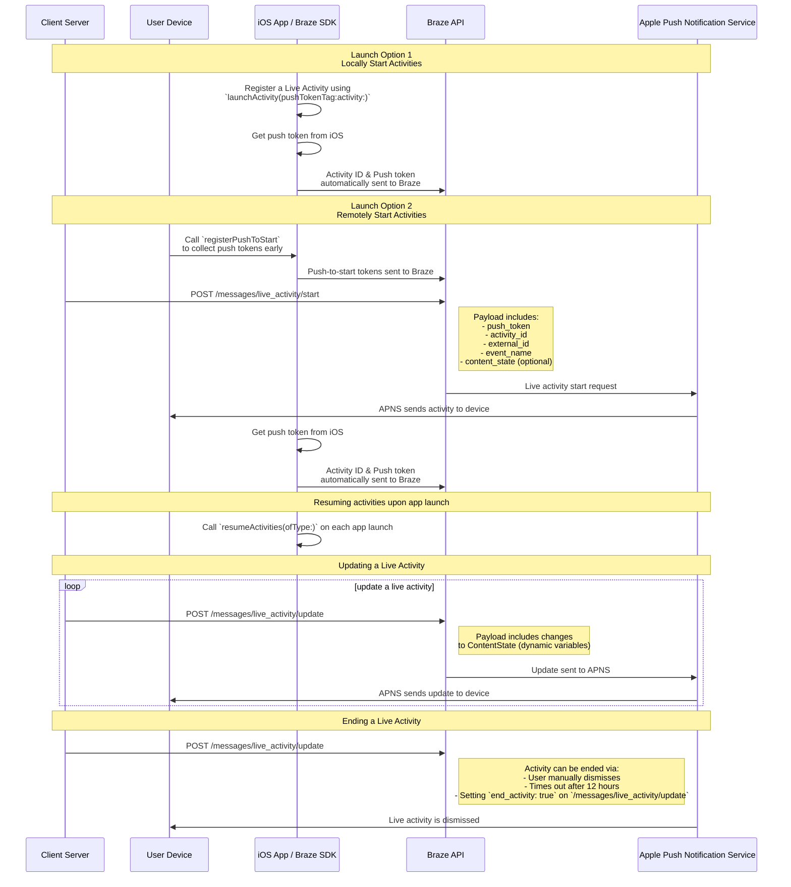

# Swift のライブアクティビティ {#live-activities-for-swift}

> Swift Braze SDK用にライブアクティビティを実装する方法について説明します。ライブアクティビティは、ロック画面に直接表示される永続的でインタラクティブな通知で、ユーザーはデバイスのロックを解除することなく、ダイナミックなリアルタイム更新を得ることができます。

## 仕組み {#how-it-works}

{: style="max-width:40%;float:right;margin-left:15px;"}

ライブアクティビティは、静的情報と更新可能な動的情報を組み合わせて表示します。たとえば、配達のステータス追跡機能を提供するライブアクティビティを作成できます。このライブアクティビティには、会社名が静的情報として含まれ、さらに配達ドライバーが目的地に近づくにつれて更新される「配達までの時間」が動的情報として含まれます。

開発者はBrazeを使用して、ライブアクティビティのライフサイクルを管理し、Braze REST APIを呼び出してライブアクティビティの更新を行い、サブスクライブ済みのすべてのデバイスが可能な限り早く更新を受信できるようにすることができます。また、Brazeでライブアクティビティを管理しているため、プッシュ通知、アプリ内メッセージ、Content Cardsなど、その他のメッセージングチャネルと連携させて活用を促進できます。

## シーケンス図 {#sequence-diagram}









## ライブアクティビティの実装 {#implementing-a-live-activity}

# 以下の項目も完了する必要があります。

- プロジェクトがiOS 16.1以降をターゲットにしていることを確認します。
- Xcodeプロジェクトの**Signing & Capabilities**に`Push Notification`エンタイトルメントを追加します。
- 通知の送信に`.p8`キーが使用されていることを確認します。`.p12`や`.pem`などの古いファイルはサポートされていません。
- Braze Swift SDKのバージョン8.2.0以降では、[ライブアクティビティをリモートで登録](#swift_step-2-start-the-activity)できます。この機能を使用するには、iOS 17.2以降が必要です。


ライブアクティビティとプッシュ通知は似ていますが、システム権限は別個のものです。デフォルトでは、すべてのライブアクティビティ機能が有効になっていますが、ユーザーはアプリごとにこの機能を無効にすることができます。




### ステップ 1: アクティビティを作成する {#create-an-activity}

まず、Appleのドキュメントの[ライブアクティビティでライブデータを表示する](https://developer.apple.com/documentation/activitykit/displaying-live-data-with-live-activities)手順に従い、iOSアプリケーションにライブアクティビティをセットアップします。このタスクの一部として、`Info.plist`に`NSSupportsLiveActivities`を`YES`に設定して含めてください。

ライブアクティビティの正確な内容はビジネスケースに固有であるため、[Activity](https://developer.apple.com/documentation/activitykit/activityattributes)オブジェクトを設定して初期化する必要があります。以下を定義することが重要です。
* `ActivityAttributes`: このプロトコルは、ライブアクティビティに表示される静的（不変）コンテンツと動的（可変）コンテンツを定義します。
* `ActivityAttributes.ContentState`: この型は、アクティビティの進行に伴って更新される動的データを定義します。

また、SwiftUIを使用して、サポートされているデバイスでロック画面とダイナミックアイランドのUI表示を作成します。

ライブアクティビティに関するAppleの[前提条件と制限](https://developer.apple.com/documentation/activitykit/displaying-live-data-with-live-activities#Understand-constraints)をよく理解してください。これらの制約はBrazeとは独立しています。


同じライブアクティビティに頻繁にプッシュを送信する場合は、`Info.plist`ファイルで`NSSupportsLiveActivitiesFrequentUpdates`を`YES`に設定することで、Appleの予算制限によるスロットリングを回避できます。詳細については、ActivityKitドキュメントの[`Determine the update frequency`](https://developer.apple.com/documentation/activitykit/updating-and-ending-your-live-activity-with-activitykit-push-notifications#Determine-the-update-frequency)セクションを参照してください。


#### 例 {#example}

競争している2つの野生動物救助チームに、保護しているフクロウに対してポイントが与えられるSuperb Owlショーの更新をユーザーに提供するライブアクティビティを作成すると想定してみましょう。この例では、`SportsActivityAttributes`という構造体を作成しましたが、`ActivityAttributes`の独自の実装を使用することもできます。

```swift
#if canImport(ActivityKit)
  import ActivityKit
#endif

@available(iOS 16.1, *)
struct SportsActivityAttributes: ActivityAttributes {
  public struct ContentState: Codable, Hashable {
    var teamOneScore: Int
    var teamTwoScore: Int
  }

  var gameName: String
  var gameNumber: String
}
```

### ステップ 2: アクティビティを開始する {#start-the-activity}

まず、アクティビティの登録方法を選択します。

- **リモート:** [`registerPushToStart`](<http://braze-inc.github.io/braze-swift-sdk/documentation/brazekit/braze/liveactivities-swift.class/registerpushtostart(fortype:name:)>)メソッドをユーザーライフサイクルの早い段階で、push-to-startトークンが必要になる前に呼び出し、[`/messages/live_activity/start`]({{site.baseurl}}/api/endpoints/messaging/live_activity/start)エンドポイントを使用してアクティビティを開始します。
- **ローカル:** ライブアクティビティのインスタンスを作成し、[`launchActivity`](<https://braze-inc.github.io/braze-swift-sdk/documentation/brazekit/braze/liveactivities-swift.class/launchactivity(pushtokentag:activity:fileid:line:)>)メソッドを使用して、Brazeが管理するプッシュトークンを作成します。




ライブアクティビティをリモートで登録するには、iOS 17.2以降が必要です。


#### ステップ 2.1: BrazeKitをウィジェット拡張に追加する {#step-21-add-brazekit-to-your-widget-extension}

Xcodeプロジェクトで、アプリの名前を選択し、**General**を選択します。**Frameworks and Libraries**の下に`BrazeKit`がリストされていることを確認します。


#### ステップ 2.2: BrazeLiveActivityAttributesプロトコルを追加する {#brazeActivityAttributes}

`ActivityAttributes`の実装に`BrazeLiveActivityAttributes`プロトコルへの準拠を追加し、属性モデルに`brazeActivityId`プロパティを追加します。


iOSは`brazeActivityId`プロパティをライブアクティビティのpush-to-startペイロードの対応するフィールドにマップするため、名前を変更したり、他の値を割り当てたりしないでください。


```swift
import BrazeKit

#if canImport(ActivityKit)
  import ActivityKit
#endif

@available(iOS 16.1, *)
// 1. Add the `BrazeLiveActivityAttributes` conformance to your `ActivityAttributes` struct.
struct SportsActivityAttributes: ActivityAttributes, BrazeLiveActivityAttributes {
  public struct ContentState: Codable, Hashable {
    var teamOneScore: Int
    var teamTwoScore: Int
  }

  var gameName: String
  var gameNumber: String

  // 2. Add the `String?` property to represent the activity ID.
  var brazeActivityId: String?
}
```

#### ステップ 2.3: push-to-startの登録 {#step-23-register-for-push-to-start}

次にライブアクティビティのタイプを登録し、そのタイプに関連付けられたすべてのpush-to-startトークンとライブアクティビティインスタンスをBrazeが追跡できるようにします。


iOSオペレーティングシステムは、デバイスが再起動した後の最初のアプリインストール時にのみpush-to-startトークンを生成します。トークンが確実に登録されるようにするには、`didFinishLaunchingWithOptions`メソッドで`registerPushToStart`を呼び出してください。


##### 例

次の例では、`LiveActivityManager`クラスがライブアクティビティオブジェクトを処理します。次に、`registerPushToStart`メソッドが`SportsActivityAttributes`を登録します。

```swift
import BrazeKit

#if canImport(ActivityKit)
  import ActivityKit
#endif

class LiveActivityManager {

  @available(iOS 17.2, *)
  func registerActivityType() {
    // This method returns a Swift background task.
    // You may keep a reference to this task if you need to cancel it wherever appropriate, or ignore the return value if you wish.
    let pushToStartObserver: Task = Self.braze?.liveActivities.registerPushToStart(
      forType: Activity<SportsActivityAttributes>.self,
      name: SportsActivityAttributes.name
    )
  }

}
```

#### ステップ 2.4: push-to-start通知を送信する {#step-24-send-a-push-to-start-notification}

[`/messages/live_activity/start`]({{site.baseurl}}/api/endpoints/messaging/live_activity/start)エンドポイントを使用してリモートのpush-to-start通知を送信します。



[AppleのActivityKitフレームワーク](https://developer.apple.com/documentation/activitykit)を使用して、Braze SDKが管理できるプッシュトークンを取得できます。これにより、BrazeがバックエンドでAppleプッシュ通知サービス（APNs）にプッシュトークンを送信するため、Braze APIを通じてライブアクティビティを更新できます。

1. AppleのActivityKit APIを使用して、ライブアクティビティ実装のインスタンスを作成します。
2. `pushType`パラメータを`.token`に設定します。
3. 定義したライブアクティビティの`ActivitiesAttributes`と`ContentState`を渡します。
4. [`launchActivity(pushTokenTag:activity:)`](https://braze-inc.github.io/braze-swift-sdk/documentation/brazekit/braze/liveactivities-swift.class)に渡して、Brazeインスタンスにアクティビティを登録します。`pushTokenTag`パラメータは、定義するカスタム文字列です。作成するライブアクティビティごとに一意である必要があります。

ライブアクティビティを登録すると、Braze SDKはプッシュトークンの変化を抽出して監視します。

#### 例

この例では、ライブアクティビティオブジェクトのインターフェイスとして`LiveActivityManager`というクラスを作成します。次に、`pushTokenTag`を`"sports-game-2024-03-15"`に設定します。

```swift
import BrazeKit

#if canImport(ActivityKit)
  import ActivityKit
#endif

class LiveActivityManager {

  @available(iOS 16.2, *)
  func createActivity() {
    let activityAttributes = SportsActivityAttributes(gameName: "Superb Owl", gameNumber: "Game 1")
    let contentState = SportsActivityAttributes.ContentState(teamOneScore: "0", teamTwoScore: "0")
    let activityContent = ActivityContent(state: contentState, staleDate: nil)
    if let activity = try? Activity.request(attributes: activityAttributes,
                                            content: activityContent,
      // Setting your pushType as .token allows the Activity to generate push tokens for the server to watch.
                                            pushType: .token) {
      // Register your Live Activity with Braze using the pushTokenTag.
      // This method returns a Swift background task.
      // You may keep a reference to this task if you need to cancel it wherever appropriate, or ignore the return value if you wish.
      let liveActivityObserver: Task = AppDelegate.braze?.liveActivities.launchActivity(pushTokenTag: "sports-game-2024-03-15",
                                                                                        activity: activity)
    }
  }

}
```

ライブアクティビティウィジェットによって、この初期コンテンツがユーザーに表示されます。

{: style="max-width:40%;"}



### ステップ 3: アクティビティトラッキングを再開する {#resume-activity-tracking}

Brazeがアプリ起動時にライブアクティビティを追跡できるようにするには、次の手順を実行します。

1. `AppDelegate`ファイルを開きます。
2. 使用可能な場合は、`ActivityKit`モジュールをインポートします。
3. アプリケーションで登録したすべての`ActivityAttributes`タイプについて、`application(_:didFinishLaunchingWithOptions:)`で[`resumeActivities(ofType:)`](https://braze-inc.github.io/braze-swift-sdk/documentation/brazekit/braze/liveactivities-swift.class/resumeactivities(oftype:))を呼び出します。

これにより、Brazeはすべてのアクティブなライブアクティビティのプッシュトークン更新を追跡するタスクを再開できます。ユーザーがデバイス上のライブアクティビティを明示的に削除した場合、そのアクティビティは削除されたと見なされ、Brazeはそれを追跡しなくなります。

#### 例

```swift
import UIKit
import BrazeKit

#if canImport(ActivityKit)
  import ActivityKit
#endif

@main
class AppDelegate: UIResponder, UIApplicationDelegate {

  static var braze: Braze? = nil

  func application(
    _ application: UIApplication,
    didFinishLaunchingWithOptions launchOptions: [UIApplication.LaunchOptionsKey: Any]?
  ) -> Bool {

    if #available(iOS 16.1, *) {
      Self.braze?.liveActivities.resumeActivities(
        ofType: Activity<SportsActivityAttributes>.self
      )
    }

    return true
  }
}
```

### ステップ 4: アクティビティを更新する {#update-the-activity}

{: style="max-width:40%;float:right;margin-left:15px;"}

[`/messages/live_activity/update`]({{site.baseurl}}/api/endpoints/messaging/live_activity/update)エンドポイントを使用すると、Braze REST APIを介して渡されたプッシュ通知を通じてライブアクティビティを更新できます。このエンドポイントを使用して、ライブアクティビティの`ContentState`を更新します。

`ContentState`を更新すると、ライブアクティビティウィジェットに新しい情報が表示されます。前半終了時のSuperb Owlショーの表示例を以下に示します。

詳細については、[`/messages/live_activity/update`エンドポイント]({{site.baseurl}}/api/endpoints/messaging/live_activity/update)の記事を参照してください。

### ステップ 5: アクティビティを終了する {#end-the-activity}

ライブアクティビティがアクティブな場合、ユーザーのロック画面とダイナミックアイランドの両方に表示されます。Brazeを通じて終了するには、[`/messages/live_activity/update`]({{site.baseurl}}/api/endpoints/messaging/live_activity/update)エンドポイントで`end_activity`を`true`に設定します。

ライブアクティビティの終了の信頼性を向上させるには、以下のオプションの手順を実行します。

1. 同じ`update`リクエストにオプションで`dismissal_date`を含め、iOSがライブアクティビティUIを削除するタイミングを指定します。
2. [メッセージアクティビティログ]({{site.baseurl}}/user_guide/administrative/app_settings/message_activity_log_tab)で配信結果を確認します。

#### 自動削除の設定 {#arranging-automatic-dismissal}

自動削除を設定するには、ライブアクティビティを開始した後に、更新エンドポイントへのフォローアップリクエストをスケジュールします。

1. 追跡可能な`activity_id`を含む`/messages/live_activity/start`リクエストを送信します。
2. その`activity_id`とターゲット終了時刻をバックエンドスケジューラーに保存します。
3. ターゲット終了時刻に、`end_activity`を`true`に設定した`/messages/live_activity/update`リクエストを送信します。
4. 同じ更新リクエストで削除日を設定します。詳細については、[`/messages/live_activity/update`]({{site.baseurl}}/api/endpoints/messaging/live_activity/update)エンドポイントを参照してください。

削除のタイミングはiOSによって制御されることに注意してください。有効な終了リクエストを送信した後でも、ロック画面やダイナミックアイランドからの削除は、OSレベルの条件に基づいて遅延したり、異なる動作をしたりする場合があります。

ライブアクティビティはBrazeの外部でも終了できます。

* **ユーザーによる削除**: ユーザーは手動でライブアクティビティを削除できます。
* **タイムアウト**: デフォルトの8時間が経過すると、iOSはユーザーのダイナミックアイランドからライブアクティビティを削除します。デフォルトの12時間が経過すると、iOSはユーザーのロック画面からライブアクティビティを削除します。

詳細については、[`/messages/live_activity/update`エンドポイント]({{site.baseurl}}/api/endpoints/messaging/live_activity/update)の記事を参照してください。

## ライブアクティビティのトラッキング {#tracking-live-activities}

ライブアクティビティのイベントは、Currents、Snowflakeデータ共有、およびクエリビルダーで利用できます。以下のイベントは、ライブアクティビティのライフサイクルの理解と監視、トークンの利用可能性の追跡、問題の独立した診断や配信ステータスの確認に役立ちます。

- [ライブアクティビティのPush To Startトークン変更]({{site.baseurl}}/user_guide/data/braze_currents/event_glossary/customer_behavior_events#live-activity-push-to-start-token-change-events): push-to-start（PTS）トークンがBrazeで追加または更新されたタイミングをキャプチャし、ユーザーごとのトークン登録状況と利用可能性を追跡できます。
- [ライブアクティビティ更新トークンの変更]({{site.baseurl}}/user_guide/data/braze_currents/event_glossary/customer_behavior_events#live-activity-update-token-change-events): ライブアクティビティ更新（LAU）トークンの追加、更新、または削除を追跡します。
- [ライブアクティビティ送信]({{site.baseurl}}/user_guide/data/braze_currents/event_glossary/message_engagement_events#live-activity-send-events): Brazeによってライブアクティビティが開始、更新、または終了されるたびにログを記録します。
- [ライブアクティビティの結果]({{site.baseurl}}/user_guide/data/braze_currents/event_glossary/message_engagement_events#live-activity-outcome-events): Brazeから送信された各ライブアクティビティについて、Appleプッシュ通知サービス（APNs）への最終的な配信ステータスを示します。

## ライブアクティビティ送信の確認 {#verify-live-activity-sends}

ワークスペースがiOSライブアクティビティを送信しているかどうかを確認する必要がある場合は、以下の方法を使用できます。

### メッセージアクティビティログ {#message-activity-log}

**設定** > **メッセージアクティビティログ**に移動し、ライブアクティビティのエラーでフィルタリングして、予想される期間中のライブアクティビティ関連の配信結果を確認します。詳細については、[メッセージアクティビティログ]({{site.baseurl}}/user_guide/administer/global/workspace_settings/logs_and_alerts/message_activity_log)を参照してください。

### クエリビルダー、Currents、またはSnowflakeデータ共有 {#query-builder-currents-or-snowflake-data-sharing}

以下のライブアクティビティイベントを確認して、ライブアクティビティのライフサイクルと配信を検証します。

- **ライブアクティビティ送信:** Brazeによってライブアクティビティが開始、更新、または終了されるたびにログを記録します
- **ライブアクティビティの結果:** 送信された各ライブアクティビティについて、APNsへの最終的な配信ステータスを示します

オプションで、トークンの利用可能性シグナルも確認できます。
- **ライブアクティビティのPush To Startトークン変更**
- **ライブアクティビティ更新トークンの変更**

### API使用状況ダッシュボード {#api-usage-dashboard}

**設定** > **APIキー** > **ダッシュボード**に移動し、**フィルター**を選択して**エンドポイント**でフィルタリングし、APIレスポンスを確認します。たとえば、`/messages/live_activity/update`（または`/messages/live_activity/start`）を選択して、過去30日間のリクエスト量を表示します。APIレスポンスは、APIが呼び出されており、このワークスペースでiOSライブアクティビティ通知が使用されていることを示します。詳細については、[API使用状況ダッシュボード]({{site.baseurl}}/user_guide/analytics/dashboards/api_usage)を参照してください。

## ライブアクティビティイベントの監視（オプション） {#observe-live-activity-events}




以下のActivityKitストリームをAppleに直接サブスクライブしないでください。Brazeのサブスクリプションと競合し、ライブアクティビティが正しく機能しなくなります。

1. [`pushTokenUpdates`](https://developer.apple.com/documentation/activitykit/activity/pushtokenupdates-swift.property)
2. [`activityStateUpdates`](https://developer.apple.com/documentation/activitykit/activity/activitystateupdates-swift.property)
3. [`contentUpdates`](https://developer.apple.com/documentation/activitykit/activity/contentupdates-swift.property)
4. [`pushToStartTokenUpdates`](https://developer.apple.com/documentation/activitykit/activity/pushtostarttokenupdates)
5. [`activityUpdates`](https://developer.apple.com/documentation/activitykit/activity/activityupdates-swift.type.property)

代わりに、以下で説明するサブスクリプションを使用してください。


Braze SDKは、`braze.liveActivities`に2つのサブスクリプションメソッドを提供し、ライブアクティビティの完全なライフサイクルを監視できます。詳細なステップバイステップのウォークスルーについては、[ライブアクティビティチュートリアル](https://braze-inc.github.io/braze-swift-sdk/tutorials/brazekit/b4-live-activities)を参照してください。

- [`subscribeToStateUpdates(_:)`](#subscribe-to-state-updates): push-to-startトークン登録と実行中のアクティビティインスタンスの両方のライフサイクルイベントを配信します。
- [`subscribeToErrors(_:)`](#subscribe-to-errors): ライブアクティビティのトラッキング中に発生したSDKおよびサーバー側のエラーを配信します。


両方のメソッドは[`Braze.Cancellable`](https://braze-inc.github.io/braze-swift-sdk/documentation/brazekit/braze/cancellable-swift.typealias)を返します。サブスクリプションは、返された値が強参照で保持されている限りアクティブなままです（たとえば、`Braze`インスタンスと同じライフサイクルを持つプロパティに格納します）。


### サブスクリプションの設定 {#set-up-subscriptions}

`application(_:didFinishLaunchingWithOptions:)`でサブスクリプションを一度設定し、アプリのライフタイム全体にわたって保持します。

```swift
class AppDelegate: UIResponder, UIApplicationDelegate {
  static var braze: Braze?

  var stateSubscription: Braze.Cancellable?
  var errorSubscription: Braze.Cancellable?

  func application(
    _ application: UIApplication,
    didFinishLaunchingWithOptions launchOptions: [UIApplication.LaunchOptionsKey: Any]?
  ) -> Bool {
    let braze = Braze(configuration: config)
    Self.braze = braze

    if #available(iOS 16.1, *) {
      stateSubscription = Self.braze?.liveActivities.subscribeToStateUpdates { event in
        self.handleStateUpdate(event)
      }
      errorSubscription = Self.braze?.liveActivities.subscribeToErrors { error in
        self.handleLiveActivityError(error)
      }
    }

    return true
  }
}
```


コールバックは将来のライブアクティビティイベントに対してのみトリガーされます。サブスクリプション時の現在の状態はリプレイされません。現在の状態のスナップショットを取得するには、`Activity<T>.activities`を使用してください。


### subscribeToStateUpdates {#subscribe-to-state-updates}

`subscribeToStateUpdates(_:)`は、ライブアクティビティの完全なライフサイクルをカバーする`UpdateEvent`値を配信します。イベントは2つのスコープに分かれています。

- `.activityType(ActivityType)`: push-to-startトークン登録のためのタイプレベルイベント（iOS 17.2以降）。アクティビティインスタンスはまだ存在しません。
- `.activityInstance(ActivityInstance)`: 特定の実行中のアクティビティのインスタンスレベルイベント。

複数のサブスクライバーがサポートされており、各アクティブなサブスクリプションはすべてのイベントを独立して受信します。

#### タイプスコープのイベント {#type-scoped-events}

| イベント | 発火タイミング |
| ----- | ------------- |
| `.pushToStartTokenRead(activityType:)` | push-to-startトークンがOSから読み取られました。Brazeはこのタイプの新しいアクティビティをリモートで開始できるようになりました。 |
| `.pushToStartTokenFlushed(activityType:)` | トークンがBrazeサーバーに送信されました。Brazeはこのタイプのpush-to-start通知を送信できます。 |
| `.pushToStartOptedOut(activityType:)` | ユーザーが`optOutPushToStart(type:)`を通じてこのアクティビティタイプのpush-to-startをオプトアウトしました。 |
| `.pushToStartOptOutFlushed(activityType:)` | オプトアウトがBrazeサーバーに送信されました。 |
{: .reset-td-br-1 .reset-td-br-2 aria-label="タイプスコープのイベント" }

#### インスタンススコープのイベント {#instance-scoped-events}

| イベント | 発火タイミング |
| ----- | ------------- |
| `.started(activityId:activityType:pushTokenTag:launchSource:)` | SDKが`launchActivity(pushTokenTag:activity:)`を通じてこのアクティビティの追跡を開始しました。`launchSource`の値は、アプリが開始したアクティビティの場合は`.local`、リモートで開始されたアクティビティの場合は`.pushToStart`です。 |
| `.resumed(activityId:activityType:pushTokenTag:)` | SDKが`resumeActivities(ofType:)`を通じてこのアクティビティの追跡を再開しました。 |
| `.pushTokenFlushed(activityId:activityType:pushTokenTag:)` | アクティビティのプッシュトークンがBrazeサーバーに受け入れられました。アクティビティはリモート更新を受信できるようになりました。 |
| `.active(activityId:activityType:)` | アクティビティは現在アクティブで、ユーザーに表示されています。 |
| `.stale(activityId:activityType:staleDate:)` | アクティビティのコンテンツが古くなりました。iOS 16.2以降でのみ発行されます。 |
| `.dismissed(activityId:activityType:)` | ユーザーがアクティビティを手動で削除しました。 |
| `.ended(activityId:activityType:)` | アクティビティが終了しました。 |
| `.contentUpdated(activityId:activityType:)` | アクティビティのコンテンツ状態が更新されました（iOS 16.2以降）。カスタムロジックを使用して、`Activity.activities`からIDで`Activity<T>`を検索し、`activity.content.state`を通じて型付き状態にアクセスします。 |
| `.pushTokenUpdated(activityId:activityType:)` | ActivityKitがアクティビティのプッシュトークンをローテーションしました。 |
{: .reset-td-br-1 .reset-td-br-2 aria-label="インスタンススコープのイベント" }

##### 例

```swift
func handleStateUpdate(_ event: Braze.LiveActivities.UpdateEvent) {
  switch event {

  // Type-scoped: push-to-start token lifecycle (iOS 17.2+)
  case .activityType(.pushToStartTokenRead(let activityType)):
    print("[\(activityType)] Push-to-start token read by SDK")

  // ...

  // Instance-scoped: SDK tracking
  case .activityInstance(.started(let id, let type, let tag, let source)):
    print("[\(type)] Activity \(id) started via \(source), tag: \(tag)")

  // ...

  // Instance-scoped: ActivityKit lifecycle
  case .activityInstance(.active(let id, let type)):
    print("[\(type)] Activity \(id) is active")

  // ...

  case .activityInstance(.ended(let id, let type)):
    print("[\(type)] Activity \(id) ended")

  // Instance-scoped: content updates (iOS 16.2+)
  case .activityInstance(.contentUpdated(let id, let type)):
    // For more advanced use cases of `contentUpdated`, see the section below
    print("[\(type)] Content updated for activity \(id)")

  case .activityInstance(.pushTokenUpdated(let id, let type)):
    print("[\(type)] Activity \(id) push token rotated")
  }
}
```

### subscribeToErrors {#subscribe-to-errors}

`subscribeToErrors(_:)`は、`UpdateEvent`と同じ2つのスコープを使用して`ErrorEvent`値を配信します。

- `.activityType(ActivityType)`: push-to-start登録失敗のタイプレベルエラー。
- `.activityInstance(ActivityInstance)`: 実行中のアクティビティのインスタンスレベルエラー。

リトライが適切かどうかを判断するには、`isTransient`フラグを使用します。SDKは一時的な失敗を自動的にリトライします。

#### タイプスコープのエラー {#type-scoped-errors}

| エラー | 発火タイミング |
| ----- | ------------- |
| `.pushToStartRegistrationFailed(activityType:isTransient:reason:)` | push-to-startトークンがBrazeサーバーに到達できませんでした。 |
{: .reset-td-br-1 .reset-td-br-2 aria-label="タイプスコープのエラー" }

#### インスタンススコープのエラー {#instance-scoped-errors}

| エラー | 発火タイミング |
| ----- | ------------- |
| `.registrationFailed(activityId:activityType:pushTokenTag:isTransient:reason:)` | アクティビティのプッシュトークンがBrazeへの登録に失敗しました。 |
| `.activityNotFound(activityId:activityType:)` | `resumeActivities(ofType:)`が、もう実行されていないアクティビティの保存済みマッピングを検出しました。アプリが強制終了されている間にアクティビティが終了した可能性があります。 |
| `.invalidPushTokenTag(activityId:activityType:tag:)` | `launchActivity(pushTokenTag:activity:)`が無効なタグで呼び出されました。タグは空でなく、256バイト未満である必要があります。 |
{: .reset-td-br-1 .reset-td-br-2 aria-label="インスタンススコープのエラー" }

##### 例

```swift
func handleLiveActivityError(_ error: Braze.LiveActivities.ErrorEvent) {
  switch error {

  // Type-scoped errors
  case .activityType(.pushToStartRegistrationFailed(let type, let isTransient, let reason)):
    if isTransient {
      print("[\(type)] Push-to-start registration failed (transient, will retry): \(reason)")
    } else {
      print("[\(type)] Push-to-start registration failed (permanent): \(reason)")
    }

  // Instance-scoped errors
  case .activityInstance(.registrationFailed(let id, let type, _, let isTransient, let reason)):
    if isTransient {
      print("[\(type)] Activity \(id) registration failed (transient, retrying): \(reason)")
    } else {
      print("[\(type)] Activity \(id) registration failed (permanent): \(reason)")
    }

  case .activityInstance(.activityNotFound(let id, let type)):
    print("[\(type)] Stored activity \(id) not found on resume")

  case .activityInstance(.invalidPushTokenTag(let id, let type, let tag)):
    print("[\(type)] Activity \(id) has invalid push token tag '\(tag)'")
  }
}
```

### コンテンツ状態の更新を処理する（オプション） {#handle-content-state}

実際のライブアクティビティインスタンスのコンテンツ状態を使用する場合は、このセクションに従ってください。

`.contentUpdated`イベントが発火したら、カスタムロジックを使用して`Activity.activities`からIDで実行中の`Activity<T>`を検索し、`activity.content.state`を通じて型付き`ContentState`にアクセスします。

#### 単一の属性タイプ {#single-attributes-type}

```swift
case .activityInstance(.contentUpdated(let id, let type)):
  #if canImport(ActivityKit)
    // Add custom logic look up the Activity<T> by ID and access your app's typed ContentState.
    // In this example, `SportsActivityAttributes` is the app's custom type.
    if #available(iOS 16.2, *),
      let activity = findActivityInstance(id: id, as: SportsActivityAttributes.self)
    {
      // `activityContent` is now strongly typed as a `SportsActivityAttributes`
      let activityContent = activity.content.state
      print("[\(type)] Game \(id) — score: \(activityContent.teamOneScore)–\(activityContent.teamTwoScore)")
      return
    }
  #endif
  print("[\(type)] Content updated for activity \(id)")

// ...

// - MARK: Helper methods

@available(iOS 16.2, *)
func findActivityInstance<Attributes: ActivityAttributes>(
  id: String,
  as type: Attributes.Type
) -> Activity<Attributes>? {
  // Use Apple's API to find the matching Live Activity instance:
  // - https://developer.apple.com/documentation/activitykit/activity/activities
  Activity<Attributes>.activities.first(where: { $0.id == id })
}
```

#### 複数の属性タイプ {#multiple-attributes-types}

アプリが複数の`ActivityAttributes`タイプを使用している場合は、`type`文字列を確認して適切な`Activity<T>`を検索します。

```swift
case .activityInstance(.contentUpdated(let id, let type)):
  #if canImport(ActivityKit)
    if #available(iOS 16.2, *) {
      if type == SportsActivityAttributes.name,
        let activity = findActivityInstance(id: id, as: SportsActivityAttributes.self)
      {
        let activityContent = activity.content.state
        print("[\(type)] Game \(id) — score: \(activityContent.teamOneScore)–\(activityContent.teamTwoScore)")
        return

      } else if type == OrderActivityAttributes.name,
        let activity = findActivityInstance(id: id, as: OrderActivityAttributes.self)
      {
        let activityContent = activity.content.state
        print("[\(type)] Order \(id) — status: \(activityContent.status), ETA: \(activityContent.eta)")
        return
      }
    }
  #endif
  print("[\(type)] Content updated for activity \(id)")

// ...

// - MARK: Helper methods

@available(iOS 16.2, *)
func findActivityInstance<Attributes: ActivityAttributes>(
  id: String,
  as type: Attributes.Type
) -> Activity<Attributes>? {
  // Use Apple's API to find the matching Live Activity instance:
  // - https://developer.apple.com/documentation/activitykit/activity/activities
  Activity<Attributes>.activities.first(where: { $0.id == id })
}
```

## よくある質問（FAQ） {#faq}

### 機能とサポート {#functionality-and-support}

#### ライブアクティビティをサポートしているプラットフォームは？ {#what-platforms-support-live-activities}

現在、ライブアクティビティはiOSとiPadOSに固有の機能です。デフォルトでは、iPhoneやiPadで起動したアクティビティは、ペアリングされたwatchOS 11以降またはmacOS 26以降のデバイスにも表示されます。

{: style="max-width:60%;"}

ライブアクティビティの記事では、Braze Swift SDKを使用してライブアクティビティを管理するための[前提条件]({{site.baseurl}}/developer_guide/platforms/swift/live_activities#prerequisites)について説明しています。

#### React Nativeアプリはライブアクティビティをサポートしていますか？ {#do-react-native-apps-support-live-activities}

はい、React Native SDK 3.0.0以降は、Braze Swift SDKを介してライブアクティビティをサポートしています。つまり、Braze Swift SDKの上に直接React Native iOSのコードを記述する必要があります。

Appleが提供するライブアクティビティ機能は、JavaScriptでは変換できない言語機能（Swift Concurrency、generics、SwiftUIなど）を使用しているため、ライブアクティビティ用のReact Native固有のJavaScriptコンビニエンスAPIは存在しません。

#### BrazeはCampaignやCanvasステップとしてのライブアクティビティをサポートしていますか？ {#does-braze-support-live-activities-as-a-campaign-or-canvas-step}

いいえ、現在サポートされていません。

### プッシュ通知とライブアクティビティ {#push-notifications-and-live-activities}

#### ライブアクティビティがアクティブな状態でプッシュ通知が送信された場合はどうなりますか？ {#what-happens-if-a-push-notification-is-sent-while-a-live-activity-is-active}

{: style="max-width:30%;float:right;margin-left:15px;"}

ライブアクティビティとプッシュ通知は異なる画面領域を占有するため、ユーザーの画面上で競合することはありません。

#### ライブアクティビティがプッシュメッセージ機能を活用する場合、ライブアクティビティを受信するためにプッシュ通知を有効にする必要がありますか？ {#if-live-activities-leverage-push-message-functionality-do-push-notifications-need-to-be-enabled-to-receive-live-activities}

ライブアクティビティは更新にプッシュ通知を利用しますが、異なるユーザー設定によって制御されています。ユーザーはライブアクティビティにオプトインしつつプッシュ通知はオプトアウトでき、その逆も可能です。

ライブアクティビティ更新トークンは8時間後に期限切れになります。

#### ライブアクティビティにはプッシュプライマーが必要ですか？ {#do-live-activities-require-push-primers}

[プッシュプライマー]({{site.baseurl}}/user_guide/channels/push/best_practices/push_primer_messages)は、ユーザーにアプリからのプッシュ通知をオプトインするよう促すベストプラクティスです。しかし、ライブアクティビティにオプトインするためのシステムプロンプトはありません。デフォルトでは、ユーザーがiOS 16.1以降でアプリをインストールすると、そのアプリのライブアクティビティにオプトインされます。この権限は、アプリごとにデバイス設定で無効化または再有効化できます。

### 技術的なトピックとトラブルシューティング {#technical-topics-and-troubleshooting}

#### ライブアクティビティにエラーがあるかどうかを確認するには？ {#how-do-i-know-if-live-activities-has-errors}

ライブアクティビティのエラーは、Brazeダッシュボードの[メッセージアクティビティログ]({{site.baseurl}}/user_guide/administer/global/workspace_settings/logs_and_alerts/message_activity_log)に記録されます。ここで「LiveActivity Errors」でフィルタリングできます。

#### push-to-start通知を送信した後、ライブアクティビティを受信できないのはなぜですか？ {#after-sending-a-push-to-start-notification-why-havent-i-received-my-live-activity}

まず、[`messages/live_activity/start`]({{site.baseurl}}/api/endpoints/messaging/live_activity/start)エンドポイントで説明されているすべての必須フィールドがペイロードに含まれていることを確認します。`activity_attributes`および`content_state`フィールドは、プロジェクトのコードで定義されているプロパティと一致する必要があります。ペイロードが正しいことが確かな場合は、APNsによってレート制限されている可能性があります。この制限はBrazeではなくAppleによって課されています。

push-to-start通知がデバイスに正常に届いたがレート制限のために表示されなかったことを確認するには、Macのコンソールアプリを使用してプロジェクトをデバッグします。目的のデバイスの記録プロセスをアタッチし、検索バーで`process:liveactivitiesd`を使用してログをフィルタリングします。

#### push-to-startでライブアクティビティを開始した後、新しい更新を受信しないのはなぜですか？ {#after-starting-my-live-activity-with-push-to-start-why-isnt-it-receiving-new-updates}

[上記](#swift_brazeActivityAttributes)の手順が正しく実装されていることを確認してください。`ActivityAttributes`には、`BrazeLiveActivityAttributes`プロトコルへの準拠と`brazeActivityId`プロパティの両方が含まれている必要があります。

ライブアクティビティのpush-to-start通知を受信したら、Braze URLの`/push_token_tag`エンドポイントへの送信ネットワークリクエストが表示され、`"tag"`フィールドの下に正しいアクティビティIDが含まれていることを再確認してください。

最後に、更新ペイロード内のライブアクティビティ属性タイプが、SDKメソッド呼び出しの`registerPushToStart`で使用した文字列とクラスに完全に一致していることを確認してください。定数を使用してタイプミスを防いでください。

#### `live_activity/update`エンドポイントを使用しようとすると、アクセス拒否の応答が返されます。なぜですか？ {#i-am-receiving-an-access-denied-response-when-i-try-to-use-the-live_activityupdate-endpoint-why}

使用するAPIキーには、さまざまなBraze APIエンドポイントにアクセスするための適切な権限を付与する必要があります。以前に作成したAPIキーを使用している場合、権限の更新を忘れている可能性があります。[APIキーセキュリティの概要]({{site.baseurl}}/api/basics#rest-api-key-security)を確認してください。

#### `messages/send`エンドポイントは`messages/live_activity/update`エンドポイントとレート制限を共有していますか？ {#does-the-messagessend-endpoint-share-rate-limits-with-the-messageslive_activityupdate-endpoint}

デフォルトでは、`messages/live_activity/update`エンドポイントのレート制限は、ワークスペースごとに、複数のエンドポイントにわたって、1時間あたり250,000リクエストです。詳細については、[APIレート制限]({{site.baseurl}}/api/api_limits)を参照してください。