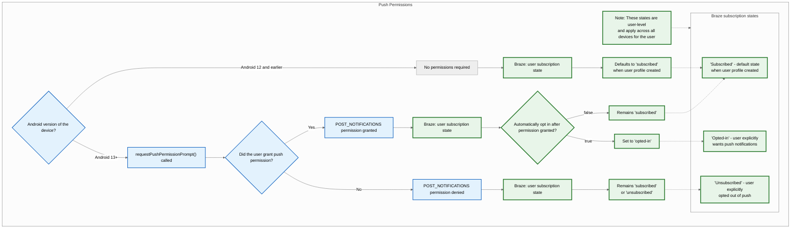
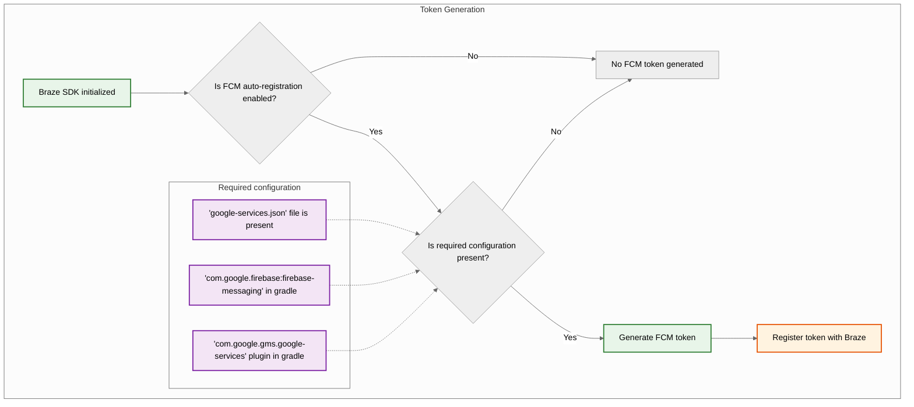
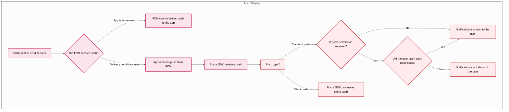



## 組み込み機能 {#built-in-features}

以下の機能は、Braze Android SDKに組み込まれています。その他のプッシュ通知機能を使用するには、アプリに[プッシュ通知を設定](#android_setting-up-push-notifications)する必要があります。

|機能|説明|
|-------|-----------|
|Push Stories|Android Push StoriesはデフォルトでBraze Android SDKに組み込まれています。詳細については、[Push Stories]({{site.baseurl}}/user_guide/message_building_by_channel/push/advanced_push_options/push_stories)を参照してください。|
|プッシュプライマー|プッシュプライマーキャンペーンは、ユーザーにデバイスでアプリのプッシュ通知を有効にするよう促します。これは、SDKのカスタマイズなしで[ノーコードプッシュプライマー]({{site.baseurl}}/user_guide/message_building_by_channel/push/best_practices/push_primer_messages)を使用して実現できます。|
{: .reset-td-br-1 .reset-td-br-2 aria-label="組み込み機能" }

## プッシュ通知のライフサイクルについて {#push-notification-lifecycle}

以下のフローチャートは、Brazeがプッシュ通知のライフサイクル（許可プロンプト、トークン生成、メッセージ配信など）をどのように処理するかを示しています。















## プッシュ通知の設定 {#setting-up-push-notifications}


Braze Android SDKでFCMを使用したサンプルアプリについては、[Braze: Firebase Push サンプルアプリ](https://github.com/braze-inc/braze-android-sdk/tree/master/samples/firebase-push)を参照してください。


### レート制限 {#rate-limits}

Firebase Cloud Messaging（FCM）APIのデフォルトのレート制限は、1分あたり600,000リクエストです。この制限に達した場合、Brazeは数分後に自動的に再試行します。引き上げをリクエストするには、[Firebase サポート](https://firebase.google.com/support)にお問い合わせください。

### ステップ1:Firebaseをプロジェクトに追加する {#step-1-add-firebase-to-your-project}

まず、FirebaseをAndroidプロジェクトに追加します。手順については、Googleの[Firebaseセットアップガイド](https://firebase.google.com/docs/android/setup)を参照してください。

### ステップ2:Cloud Messagingを依存関係に追加する {#step-2-add-cloud-messaging-to-your-dependencies}

次に、Cloud Messagingライブラリをプロジェクトの依存関係に追加します。Androidプロジェクトで`build.gradle`を開き、`dependencies`ブロックに以下の行を追加します。

```gradle
implementation "google.firebase:firebase-messaging:+"
```

依存関係は以下のようになります。

```gradle
dependencies {
  implementation project(':android-sdk-ui')
  implementation "com.google.firebase:firebase-messaging:+"
}
```

### ステップ3:Firebase Cloud Messaging APIを有効にする {#step-3-enable-the-firebase-cloud-messaging-api}

Google Cloudで、Androidアプリが使用しているプロジェクトを選択し、[Firebase Cloud Messaging API](https://console.cloud.google.com/apis/library/fcm.googleapis.com)を有効にします。

{: style="max-width:80%;"}

### ステップ4:サービスアカウントを作成する {#service-account}

次に、BrazeがFCMトークンの登録時に認可されたAPI呼び出しを行えるように、新しいサービスアカウントを作成します。Google Cloudで**Service Accounts**に移動し、プロジェクトを選択します。**Service Accounts**ページで**Create Service Account**を選択します。


サービスアカウント名、ID、説明を入力し、**Create and continue**を選択します。

**Role**フィールドで、ロールのリストから**Firebase Cloud Messaging API Admin**を見つけて選択します。より制限的なアクセスにするには、`cloudmessaging.messages.create`権限を持つ[カスタムロール](https://cloud.google.com/iam/docs/creating-custom-roles)を作成し、代わりにリストからそれを選択します。完了したら、**Done**を選択します。


**Firebase Cloud Messaging Admin**ではなく、**Firebase Cloud Messaging _API_ Admin**を選択してください。



### ステップ5:JSON認証情報を生成する {#json}

次に、FCMサービスアカウントのJSON認証情報を生成します。Google Cloud IAM & Adminで**Service Accounts**に移動し、プロジェクトを選択します。[先ほど作成した](#android_service-account)FCMサービスアカウントを見つけ、<i class="fa-solid fa-ellipsis-vertical" aria-label="アクションメニュー"></i>&nbsp;**Actions** > **Manage Keys**を選択します。


**Add Key** > **Create new key**を選択します。


**JSON**を選択し、**Create**を選択します。FCMプロジェクトIDとは異なるGoogle CloudプロジェクトIDを使用してサービスアカウントを作成した場合は、JSONファイル内の`project_id`に割り当てられた値を手動で更新する必要があります。

キーをダウンロードした場所を覚えておいてください&#8212;次のステップで必要になります。

{: style="max-width:65%;"}


秘密キーが漏洩した場合、セキュリティリスクとなる可能性があります。JSON認証情報は安全な場所に保管してください&#8212;Brazeにアップロードした後にキーを削除します。


### ステップ6:JSON認証情報をBrazeにアップロードする {#step-6-upload-your-json-credentials-to-braze}

次に、JSON認証情報をBrazeダッシュボードにアップロードします。Brazeで<i class="fa-solid fa-gear" aria-label="設定"></i>&nbsp;**設定** > **アプリ設定**を選択します。


Androidアプリの**Push Notification Settings**で**Firebase**を選択し、**Upload JSON File**を選択して[先ほど生成した](#android_json)認証情報をアップロードします。完了したら、**Save**を選択します。



秘密キーが漏洩した場合、セキュリティリスクとなる可能性があります。キーがBrazeにアップロードされたので、[先ほど生成した](#android_json)ファイルを削除してください。


### ステップ7:自動トークン登録を設定する {#step-7-set-up-automatic-token-registration}

ユーザーがプッシュ通知をオプトインすると、プッシュ通知を送信する前に、アプリがそのユーザーのデバイスでFCMトークンを生成する必要があります。Braze SDKを使用すると、プロジェクトのBraze設定ファイルで各ユーザーのデバイスに対するFCMトークンの自動登録を有効にできます。

まず、Firebase Consoleに移動してプロジェクトを開き、<i class="fa-solid fa-gear" aria-label="設定"></i>&nbsp;**Settings** > **Project settings**を選択します。


**Cloud Messaging**を選択し、**Firebase Cloud Messaging API (V1)**の下にある**Sender ID**フィールドの番号をコピーします。


次に、Android Studioプロジェクトを開き、Firebase Sender IDを使用して`braze.xml`または`BrazeConfig`内でFCMトークンの自動登録を有効にします。



FCMトークンの自動登録を設定するには、`braze.xml`ファイルに以下の行を追加します。

```xml
<bool translatable="false" name="com_braze_firebase_cloud_messaging_registration_enabled">true</bool>
<string translatable="false" name="com_braze_firebase_cloud_messaging_sender_id">FIREBASE_SENDER_ID</string>
```

`FIREBASE_SENDER_ID`をFirebaseプロジェクト設定からコピーした値に置き換えます。`braze.xml`は以下のようになります。

```xml
<?xml version="1.0" encoding="utf-8"?>
<resources>
  <string translatable="false" name="com_braze_api_key">12345ABC-6789-DEFG-0123-HIJK456789LM</string>
  <bool translatable="false" name="com_braze_firebase_cloud_messaging_registration_enabled">true</bool>
<string translatable="false" name="com_braze_firebase_cloud_messaging_sender_id">603679405392</string>
</resources>
```



FCMトークンの自動登録を設定するには、`BrazeConfig`に以下の行を追加します。



```java
.setIsFirebaseCloudMessagingRegistrationEnabled(true)
.setFirebaseCloudMessagingSenderIdKey("FIREBASE_SENDER_ID")
```


```kotlin
.setIsFirebaseCloudMessagingRegistrationEnabled(true)
.setFirebaseCloudMessagingSenderIdKey("FIREBASE_SENDER_ID")
```



`FIREBASE_SENDER_ID`をFirebaseプロジェクト設定からコピーした値に置き換えます。`BrazeConfig`は以下のようになります。



```java
BrazeConfig brazeConfig = new BrazeConfig.Builder()
  .setApiKey("12345ABC-6789-DEFG-0123-HIJK456789LM")
  .setCustomEndpoint("sdk.iad-01.braze.com")
  .setSessionTimeout(60)
  .setHandlePushDeepLinksAutomatically(true)
  .setGreatNetworkDataFlushInterval(10)
  .setIsFirebaseCloudMessagingRegistrationEnabled(true)
  .setFirebaseCloudMessagingSenderIdKey("603679405392")
  .build();
Braze.configure(this, brazeConfig);
```


```kotlin
val brazeConfig = BrazeConfig.Builder()
  .setApiKey("12345ABC-6789-DEFG-0123-HIJK456789LM")
  .setCustomEndpoint("sdk.iad-01.braze.com")
  .setSessionTimeout(60)
  .setHandlePushDeepLinksAutomatically(true)
  .setGreatNetworkDataFlushInterval(10)
  .setIsFirebaseCloudMessagingRegistrationEnabled(true)
  .setFirebaseCloudMessagingSenderIdKey("603679405392")
  .build()
Braze.configure(this, brazeConfig)
```







FCMトークンを手動で登録したい場合は、アプリの[`onCreate()`](https://developer.android.com/reference/android/app/Application.html#onCreate())メソッド内でBrazeインスタンスの[`registeredPushToken`](https://braze-inc.github.io/braze-android-sdk/kdoc/braze-android-sdk/com.braze/-i-braze/registered-push-token.html)プロパティを設定します。

```kotlin
// Kotlin
Braze.getInstance(context).registeredPushToken = "FCM_TOKEN"
```

```java
// Java
Braze.getInstance(context).setRegisteredPushToken("FCM_TOKEN");
```


#### 複数のFirebaseプロジェクトを使用する {#multiple-firebase-projects}

アプリが複数のFirebaseプロジェクトを使用している場合は、以下の手順に従ってください。

1. Brazeプッシュは、アプリの`google-services.json`から初期化されるデフォルトのFirebaseプロジェクトで維持します。
2. カスタムFirebaseメッセージングサービスを使用している場合は、[カスタムFirebaseメッセージングサービスでインストールIDを登録する](#android_register-installation-id-custom-firebase-service)を完了してください。
3. アプリが別の方法でプッシュトークンを取得する場合は、前述のヒントに示されているように`registeredPushToken`を手動で設定します。


Firebase Cloud Messagingには、手動で初期化した`FirebaseApp`からトークンを取得するためのサポートされたAPIはありません。`onNewToken`や`onRegistered`などの`FirebaseMessagingService`コールバックは、デフォルトプロジェクトに対してのみ発火します。詳細については、Firebaseドキュメントの[複数のプロジェクトを設定する](https://firebase.google.com/docs/projects/multiprojects)を参照してください。


バージョンの詳細については、[SDK変更ログ]({{site.baseurl}}/developer_guide/changelogs?sdktab=android)を参照してください。

### ステップ8:アプリケーションクラスの自動リクエストを削除する {#step-8-remove-automatic-requests-in-your-application-class}

サイレントプッシュ通知を送信するたびにBrazeが不要なネットワークリクエストをトリガーしないようにするには、`Application`クラスの`onCreate()`メソッドで設定されている自動ネットワークリクエストを削除します。詳細については、[Android Developer Reference: Application](https://developer.android.com/reference/android/app/Application)を参照してください。

## 通知の表示 {#displaying-notifications}

<a id="android_step-1-register-braze-firebase-messaging-service"></a>

### ステップ1:Braze Firebase Messaging Serviceを登録する {#register-braze-firebase-messaging-service}

新規、既存、またはBraze以外のFirebase Messaging Serviceを作成できます。具体的なニーズに最も適したものを選択してください。



Brazeには、プッシュの受信と開封インテントを処理するサービスが含まれています。`BrazeFirebaseMessagingService`クラスを`AndroidManifest.xml`に登録する必要があります。

```xml
<service android:name="com.braze.push.BrazeFirebaseMessagingService"
  android:exported="false">
  <intent-filter>
    <action android:name="com.google.firebase.MESSAGING_EVENT" />
  </intent-filter>
</service>
```

通知コードも`BrazeFirebaseMessagingService`を使用して、開封およびクリックアクションのトラッキングを処理します。このサービスが正しく機能するには、`AndroidManifest.xml`に登録する必要があります。また、Brazeはシステムからの通知に一意のキーをプレフィックスとして付加し、Brazeシステムから送信された通知のみをレンダリングするようにしています。他のFCMサービスから送信された通知をレンダリングするために、追加のサービスを別途登録できます。Firebaseプッシュサンプルアプリの[`AndroidManifest.xml`](https://github.com/braze-inc/braze-android-sdk/blob/master/samples/firebase-push/src/main/AndroidManifest.xml)を参照してください。


Braze SDK 3.1.1より前は、FCMプッシュの処理に`AppboyFcmReceiver`が使用されていました。`AppboyFcmReceiver`クラスをマニフェストから削除し、上記の統合に置き換えてください。




すでにFirebase Messaging Serviceが登録されている場合は、[`BrazeFirebaseMessagingService.handleBrazeRemoteMessage()`](https://braze-inc.github.io/braze-android-sdk/kdoc/braze-android-sdk/com.braze.push/-braze-firebase-messaging-service/-companion/handle-braze-remote-message.html)を介して[`RemoteMessage`](https://firebase.google.com/docs/reference/android/com/google/firebase/messaging/RemoteMessage)オブジェクトをBrazeに渡すことができます。このメソッドは、[`RemoteMessage`](https://firebase.google.com/docs/reference/android/com/google/firebase/messaging/RemoteMessage)オブジェクトがBrazeから発信された場合にのみ通知を表示し、そうでない場合は安全に無視します。

<a id="android_register-installation-id-custom-firebase-service"></a>

#### カスタムFirebaseメッセージングサービスでインストールIDを登録する {#register-installation-id-custom-firebase-service}

`firebase-messaging` v25.1.0以降を使用している場合、Firebase登録にはFirebaseインストールIDが使用されます。カスタムFirebaseメッセージングサービスで`onRegistered`をオーバーライドし、`registeredPushToken`を設定してください。




```java
public class MyFirebaseMessagingService extends FirebaseMessagingService {
  @Override
  public void onRegistered(String installationId) {
    super.onRegistered(installationId);
    Braze.getInstance(this).setRegisteredPushToken(installationId);
  }

  @Override
  public void onMessageReceived(RemoteMessage remoteMessage) {
    super.onMessageReceived(remoteMessage);
    if (BrazeFirebaseMessagingService.handleBrazeRemoteMessage(this, remoteMessage)) {
      // This Remote Message originated from Braze and a push notification was displayed.
      // No further action is needed.
    } else {
      // This Remote Message did not originate from Braze.
      // No action was taken and you can safely pass this Remote Message to other handlers.
    }
  }
}
```




```kotlin
class MyFirebaseMessagingService : FirebaseMessagingService() {
  override fun onRegistered(installationId: String) {
    super.onRegistered(installationId)
    Braze.getInstance(this).registeredPushToken = installationId
  }

  override fun onMessageReceived(remoteMessage: RemoteMessage?) {
    super.onMessageReceived(remoteMessage)
    if (BrazeFirebaseMessagingService.handleBrazeRemoteMessage(this, remoteMessage)) {
      // This Remote Message originated from Braze and a push notification was displayed.
      // No further action is needed.
    } else {
      // This Remote Message did not originate from Braze.
      // No action was taken and you can safely pass this Remote Message to other handlers.
    }
  }
}
```






使用したい別のFirebase Messaging Serviceがある場合、アプリケーションがBraze以外のプッシュを受信した際に呼び出されるフォールバックFirebase Messaging Serviceを指定することもできます。

`braze.xml`で以下を指定します。

```xml
<bool name="com_braze_fallback_firebase_cloud_messaging_service_enabled">true</bool>
<string name="com_braze_fallback_firebase_cloud_messaging_service_classpath">com.company.OurFirebaseMessagingService</string>
```

または[ランタイム設定]({{site.baseurl}}/developer_guide/sdk_integration/?sdktab=android#runtime-configuration)で設定します。




```java
BrazeConfig brazeConfig = new BrazeConfig.Builder()
        .setFallbackFirebaseMessagingServiceEnabled(true)
        .setFallbackFirebaseMessagingServiceClasspath("com.company.OurFirebaseMessagingService")
        .build();
Braze.configure(this, brazeConfig);
```




```kotlin
val brazeConfig = BrazeConfig.Builder()
        .setFallbackFirebaseMessagingServiceEnabled(true)
        .setFallbackFirebaseMessagingServiceClasspath("com.company.OurFirebaseMessagingService")
        .build()
Braze.configure(this, brazeConfig)
```






### ステップ2:小アイコンをデザインガイドラインに準拠させる {#step-2-conform-small-icons-to-design-guidelines}

Androidの通知アイコンに関する一般的な情報については、[通知の概要](https://developer.android.com/guide/topics/ui/notifiers/notifications)を参照してください。

Android N以降では、色を含む小さな通知アイコンアセットを更新または削除する必要があります。Androidシステム（Braze SDKではなく）は、アクションアイコンと通知の小アイコンにおいて、アルファチャネルと透明度チャネル以外のすべてを無視します。つまり、Androidは通知の小アイコンの透明な領域を除くすべての部分をモノクロに変換します。

通知の小アイコンアセットを適切に表示するには、以下の手順に従います。
- 画像から白以外のすべての色を削除します。
- アセットの白以外の領域はすべて透明にする必要があります。


不適切なアセットの一般的な症状は、小さな通知アイコンが単色の四角形としてレンダリングされることです。これは、Androidシステムが通知の小アイコンアセット内に透明な領域を見つけられないことが原因です。


以下に示す大アイコンと小アイコンは、適切にデザインされたアイコンの例です。


### ステップ3:通知アイコンを設定する {#configure-icons}

#### braze.xmlでアイコンを指定する {#specifying-icons-in-brazexml}

Brazeでは、`braze.xml`でドローアブルリソースを指定して通知アイコンを設定できます。

```xml
<drawable name="com_braze_push_small_notification_icon">REPLACE_WITH_YOUR_ICON</drawable>
<drawable name="com_braze_push_large_notification_icon">REPLACE_WITH_YOUR_ICON</drawable>
```

小さな通知アイコンの設定は必須です。**設定しない場合、Brazeはアプリケーションアイコンを小さな通知アイコンとしてデフォルトで使用しますが、最適な表示にならない場合があります。**

大きな通知アイコンの設定は任意ですが、推奨されます。

#### アイコンのアクセントカラーを指定する {#specifying-icon-accent-color}

通知アイコンのアクセントカラーは`braze.xml`でオーバーライドできます。色が指定されていない場合、デフォルトの色はLollipopがシステム通知に使用するグレーと同じです。

```xml
<integer name="com_braze_default_notification_accent_color">0xFFf33e3e</integer>
```

カラーリファレンスを使用することもできます。

```xml
<color name="com_braze_default_notification_accent_color">@color/my_color_here</color>
```

### ステップ4:ディープリンクを追加する {#step-4-add-deep-links}

#### 自動ディープリンクの開封を有効にする {#enabling-automatic-deep-link-opening}

プッシュ通知がクリックされたときにBrazeが自動的にアプリとディープリンクを開くようにするには、`braze.xml`で`com_braze_handle_push_deep_links_automatically`を`true`に設定します。

```xml
<bool name="com_braze_handle_push_deep_links_automatically">true</bool>
```

このフラグは[ランタイム設定]({{site.baseurl}}/developer_guide/sdk_integration/?sdktab=android#runtime-configuration)でも設定できます。




```java
BrazeConfig brazeConfig = new BrazeConfig.Builder()
        .setHandlePushDeepLinksAutomatically(true)
        .build();
Braze.configure(this, brazeConfig);
```




```kotlin
val brazeConfig = BrazeConfig.Builder()
        .setHandlePushDeepLinksAutomatically(true)
        .build()
Braze.configure(this, brazeConfig)
```




ディープリンクをカスタム処理する場合は、Brazeからのプッシュ受信および開封インテントをリッスンするプッシュコールバックを作成する必要があります。詳細については、[プッシュイベントのコールバックを使用する]({{site.baseurl}}/developer_guide/push_notifications/customization#android_using-a-callback-for-push-events)を参照してください。

## フォアグラウンド通知の処理 {#handling-foreground-notifications}

デフォルトでは、Androidでアプリがフォアグラウンドにある状態でプッシュ通知が届くと、システムが自動的に通知を表示します。Brazeにプッシュ通知ペイロードを処理させる（分析トラッキング、ディープリンク処理、カスタム処理など）には、`FirebaseMessagingService.onMessageReceived`メソッド内で受信したプッシュデータをBrazeにルーティングします。

### 仕組み {#how-it-works}

`BrazeFirebaseMessagingService.handleBrazeRemoteMessage`を呼び出すと、BrazeはペイロードがBrazeプッシュ通知かどうかを判定し、該当する場合は`NotificationManagerCompat`メソッドを使用して通知を作成・表示します。iOSとは異なり、Androidではアプリがフォアグラウンドかバックグラウンドかに関係なく通知が表示されます。



```java
package com.example.push;

import com.braze.push.BrazeFirebaseMessagingService;
import com.google.firebase.messaging.FirebaseMessagingService;
import com.google.firebase.messaging.RemoteMessage;

public class MyFirebaseMessagingService extends FirebaseMessagingService {
    @Override
    public void onMessageReceived(RemoteMessage remoteMessage) {
        super.onMessageReceived(remoteMessage);

        // Let Braze process the payload and display the notification
        if (BrazeFirebaseMessagingService.handleBrazeRemoteMessage(this, remoteMessage)) {
            // Braze successfully handled the push notification
        } else {
            // Handle non-Braze messages
        }
    }
}
```



```kotlin
package com.example.push

import com.braze.push.BrazeFirebaseMessagingService
import com.google.firebase.messaging.FirebaseMessagingService
import com.google.firebase.messaging.RemoteMessage

class MyFirebaseMessagingService : FirebaseMessagingService() {
    override fun onMessageReceived(remoteMessage: RemoteMessage) {
        super.onMessageReceived(remoteMessage)

        // Let Braze process the payload and display the notification
        if (BrazeFirebaseMessagingService.handleBrazeRemoteMessage(this, remoteMessage)) {
            // Braze successfully handled the push notification
        } else {
            // Handle non-Braze messages
        }
    }
}
```



詳細については、Braze Android SDKリポジトリの[Firebase統合サンプル](https://github.com/braze-inc/braze-android-sdk/blob/master/samples/firebase-push/src/main/java/com/braze/firebasepush/FirebaseMessagingService.kt)を参照してください。

### フォアグラウンド動作のカスタマイズ {#customizing-foreground-behavior}

システム通知を抑制したり、代わりにアプリ内UIを表示したりするなど、カスタムのフォアグラウンド動作が必要な場合は、以下の方法を使用できます。

- `subscribeToPushNotificationEvents`を使用してプッシュイベントに反応し、`BrazeNotificationUtils.routeUserWithNotificationOpenedIntent`メソッドでディープリンクを処理します。詳細については、[Firebaseプッシュサンプル](https://github.com/braze-inc/braze-android-sdk/blob/master/samples/firebase-push/src/main/java/com/braze/firebasepush/FirebaseApplication.kt)を参照してください。
- カスタムの`IBrazeNotificationFactory`を使用して独自の通知を作成・投稿するか、処理パスで`notificationManager.notify`を呼び出さないことで通知を抑制します。

通知のカスタマイズの詳細については、[カスタム通知ファクトリー]({{site.baseurl}}/developer_guide/push_notifications/customization/?sdktab=android#custom-notification-factory)を参照してください。

#### カスタムディープリンクの作成 {#creating-custom-deep-links}

アプリにディープリンクをまだ追加していない場合は、ディープリンクに関する[Android開発者ドキュメント](http://developer.android.com/training/app-indexing/deep-linking.html)の手順に従ってください。ディープリンクの詳細については、[FAQの記事]({{site.baseurl}}/user_guide/messaging/design_and_edit/personalize/actions_and_media_urls#what-is-deep-linking)を参照してください。

#### ディープリンクの追加 {#adding-deep-links}

Brazeダッシュボードでは、プッシュ通知キャンペーンやキャンバスにディープリンクまたはWeb URLを設定でき、通知がクリックされたときに開かれます。


#### バックスタック動作のカスタマイズ {#customizing-back-stack-behavior}

Android SDKはデフォルトで、プッシュディープリンクをたどる際にホストアプリのメインランチャーアクティビティをバックスタックに配置します。Brazeでは、メインランチャーアクティビティの代わりにバックスタックで開くカスタムアクティビティを設定したり、バックスタックを完全に無効にしたりできます。

たとえば、[ランタイム設定]({{site.baseurl}}/developer_guide/sdk_integration/?sdktab=android#runtime-configuration)を使用して`YourMainActivity`というアクティビティをバックスタックアクティビティとして設定するには、以下のようにします。




```java
BrazeConfig brazeConfig = new BrazeConfig.Builder()
        .setPushDeepLinkBackStackActivityEnabled(true)
        .setPushDeepLinkBackStackActivityClass(YourMainActivity.class)
        .build();
Braze.configure(this, brazeConfig);
```




```kotlin
val brazeConfig = BrazeConfig.Builder()
        .setPushDeepLinkBackStackActivityEnabled(true)
        .setPushDeepLinkBackStackActivityClass(YourMainActivity.class)
        .build()
Braze.configure(this, brazeConfig)
```




`braze.xml`での同等の設定については以下を参照してください。クラス名は`Class.forName()`が返すものと同じである必要があります。

```xml
<bool name="com_braze_push_deep_link_back_stack_activity_enabled">true</bool>
<string name="com_braze_push_deep_link_back_stack_activity_class_name">your.package.name.YourMainActivity</string>
```

### ステップ5:通知チャネルを定義する {#step-5-define-notification-channels}

Braze Android SDKは[Android通知チャネル](https://developer.android.com/preview/features/notification-channels.html)をサポートしています。Braze通知に通知チャネルのIDが含まれていない場合、または無効なチャネルIDが含まれている場合、BrazeはSDKで定義されたデフォルトの通知チャネルで通知を表示します。ユーザーはプラットフォーム内で[Android通知チャネル]({{site.baseurl}}/user_guide/message_building_by_channel/push/android/notification_channels)を使用して通知をグループ化します。

デフォルトのBraze通知チャネルのユーザー向け名前を設定するには、[`BrazeConfig.setDefaultNotificationChannelName()`](https://braze-inc.github.io/braze-android-sdk/kdoc/braze-android-sdk/com.braze.configuration/-braze-config/-builder/set-default-notification-channel-name.html)を使用します。

デフォルトのBraze通知チャネルのユーザー向け説明を設定するには、[`BrazeConfig.setDefaultNotificationChannelDescription()`](https://braze-inc.github.io/braze-android-sdk/kdoc/braze-android-sdk/com.braze.configuration/-braze-config/-builder/set-default-notification-channel-description.html)を使用します。

[Androidプッシュオブジェクト]({{site.baseurl}}/api/objects_filters/messaging/android_object)パラメーターに`notification_channel`フィールドを含めるように、APIキャンペーンを更新してください。このフィールドが指定されていない場合、Brazeは[ダッシュボードのフォールバック]({{site.baseurl}}/user_guide/message_building_by_channel/push/android/notification_channels#dashboard-fallback-channel)チャネルIDで通知ペイロードを送信します。

デフォルトの通知チャネル以外に、Brazeはチャネルを作成しません。その他のチャネルはすべてホストアプリでプログラム的に定義し、Brazeダッシュボードに入力する必要があります。

デフォルトのチャネル名と説明は`braze.xml`でも設定できます。

```xml
<string name="com_braze_default_notification_channel_name">Your channel name</string>
<string name="com_braze_default_notification_channel_description">Your channel description</string>
```

### ステップ6:通知の表示と分析をテストする {#step-6-test-notification-display-and-analytics}

#### 表示のテスト {#testing-display}

この時点で、Brazeから送信された通知を確認できるはずです。テストするには、Brazeダッシュボードの**キャンペーン**ページに移動し、**プッシュ通知**キャンペーンを作成します。**Androidプッシュ**を選択してメッセージをデザインします。次に、コンポーザーの目のアイコンをクリックしてテスト送信者を表示します。現在のユーザーのユーザーIDまたはメールアドレスを入力し、**テストを送信**をクリックします。デバイスにプッシュ通知が表示されるはずです。


プッシュ通知の表示に関する問題については、[トラブルシューティングガイド]({{site.baseurl}}/developer_guide/push_notifications/troubleshooting/?sdktab=android)を参照してください。

#### 分析のテスト {#testing-analytics}

この時点で、プッシュ通知の開封に関する分析ログも記録されているはずです。通知が届いたときにクリックすると、キャンペーン結果ページの**直接開封数**が1増加するはずです。プッシュ分析の詳細については、[プッシュレポート]({{site.baseurl}}/user_guide/message_building_by_channel/push/push_reporting)の記事を参照してください。

プッシュ分析に関する問題については、[トラブルシューティングガイド]({{site.baseurl}}/developer_guide/push_notifications/troubleshooting/?sdktab=android)を参照してください。

#### コマンドラインからのテスト {#testing-from-command-line}

コマンドラインインターフェイスを使用してアプリ内通知やプッシュ通知をテストしたい場合は、cURLと[メッセージングAPI]({{site.baseurl}}/api/endpoints/messaging)を使用してターミナルから単一の通知を送信できます。テストケースに合わせて、以下のフィールドを正しい値に置き換える必要があります。

- `YOUR_API_KEY`（**設定** > **APIキー**に移動します。）
- `YOUR_EXTERNAL_USER_ID`（**ユーザー検索**ページでプロファイルを検索します。）
- `YOUR_KEY1`（オプション）
- `YOUR_VALUE1`（オプション）

```bash
curl -X POST -H "Content-Type: application/json" -H "Authorization: Bearer {YOUR_API_KEY}" -d '{
  "external_user_ids":["YOUR_EXTERNAL_USER_ID"],
  "messages": {
    "android_push": {
      "title":"Test push title",
      "alert":"Test push",
      "extra": {
        "YOUR_KEY1":"YOUR_VALUE1"
      }
    }
  }
}' https://rest.iad-01.braze.com/messages/send
```

この例では`US-01`インスタンスを使用しています。このインスタンスを使用していない場合は、`US-01`エンドポイントを[お使いのエンドポイント]({{site.baseurl}}/api/basics#endpoints)に置き換えてください。

## 会話プッシュ通知 {#conversation-push-notifications}

{: style="float:right;max-width:35%;margin-left:15px;border: 0;"}

[ピープルと会話イニシアチブ](https://developer.android.com/guide/topics/ui/conversations)は、スマートフォンのシステムサーフェスにおいて人と会話を優先的に表示することを目的とした、複数年にわたるAndroidイニシアチブです。この優先順位は、他の人とのコミュニケーションやインタラクションが、あらゆる層のAndroidユーザーにとって最も重要で価値のある機能領域であるという事実に基づいています。

### 使用要件 {#usage-requirements}

- この通知タイプには、Braze Android SDK v15.0.0以降およびAndroid 11以降のデバイスが必要です。
- サポートされていないデバイスまたはSDKでは、標準のプッシュ通知にフォールバックされます。

この機能はBraze REST APIを通じてのみ利用可能です。詳細については、[Androidプッシュオブジェクト]({{site.baseurl}}/api/objects_filters/messaging/android_object#android-conversation-push-object)を参照してください。

## FCMクォータ超過エラー {#fcm-quota-exceeded-errors}

Firebase Cloud Messaging（FCM）の制限を超えると、Googleは「クォータ超過」エラーを返します。FCMのデフォルト制限は、1分あたり600,000リクエストです。Brazeは、Googleが推奨するベストプラクティスに従って送信を再試行します。ただし、これらのエラーが大量に発生すると、送信時間が数分延長される可能性があります。潜在的な影響を軽減するために、Brazeはレート制限が超過されていることと、エラーを防ぐために実行できるステップを通知するアラートを送信します。

現在の制限を確認するには、**Google Cloud Console** > **APIs & Services** > **Firebase Cloud Messaging API** > **Quotas & System Limits** に移動するか、[FCM APIクォータページ](https://console.cloud.google.com/apis/api/fcm.googleapis.com/quotas)にアクセスしてください。

### ベストプラクティス {#best-practices}

これらのエラー量を低く抑えるために、以下のベストプラクティスを推奨します。

#### FCMにレート制限の引き上げをリクエストする {#request-a-rate-limit-increase-from-fcm}

FCMにレート制限の引き上げをリクエストするには、[Firebaseサポート](https://firebase.google.com/support)に直接連絡するか、以下の手順を実行してください。

1. [FCM APIクォータページ](https://console.cloud.google.com/apis/api/fcm.googleapis.com/quotas)に移動します。
2. **Send requests per minute** クォータを見つけます。
3. **Edit Quota** を選択します。
4. 新しい値を入力し、リクエストを送信します。

#### ワークスペースのレート制限を適用する {#apply-a-workspace-rate-limit}

Androidプッシュ通知にワークスペースのレート制限を適用できます。これにより、送信メッセージの配信レートを調整できます。詳細については、[ワークスペースのメッセージングレート制限]({{site.baseurl}}/user_guide/administrative/app_settings/messaging_rate_limits)を参照してください。