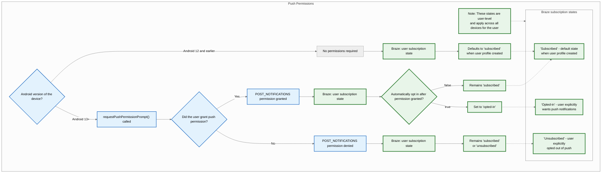
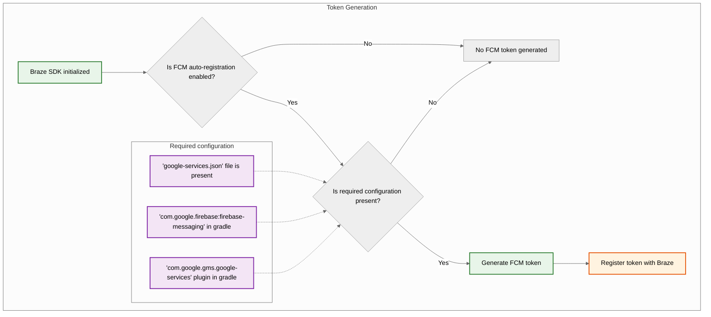
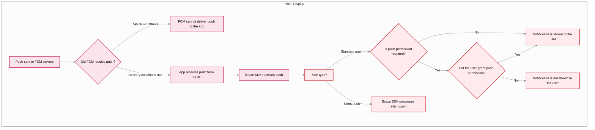



## 内蔵機能 {#built-in-features}

以下の機能はBraze Android SDKに組み込まれています。その他のプッシュ通知機能を利用するには、アプリ向けに[プッシュ通知を設定](#android_setting-up-push-notifications)する必要があります。

| 機能 | 説明 |
|-------|-----------|
| Push Stories | AndroidのPush Storiesは、Braze Android SDKにデフォルトで組み込まれています。詳しくは[Push Stories]({{site.baseurl}}/user_guide/message_building_by_channel/push/advanced_push_options/push_stories)を参照してください。|
| プッシュプライマー | プッシュプライマーキャンペーンでは、アプリのデバイスでプッシュ通知を有効にするようユーザーに促します。これは、[ノーコードプッシュプライマー]({{site.baseurl}}/user_guide/message_building_by_channel/push/best_practices/push_primer_messages)を使用して、SDKのカスタマイズなしで行うことができます。|
{: .reset-td-br-1 .reset-td-br-2 aria-label="内蔵機能" }

## プッシュ通知のライフサイクルについて {#push-notification-lifecycle}

以下のフローチャートは、Brazeがプッシュ通知のライフサイクル（許可プロンプト、トークン生成、メッセージ配信など）をどのように処理するかを示しています。















## プッシュ通知の設定 {#setting-up-push-notifications}


Braze Android SDKでFCMを使用するサンプルアプリを確認するには、[Braze: Firebase Push サンプルアプリ](https://github.com/braze-inc/braze-android-sdk/tree/master/samples/firebase-push)を参照してください。


### レート制限 {#rate-limits}

Firebase Cloud Messaging（FCM）APIには、1分あたり600,000リクエストというデフォルトのレート制限があります。この制限に達した場合、Brazeは数分後に自動的に再試行します。引き上げをリクエストするには、[Firebaseサポート](https://firebase.google.com/support)にお問い合わせください。

### ステップ1: Firebaseをプロジェクトに追加する {#step-1-add-firebase-to-your-project}

まず、FirebaseをAndroidプロジェクトに追加します。手順については、Googleの[Firebaseセットアップガイド](https://firebase.google.com/docs/android/setup)を参照してください。

### ステップ2: Cloud Messagingを依存関係に追加する {#step-2-add-cloud-messaging-to-your-dependencies}

次に、Cloud Messagingライブラリーをプロジェクトの依存関係に追加します。Androidプロジェクトで`build.gradle`を開き、`dependencies`ブロックに次の行を追加します。

```gradle
implementation "google.firebase:firebase-messaging:+"
```

依存関係は次のようになります。

```gradle
dependencies {
  implementation project(':android-sdk-ui')
  implementation "com.google.firebase:firebase-messaging:+"
}
```

### ステップ3: Firebase Cloud Messaging APIを有効にする {#step-3-enable-the-firebase-cloud-messaging-api}

Google Cloudで、Androidアプリが使用しているプロジェクトを選択し、[Firebase Cloud Messaging API](https://console.cloud.google.com/apis/library/fcm.googleapis.com)を有効にします。

{: style="max-width:80%;"}

### ステップ4: サービスアカウントを作成する {#service-account}

次に、新しいサービスアカウントを作成し、FCMトークンの登録時にBrazeが許可されたAPI呼び出しを行えるようにします。Google Cloudで**サービスアカウント**に移動し、プロジェクトを選択します。**サービスアカウント**ページで**サービスアカウントの作成**を選択します。


サービスアカウント名、ID、説明を入力して、**作成して続行**を選択します。


**ロール**フィールドで、ロールのリストから**Firebase Cloud Messaging API管理者**を見つけて選択します。アクセスをより制限する場合は、`cloudmessaging.messages.create`権限を持つ[カスタムロール](https://cloud.google.com/iam/docs/creating-custom-roles)を作成し、代わりにリストからそれを選択します。完了したら、**完了**を選択します。


**Firebase Cloud Messaging管理者**ではなく、**Firebase Cloud Messaging _API_ 管理者**を選択してください。



### ステップ5: JSON認証情報を生成する {#json}

次に、FCMサービスアカウントのJSON認証情報を生成します。Google Cloud IAM & Adminで**サービスアカウント**に移動し、プロジェクトを選択します。[先ほど作成した](#android_service-account)FCMサービスアカウントを見つけて、<i class="fa-solid fa-ellipsis-vertical"></i>&nbsp;**アクション** > **キーの管理**を選択します。


**キーの追加** > **新しいキーを作成**を選択します。


**JSON**を選択し、**作成**を選択します。FCMプロジェクトIDとは異なるGoogle CloudプロジェクトIDを使用してサービスアカウントを作成した場合は、JSONファイルで`project_id`に割り当てられた値を手動で更新する必要があります。

キーをどこにダウンロードしたかを覚えておいてください&#8212;次のステップで必要になります。

{: style="max-width:65%;"}


秘密キーが漏洩した場合は、セキュリティリスクが生じる可能性があります。JSON認証情報は安全な場所に保存しておいてください&#8212;キーはBrazeにアップロードした後で削除します。


### ステップ6: JSON認証情報をBrazeにアップロードする {#step-6-upload-your-json-credentials-to-braze}

次に、JSON認証情報をBrazeダッシュボードにアップロードします。Brazeで、<i class="fa-solid fa-gear"></i>&nbsp;**設定** > **アプリ設定**を選択します。


Androidアプリの**プッシュ通知の設定**で**Firebase**を選択し、**JSONファイルのアップロード**を選択して、[先ほど生成した](#android_json)認証情報をアップロードします。完了したら、**保存**を選択します。



秘密キーが漏洩した場合は、セキュリティリスクが生じる可能性があります。キーがBrazeにアップロードされたので、[先に生成した](#android_json)ファイルを削除してください。


### ステップ7: トークンの自動登録を設定する {#step-7-set-up-automatic-token-registration}

ユーザーがプッシュ通知をオプトインした場合、アプリはそのユーザーにプッシュ通知を送信する前に、ユーザーのデバイス上でFCMトークンを生成する必要があります。Braze SDKを使用すると、プロジェクトのBraze設定ファイルで各ユーザーのデバイスのFCMトークン自動登録を有効にできます。

まずFirebase Consoleに移動し、プロジェクトを開いて、<i class="fa-solid fa-gear"></i>&nbsp;**設定** > **プロジェクト設定**を選択します。


**Cloud Messaging**を選択し、**Firebase Cloud Messaging API (V1)**で**送信者ID**フィールドの数字をコピーします。


次に、Android Studioプロジェクトを開き、Firebase送信者IDを使用して、`braze.xml`または`BrazeConfig`内でFCMトークンの自動登録を有効にします。



FCMトークンの自動登録を設定するには、`braze.xml`ファイルに以下の行を追加します。

```xml
<bool translatable="false" name="com_braze_firebase_cloud_messaging_registration_enabled">true</bool>
<string translatable="false" name="com_braze_firebase_cloud_messaging_sender_id">FIREBASE_SENDER_ID</string>
```

`FIREBASE_SENDER_ID`をFirebaseプロジェクトの設定からコピーした値に置き換えます。`braze.xml`は次のようになります。

```xml
<?xml version="1.0" encoding="utf-8"?>
<resources>
  <string translatable="false" name="com_braze_api_key">12345ABC-6789-DEFG-0123-HIJK456789LM</string>
  <bool translatable="false" name="com_braze_firebase_cloud_messaging_registration_enabled">true</bool>
<string translatable="false" name="com_braze_firebase_cloud_messaging_sender_id">603679405392</string>
</resources>
```



FCMトークンの自動登録を設定するには、`BrazeConfig`に以下の行を追加します。



```java
.setIsFirebaseCloudMessagingRegistrationEnabled(true)
.setFirebaseCloudMessagingSenderIdKey("FIREBASE_SENDER_ID")
```


```kotlin
.setIsFirebaseCloudMessagingRegistrationEnabled(true)
.setFirebaseCloudMessagingSenderIdKey("FIREBASE_SENDER_ID")
```



`FIREBASE_SENDER_ID`をFirebaseプロジェクトの設定からコピーした値に置き換えます。`BrazeConfig`は次のようになります。



```java
BrazeConfig brazeConfig = new BrazeConfig.Builder()
  .setApiKey("12345ABC-6789-DEFG-0123-HIJK456789LM")
  .setCustomEndpoint("sdk.iad-01.braze.com")
  .setSessionTimeout(60)
  .setHandlePushDeepLinksAutomatically(true)
  .setGreatNetworkDataFlushInterval(10)
  .setIsFirebaseCloudMessagingRegistrationEnabled(true)
  .setFirebaseCloudMessagingSenderIdKey("603679405392")
  .build();
Braze.configure(this, brazeConfig);
```


```kotlin
val brazeConfig = BrazeConfig.Builder()
  .setApiKey("12345ABC-6789-DEFG-0123-HIJK456789LM")
  .setCustomEndpoint("sdk.iad-01.braze.com")
  .setSessionTimeout(60)
  .setHandlePushDeepLinksAutomatically(true)
  .setGreatNetworkDataFlushInterval(10)
  .setIsFirebaseCloudMessagingRegistrationEnabled(true)
  .setFirebaseCloudMessagingSenderIdKey("603679405392")
  .build()
Braze.configure(this, brazeConfig)
```







代わりにFCMトークンを手動で登録する場合は、アプリの[`onCreate()`](https://developer.android.com/reference/android/app/Application.html#onCreate())メソッド内でBrazeインスタンスの[`registeredPushToken`](https://braze-inc.github.io/braze-android-sdk/kdoc/braze-android-sdk/com.braze/-i-braze/registered-push-token.html)プロパティを設定します。

```kotlin
// Kotlin
Braze.getInstance(context).registeredPushToken = "FCM_TOKEN"
```

```java
// Java
Braze.getInstance(context).setRegisteredPushToken("FCM_TOKEN");
```


### ステップ8: アプリケーションクラスの自動リクエストを削除する {#step-8-remove-automatic-requests-in-your-application-class}

サイレントプッシュ通知を送信するたびにBrazeが不要なネットワークリクエストをトリガーするのを防ぐには、`Application`クラスの`onCreate()`メソッドで設定されている自動ネットワークリクエストをすべて削除してください。詳細については、[Android開発者リファレンス: Application](https://developer.android.com/reference/android/app/Application)を参照してください。

## 通知を表示する {#displaying-notifications}

### ステップ1: Braze Firebaseメッセージングサービスを登録する {#step-1-register-braze-firebase-messaging-service}

新規、既存、またはBraze以外のFirebaseメッセージングサービスを作成できます。特定のニーズに最も合うものを選択してください。



Brazeには、プッシュ受信インテントと開封インテントを処理するサービスが含まれています。`BrazeFirebaseMessagingService`クラスは`AndroidManifest.xml`に登録する必要があります。

```xml
<service android:name="com.braze.push.BrazeFirebaseMessagingService"
  android:exported="false">
  <intent-filter>
    <action android:name="com.google.firebase.MESSAGING_EVENT" />
  </intent-filter>
</service>
```

通知コードでは、`BrazeFirebaseMessagingService`を使用して、オープンアクションとクリックアクションのトラッキングも処理します。このサービスが正しく機能するには、`AndroidManifest.xml`に登録する必要があります。また、Brazeはシステムからの通知に固有のキーをプレフィックスとして付加するため、Brazeのシステムから送信された通知のみをレンダリングします。他のFCMサービスから送信される通知を表示するために、追加のサービスを個別に登録することもできます。Firebaseプッシュサンプルアプリの[`AndroidManifest.xml`](https://github.com/braze-inc/braze-android-sdk/blob/master/samples/firebase-push/src/main/AndroidManifest.xml)を参照してください。


Braze SDK 3.1.1より前では、FCMプッシュを処理するために`AppboyFcmReceiver`が使用されていました。マニフェストから`AppboyFcmReceiver`クラスを削除し、前述の統合に置き換える必要があります。




Firebase Messaging Serviceがすでに登録されている場合は、[`RemoteMessage`](https://firebase.google.com/docs/reference/android/com/google/firebase/messaging/RemoteMessage)オブジェクトを[`BrazeFirebaseMessagingService.handleBrazeRemoteMessage()`](https://braze-inc.github.io/braze-android-sdk/kdoc/braze-android-sdk/com.braze.push/-braze-firebase-messaging-service/-companion/handle-braze-remote-message.html)経由でBrazeに渡すことができます。このメソッドは[`RemoteMessage`](https://firebase.google.com/docs/reference/android/com/google/firebase/messaging/RemoteMessage)オブジェクトがBrazeから発信された場合にのみ通知を表示し、そうでない場合は安全に無視します。




```java
public class MyFirebaseMessagingService extends FirebaseMessagingService {
  @Override
  public void onMessageReceived(RemoteMessage remoteMessage) {
    super.onMessageReceived(remoteMessage);
    if (BrazeFirebaseMessagingService.handleBrazeRemoteMessage(this, remoteMessage)) {
      // This Remote Message originated from Braze and a push notification was displayed.
      // No further action is needed.
    } else {
      // This Remote Message did not originate from Braze.
      // No action was taken and you can safely pass this Remote Message to other handlers.
    }
  }
}
```




```kotlin
class MyFirebaseMessagingService : FirebaseMessagingService() {
  override fun onMessageReceived(remoteMessage: RemoteMessage?) {
    super.onMessageReceived(remoteMessage)
    if (BrazeFirebaseMessagingService.handleBrazeRemoteMessage(this, remoteMessage)) {
      // This Remote Message originated from Braze and a push notification was displayed.
      // No further action is needed.
    } else {
      // This Remote Message did not originate from Braze.
      // No action was taken and you can safely pass this Remote Message to other handlers.
    }
  }
}
```






使用したい別のFirebase Messaging Serviceがある場合は、アプリケーションがBrazeからではないプッシュを受信した場合に呼び出すフォールバックFirebase Messaging Serviceを指定することもできます。

`braze.xml`で次のように指定します。

```xml
<bool name="com_braze_fallback_firebase_cloud_messaging_service_enabled">true</bool>
<string name="com_braze_fallback_firebase_cloud_messaging_service_classpath">com.company.OurFirebaseMessagingService</string>
```

または、[ランタイム設定]({{site.baseurl}}/developer_guide/sdk_initalization/?sdktab=android)で設定します。




```java
BrazeConfig brazeConfig = new BrazeConfig.Builder()
        .setFallbackFirebaseMessagingServiceEnabled(true)
        .setFallbackFirebaseMessagingServiceClasspath("com.company.OurFirebaseMessagingService")
        .build();
Braze.configure(this, brazeConfig);
```




```kotlin
val brazeConfig = BrazeConfig.Builder()
        .setFallbackFirebaseMessagingServiceEnabled(true)
        .setFallbackFirebaseMessagingServiceClasspath("com.company.OurFirebaseMessagingService")
        .build()
Braze.configure(this, brazeConfig)
```






### ステップ2: 小さなアイコンをデザインガイドラインに準拠させる {#step-2-conform-small-icons-to-design-guidelines}

Android通知アイコンの一般的な情報については、[通知の概要](https://developer.android.com/guide/topics/ui/notifiers/notifications)をご覧ください。

Android N以降、色を使った小さな通知アイコンアセットは更新または削除する必要があります。Androidシステム（Braze SDKではない）は、アクションアイコンと小さな通知アイコンの非アルファチャネルと透明チャネルをすべて無視します。つまり、Androidは小さな通知アイコンの透明領域を除くすべての部分をモノクロに変換します。

正しく表示される通知用小さなアイコンアセットを作成するには：
- 画像から白以外のすべての色を削除します。
- アセットの他のすべての非白色領域は透明にする必要があります。


不適切なアセットでよく見られる症状の1つは、小さな通知アイコンが単色の正方形としてレンダリングされることです。これは、Androidシステムが小さな通知アイコンアセットで透明領域を見つけられないことが原因です。


次の図の大小アイコンは、適切にデザインされたアイコンの例です。


### ステップ3: 通知アイコンを設定する {#configure-icons}

#### braze.xmlでアイコンを指定する {#specifying-icons-in-brazexml}

Brazeでは、`braze.xml`内でdrawableリソースを指定することで、通知アイコンを設定できます。

```xml
<drawable name="com_braze_push_small_notification_icon">REPLACE_WITH_YOUR_ICON</drawable>
<drawable name="com_braze_push_large_notification_icon">REPLACE_WITH_YOUR_ICON</drawable>
```

小さな通知アイコンの設定は必須です。**設定しない場合、Brazeはデフォルトでアプリケーションアイコンを小さな通知アイコンとして使用しますが、最適に表示されない可能性があります。**

大きな通知アイコンの設定は任意ですが、推奨されます。

#### アイコンのアクセントカラーを指定する {#specifying-icon-accent-color}

通知アイコンのアクセントカラーは、`braze.xml`でオーバーライドできます。色を指定しない場合、デフォルトの色はLollipopがシステム通知に使用するのと同じグレーになります。

```xml
<integer name="com_braze_default_notification_accent_color">0xFFf33e3e</integer>
```

オプションでカラーリファレンスを使用することもできます。

```xml
<color name="com_braze_default_notification_accent_color">@color/my_color_here</color>
```

### ステップ4: ディープリンクを追加する {#step-4-add-deep-links}

#### ディープリンクの自動オープンを有効にする {#enabling-automatic-deep-link-opening}

プッシュ通知がクリックされたときにBrazeがアプリとディープリンクを自動的に開くようにするには、`braze.xml`で`com_braze_handle_push_deep_links_automatically`を`true`に設定します。

```xml
<bool name="com_braze_handle_push_deep_links_automatically">true</bool>
```

このフラグは、[ランタイム設定]({{site.baseurl}}/developer_guide/sdk_initalization/?sdktab=android)で設定することもできます。




```java
BrazeConfig brazeConfig = new BrazeConfig.Builder()
        .setHandlePushDeepLinksAutomatically(true)
        .build();
Braze.configure(this, brazeConfig);
```




```kotlin
val brazeConfig = BrazeConfig.Builder()
        .setHandlePushDeepLinksAutomatically(true)
        .build()
Braze.configure(this, brazeConfig)
```




ディープリンクをカスタムで処理する場合は、Brazeからのプッシュ受信およびオープンインテントをリッスンするプッシュコールバックを作成する必要があります。詳細については、[プッシュイベントのコールバックの使用]({{site.baseurl}}/developer_guide/push_notifications/customization#android_using-a-callback-for-push-events)を参照してください。

## フォアグラウンド通知の処理 {#handling-foreground-notifications}

Androidでは、アプリがフォアグラウンドにあるときにプッシュ通知が届くと、デフォルトでシステムが自動的に表示します。Brazeにプッシュ通知のペイロードを処理させる場合（分析トラッキング、ディープリンク処理、カスタム処理のため）、`FirebaseMessagingService.onMessageReceived`メソッド内で受信したプッシュデータをBrazeにルーティングしてください。

### 仕組み {#how-it-works}

`BrazeFirebaseMessagingService.handleBrazeRemoteMessage`を呼び出すと、Brazeはペイロードがプッシュ通知かどうかを判断し、該当する場合は`NotificationManagerCompat`メソッドで通知を作成して表示します。iOSとは異なり、Androidはアプリがフォアグラウンドにあるかバックグラウンドにあるかを問わず通知を表示します。



```java
package com.example.push;

import com.braze.push.BrazeFirebaseMessagingService;
import com.google.firebase.messaging.FirebaseMessagingService;
import com.google.firebase.messaging.RemoteMessage;

public class MyFirebaseMessagingService extends FirebaseMessagingService {
    @Override
    public void onMessageReceived(RemoteMessage remoteMessage) {
        super.onMessageReceived(remoteMessage);

        // Let Braze process the payload and display the notification
        if (BrazeFirebaseMessagingService.handleBrazeRemoteMessage(this, remoteMessage)) {
            // Braze successfully handled the push notification
        } else {
            // Handle non-Braze messages
        }
    }
}
```



```kotlin
package com.example.push

import com.braze.push.BrazeFirebaseMessagingService
import com.google.firebase.messaging.FirebaseMessagingService
import com.google.firebase.messaging.RemoteMessage

class MyFirebaseMessagingService : FirebaseMessagingService() {
    override fun onMessageReceived(remoteMessage: RemoteMessage) {
        super.onMessageReceived(remoteMessage)

        // Let Braze process the payload and display the notification
        if (BrazeFirebaseMessagingService.handleBrazeRemoteMessage(this, remoteMessage)) {
            // Braze successfully handled the push notification
        } else {
            // Handle non-Braze messages
        }
    }
}
```



詳細については、Braze Android SDKリポジトリ内の[Firebase統合サンプル](https://github.com/braze-inc/braze-android-sdk/blob/master/samples/firebase-push/src/main/java/com/braze/firebasepush/FirebaseMessagingService.kt)を参照してください。

### フォアグラウンド動作のカスタマイズ {#customizing-foreground-behavior}

カスタムのフォアグラウンド動作を実装したい場合（システム通知を抑制したり、代わりにアプリ内UIを表示したりするなど）、以下の方法があります。

- `subscribeToPushNotificationEvents`を使用してプッシュイベントに反応し、`BrazeNotificationUtils.routeUserWithNotificationOpenedIntent`メソッドでディープリンクを処理します。詳細については、[Firebaseプッシュサンプル](https://github.com/braze-inc/braze-android-sdk/blob/master/samples/firebase-push/src/main/java/com/braze/firebasepush/FirebaseApplication.kt)を参照してください。
- カスタムの`IBrazeNotificationFactory`を使用して独自の通知を構築して投稿するか、処理パスで`notificationManager.notify`を呼び出さないことで通知を抑制します。

通知のカスタマイズに関する詳細は、[カスタム通知ファクトリ]({{site.baseurl}}/developer_guide/push_notifications/customization/?sdktab=android#custom-notification-factory)を参照してください。

#### カスタムディープリンクの作成 {#creating-custom-deep-links}

アプリにまだディープリンクを追加していない場合は、[Android開発者ドキュメント](http://developer.android.com/training/app-indexing/deep-linking.html)に記載されているディープリンクに関する手順に従ってください。ディープリンクの詳細については、[FAQの記事]({{site.baseurl}}/user_guide/messaging/design_and_edit/personalize/actions_and_media_urls#what-is-deep-linking)を参照してください。

#### ディープリンクの追加 {#adding-deep-links}

Brazeダッシュボードではプッシュ通知のキャンペーンやキャンバスで、通知がクリックされたときに開くディープリンクまたはWeb URLを設定できます。


#### バックスタック動作のカスタマイズ {#customizing-back-stack-behavior}

Android SDKのデフォルトでは、プッシュのディープリンクを辿ると、ホストアプリのメインのランチャーアクティビティがバックスタックに配置されます。Brazeでは、メインのランチャーアクティビティの代わりにバックスタックで開くカスタムアクティビティを設定したり、バックスタックを完全に無効にしたりすることができます。

たとえば、[ランタイム設定]({{site.baseurl}}/developer_guide/sdk_initalization/?sdktab=android)を使用して、`YourMainActivity`というアクティビティをバックスタックアクティビティとして設定するには、次のようにします。




```java
BrazeConfig brazeConfig = new BrazeConfig.Builder()
        .setPushDeepLinkBackStackActivityEnabled(true)
        .setPushDeepLinkBackStackActivityClass(YourMainActivity.class)
        .build();
Braze.configure(this, brazeConfig);
```




```kotlin
val brazeConfig = BrazeConfig.Builder()
        .setPushDeepLinkBackStackActivityEnabled(true)
        .setPushDeepLinkBackStackActivityClass(YourMainActivity.class)
        .build()
Braze.configure(this, brazeConfig)
```




`braze.xml`の同等の設定を参照してください。クラス名は`Class.forName()`で返されるものと同じでなければならないことに注意してください。

```xml
<bool name="com_braze_push_deep_link_back_stack_activity_enabled">true</bool>
<string name="com_braze_push_deep_link_back_stack_activity_class_name">your.package.name.YourMainActivity</string>
```

### ステップ5: 通知チャネルを定義する {#step-5-define-notification-channels}

Braze Android SDKは[Android通知チャネル](https://developer.android.com/preview/features/notification-channels.html)をサポートしています。Brazeの通知に通知チャネルのIDが含まれていない場合、またはBrazeの通知に無効なチャネルIDが含まれている場合、BrazeはSDKで定義されているデフォルトの通知チャネルで通知を表示します。会社ユーザーはプラットフォーム内で[Android通知チャネル]({{site.baseurl}}/user_guide/message_building_by_channel/push/android/notification_channels)を使用して通知をグループ化します。

デフォルトのBraze通知チャネルのユーザー向けの名前を設定するには、[`BrazeConfig.setDefaultNotificationChannelName()`](https://braze-inc.github.io/braze-android-sdk/kdoc/braze-android-sdk/com.braze.configuration/-braze-config/-builder/set-default-notification-channel-name.html)を使用します。

デフォルトのBraze通知チャネルのユーザー向けの説明を設定するには、[`BrazeConfig.setDefaultNotificationChannelDescription()`](https://braze-inc.github.io/braze-android-sdk/kdoc/braze-android-sdk/com.braze.configuration/-braze-config/-builder/set-default-notification-channel-description.html)を使用します。

[Androidプッシュオブジェクト]({{site.baseurl}}/api/objects_filters/messaging/android_object)パラメータを使用してAPIキャンペーンを更新し、`notification_channel`フィールドを含めます。このフィールドが指定されていない場合、Brazeは[ダッシュボードフォールバック]({{site.baseurl}}/user_guide/message_building_by_channel/push/android/notification_channels#dashboard-fallback-channel)チャネルIDを持つ通知ペイロードを送信します。

デフォルトの通知チャネル以外、Brazeはチャネルを作成しません。他のすべてのチャネルは、ホストアプリでプログラムで定義してから、Brazeダッシュボードに入力する必要があります。

デフォルトのチャネル名と説明も`braze.xml`で設定できます。

```xml
<string name="com_braze_default_notification_channel_name">Your channel name</string>
<string name="com_braze_default_notification_channel_description">Your channel description</string>
```

### ステップ6: 通知の表示と分析をテストする {#step-6-test-notification-display-and-analytics}

#### 表示のテスト {#testing-display}

この時点で、Brazeから送信された通知を表示できるはずです。これをテストするには、Brazeダッシュボードの**キャンペーン**ページにアクセスし、**プッシュ通知**キャンペーンを作成します。**Android Push**を選択し、メッセージをデザインします。次に、作成画面で目のアイコンをクリックしてテスト送信者を取得します。現在のユーザーのユーザーIDまたはメールアドレスを入力し、**Send Test**をクリックします。デバイスにプッシュが表示されます。


プッシュ表示に関する問題については、[トラブルシューティングガイド]({{site.baseurl}}/developer_guide/push_notifications/troubleshooting/?sdktab=android)を参照してください。

#### 分析のテスト {#testing-analytics}

この時点で、プッシュ通知の開封に関する分析ログも記録されているはずです。届いた通知をクリックすると、キャンペーン結果ページの**直接開封数**の値が1増えます。プッシュ分析の内訳については、[プッシュレポート]({{site.baseurl}}/user_guide/message_building_by_channel/push/push_reporting)の記事をご覧ください。

プッシュ分析に関する問題については、[トラブルシューティングガイド]({{site.baseurl}}/developer_guide/push_notifications/troubleshooting/?sdktab=android)を参照してください。

#### コマンドラインからのテスト {#testing-from-command-line}

コマンドラインインターフェイスを介してアプリ内通知とプッシュ通知をテストする場合は、cURLと[メッセージングAPI]({{site.baseurl}}/api/endpoints/messaging)を介してターミナルから単一の通知を送信できます。次のフィールドをテストケースの正しい値に置き換える必要があります。

- `YOUR_API_KEY`（**設定** > **APIキー**に移動）
- `YOUR_EXTERNAL_USER_ID`（**ユーザーを検索**ページでプロファイルを検索）
- `YOUR_KEY1`（省略可能）
- `YOUR_VALUE1`（省略可能）

```bash
curl -X POST -H "Content-Type: application/json" -H "Authorization: Bearer {YOUR_API_KEY}" -d '{
  "external_user_ids":["YOUR_EXTERNAL_USER_ID"],
  "messages": {
    "android_push": {
      "title":"Test push title",
      "alert":"Test push",
      "extra": {
        "YOUR_KEY1":"YOUR_VALUE1"
      }
    }
  }
}' https://rest.iad-01.braze.com/messages/send
```

この例では、`US-01`インスタンスを使用しています。このインスタンスを使用していない場合は、`US-01`エンドポイントを[自分のエンドポイント]({{site.baseurl}}/api/basics#endpoints)に置き換えてください。

## 会話プッシュ通知 {#conversation-push-notifications}

{: style="float:right;max-width:35%;margin-left:15px;border: 0;"}

[人と会話のイニシアチブ](https://developer.android.com/guide/topics/ui/conversations)は、スマートフォンのシステムサーフェスで人との会話を向上させることを目的とした、複数年にわたるAndroidの取り組みです。この優先順位は、他のユーザーとのコミュニケーションや対話が、あらゆるユーザー層にわたる大多数のAndroidユーザーにとって、依然として最も価値のある重要な機能分野であるという事実に基づいています。

### 使用要件 {#usage-requirements}

- この通知タイプには、Braze Android SDK v15.0.0以降とAndroid 11以降のデバイスが必要です。
- サポートされていないデバイスやSDKは、標準のプッシュ通知にフォールバックします。

この機能はBraze REST API経由でのみ利用できます。詳細については、[Androidプッシュオブジェクト]({{site.baseurl}}/api/objects_filters/messaging/android_object#android-conversation-push-object)を参照してください。

## FCMのクォータ超過エラー {#fcm-quota-exceeded-errors}

Firebase Cloud Messaging（FCM）の制限を超過すると、Googleは「クォータ超過」エラーを返します。FCMのデフォルトの制限は、1分あたり600,000リクエストです。BrazeはGoogleが推奨するベストプラクティスに従って送信を再試行します。しかし、こうしたエラーが大量に発生すると、送信時間が数分間長引くことがあります。潜在的な影響を軽減するために、Brazeはレート制限を超えていることを示すアラートと、エラーを防ぐために実行できるステップを送信します。

現在の制限を確認するには、**Google Cloudコンソール** > **APIとサービス** > **Firebase Cloud Messaging API** > **クォータとシステム制限**に移動するか、[FCM APIクォータのページ](https://console.cloud.google.com/apis/api/fcm.googleapis.com/quotas)にアクセスしてください。

### ベストプラクティス {#best-practices}

これらのエラー発生量を低く抑えるために、以下のベストプラクティスを推奨します。

#### FCMにレート制限の引き上げをリクエストする {#request-a-rate-limit-increase-from-fcm}

FCMのレート制限の引き上げをリクエストするには、[Firebaseサポート](https://firebase.google.com/support)に直接連絡するか、以下の手順を実行します。

1. [FCM APIのクォータページ](https://console.cloud.google.com/apis/api/fcm.googleapis.com/quotas)に移動します。
2. **1分あたりのリクエスト送信**クォータを確認します。
3. **クォータの編集**を選択します。
4. 新しい値を入力し、リクエストを送信します。

#### ワークスペースのレート制限を適用する {#apply-a-workspace-rate-limit}

Androidプッシュ通知にワークスペースのレート制限を適用できます。これにより、送信メッセージの配信レートを調整できます。詳細については、[ワークスペースのメッセージングレート制限]({{site.baseurl}}/user_guide/administrative/app_settings/messaging_rate_limits)を参照してください。