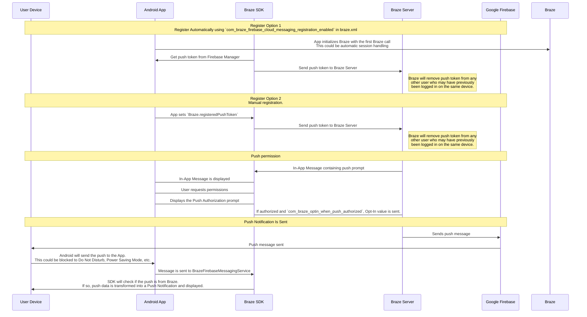

## Brazeのプッシュワークフローを理解する {#understanding-the-braze-push-workflow}

Firebase Cloud Messaging（FCM）サービスは、Androidアプリケーションに送信されるプッシュ通知のためのGoogleのインフラです。ユーザーのデバイスでプッシュ通知がどのように有効になり、Brazeがプッシュ通知をどのように送信するかの簡略化された構造を以下に示します。



### ステップ1：Google Cloud APIキーを設定する {#step-1-configure-your-google-cloud-api-key}

アプリを開発する際、Braze Android SDKにFirebase送信者IDを提供する必要があります。また、サーバーアプリケーション用のAPIキーをBrazeダッシュボードに提供する必要があります。BrazeはこのAPIキーを使用してデバイスにメッセージを送信します。さらに、Google Developer'sコンソールでFCMサービスが有効になっていることを確認する必要があります。


このステップでよくある間違いは、REST APIキーではなくアプリ識別子のAPIキーを使用してしまうことです。


### ステップ2：デバイスがFCMに登録し、Brazeにプッシュトークンを提供する {#step-2-devices-register-for-fcm-and-provide-braze-with-push-tokens}

一般的なインテグレーションでは、Braze Android SDKがFCM機能へのデバイス登録を処理します。これは通常、アプリを初めて開いた直後に行われます。登録後、BrazeにはFCM登録IDが提供され、このIDを使用してそのデバイスに特定のメッセージを送信します。そのユーザーの登録IDが保存され、それまでどのアプリにもプッシュトークンを持っていなかった場合、そのユーザーは「プッシュ登録済み」になります。

### ステップ3：Brazeプッシュキャンペーンを起動する {#step-3-launch-a-braze-push-campaign}

プッシュキャンペーンが起動されると、Brazeはメッセージを配信するためにFCMにリクエストを送信します。BrazeはダッシュボードにコピーされたAPIキーを使用して認証を行い、提供されたプッシュトークンにプッシュ通知を送信できることを確認します。

### ステップ4：無効なトークンを削除する {#step-4-remove-invalid-tokens}

メッセージを送信しようとしたプッシュトークンのいずれかが無効であるとFCMから通知された場合、それらのトークンは関連付けられたユーザープロファイルから削除されます。他にプッシュトークンを持たないユーザーは、**セグメント**ページで「プッシュ登録済み」として表示されなくなります。

FCMの詳細については、[Cloud messaging](https://firebase.google.com/docs/cloud-messaging/)を参照してください。

## プッシュエラーログの使用 {#use-the-push-error-logs}

Brazeはメッセージアクティビティログ内にプッシュ通知エラーを提供します。このエラーログには、キャンペーンが期待どおりに動作しない原因を特定するのに非常に役立つさまざまな警告が含まれています。エラーメッセージを選択すると、特定のインシデントのトラブルシューティングに役立つ関連ドキュメントにリダイレクトされます。


## トラブルシューティング {#troubleshooting}

### プッシュが送信されない {#push-isnt-sending}

以下の状況により、プッシュメッセージが送信されない場合があります。

- 認証情報が間違ったGoogle Cloud PlatformプロジェクトID（間違ったsender ID）に存在している。
- 認証情報に間違った権限スコープが設定されている。
- 間違った認証情報を間違ったBrazeワークスペースにアップロードした（間違ったsender ID）。

プッシュメッセージの送信を妨げるその他の問題については、[ユーザーガイド：プッシュ通知のトラブルシューティング]({{site.baseurl}}/user_guide/channels/push/troubleshooting)を参照してください。

### Brazeダッシュボードに「プッシュ登録済み」のユーザーが表示されない（メッセージ送信前） {#no-push-registered-users-showing-in-the-braze-dashboard-prior-to-sending-messages}

アプリがプッシュ通知を許可するように正しく設定されていることを確認してください。よくある問題点を以下に示します。

#### 不正なsender ID {#incorrect-sender-id}

正しいFCM sender IDが`braze.xml`ファイルに含まれていることを確認してください。不正なsender IDを指定すると、ダッシュボードのメッセージアクティビティログに`MismatchSenderID`エラーが表示されます。

#### Braze登録が行われない {#braze-registration-not-occurring}

FCM登録はBrazeの外部で処理されるため、登録の失敗は以下の2箇所でのみ発生します。

1. FCMへの登録時
2. FCMが生成したプッシュトークンをBrazeに渡す時

FCMが生成したプッシュトークンがBrazeに送信されていることを確認するために、ブレークポイントの設定またはログの記録を推奨します。トークンが正しく生成されない場合や、まったく生成されない場合は、[FCMドキュメント](https://firebase.google.com/docs/cloud-messaging/android/client)を参照してください。

#### Google Play Servicesがインストールされていない {#google-play-services-not-present}

FCMプッシュが動作するには、デバイスにGoogle Play Servicesがインストールされている必要があります。デバイスにGoogle Play Servicesがインストールされていない場合、プッシュ登録は行われません。


Google APIsがインストールされていないAndroidエミュレーターには、Google Play Servicesはインストールされていません。


#### デバイスがインターネットに接続されていない {#device-not-connected-to-the-internet}

デバイスのインターネット接続が良好で、プロキシ経由でネットワークトラフィックを送信していないことを確認してください。

### プッシュ通知をタップしてもアプリが開かない {#tapping-push-notification-doesnt-open-the-app}

`com_braze_handle_push_deep_links_automatically`が`true`または`false`に設定されているか確認してください。プッシュ通知をタップしたときにBrazeがアプリおよびディープリンクを自動的に開くようにするには、`braze.xml`ファイルで`com_braze_handle_push_deep_links_automatically`を`true`に設定してください。

`com_braze_handle_push_deep_links_automatically`がデフォルトの`false`に設定されている場合は、Brazeプッシュコールバックを使用して、プッシュの受信および開封インテントをリッスンし、処理する必要があります。

### プッシュ通知がバウンスした {#push-notifications-bounced}

プッシュ通知が配信されない場合は、[開発者コンソール]({{site.baseurl}}/developer_guide/platforms/android/push_notifications/troubleshooting#utilizing-the-push-error-logs)でバウンスしていないか確認してください。開発者コンソールに記録される一般的なエラーの説明を以下に示します。

#### エラー：MismatchSenderID {#error-mismatchsenderid}

`MismatchSenderID`は認証の失敗を示します。Firebase sender IDとFCM APIキーが正しいことを確認してください。

#### エラー：InvalidRegistration {#error-invalidregistration}

`InvalidRegistration`は不正なプッシュトークンが原因で発生する場合があります。

1. [Firebase Cloud Messaging](https://firebase.google.com/docs/cloud-messaging/android/client#retrieve-the-current-registration-token)から有効なプッシュトークンをBrazeに渡していることを確認してください。

#### エラー：NotRegistered {#error-notregistered}

2. `NotRegistered`は、複数の登録が発生し、2回目の登録が最初のトークンを無効にした場合にも発生することがあります。

### プッシュ通知が送信されたがユーザーのデバイスに表示されない {#push-notifications-sent-but-not-displayed-on-users-devices}

これが発生する理由はいくつかあります。

#### アプリが強制終了された {#application-was-force-quit}

システム設定からアプリを強制終了すると、プッシュ通知は送信されません。アプリを再起動すると、デバイスがプッシュ通知を再び受信できるようになります。

#### BrazeFirebaseMessagingServiceが登録されていない {#brazefirebasemessagingservice-not-registered}

プッシュ通知が表示されるようにするには、BrazeFirebaseMessagingServiceが`AndroidManifest.xml`に正しく登録されている必要があります。

```xml
<service android:name="com.braze.push.BrazeFirebaseMessagingService"
  android:exported="false">
  <intent-filter>
    <action android:name="com.google.firebase.MESSAGING_EVENT" />
  </intent-filter>
</service>
```

#### ファイアウォールがプッシュをブロックしている {#firewall-is-blocking-push}

Wi-Fi経由でプッシュをテストしている場合、ファイアウォールがFCMのメッセージ受信に必要なポートをブロックしている可能性があります。ポート`5228`、`5229`、および`5230`が開いていることを確認してください。また、FCMはIPを指定しないため、GoogleのASN `15169`に記載されているIPブロックに含まれるすべてのIPアドレスへの送信接続を許可するようにファイアウォールを設定する必要があります。

#### カスタム通知ファクトリーがnullを返している {#custom-notification-factory-returning-null}

[カスタム通知ファクトリー]({{site.baseurl}}/developer_guide/platform_integration_guides/android/push_notifications/android/integration/standard_integration#custom-displaying-notifications)を実装している場合、`null`を返していないことを確認してください。`null`を返すと通知が表示されなくなります。

### メッセージ送信後に「プッシュ登録済み」のユーザーが無効になる {#push-registered-users-no-longer-enabled-after-sending-messages}

これが発生する理由はいくつかあります。

#### アプリがアンインストールされた {#application-was-uninstalled}

ユーザーがアプリをアンインストールしています。これにより、FCMプッシュトークンが無効になります。

#### 無効なFirebase Cloud Messagingサーバーキー {#invalid-firebase-cloud-messaging-server-key}

Brazeダッシュボードに提供されたFirebase Cloud Messagingサーバーキーが無効です。提供するsender IDは、アプリの`braze.xml`ファイルで参照されているものと一致する必要があります。サーバーキーとsender IDは、Firebase Consoleの以下の場所にあります。


### プッシュクリックが記録されない {#push-clicks-not-logged}

プッシュクリックが記録されない場合、プッシュクリックデータがまだサーバーにフラッシュされていない可能性があります。Braze Android SDKはフラッシュをスロットリングする場合があります。

カスタムプッシュハンドラーを実装している場合は、[ネイティブプッシュ分析の保持]({{site.baseurl}}/developer_guide/push_notifications/logging_message_data/?tab=android#preserving-native-push-analytics-with-custom-push-handling)を適切に行っていることを確認してください。

プッシュクリックの記録はネットワーク操作であり、ネットワークの制限に依存します。そのため、Braze Android SDKはネットワーク障害に対応し、失敗したリクエストをリトライしますが、一部のイベント損失が発生する可能性があります。

### ディープリンクが動作しない {#deep-links-not-working}

#### ディープリンクの設定を確認する {#verify-deep-link-configuration}

ディープリンクは[ADBでテスト](https://developer.android.com/training/app-indexing/deep-linking.html#testing-filters)できます。以下のコマンドでディープリンクをテストすることを推奨します。

`adb shell am start -W -a android.intent.action.VIEW -d "THE_DEEP_LINK" THE_PACKAGE_NAME`

ディープリンクが動作しない場合、ディープリンクの設定が正しくない可能性があります。設定が正しくないディープリンクは、Brazeプッシュ経由で送信しても動作しません。

#### カスタムハンドリングロジックを確認する {#verify-custom-handling-logic}

ディープリンクが[ADBでは正しく動作する](https://developer.android.com/training/app-indexing/deep-linking.html#testing-filters)にもかかわらず、Brazeプッシュからは動作しない場合は、[カスタムプッシュオープンハンドリング]({{site.baseurl}}/developer_guide/platform_integration_guides/android/push_notifications/android/integration/standard_integration#android-push-listener-callback)が実装されていないか確認してください。実装されている場合は、カスタムハンドリングコードが受信したディープリンクを適切に処理していることを確認してください。

#### バックスタック動作を無効にする {#disable-back-stack-behavior}

ディープリンクが[ADBでは正しく動作する](https://developer.android.com/training/app-indexing/deep-linking.html#testing-filters)にもかかわらず、Brazeプッシュからは動作しない場合は、[バックスタック](https://developer.android.com/guide/components/activities/tasks-and-back-stack)を無効にしてみてください。**braze.xml**ファイルを以下のように更新してください。

```xml
<bool name="com_braze_push_deep_link_back_stack_activity_enabled">false</bool>
```
