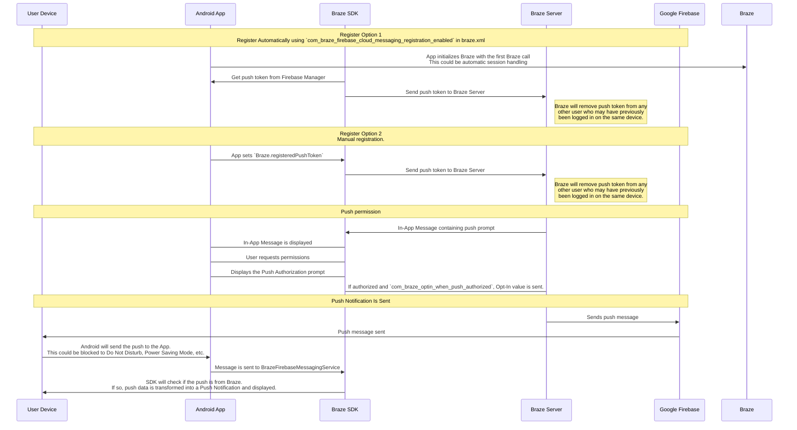

## Brazeのプッシュワークフローを理解する {#understanding-the-braze-push-workflow}

Firebase Cloud Messaging（FCM）サービスは、Androidアプリケーションに送信されるプッシュ通知のためのGoogleのインフラです。ユーザーのデバイスでプッシュ通知を有効にする仕組みと、Brazeがプッシュ通知を送信する方法の簡略化された構造を以下に示します。



### ステップ1：Google Cloud APIキーを構成する {#step-1-configure-your-google-cloud-api-key}

アプリの開発では、Firebase送信者IDをBraze Android SDKに提供する必要があります。また、サーバーアプリケーション用のAPIキーをBrazeダッシュボードに提供する必要があります。BrazeはこのAPIキーを使用してデバイスにメッセージを送信します。Google DeveloperのコンソールでFCMサービスが有効になっていることも確認する必要があります。


このステップでよくある間違いは、REST APIキーの代わりにアプリ識別子のAPIキーを使用することです。


### ステップ2：デバイスがFCMに登録してBrazeにプッシュトークンを提供する {#step-2-devices-register-for-fcm-and-provide-braze-with-push-tokens}

一般的な統合では、Braze Android SDKがFCM機能のデバイス登録を処理します。これは通常、アプリを初めて開いた直後に行われます。登録後、BrazeにFCM登録IDが提供されます。このIDは、そのデバイスに対してメッセージを送信するために使用されます。ユーザーの登録IDが保存され、そのユーザーが以前にアプリのプッシュトークンを持っていなかった場合は「プッシュ登録済み」になります。

### ステップ3：Brazeプッシュキャンペーンを開始する {#step-3-launch-a-braze-push-campaign}

プッシュキャンペーンが開始されると、BrazeはFCMにメッセージの配信リクエストを行います。Brazeは、ダッシュボードにコピーされたAPIキーを使用して認証を行い、提供されたプッシュトークンにプッシュ通知を送信できることを確認します。

### ステップ4：無効なトークンを削除する {#step-4-remove-invalid-tokens}

メッセージを送信しようとしたプッシュトークンのいずれかが無効であるとFCMから通知された場合、関連付けられていたユーザープロファイルからそれらのトークンを削除します。ユーザーが他にプッシュトークンを持っていない場合は、**セグメント**ページに「プッシュ登録済み」として表示されなくなります。

FCMの詳細については、[クラウドメッセージング](https://firebase.google.com/docs/cloud-messaging/)を参照してください。

## プッシュエラーログを使用する {#use-the-push-error-logs}

Brazeは、プッシュ通知エラーをメッセージアクティビティログに出力します。このエラーログは、キャンペーンが期待どおりに機能していない理由を特定するのに非常に役立つさまざまな警告を提供します。エラーメッセージを選択すると、特定のインシデントのトラブルシューティングに役立つ関連ドキュメントにリダイレクトされます。


## トラブルシューティング {#troubleshooting}

### プッシュが送信されない {#push-isnt-sending}

次の状況により、プッシュメッセージが送信されない可能性があります。

- 間違ったGoogle Cloud PlatformプロジェクトID（間違った送信者ID）に認証情報が存在します。
- 認証情報の権限スコープが間違っています。
- 間違った認証情報を間違ったBrazeワークスペース（間違った送信者ID）にアップロードしました。

プッシュメッセージの送信を妨げるその他の問題については、[ユーザーガイド：プッシュ通知のトラブルシューティング]({{site.baseurl}}/user_guide/message_building_by_channel/push/troubleshooting)を参照してください。

### Brazeダッシュボードに「プッシュ登録済み」ユーザーが表示されない（メッセージ送信前） {#no-push-registered-users-showing-in-the-braze-dashboard-prior-to-sending-messages}

アプリがプッシュ通知を許可するように正しく構成されていることを確認してください。チェックすべき一般的な障害点は次のとおりです。

#### 送信者IDが正しくない {#incorrect-sender-id}

正しいFCM送信者IDが`braze.xml`ファイルに含まれていることを確認してください。送信者IDが正しくないと、ダッシュボードのメッセージアクティビティログに`MismatchSenderID`エラーが報告されます。

#### Braze登録が行われない {#braze-registration-not-occurring}

FCM登録はBrazeの外部で処理されるため、登録の失敗は次の2つのタイミングでのみ発生します。

1. FCMへの登録中
2. FCMで生成されたプッシュトークンをBrazeに渡すとき

ブレークポイントを設定するか、ログを記録して、FCMで生成されたプッシュトークンがBrazeに送信されていることを確認することをお勧めします。トークンが正しく生成されない場合、またはまったく生成されない場合は、[FCMドキュメント](https://firebase.google.com/docs/cloud-messaging/android/client)を参照してください。

#### Google Play開発者サービスが存在しない {#google-play-services-not-present}

FCMプッシュが正しく機能するためには、Google Play開発者サービスがデバイス上に存在する必要があります。Google Play開発者サービスがデバイス上にない場合、プッシュ登録は行われません。


Google APIがインストールされていないAndroidエミュレーターには、Google Play開発者サービスはインストールされません。


#### デバイスがインターネットに接続されていない {#device-not-connected-to-the-internet}

デバイスのインターネット接続が良好で、プロキシ経由でネットワークトラフィックを送信していないことを確認してください。

### プッシュ通知をタップしてもアプリが開かない {#tapping-push-notification-doesnt-open-the-app}

`com_braze_handle_push_deep_links_automatically`が`true`または`false`に設定されているかどうかを確認します。プッシュ通知がタップされたときにBrazeがアプリとディープリンクを自動的に開くようにするには、`braze.xml`ファイルで`com_braze_handle_push_deep_links_automatically`を`true`に設定します。

`com_braze_handle_push_deep_links_automatically`がデフォルトの`false`に設定されている場合は、Brazeプッシュコールバックを使用して、プッシュの受信および開封インテントをリッスンし、処理する必要があります。

### プッシュ通知がバウンスされる {#push-notifications-bounced}

プッシュ通知が配信されない場合は、[開発者コンソール]({{site.baseurl}}/developer_guide/platforms/android/push_notifications/troubleshooting#utilizing-the-push-error-logs)を確認して、通知がバウンスされていないことを確認してください。以下は、開発者コンソールに記録される可能性のある一般的なエラーの説明です。

#### エラー：MismatchSenderID {#error-mismatchsenderid}

`MismatchSenderID`は認証が失敗したことを示します。Firebase送信者IDとFCM APIキーが正しいことを確認してください。

#### エラー：InvalidRegistration {#error-invalidregistration}

`InvalidRegistration`は、不正な形式のプッシュトークンが原因で発生する可能性があります。

1. [Firebase Cloud Messaging](https://firebase.google.com/docs/cloud-messaging/android/client#retrieve-the-current-registration-token)からの有効なプッシュトークンをBrazeに渡すようにしてください。

#### エラー：NotRegistered {#error-notregistered}

2. `NotRegistered`は、複数の登録が行われ、2番目の登録によって最初のトークンが無効になった場合にも発生する可能性があります。

### プッシュ通知は送信されるがユーザーのデバイスに表示されない {#push-notifications-sent-but-not-displayed-on-users-devices}

この問題が発生する理由はいくつか考えられます。

#### アプリケーションが強制終了された {#application-was-force-quit}

システム設定からアプリケーションを強制終了すると、プッシュ通知は送信されません。アプリを再度起動すると、デバイスがプッシュ通知を受信できるようになります。

#### BrazeFirebaseMessagingServiceが登録されていない {#brazefirebasemessagingservice-not-registered}

プッシュ通知を表示するには、BrazeFirebaseMessagingServiceが`AndroidManifest.xml`に適切に登録されている必要があります。

```xml
<service android:name="com.braze.push.BrazeFirebaseMessagingService"
  android:exported="false">
  <intent-filter>
    <action android:name="com.google.firebase.MESSAGING_EVENT" />
  </intent-filter>
</service>
```

#### ファイアウォールがプッシュをブロックしている {#firewall-is-blocking-push}

Wi-Fi経由でプッシュをテストしている場合は、FCMがメッセージを受信するために必要なポートがファイアウォールによってブロックされている可能性があります。ポート`5228`、`5229`、`5230`が開いていることを確認してください。また、FCMはIPを指定しないため、Googleの`15169`のASNに記載されたIPブロックに含まれるすべてのIPアドレスへの発信接続をファイアウォールが許可する必要があります。

#### カスタム通知ファクトリーがnullを返す {#custom-notification-factory-returning-null}

[カスタム通知ファクトリー]({{site.baseurl}}/developer_guide/platform_integration_guides/android/push_notifications/android/integration/standard_integration#custom-displaying-notifications)を実装している場合は、`null`を返していないことを確認してください。nullが返されると、通知が表示されなくなります。

### 「プッシュ登録済み」ユーザーがメッセージ送信後に有効でなくなる {#push-registered-users-no-longer-enabled-after-sending-messages}

この問題が発生する理由はいくつか考えられます。

#### アプリケーションがアンインストールされた {#application-was-uninstalled}

ユーザーがアプリケーションをアンインストールしました。これにより、FCMプッシュトークンが無効になります。

#### 無効なFirebase Cloud Messagingサーバーキー {#invalid-firebase-cloud-messaging-server-key}

Brazeダッシュボードで提供されたFirebase Cloud Messagingサーバーキーが無効です。提供された送信者IDは、アプリの`braze.xml`ファイルで参照されている送信者IDと一致する必要があります。サーバーキーと送信者IDは、Firebaseコンソールの次の場所にあります。


### プッシュクリックが記録されない {#push-clicks-not-logged}

プッシュクリックがログに記録されない場合は、プッシュクリックデータがまだサーバーにフラッシュされていない可能性があります。Braze Android SDKはフラッシュを調整する場合があります。

カスタムプッシュハンドラーを実装している場合は、[ネイティブプッシュ分析を適切に保持]({{site.baseurl}}/developer_guide/push_notifications/logging_message_data/?tab=android#preserving-native-push-analytics-with-custom-push-handling)していることを確認してください。

プッシュクリックの記録はネットワーク操作であり、ネットワークの制限に依存します。そのため、Braze Android SDKはネットワーク障害に対応し、失敗したリクエストを再試行しますが、一部のイベント損失が発生する可能性があります。

### ディープリンクが機能しない {#deep-links-not-working}

#### ディープリンク構成を確認する {#verify-deep-link-configuration}

ディープリンクは[ADBでテスト](https://developer.android.com/training/app-indexing/deep-linking.html#testing-filters)できます。次のコマンドを使用してディープリンクをテストすることをお勧めします。

`adb shell am start -W -a android.intent.action.VIEW -d "THE_DEEP_LINK" THE_PACKAGE_NAME`

ディープリンクが機能しない場合は、ディープリンクの構成が正しくない可能性があります。構成が正しくないディープリンクは、Brazeプッシュ経由で送信されても正しく機能しません。

#### カスタム処理ロジックを検証する {#verify-custom-handling-logic}

ディープリンクが[ADBでは正しく動作する](https://developer.android.com/training/app-indexing/deep-linking.html#testing-filters)が、Brazeプッシュからは機能しない場合は、[カスタムプッシュ開封処理]({{site.baseurl}}/developer_guide/platform_integration_guides/android/push_notifications/android/integration/standard_integration#android-push-listener-callback)が実装されているかどうかを確認してください。実装されている場合は、カスタム処理コードが受信ディープリンクを適切に処理していることを確認してください。

#### バックスタック動作を無効にする {#disable-back-stack-behavior}

ディープリンクが[ADBでは正しく動作する](https://developer.android.com/training/app-indexing/deep-linking.html#testing-filters)が、Brazeプッシュでは機能しない場合は、[バックスタック](https://developer.android.com/guide/components/activities/tasks-and-back-stack)を無効にしてみてください。そのためには、**braze.xml**ファイルを更新して以下を含めます。

```xml
<bool name="com_braze_push_deep_link_back_stack_activity_enabled">false</bool>
```
