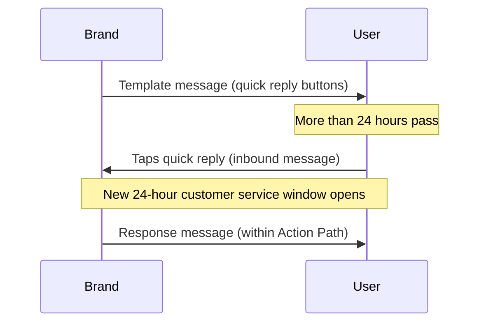

# ユーザーメッセージ {#user-messages}

> WhatsAppは双方向のコミュニケーションチャネルです。ブランドからユーザーにメッセージを送信できるだけでなく、テンプレート化されたキャンペーンやキャンバスを使用して会話に参加することもできます。WhatsAppのクイック返信、リストメッセージ、トリガーワードなど、さまざまな方法があります。クイック返信やリストメッセージのコールトゥアクション（CTA）は、WhatsAppメッセージングへのユーザーエンゲージメントを促進する優れた方法です。

## アクションベースのトリガー {#action-based-triggers}

キャンペーンとキャンバスはどちらも、受信 WhatsApp メッセージ（ユーザーが WhatsApp にメッセージを送信すること）からの開始、分岐、およびジャーニー途中の変更が可能です。トリガーワードなどがこれに該当します。

トリガーワードがユーザーから期待する内容と一致していることを確認してください。

**注意事項：**
- 設定時には、トリガーワードの各文字を大文字にする必要があります。Braze では、ユーザーが送信する受信トリガーワードを大文字にする必要はありません。たとえば、「jOin2023」とメッセージを送信しても、キャンバスまたはキャンペーンはトリガーされます。
- エントリスケジュールのアクションベースのトリガーにトリガーワードが指定されていない場合、キャンペーンまたはキャンバスはすべての受信 WhatsApp メッセージに対して実行されます。これには、アクティブなキャンペーンやキャンバス全体で一致するフレーズを持つメッセージも含まれ、その場合ユーザーは2つの WhatsApp メッセージを受信します。










## 認識されない応答 {#unrecognized-responses}

インタラクティブなキャンバスには、認識されない応答に対するオプションを含めることをお勧めします。これにより、ユーザーが利用可能なプロンプトを理解し、チャネルに対する期待値を設定できます。期待値の管理は、ライブエージェントチャットを備えた WhatsApp チャネルがある場合に特に役立ちます。
- アクションステップで、カスタムフィルターフレーズのアクショングループを作成した後、「WhatsApp メッセージを送信」用の追加のアクショングループを追加しますが、**「メッセージ本文の条件」にはチェックを入れないでください**。これにより、「else」句と同様に、認識されないすべてのユーザー応答がキャッチされます。
- このチャネルには担当者がいないことをユーザーに通知し、必要に応じてサポートチャネルに誘導する WhatsApp メッセージでフォローアップすることをお勧めします。

## クイックリプライ {#quick-replies}

{: style="float:right;max-width:25%;margin-left:15px;border: 0;"}

クイックリプライは、会話内でクリック可能なボタンオプションとして表示されますが、ユーザーがテキストで返信したかのように動作します。Brazeはこれらを受信メッセージとして処理し、クリックされたボタンに基づいて設定済みの応答を返すことができます。ユーザーからの応答を作成およびフィルタリングする際は、「受信WhatsAppメッセージアクション」ステップを使用してください。

{: style="max-width:50%;"}

### キャンバスでクイックリプライ体験を設定する {#configure-the-quick-reply-experience-in-canvas}

#### ステップ1: CTAを作成する {#step-1-build-out-ctas}

まず、メッセージテンプレート内の[WhatsAppメッセージテンプレートマネージャー](https://business.facebook.com/wa/manage/message-templates/)でクイックリプライCTAを作成します。

{: style="max-width:80%;"}

テンプレートがWhatsAppに送信され承認されたら、Braze内でキャンバスを作成するために使用できます。


メッセージテンプレートの承認を受ける前にキャンバスを作成することもできます。


#### ステップ2: キャンバスを作成する {#step-2-build-your-canvas}

次に、作成したテンプレートを含むメッセージステップを持つキャンバスを作成します。

メッセージステップの後にアクションステップを作成します。このアクションステップ内で、クイックリプライオプションごとに1つのグループを作成します。

各クイックリプライオプショングループに対して、マッチさせるボタンと同じテキストを正確に指定します。キーワードは大文字で入力する必要があります。

クイックリプライではなくテキストでメッセージに返信するユーザーに対してデフォルトの応答を設定したい場合は、マッチするメッセージ本文を指定しない追加グループを作成します。

この時点から、通常どおりキャンバスの構築を続けてください。

### 応答 {#responses}

各応答に対して返信メッセージを設定することをお勧めします。クイックリプライの範囲外の応答（事前に設定されたプロンプトではなく一般的なメッセージで返信する顧客など）に対するキャッチオールオプションを用意することをお勧めします。例：「申し訳ございませんが、ご返信を認識できませんでした。サポートに関する問題は、<サポートチャネル>にメッセージをお送りください。」

Brazeキャンバスが提供するあらゆる後続アクション（応答メッセージ、ユーザープロファイルの更新、Braze間のwebhookなど）を使用できます。

## リストメッセージ {#list-messages}

リストメッセージは、クリック可能なオプションのリストを含む本文メッセージとして表示されます。各リストには複数のセクションを含めることができ、各リストには最大10行を含めることができます。

{: style="max-width:40%;"}

### キャンバスでリストメッセージ体験を設定する {#configure-the-list-message-experience-in-canvas}

#### ステップ1:アクションベースのキャンバスを新規作成または既存のものを編集する {#step-1-create-or-edit-an-existing-action-based-canvases}

WhatsAppリストメッセージは、ユーザーメッセージへの応答として送信する必要があるため、アクションベースのキャンバスにのみ追加できます。

#### ステップ2:WhatsAppメッセージステップを作成する {#step-2-create-a-whatsapp-message-step}

WhatsApp[メッセージステップ]({{site.baseurl}}/user_guide/messaging/canvas/canvas_components/message_step)を追加し、応答メッセージレイアウトとして**リストメッセージ**を選択します。

{: style="max-width:70%;"}

ユーザーがリストを表示するために選択する**リストボタン**名を追加します。次に、**リストコンテンツ**のフィールドを使用してリストを作成します。

- **セクション：**リストアイテムをグループ化して整理するために、最大10個のセクションを追加します。たとえば、衣料品小売店では、セクションを使用して季節のスタイル（春、夏、秋、冬など）や衣料品アイテム（トップス、ボトムス、シューズなど）ごとに整理できます。
- **行：**すべてのセクションにわたって、最大10行（リストアイテム）を追加します。
- **行の説明（オプション）：**すべての行（リストアイテム）にオプションの説明を追加します。

{: style="max-width:60%;"}

セクションと行の順序を変更するには、名前の横にあるアイコンを選択してドラッグします。

{: style="max-width:60%;"}

キャンバスコンポーザーに戻り、メッセージステップの後に、各リスト応答に対応するグループを持つ[アクションパス]({{site.baseurl}}/user_guide/messaging/canvas/canvas_components/action_paths)を追加します。各グループで以下を行います。

1. **受信WhatsApp購読グループを送信**のトリガーを追加し、該当するWhatsApp購読グループを選択します。
2. **メッセージ本文が**チェックボックスをオンにします。
3. 1つの行（リストアイテム）のコンテンツを指定します。

引き続きキャンバスを構築します。

### 長い説明のアクションパスを作成する {#creating-actions-paths-for-long-descriptions}

行の説明がある場合は、**正規表現に一致**を使用して行を指定する必要があります。たとえば、「Our new style that fits over your favorite pair of ankle boots」という説明を持つ行を指定する場合、「ankle boots」を使用した[正規表現]({{site.baseurl}}/user_guide/audience/segments/regex)を使用できます。

## 考慮事項 {#considerations}

### 応答メッセージのタイミング要件 {#timing-requirements-for-response-messages}

応答メッセージは、ユーザーのメッセージを受信してから24時間以内に送信する必要があります。成功するエクスペリエンスの構築を支援するために、Brazeはメッセージロジックをチェックし、応答メッセージのブロックを解除する上流のインバウンドユーザーメッセージが存在することを確認します。

双方向キャンバスフローでサブミニッツの返信を実現するには、インバウンドトリガーと応答メッセージの送信の間のステップを最小限に抑えてください。キャンバスのアーキテクチャ、Webhookのラウンドトリップ、およびユーザー更新のバッチ処理によりレイテンシーが増加する可能性があります。[双方向フローの応答レイテンシーを最小化する]({{site.baseurl}}/user_guide/channels/whatsapp/best_practices#minimize-response-latency-for-two-way-flows)を参照してください。

以下のイベントが応答メッセージのブロックを解除します：

- インバウンドメッセージ
  - トリガー **WhatsAppインバウンドメッセージを送信** を使用した[アクションパス]({{site.baseurl}}/action_paths)または[アクションベースのエントリ]({{site.baseurl}}/user_guide/messaging/campaigns/schedule_your_campaign/triggered_delivery)。

- [APIトリガーエントリ]({{site.baseurl}}/user_guide/messaging/campaigns/schedule_your_campaign/api_triggered_delivery)
- インバウンド製品メッセージ
  - [`ecommerce.cart_updated`]({{site.baseurl}}/user_guide/data/activation/events/recommended_events/ecommerce_events#types-of-ecommerce-recommended-events?tab=ecommerce.cart_updated) イベント

### クイック返信と24時間ウィンドウ外のインバウンドメッセージ {#quick-replies-and-inbound-messages-outside-the-24-hour-window}

ユーザーがWhatsApp上でビジネスとやり取りする場合（古いテンプレートメッセージのクイック返信ボタンをタップする場合を含む）、そのアクションはインバウンドメッセージとしてカウントされます。このインバウンドメッセージにより、元のテンプレートが24時間以上前に送信されていたとしても、新しい24時間のカスタマーサービスウィンドウが開きます。

クイック返信ボタンを含むキャンバスでは、ユーザーはウェルカムテンプレートを受信してから数日後にボタンをタップしても、正しいアクションパスに入ることができます。Brazeはインバウンドメッセージが到着した時点でアクションパスを評価するため、遅延した返信をキャプチャするためにアクションパスの期間をデフォルトを超えて延長する必要はありません。

以下の図は、一般的なクイック返信フローを示しています：

#### 知っておくべきこと {#things-to-know}

- 応答メッセージステップは、ユーザーのインバウンドメッセージから24時間以内に実行される必要があります。ほとんどのキャンバスフローでは、アクションパスの評価後すぐに応答が送信されるため、これは問題になりません。
- 24時間のカスタマーサービスウィンドウは、最大30日間のウィンドウを使用できるキャンバスの[コンバージョンイベント]({{site.baseurl}}/user_guide/messaging/messaging_fundamentals/conversion_events)とは異なります。コンバージョンウィンドウはアトリビューションを制御するものであり、応答メッセージの送信可否には影響しません。
- 課金については、[WhatsApp応答メッセージは無料ですか？]({{site.baseurl}}/user_guide/channels/whatsapp/faq#are-whatsapp-response-messages-free)を参照してください。

### カスタム時間属性によるフィルタリング {#filtering-by-a-custom-time-attribute}

アクションベースのWhatsAppキャンペーンまたはキャンバスのオーディエンスが、相対的なウィンドウ内（例：現在から次の24時間以内）にあるカスタム時間属性に依存している場合、[時間]({{site.baseurl}}/user_guide/data/activation/custom_data/custom_attributes#time)で説明されているように2つのフィルターを組み合わせてください。

### インバウンドメディアの保存とURLの有効期限 {#inbound-media-storage-and-url-expiration}

ユーザーがメディア（画像、オーディオファイル、ドキュメントなど）を含むWhatsAppメッセージを送信すると、Brazeはそのメディアをメッセージ受信時から30日間Amazon S3に保存します。

ただし、そのメディアのURLを参照する `inbound_media_urls` Liquidフィールドは、Brazeがインバウンドメッセージを受信してから7日間有効です。URLは受信時に一度生成され、再生成されないため、フィールドにアクセスするタイミングに関係なく7日間のウィンドウが適用されます。2つの制限のうち短い方が適用されるため、実際には `inbound_media_urls` は最大7日間有効として扱う必要があります。


`inbound_media_urls` の値を後で使用するためにユーザーカスタム属性に保存する場合は、この7日間の有効期限に注意してください。有効期限が切れた後にURLにアクセスしようとすると、リンク切れになります。


### インバウンドプロファイル名 {#inbound-profile-name}

MetaがインバウンドWhatsAppメッセージに表示名を含める場合、Brazeはそのインバウンドイベントで `{{whats_app.${inbound_profile_name}}}` Liquid属性として公開します。この値はユーザーがWhatsAppで設定した名前を反映しており、CRMプロファイルデータと一致しない場合があります。ユーザー向けのコピーで使用する前にデータを検証するか、キャンバスのユーザー更新ステップを使用してプロファイルフィールドに保存し、後で使用してください。WhatsApp Liquid属性の完全なリストについては、[サポートされているパーソナライゼーションタグ]({{site.baseurl}}/user_guide/messaging/design_and_edit/personalize/liquid/supported_personalization_tags)を参照してください。