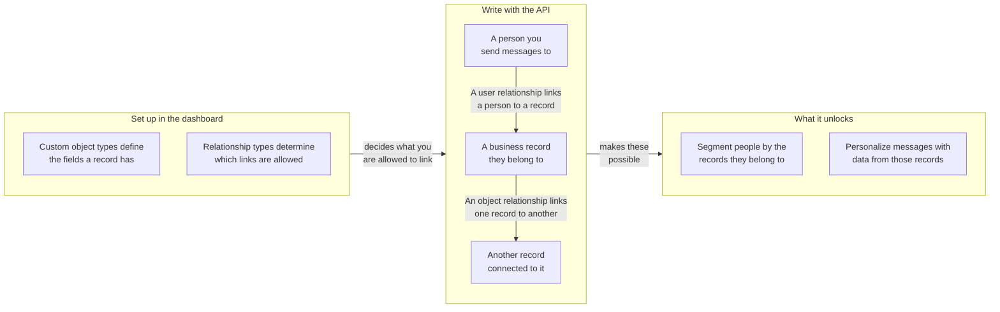

## 기본 URL 및 인증 {#base-url-and-authentication}

워크스페이스 REST 엔드포인트를 사용하고 `Authorization: Bearer YOUR_REST_API_KEY`를 전송합니다. 이 섹션에서는 커스텀 오브젝트 엔드포인트가 호스팅되는 위치와 요청이 인증되는 방식을 설명합니다.

- 엔드포인트 호스트에 대해서는 [Braze API 개요]({{site.baseurl}}/api/basics#endpoints)를 참조하세요.
- 모든 요청 및 응답 페이로드는 JSON입니다.
- 요청은 API 키를 소유한 워크스페이스로 범위가 지정됩니다.
- 키에 IP 허용 목록이 있는 경우, 허용 목록에 없는 IP 주소는 `403`을 반환합니다.

## API 키 권한 {#api-key-permissions}

이 섹션에서는 API 키를 안전하게 범위 지정할 수 있도록 각 엔드포인트를 필요한 권한에 매핑합니다.

| 권한 | 엔드포인트 그룹 |
|---|---|
| `custom_objects.read` | 유형 및 오브젝트 읽기, 오브젝트 관계 읽기 |
| `custom_objects.create` | 오브젝트 생성 |
| `custom_objects.update` | 오브젝트 교체 및 업데이트 |
| `custom_objects.delete` | 오브젝트 삭제 |
| `custom_objects.user_relationships.read` | 사용자 관계 읽기 |
| `custom_objects.user_relationships.create` | 사용자 관계 생성 |
| `custom_objects.user_relationships.update` | 사용자 관계 교체 및 업데이트 |
| `custom_objects.user_relationships.delete` | 사용자 관계 삭제 |
| `custom_objects.object_relationships.create` | 오브젝트 관계 생성 |
| `custom_objects.object_relationships.update` | 오브젝트 관계 교체 및 업데이트 |
| `custom_objects.object_relationships.delete` | 오브젝트 관계 삭제 |
{: .reset-td-br-1 .reset-td-br-2 aria-label="커스텀 오브젝트 권한 그룹" }


오브젝트 관계 읽기에는 `custom_objects.read`를 사용합니다. `custom_objects.object_relationships.read` 권한은 별도로 존재하지 않습니다.


## 사용량 제한 {#rate-limits}

이 섹션에서는 읽기 및 쓰기 트래픽에 대한 기본 요청 할당량과 응답 헤더를 설명합니다.

| 버킷 | 기본 제한 |
|---|---|
| 커스텀 오브젝트 읽기 | 분당 50건의 요청 |
| 커스텀 오브젝트 쓰기 | 분당 50건의 요청 |
{: .reset-td-br-1 .reset-td-br-2 aria-label="커스텀 오브젝트 기본 사용량 제한" }

모든 응답에는 `X-RateLimit-Limit`, `X-RateLimit-Remaining`, `X-RateLimit-Reset`이 포함됩니다.

제한된 요청에 대해 Braze는 `429`와 함께 `id` 및 `message`가 포함된 오류 페이로드를 반환합니다.

```json
{
  "errors": [
    {
      "id": "rate-limit-exceeded",
      "message": "You have exceeded your limit of 50 requests per minute."
    }
  ]
}
```

## 핵심 개념 {#core-concepts}

이 섹션에서는 모든 커스텀 오브젝트 엔드포인트에서 사용되는 주요 식별자를 정의합니다.

- `type_name`: 워크스페이스 내에서 고유한 커스텀 오브젝트 유형 머신 이름입니다.
- `external_id`: 유형 내에서 고유한 오브젝트 식별자입니다.
- `braze_id`: 사용자 관계 엔드포인트에서 사용되는 Braze 사용자 ID입니다.
- `attributes`: 구성된 스키마에 따라 유효성이 검증되는 필드 이름 기반의 오브젝트 또는 관계 데이터입니다.

## 관계 작동 방식 {#how-relationships-work}

이 섹션에서는 엔드포인트 참조 페이지를 사용하기 전에 관계 유형, 관계 에지, `anchor` 동작에 대해 설명합니다.

### 관계 모델 한눈에 보기 {#relationship-model-at-a-glance}

이 다이어그램을 통해 유형, 레코드, 관계가 어떻게 연결되는지, 그리고 이를 연결하면 Braze에서 무엇을 할 수 있는지 확인할 수 있습니다. 유형은 대시보드에서 정의하고, 레코드와 레코드 간의 링크는 이 엔드포인트를 통해 작성합니다.



### 유형과 에지는 별개입니다 {#types-and-edges-are-separate}

- 관계 유형은 유효한 링크를 정의하며 대시보드에서 관리됩니다.
- 관계 에지는 레코드 간의 실제 링크이며, 이 API 엔드포인트를 통해 생성, 업데이트 및 삭제됩니다.
- 관계를 작성하기 전에 다음을 사용하여 유효한 `rel_kind` 값을 조회하세요:
  - `GET /custom_objects/types/{type_name}/user_relationship_types`
  - `GET /custom_objects/types/{type_name}/object_relationship_types`

### 오브젝트 관계에 `related_type_name`이 필요한 이유 {#why-object-relationships-require-related_type_name}

- `rel_kind`는 모든 오브젝트 유형 쌍에서 전역적으로 고유하지 않습니다. 예를 들어, `rel_kind`는 한 오브젝트 유형 쌍에서는 `subaccount`이고 다른 쌍에서는 `partner_account`일 수 있습니다.
- 따라서 오브젝트 관계 쓰기에는 의도한 관계 유형과 연결의 다른 오브젝트 유형을 식별하기 위해 `rel_kind`와 `related_type_name`이 모두 필요합니다.
- `related_type_name`이 해당 `rel_kind`의 관계 유형과 일치하지 않으면 요청은 `400`을 반환합니다.

### `anchor`는 관계 방향을 제어합니다 {#anchor-controls-relationship-direction}

오브젝트 관계는 방향성이 있습니다. URL 오브젝트는 `anchor`에 따라 해석됩니다.

| `anchor` | URL 오브젝트 역할 | 응답의 관련 오브젝트 키 |
|---|---|---|
| `source` (기본값) | 시작 측 (발신 에지) | `to_custom_object` |
| `target` | 도착 측 (수신 에지) | `from_custom_object` |
{: .reset-td-br-1 .reset-td-br-2 .reset-td-br-3 aria-label="오브젝트 관계의 anchor 동작" }

반대 anchor 관점에서 동일한 에지를 생성해도 하나의 기본 관계를 대상으로 합니다. 동일한 에지에 대한 두 번째 생성 호출은 `409` (`duplicate-object-relationship`)를 반환합니다.

### 사용자 관계의 경로 비대칭 {#path-asymmetry-for-user-relationships}

사용자 관계 읽기와 쓰기는 의도적으로 다른 엔드포인트 경로를 사용합니다:

- 읽기: `GET /custom_objects/objects/{type_name}/{external_id}/user_relationships`
- 쓰기: `POST|PUT|PATCH|DELETE /custom_objects/objects/{type_name}/{external_id}/users`

### 관계 속성은 오브젝트 속성과 별개입니다 {#relationship-attributes-are-separate-from-object-attributes}

- 관계 엔드포인트는 에지 수준의 속성을 최상위 `attributes` 필드에 반환합니다.
- 오브젝트 속성은 `to_custom_object` 또는 `from_custom_object` 하위에 중첩됩니다.
- `PUT`은 관계 `attributes`를 교체하고, `PATCH`는 관계 `attributes`를 병합합니다.

### 실습 예제 {#worked-example}

이 예제에서는 일반적인 계정 워크플로를 보여줍니다:

1. `account/acct-123`을 생성합니다.
2. `account/acct-456`을 하위 계정으로 생성합니다.
3. `rel_kind: account_user`로 사용자를 `acct-123`에 연결합니다.
4. `rel_kind: subaccount`로 `acct-123`을 `acct-456`에 연결합니다.

링크를 다시 읽으려면:

- `GET /custom_objects/objects/account/acct-123/user_relationships` — 연결된 사용자를 조회합니다.
- `GET /custom_objects/objects/account/acct-123/object_relationships` — 발신 오브젝트 링크를 조회합니다.
- `GET /custom_objects/objects/account/acct-456/object_relationships?anchor=target` — 수신 오브젝트 링크를 조회합니다.


오브젝트 관계 및 사용자 관계의 `DELETE` 엔드포인트에는 JSON 요청 본문이 필요합니다.


## 페이지네이션 및 데이터 최신성 {#pagination-and-data-freshness}

이 섹션에서는 목록 페이지네이션 동작과 쓰기 후 예상되는 데이터 가시성 타이밍을 다룹니다.

- 목록 엔드포인트는 `limit`과 `offset`을 지원합니다.
- `limit`의 기본값은 `100`이며 `1`에서 `250` 사이로 제한됩니다.
- `offset`의 기본값은 `0`이며, 음수 값은 `0`으로 처리됩니다.
- 쓰기 작업은 읽기 및 Liquid 개인화에 즉시 반영됩니다.
- 커스텀 오브젝트 기반 세그먼트 멤버십은 계산된 필터가 매시간 새로 고쳐지기 때문에 최대 1시간까지 지연될 수 있습니다.

## 오류 동작 {#error-behavior}

이 섹션에서는 커스텀 오브젝트 엔드포인트 전반에서 사용되는 상태 코드 및 오류 응답 패턴을 요약합니다.

- `404`, `409`, `422`, `429`는 `id` 및 `message`가 포함된 `errors` 배열을 반환합니다.
- `400`, `401`, `403`은 단일 `error` 문자열을 반환합니다.
- 계약 기반 `422` 제한은 회사마다 다릅니다.