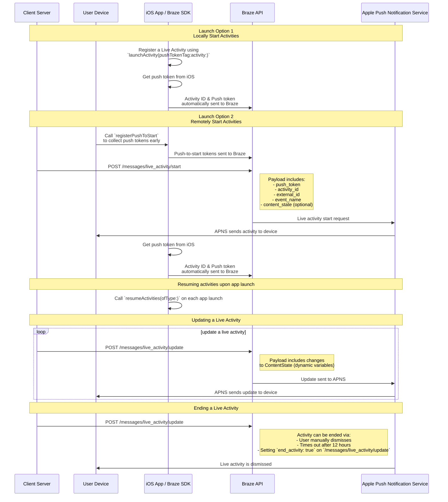

# Swift의 라이브 활동 {#live-activities-for-swift}

> Swift Braze SDK의 라이브 활동을 구현하는 방법을 알아보세요. 라이브 활동은 잠금 화면에 바로 표시되는 지속적인 인터랙티브 알림으로, 사용자는 기기를 잠금 해제하지 않고도 동적인 실시간 업데이트를 받을 수 있습니다.

## 작동 방식 {#how-it-works}

{: style="max-width:40%;float:right;margin-left:15px;"}

라이브 액티비티는 정적 정보와 사용자가 업데이트하는 동적 정보의 조합을 표시합니다. 예를 들어, 배달 상태 추적기를 제공하는 라이브 액티비티를 만들 수 있습니다. 이 라이브 액티비티에는 정적 정보로 회사 이름이 포함되며, 배달 기사가 목적지에 가까워짐에 따라 업데이트되는 동적 "배달까지 남은 시간"도 포함됩니다.

개발자는 Braze를 사용하여 라이브 액티비티 수명 주기를 관리하고, Braze REST API를 호출하여 라이브 액티비티를 업데이트하며, 구독된 모든 기기가 가능한 한 빨리 업데이트를 수신하도록 할 수 있습니다. 또한 Braze를 통해 라이브 액티비티를 관리하므로, 푸시 알림, 인앱 메시지, Content Cards 등 다른 메시징 채널과 함께 사용하여 채택을 촉진할 수 있습니다.

## 시퀀스 다이어그램 {#sequence-diagram}









## 라이브 활동 구현하기 {#implementing-a-live-activity}

# 또한 다음 사항을 완료해야 합니다:

- 프로젝트가 iOS 16.1 이상을 대상으로 하는지 확인합니다.
- Xcode 프로젝트의 **Signing & Capabilities**에서 `Push Notification` 권한을 추가합니다.
- 알림 전송에 `.p8` 키가 사용되는지 확인합니다. `.p12` 또는 `.pem`과 같은 이전 파일은 지원되지 않습니다.
- Braze Swift SDK 버전 8.2.0부터 [라이브 활동을 원격으로 등록](#swift_step-2-start-the-activity)할 수 있습니다. 이 기능을 사용하려면 iOS 17.2 이상이 필요합니다.


라이브 활동과 푸시 알림은 유사하지만 시스템 권한은 별도로 관리됩니다. 기본적으로 모든 라이브 활동 기능이 활성화되어 있지만, 사용자는 앱별로 이 기능을 비활성화할 수 있습니다.




### 1단계: 활동 생성하기 {#create-an-activity}

먼저 Apple 설명서의 [Displaying live data with Live Activities](https://developer.apple.com/documentation/activitykit/displaying-live-data-with-live-activities)를 따라 iOS 애플리케이션에서 라이브 활동을 설정했는지 확인합니다. 이 작업의 일부로 `Info.plist`에 `NSSupportsLiveActivities`를 `YES`로 설정해야 합니다.

라이브 활동의 정확한 특성은 비즈니스 사례에 따라 다르므로, [Activity](https://developer.apple.com/documentation/activitykit/activityattributes) 객체를 설정하고 초기화합니다. 중요한 정의 항목은 다음과 같습니다:
* `ActivityAttributes`: 이 프로토콜은 라이브 활동에 표시되는 정적(변경 불가) 및 동적(변경 가능) 콘텐츠를 정의합니다.
* `ActivityAttributes.ContentState`: 이 타입은 활동 진행 중에 업데이트되는 동적 데이터를 정의합니다.

또한 SwiftUI를 사용하여 잠금 화면 및 지원 기기의 Dynamic Island에 대한 UI 프레젠테이션을 생성합니다.

Apple의 라이브 활동에 대한 [사전 요구 사항 및 제한 사항](https://developer.apple.com/documentation/activitykit/displaying-live-data-with-live-activities#Understand-constraints)을 숙지하세요. 이러한 제약 조건은 Braze와 독립적입니다.


동일한 라이브 활동에 빈번한 푸시를 보낼 것으로 예상되는 경우, `Info.plist` 파일에서 `NSSupportsLiveActivitiesFrequentUpdates`를 `YES`로 설정하여 Apple의 예산 제한에 의한 스로틀링을 방지할 수 있습니다. 자세한 내용은 ActivityKit 설명서의 [`Determine the update frequency`](https://developer.apple.com/documentation/activitykit/updating-and-ending-your-live-activity-with-activitykit-push-notifications#Determine-the-update-frequency) 섹션을 참조하세요.


#### 예시 {#example}

Superb Owl 쇼에 대한 업데이트를 사용자에게 제공하는 라이브 활동을 만들고 싶다고 가정해 보겠습니다. 두 야생동물 구조 단체가 보호 중인 올빼미 수에 따라 점수를 받습니다. 이 예시에서는 `SportsActivityAttributes`라는 구조체를 만들었지만, `ActivityAttributes`의 자체 구현을 사용할 수도 있습니다.

```swift
#if canImport(ActivityKit)
  import ActivityKit
#endif

@available(iOS 16.1, *)
struct SportsActivityAttributes: ActivityAttributes {
  public struct ContentState: Codable, Hashable {
    var teamOneScore: Int
    var teamTwoScore: Int
  }

  var gameName: String
  var gameNumber: String
}
```

### 2단계: 활동 시작하기 {#start-the-activity}

먼저 활동을 등록할 방법을 선택합니다:

- **원격:** 사용자 라이프사이클 초기에 push-to-start 토큰이 필요하기 전에 [`registerPushToStart`](<http://braze-inc.github.io/braze-swift-sdk/documentation/brazekit/braze/liveactivities-swift.class/registerpushtostart(fortype:name:)>) 메서드를 사용한 다음, [`/messages/live_activity/start`]({{site.baseurl}}/api/endpoints/messaging/live_activity/start) 엔드포인트를 사용하여 활동을 시작합니다.
- **로컬:** 라이브 활동의 인스턴스를 생성한 다음, [`launchActivity`](<https://braze-inc.github.io/braze-swift-sdk/documentation/brazekit/braze/liveactivities-swift.class/launchactivity(pushtokentag:activity:fileid:line:)>) 메서드를 사용하여 Braze가 관리할 푸시 토큰을 생성합니다.




라이브 활동을 원격으로 등록하려면 iOS 17.2 이상이 필요합니다.


#### 2.1단계: 위젯 확장에 BrazeKit 추가하기 {#step-21-add-brazekit-to-your-widget-extension}

Xcode 프로젝트에서 앱 이름을 선택한 다음 **General**을 선택합니다. **Frameworks and Libraries**에서 `BrazeKit`이 나열되어 있는지 확인합니다.


#### 2.2단계: BrazeLiveActivityAttributes 프로토콜 추가하기 {#brazeActivityAttributes}

`ActivityAttributes` 구현에서 `BrazeLiveActivityAttributes` 프로토콜에 대한 적합성을 추가한 다음, 속성 모델에 `brazeActivityId` 속성을 추가합니다.


iOS는 `brazeActivityId` 속성을 라이브 활동 push-to-start 페이로드의 해당 필드에 매핑하므로, 이름을 변경하거나 다른 값을 할당해서는 안 됩니다.


```swift
import BrazeKit

#if canImport(ActivityKit)
  import ActivityKit
#endif

@available(iOS 16.1, *)
// 1. Add the `BrazeLiveActivityAttributes` conformance to your `ActivityAttributes` struct.
struct SportsActivityAttributes: ActivityAttributes, BrazeLiveActivityAttributes {
  public struct ContentState: Codable, Hashable {
    var teamOneScore: Int
    var teamTwoScore: Int
  }

  var gameName: String
  var gameNumber: String

  // 2. Add the `String?` property to represent the activity ID.
  var brazeActivityId: String?
}
```

#### 2.3단계: push-to-start 등록하기 {#step-23-register-for-push-to-start}

다음으로, 라이브 활동 타입을 등록하여 Braze가 이 타입과 연결된 모든 push-to-start 토큰 및 라이브 활동 인스턴스를 추적할 수 있도록 합니다.


iOS 운영 체제는 기기가 재시작된 후 첫 번째 앱 설치 시에만 push-to-start 토큰을 생성합니다. 토큰이 안정적으로 등록되도록 하려면 `didFinishLaunchingWithOptions` 메서드에서 `registerPushToStart`를 호출하세요.


##### 예시

다음 예시에서 `LiveActivityManager` 클래스는 라이브 활동 객체를 처리합니다. 그런 다음 `registerPushToStart` 메서드가 `SportsActivityAttributes`를 등록합니다:

```swift
import BrazeKit

#if canImport(ActivityKit)
  import ActivityKit
#endif

class LiveActivityManager {

  @available(iOS 17.2, *)
  func registerActivityType() {
    // This method returns a Swift background task.
    // You may keep a reference to this task if you need to cancel it wherever appropriate, or ignore the return value if you wish.
    let pushToStartObserver: Task = Self.braze?.liveActivities.registerPushToStart(
      forType: Activity<SportsActivityAttributes>.self,
      name: SportsActivityAttributes.name
    )
  }

}
```

#### 2.4단계: push-to-start 알림 보내기 {#step-24-send-a-push-to-start-notification}

[`/messages/live_activity/start`]({{site.baseurl}}/api/endpoints/messaging/live_activity/start) 엔드포인트를 사용하여 원격 push-to-start 알림을 보냅니다.



[Apple의 ActivityKit 프레임워크](https://developer.apple.com/documentation/activitykit)를 사용하여 푸시 토큰을 가져올 수 있으며, Braze SDK가 이를 관리합니다. 이를 통해 Braze API를 통해 라이브 활동을 업데이트할 수 있으며, Braze가 백엔드에서 Apple 푸시 알림 서비스(APNs)로 푸시 토큰을 전송합니다.

1. Apple의 ActivityKit API를 사용하여 라이브 활동 구현의 인스턴스를 생성합니다.
2. `pushType` 매개변수를 `.token`으로 설정합니다.
3. 정의한 라이브 활동 `ActivitiesAttributes` 및 `ContentState`를 전달합니다.
4. [`launchActivity(pushTokenTag:activity:)`](https://braze-inc.github.io/braze-swift-sdk/documentation/brazekit/braze/liveactivities-swift.class)에 전달하여 Braze 인스턴스에 활동을 등록합니다. `pushTokenTag` 매개변수는 사용자가 정의하는 커스텀 문자열입니다. 생성하는 각 라이브 활동에 대해 고유해야 합니다.

라이브 활동을 등록하면 Braze SDK가 푸시 토큰의 변경 사항을 추출하고 관찰합니다.

#### 예시

이 예시에서는 라이브 활동 객체에 대한 인터페이스로 `LiveActivityManager`라는 클래스를 생성합니다. 그런 다음 `pushTokenTag`를 `"sports-game-2024-03-15"`로 설정합니다.

```swift
import BrazeKit

#if canImport(ActivityKit)
  import ActivityKit
#endif

class LiveActivityManager {

  @available(iOS 16.2, *)
  func createActivity() {
    let activityAttributes = SportsActivityAttributes(gameName: "Superb Owl", gameNumber: "Game 1")
    let contentState = SportsActivityAttributes.ContentState(teamOneScore: "0", teamTwoScore: "0")
    let activityContent = ActivityContent(state: contentState, staleDate: nil)
    if let activity = try? Activity.request(attributes: activityAttributes,
                                            content: activityContent,
      // Setting your pushType as .token allows the Activity to generate push tokens for the server to watch.
                                            pushType: .token) {
      // Register your Live Activity with Braze using the pushTokenTag.
      // This method returns a Swift background task.
      // You may keep a reference to this task if you need to cancel it wherever appropriate, or ignore the return value if you wish.
      let liveActivityObserver: Task = AppDelegate.braze?.liveActivities.launchActivity(pushTokenTag: "sports-game-2024-03-15",
                                                                                        activity: activity)
    }
  }

}
```

라이브 활동 위젯은 이 초기 콘텐츠를 사용자에게 표시합니다.

{: style="max-width:40%;"}



### 3단계: 활동 추적 재개하기 {#resume-activity-tracking}

앱 실행 시 Braze가 라이브 활동을 추적하도록 하려면:

1. `AppDelegate` 파일을 엽니다.
2. 사용 가능한 경우 `ActivityKit` 모듈을 가져옵니다.
3. 애플리케이션에 등록한 모든 `ActivityAttributes` 타입에 대해 `application(_:didFinishLaunchingWithOptions:)`에서 [`resumeActivities(ofType:)`](https://braze-inc.github.io/braze-swift-sdk/documentation/brazekit/braze/liveactivities-swift.class/resumeactivities(oftype:))를 호출합니다.

이를 통해 Braze가 모든 활성 라이브 활동에 대한 푸시 토큰 업데이트를 추적하는 작업을 재개할 수 있습니다. 사용자가 기기에서 라이브 활동을 명시적으로 해제한 경우, 해당 활동은 제거된 것으로 간주되며 Braze는 더 이상 추적하지 않습니다.

#### 예시

```swift
import UIKit
import BrazeKit

#if canImport(ActivityKit)
  import ActivityKit
#endif

@main
class AppDelegate: UIResponder, UIApplicationDelegate {

  static var braze: Braze? = nil

  func application(
    _ application: UIApplication,
    didFinishLaunchingWithOptions launchOptions: [UIApplication.LaunchOptionsKey: Any]?
  ) -> Bool {

    if #available(iOS 16.1, *) {
      Self.braze?.liveActivities.resumeActivities(
        ofType: Activity<SportsActivityAttributes>.self
      )
    }

    return true
  }
}
```

### 4단계: 활동 업데이트하기 {#update-the-activity}

{: style="max-width:40%;float:right;margin-left:15px;"}

[`/messages/live_activity/update`]({{site.baseurl}}/api/endpoints/messaging/live_activity/update) 엔드포인트를 사용하면 Braze REST API를 통해 전달되는 푸시 알림으로 라이브 활동을 업데이트할 수 있습니다. 이 엔드포인트를 사용하여 라이브 활동의 `ContentState`를 업데이트합니다.

`ContentState`를 업데이트하면 라이브 활동 위젯에 새로운 정보가 표시됩니다. 다음은 전반전이 끝난 후 Superb Owl 쇼의 모습입니다.

자세한 내용은 [`/messages/live_activity/update` 엔드포인트]({{site.baseurl}}/api/endpoints/messaging/live_activity/update) 문서를 참조하세요.

### 5단계: 활동 종료하기 {#end-the-activity}

라이브 활동이 활성 상태이면 사용자의 잠금 화면과 Dynamic Island 모두에 표시됩니다. Braze를 통해 종료하려면 [`/messages/live_activity/update`]({{site.baseurl}}/api/endpoints/messaging/live_activity/update) 엔드포인트에서 `end_activity`를 `true`로 설정합니다.

라이브 활동 종료 시 안정성을 높이려면 다음 선택적 단계를 수행합니다:

1. 동일한 `update` 요청에 `dismissal_date`를 선택적으로 포함하여 iOS가 라이브 활동 UI를 제거할 시점을 제안합니다.
2. [메시지 활동 로그]({{site.baseurl}}/user_guide/administrative/app_settings/message_activity_log_tab)에서 전달 결과를 확인합니다.

#### 자동 해제 설정하기 {#arranging-automatic-dismissal}

자동 해제를 설정하려면 라이브 활동을 시작한 후 업데이트 엔드포인트에 대한 후속 요청을 예약합니다.

1. `activity_id`를 추적할 수 있는 `/messages/live_activity/start` 요청을 보냅니다.
2. 해당 `activity_id`와 목표 종료 시간을 백엔드 스케줄러에 저장합니다.
3. 목표 종료 시간에 `end_activity`를 `true`로 설정하여 `/messages/live_activity/update` 요청을 보냅니다.
4. 동일한 업데이트 요청에서 해제 날짜를 구성합니다. 자세한 내용은 [`/messages/live_activity/update`]({{site.baseurl}}/api/endpoints/messaging/live_activity/update) 엔드포인트를 참조하세요.

해제 타이밍은 iOS에 의해 제어됩니다. 유효한 종료 요청을 보낸 후에도 잠금 화면이나 Dynamic Island에서의 제거가 OS 수준의 조건에 따라 지연되거나 다르게 동작할 수 있습니다.

라이브 활동은 Braze 외부에서도 종료될 수 있습니다:

* **사용자 해제**: 사용자가 라이브 활동을 수동으로 해제할 수 있습니다.
* **시간 초과**: 기본 시간인 8시간이 지나면 iOS가 사용자의 Dynamic Island에서 라이브 활동을 제거합니다. 기본 시간인 12시간이 지나면 iOS가 사용자의 잠금 화면에서 라이브 활동을 제거합니다.

자세한 내용은 [`/messages/live_activity/update` 엔드포인트]({{site.baseurl}}/api/endpoints/messaging/live_activity/update) 문서를 참조하세요.

## 라이브 활동 추적 {#tracking-live-activities}

라이브 활동 이벤트는 Currents, Snowflake 데이터 공유 및 쿼리 빌더에서 사용할 수 있습니다. 다음 이벤트를 통해 라이브 활동의 수명 주기를 이해하고 모니터링하며, 토큰 가용성을 추적하고, 문제를 독립적으로 진단하거나 전달 상태를 확인할 수 있습니다.

- [라이브 활동 Push To Start 토큰 변경]({{site.baseurl}}/user_guide/data/braze_currents/event_glossary/customer_behavior_events#live-activity-push-to-start-token-change-events): push-to-start(PTS) 토큰이 Braze에 추가되거나 업데이트될 때 이를 캡처하여 사용자별 토큰 등록 및 가용성을 추적할 수 있습니다.
- [라이브 활동 업데이트 토큰 변경]({{site.baseurl}}/user_guide/data/braze_currents/event_glossary/customer_behavior_events#live-activity-update-token-change-events): 라이브 활동 업데이트(LAU) 토큰의 추가, 업데이트 또는 제거를 추적합니다.
- [라이브 활동 전송]({{site.baseurl}}/user_guide/data/braze_currents/event_glossary/message_engagement_events#live-activity-send-events): Braze에서 라이브 활동이 시작, 업데이트 또는 종료될 때마다 기록합니다.
- [라이브 활동 결과]({{site.baseurl}}/user_guide/data/braze_currents/event_glossary/message_engagement_events#live-activity-outcome-events): Braze에서 전송된 모든 라이브 활동에 대한 Apple 푸시 알림 서비스(APNs)의 최종 전달 상태를 나타냅니다.

## 실시간 활동 전송 확인 {#verify-live-activity-sends}

워크스페이스에서 iOS 실시간 활동을 전송하고 있는지 확인해야 하는 경우, 다음 방법을 사용할 수 있습니다.

### 메시지 활동 로그 {#message-activity-log}

**설정** > **메시지 활동 로그**로 이동하여 실시간 활동 오류를 필터링하면 예상 기간 동안의 실시간 활동 관련 전달 결과를 확인할 수 있습니다. 자세한 내용은 [메시지 활동 로그]({{site.baseurl}}/user_guide/administer/global/workspace_settings/logs_and_alerts/message_activity_log)를 참조하세요.

### 쿼리 빌더, Currents 또는 Snowflake 데이터 공유 {#query-builder-currents-or-snowflake-data-sharing}

다음 실시간 활동 이벤트를 확인하여 실시간 활동 수명 주기 및 전달 상태를 검증할 수 있습니다.

- **실시간 활동 전송:** Braze에서 실시간 활동이 시작, 업데이트 또는 종료될 때마다 기록됩니다.
- **실시간 활동 결과:** 전송된 각 실시간 활동에 대한 APN 최종 전달 상태입니다.

선택적으로 토큰 가용성 신호도 확인할 수 있습니다.
- **실시간 활동 Push To Start 토큰 변경**
- **실시간 활동 업데이트 토큰 변경**

### API 사용량 대시보드 {#api-usage-dashboard}

**설정** > **API 및 식별자** > **대시보드**로 이동하여 **필터**를 선택한 후 **엔드포인트**별로 필터링하면 API 응답을 확인할 수 있습니다. 예를 들어, `/messages/live_activity/update`(또는 `/messages/live_activity/start`)를 선택하고 최근 30일간의 요청 볼륨을 확인합니다. API 응답은 API가 호출되고 있으며 이 워크스페이스에서 iOS 실시간 활동 알림이 사용되고 있음을 나타냅니다. 자세한 내용은 [API 사용량 대시보드]({{site.baseurl}}/user_guide/analytics/dashboards/api_usage)를 참조하세요.

## 라이브 활동 이벤트 관찰(선택 사항) {#observe-live-activity-events}




Apple의 다음 ActivityKit 스트림을 직접 구독하지 마세요. Braze의 구독과 충돌하여 라이브 활동이 올바르게 작동하지 않을 수 있습니다:

1. [`pushTokenUpdates`](https://developer.apple.com/documentation/activitykit/activity/pushtokenupdates-swift.property)
2. [`activityStateUpdates`](https://developer.apple.com/documentation/activitykit/activity/activitystateupdates-swift.property)
3. [`contentUpdates`](https://developer.apple.com/documentation/activitykit/activity/contentupdates-swift.property)
4. [`pushToStartTokenUpdates`](https://developer.apple.com/documentation/activitykit/activity/pushtostarttokenupdates)
5. [`activityUpdates`](https://developer.apple.com/documentation/activitykit/activity/activityupdates-swift.type.property)

대신 이 섹션에서 설명하는 구독을 사용하세요.


Braze SDK는 `braze.liveActivities`에서 전체 라이브 활동 생애주기를 관찰할 수 있는 두 가지 구독 메서드를 제공합니다. 전체 단계별 안내는 [라이브 활동 튜토리얼](https://braze-inc.github.io/braze-swift-sdk/tutorials/brazekit/b4-live-activities)을 참조하세요.

- [`subscribeToStateUpdates(_:)`](#subscribe-to-state-updates): 푸시 투 스타트 토큰 등록 및 실행 중인 활동 인스턴스에 대한 생애주기 이벤트를 전달합니다.
- [`subscribeToErrors(_:)`](#subscribe-to-errors): 라이브 활동 추적 중 발생한 SDK 및 서버 측 오류를 전달합니다.


두 메서드 모두 [`Braze.Cancellable`](https://braze-inc.github.io/braze-swift-sdk/documentation/brazekit/braze/cancellable-swift.typealias)을 반환합니다. 반환된 값이 강한 참조를 통해 유지되는 한 구독이 활성 상태로 유지됩니다(예: `Braze` 인스턴스와 동일한 생애주기를 가진 속성에 저장).


### 구독 설정 {#set-up-subscriptions}

`application(_:didFinishLaunchingWithOptions:)`에서 구독을 한 번 설정하고 앱의 수명 동안 유지합니다:

```swift
class AppDelegate: UIResponder, UIApplicationDelegate {
  static var braze: Braze?

  var stateSubscription: Braze.Cancellable?
  var errorSubscription: Braze.Cancellable?

  func application(
    _ application: UIApplication,
    didFinishLaunchingWithOptions launchOptions: [UIApplication.LaunchOptionsKey: Any]?
  ) -> Bool {
    let braze = Braze(configuration: config)
    Self.braze = braze

    if #available(iOS 16.1, *) {
      stateSubscription = Self.braze?.liveActivities.subscribeToStateUpdates { event in
        self.handleStateUpdate(event)
      }
      errorSubscription = Self.braze?.liveActivities.subscribeToErrors { error in
        self.handleLiveActivityError(error)
      }
    }

    return true
  }
}
```


콜백은 향후 라이브 활동 이벤트에 대해서만 트리거됩니다. 구독 시점의 현재 상태를 재생하지 않습니다. 현재 상태 스냅샷을 조회하려면 `Activity<T>.activities`를 사용하세요.


### subscribeToStateUpdates {#subscribe-to-state-updates}

`subscribeToStateUpdates(_:)`는 전체 라이브 활동 생애주기를 다루는 `UpdateEvent` 값을 전달합니다. 이벤트는 두 가지 범위로 나뉩니다:

- `.activityType(ActivityType)`: 푸시 투 스타트 토큰 등록을 위한 유형 수준 이벤트(iOS 17.2+). 아직 활동 인스턴스가 존재하지 않습니다.
- `.activityInstance(ActivityInstance)`: 특정 실행 중인 활동에 대한 인스턴스 수준 이벤트.

여러 구독자가 지원됩니다. 각 활성 구독은 모든 이벤트를 독립적으로 수신합니다.

#### 유형 범위 이벤트 {#type-scoped-events}

| 이벤트 | 발생 시점 |
| ----- | ------------- |
| `.pushToStartTokenRead(activityType:)` | OS에서 푸시 투 스타트 토큰을 읽었습니다. 이제 Braze가 이 유형의 새 활동을 원격으로 시작할 수 있습니다. |
| `.pushToStartTokenFlushed(activityType:)` | 토큰이 Braze 서버로 전송되었습니다. Braze가 이 유형에 대해 푸시 투 스타트 알림을 보낼 수 있습니다. |
| `.pushToStartOptedOut(activityType:)` | `optOutPushToStart(type:)`를 통해 사용자가 이 활동 유형의 푸시 투 스타트를 옵트아웃했습니다. |
| `.pushToStartOptOutFlushed(activityType:)` | 옵트아웃이 Braze 서버로 전송되었습니다. |
{: .reset-td-br-1 .reset-td-br-2 aria-label="유형 범위 이벤트" }

#### 인스턴스 범위 이벤트 {#instance-scoped-events}

| 이벤트 | 발생 시점 |
| ----- | ------------- |
| `.started(activityId:activityType:pushTokenTag:launchSource:)` | SDK가 `launchActivity(pushTokenTag:activity:)`를 통해 이 활동 추적을 시작했습니다. `launchSource` 값은 앱에서 시작된 활동의 경우 `.local`, 원격으로 시작된 활동의 경우 `.pushToStart`입니다. |
| `.resumed(activityId:activityType:pushTokenTag:)` | SDK가 `resumeActivities(ofType:)`를 통해 이 활동 추적을 재개했습니다. |
| `.pushTokenFlushed(activityId:activityType:pushTokenTag:)` | 활동의 푸시 토큰이 Braze 서버에 의해 수락되었습니다. 이제 활동이 원격 업데이트를 받을 수 있습니다. |
| `.active(activityId:activityType:)` | 활동이 현재 활성 상태이며 사용자에게 표시됩니다. |
| `.stale(activityId:activityType:staleDate:)` | 활동의 콘텐츠가 오래되었습니다. iOS 16.2 이상에서만 발생합니다. |
| `.dismissed(activityId:activityType:)` | 사용자가 수동으로 활동을 해제했습니다. |
| `.ended(activityId:activityType:)` | 활동이 종료되었습니다. |
| `.contentUpdated(activityId:activityType:)` | 활동의 콘텐츠 상태가 업데이트되었습니다(iOS 16.2+). 커스텀 로직을 사용하여 `Activity.activities`에서 ID로 `Activity<T>`를 조회하고 `activity.content.state`를 통해 타입이 지정된 상태에 접근하세요. |
| `.pushTokenUpdated(activityId:activityType:)` | ActivityKit가 활동의 푸시 토큰을 교체했습니다. |
{: .reset-td-br-1 .reset-td-br-2 aria-label="인스턴스 범위 이벤트" }

##### 예시

```swift
func handleStateUpdate(_ event: Braze.LiveActivities.UpdateEvent) {
  switch event {

  // Type-scoped: push-to-start token lifecycle (iOS 17.2+)
  case .activityType(.pushToStartTokenRead(let activityType)):
    print("[\(activityType)] Push-to-start token read by SDK")

  // ...

  // Instance-scoped: SDK tracking
  case .activityInstance(.started(let id, let type, let tag, let source)):
    print("[\(type)] Activity \(id) started via \(source), tag: \(tag)")

  // ...

  // Instance-scoped: ActivityKit lifecycle
  case .activityInstance(.active(let id, let type)):
    print("[\(type)] Activity \(id) is active")

  // ...

  case .activityInstance(.ended(let id, let type)):
    print("[\(type)] Activity \(id) ended")

  // Instance-scoped: content updates (iOS 16.2+)
  case .activityInstance(.contentUpdated(let id, let type)):
    // For more advanced use cases of `contentUpdated`, see the section below
    print("[\(type)] Content updated for activity \(id)")

  case .activityInstance(.pushTokenUpdated(let id, let type)):
    print("[\(type)] Activity \(id) push token rotated")
  }
}
```

### subscribeToErrors {#subscribe-to-errors}

`subscribeToErrors(_:)`는 `UpdateEvent`와 동일한 두 가지 범위를 사용하여 `ErrorEvent` 값을 전달합니다:

- `.activityType(ActivityType)`: 푸시 투 스타트 등록 실패에 대한 유형 수준 오류.
- `.activityInstance(ActivityInstance)`: 실행 중인 활동에 대한 인스턴스 수준 오류.

재시도가 적절한지 판단하려면 `isTransient` 플래그를 사용하세요. SDK는 일시적 실패를 자동으로 재시도합니다.

#### 유형 범위 오류 {#type-scoped-errors}

| 오류 | 발생 시점 |
| ----- | ------------- |
| `.pushToStartRegistrationFailed(activityType:isTransient:reason:)` | 푸시 투 스타트 토큰이 Braze 서버에 도달하지 못했습니다. |
{: .reset-td-br-1 .reset-td-br-2 aria-label="유형 범위 오류" }

#### 인스턴스 범위 오류 {#instance-scoped-errors}

| 오류 | 발생 시점 |
| ----- | ------------- |
| `.registrationFailed(activityId:activityType:pushTokenTag:isTransient:reason:)` | 활동의 푸시 토큰이 Braze에 등록되지 못했습니다. |
| `.activityNotFound(activityId:activityType:)` | `resumeActivities(ofType:)`가 더 이상 실행되지 않는 활동에 대한 저장된 매핑을 발견했습니다. 앱이 종료된 동안 활동이 종료되었을 가능성이 높습니다. |
| `.invalidPushTokenTag(activityId:activityType:tag:)` | `launchActivity(pushTokenTag:activity:)`가 유효하지 않은 태그로 호출되었습니다. 태그는 비어 있지 않아야 하며 256바이트 미만이어야 합니다. |
{: .reset-td-br-1 .reset-td-br-2 aria-label="인스턴스 범위 오류" }

##### 예시

```swift
func handleLiveActivityError(_ error: Braze.LiveActivities.ErrorEvent) {
  switch error {

  // Type-scoped errors
  case .activityType(.pushToStartRegistrationFailed(let type, let isTransient, let reason)):
    if isTransient {
      print("[\(type)] Push-to-start registration failed (transient, will retry): \(reason)")
    } else {
      print("[\(type)] Push-to-start registration failed (permanent): \(reason)")
    }

  // Instance-scoped errors
  case .activityInstance(.registrationFailed(let id, let type, _, let isTransient, let reason)):
    if isTransient {
      print("[\(type)] Activity \(id) registration failed (transient, retrying): \(reason)")
    } else {
      print("[\(type)] Activity \(id) registration failed (permanent): \(reason)")
    }

  case .activityInstance(.activityNotFound(let id, let type)):
    print("[\(type)] Stored activity \(id) not found on resume")

  case .activityInstance(.invalidPushTokenTag(let id, let type, let tag)):
    print("[\(type)] Activity \(id) has invalid push token tag '\(tag)'")
  }
}
```

### 콘텐츠 상태 업데이트 처리(선택 사항) {#handle-content-state}

실제 라이브 활동 인스턴스의 콘텐츠 상태를 사용하려면 이 섹션을 따르세요.

`.contentUpdated` 이벤트가 발생하면 커스텀 로직을 사용하여 `Activity.activities`에서 ID로 실행 중인 `Activity<T>`를 조회한 다음 `activity.content.state`를 통해 타입이 지정된 `ContentState`에 접근합니다.

#### 단일 속성 유형 {#single-attributes-type}

```swift
case .activityInstance(.contentUpdated(let id, let type)):
  #if canImport(ActivityKit)
    // Add custom logic look up the Activity<T> by ID and access your app's typed ContentState.
    // In this example, `SportsActivityAttributes` is the app's custom type.
    if #available(iOS 16.2, *),
      let activity = findActivityInstance(id: id, as: SportsActivityAttributes.self)
    {
      // `activityContent` is now strongly typed as a `SportsActivityAttributes`
      let activityContent = activity.content.state
      print("[\(type)] Game \(id) — score: \(activityContent.teamOneScore)–\(activityContent.teamTwoScore)")
      return
    }
  #endif
  print("[\(type)] Content updated for activity \(id)")

// ...

// - MARK: Helper methods

@available(iOS 16.2, *)
func findActivityInstance<Attributes: ActivityAttributes>(
  id: String,
  as type: Attributes.Type
) -> Activity<Attributes>? {
  // Use Apple's API to find the matching Live Activity instance:
  // - https://developer.apple.com/documentation/activitykit/activity/activities
  Activity<Attributes>.activities.first(where: { $0.id == id })
}
```

#### 다중 속성 유형 {#multiple-attributes-types}

앱에서 여러 `ActivityAttributes` 유형을 사용하는 경우 `type` 문자열을 확인하여 적절한 `Activity<T>`를 조회합니다:

```swift
case .activityInstance(.contentUpdated(let id, let type)):
  #if canImport(ActivityKit)
    if #available(iOS 16.2, *) {
      if type == SportsActivityAttributes.name,
        let activity = findActivityInstance(id: id, as: SportsActivityAttributes.self)
      {
        let activityContent = activity.content.state
        print("[\(type)] Game \(id) — score: \(activityContent.teamOneScore)–\(activityContent.teamTwoScore)")
        return

      } else if type == OrderActivityAttributes.name,
        let activity = findActivityInstance(id: id, as: OrderActivityAttributes.self)
      {
        let activityContent = activity.content.state
        print("[\(type)] Order \(id) — status: \(activityContent.status), ETA: \(activityContent.eta)")
        return
      }
    }
  #endif
  print("[\(type)] Content updated for activity \(id)")

// ...

// - MARK: Helper methods

@available(iOS 16.2, *)
func findActivityInstance<Attributes: ActivityAttributes>(
  id: String,
  as type: Attributes.Type
) -> Activity<Attributes>? {
  // Use Apple's API to find the matching Live Activity instance:
  // - https://developer.apple.com/documentation/activitykit/activity/activities
  Activity<Attributes>.activities.first(where: { $0.id == id })
}
```

## 자주 묻는 질문(FAQ) {#faq}

### 기능 및 지원 {#functionality-and-support}

#### 어떤 플랫폼에서 라이브 활동을 지원하나요? {#what-platforms-support-live-activities}

현재 라이브 활동은 iOS 및 iPadOS에 특정한 기능입니다. 기본적으로 iPhone 또는 iPad에서 시작된 활동은 연결된 watchOS 11+ 또는 macOS 26+ 기기에서도 추가로 표시됩니다.

Braze는 현재 Android에서 네이티브 라이브 활동 지원을 제공하지 않습니다. Android의 경우 Braze 푸시 알림과 커스텀 알림 렌더링을 통해 실시간 업데이트 경험을 구축할 수 있습니다.

{: style="max-width:60%;"}

라이브 활동 문서에서는 Braze Swift SDK를 통해 라이브 활동을 관리하기 위한 [필수 조건]({{site.baseurl}}/developer_guide/live_notifications/live_activities#implementing-a-live-activity)을 다룹니다.

#### React Native 앱이 라이브 활동을 지원하나요? {#do-react-native-apps-support-live-activities}

예, React Native SDK 3.0.0 이상에서 Braze Swift SDK를 통해 라이브 활동을 지원합니다. 즉, Braze Swift SDK 위에 직접 React Native iOS 코드를 작성해야 합니다.

Apple에서 제공하는 라이브 활동 기능은 JavaScript로 변환할 수 없는 언어(예: Swift 동시성, 제네릭, SwiftUI)를 사용하기 때문에 라이브 활동을 위한 React Native 전용 JavaScript 편의 API는 없습니다.

#### Braze는 Campaign 또는 캔버스 단계로 라이브 활동을 지원하나요? {#does-braze-support-live-activities-as-a-campaign-or-canvas-step}

아니요, 현재 이 기능은 지원되지 않습니다.

### 푸시 알림 및 라이브 활동 {#push-notifications-and-live-activities}

#### 라이브 활동이 활성화되어 있는 동안 푸시 알림이 전송되면 어떻게 되나요? {#what-happens-if-a-push-notification-is-sent-while-a-live-activity-is-active}

{: style="max-width:30%;float:right;margin-left:15px;"}

라이브 활동과 푸시 알림은 서로 다른 화면 영역을 차지하며 사용자 화면에서 충돌하지 않습니다.

#### 라이브 활동이 푸시 메시지 기능을 활용하는 경우, 라이브 활동을 수신하려면 푸시 알림을 활성화해야 하나요? {#if-live-activities-leverage-push-message-functionality-do-push-notifications-need-to-be-enabled-to-receive-live-activities}

라이브 활동은 업데이트를 위해 푸시 알림에 의존하지만, 서로 다른 사용자 설정에 의해 제어됩니다. 사용자는 라이브 활동에 옵트인하면서 푸시 알림은 옵트아웃할 수 있으며, 그 반대도 가능합니다.

라이브 활동 업데이트 토큰은 8시간 후에 만료됩니다.

#### 라이브 활동에 푸시 프라이머가 필요한가요? {#do-live-activities-require-push-primers}

[푸시 프라이머]({{site.baseurl}}/user_guide/channels/push/best_practices/push_primer_messages)는 사용자에게 앱의 푸시 알림 옵트인을 유도하는 모범 사례입니다. 그러나 라이브 활동에 옵트인하라는 시스템 프롬프트는 없습니다. 기본적으로 사용자는 iOS 16.1 이상에서 해당 앱을 설치할 때 개별 앱의 라이브 활동에 옵트인됩니다. 이 권한은 앱별로 기기 설정에서 비활성화하거나 다시 활성화할 수 있습니다.

### 기술 주제 및 문제 해결 {#technical-topics-and-troubleshooting}

#### 라이브 활동에 오류가 있는지 어떻게 알 수 있나요? {#how-do-i-know-if-live-activities-has-errors}

모든 라이브 활동 오류는 Braze 대시보드의 [메시지 활동 로그]({{site.baseurl}}/user_guide/administer/global/workspace_settings/logs_and_alerts/message_activity_log)에 기록되며, "LiveActivity Errors"로 필터링할 수 있습니다.

#### 푸시 투 스타트 알림을 보낸 후에도 라이브 활동을 받지 못한 이유는 무엇인가요? {#after-sending-a-push-to-start-notification-why-havent-i-received-my-live-activity}

먼저 페이로드에 [`messages/live_activity/start`]({{site.baseurl}}/api/endpoints/messaging/live_activity/start) 엔드포인트에 설명된 모든 필수 필드가 포함되어 있는지 확인합니다. `activity_attributes` 및 `content_state` 필드는 프로젝트 코드에 정의된 속성과 일치해야 합니다. 페이로드가 정확하다고 확신하는 경우, APNs에 의해 사용량 제한이 적용되었을 수 있습니다. 이 제한은 Braze가 아닌 Apple에서 부과합니다.

푸시 투 스타트 알림이 기기에 성공적으로 도착했지만 사용량 제한으로 인해 표시되지 않았는지 확인하려면 Mac의 콘솔 앱을 사용하여 프로젝트를 디버그할 수 있습니다. 원하는 기기의 기록 프로세스를 연결한 다음 검색창에서 `process:liveactivitiesd`로 로그를 필터링합니다.

#### 푸시 투 스타트로 라이브 활동을 시작한 후 새 업데이트를 받지 못하는 이유는 무엇인가요? {#after-starting-my-live-activity-with-push-to-start-why-isnt-it-receiving-new-updates}

[2.2단계: BrazeLiveActivityAttributes 프로토콜 추가](#swift_brazeActivityAttributes)에서 설명한 지침을 올바르게 구현했는지 확인합니다. `ActivityAttributes`에는 `BrazeLiveActivityAttributes` 프로토콜 준수와 `brazeActivityId` 속성이 모두 포함되어야 합니다.

라이브 활동 푸시 투 스타트 알림을 받은 후, Braze URL의 `/push_token_tag` 엔드포인트로 나가는 네트워크 요청이 표시되는지, `"tag"` 필드 아래에 올바른 활동 ID가 포함되어 있는지 다시 한번 확인합니다.

마지막으로, 업데이트 페이로드의 라이브 활동 속성 유형이 `registerPushToStart` SDK 메서드 호출에 사용된 정확한 문자열 및 클래스와 일치하는지 확인하세요. 오타를 방지하기 위해 상수를 사용하세요.

#### `live_activity/update` 엔드포인트를 사용하려고 할 때 액세스 거부 응답을 받습니다. 왜인가요? {#i-am-receiving-an-access-denied-response-when-i-try-to-use-the-live_activityupdate-endpoint-why}

사용하는 API 키에 올바른 권한을 부여해야 다양한 Braze API 엔드포인트에 액세스할 수 있습니다. 이전에 생성한 API 키를 사용하는 경우 해당 권한을 업데이트하지 않았을 수 있습니다. [API 키 보안 개요]({{site.baseurl}}/api/basics#rest-api-key-security)를 다시 한번 살펴보세요.

#### `messages/send` 엔드포인트는 `messages/live_activity/update` 엔드포인트와 사용량 제한을 공유하나요? {#does-the-messagessend-endpoint-share-rate-limits-with-the-messageslive_activityupdate-endpoint}

기본적으로 `messages/live_activity/update` 엔드포인트의 사용량 제한은 여러 엔드포인트에 걸쳐 워크스페이스당 시간당 250,000건의 요청입니다. 자세한 내용은 [API 사용량 제한]({{site.baseurl}}/api/api_limits)을 참조하세요.