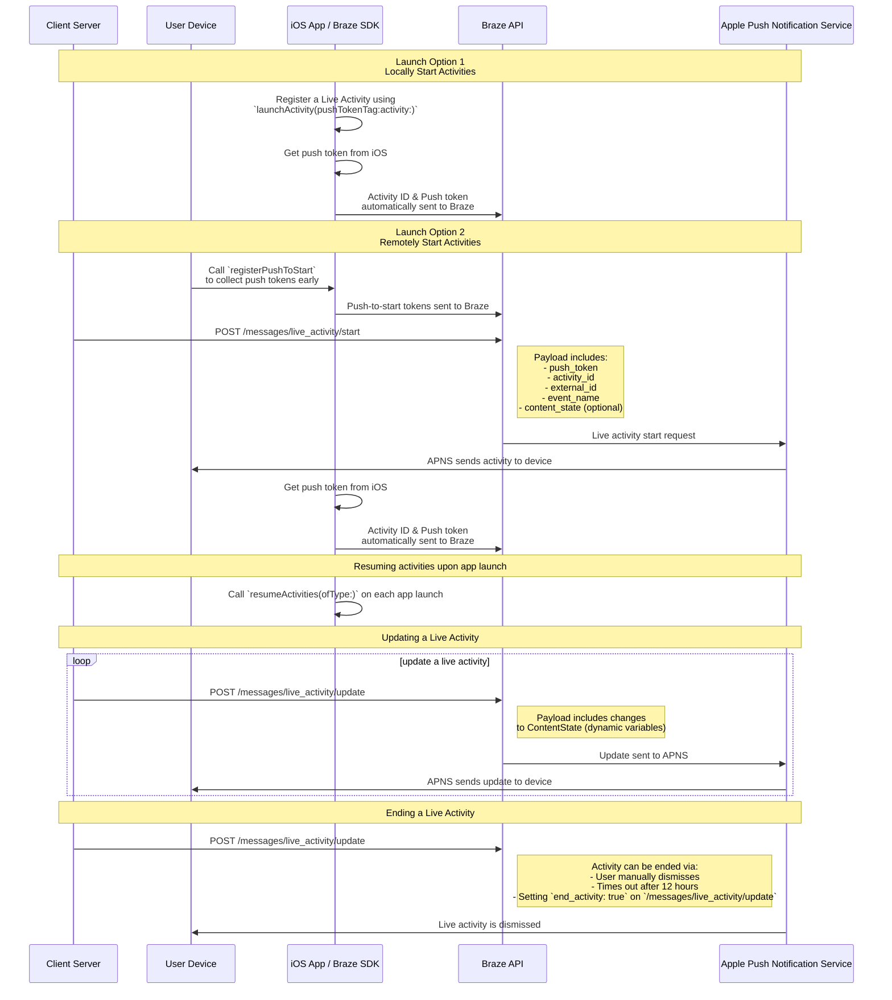

# Swift의 라이브 활동

> Swift Braze SDK의 라이브 활동을 구현하는 방법을 알아보세요. 라이브 활동은 잠금 화면에 바로 표시되는 지속적인 대화형 알림으로, 사용자는 기기를 잠금 해제하지 않고도 동적인 실시간 업데이트를 받을 수 있습니다.

## 작동 방식

{: style="max-width:40%;float:right;margin-left:15px;"}

라이브 활동은 정적 정보와 업데이트하는 동적 정보의 조합으로 표시됩니다. 예를 들어 배송 상태 추적기를 제공하는 라이브 활동을 만들 수 있습니다. 이 라이브 활동에는 회사 이름이 정적 정보로 표시되며, 배송 기사가 목적지에 가까워질수록 업데이트되는 동적 '배송 시간'이 표시됩니다.

개발자는 Braze를 사용하여 라이브 활동 생애주기를 관리하고, Braze REST API를 호출하여 라이브 활동을 업데이트하며, 구독한 모든 기기가 가능한 한 빨리 업데이트를 받도록 할 수 있습니다. 또한 Braze를 통해 라이브 활동을 관리하기 때문에 다른 메시징 채널&mdash;푸시 알림, 인앱 메시지, 콘텐츠 카드&mdash;과 함께 사용하여 채택을 유도할 수 있습니다.

## 시퀀스 다이어그램 {#sequence-diagram}









## 라이브 활동 구현

# 다음도 완료해야 합니다:

- 프로젝트가 iOS 16.1 이상을 대상으로 하는지 확인하세요.
- Xcode 프로젝트의 **Signing & Capabilities** 아래에 `Push Notification` 권한을 추가하세요.
- `.p8` 키가 알림을 보내는 데 사용되는지 확인합니다. `.p12` 또는 `.pem` 같은 이전 파일은 지원되지 않습니다.
- Braze Swift SDK 버전 8.2.0부터 [라이브 활동을 원격으로 등록](#swift_step-2-start-the-activity)할 수 있습니다. 이 기능을 사용하려면 iOS 17.2 이상이 필요합니다.


라이브 활동과 푸시 알림은 비슷하지만 시스템 권한은 서로 다릅니다. 기본적으로 모든 라이브 활동 기능은 활성화되어 있지만, 사용자는 앱별로 이 기능을 비활성화할 수 있습니다.




### 1단계: 활동 만들기 {#create-an-activity}

먼저, iOS 애플리케이션에서 라이브 활동을 설정하려면 Apple 설명서의 [라이브 활동으로 라이브 데이터 표시](https://developer.apple.com/documentation/activitykit/displaying-live-data-with-live-activities)를 따라야 합니다. 이 작업의 일환으로 `Info.plist`에서 `NSSupportsLiveActivities`를 `YES`로 설정해야 합니다.

라이브 활동의 정확한 성격은 비즈니스 사례에 따라 다르므로 [Activity](https://developer.apple.com/documentation/activitykit/activityattributes) 오브젝트를 설정하고 초기화해야 합니다. 중요한 점은 다음을 정의해야 한다는 것입니다:
* `ActivityAttributes`: 이 프로토콜은 라이브 활동에 표시되는 정적(변경되지 않음) 및 동적(변경됨) 콘텐츠를 정의합니다.
* `ActivityAttributes.ContentState`: 이 유형은 활동이 진행되는 동안 업데이트될 동적 데이터를 정의합니다.

또한 SwiftUI를 사용하여 지원되는 기기에서 잠금 화면과 Dynamic Island의 UI 프레젠테이션을 생성할 수 있습니다.

이러한 제약 조건은 Braze와는 독립적이므로 라이브 활동에 대한 Apple의 [전제 조건 및 제한](https://developer.apple.com/documentation/activitykit/displaying-live-data-with-live-activities#Understand-constraints) 사항을 숙지하고 있어야 합니다.


동일한 라이브 활동에 푸시를 자주 보낼 예정인 경우 `Info.plist` 파일에서 `NSSupportsLiveActivitiesFrequentUpdates`를 `YES`로 설정하면 Apple의 예산 한도에 의해 제한되는 것을 방지할 수 있습니다. 자세한 내용은 ActivityKit 설명서의 [`Determine the update frequency`](https://developer.apple.com/documentation/activitykit/updating-and-ending-your-live-activity-with-activitykit-push-notifications#Determine-the-update-frequency) 섹션을 참조하세요.


#### 예시

Superb Owl 프로그램에 대한 사용자 업데이트를 제공하는 라이브 활동을 생성한다고 가정합니다. 이 프로그램에서는 서로 경쟁하는 두 야생동물 구조대에게 보호 중인 올빼미에 대한 점수를 부여합니다. 이 예제에서는 `SportsActivityAttributes`라는 구조체를 생성했지만 `ActivityAttributes`를 직접 구현하여 사용할 수 있습니다.

```swift
#if canImport(ActivityKit)
  import ActivityKit
#endif

@available(iOS 16.1, *)
struct SportsActivityAttributes: ActivityAttributes {
  public struct ContentState: Codable, Hashable {
    var teamOneScore: Int
    var teamTwoScore: Int
  }

  var gameName: String
  var gameNumber: String
}
```

### 2단계: 활동 시작 {#start-the-activity}

먼저, 활동을 등록하는 방법을 선택합니다:

- **원격:** [`registerPushToStart`](<http://braze-inc.github.io/braze-swift-sdk/documentation/brazekit/braze/liveactivities-swift.class/registerpushtostart(fortype:name:)>) 메서드를 사용자 라이프사이클 초기에, 푸시 투 스타트 토큰이 필요하기 전에 호출한 다음 [`/messages/live_activity/start`]({{site.baseurl}}/api/endpoints/messaging/live_activity/start) 엔드포인트를 사용하여 활동을 시작합니다.
- **로컬:** 라이브 활동의 인스턴스를 생성한 다음, [`launchActivity`](<https://braze-inc.github.io/braze-swift-sdk/documentation/brazekit/braze/liveactivities-swift.class/launchactivity(pushtokentag:activity:fileid:line:)>) 메서드를 사용하여 Braze가 관리할 푸시 토큰을 생성합니다.




라이브 활동을 원격으로 등록하려면 iOS 17.2 이상이 필요합니다.


#### 2.1단계: 위젯 확장에 BrazeKit 추가하기

Xcode 프로젝트에서 앱 이름을 선택한 다음, **General**을 선택합니다. **Frameworks and Libraries**에서 `BrazeKit`가 나열되어 있는지 확인합니다.


#### 2.2단계: BrazeLiveActivityAttributes 프로토콜 추가 {#brazeActivityAttributes}

`ActivityAttributes` 구현에서 `BrazeLiveActivityAttributes` 프로토콜에 대한 준수를 추가한 다음 속성 모델에 `brazeActivityId` 속성을 추가합니다.


iOS는 `brazeActivityId` 속성을 라이브 활동 푸시 투 스타트 페이로드의 해당 필드에 매핑하므로 이름을 변경하거나 다른 값을 할당해서는 안 됩니다.


```swift
import BrazeKit

#if canImport(ActivityKit)
  import ActivityKit
#endif

@available(iOS 16.1, *)
// 1. Add the `BrazeLiveActivityAttributes` conformance to your `ActivityAttributes` struct.
struct SportsActivityAttributes: ActivityAttributes, BrazeLiveActivityAttributes {
  public struct ContentState: Codable, Hashable {
    var teamOneScore: Int
    var teamTwoScore: Int
  }

  var gameName: String
  var gameNumber: String

  // 2. Add the `String?` property to represent the activity ID.
  var brazeActivityId: String?
}
```

#### 2.3단계: 푸시 투 스타트 등록

다음으로, 라이브 활동 유형을 등록하여 Braze가 이 유형과 관련된 모든 푸시 투 스타트 토큰과 라이브 활동 인스턴스를 추적할 수 있도록 합니다.


iOS 운영체제는 기기를 재시작한 후 처음 앱을 설치할 때만 푸시 투 스타트 토큰을 생성합니다. 토큰이 안정적으로 등록되도록 하려면 `didFinishLaunchingWithOptions` 메서드에서 `registerPushToStart`를 호출하세요.


###### 예시

다음 예제에서 `LiveActivityManager` 클래스는 라이브 활동 오브젝트를 처리합니다. 그런 다음, `registerPushToStart` 메서드에서 `SportsActivityAttributes`를 등록합니다:

```swift
import BrazeKit

#if canImport(ActivityKit)
  import ActivityKit
#endif

class LiveActivityManager {

  @available(iOS 17.2, *)
  func registerActivityType() {
    // This method returns a Swift background task.
    // You may keep a reference to this task if you need to cancel it wherever appropriate, or ignore the return value if you wish.
    let pushToStartObserver: Task = Self.braze?.liveActivities.registerPushToStart(
      forType: Activity<SportsActivityAttributes>.self,
      name: "SportsActivityAttributes"
    )
  }

}
```

#### 2.4단계: 푸시 투 스타트 알림 보내기

[`/messages/live_activity/start`]({{site.baseurl}}/api/endpoints/messaging/live_activity/start) 엔드포인트를 사용하여 원격 푸시 투 스타트 알림을 보냅니다.



[Apple의 ActivityKit 프레임워크](https://developer.apple.com/documentation/activitykit)를 사용하여 푸시 토큰을 받을 수 있으며, Braze SDK가 이를 관리할 수 있습니다. 이렇게 하면 Braze가 백엔드에서 푸시 토큰을 Apple 푸시 알림 서비스(APNs)로 전송하므로 Braze API를 통해 라이브 활동을 업데이트할 수 있습니다.

1. Apple의 ActivityKit API를 사용하여 라이브 활동 구현의 인스턴스를 생성합니다.
2. `pushType` 매개변수를 `.token`으로 설정합니다. 
3. 정의한 라이브 활동 `ActivitiesAttributes` 및 `ContentState`를 전달합니다. 
4. [`launchActivity(pushTokenTag:activity:)`](https://braze-inc.github.io/braze-swift-sdk/documentation/brazekit/braze/liveactivities-swift.class)에 전달하여 Braze 인스턴스에 활동을 등록합니다. `pushTokenTag` 매개변수는 사용자가 정의하는 커스텀 문자열입니다. 생성하는 각 라이브 활동에서 고유해야 합니다.

라이브 활동을 등록한 후 Braze SDK가 푸시 토큰의 변경 사항을 추출하고 관찰합니다.

#### 예시

이 예제에서는 라이브 활동 오브젝트에 대한 인터페이스로 `LiveActivityManager` 클래스를 생성합니다. 그런 다음, `pushTokenTag`를 `"sports-game-2024-03-15"`로 설정합니다.

```swift
import BrazeKit

#if canImport(ActivityKit)
  import ActivityKit
#endif

class LiveActivityManager {
  
  @available(iOS 16.2, *)
  func createActivity() {
    let activityAttributes = SportsActivityAttributes(gameName: "Superb Owl", gameNumber: "Game 1")
    let contentState = SportsActivityAttributes.ContentState(teamOneScore: "0", teamTwoScore: "0")
    let activityContent = ActivityContent(state: contentState, staleDate: nil)
    if let activity = try? Activity.request(attributes: activityAttributes,
                                            content: activityContent,
      // Setting your pushType as .token allows the Activity to generate push tokens for the server to watch.
                                            pushType: .token) {
      // Register your Live Activity with Braze using the pushTokenTag.
      // This method returns a Swift background task.
      // You may keep a reference to this task if you need to cancel it wherever appropriate, or ignore the return value if you wish.
      let liveActivityObserver: Task = AppDelegate.braze?.liveActivities.launchActivity(pushTokenTag: "sports-game-2024-03-15",
                                                                                        activity: activity)
    }
  }
  
}
```

라이브 활동 위젯은 이 초기 콘텐츠를 사용자에게 표시합니다. 

{: style="max-width:40%;"}



### 3단계: 활동 추적 재개 {#resume-activity-tracking}

앱 실행 시 Braze가 라이브 활동을 추적하도록 하려면 다음을 수행합니다:

1. `AppDelegate` 파일을 엽니다.
2. `ActivityKit` 모듈을 사용할 수 있는 경우 가져옵니다.
3. 애플리케이션에 등록한 모든 `ActivityAttributes` 유형에 대해 `application(_:didFinishLaunchingWithOptions:)`에서 [`resumeActivities(ofType:)`](https://braze-inc.github.io/braze-swift-sdk/documentation/brazekit/braze/liveactivities-swift.class/resumeactivities(oftype:))를 호출합니다.

이를 통해 Braze는 모든 활성 라이브 활동에 대한 푸시 토큰 업데이트를 추적하는 작업을 재개할 수 있습니다. 사용자가 기기에서 라이브 활동을 명시적으로 삭제한 경우, 해당 활동은 제거된 것으로 간주되며 Braze는 더 이상 해당 활동을 추적하지 않습니다.

###### 예시

```swift
import UIKit
import BrazeKit

#if canImport(ActivityKit)
  import ActivityKit
#endif

@main
class AppDelegate: UIResponder, UIApplicationDelegate {

  static var braze: Braze? = nil

  func application(
    _ application: UIApplication,
    didFinishLaunchingWithOptions launchOptions: [UIApplication.LaunchOptionsKey: Any]?
  ) -> Bool {
    
    if #available(iOS 16.1, *) {
      Self.braze?.liveActivities.resumeActivities(
        ofType: Activity<SportsActivityAttributes>.self
      )
    }

    return true
  }
}
```

### 4단계: 활동 업데이트 {#update-the-activity}

{: style="max-width:40%;float:right;margin-left:15px;"}

[`/messages/live_activity/update`]({{site.baseurl}}/api/endpoints/messaging/live_activity/update) 엔드포인트를 사용하면 Braze REST API를 통해 전달되는 푸시 알림으로 라이브 활동을 업데이트할 수 있습니다. 이 엔드포인트를 사용하여 라이브 활동의 `ContentState`를 업데이트합니다.

`ContentState`를 업데이트하면 라이브 활동 위젯에 새 정보가 표시됩니다. 다음은 전반전이 끝난 후 Superb Owl 프로그램의 모습입니다.

자세한 내용은 [`/messages/live_activity/update` 엔드포인트]({{site.baseurl}}/api/endpoints/messaging/live_activity/update) 문서를 참조하세요.

### 5단계: 활동 종료 {#end-the-activity}

라이브 활동이 활성화되면 사용자의 잠금 화면과 Dynamic Island에 모두 표시됩니다. Braze를 통해 종료하려면 [`/messages/live_activity/update`]({{site.baseurl}}/api/endpoints/messaging/live_activity/update) 엔드포인트에서 `end_activity`를 `true`로 설정합니다.

라이브 활동 종료의 안정성을 높이려면 다음 선택적 단계를 수행하세요:

1. 동일한 `update` 요청에 `dismissal_date`를 선택적으로 포함하여 iOS가 라이브 활동 UI를 제거할 시점을 제안합니다.
2. [메시지 활동 로그]({{site.baseurl}}/user_guide/administrative/app_settings/message_activity_log_tab/)에서 전달 결과를 확인합니다.

#### 자동 해제 설정

자동 해제를 설정하려면 라이브 활동을 시작한 후 업데이트 엔드포인트에 대한 후속 요청을 예약합니다.

1. 추적할 수 있는 `activity_id`와 함께 `/messages/live_activity/start` 요청을 보냅니다.
2. 해당 `activity_id`와 목표 종료 시간을 백엔드 스케줄러에 저장합니다.
3. 목표 종료 시간에 `end_activity`를 `true`로 설정한 `/messages/live_activity/update` 요청을 보냅니다.
4. 동일한 업데이트 요청에서 해제 날짜를 구성합니다. 자세한 내용은 [`/messages/live_activity/update`]({{site.baseurl}}/api/endpoints/messaging/live_activity/update) 엔드포인트를 참조하세요.

해제 타이밍은 iOS에 의해 제어됩니다. 유효한 종료 요청을 보낸 후에도 잠금 화면이나 Dynamic Island에서의 제거가 OS 수준의 조건에 따라 지연되거나 다르게 동작할 수 있습니다.

라이브 활동은 Braze 외부에서도 종료될 수 있습니다:

* **사용자 해제**: 사용자가 수동으로 라이브 활동을 해제할 수 있습니다.
* **시간 초과**: 기본 시간인 8시간이 지나면 iOS는 사용자의 Dynamic Island에서 라이브 활동을 제거합니다. 기본 시간인 12시간이 지나면 iOS는 사용자의 잠금 화면에서 라이브 활동을 제거합니다.

자세한 내용은 [`/messages/live_activity/update` 엔드포인트]({{site.baseurl}}/api/endpoints/messaging/live_activity/update) 문서를 참조하세요.

## 라이브 활동 추적

라이브 활동 이벤트는 커런츠, Snowflake 데이터 공유 및 쿼리 빌더에서 사용할 수 있습니다. 다음 이벤트는 라이브 활동의 생애주기를 이해하고 모니터링하며, 토큰 가용성을 추적하고, 문제를 독립적으로 진단하거나 전달 상태를 확인하는 데 도움이 됩니다.

- [라이브 활동 푸시 투 스타트 토큰 변경]({{site.baseurl}}/user_guide/data/braze_currents/event_glossary/customer_behavior_events/#live-activity-push-to-start-token-change-events): 푸시 투 스타트(PTS) 토큰이 Braze에 추가되거나 업데이트될 때 캡처하여 사용자별 토큰 등록 및 가용성을 추적할 수 있습니다.
- [라이브 활동 업데이트 토큰 변경]({{site.baseurl}}/user_guide/data/braze_currents/event_glossary/customer_behavior_events/#live-activity-update-token-change-events): 라이브 활동 업데이트(LAU) 토큰의 추가, 업데이트 또는 제거를 추적합니다.
- [라이브 활동 전송]({{site.baseurl}}/user_guide/data/braze_currents/event_glossary/message_engagement_events/#live-activity-send-events): Braze에 의해 라이브 활동이 시작, 업데이트 또는 종료될 때마다 로그를 기록합니다.
- [라이브 활동 결과]({{site.baseurl}}/user_guide/data/braze_currents/event_glossary/message_engagement_events/#live-activity-outcome-events): Braze에서 전송된 모든 라이브 활동에 대해 Apple 푸시 알림 서비스(APNs)로의 최종 전달 상태를 나타냅니다.

## 자주 묻는 질문(FAQ) {#faq}

### 기능 및 지원

#### 어떤 플랫폼에서 라이브 활동을 지원하나요?

현재 라이브 활동은 iOS 및 iPadOS에 특정한 기능입니다. 기본적으로 iPhone 또는 iPad에서 시작된 활동은 연결된 watchOS 11+ 또는 macOS 26+ 기기에서도 추가로 표시됩니다.

{: style="max-width:60%;"}

라이브 활동 문서에서는 Braze Swift SDK를 통해 라이브 활동을 관리하기 위한 [필수 조건]({{site.baseurl}}/developer_guide/platforms/swift/live_activities/#prerequisites)을 다룹니다.

#### React Native 앱이 라이브 활동을 지원하나요?

예, React Native SDK 3.0.0 이상에서 Braze Swift SDK를 통해 라이브 활동을 지원합니다. 즉, Braze Swift SDK 위에 직접 React Native iOS 코드를 작성해야 합니다.

Apple에서 제공하는 라이브 활동 기능은 JavaScript로 변환할 수 없는 언어(예: Swift 동시성, 제네릭, SwiftUI)를 사용하기 때문에 라이브 활동을 위한 React Native 전용 JavaScript 편의 API는 없습니다.

#### Braze는 캠페인 또는 캔버스 단계로 라이브 활동을 지원하나요?

아니요, 현재 이 기능은 지원되지 않습니다.

### 푸시 알림 및 라이브 활동

#### 라이브 활동이 활성화되어 있는 동안 푸시 알림이 전송되면 어떻게 되나요? 

{: style="max-width:30%;float:right;margin-left:15px;"}

라이브 활동과 푸시 알림은 서로 다른 화면 영역을 차지하며 사용자 화면에서 충돌하지 않습니다.

#### 라이브 활동이 푸시 메시지 기능을 활용하는 경우, 라이브 활동을 수신하려면 푸시 알림을 활성화해야 하나요?

라이브 활동은 업데이트를 위해 푸시 알림에 의존하지만, 서로 다른 사용자 설정에 의해 제어됩니다. 사용자는 라이브 활동에 옵트인하면서 푸시 알림은 옵트아웃할 수 있으며, 그 반대도 가능합니다.

라이브 활동 업데이트 토큰은 8시간 후에 만료됩니다.

#### 라이브 활동에 푸시 프라이머가 필요한가요?

[푸시 프라이머]({{site.baseurl}}/user_guide/message_building_by_channel/push/best_practices/push_primer_messages/)는 사용자에게 앱의 푸시 알림 옵트인을 유도하는 모범 사례입니다. 그러나 라이브 활동에 옵트인하라는 시스템 프롬프트는 없습니다. 기본적으로 사용자는 iOS 16.1 이상에서 해당 앱을 설치할 때 개별 앱의 라이브 활동에 옵트인됩니다. 이 권한은 앱별로 기기 설정에서 비활성화하거나 다시 활성화할 수 있습니다.

### 기술 주제 및 문제 해결

#### 라이브 활동에 오류가 있는지 어떻게 알 수 있나요?

모든 라이브 활동 오류는 Braze 대시보드의 [메시지 활동 로그]({{site.baseurl}}/user_guide/administrative/app_settings/message_activity_log_tab/)에 기록되며, "LiveActivity Errors"로 필터링할 수 있습니다.

#### 푸시 투 스타트 알림을 보낸 후에도 라이브 활동을 받지 못한 이유는 무엇인가요?

먼저 페이로드에 [`messages/live_activity/start`]({{site.baseurl}}/api/endpoints/messaging/live_activity/start) 엔드포인트에 설명된 모든 필수 필드가 포함되어 있는지 확인합니다. `activity_attributes` 및 `content_state` 필드는 프로젝트 코드에 정의된 등록정보와 일치해야 합니다. 페이로드가 정확하다고 확신하는 경우, APNs에 의해 사용량 제한이 적용되었을 수 있습니다. 이 제한은 Braze가 아닌 Apple에서 부과합니다.

푸시 투 스타트 알림이 기기에 성공적으로 도착했지만 사용량 제한으로 인해 표시되지 않았는지 확인하려면 Mac의 콘솔 앱을 사용하여 프로젝트를 디버그할 수 있습니다. 원하는 기기의 기록 프로세스를 연결한 다음 검색창에서 `process:liveactivitiesd`로 로그를 필터링합니다.

#### 푸시 투 스타트로 라이브 활동을 시작한 후 새 업데이트를 받지 못하는 이유는 무엇인가요?

[위에서](#swift_brazeActivityAttributes) 설명한 지침을 올바르게 구현했는지 확인합니다. `ActivityAttributes`에는 `BrazeLiveActivityAttributes` 프로토콜 준수와 `brazeActivityId` 속성이 모두 포함되어야 합니다.

라이브 활동 푸시 투 스타트 알림을 받은 후, Braze URL의 `/push_token_tag` 엔드포인트로 나가는 네트워크 요청이 표시되는지, `"tag"` 필드 아래에 올바른 활동 ID가 포함되어 있는지 다시 한번 확인합니다.

마지막으로, 업데이트 페이로드의 라이브 활동 속성 유형이 `registerPushToStart` SDK 메서드 호출에 사용된 정확한 문자열 및 클래스와 일치하는지 확인하세요. 오타를 방지하기 위해 상수를 사용하세요.  

#### `live_activity/update` 엔드포인트를 사용하려고 할 때 액세스 거부 응답을 받습니다. 왜인가요?

사용하는 API 키에 올바른 권한을 부여해야 다양한 Braze API 엔드포인트에 액세스할 수 있습니다. 이전에 생성한 API 키를 사용하는 경우 해당 권한을 업데이트하지 않았을 수 있습니다. [API 키 보안 개요]({{site.baseurl}}/api/basics/#rest-api-key-security)를 다시 한번 살펴보세요.

#### `messages/send` 엔드포인트는 `messages/live_activity/update` 엔드포인트와 사용량 제한을 공유하나요? 

기본적으로 `messages/live_activity/update` 엔드포인트의 사용량 제한은 여러 엔드포인트에 걸쳐 워크스페이스당 시간당 250,000건의 요청입니다. 자세한 내용은 [API 사용량 제한]({{site.baseurl}}/api/api_limits/)을 참조하세요.