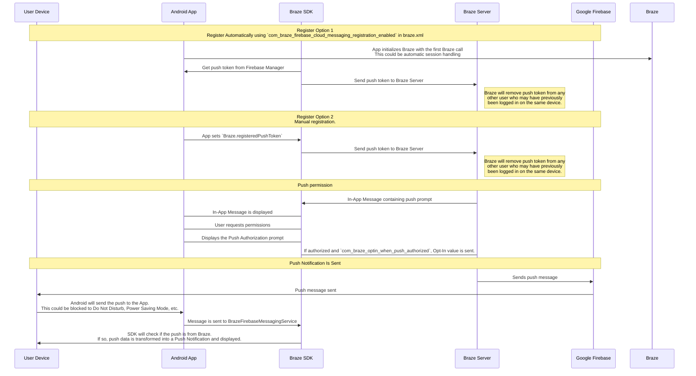

## Braze 푸시 워크플로 이해하기 {#understanding-the-braze-push-workflow}

Firebase Cloud Messaging(FCM) 서비스는 Android 애플리케이션으로 전송되는 푸시 알림을 위한 Google의 인프라입니다. 다음은 사용자 기기에서 푸시 알림이 활성화되는 구조와 Braze가 푸시 알림을 전송하는 방식을 간략하게 나타낸 것입니다.



### 1단계: Google Cloud API 키 구성하기 {#step-1-configure-your-google-cloud-api-key}

앱을 개발할 때 Braze Android SDK에 Firebase 발신자 ID를 제공해야 합니다. 또한 Braze 대시보드에 서버 애플리케이션용 API 키를 제공해야 합니다. Braze는 이 API 키를 사용하여 기기에 메시지를 전송합니다. Google 개발자 콘솔에서 FCM 서비스가 활성화되어 있는지도 확인해야 합니다.


이 단계에서 흔히 발생하는 실수는 REST API 키 대신 앱 식별자 API 키를 사용하는 것입니다.


### 2단계: 기기가 FCM에 등록하고 Braze에 푸시 토큰 제공하기 {#step-2-devices-register-for-fcm-and-provide-braze-with-push-tokens}

일반적인 통합에서는 Braze Android SDK가 FCM 기능을 위한 기기 등록을 처리합니다. 이는 보통 앱을 처음 열 때 즉시 이루어집니다. 등록 후 Braze에는 FCM 등록 ID가 제공되며, 이 ID는 해당 기기에 메시지를 전송하는 데 사용됩니다. Braze는 해당 사용자의 등록 ID를 저장하며, 이전에 어떤 앱에서도 푸시 토큰이 없었던 사용자는 "푸시 등록됨" 상태가 됩니다.

### 3단계: Braze 푸시 Campaign 시작하기 {#step-3-launch-a-braze-push-campaign}

푸시 Campaign이 시작되면 Braze는 FCM에 메시지 전달을 요청합니다. Braze는 대시보드에서 복사한 API 키를 사용하여 인증하고, 제공된 푸시 토큰으로 푸시 알림을 전송할 수 있는지 확인합니다.

### 4단계: 유효하지 않은 토큰 제거하기 {#step-4-remove-invalid-tokens}

FCM이 메시지를 전송하려던 푸시 토큰 중 유효하지 않은 것이 있다고 알려오면, Braze는 해당 토큰이 연결된 고객 프로필에서 해당 토큰을 제거합니다. 사용자에게 다른 푸시 토큰이 없는 경우, **Segments** 페이지에서 더 이상 "푸시 등록됨"으로 표시되지 않습니다.

FCM에 대한 자세한 내용은 [Cloud messaging](https://firebase.google.com/docs/cloud-messaging/)을 참조하세요.

## 푸시 오류 로그 사용하기 {#use-the-push-error-logs}

Braze는 메시지 활동 로그에서 푸시 알림 오류를 제공합니다. 이 오류 로그는 Campaign이 예상대로 작동하지 않는 이유를 파악하는 데 매우 유용한 다양한 경고를 제공합니다. 오류 메시지를 선택하면 특정 인시던트를 해결하는 데 도움이 되는 관련 설명서로 리디렉션됩니다.


## 문제 해결 {#troubleshooting}

### 푸시가 발송되지 않음 {#push-isnt-sending}

다음과 같은 상황으로 인해 푸시 메시지가 발송되지 않을 수 있습니다:

- 자격 증명이 잘못된 Google Cloud Platform 프로젝트 ID(잘못된 발신자 ID)에 있습니다.
- 자격 증명에 잘못된 권한 범위가 설정되어 있습니다.
- 잘못된 자격 증명을 잘못된 Braze 워크스페이스에 업로드했습니다(잘못된 발신자 ID).

푸시 메시지 발송을 방해할 수 있는 기타 문제에 대해서는 [사용자 가이드: 푸시 알림 문제 해결]({{site.baseurl}}/user_guide/channels/push/troubleshooting)을 참조하세요.

### Braze 대시보드에 "푸시 등록" 사용자가 표시되지 않음(메시지 발송 전) {#no-push-registered-users-showing-in-the-braze-dashboard-prior-to-sending-messages}

앱이 푸시 알림을 허용하도록 올바르게 구성되어 있는지 확인하세요. 확인해야 할 일반적인 실패 지점은 다음과 같습니다:

#### 잘못된 발신자 ID {#incorrect-sender-id}

올바른 FCM 발신자 ID가 `braze.xml` 파일에 포함되어 있는지 확인하세요. 잘못된 발신자 ID는 대시보드의 메시지 활동 로그에 `MismatchSenderID` 오류로 보고됩니다.

#### Braze 등록이 발생하지 않음 {#braze-registration-not-occurring}

FCM 등록은 Braze 외부에서 처리되므로, 등록 실패는 두 곳에서만 발생할 수 있습니다:

1. FCM에 등록하는 동안
2. FCM에서 생성한 푸시 토큰을 Braze에 전달할 때

FCM에서 생성한 푸시 토큰이 Braze에 올바르게 전송되고 있는지 확인하기 위해 중단점을 설정하거나 로그를 확인하는 것을 권장합니다. 토큰이 올바르게 생성되지 않거나 전혀 생성되지 않는 경우, [FCM 설명서](https://firebase.google.com/docs/cloud-messaging/android/client)를 참조하는 것을 권장합니다.

#### Google Play 서비스가 없음 {#google-play-services-not-present}

FCM 푸시가 작동하려면 기기에 Google Play 서비스가 설치되어 있어야 합니다. Google Play 서비스가 기기에 없으면 푸시 등록이 발생하지 않습니다.


Google API가 설치되지 않은 Android 에뮬레이터에는 Google Play 서비스가 설치되어 있지 않습니다.


#### 기기가 인터넷에 연결되지 않음 {#device-not-connected-to-the-internet}

기기가 양호한 인터넷 연결 상태인지, 프록시를 통해 네트워크 트래픽을 보내고 있지 않은지 확인하세요.

### 푸시 알림을 탭해도 앱이 열리지 않음 {#tapping-push-notification-doesnt-open-the-app}

`com_braze_handle_push_deep_links_automatically`가 `true`로 설정되어 있는지 `false`로 설정되어 있는지 확인하세요. 푸시 알림을 탭할 때 Braze가 자동으로 앱과 딥링크를 열도록 하려면, `braze.xml` 파일에서 `com_braze_handle_push_deep_links_automatically`를 `true`로 설정하세요.

`com_braze_handle_push_deep_links_automatically`가 기본값인 `false`로 설정되어 있는 경우, Braze 푸시 콜백을 사용하여 푸시 수신 및 열람 인텐트를 수신하고 처리해야 합니다.

### 푸시 알림이 반송됨 {#push-notifications-bounced}

푸시 알림이 전달되지 않은 경우, [개발자 콘솔]({{site.baseurl}}/developer_guide/platforms/android/push_notifications/troubleshooting#utilizing-the-push-error-logs)에서 반송되지 않았는지 확인하세요. 다음은 개발자 콘솔에 기록될 수 있는 일반적인 오류에 대한 설명입니다:

#### 오류: MismatchSenderID {#error-mismatchsenderid}

`MismatchSenderID`는 인증 실패를 나타냅니다. Firebase 발신자 ID와 FCM API 키가 올바른지 확인하세요.

#### 오류: InvalidRegistration {#error-invalidregistration}

`InvalidRegistration`은 잘못된 형식의 푸시 토큰으로 인해 발생할 수 있습니다.

1. [Firebase Cloud Messaging](https://firebase.google.com/docs/cloud-messaging/android/client#retrieve-the-current-registration-token)에서 유효한 푸시 토큰을 Braze에 전달하고 있는지 확인하세요.

#### 오류: NotRegistered {#error-notregistered}

2. `NotRegistered`는 여러 번 등록이 발생하여 두 번째 등록이 첫 번째 토큰을 무효화할 때도 발생할 수 있습니다.

### 푸시 알림이 발송되었지만 사용자 기기에 표시되지 않음 {#push-notifications-sent-but-not-displayed-on-users-devices}

이 문제가 발생할 수 있는 몇 가지 이유가 있습니다:

#### 앱이 강제 종료됨 {#application-was-force-quit}

시스템 설정을 통해 앱을 강제 종료하면 푸시 알림이 발송되지 않습니다. 앱을 다시 실행하면 기기에서 푸시 알림을 다시 수신할 수 있습니다.

#### BrazeFirebaseMessagingService가 등록되지 않음 {#brazefirebasemessagingservice-not-registered}

푸시 알림이 표시되려면 BrazeFirebaseMessagingService가 `AndroidManifest.xml`에 올바르게 등록되어 있어야 합니다:

```xml
<service android:name="com.braze.push.BrazeFirebaseMessagingService"
  android:exported="false">
  <intent-filter>
    <action android:name="com.google.firebase.MESSAGING_EVENT" />
  </intent-filter>
</service>
```

#### 방화벽이 푸시를 차단함 {#firewall-is-blocking-push}

Wi-Fi를 통해 푸시를 테스트하는 경우, 방화벽이 FCM이 메시지를 수신하는 데 필요한 포트를 차단하고 있을 수 있습니다. 포트 `5228`, `5229`, `5230`이 열려 있는지 확인하세요. 또한 FCM은 IP를 지정하지 않으므로, Google의 ASN `15169`에 나열된 IP 블록에 포함된 모든 IP 주소에 대한 아웃바운드 연결을 방화벽에서 허용해야 합니다.

#### 커스텀 알림 팩토리가 null을 반환함 {#custom-notification-factory-returning-null}

[커스텀 알림 팩토리]({{site.baseurl}}/developer_guide/platform_integration_guides/android/push_notifications/android/integration/standard_integration#custom-displaying-notifications)를 구현한 경우, `null`을 반환하지 않는지 확인하세요. 이 경우 알림이 표시되지 않습니다.

### "푸시 등록" 사용자가 메시지 발송 후 더 이상 활성화되지 않음 {#push-registered-users-no-longer-enabled-after-sending-messages}

이 문제가 발생할 수 있는 몇 가지 이유가 있습니다:

#### 앱이 삭제됨 {#application-was-uninstalled}

사용자가 앱을 삭제했습니다. 이 경우 해당 사용자의 FCM 푸시 토큰이 무효화됩니다.

#### 유효하지 않은 Firebase Cloud Messaging 서버 키 {#invalid-firebase-cloud-messaging-server-key}

Braze 대시보드에 제공된 Firebase Cloud Messaging 서버 키가 유효하지 않습니다. 제공된 발신자 ID는 앱의 `braze.xml` 파일에서 참조하는 것과 일치해야 합니다. 서버 키와 발신자 ID는 Firebase Console에서 다음 위치에 있습니다:


### 푸시 클릭이 기록되지 않음 {#push-clicks-not-logged}

푸시 클릭이 기록되지 않는 경우, 푸시 클릭 데이터가 아직 서버로 플러시되지 않았을 수 있습니다. Braze Android SDK는 플러시를 제한할 수 있습니다.

커스텀 푸시 핸들러를 구현한 경우, [네이티브 푸시 분석을 올바르게 보존]({{site.baseurl}}/developer_guide/push_notifications/logging_message_data/?tab=android#preserving-native-push-analytics-with-custom-push-handling)하고 있는지 확인하세요.

푸시 클릭 기록은 네트워크 작업이며 네트워킹 제한에 영향을 받습니다. Braze Android SDK는 네트워크 실패를 보완하고 실패한 요청을 재시도하지만, 일부 이벤트 손실은 예상됩니다.

### 딥링크가 작동하지 않음 {#deep-links-not-working}

#### 딥링크 구성 확인 {#verify-deep-link-configuration}

딥링크는 [ADB를 사용하여 테스트](https://developer.android.com/training/app-indexing/deep-linking.html#testing-filters)할 수 있습니다. 다음 명령어로 딥링크를 테스트하는 것을 권장합니다:

`adb shell am start -W -a android.intent.action.VIEW -d "THE_DEEP_LINK" THE_PACKAGE_NAME`

딥링크가 작동하지 않는 경우, 딥링크가 잘못 구성되었을 수 있습니다. 잘못 구성된 딥링크는 Braze 푸시를 통해 발송해도 작동하지 않습니다.

#### 커스텀 처리 로직 확인 {#verify-custom-handling-logic}

딥링크가 [ADB에서는 올바르게 작동](https://developer.android.com/training/app-indexing/deep-linking.html#testing-filters)하지만 Braze 푸시에서는 작동하지 않는 경우, [커스텀 푸시 열람 처리]({{site.baseurl}}/developer_guide/platform_integration_guides/android/push_notifications/android/integration/standard_integration#android-push-listener-callback)가 구현되어 있는지 확인하세요. 구현되어 있다면, 커스텀 처리 코드가 수신되는 딥링크를 올바르게 처리하고 있는지 확인하세요.

#### 백 스택 동작 비활성화 {#disable-back-stack-behavior}

딥링크가 [ADB에서는 올바르게 작동](https://developer.android.com/training/app-indexing/deep-linking.html#testing-filters)하지만 Braze 푸시에서는 작동하지 않는 경우, [백 스택](https://developer.android.com/guide/components/activities/tasks-and-back-stack)을 비활성화해 보세요. 이렇게 하려면 **braze.xml** 파일을 다음과 같이 업데이트하세요:

```xml
<bool name="com_braze_push_deep_link_back_stack_activity_enabled">false</bool>
```
