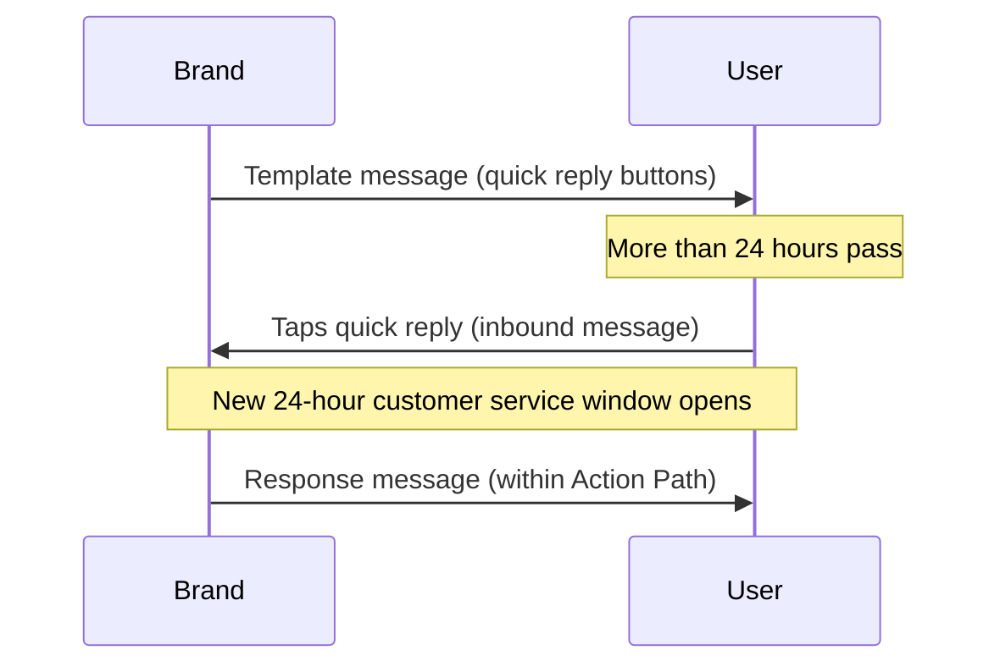

# 사용자 메시지 {#user-messages}

> WhatsApp은 양방향 소통 채널입니다. 브랜드가 사용자에게 메시지를 보낼 수 있을 뿐만 아니라, 사용자도 템플릿 기반 Campaigns와 Canvases를 사용하여 대화에 참여할 수 있습니다. WhatsApp 빠른 답장, 목록 메시지, 트리거 단어 등 다양한 방법이 있습니다. 빠른 답장과 목록 메시지의 행동 유도(CTA)는 WhatsApp 메시징에 대한 사용자 참여를 유도하는 좋은 방법입니다.

## 행동 기반 트리거 {#action-based-triggers}

Campaign과 Canvases 모두 인바운드 WhatsApp 메시지(사용자가 WhatsApp으로 보내는 메시지), 예를 들어 트리거 단어를 통해 시작하거나, 분기하거나, 여정 중간에 변경할 수 있습니다.

트리거 단어가 사용자에게 기대하는 내용과 일치하는지 확인하세요.

**알아두어야 할 사항:**
- 트리거 단어의 각 글자는 설정 시 대문자로 입력해야 합니다. Braze는 사용자가 보내는 인바운드 트리거 단어가 대문자일 것을 요구하지 않습니다. 예를 들어 "jOin2023"이라고 메시지를 보내도 Canvas 또는 Campaign이 트리거됩니다.
- 항목 스케줄 행동 기반 트리거에 트리거 단어가 지정되지 않은 경우, Campaign 또는 Canvas는 모든 인바운드 WhatsApp 메시지에 대해 실행됩니다. 여기에는 활성 Campaign과 Canvases 전체에서 일치하는 문구가 있는 메시지도 포함되며, 이 경우 사용자는 두 개의 WhatsApp 메시지를 수신하게 됩니다.










## 인식되지 않는 응답 {#unrecognized-responses}

인터랙티브 Canvases에 인식되지 않는 응답에 대한 옵션을 포함하는 것을 권장합니다. 이를 통해 사용자가 사용 가능한 프롬프트를 이해하고 채널에 대한 기대치를 설정할 수 있습니다. 기대치 관리는 실시간 상담원 채팅이 포함된 WhatsApp 채널이 있는 경우 특히 유용할 수 있습니다.
- 행동 단계에서 커스텀 필터 문구에 대한 행동 그룹을 생성한 후, "Send WhatsApp message"에 대한 추가 행동 그룹을 추가하되, **Where the message body는 체크하지 마세요**. 이렇게 하면 "else" 절과 유사하게 인식되지 않는 모든 사용자 응답을 포착할 수 있습니다.
- 이 채널에 상담원이 배치되어 있지 않음을 사용자에게 알리고, 필요한 경우 지원 채널로 안내하는 WhatsApp 메시지를 후속으로 보내는 것을 권장합니다.

## 빠른 답장 {#quick-replies}

{: style="float:right;max-width:25%;margin-left:15px;border: 0;"}

빠른 답장은 대화 내에서 클릭 가능한 버튼 옵션으로 나타나지만, 사용자가 텍스트로 답장한 것처럼 작동합니다. Braze는 이를 인바운드 메시지로 처리하며, 클릭한 버튼에 따라 설정된 응답을 다시 보낼 수 있습니다. 사용자의 응답을 생성하고 필터링할 때 "인바운드 WhatsApp 메시지 액션" 단계를 사용하세요.

{: style="max-width:50%;"}

### Canvas에서 빠른 답장 경험 구성하기 {#configure-the-quick-reply-experience-in-canvas}

#### 1단계: CTA 작성하기 {#step-1-build-out-ctas}

먼저 메시지 템플릿 내 [WhatsApp 메시지 템플릿 매니저](https://business.facebook.com/wa/manage/message-templates/)에서 빠른 답장 CTA를 작성합니다.

{: style="max-width:80%;"}

템플릿이 제출되고 WhatsApp에서 승인되면 Braze 내에서 Canvas를 만드는 데 사용할 수 있습니다.


메시지 템플릿 승인을 받기 전에 Canvas를 먼저 만들 수 있습니다.


#### 2단계: Canvas 만들기 {#step-2-build-your-canvas}

다음으로, 생성한 템플릿을 포함하는 메시지 단계가 있는 Canvas를 만듭니다.

메시지 단계 다음에 오는 액션 단계를 만듭니다. 이 액션 단계에서 빠른 답장 옵션마다 하나의 그룹을 만듭니다.

각 빠른 답장 옵션 그룹에 대해 매칭하려는 버튼과 정확히 일치하는 텍스트를 지정합니다. 키워드는 반드시 대문자로 입력해야 합니다.

빠른 답장 대신 텍스트로 메시지에 응답하는 사용자를 위한 기본 응답을 원하는 경우, 매칭되는 메시지 본문이 없는 추가 그룹을 만드세요.

이 시점부터는 평소와 같이 Canvas를 계속 만들면 됩니다.

### 응답 {#responses}

각 응답에 대한 답장 메시지를 설정하는 것이 좋습니다. 빠른 답장 범위를 벗어나는 응답(예: 사전 설정된 프롬프트가 아닌 일반 메시지로 응답하는 고객)을 위한 포괄적인 옵션을 두는 것을 권장합니다. 예를 들어, "죄송합니다. 응답을 인식하지 못했습니다. 지원이 필요하시면 <지원 채널>로 메시지를 보내주세요."와 같이 설정할 수 있습니다.

응답 메시지, 고객 프로필 업데이트, Braze-to-Braze 웹훅 등 Braze Canvas가 제공하는 모든 후속 액션을 사용할 수 있습니다.

## 리스트 메시지 {#list-messages}

리스트 메시지는 클릭 가능한 옵션 목록이 포함된 본문 메시지로 표시됩니다. 각 리스트에는 여러 섹션이 포함될 수 있으며, 각 리스트에는 최대 10개의 행을 추가할 수 있습니다.

{: style="max-width:40%;"}

### Canvas에서 리스트 메시지 경험 구성하기 {#configure-the-list-message-experience-in-canvas}

#### 1단계: 새 행동 기반 Canvas를 만들거나 기존 Canvas를 편집하기 {#step-1-create-or-edit-an-existing-action-based-canvases}

WhatsApp 리스트 메시지는 사용자 메시지에 대한 응답이어야 하므로, 행동 기반 Canvases에만 추가할 수 있습니다.

#### 2단계: WhatsApp 메시지 단계 만들기 {#step-2-create-a-whatsapp-message-step}

WhatsApp [메시지 단계]({{site.baseurl}}/user_guide/messaging/canvas/canvas_components/message_step)를 추가한 다음, 응답 메시지 레이아웃으로 **List Message**를 선택합니다.

{: style="max-width:70%;"}

사용자가 리스트를 표시하기 위해 선택할 **List button** 이름을 추가합니다. 그런 다음 **List content**의 필드를 사용하여 리스트를 만듭니다:

- **Section:** 리스트 항목을 그룹화하고 정리하기 위해 최대 10개의 섹션을 추가합니다. 예를 들어, 의류 소매업체는 계절별 스타일(봄, 여름, 가을, 겨울) 또는 의류 종류(상의, 하의, 신발)별로 섹션을 구성할 수 있습니다.
- **Row:** 모든 섹션에 걸쳐 최대 10개의 행(리스트 항목)을 추가합니다.
- **Row description (선택 사항):** 모든 행(리스트 항목)에 선택적 설명을 추가합니다.

{: style="max-width:60%;"}

섹션과 행의 순서를 변경하려면 이름 옆에 있는 아이콘을 선택하고 드래그합니다.

{: style="max-width:60%;"}

Canvas 작성기로 돌아가서 메시지 단계 뒤에 각 리스트 응답에 대한 그룹이 있는 [행동 경로]({{site.baseurl}}/user_guide/messaging/canvas/canvas_components/action_paths)를 추가합니다. 각 그룹에서:

1. **Sent inbound WhatsApp subscription group** 트리거를 추가하고 해당 WhatsApp 구독 그룹을 선택합니다.
2. **Where the message body** 체크박스를 선택합니다.
3. 하나의 행(또는 리스트 항목)에 대한 콘텐츠를 지정합니다.

Canvas를 계속 구성합니다.

### 긴 설명에 대한 행동 경로 만들기 {#creating-actions-paths-for-long-descriptions}

행 설명이 있는 경우 **Matches regex**를 사용하여 행을 지정해야 합니다. 예를 들어 "Our new style that fits over your favorite pair of ankle boots"라는 설명이 있는 행을 지정하려면 "ankle boots"로 [정규식]({{site.baseurl}}/user_guide/audience/segments/regex)을 사용할 수 있습니다.

## 고려 사항 {#considerations}

### 응답 메시지의 타이밍 요구 사항 {#timing-requirements-for-response-messages}

응답 메시지는 사용자의 메시지를 수신한 후 24시간 이내에 전송되어야 합니다. 성공적인 경험을 구축할 수 있도록 Braze는 메시지 로직을 확인하여 응답 메시지를 차단 해제하는 업스트림 인바운드 사용자 메시지가 있는지 확인합니다.

양방향 Canvas 흐름에서 1분 미만의 빠른 응답을 위해서는 인바운드 트리거와 응답 메시지 전송 사이의 단계를 최소화하세요. Canvas 아키텍처, 웹훅 왕복, 사용자 업데이트 배치 처리가 지연을 추가할 수 있습니다. [양방향 흐름의 응답 지연 최소화]({{site.baseurl}}/user_guide/channels/whatsapp/best_practices#minimize-response-latency-for-two-way-flows)를 참조하세요.

다음 이벤트가 응답 메시지를 차단 해제합니다:

- 인바운드 메시지
  - **WhatsApp 인바운드 메시지 전송** 트리거가 있는 [행동 경로]({{site.baseurl}}/action_paths) 또는 [액션 기반 진입]({{site.baseurl}}/user_guide/messaging/campaigns/schedule_your_campaign/triggered_delivery).

- [API 트리거 진입]({{site.baseurl}}/user_guide/messaging/campaigns/schedule_your_campaign/api_triggered_delivery)
- 인바운드 제품 메시지
  - [`ecommerce.cart_updated`]({{site.baseurl}}/user_guide/data/activation/events/recommended_events/ecommerce_events#types-of-ecommerce-recommended-events?tab=ecommerce.cart_updated) 이벤트

### 24시간 창 밖의 빠른 답장 및 인바운드 메시지 {#quick-replies-and-inbound-messages-outside-the-24-hour-window}

사용자가 WhatsApp에서 비즈니스와 상호 작용하면(이전 템플릿 메시지의 빠른 답장 버튼을 탭하는 것 포함), 해당 행동은 인바운드 메시지로 간주됩니다. 이 인바운드 메시지는 원래 템플릿이 24시간 전에 전송되었더라도 새로운 24시간 고객 서비스 창을 엽니다.

빠른 답장 버튼이 있는 Canvas에서 사용자는 환영 템플릿을 받은 후 며칠 뒤에 버튼을 탭해도 올바른 행동 경로에 진입할 수 있습니다. Braze는 인바운드 메시지가 도착할 때 행동 경로를 평가하므로, 늦은 답장을 캡처하기 위해 행동 경로 지속 시간을 기본값 이상으로 연장할 필요가 없습니다.

다음 다이어그램은 일반적인 빠른 답장 흐름을 보여줍니다:

#### 알아두어야 할 사항 {#things-to-know}

- 응답 메시지 단계는 여전히 사용자의 인바운드 메시지로부터 24시간 이내에 수행되어야 합니다. 대부분의 Canvas 흐름에서는 행동 경로 평가 후 즉시 응답이 전송되므로 이는 문제가 되지 않습니다.
- 24시간 고객 서비스 창은 최대 30일의 기간을 사용할 수 있는 Canvas [전환 이벤트]({{site.baseurl}}/user_guide/messaging/messaging_fundamentals/conversion_events)와는 다릅니다. 전환 기간은 기여도를 제어하며, 응답 메시지 전송 가능 여부에는 영향을 미치지 않습니다.
- 청구에 대해서는 [WhatsApp 응답 메시지는 무료인가요?]({{site.baseurl}}/user_guide/channels/whatsapp/faq#are-whatsapp-response-messages-free)를 참조하세요.

### 커스텀 시간 속성으로 필터링 {#filtering-by-a-custom-time-attribute}

액션 기반 WhatsApp Campaign 또는 Canvas 오디언스가 상대적 기간(예: 현재부터 다음 24시간 사이)에 해당하는 커스텀 시간 속성에 의존하는 경우, [시간]({{site.baseurl}}/user_guide/data/activation/custom_data/data_types#custom-attribute-data-types)에 설명된 대로 두 개의 필터를 결합하세요.

### 인바운드 미디어 저장 및 URL 만료 {#inbound-media-storage-and-url-expiration}

사용자가 미디어(이미지, 오디오 파일, 문서 등)가 포함된 WhatsApp 메시지를 보내면 Braze는 해당 미디어를 메시지 수신 시점으로부터 30일 동안 Amazon S3에 저장합니다.

그러나 해당 미디어의 URL을 참조하는 `inbound_media_urls` Liquid 필드는 Braze가 인바운드 메시지를 수신한 시점으로부터 7일 동안만 유효합니다. URL은 수신 시 한 번 생성되며 재생성되지 않으므로, 필드에 접근하는 시점과 관계없이 7일 기간이 적용됩니다. 두 제한 중 더 짧은 기간이 적용되므로, 실제로 `inbound_media_urls`는 최대 7일 동안 유효한 것으로 처리해야 합니다.


나중에 사용하기 위해 `inbound_media_urls` 값을 사용자 커스텀 속성에 저장하는 경우, 이 7일 만료에 유의하세요. 만료된 후 URL에 접근하면 깨진 링크가 됩니다.


### 인바운드 프로필 이름 {#inbound-profile-name}

Meta가 인바운드 WhatsApp 메시지에 표시 이름을 포함하면, Braze는 해당 인바운드 이벤트에서 `{{whats_app.${inbound_profile_name}}}` Liquid 속성으로 이를 노출합니다. 이 값은 사용자가 WhatsApp에서 설정한 이름을 반영하며 CRM 프로필 데이터와 일치하지 않을 수 있습니다. 사용자 대상 텍스트에서 사용하기 전에 데이터를 검증하거나, Canvas 사용자 업데이트 단계를 사용하여 나중에 사용할 수 있도록 프로필 필드에 저장하세요. WhatsApp Liquid 속성의 전체 목록은 [지원되는 개인화 태그]({{site.baseurl}}/user_guide/messaging/design_and_edit/personalize/liquid/supported_personalization_tags)를 참조하세요.