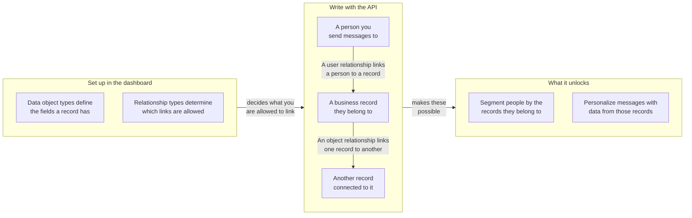

## URL base e autenticação {#base-url-and-authentication}

Use o endpoint REST do seu espaço de trabalho e envie `Authorization: Bearer YOUR_REST_API_KEY`. Esta seção explica onde os endpoints de objetos de dados estão hospedados e como as solicitações são autenticadas.

- Para hosts de endpoints, consulte [Visão geral da API da Braze]({{site.baseurl}}/api/basics#endpoints).
- Todas as cargas úteis de solicitação e resposta são JSON.
- As solicitações são limitadas ao espaço de trabalho que possui a chave de API.
- Se a chave tiver uma lista de IPs permitidos, endereços IP fora da lista retornarão `403`.

## Permissões de chave de API {#api-key-permissions}

Esta seção mapeia cada endpoint à sua permissão necessária para que você possa definir o escopo das chaves de API com segurança.

| Permissão | Grupo de endpoints |
|---|---|
| `data_objects.read` | Leituras de tipo e objeto, e leituras de relacionamento de objeto |
| `data_objects.create` | Criação de objeto |
| `data_objects.update` | Substituição e atualização de objeto |
| `data_objects.delete` | Exclusão de objeto |
| `data_objects.user_relationships.read` | Leituras de relacionamento de usuário |
| `data_objects.user_relationships.create` | Criação de relacionamento de usuário |
| `data_objects.user_relationships.update` | Substituição e atualização de relacionamento de usuário |
| `data_objects.user_relationships.delete` | Exclusão de relacionamento de usuário |
| `data_objects.object_relationships.create` | Criação de relacionamento de objeto |
| `data_objects.object_relationships.update` | Substituição e atualização de relacionamento de objeto |
| `data_objects.object_relationships.delete` | Exclusão de relacionamento de objeto |
{: .reset-td-br-1 .reset-td-br-2 aria-label="Grupos de permissões de objetos de dados" }


As leituras de relacionamento de objeto usam `data_objects.read`. Não existe uma permissão `data_objects.object_relationships.read`.


## Limites de frequência {#rate-limits}

Esta seção explica as cotas padrão de solicitações e os cabeçalhos de resposta para tráfego de leitura e escrita.

| Bucket | Limite padrão |
|---|---|
| Leituras de objetos de dados | 50 solicitações por minuto |
| Escritas de objetos de dados | 50 solicitações por minuto |
{: .reset-td-br-1 .reset-td-br-2 aria-label="Limites de frequência padrão de objetos de dados" }

Cada resposta inclui `X-RateLimit-Limit`, `X-RateLimit-Remaining` e `X-RateLimit-Reset`.

Para solicitações limitadas, a Braze retorna `429` e uma carga útil de erro com `id` e `message`.

```json
{
  "errors": [
    {
      "id": "rate-limit-exceeded",
      "message": "You have exceeded your limit of 50 requests per minute."
    }
  ]
}
```

## Conceitos principais {#core-concepts}

Esta seção define os identificadores-chave usados em todos os endpoints de objetos de dados.

- `type_name`: O nome de máquina do tipo de objeto de dados, exclusivo dentro de um espaço de trabalho.
- `external_id`: O identificador do seu objeto, exclusivo dentro de um tipo.
- `braze_id`: O ID de usuário da Braze usado nos endpoints de relacionamento de usuário.
- `attributes`: Dados de objeto ou relacionamento indexados por nome de campo e validados conforme o esquema configurado.

## Como os relacionamentos funcionam {#how-relationships-work}

Esta seção explica os tipos de relacionamento, as arestas de relacionamento e o comportamento do `anchor` antes de você usar as páginas de referência dos endpoints.

### Modelo de relacionamento em resumo {#relationship-model-at-a-glance}

Use este diagrama para ver como tipos, registros e relacionamentos se encaixam, e o que a vinculação entre eles permite fazer na Braze. Você define os tipos no dashboard e então cria os registros e os vínculos entre eles por meio desses endpoints.



### Tipos e arestas são separados {#types-and-edges-are-separate}

- Os tipos de relacionamento definem quais vínculos são válidos e são gerenciados no dashboard.
- As arestas de relacionamento são os vínculos reais entre registros, criados, atualizados e excluídos por meio desses endpoints de API.
- Antes de criar relacionamentos, liste os valores válidos de `rel_kind` com:
  - `GET /data_objects/types/{type_name}/user_relationship_types`
  - `GET /data_objects/types/{type_name}/object_relationship_types`

### Por que relacionamentos de objeto exigem `related_type_name` {#why-object-relationships-require-related_type_name}

- `rel_kind` não é globalmente exclusivo entre todos os pares de tipos de objeto. Por exemplo, `rel_kind` pode ser `subaccount` para um par de tipos de objeto e `partner_account` para outro.
- As escritas de relacionamento de objeto, portanto, exigem tanto `rel_kind` quanto `related_type_name` para identificar o tipo de relacionamento pretendido junto com o outro tipo de objeto na associação.
- Se `related_type_name` não corresponder ao tipo de relacionamento para aquele `rel_kind`, a solicitação retorna `400`.

### `anchor` controla a direção do relacionamento {#anchor-controls-relationship-direction}

Os relacionamentos de objeto são direcionais. O objeto da URL é interpretado com base em `anchor`.

| `anchor` | Papel do objeto da URL | Chave do objeto relacionado nas respostas |
|---|---|---|
| `source` (padrão) | Lado de origem (aresta de saída) | `to_data_object` |
| `target` | Lado de destino (aresta de entrada) | `from_data_object` |
{: .reset-td-br-1 .reset-td-br-2 .reset-td-br-3 aria-label="Comportamento do anchor para relacionamentos de objeto" }

Criar a mesma aresta a partir da perspectiva de anchor oposta ainda visa um único relacionamento subjacente. Uma segunda chamada de criação para a mesma aresta retorna `409` (`duplicate-object-relationship`).

### Assimetria de caminho para relacionamentos de usuário {#path-asymmetry-for-user-relationships}

As leituras e escritas de relacionamento de usuário usam intencionalmente caminhos de endpoint diferentes:

- Leitura: `GET /data_objects/objects/{type_name}/{external_id}/user_relationships`
- Escrita: `POST|PUT|PATCH|DELETE /data_objects/objects/{type_name}/{external_id}/users`

### Atributos de relacionamento são separados dos atributos de objeto {#relationship-attributes-are-separate-from-object-attributes}

- Os endpoints de relacionamento retornam atributos no nível da aresta no campo `attributes` de nível superior.
- Os atributos de objeto permanecem aninhados sob `to_data_object` ou `from_data_object`.
- `PUT` substitui os `attributes` do relacionamento, e `PATCH` faz merge dos `attributes` do relacionamento.

### Exemplo prático {#worked-example}

Este exemplo mostra um fluxo de trabalho comum de conta:

1. Criar `account/acct-123`.
2. Criar `account/acct-456` como conta filha.
3. Vincular um usuário a `acct-123` com `rel_kind: account_user`.
4. Vincular `acct-123` a `acct-456` com `rel_kind: subaccount`.

Para ler os vínculos de volta:

- `GET /data_objects/objects/account/acct-123/user_relationships` para usuários vinculados
- `GET /data_objects/objects/account/acct-123/object_relationships` para vínculos de objeto de saída
- `GET /data_objects/objects/account/acct-456/object_relationships?anchor=target` para vínculos de objeto de entrada


Os endpoints `DELETE` para relacionamentos de objeto e relacionamentos de usuário exigem um corpo de solicitação JSON.


## Paginação e atualidade dos dados {#pagination-and-data-freshness}

Esta seção cobre o comportamento de paginação em listas e o tempo esperado de visibilidade dos dados após escritas.

- Os endpoints de lista suportam `limit` e `offset`.
- `limit` tem como padrão `100` e é limitado entre `1` e `250`.
- `offset` tem como padrão `0`, e valores negativos são arredondados para `0`.
- As escritas ficam imediatamente visíveis para leituras e personalização Liquid.
- A associação a segmentos com base em objetos de dados pode ter atraso de até uma hora, pois os filtros calculados são atualizados de hora em hora.

## Comportamento de erros {#error-behavior}

Esta seção resume os padrões de status e respostas de erro usados nos endpoints de objetos de dados.

- `404`, `409`, `422` e `429` retornam um array `errors` com `id` e `message`.
- `400`, `401` e `403` retornam uma string `error` única.
- Os limites de `422` baseados em contrato variam por empresa.