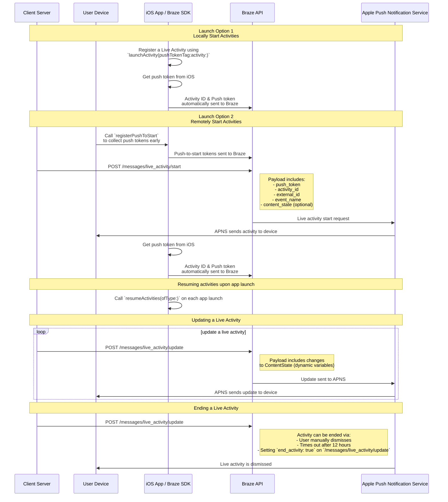

# Atividades ao vivo para Swift

> Aprenda como implementar Atividades ao Vivo para o SDK Swift da Braze. Atividades ao Vivo são notificações persistentes e interativas exibidas diretamente na tela de bloqueio, permitindo que os usuários recebam atualizações dinâmicas em tempo real&#8212;sem desbloquear o dispositivo.

## Como funciona

{: style="max-width:40%;float:right;margin-left:15px;"}

As Live Activities apresentam uma combinação de informações estáticas e dinâmicas que você atualiza. Por exemplo, você pode criar uma Live Activity que fornece um rastreador de status para uma entrega. Essa Live Activity teria o nome da sua empresa como informação estática, bem como um "Tempo para entrega" dinâmico que seria atualizado à medida que o motorista de entrega se aproximasse do destino.

Como desenvolvedor, você pode usar a Braze para gerenciar os ciclos de vida das suas Live Activities, fazer chamadas para a API REST da Braze para realizar atualizações e fazer com que todos os dispositivos inscritos recebam a atualização o mais rápido possível. E, como você está gerenciando as Live Activities por meio da Braze, pode usá-las em conjunto com seus outros canais de envio de mensagens&mdash;notificações por push, mensagens no app, Cartões de conteúdo&mdash;para promover a adoção.

## Diagrama de sequência {#sequence-diagram}









## Implementação de uma Live Activity

# Você também precisará completar o seguinte:

- Certifique-se de que seu projeto está direcionado para iOS 16.1 ou posterior.
- Adicione a autorização `Push Notification` em **Signing & Capabilities** no seu projeto Xcode.
- Certifique-se de que chaves `.p8` são usadas para enviar notificações. Não há suporte para arquivos mais antigos, como `.p12` ou `.pem`.
- A partir da versão 8.2.0 do SDK Swift da Braze, é possível [registrar remotamente uma Live Activity](#swift_step-2-start-the-activity). Para usar esse recurso, é necessário o iOS 17.2 ou posterior.


Embora as Live Activities e as notificações por push sejam semelhantes, suas permissões de sistema são separadas. Por padrão, todos os recursos de Live Activity estão ativados, mas os usuários podem desativar esse recurso por app.




### Etapa 1: Crie uma atividade {#create-an-activity}

Primeiro, certifique-se de ter seguido o procedimento [Exibindo dados ao vivo com Live Activities](https://developer.apple.com/documentation/activitykit/displaying-live-data-with-live-activities) na documentação da Apple para configurar Live Activities no seu aplicativo iOS. Como parte dessa tarefa, inclua `NSSupportsLiveActivities` definido como `YES` no seu `Info.plist`.

Como a natureza exata da sua Live Activity será específica para o seu caso de negócios, você precisará configurar e inicializar os objetos [Activity](https://developer.apple.com/documentation/activitykit/activityattributes). É importante ressaltar que você definirá:
* `ActivityAttributes`: Esse protocolo define o conteúdo estático (imutável) e dinâmico (mutável) que aparecerá na sua Live Activity.
* `ActivityAttributes.ContentState`: Esse tipo define os dados dinâmicos que serão atualizados no decorrer da atividade.

Você também usará o SwiftUI para criar a apresentação da interface do usuário da tela de bloqueio e do Dynamic Island nos dispositivos compatíveis. 

Certifique-se de estar familiarizado com os [pré-requisitos e as limitações](https://developer.apple.com/documentation/activitykit/displaying-live-data-with-live-activities#Understand-constraints) da Apple para Live Activities, pois essas restrições são independentes da Braze.


Se você espera enviar pushes frequentes para a mesma Live Activity, pode evitar ser limitado pelo orçamento da Apple definindo `NSSupportsLiveActivitiesFrequentUpdates` como `YES` no arquivo `Info.plist`. Para saber mais, consulte a seção [`Determine the update frequency`](https://developer.apple.com/documentation/activitykit/updating-and-ending-your-live-activity-with-activitykit-push-notifications#Determine-the-update-frequency) na documentação do ActivityKit.


#### Exemplo

Vamos imaginar que queremos criar uma Live Activity para fornecer aos nossos usuários atualizações sobre o show Superb Owl, em que dois resgates de animais selvagens concorrentes recebem pontos pelas corujas que têm em sua residência. Neste exemplo, criamos uma struct chamada `SportsActivityAttributes`, mas você pode usar sua própria implementação de `ActivityAttributes`.

```swift
#if canImport(ActivityKit)
  import ActivityKit
#endif

@available(iOS 16.1, *)
struct SportsActivityAttributes: ActivityAttributes {
  public struct ContentState: Codable, Hashable {
    var teamOneScore: Int
    var teamTwoScore: Int
  }

  var gameName: String
  var gameNumber: String
}
```

### Etapa 2: Inicie a atividade {#start-the-activity}

Primeiro, escolha como deseja registrar sua atividade:

- **Remoto:** Use o método [`registerPushToStart`](<http://braze-inc.github.io/braze-swift-sdk/documentation/brazekit/braze/liveactivities-swift.class/registerpushtostart(fortype:name:)>) no início do ciclo de vida do usuário e antes que o token de push-to-start seja necessário, e então inicie uma atividade usando o endpoint [`/messages/live_activity/start`]({{site.baseurl}}/api/endpoints/messaging/live_activity/start).
- **Local:** Crie uma instância da sua Live Activity e, em seguida, use o método [`launchActivity`](<https://braze-inc.github.io/braze-swift-sdk/documentation/brazekit/braze/liveactivities-swift.class/launchactivity(pushtokentag:activity:fileid:line:)>) para criar tokens push para a Braze gerenciar.




Para registrar remotamente uma Live Activity, é necessário o iOS 17.2 ou posterior.


#### Etapa 2.1: Adicione o BrazeKit à sua extensão de widget

No seu projeto Xcode, selecione o nome do aplicativo e, em seguida, **General**. Em **Frameworks and Libraries**, confirme se o `BrazeKit` está listado.


#### Etapa 2.2: Adicione o protocolo BrazeLiveActivityAttributes {#brazeActivityAttributes}

Na sua implementação de `ActivityAttributes`, adicione conformidade ao protocolo `BrazeLiveActivityAttributes` e então adicione a propriedade `brazeActivityId` ao seu modelo de atributos.


O iOS mapeará a propriedade `brazeActivityId` para o campo correspondente na carga útil de push-to-start da sua Live Activity, portanto ela não deve ser renomeada nem receber nenhum outro valor.


```swift
import BrazeKit

#if canImport(ActivityKit)
  import ActivityKit
#endif

@available(iOS 16.1, *)
// 1. Add the `BrazeLiveActivityAttributes` conformance to your `ActivityAttributes` struct.
struct SportsActivityAttributes: ActivityAttributes, BrazeLiveActivityAttributes {
  public struct ContentState: Codable, Hashable {
    var teamOneScore: Int
    var teamTwoScore: Int
  }

  var gameName: String
  var gameNumber: String

  // 2. Add the `String?` property to represent the activity ID.
  var brazeActivityId: String?
}
```

#### Etapa 2.3: Registre para push-to-start

Em seguida, registre o tipo de Live Activity para que a Braze possa rastrear todos os tokens push-to-start e instâncias de Live Activity associadas a esse tipo.


O sistema operacional iOS gera tokens push-to-start somente durante a primeira instalação do app após a reinicialização do dispositivo. Para garantir que seus tokens sejam registrados de forma confiável, chame `registerPushToStart` no seu método `didFinishLaunchingWithOptions`.


###### Exemplo

No exemplo a seguir, a classe `LiveActivityManager` manipula objetos Live Activity. Em seguida, o método `registerPushToStart` registra `SportsActivityAttributes`:

```swift
import BrazeKit

#if canImport(ActivityKit)
  import ActivityKit
#endif

class LiveActivityManager {

  @available(iOS 17.2, *)
  func registerActivityType() {
    // This method returns a Swift background task.
    // You may keep a reference to this task if you need to cancel it wherever appropriate, or ignore the return value if you wish.
    let pushToStartObserver: Task = Self.braze?.liveActivities.registerPushToStart(
      forType: Activity<SportsActivityAttributes>.self,
      name: "SportsActivityAttributes"
    )
  }

}
```

#### Etapa 2.4: Envie uma notificação push-to-start

Envie uma notificação push-to-start remota usando o endpoint [`/messages/live_activity/start`]({{site.baseurl}}/api/endpoints/messaging/live_activity/start).



Você pode usar o [framework ActivityKit da Apple](https://developer.apple.com/documentation/activitykit) para obter um token de push, que o SDK da Braze pode gerenciar para você. Isso permite que você atualize as Live Activities por meio da API da Braze, pois a Braze enviará o token de push para o serviço de Notificações por Push da Apple (APNs) no back-end.

1. Crie uma instância da sua implementação de Live Activity usando as APIs do ActivityKit da Apple.
2. Defina o parâmetro `pushType` como `.token`. 
3. Passe os `ActivitiesAttributes` e `ContentState` das Live Activities que você definiu. 
4. Registre sua atividade na instância da Braze, passando-a para [`launchActivity(pushTokenTag:activity:)`](https://braze-inc.github.io/braze-swift-sdk/documentation/brazekit/braze/liveactivities-swift.class). O parâmetro `pushTokenTag` é uma string personalizada que você define. Ele deve ser exclusivo para cada Live Activity que você criar.

Depois de registrar a Live Activity, o SDK da Braze extrairá e observará as alterações nos tokens de push.

#### Exemplo

No nosso exemplo, criaremos uma classe chamada `LiveActivityManager` como interface para nossos objetos Live Activity. Em seguida, definiremos o `pushTokenTag` como `"sports-game-2024-03-15"`.

```swift
import BrazeKit

#if canImport(ActivityKit)
  import ActivityKit
#endif

class LiveActivityManager {
  
  @available(iOS 16.2, *)
  func createActivity() {
    let activityAttributes = SportsActivityAttributes(gameName: "Superb Owl", gameNumber: "Game 1")
    let contentState = SportsActivityAttributes.ContentState(teamOneScore: "0", teamTwoScore: "0")
    let activityContent = ActivityContent(state: contentState, staleDate: nil)
    if let activity = try? Activity.request(attributes: activityAttributes,
                                            content: activityContent,
      // Setting your pushType as .token allows the Activity to generate push tokens for the server to watch.
                                            pushType: .token) {
      // Register your Live Activity with Braze using the pushTokenTag.
      // This method returns a Swift background task.
      // You may keep a reference to this task if you need to cancel it wherever appropriate, or ignore the return value if you wish.
      let liveActivityObserver: Task = AppDelegate.braze?.liveActivities.launchActivity(pushTokenTag: "sports-game-2024-03-15",
                                                                                        activity: activity)
    }
  }
  
}
```

O widget da Live Activity exibiria esse conteúdo inicial para os usuários. 

{: style="max-width:40%;"}



### Etapa 3: Retome o rastreamento de atividades {#resume-activity-tracking}

Para garantir que a Braze rastreie sua Live Activity na inicialização do app:

1. Abra seu arquivo `AppDelegate`.
2. Importe o módulo `ActivityKit` se ele estiver disponível.
3. Chame [`resumeActivities(ofType:)`](https://braze-inc.github.io/braze-swift-sdk/documentation/brazekit/braze/liveactivities-swift.class/resumeactivities(oftype:)) em `application(_:didFinishLaunchingWithOptions:)` para todos os tipos de `ActivityAttributes` que você registrou no seu aplicativo.

Isso permite que a Braze retome as tarefas para rastrear atualizações de tokens push para todas as Live Activities ativas. Observe que, se um usuário tiver descartado explicitamente a Live Activity no dispositivo, ela será considerada removida e a Braze não a rastreará mais.

###### Exemplo

```swift
import UIKit
import BrazeKit

#if canImport(ActivityKit)
  import ActivityKit
#endif

@main
class AppDelegate: UIResponder, UIApplicationDelegate {

  static var braze: Braze? = nil

  func application(
    _ application: UIApplication,
    didFinishLaunchingWithOptions launchOptions: [UIApplication.LaunchOptionsKey: Any]?
  ) -> Bool {
    
    if #available(iOS 16.1, *) {
      Self.braze?.liveActivities.resumeActivities(
        ofType: Activity<SportsActivityAttributes>.self
      )
    }

    return true
  }
}
```

### Etapa 4: Atualize a atividade {#update-the-activity}

{: style="max-width:40%;float:right;margin-left:15px;"}

O endpoint [`/messages/live_activity/update`]({{site.baseurl}}/api/endpoints/messaging/live_activity/update) permite que você atualize uma Live Activity por meio de notificações por push enviadas pela API REST da Braze. Use esse endpoint para atualizar o `ContentState` da sua Live Activity.

Ao atualizar o `ContentState`, o widget da Live Activity exibirá as novas informações. Veja como seria o show Superb Owl no final do primeiro tempo.

Consulte nosso artigo sobre o [endpoint `/messages/live_activity/update`]({{site.baseurl}}/api/endpoints/messaging/live_activity/update) para obter todos os detalhes.

### Etapa 5: Encerre a atividade {#end-the-activity}

Quando uma Live Activity está ativa, ela é exibida na tela de bloqueio do usuário e no Dynamic Island. Para encerrá-la pela Braze, use o endpoint [`/messages/live_activity/update`]({{site.baseurl}}/api/endpoints/messaging/live_activity/update) com `end_activity` definido como `true`.

Para melhorar a confiabilidade ao encerrar uma Live Activity, siga estas etapas opcionais:

1. Opcionalmente, inclua `dismissal_date` na mesma solicitação de `update` para sugerir quando o iOS deve remover a interface da Live Activity.
2. Verifique os resultados de entrega no [Registro de Atividades de Mensagem]({{site.baseurl}}/user_guide/administrative/app_settings/message_activity_log_tab/).

#### Organizando o descarte automático

Para organizar o descarte automático, agende uma solicitação de acompanhamento para o endpoint de atualização após iniciar a Live Activity.

1. Envie uma solicitação `/messages/live_activity/start` com um `activity_id` que você possa rastrear.
2. Armazene esse `activity_id` e o horário de encerramento desejado no agendador do seu backend.
3. No horário de encerramento desejado, envie uma solicitação `/messages/live_activity/update` com `end_activity` definido como `true`.
4. Configure a data de descarte na mesma solicitação de atualização. Para saber mais, consulte o endpoint [`/messages/live_activity/update`]({{site.baseurl}}/api/endpoints/messaging/live_activity/update).

Observe que o momento do descarte é controlado pelo iOS. Mesmo após enviar uma solicitação de encerramento válida, a remoção da tela de bloqueio ou do Dynamic Island pode ser atrasada ou se comportar de forma diferente com base em condições do sistema operacional.

Uma Live Activity também pode ser encerrada fora da Braze:

* **Descarte pelo usuário**: Um usuário pode descartar manualmente uma Live Activity.
* **Tempo limite**: Após um tempo padrão de 8 horas, o iOS removerá a Live Activity do Dynamic Island do usuário. Após um tempo padrão de 12 horas, o iOS removerá a Live Activity da tela de bloqueio do usuário.

Consulte nosso artigo sobre o [endpoint `/messages/live_activity/update`]({{site.baseurl}}/api/endpoints/messaging/live_activity/update) para obter todos os detalhes.

## Rastreamento de Live Activities

Os eventos de Live Activity estão disponíveis em Currents, Compartilhamento de Dados Snowflake e Criador de Consultas. Os eventos a seguir podem ajudar você a entender e monitorar o ciclo de vida das suas Live Activities, rastrear a disponibilidade de tokens e diagnosticar problemas ou verificar status de entrega de forma independente.

- [Mudança de Token Push-to-Start de Live Activity]({{site.baseurl}}/user_guide/data/braze_currents/event_glossary/customer_behavior_events/#live-activity-push-to-start-token-change-events): Captura quando um token push-to-start (PTS) é adicionado ou atualizado na Braze, permitindo que você rastreie registros e disponibilidade de tokens por usuário.
- [Mudança de Token de Atualização de Live Activity]({{site.baseurl}}/user_guide/data/braze_currents/event_glossary/customer_behavior_events/#live-activity-update-token-change-events): Rastreia a adição, atualização ou remoção de tokens de Atualização de Live Activity (LAU).
- [Envio de Live Activity]({{site.baseurl}}/user_guide/data/braze_currents/event_glossary/message_engagement_events/#live-activity-send-events): Registra cada vez que uma Live Activity é iniciada, atualizada ou encerrada pela Braze.
- [Resultado de Live Activity]({{site.baseurl}}/user_guide/data/braze_currents/event_glossary/message_engagement_events/#live-activity-outcome-events): Indica o status final de entrega ao serviço de Notificações por Push da Apple (APNs) para cada Live Activity enviada pela Braze.

## Perguntas frequentes (FAQ) {#faq}

### Funcionalidade e suporte

#### Quais plataformas suportam Live Activities?

Atualmente, as Live Activities são um recurso específico do iOS e iPadOS. Por padrão, atividades lançadas em um iPhone ou iPad também serão exibidas em qualquer dispositivo watchOS 11+ ou macOS 26+ emparelhado.

{: style="max-width:60%;"}

O artigo sobre Live Activities aborda os [pré-requisitos]({{site.baseurl}}/developer_guide/platforms/swift/live_activities/#prerequisites) para o gerenciamento de Live Activities por meio do SDK Swift da Braze.

#### Os apps React Native são compatíveis com Live Activities?

Sim, o React Native SDK 3.0.0+ oferece suporte a Live Activities por meio do SDK Swift da Braze. Ou seja, você precisa escrever código React Native iOS diretamente sobre o SDK Swift da Braze. 

Não há uma API de conveniência JavaScript específica do React Native para Live Activities porque os recursos de Live Activities fornecidos pela Apple usam linguagens intraduzíveis em JavaScript (por exemplo, concorrência Swift, genéricos, SwiftUI).

#### A Braze oferece suporte a Live Activities como uma campanha ou etapa do canva?

Não, isso não é suportado no momento.

### Notificações por push e Live Activities

#### O que acontece se uma notificação por push for enviada enquanto uma Live Activity estiver ativa? 

{: style="max-width:30%;float:right;margin-left:15px;"}

As Live Activities e as notificações por push ocupam espaços diferentes na tela e não entram em conflito na tela do usuário.

#### Se as Live Activities utilizam a funcionalidade de mensagens push, as notificações por push precisam estar ativadas para receber Live Activities?

Embora as Live Activities dependam de notificações por push para atualizações, elas são controladas por configurações de usuário diferentes. Um usuário pode aceitar Live Activities, mas não as notificações por push, e vice-versa.

Os tokens de atualização de Live Activity expiram após oito horas.

#### As Live Activities requerem push primers?

Os [push primers]({{site.baseurl}}/user_guide/message_building_by_channel/push/best_practices/push_primer_messages/) são uma prática recomendada para solicitar que os usuários aceitem notificações por push do seu app. No entanto, não há nenhum prompt do sistema para aceitar Live Activities. Por padrão, os usuários aceitam Live Activities para um app individual quando instalam esse app no iOS 16.1 ou posterior. Essa permissão pode ser ativada ou desativada nas configurações do dispositivo por app.

### Tópicos técnicos e solução de problemas

#### Como posso saber se as Live Activities têm erros?

Todos os erros de Live Activities serão registrados no dashboard da Braze no [Registro de Atividades de Mensagem]({{site.baseurl}}/user_guide/administrative/app_settings/message_activity_log_tab/), onde é possível filtrar por "LiveActivity Errors".

#### Depois de enviar uma notificação push-to-start, por que não recebi minha Live Activity?

Primeiro, verifique se sua carga útil inclui todos os campos obrigatórios descritos no endpoint [`messages/live_activity/start`]({{site.baseurl}}/api/endpoints/messaging/live_activity/start). Os campos `activity_attributes` e `content_state` devem corresponder às propriedades definidas no código do seu projeto. Se tiver certeza de que a carga útil está correta, é possível que você esteja sendo limitado pelos APNs. Esse limite é imposto pela Apple e não pela Braze.

Para verificar se a notificação push-to-start chegou com sucesso ao dispositivo, mas não foi exibida devido a limites de taxa, você pode depurar o projeto usando o app Console no Mac. Anexe o processo de gravação do dispositivo desejado e, em seguida, filtre os registros por `process:liveactivitiesd` na barra de pesquisa.

#### Depois de iniciar minha Live Activity com push-to-start, por que ela não está recebendo novas atualizações?

Verifique se você implementou corretamente as instruções descritas [acima](#swift_brazeActivityAttributes). Seu `ActivityAttributes` deve conter tanto a conformidade com o protocolo `BrazeLiveActivityAttributes` quanto a propriedade `brazeActivityId`.

Depois de receber uma notificação push-to-start de Live Activity, verifique se você consegue ver uma solicitação de rede de saída para o endpoint `/push_token_tag` da sua URL da Braze e se ela contém o ID da atividade correto no campo `"tag"`.

Por fim, certifique-se de que o tipo de atributo da Live Activity na sua carga útil de atualização corresponda exatamente à string e à classe usadas na chamada do método do SDK para `registerPushToStart`. Use constantes para evitar erros de digitação.  

#### Estou recebendo uma resposta de acesso negado quando tento usar o endpoint `live_activity/update`. Por quê?

As chaves de API que você usa precisam ter as permissões corretas para acessar os diferentes endpoints da API da Braze. Se estiver usando uma chave de API criada anteriormente, é possível que tenha se esquecido de atualizar as permissões. Leia nossa [visão geral da segurança da chave de API]({{site.baseurl}}/api/basics/#rest-api-key-security) para relembrar.

#### O endpoint `messages/send` compartilha os limites de taxa com o endpoint `messages/live_activity/update`? 

Por padrão, o limite de taxa do endpoint `messages/live_activity/update` é de 250.000 solicitações por hora, por espaço de trabalho e em vários endpoints. Consulte os [limites de taxa da API]({{site.baseurl}}/api/api_limits/) para obter mais informações.