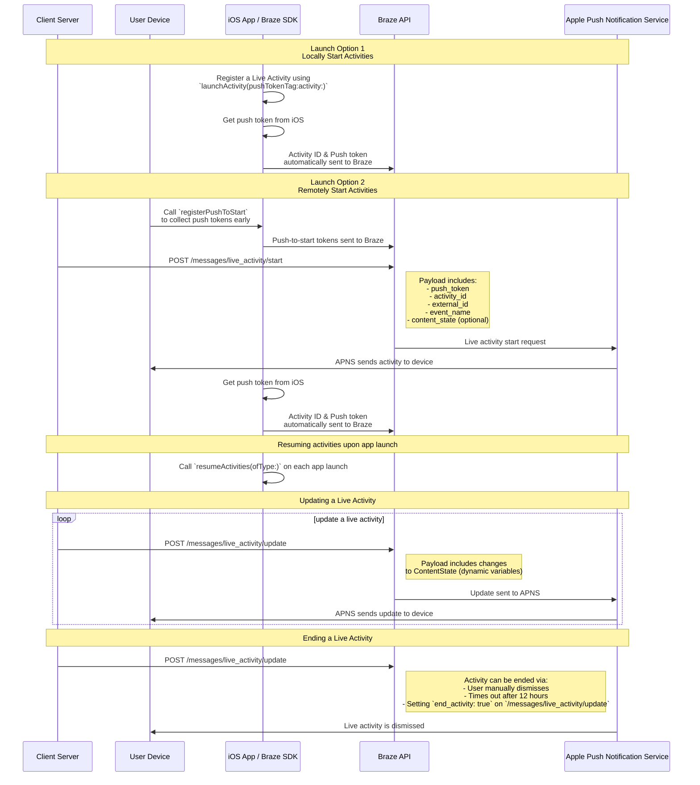

# Atividades ao vivo para Swift {#live-activities-for-swift}

> Saiba como implementar as Atividades ao Vivo para o SDK or kit de desenvolvimento de software Swift da Braze. Atividades ao Vivo são notificações persistentes e interativas exibidas diretamente na tela de bloqueio, permitindo que os usuários recebam atualizações dinâmicas em tempo real&#8212;sem desbloquear o dispositivo.

{: style="max-width:40%;float:right;margin-left:15px;"}

## Como funciona {#how-it-works}

As Live Activities apresentam uma combinação de informações estáticas e dinâmicas que você atualiza. Por exemplo, você pode criar uma Live Activity que fornece um rastreador de status para uma entrega. Essa Live Activity inclui o nome da sua empresa como informação estática, além de um "Tempo para entrega" dinâmico que é atualizado conforme o entregador se aproxima do destino.

Como desenvolvedor, você pode usar a Braze para gerenciar os ciclos de vida das suas Live Activities, fazer chamadas à REST or transferir estado representacional API or interface de programação do aplicativo (API) da Braze para atualizar Live Activities e fazer com que todos os dispositivos inscritos recebam a atualização o mais rápido possível. E, como você gerencia as Live Activities por meio da Braze, pode usá-las em conjunto com seus outros canais de envio de mensagens — notificações por push, mensagens no app, Content Cards — para impulsionar a adoção.

## Diagrama de sequência {#sequence-diagram}









## Implementando uma Live Activity {#implementing-a-live-activity}

# Você também precisará completar o seguinte:

- Certifique-se de que seu projeto esteja direcionado para iOS 16.1 ou posterior.
- Adicione o direito `Push Notification` em **Signing & Capabilities** no seu projeto Xcode.
- Certifique-se de que chaves `.p8` sejam usadas para enviar notificações. Arquivos mais antigos, como `.p12` ou `.pem`, não são compatíveis.
- A partir da versão 8.2.0 do SDK or kit de desenvolvimento de software Swift da Braze, você pode [registrar remotamente uma Live Activity](#swift_step-2-start-the-activity). Para usar esse recurso, é necessário iOS 17.2 ou posterior.


Embora as Live Activities e as notificações por push sejam semelhantes, suas permissões de sistema são separadas. Por padrão, todos os recursos de Live Activity estão ativados, mas os usuários podem desativar esse recurso por app.




### Etapa 1: Criar uma atividade {#create-an-activity}

Primeiro, certifique-se de ter seguido [Displaying live data with Live Activities](https://developer.apple.com/documentation/activitykit/displaying-live-data-with-live-activities) na documentação da Apple para configurar as Live Activities no seu aplicativo iOS. Como parte dessa tarefa, inclua `NSSupportsLiveActivities` definido como `YES` no seu `Info.plist`.

Como a natureza exata da sua Live Activity é específica ao seu caso de negócio, configure e inicialize os objetos [Activity](https://developer.apple.com/documentation/activitykit/activityattributes). É importante definir:
* `ActivityAttributes`: Este protocolo define o conteúdo estático (que não muda) e dinâmico (que muda) que aparece na sua Live Activity.
* `ActivityAttributes.ContentState`: Este tipo define os dados dinâmicos que são atualizados ao longo da atividade.

Você também usa SwiftUI para criar a apresentação visual da tela de bloqueio e da Dynamic Island em dispositivos compatíveis.

Familiarize-se com os [pré-requisitos e limitações](https://developer.apple.com/documentation/activitykit/displaying-live-data-with-live-activities#Understand-constraints) da Apple para Live Activities, pois essas restrições são independentes da Braze.


Se você espera enviar pushes frequentes para a mesma Live Activity, pode evitar ser limitado pelo orçamento da Apple definindo `NSSupportsLiveActivitiesFrequentUpdates` como `YES` no seu arquivo `Info.plist`. Para saber mais, consulte a seção [`Determine the update frequency`](https://developer.apple.com/documentation/activitykit/updating-and-ending-your-live-activity-with-activitykit-push-notifications#Determine-the-update-frequency) na documentação do ActivityKit.


#### Exemplo {#example}

Vamos imaginar que queremos criar uma Live Activity para dar aos nossos usuários atualizações sobre o show Superb Owl, onde dois centros de resgate de vida selvagem competem recebendo pontos pelas corujas que abrigam. Para este exemplo, criamos uma struct chamada `SportsActivityAttributes`, mas você pode usar sua própria implementação de `ActivityAttributes`.

```swift
#if canImport(ActivityKit)
  import ActivityKit
#endif

@available(iOS 16.1, *)
struct SportsActivityAttributes: ActivityAttributes {
  public struct ContentState: Codable, Hashable {
    var teamOneScore: Int
    var teamTwoScore: Int
  }

  var gameName: String
  var gameNumber: String
}
```

### Etapa 2: Iniciar a atividade {#start-the-activity}

Primeiro, escolha como deseja registrar sua atividade:

- **Remoto:** Use o método [`registerPushToStart`](<http://braze-inc.github.io/braze-swift-sdk/documentation/brazekit/braze/liveactivities-swift.class/registerpushtostart(fortype:name:)>) no início do ciclo de vida do usuário e antes que o token push-to-start seja necessário, depois inicie uma atividade usando o endpoint [`/messages/live_activity/start`]({{site.baseurl}}/api/endpoints/messaging/live_activity/start).
- **Local:** Crie uma instância da sua Live Activity, depois use o método [`launchActivity`](<https://braze-inc.github.io/braze-swift-sdk/documentation/brazekit/braze/liveactivities-swift.class/launchactivity(pushtokentag:activity:fileid:line:)>) para criar tokens por push que a Braze gerenciará.




Para registrar remotamente uma Live Activity, é necessário iOS 17.2 ou posterior.


#### Etapa 2.1: Adicionar o BrazeKit à extensão do widget {#step-21-add-brazekit-to-your-widget-extension}

No seu projeto Xcode, selecione o nome do app e depois **General**. Em **Frameworks and Libraries**, confirme que `BrazeKit` está listado.


#### Etapa 2.2: Adicionar o protocolo BrazeLiveActivityAttributes {#brazeActivityAttributes}

Na sua implementação de `ActivityAttributes`, adicione conformidade ao protocolo `BrazeLiveActivityAttributes` e inclua a propriedade `brazeActivityId` ao seu modelo de atributos.


O iOS mapeia a propriedade `brazeActivityId` para o campo correspondente na carga útil push-to-start da sua Live Activity, portanto ela não deve ser renomeada nem receber nenhum outro valor.


```swift
import BrazeKit

#if canImport(ActivityKit)
  import ActivityKit
#endif

@available(iOS 16.1, *)
// 1. Add the `BrazeLiveActivityAttributes` conformance to your `ActivityAttributes` struct.
struct SportsActivityAttributes: ActivityAttributes, BrazeLiveActivityAttributes {
  public struct ContentState: Codable, Hashable {
    var teamOneScore: Int
    var teamTwoScore: Int
  }

  var gameName: String
  var gameNumber: String

  // 2. Add the `String?` property to represent the activity ID.
  var brazeActivityId: String?
}
```

#### Etapa 2.3: Registrar para push-to-start {#step-23-register-for-push-to-start}

Em seguida, registre o tipo de Live Activity, para que a Braze possa rastrear todos os tokens push-to-start e instâncias de Live Activity associadas a esse tipo.


O sistema operacional iOS gera tokens push-to-start apenas durante a primeira instalação do app após o reinício do dispositivo. Para garantir que seus tokens sejam registrados de forma confiável, chame `registerPushToStart` no seu método `didFinishLaunchingWithOptions`.


##### Exemplo

No exemplo a seguir, a classe `LiveActivityManager` gerencia objetos de Live Activity. Em seguida, o método `registerPushToStart` registra `SportsActivityAttributes`:

```swift
import BrazeKit

#if canImport(ActivityKit)
  import ActivityKit
#endif

class LiveActivityManager {

  @available(iOS 17.2, *)
  func registerActivityType() {
    // This method returns a Swift background task.
    // You may keep a reference to this task if you need to cancel it wherever appropriate, or ignore the return value if you wish.
    let pushToStartObserver: Task = Self.braze?.liveActivities.registerPushToStart(
      forType: Activity<SportsActivityAttributes>.self,
      name: SportsActivityAttributes.name
    )
  }

}
```

#### Etapa 2.4: Enviar uma notificação push-to-start {#step-24-send-a-push-to-start-notification}

Envie uma notificação remota push-to-start usando o endpoint [`/messages/live_activity/start`]({{site.baseurl}}/api/endpoints/messaging/live_activity/start).



Você pode usar o [framework ActivityKit da Apple](https://developer.apple.com/documentation/activitykit) para obter um token por push, que o SDK or kit de desenvolvimento de software da Braze pode gerenciar para você. Isso permite que você atualize Live Activities pela API or interface de programação do aplicativo (API) da Braze, pois a Braze envia o token por push para o serviço de Notificações por Push da Apple (APN) no backend.

1. Crie uma instância da sua implementação de Live Activity usando as APIs do ActivityKit da Apple.
2. Defina o parâmetro `pushType` como `.token`.
3. Passe os `ActivitiesAttributes` e `ContentState` da Live Activity que você definiu.
4. Registre sua atividade com sua instância da Braze passando-a em [`launchActivity(pushTokenTag:activity:)`](https://braze-inc.github.io/braze-swift-sdk/documentation/brazekit/braze/liveactivities-swift.class). O parâmetro `pushTokenTag` é uma string personalizada que você define. Ela deve ser única para cada Live Activity que você criar.

Após registrar a Live Activity, o SDK or kit de desenvolvimento de software da Braze extrai e observa alterações nos tokens por push.

#### Exemplo

Para nosso exemplo, crie uma classe chamada `LiveActivityManager` como interface para nossos objetos de Live Activity. Em seguida, defina o `pushTokenTag` como `"sports-game-2024-03-15"`.

```swift
import BrazeKit

#if canImport(ActivityKit)
  import ActivityKit
#endif

class LiveActivityManager {

  @available(iOS 16.2, *)
  func createActivity() {
    let activityAttributes = SportsActivityAttributes(gameName: "Superb Owl", gameNumber: "Game 1")
    let contentState = SportsActivityAttributes.ContentState(teamOneScore: "0", teamTwoScore: "0")
    let activityContent = ActivityContent(state: contentState, staleDate: nil)
    if let activity = try? Activity.request(attributes: activityAttributes,
                                            content: activityContent,
      // Setting your pushType as .token allows the Activity to generate push tokens for the server to watch.
                                            pushType: .token) {
      // Register your Live Activity with Braze using the pushTokenTag.
      // This method returns a Swift background task.
      // You may keep a reference to this task if you need to cancel it wherever appropriate, or ignore the return value if you wish.
      let liveActivityObserver: Task = AppDelegate.braze?.liveActivities.launchActivity(pushTokenTag: "sports-game-2024-03-15",
                                                                                        activity: activity)
    }
  }

}
```

O widget da sua Live Activity exibe esse conteúdo inicial para seus usuários.

{: style="max-width:40%;"}



### Etapa 3: Retomar o rastreamento da atividade {#resume-activity-tracking}

Para garantir que a Braze rastreie sua Live Activity ao abrir o app:

1. Abra o arquivo `AppDelegate`.
2. Importe o módulo `ActivityKit` se estiver disponível.
3. Chame [`resumeActivities(ofType:)`](https://braze-inc.github.io/braze-swift-sdk/documentation/brazekit/braze/liveactivities-swift.class/resumeactivities(oftype:)) em `application(_:didFinishLaunchingWithOptions:)` para todos os tipos de `ActivityAttributes` que você registrou no seu aplicativo.

Isso permite que a Braze retome tarefas para rastrear atualizações de tokens por push para todas as Live Activities ativas. Se um usuário tiver descartado explicitamente a Live Activity no seu dispositivo, ela será considerada removida, e a Braze não a rastreará mais.

#### Exemplo

```swift
import UIKit
import BrazeKit

#if canImport(ActivityKit)
  import ActivityKit
#endif

@main
class AppDelegate: UIResponder, UIApplicationDelegate {

  static var braze: Braze? = nil

  func application(
    _ application: UIApplication,
    didFinishLaunchingWithOptions launchOptions: [UIApplication.LaunchOptionsKey: Any]?
  ) -> Bool {

    if #available(iOS 16.1, *) {
      Self.braze?.liveActivities.resumeActivities(
        ofType: Activity<SportsActivityAttributes>.self
      )
    }

    return true
  }
}
```

### Etapa 4: Atualizar a atividade {#update-the-activity}

{: style="max-width:40%;float:right;margin-left:15px;"}

O endpoint [`/messages/live_activity/update`]({{site.baseurl}}/api/endpoints/messaging/live_activity/update) permite que você atualize uma Live Activity por meio de notificações por push enviadas pela REST or transferir estado representacional API or interface de programação do aplicativo (API) da Braze. Use esse endpoint para atualizar o `ContentState` da sua Live Activity.

Conforme você atualiza o `ContentState`, o widget da sua Live Activity exibe as novas informações. Veja como o show Superb Owl ficou no final do primeiro tempo.

Consulte nosso artigo sobre o [endpoint `/messages/live_activity/update`]({{site.baseurl}}/api/endpoints/messaging/live_activity/update) para todos os detalhes.

### Etapa 5: Encerrar a atividade {#end-the-activity}

Quando uma Live Activity está ativa, ela é exibida tanto na tela de bloqueio quanto na Dynamic Island do usuário. Para encerrá-la pela Braze, use o endpoint [`/messages/live_activity/update`]({{site.baseurl}}/api/endpoints/messaging/live_activity/update) com `end_activity` definido como `true`.

Para melhorar a confiabilidade ao encerrar uma Live Activity, siga estas etapas opcionais:

1. Opcionalmente, inclua `dismissal_date` na mesma requisição `update` para sugerir quando o iOS deve remover a interface da Live Activity.
2. Verifique os resultados de entrega no [Message Activity Log]({{site.baseurl}}/user_guide/administer/global/workspace_settings/logs_and_alerts/message_activity_log).

#### Configurando a dispensa automática {#arranging-automatic-dismissal}

Para configurar a dispensa automática, agende uma requisição de acompanhamento para o endpoint de atualização após iniciar a Live Activity.

1. Envie uma requisição `/messages/live_activity/start` com um `activity_id` que você possa rastrear.
2. Armazene esse `activity_id` e o horário de encerramento desejado no seu agendador de backend.
3. No horário de encerramento, envie uma requisição `/messages/live_activity/update` com `end_activity` definido como `true`.
4. Configure a data de dispensa na mesma requisição de atualização. Para saber mais, consulte o endpoint [`/messages/live_activity/update`]({{site.baseurl}}/api/endpoints/messaging/live_activity/update).

O tempo de dispensa é controlado pelo iOS. Mesmo após o envio de uma requisição de encerramento válida, a remoção da tela de bloqueio ou da Dynamic Island pode ser adiada ou se comportar de forma diferente com base nas condições do sistema operacional.

Uma Live Activity também pode ser encerrada fora da Braze:

* **Dispensa pelo usuário**: Um usuário pode dispensar manualmente uma Live Activity.
* **Tempo limite**: Após um tempo padrão de oito horas, o iOS remove a Live Activity da Dynamic Island do usuário. Após um tempo padrão de 12 horas, o iOS remove a Live Activity da tela de bloqueio do usuário.

Consulte nosso artigo sobre o [endpoint `/messages/live_activity/update`]({{site.baseurl}}/api/endpoints/messaging/live_activity/update) para todos os detalhes.

## Rastreamento de Live Activities {#tracking-live-activities}

Os eventos de Live Activity estão disponíveis no Currents, no Snowflake Data Sharing e no Query Builder. Os eventos a seguir podem ajudar você a entender e monitorar o ciclo de vida das suas Live Activities, rastrear a disponibilidade de tokens e diagnosticar problemas de forma independente ou verificar os status de entrega.

- [Live Activity Push To Start Token Change]({{site.baseurl}}/user_guide/data/distribution/braze_currents/event_glossary/customer_behavior_events): Captura quando um token push-to-start (PTS) é adicionado ou atualizado na Braze, permitindo rastrear os registros e a disponibilidade de tokens por usuário.
- [Live Activity Update Token Change]({{site.baseurl}}/user_guide/data/distribution/braze_currents/event_glossary/customer_behavior_events): Rastreia a adição, a atualização ou a remoção de tokens de Live Activity Update (LAU).
- [Live Activity Send]({{site.baseurl}}/user_guide/data/distribution/braze_currents/event_glossary/message_engagement_events): Registra cada vez que uma Live Activity é iniciada, atualizada ou encerrada pela Braze.
- [Live Activity Outcome]({{site.baseurl}}/user_guide/data/distribution/braze_currents/event_glossary/message_engagement_events): Indica o status final de entrega ao serviço de Notificações por Push da Apple (APN) para cada Live Activity enviada a partir da Braze.

## Verificar envios de Live Activity {#verify-live-activity-sends}

Se você precisa confirmar se um espaço de trabalho está enviando iOS Live Activities, pode usar os seguintes métodos:

### Message Activity Log {#message-activity-log}

Acesse **Configurações** > **Message Activity Log** e filtre por erros de Live Activity para ver quaisquer resultados de entrega relacionados a Live Activity durante o período esperado. Para saber mais, consulte [Message Activity Log]({{site.baseurl}}/user_guide/administer/global/workspace_settings/logs_and_alerts/message_activity_log).

### Query Builder, Currents ou Snowflake Data Sharing {#query-builder-currents-or-snowflake-data-sharing}

Verifique os seguintes eventos de Live Activity para confirmar o ciclo de vida e a entrega da Live Activity:

- **Live Activity Send:** Registrado cada vez que uma Live Activity é iniciada, atualizada ou encerrada pela Braze
- **Live Activity Outcome:** Status final de entrega para o APNs para cada Live Activity enviada

Opcionalmente, você também pode verificar sinais de disponibilidade de token:
- **Live Activity Push To Start Token Change**
- **Live Activity Update Token Change**

### Dashboard de uso da API or interface de programação do aplicativo (API) {#api-usage-dashboard}

Acesse **Configurações** > **APIs and Identifiers** > **Dashboard**, selecione **Filters** e filtre por **Endpoint** para ver as respostas da API or interface de programação do aplicativo (API). Por exemplo, selecione `/messages/live_activity/update` (ou `/messages/live_activity/start`) e visualize o volume de solicitações nos últimos 30 dias. As respostas da API or interface de programação do aplicativo (API) indicam que a API or interface de programação do aplicativo (API) está sendo chamada e que as notificações de iOS Live Activity estão sendo usadas neste espaço de trabalho. Para saber mais, consulte [Dashboard de uso da API or interface de programação do aplicativo (API)]({{site.baseurl}}/user_guide/analytics/dashboards/api_usage).

## Observar eventos de Atividade ao Vivo (opcional) {#observe-live-activity-events}




Não se inscreva diretamente nesses streams do ActivityKit com a Apple, pois isso entrará em conflito com as inscrições da Braze e impedirá que as Atividades ao Vivo funcionem corretamente:

1. [`pushTokenUpdates`](https://developer.apple.com/documentation/activitykit/activity/pushtokenupdates-swift.property)
2. [`activityStateUpdates`](https://developer.apple.com/documentation/activitykit/activity/activitystateupdates-swift.property)
3. [`contentUpdates`](https://developer.apple.com/documentation/activitykit/activity/contentupdates-swift.property)
4. [`pushToStartTokenUpdates`](https://developer.apple.com/documentation/activitykit/activity/pushtostarttokenupdates)
5. [`activityUpdates`](https://developer.apple.com/documentation/activitykit/activity/activityupdates-swift.type.property)

Em vez disso, use as inscrições mencionadas nesta seção.


O SDK or kit de desenvolvimento de software da Braze fornece dois métodos de inscrição em `braze.liveActivities` para observar o ciclo de vida completo das Atividades ao Vivo. Para um passo a passo completo, consulte o [tutorial de Atividades ao Vivo](https://braze-inc.github.io/braze-swift-sdk/tutorials/brazekit/b4-live-activities).

- [`subscribeToStateUpdates(_:)`](#subscribe-to-state-updates): Entrega eventos de ciclo de vida tanto para o registro de tokens push-to-start quanto para instâncias de atividades em execução.
- [`subscribeToErrors(_:)`](#subscribe-to-errors): Entrega erros do SDK or kit de desenvolvimento de software e do lado do servidor encontrados durante o rastreamento de Atividades ao Vivo.


Ambos os métodos retornam um [`Braze.Cancellable`](https://braze-inc.github.io/braze-swift-sdk/documentation/brazekit/braze/cancellable-swift.typealias). A inscrição permanece ativa enquanto o valor retornado for mantido por uma referência forte (por exemplo, armazene-o em uma propriedade com o mesmo ciclo de vida da sua instância `Braze`).


### Configurar inscrições {#set-up-subscriptions}

Configure as inscrições uma vez em `application(_:didFinishLaunchingWithOptions:)` e mantenha-as durante toda a vida útil do seu app:

```swift
class AppDelegate: UIResponder, UIApplicationDelegate {
  static var braze: Braze?

  var stateSubscription: Braze.Cancellable?
  var errorSubscription: Braze.Cancellable?

  func application(
    _ application: UIApplication,
    didFinishLaunchingWithOptions launchOptions: [UIApplication.LaunchOptionsKey: Any]?
  ) -> Bool {
    let braze = Braze(configuration: config)
    Self.braze = braze

    if #available(iOS 16.1, *) {
      stateSubscription = Self.braze?.liveActivities.subscribeToStateUpdates { event in
        self.handleStateUpdate(event)
      }
      errorSubscription = Self.braze?.liveActivities.subscribeToErrors { error in
        self.handleLiveActivityError(error)
      }
    }

    return true
  }
}
```


Os retornos de chamada são acionados apenas para eventos futuros de atividades ao vivo — eles não reproduzem o estado atual no momento da inscrição. Para consultar o snapshot do estado atual, use `Activity<T>.activities`.


### subscribeToStateUpdates {#subscribe-to-state-updates}

`subscribeToStateUpdates(_:)` entrega valores `UpdateEvent` que cobrem o ciclo de vida completo das Atividades ao Vivo. Os eventos são divididos em dois escopos:

- `.activityType(ActivityType)`: Eventos em nível de tipo para registro de tokens push-to-start (iOS 17.2+). Nenhuma instância de atividade existe ainda.
- `.activityInstance(ActivityInstance)`: Eventos em nível de instância para uma atividade específica em execução.

Múltiplos assinantes são suportados — cada inscrição ativa recebe cada emissão de forma independente.

#### Eventos com escopo de tipo {#type-scoped-events}

| Evento | Quando é disparado |
| ----- | ------------- |
| `.pushToStartTokenRead(activityType:)` | Um token push-to-start foi lido do sistema operacional. A Braze agora pode iniciar remotamente uma nova atividade desse tipo. |
| `.pushToStartTokenFlushed(activityType:)` | O token foi enviado ao servidor da Braze. A Braze pode enviar notificações push-to-start para esse tipo. |
| `.pushToStartOptedOut(activityType:)` | O usuário optou por não receber push-to-start para esse tipo de atividade por meio de `optOutPushToStart(type:)`. |
| `.pushToStartOptOutFlushed(activityType:)` | A opção de não receber foi enviada ao servidor da Braze. |
{: .reset-td-br-1 .reset-td-br-2 aria-label="Eventos com escopo de tipo" }

#### Eventos com escopo de instância {#instance-scoped-events}

| Evento | Quando é disparado |
| ----- | ------------- |
| `.started(activityId:activityType:pushTokenTag:launchSource:)` | O SDK or kit de desenvolvimento de software começou a rastrear essa atividade por meio de `launchActivity(pushTokenTag:activity:)`. O valor de `launchSource` é `.local` para atividades iniciadas pelo app ou `.pushToStart` para atividades iniciadas remotamente. |
| `.resumed(activityId:activityType:pushTokenTag:)` | O SDK or kit de desenvolvimento de software retomou o rastreamento dessa atividade por meio de `resumeActivities(ofType:)`. |
| `.pushTokenFlushed(activityId:activityType:pushTokenTag:)` | O token de push da atividade foi aceito pelo servidor da Braze — a atividade agora pode receber atualizações remotas. |
| `.active(activityId:activityType:)` | A atividade está atualmente ativa e visível para o usuário. |
| `.stale(activityId:activityType:staleDate:)` | O conteúdo da atividade ficou desatualizado. Emitido apenas no iOS 16.2 e posterior. |
| `.dismissed(activityId:activityType:)` | O usuário descartou manualmente a atividade. |
| `.ended(activityId:activityType:)` | A atividade foi encerrada. |
| `.contentUpdated(activityId:activityType:)` | O estado do conteúdo da atividade foi atualizado (iOS 16.2+). Use lógica personalizada para buscar a `Activity<T>` pelo ID em `Activity.activities` e acessar o estado tipado por meio de `activity.content.state`. |
| `.pushTokenUpdated(activityId:activityType:)` | O ActivityKit rotacionou o token de push da atividade. |
{: .reset-td-br-1 .reset-td-br-2 aria-label="Eventos com escopo de instância" }

##### Exemplo

```swift
func handleStateUpdate(_ event: Braze.LiveActivities.UpdateEvent) {
  switch event {

  // Type-scoped: push-to-start token lifecycle (iOS 17.2+)
  case .activityType(.pushToStartTokenRead(let activityType)):
    print("[\(activityType)] Push-to-start token read by SDK")

  // ...

  // Instance-scoped: SDK tracking
  case .activityInstance(.started(let id, let type, let tag, let source)):
    print("[\(type)] Activity \(id) started via \(source), tag: \(tag)")

  // ...

  // Instance-scoped: ActivityKit lifecycle
  case .activityInstance(.active(let id, let type)):
    print("[\(type)] Activity \(id) is active")

  // ...

  case .activityInstance(.ended(let id, let type)):
    print("[\(type)] Activity \(id) ended")

  // Instance-scoped: content updates (iOS 16.2+)
  case .activityInstance(.contentUpdated(let id, let type)):
    // For more advanced use cases of `contentUpdated`, see the section below
    print("[\(type)] Content updated for activity \(id)")

  case .activityInstance(.pushTokenUpdated(let id, let type)):
    print("[\(type)] Activity \(id) push token rotated")
  }
}
```

### subscribeToErrors {#subscribe-to-errors}

`subscribeToErrors(_:)` entrega valores `ErrorEvent` usando os mesmos dois escopos que `UpdateEvent`:

- `.activityType(ActivityType)`: Erros em nível de tipo para falhas de registro push-to-start.
- `.activityInstance(ActivityInstance)`: Erros em nível de instância para uma atividade em execução.

Use a flag `isTransient` para determinar se uma nova tentativa é apropriada. O SDK or kit de desenvolvimento de software tenta novamente automaticamente as falhas transitórias.

#### Erros com escopo de tipo {#type-scoped-errors}

| Erro | Quando é disparado |
| ----- | ------------- |
| `.pushToStartRegistrationFailed(activityType:isTransient:reason:)` | O token push-to-start não conseguiu chegar ao servidor da Braze. |
{: .reset-td-br-1 .reset-td-br-2 aria-label="Erros com escopo de tipo" }

#### Erros com escopo de instância {#instance-scoped-errors}

| Erro | Quando é disparado |
| ----- | ------------- |
| `.registrationFailed(activityId:activityType:pushTokenTag:isTransient:reason:)` | O token de push da atividade não conseguiu se registrar na Braze. |
| `.activityNotFound(activityId:activityType:)` | `resumeActivities(ofType:)` encontrou um mapeamento armazenado para uma atividade que não está mais em execução — provavelmente ela foi encerrada enquanto o app estava fechado. |
| `.invalidPushTokenTag(activityId:activityType:tag:)` | `launchActivity(pushTokenTag:activity:)` foi chamado com uma tag inválida. As tags devem ser não vazias e ter menos de 256 bytes. |
{: .reset-td-br-1 .reset-td-br-2 aria-label="Erros com escopo de instância" }

##### Exemplo

```swift
func handleLiveActivityError(_ error: Braze.LiveActivities.ErrorEvent) {
  switch error {

  // Type-scoped errors
  case .activityType(.pushToStartRegistrationFailed(let type, let isTransient, let reason)):
    if isTransient {
      print("[\(type)] Push-to-start registration failed (transient, will retry): \(reason)")
    } else {
      print("[\(type)] Push-to-start registration failed (permanent): \(reason)")
    }

  // Instance-scoped errors
  case .activityInstance(.registrationFailed(let id, let type, _, let isTransient, let reason)):
    if isTransient {
      print("[\(type)] Activity \(id) registration failed (transient, retrying): \(reason)")
    } else {
      print("[\(type)] Activity \(id) registration failed (permanent): \(reason)")
    }

  case .activityInstance(.activityNotFound(let id, let type)):
    print("[\(type)] Stored activity \(id) not found on resume")

  case .activityInstance(.invalidPushTokenTag(let id, let type, let tag)):
    print("[\(type)] Activity \(id) has invalid push token tag '\(tag)'")
  }
}
```

### Lidar com atualizações de estado do conteúdo (opcional) {#handle-content-state}

Se você quiser usar o estado do conteúdo da instância real da Atividade ao Vivo, siga esta seção.

Quando um evento `.contentUpdated` é disparado, use lógica personalizada para buscar a `Activity<T>` em execução pelo seu ID em `Activity.activities` e, em seguida, acesse o `ContentState` tipado por meio de `activity.content.state`.

#### Tipo de atributos único {#single-attributes-type}

```swift
case .activityInstance(.contentUpdated(let id, let type)):
  #if canImport(ActivityKit)
    // Add custom logic look up the Activity<T> by ID and access your app's typed ContentState.
    // In this example, `SportsActivityAttributes` is the app's custom type.
    if #available(iOS 16.2, *),
      let activity = findActivityInstance(id: id, as: SportsActivityAttributes.self)
    {
      // `activityContent` is now strongly typed as a `SportsActivityAttributes`
      let activityContent = activity.content.state
      print("[\(type)] Game \(id) — score: \(activityContent.teamOneScore)–\(activityContent.teamTwoScore)")
      return
    }
  #endif
  print("[\(type)] Content updated for activity \(id)")

// ...

// - MARK: Helper methods

@available(iOS 16.2, *)
func findActivityInstance<Attributes: ActivityAttributes>(
  id: String,
  as type: Attributes.Type
) -> Activity<Attributes>? {
  // Use Apple's API to find the matching Live Activity instance:
  // - https://developer.apple.com/documentation/activitykit/activity/activities
  Activity<Attributes>.activities.first(where: { $0.id == id })
}
```

#### Múltiplos tipos de atributos {#multiple-attributes-types}

Se o seu app usa múltiplos tipos de `ActivityAttributes`, verifique a string `type` para buscar a `Activity<T>` apropriada:

```swift
case .activityInstance(.contentUpdated(let id, let type)):
  #if canImport(ActivityKit)
    if #available(iOS 16.2, *) {
      if type == SportsActivityAttributes.name,
        let activity = findActivityInstance(id: id, as: SportsActivityAttributes.self)
      {
        let activityContent = activity.content.state
        print("[\(type)] Game \(id) — score: \(activityContent.teamOneScore)–\(activityContent.teamTwoScore)")
        return

      } else if type == OrderActivityAttributes.name,
        let activity = findActivityInstance(id: id, as: OrderActivityAttributes.self)
      {
        let activityContent = activity.content.state
        print("[\(type)] Order \(id) — status: \(activityContent.status), ETA: \(activityContent.eta)")
        return
      }
    }
  #endif
  print("[\(type)] Content updated for activity \(id)")

// ...

// - MARK: Helper methods

@available(iOS 16.2, *)
func findActivityInstance<Attributes: ActivityAttributes>(
  id: String,
  as type: Attributes.Type
) -> Activity<Attributes>? {
  // Use Apple's API to find the matching Live Activity instance:
  // - https://developer.apple.com/documentation/activitykit/activity/activities
  Activity<Attributes>.activities.first(where: { $0.id == id })
}
```

## Perguntas frequentes (FAQ) {#faq}

### Funcionalidade e suporte {#functionality-and-support}

#### Quais plataformas suportam Atividades ao Vivo? {#what-platforms-support-live-activities}

Atualmente, as Atividades ao Vivo são um recurso específico do iOS e iPadOS. Por padrão, atividades lançadas em um iPhone ou iPad também são exibidas em qualquer dispositivo watchOS 11+ ou macOS 26+ emparelhado.

A Braze não oferece suporte nativo a Atividades ao Vivo no Android no momento. Para Android, você pode criar experiências de atualização em tempo real por meio de notificações por push da Braze e renderização personalizada de notificações.

{: style="max-width:60%;"}

O artigo sobre Atividades ao Vivo aborda os [pré-requisitos]({{site.baseurl}}/developer_guide/live_notifications/live_activities#implementing-a-live-activity) para o gerenciamento de Atividades ao Vivo por meio do SDK or kit de desenvolvimento de software Swift da Braze.

#### Os apps React Native são compatíveis com Atividades ao Vivo? {#do-react-native-apps-support-live-activities}

Sim, o React Native SDK or kit de desenvolvimento de software 3.0.0+ oferece suporte a Atividades ao Vivo por meio do SDK or kit de desenvolvimento de software Swift da Braze. Ou seja, você precisa escrever código React Native iOS diretamente sobre o SDK or kit de desenvolvimento de software Swift da Braze.

Não há uma API or interface de programação do aplicativo (API) de conveniência JavaScript específica do React Native para Atividades ao Vivo porque os recursos de Atividades ao Vivo fornecidos pela Apple usam linguagens intraduzíveis em JavaScript (por exemplo, concorrência Swift, genéricos, SwiftUI).

#### A Braze oferece suporte a Atividades ao Vivo como uma Campaign ou etapa do Canvas? {#does-braze-support-live-activities-as-a-campaign-or-canvas-step}

Não, isso não é suportado no momento.

### Notificações por push e Atividades ao Vivo {#push-notifications-and-live-activities}

#### O que acontece se uma notificação por push for enviada enquanto uma Atividade ao Vivo estiver ativa? {#what-happens-if-a-push-notification-is-sent-while-a-live-activity-is-active}

{: style="max-width:30%;float:right;margin-left:15px;"}

As Atividades ao Vivo e as notificações por push ocupam espaços diferentes na tela e não entram em conflito na tela do usuário.

#### Se as Atividades ao Vivo utilizam a funcionalidade de mensagens push, as notificações por push precisam estar ativadas para receber Atividades ao Vivo? {#if-live-activities-leverage-push-message-functionality-do-push-notifications-need-to-be-enabled-to-receive-live-activities}

Embora as Atividades ao Vivo dependam de notificações por push para atualizações, elas são controladas por configurações de usuário diferentes. Um usuário pode aceitar Atividades ao Vivo, mas não as notificações por push, e vice-versa.

Os tokens de atualização de Atividade ao Vivo expiram após oito horas.

#### As Atividades ao Vivo requerem push primers? {#do-live-activities-require-push-primers}

Os [push primers]({{site.baseurl}}/user_guide/channels/push/best_practices/push_primer_messages) são uma prática recomendada para solicitar que os usuários aceitem notificações por push do seu app. No entanto, não há nenhum prompt do sistema para aceitar Atividades ao Vivo. Por padrão, os usuários aceitam Atividades ao Vivo para um app individual quando instalam esse app no iOS 16.1 ou posterior. Essa permissão pode ser desativada ou reativada nas configurações do dispositivo por app.

### Tópicos técnicos e solução de problemas {#technical-topics-and-troubleshooting}

#### Como posso saber se as Atividades ao Vivo têm erros? {#how-do-i-know-if-live-activities-has-errors}

Todos os erros de Atividades ao Vivo são registrados no dashboard da Braze no [Registro de atividades de envio de mensagem]({{site.baseurl}}/user_guide/administer/global/workspace_settings/logs_and_alerts/message_activity_log), onde é possível filtrar por "LiveActivity Errors".

#### Depois de enviar uma notificação push-to-start, por que não recebi minha Atividade ao Vivo? {#after-sending-a-push-to-start-notification-why-havent-i-received-my-live-activity}

Primeiro, verifique se sua carga útil inclui todos os campos obrigatórios descritos no endpoint [`messages/live_activity/start`]({{site.baseurl}}/api/endpoints/messaging/live_activity/start). Os campos `activity_attributes` e `content_state` devem corresponder às propriedades definidas no código do seu projeto. Se tiver certeza de que a carga útil está correta, é possível que você esteja sendo limitado pelos APNs. Esse limite é imposto pela Apple e não pela Braze.

Para verificar se a notificação push-to-start chegou com sucesso ao dispositivo, mas não foi exibida devido a limites de taxa, você pode depurar o projeto usando o app Console no Mac. Anexe o processo de gravação do dispositivo desejado e, em seguida, filtre os registros por `process:liveactivitiesd` na barra de pesquisa.

#### Depois de iniciar minha Atividade ao Vivo com push-to-start, por que ela não está recebendo novas atualizações? {#after-starting-my-live-activity-with-push-to-start-why-isnt-it-receiving-new-updates}

Verifique se você implementou corretamente as instruções na [Etapa 2.2: Adicionar o protocolo BrazeLiveActivityAttributes](#swift_brazeActivityAttributes). Seu `ActivityAttributes` deve conter tanto a conformidade com o protocolo `BrazeLiveActivityAttributes` quanto a propriedade `brazeActivityId`.

Depois de receber uma notificação push-to-start de Atividade ao Vivo, verifique se você consegue ver uma solicitação de rede de saída para o endpoint `/push_token_tag` da sua URL da Braze e se ela contém o ID da atividade correto no campo `"tag"`.

Por fim, certifique-se de que o tipo de atributo da Atividade ao Vivo na sua carga útil de atualização corresponda exatamente à string e à classe usadas na chamada do método do SDK or kit de desenvolvimento de software para `registerPushToStart`. Use constantes para evitar erros de digitação.

#### Estou recebendo uma resposta de acesso negado quando tento usar o endpoint `live_activity/update`. Por quê? {#i-am-receiving-an-access-denied-response-when-i-try-to-use-the-live_activityupdate-endpoint-why}

As chaves de API or interface de programação do aplicativo (API) que você usa precisam ter as permissões corretas para acessar os diferentes endpoints da API or interface de programação do aplicativo (API) da Braze. Se estiver usando uma chave de API or interface de programação do aplicativo (API) criada anteriormente, é possível que tenha se esquecido de atualizar as permissões. Leia nossa [visão geral da segurança da chave de API or interface de programação do aplicativo (API)]({{site.baseurl}}/api/basics#rest-api-key-security) para relembrar.

#### O endpoint `messages/send` compartilha os limites de taxa com o endpoint `messages/live_activity/update`? {#does-the-messagessend-endpoint-share-rate-limits-with-the-messageslive_activityupdate-endpoint}

Por padrão, o limite de taxa do endpoint `messages/live_activity/update` é de 250.000 solicitações por hora, por espaço de trabalho e em vários endpoints. Consulte os [limites de taxa da API or interface de programação do aplicativo (API)]({{site.baseurl}}/api/api_limits) para saber mais.