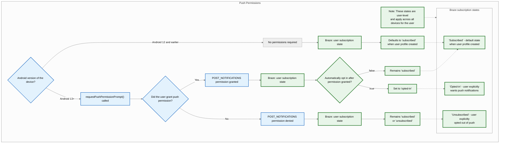
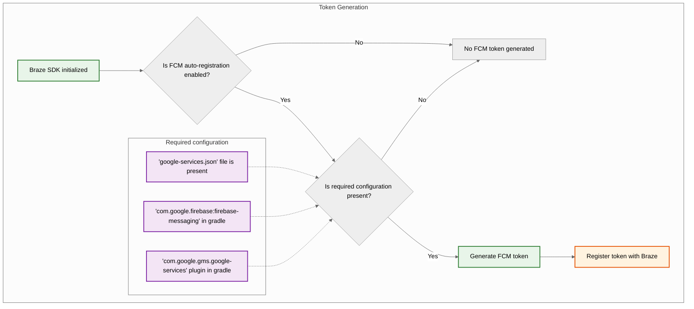
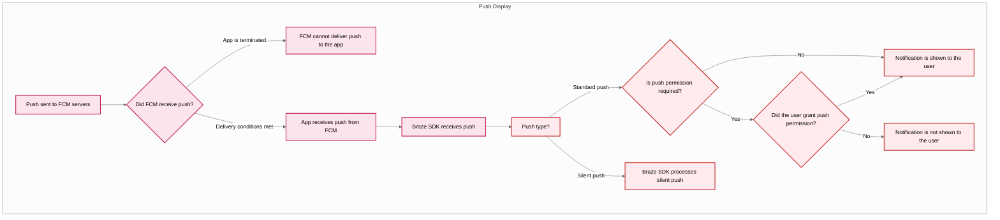



## Recursos integrados {#built-in-features}

Os recursos a seguir são integrados ao SDK Android da Braze. Para usar qualquer outro recurso de notificação por push, você precisará [configurar as notificações por push](#android_setting-up-push-notifications) para o seu app.

|Recurso|Descrição|
|-------|-----------|
|Push Stories|As Push Stories para Android são integradas ao SDK Android da Braze por padrão. Para saber mais, consulte [Push Stories]({{site.baseurl}}/user_guide/message_building_by_channel/push/advanced_push_options/push_stories).|
|Push primers|As Campaigns de push primer incentivam seus usuários a ativar as notificações por push em seus dispositivos para o seu app. Isso pode ser feito sem personalização do SDK usando nosso [push primer sem código]({{site.baseurl}}/user_guide/message_building_by_channel/push/best_practices/push_primer_messages).|
{: .reset-td-br-1 .reset-td-br-2 aria-label="Recursos integrados" }

## Sobre o ciclo de vida da notificação por push {#push-notification-lifecycle}

O fluxograma a seguir mostra como a Braze lida com o ciclo de vida da notificação por push, como solicitações de permissão, geração de token e entrega de mensagens.















## Configurando notificações por push {#setting-up-push-notifications}


Para conferir um app de exemplo usando FCM com o SDK Android da Braze, consulte [Braze: Firebase Push Sample App](https://github.com/braze-inc/braze-android-sdk/tree/master/samples/firebase-push).


### Limites de frequência {#rate-limits}

A API do Firebase Cloud Messaging (FCM) tem um limite de frequência padrão de 600.000 solicitações por minuto. Se você atingir esse limite, a Braze tentará novamente automaticamente em alguns minutos. Para solicitar um aumento, entre em contato com o [Suporte do Firebase](https://firebase.google.com/support).

### Etapa 1: Adicione o Firebase ao seu projeto {#step-1-add-firebase-to-your-project}

Primeiro, adicione o Firebase ao seu projeto Android. Para instruções passo a passo, consulte o [guia de configuração do Firebase](https://firebase.google.com/docs/android/setup) do Google.

### Etapa 2: Adicione o Cloud Messaging às suas dependências {#step-2-add-cloud-messaging-to-your-dependencies}

Em seguida, adicione a biblioteca do Cloud Messaging às dependências do seu projeto. No seu projeto Android, abra `build.gradle` e adicione a seguinte linha ao bloco `dependencies`.

```gradle
implementation "google.firebase:firebase-messaging:+"
```

Suas dependências devem ficar semelhantes ao seguinte:

```gradle
dependencies {
  implementation project(':android-sdk-ui')
  implementation "com.google.firebase:firebase-messaging:+"
}
```

### Etapa 3: Ative a API do Firebase Cloud Messaging {#step-3-enable-the-firebase-cloud-messaging-api}

No Google Cloud, selecione o projeto que seu app Android está usando e ative a [API do Firebase Cloud Messaging](https://console.cloud.google.com/apis/library/fcm.googleapis.com).

{: style="max-width:80%;"}

### Etapa 4: Crie uma conta de serviço {#service-account}

Em seguida, crie uma nova conta de serviço para que a Braze possa fazer chamadas de API autorizadas ao registrar tokens FCM. No Google Cloud, acesse **Service Accounts** e escolha seu projeto. Na página **Service Accounts**, selecione **Create Service Account**.


Insira um nome, ID e descrição para a conta de serviço e selecione **Create and continue**.

No campo **Role**, encontre e selecione **Firebase Cloud Messaging API Admin** na lista de funções. Para um acesso mais restritivo, crie uma [função personalizada](https://cloud.google.com/iam/docs/creating-custom-roles) com a permissão `cloudmessaging.messages.create` e escolha-a na lista. Quando terminar, selecione **Done**.


Certifique-se de selecionar **Firebase Cloud Messaging _API_ Admin**, e não **Firebase Cloud Messaging Admin**.



### Etapa 5: Gere credenciais JSON {#json}

Em seguida, gere credenciais JSON para sua conta de serviço FCM. No Google Cloud IAM & Admin, acesse **Service Accounts** e escolha seu projeto. Localize a conta de serviço FCM [que você criou anteriormente](#android_service-account) e selecione <i class="fa-solid fa-ellipsis-vertical" aria-label="Ações"></i>&nbsp;**Actions** > **Manage Keys**.


Selecione **Add Key** > **Create new key**.


Escolha **JSON** e selecione **Create**. Se você criou sua conta de serviço usando um ID de projeto do Google Cloud diferente do ID do seu projeto FCM, será necessário atualizar manualmente o valor atribuído a `project_id` no seu arquivo JSON.

Lembre-se de onde você baixou a chave&#8212;você precisará dela na próxima etapa.

{: style="max-width:65%;"}


Chaves privadas podem representar um risco de segurança se comprometidas. Armazene suas credenciais JSON em um local seguro por enquanto&#8212;você excluirá sua chave após enviá-la para a Braze.


### Etapa 6: Envie suas credenciais JSON para a Braze {#step-6-upload-your-json-credentials-to-braze}

Em seguida, envie suas credenciais JSON para o dashboard da Braze. Na Braze, selecione <i class="fa-solid fa-gear" aria-label="Configurações"></i>&nbsp;**Settings** > **App Settings**.


Em **Push Notification Settings** do seu app Android, escolha **Firebase**, selecione **Upload JSON File** e envie as credenciais [que você gerou anteriormente](#android_json). Quando terminar, selecione **Save**.



Chaves privadas podem representar um risco de segurança se comprometidas. Agora que sua chave foi enviada para a Braze, exclua o arquivo [que você gerou anteriormente](#android_json).


### Etapa 7: Configure o registro automático de tokens {#step-7-set-up-automatic-token-registration}

Quando um dos seus usuários aceitar receber notificações por push, seu app precisa gerar um token FCM no dispositivo dele antes que você possa enviar notificações por push. Com o SDK da Braze, você pode ativar o registro automático de tokens FCM para o dispositivo de cada usuário nos arquivos de configuração da Braze do seu projeto.

Primeiro, acesse o Firebase Console, abra seu projeto e selecione <i class="fa-solid fa-gear" aria-label="Configurações"></i>&nbsp;**Settings** > **Project settings**.


Selecione **Cloud Messaging** e, em **Firebase Cloud Messaging API (V1)**, copie o número no campo **Sender ID**.


Em seguida, abra seu projeto no Android Studio e use seu Firebase Sender ID para ativar o registro automático de tokens FCM no seu `braze.xml` ou `BrazeConfig`.



Para configurar o registro automático de tokens FCM, adicione as seguintes linhas ao seu arquivo `braze.xml`:

```xml
<bool translatable="false" name="com_braze_firebase_cloud_messaging_registration_enabled">true</bool>
<string translatable="false" name="com_braze_firebase_cloud_messaging_sender_id">FIREBASE_SENDER_ID</string>
```

Substitua `FIREBASE_SENDER_ID` pelo valor que você copiou das configurações do seu projeto Firebase. Seu `braze.xml` deve ficar semelhante ao seguinte:

```xml
<?xml version="1.0" encoding="utf-8"?>
<resources>
  <string translatable="false" name="com_braze_api_key">12345ABC-6789-DEFG-0123-HIJK456789LM</string>
  <bool translatable="false" name="com_braze_firebase_cloud_messaging_registration_enabled">true</bool>
<string translatable="false" name="com_braze_firebase_cloud_messaging_sender_id">603679405392</string>
</resources>
```



Para configurar o registro automático de tokens FCM, adicione as seguintes linhas ao seu `BrazeConfig`:



```java
.setIsFirebaseCloudMessagingRegistrationEnabled(true)
.setFirebaseCloudMessagingSenderIdKey("FIREBASE_SENDER_ID")
```


```kotlin
.setIsFirebaseCloudMessagingRegistrationEnabled(true)
.setFirebaseCloudMessagingSenderIdKey("FIREBASE_SENDER_ID")
```



Substitua `FIREBASE_SENDER_ID` pelo valor que você copiou das configurações do seu projeto Firebase. Seu `BrazeConfig` deve ficar semelhante ao seguinte:



```java
BrazeConfig brazeConfig = new BrazeConfig.Builder()
  .setApiKey("12345ABC-6789-DEFG-0123-HIJK456789LM")
  .setCustomEndpoint("sdk.iad-01.braze.com")
  .setSessionTimeout(60)
  .setHandlePushDeepLinksAutomatically(true)
  .setGreatNetworkDataFlushInterval(10)
  .setIsFirebaseCloudMessagingRegistrationEnabled(true)
  .setFirebaseCloudMessagingSenderIdKey("603679405392")
  .build();
Braze.configure(this, brazeConfig);
```


```kotlin
val brazeConfig = BrazeConfig.Builder()
  .setApiKey("12345ABC-6789-DEFG-0123-HIJK456789LM")
  .setCustomEndpoint("sdk.iad-01.braze.com")
  .setSessionTimeout(60)
  .setHandlePushDeepLinksAutomatically(true)
  .setGreatNetworkDataFlushInterval(10)
  .setIsFirebaseCloudMessagingRegistrationEnabled(true)
  .setFirebaseCloudMessagingSenderIdKey("603679405392")
  .build()
Braze.configure(this, brazeConfig)
```







Se preferir registrar tokens FCM manualmente, defina a propriedade [`registeredPushToken`](https://braze-inc.github.io/braze-android-sdk/kdoc/braze-android-sdk/com.braze/-i-braze/registered-push-token.html) na instância da Braze dentro do método [`onCreate()`](https://developer.android.com/reference/android/app/Application.html#onCreate()) do seu app.

```kotlin
// Kotlin
Braze.getInstance(context).registeredPushToken = "FCM_TOKEN"
```

```java
// Java
Braze.getInstance(context).setRegisteredPushToken("FCM_TOKEN");
```


#### Usando múltiplos projetos Firebase {#multiple-firebase-projects}

Se seu app usa múltiplos projetos Firebase, siga estas etapas:

1. Mantenha o push da Braze no projeto Firebase padrão inicializado a partir do `google-services.json` do seu app.
2. Se você usa um serviço de mensagens Firebase personalizado, conclua [Registrar IDs de instalação em serviços de mensagens Firebase personalizados](#android_register-installation-id-custom-firebase-service).
3. Se seu app obtém um token por push de outra forma, defina manualmente `registeredPushToken` conforme mostrado na dica anterior.


O Firebase Cloud Messaging não possui uma API compatível para recuperar um token de um `FirebaseApp` que você inicializa manualmente. Callbacks do `FirebaseMessagingService`, como `onNewToken` e `onRegistered`, só são disparados para o projeto padrão. Para saber mais, consulte [Configure multiple projects](https://firebase.google.com/docs/projects/multiprojects) na documentação do Firebase.


Para detalhes de versão, consulte os [changelogs do SDK]({{site.baseurl}}/developer_guide/changelogs?sdktab=android).

### Etapa 8: Remova solicitações automáticas na classe da sua aplicação {#step-8-remove-automatic-requests-in-your-application-class}

Para evitar que a Braze dispare solicitações de rede desnecessárias toda vez que você enviar notificações por push silenciosas, remova quaisquer solicitações de rede automáticas configuradas no método `onCreate()` da classe `Application`. Para saber mais, consulte [Android Developer Reference: Application](https://developer.android.com/reference/android/app/Application).

## Exibindo notificações {#displaying-notifications}

<a id="android_step-1-register-braze-firebase-messaging-service"></a>

### Etapa 1: Registrar o Braze Firebase Messaging Service {#register-braze-firebase-messaging-service}

Você pode criar um Firebase Messaging Service novo, existente ou que não seja da Braze. Escolha o que melhor atender às suas necessidades específicas.



A Braze inclui um serviço para lidar com o recebimento de push e intents de abertura. Nossa classe `BrazeFirebaseMessagingService` precisará ser registrada no seu `AndroidManifest.xml`:

```xml
<service android:name="com.braze.push.BrazeFirebaseMessagingService"
  android:exported="false">
  <intent-filter>
    <action android:name="com.google.firebase.MESSAGING_EVENT" />
  </intent-filter>
</service>
```

Nosso código de notificação também usa `BrazeFirebaseMessagingService` para lidar com o rastreamento de ações de abertura e clique. Esse serviço deve ser registrado no `AndroidManifest.xml` para funcionar corretamente. Além disso, lembre-se de que a Braze prefixa as notificações do nosso sistema com uma chave exclusiva para que apenas as notificações enviadas pelos nossos sistemas sejam renderizadas. Você pode registrar serviços adicionais separadamente para renderizar notificações enviadas por outros serviços FCM. Consulte [`AndroidManifest.xml`](https://github.com/braze-inc/braze-android-sdk/blob/master/samples/firebase-push/src/main/AndroidManifest.xml) no app de exemplo de push do Firebase.


Antes do SDK da Braze 3.1.1, o `AppboyFcmReceiver` era usado para lidar com push do FCM. A classe `AppboyFcmReceiver` deve ser removida do seu manifesto e substituída pela integração anterior.




Se você já tiver um Firebase Messaging Service registrado, poderá passar objetos [`RemoteMessage`](https://firebase.google.com/docs/reference/android/com/google/firebase/messaging/RemoteMessage) para a Braze via [`BrazeFirebaseMessagingService.handleBrazeRemoteMessage()`](https://braze-inc.github.io/braze-android-sdk/kdoc/braze-android-sdk/com.braze.push/-braze-firebase-messaging-service/-companion/handle-braze-remote-message.html). Esse método só exibirá uma notificação se o objeto [`RemoteMessage`](https://firebase.google.com/docs/reference/android/com/google/firebase/messaging/RemoteMessage) tiver sido originado da Braze e será ignorado com segurança caso contrário.

<a id="android_register-installation-id-custom-firebase-service"></a>

#### Registrar IDs de instalação em serviços Firebase Messaging personalizados {#register-installation-id-custom-firebase-service}

Se você estiver usando `firebase-messaging` v25.1.0 ou posterior, o registro do Firebase usa o Firebase Installation ID. No seu serviço Firebase Messaging personalizado, sobrescreva `onRegistered` e defina `registeredPushToken`.




```java
public class MyFirebaseMessagingService extends FirebaseMessagingService {
  @Override
  public void onRegistered(String installationId) {
    super.onRegistered(installationId);
    Braze.getInstance(this).setRegisteredPushToken(installationId);
  }

  @Override
  public void onMessageReceived(RemoteMessage remoteMessage) {
    super.onMessageReceived(remoteMessage);
    if (BrazeFirebaseMessagingService.handleBrazeRemoteMessage(this, remoteMessage)) {
      // This Remote Message originated from Braze and a push notification was displayed.
      // No further action is needed.
    } else {
      // This Remote Message did not originate from Braze.
      // No action was taken and you can safely pass this Remote Message to other handlers.
    }
  }
}
```




```kotlin
class MyFirebaseMessagingService : FirebaseMessagingService() {
  override fun onRegistered(installationId: String) {
    super.onRegistered(installationId)
    Braze.getInstance(this).registeredPushToken = installationId
  }

  override fun onMessageReceived(remoteMessage: RemoteMessage?) {
    super.onMessageReceived(remoteMessage)
    if (BrazeFirebaseMessagingService.handleBrazeRemoteMessage(this, remoteMessage)) {
      // This Remote Message originated from Braze and a push notification was displayed.
      // No further action is needed.
    } else {
      // This Remote Message did not originate from Braze.
      // No action was taken and you can safely pass this Remote Message to other handlers.
    }
  }
}
```






Se você tiver outro Firebase Messaging Service que também gostaria de usar, poderá especificar um Firebase Messaging Service de fallback para ser chamado caso seu aplicativo receba um push que não seja da Braze.

No seu `braze.xml`, especifique:

```xml
<bool name="com_braze_fallback_firebase_cloud_messaging_service_enabled">true</bool>
<string name="com_braze_fallback_firebase_cloud_messaging_service_classpath">com.company.OurFirebaseMessagingService</string>
```

ou defina via [configuração em tempo de execução:]({{site.baseurl}}/developer_guide/sdk_integration/?sdktab=android#runtime-configuration)




```java
BrazeConfig brazeConfig = new BrazeConfig.Builder()
        .setFallbackFirebaseMessagingServiceEnabled(true)
        .setFallbackFirebaseMessagingServiceClasspath("com.company.OurFirebaseMessagingService")
        .build();
Braze.configure(this, brazeConfig);
```




```kotlin
val brazeConfig = BrazeConfig.Builder()
        .setFallbackFirebaseMessagingServiceEnabled(true)
        .setFallbackFirebaseMessagingServiceClasspath("com.company.OurFirebaseMessagingService")
        .build()
Braze.configure(this, brazeConfig)
```






### Etapa 2: Adequar ícones pequenos às diretrizes de design {#step-2-conform-small-icons-to-design-guidelines}

Para informações gerais sobre ícones de notificação do Android, consulte a [Visão geral de notificações](https://developer.android.com/guide/topics/ui/notifiers/notifications).

A partir do Android N, você deve atualizar ou remover ativos de ícones de notificação pequenos que envolvam cores. O sistema Android (não o SDK da Braze) ignora todos os canais não alfa e de transparência em ícones de ação e no ícone pequeno de notificação. Em outras palavras, o Android converterá todas as partes do seu ícone pequeno de notificação para monocromático, exceto as regiões transparentes.

Para criar um ativo de ícone pequeno de notificação que seja exibido corretamente:
- Remova todas as cores da imagem, exceto o branco.
- Todas as outras regiões não brancas do ativo devem ser transparentes.


Um sintoma comum de um ativo inadequado é o ícone pequeno de notificação sendo renderizado como um quadrado monocromático sólido. Isso ocorre porque o sistema Android não consegue encontrar nenhuma região transparente no ativo do ícone pequeno de notificação.


Os ícones grandes e pequenos a seguir são exemplos de ícones projetados corretamente:


### Etapa 3: Configurar ícones de notificação {#configure-icons}

#### Especificando ícones no braze.xml {#specifying-icons-in-brazexml}

A Braze permite que você configure seus ícones de notificação especificando recursos drawable no seu `braze.xml`:

```xml
<drawable name="com_braze_push_small_notification_icon">REPLACE_WITH_YOUR_ICON</drawable>
<drawable name="com_braze_push_large_notification_icon">REPLACE_WITH_YOUR_ICON</drawable>
```

Definir um ícone pequeno de notificação é obrigatório. **Se você não definir um, a Braze usará o ícone do aplicativo como ícone pequeno de notificação por padrão, o que pode não ter uma aparência ideal.**

Definir um ícone grande de notificação é opcional, mas recomendado.

#### Especificando a cor de destaque do ícone {#specifying-icon-accent-color}

A cor de destaque do ícone de notificação pode ser substituída no seu `braze.xml`. Se a cor não for especificada, a cor padrão será o mesmo cinza que o Lollipop usa para notificações do sistema.

```xml
<integer name="com_braze_default_notification_accent_color">0xFFf33e3e</integer>
```

Você também pode usar opcionalmente uma referência de cor:

```xml
<color name="com_braze_default_notification_accent_color">@color/my_color_here</color>
```

### Etapa 4: Adicionar deep links {#step-4-add-deep-links}

#### Ativando a abertura automática de deep links {#enabling-automatic-deep-link-opening}

Para permitir que a Braze abra automaticamente seu app e quaisquer deep links quando uma notificação por push for clicada, defina `com_braze_handle_push_deep_links_automatically` como `true` no seu `braze.xml`:

```xml
<bool name="com_braze_handle_push_deep_links_automatically">true</bool>
```

Esse flag também pode ser definido via [configuração em tempo de execução]({{site.baseurl}}/developer_guide/sdk_integration/?sdktab=android#runtime-configuration):




```java
BrazeConfig brazeConfig = new BrazeConfig.Builder()
        .setHandlePushDeepLinksAutomatically(true)
        .build();
Braze.configure(this, brazeConfig);
```




```kotlin
val brazeConfig = BrazeConfig.Builder()
        .setHandlePushDeepLinksAutomatically(true)
        .build()
Braze.configure(this, brazeConfig)
```




Se você quiser lidar com deep links de forma personalizada, precisará criar um retorno de chamada de push que escute intents de push recebidos e abertos da Braze. Para saber mais, consulte [Usando um retorno de chamada para eventos de push]({{site.baseurl}}/developer_guide/push_notifications/customization#android_using-a-callback-for-push-events).

## Tratamento de notificações em primeiro plano {#handling-foreground-notifications}

Por padrão, quando uma notificação por push chega enquanto seu app está em primeiro plano no Android, o sistema a exibe automaticamente. Para que a Braze processe a carga útil da notificação por push (para rastreamento de análise de dados, tratamento de deep links e processamento personalizado), encaminhe os dados de push recebidos para a Braze dentro do seu método `FirebaseMessagingService.onMessageReceived`.

### Como funciona {#how-it-works}

Quando você chama `BrazeFirebaseMessagingService.handleBrazeRemoteMessage`, a Braze determina se a carga útil é uma notificação por push da Braze e, em caso afirmativo, cria e exibe a notificação com o método `NotificationManagerCompat`. Diferentemente do iOS, o Android exibe notificações independentemente de o app estar em primeiro plano ou em segundo plano.



```java
package com.example.push;

import com.braze.push.BrazeFirebaseMessagingService;
import com.google.firebase.messaging.FirebaseMessagingService;
import com.google.firebase.messaging.RemoteMessage;

public class MyFirebaseMessagingService extends FirebaseMessagingService {
    @Override
    public void onMessageReceived(RemoteMessage remoteMessage) {
        super.onMessageReceived(remoteMessage);

        // Let Braze process the payload and display the notification
        if (BrazeFirebaseMessagingService.handleBrazeRemoteMessage(this, remoteMessage)) {
            // Braze successfully handled the push notification
        } else {
            // Handle non-Braze messages
        }
    }
}
```



```kotlin
package com.example.push

import com.braze.push.BrazeFirebaseMessagingService
import com.google.firebase.messaging.FirebaseMessagingService
import com.google.firebase.messaging.RemoteMessage

class MyFirebaseMessagingService : FirebaseMessagingService() {
    override fun onMessageReceived(remoteMessage: RemoteMessage) {
        super.onMessageReceived(remoteMessage)

        // Let Braze process the payload and display the notification
        if (BrazeFirebaseMessagingService.handleBrazeRemoteMessage(this, remoteMessage)) {
            // Braze successfully handled the push notification
        } else {
            // Handle non-Braze messages
        }
    }
}
```



Para saber mais, consulte o [exemplo de integração com Firebase](https://github.com/braze-inc/braze-android-sdk/blob/master/samples/firebase-push/src/main/java/com/braze/firebasepush/FirebaseMessagingService.kt) no repositório do SDK Android da Braze.

### Personalização do comportamento em primeiro plano {#customizing-foreground-behavior}

Se você deseja um comportamento personalizado em primeiro plano, como suprimir a notificação do sistema ou exibir uma interface no app, você pode:

- Usar `subscribeToPushNotificationEvents` para reagir a eventos de push e tratar deep links com o método `BrazeNotificationUtils.routeUserWithNotificationOpenedIntent`. Para saber mais, consulte o [exemplo de push com Firebase](https://github.com/braze-inc/braze-android-sdk/blob/master/samples/firebase-push/src/main/java/com/braze/firebasepush/FirebaseApplication.kt).
- Criar e publicar sua própria notificação usando um `IBrazeNotificationFactory` personalizado, ou suprimir a notificação não chamando `notificationManager.notify` no seu fluxo de tratamento.

Para saber mais sobre personalização de notificações, consulte [Fábrica de notificações personalizada]({{site.baseurl}}/developer_guide/push_notifications/customization/?sdktab=android#custom-notification-factory).

#### Criação de deep links personalizados {#creating-custom-deep-links}

Siga as instruções encontradas na [documentação para desenvolvedores Android](http://developer.android.com/training/app-indexing/deep-linking.html) sobre deep linking, caso ainda não tenha adicionado deep links ao seu app. Para saber mais sobre o que são deep links, consulte nosso [artigo de perguntas frequentes]({{site.baseurl}}/user_guide/messaging/design_and_edit/personalize/actions_and_media_urls#what-is-deep-linking).

#### Adição de deep links {#adding-deep-links}

O dashboard da Braze permite configurar deep links ou URLs da web em Campaigns de notificação por push e Canvas que serão abertos quando a notificação for clicada.


#### Personalização do comportamento da pilha de retorno {#customizing-back-stack-behavior}

O SDK Android, por padrão, colocará a activity principal do launcher do seu app na pilha de retorno ao seguir deep links de push. A Braze permite que você defina uma activity personalizada para abrir na pilha de retorno no lugar da activity principal do launcher, ou desative a pilha de retorno completamente.

Por exemplo, para definir uma activity chamada `YourMainActivity` como a activity da pilha de retorno usando a [configuração em tempo de execução]({{site.baseurl}}/developer_guide/sdk_integration/?sdktab=android#runtime-configuration):




```java
BrazeConfig brazeConfig = new BrazeConfig.Builder()
        .setPushDeepLinkBackStackActivityEnabled(true)
        .setPushDeepLinkBackStackActivityClass(YourMainActivity.class)
        .build();
Braze.configure(this, brazeConfig);
```




```kotlin
val brazeConfig = BrazeConfig.Builder()
        .setPushDeepLinkBackStackActivityEnabled(true)
        .setPushDeepLinkBackStackActivityClass(YourMainActivity.class)
        .build()
Braze.configure(this, brazeConfig)
```




Consulte a configuração equivalente para o seu `braze.xml`. Observe que o nome da classe deve ser o mesmo retornado por `Class.forName()`.

```xml
<bool name="com_braze_push_deep_link_back_stack_activity_enabled">true</bool>
<string name="com_braze_push_deep_link_back_stack_activity_class_name">your.package.name.YourMainActivity</string>
```

### Etapa 5: Definir canais de notificação {#step-5-define-notification-channels}

O SDK Android da Braze oferece suporte a [canais de notificação do Android](https://developer.android.com/preview/features/notification-channels.html). Se uma notificação da Braze não contiver o ID de um canal de notificação ou contiver um ID de canal inválido, a Braze exibirá a notificação com o canal de notificação padrão definido no SDK. Os usuários da empresa usam os [Canais de notificação do Android]({{site.baseurl}}/user_guide/message_building_by_channel/push/android/notification_channels) na plataforma para agrupar notificações.

Para definir o nome do canal de notificação padrão da Braze visível ao usuário, use [`BrazeConfig.setDefaultNotificationChannelName()`](https://braze-inc.github.io/braze-android-sdk/kdoc/braze-android-sdk/com.braze.configuration/-braze-config/-builder/set-default-notification-channel-name.html).

Para definir a descrição do canal de notificação padrão da Braze visível ao usuário, use [`BrazeConfig.setDefaultNotificationChannelDescription()`](https://braze-inc.github.io/braze-android-sdk/kdoc/braze-android-sdk/com.braze.configuration/-braze-config/-builder/set-default-notification-channel-description.html).

Atualize quaisquer Campaigns de API com o parâmetro do [objeto de push Android]({{site.baseurl}}/api/objects_filters/messaging/android_object) para incluir o campo `notification_channel`. Se esse campo não for especificado, a Braze enviará a carga útil da notificação com o ID do canal de [fallback do dashboard]({{site.baseurl}}/user_guide/message_building_by_channel/push/android/notification_channels#dashboard-fallback-channel).

Além do canal de notificação padrão, a Braze não criará nenhum canal. Todos os outros canais devem ser definidos programaticamente pelo app host e, em seguida, inseridos no dashboard da Braze.

O nome e a descrição do canal padrão também podem ser configurados no `braze.xml`.

```xml
<string name="com_braze_default_notification_channel_name">Your channel name</string>
<string name="com_braze_default_notification_channel_description">Your channel description</string>
```

### Etapa 6: Testar a exibição e a análise de dados das notificações {#step-6-test-notification-display-and-analytics}

#### Teste de exibição {#testing-display}

Neste ponto, você já deve conseguir ver as notificações enviadas pela Braze. Para testar, acesse a página **Campaigns** no dashboard da Braze e crie uma Campaign de **Push Notification**. Escolha **Android Push** e crie sua mensagem. Em seguida, clique no ícone de olho no criador para acessar o remetente de teste. Insira o ID de usuário ou o endereço de e-mail do seu usuário atual e clique em **Send Test**. Você deverá ver a notificação por push aparecer no seu dispositivo.


Para problemas relacionados à exibição de push, consulte nosso [guia de solução de problemas]({{site.baseurl}}/developer_guide/push_notifications/troubleshooting/?sdktab=android).

#### Teste de análise de dados {#testing-analytics}

Neste ponto, você também deve ter o registro de análise de dados para aberturas de notificações por push. Clicar na notificação quando ela chegar deve fazer com que o valor de **Aberturas Diretas** na página de resultados da sua Campaign aumente em 1. Consulte nosso artigo sobre [relatórios de push]({{site.baseurl}}/user_guide/message_building_by_channel/push/push_reporting) para um detalhamento da análise de dados de push.

Para problemas relacionados à análise de dados de push, consulte nosso [guia de solução de problemas]({{site.baseurl}}/developer_guide/push_notifications/troubleshooting/?sdktab=android).

#### Teste pela linha de comando {#testing-from-command-line}

Se você quiser testar notificações no app e notificações por push pela interface de linha de comando, pode enviar uma única notificação pelo terminal via cURL e a [API de envio de mensagens]({{site.baseurl}}/api/endpoints/messaging). Você precisará substituir os seguintes campos pelos valores corretos para o seu caso de teste:

- `YOUR_API_KEY` (Acesse **Settings** > **API Keys**.)
- `YOUR_EXTERNAL_USER_ID` (Pesquise um perfil na página **Search Users**.)
- `YOUR_KEY1` (opcional)
- `YOUR_VALUE1` (opcional)

```bash
curl -X POST -H "Content-Type: application/json" -H "Authorization: Bearer {YOUR_API_KEY}" -d '{
  "external_user_ids":["YOUR_EXTERNAL_USER_ID"],
  "messages": {
    "android_push": {
      "title":"Test push title",
      "alert":"Test push",
      "extra": {
        "YOUR_KEY1":"YOUR_VALUE1"
      }
    }
  }
}' https://rest.iad-01.braze.com/messages/send
```

Este exemplo usa a instância `US-01`. Se você não estiver nessa instância, substitua o endpoint `US-01` pelo [seu endpoint]({{site.baseurl}}/api/basics#endpoints).

## Notificações por push de conversa {#conversation-push-notifications}

{: style="float:right;max-width:35%;margin-left:15px;border: 0;"}

A [iniciativa de pessoas e conversas](https://developer.android.com/guide/topics/ui/conversations) é uma iniciativa de vários anos do Android que visa elevar pessoas e conversas nas superfícies do sistema do telefone. Essa prioridade é baseada no fato de que a comunicação e a interação com outras pessoas ainda é a área funcional mais valorizada e importante para a maioria dos usuários do Android em todos os perfis demográficos.

### Requisitos de uso {#usage-requirements}

- Esse tipo de notificação requer o SDK Android da Braze v15.0.0+ e dispositivos com Android 11+.
- Dispositivos ou SDKs não compatíveis farão fallback para uma notificação por push padrão.

Esse recurso está disponível apenas pela REST API da Braze. Consulte o [objeto push do Android]({{site.baseurl}}/api/objects_filters/messaging/android_object#android-conversation-push-object) para saber mais.

## Erros de cota excedida do FCM {#fcm-quota-exceeded-errors}

Quando o limite do Firebase Cloud Messaging (FCM) é excedido, o Google retorna erros de "cota excedida". O limite padrão do FCM é de 600.000 solicitações por minuto. A Braze tenta reenviar seguindo as práticas recomendadas pelo Google. No entanto, um grande volume desses erros pode prolongar o tempo de envio em vários minutos. Para mitigar o impacto potencial, a Braze enviará um alerta informando que o limite de frequência está sendo excedido e as etapas que você pode seguir para evitar os erros.

Para verificar seu limite atual, acesse **Google Cloud Console** > **APIs & Services** > **Firebase Cloud Messaging API** > **Quotas & System Limits**, ou visite a [página de cotas da API do FCM](https://console.cloud.google.com/apis/api/fcm.googleapis.com/quotas).

### Práticas recomendadas {#best-practices}

Recomendamos estas práticas para manter o volume desses erros baixo.

#### Solicitar um aumento de limite de frequência ao FCM {#request-a-rate-limit-increase-from-fcm}

Para solicitar um aumento de limite de frequência ao FCM, você pode entrar em contato diretamente com o [Suporte do Firebase](https://firebase.google.com/support) ou fazer o seguinte:

1. Acesse a [página de cotas da API do FCM](https://console.cloud.google.com/apis/api/fcm.googleapis.com/quotas).
2. Localize a cota **Send requests per minute**.
3. Selecione **Edit Quota**.
4. Insira um novo valor e envie sua solicitação.

#### Aplicar um limite de frequência no espaço de trabalho {#apply-a-workspace-rate-limit}

Você pode aplicar um limite de frequência no espaço de trabalho para notificações por push do Android. Isso pode ajudar a regular a taxa de entrega das suas mensagens enviadas. Para saber mais, consulte [Limites de frequência de envio de mensagens do espaço de trabalho]({{site.baseurl}}/user_guide/administrative/app_settings/messaging_rate_limits).