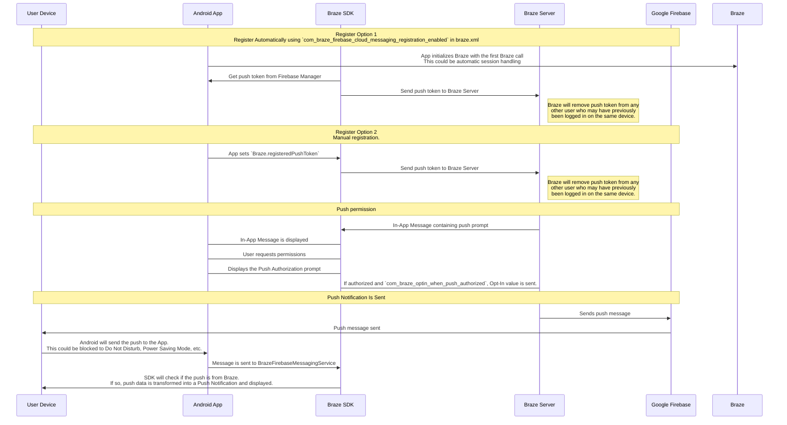

## Entendendo o fluxo de trabalho de push da Braze {#understanding-the-braze-push-workflow}

O Firebase Cloud Messaging (FCM) é a infraestrutura do Google para notificações por push enviadas a aplicativos Android. Veja a seguir a estrutura simplificada de como as notificações por push são ativadas nos dispositivos dos seus usuários e como a Braze pode enviar notificações por push para eles:



### Etapa 1: Configure sua chave de API do Google Cloud {#step-1-configure-your-google-cloud-api-key}

Ao desenvolver seu app, você precisará fornecer ao SDK Android da Braze o ID do remetente do Firebase. Além disso, será necessário fornecer uma chave de API para aplicativos de servidor ao dashboard da Braze. A Braze usará essa chave de API para enviar mensagens aos seus dispositivos. Você também precisará verificar se o serviço FCM está ativado no console de desenvolvedor do Google.


Um erro comum durante esta etapa é usar a chave de API do identificador do app em vez da chave da API REST.


### Etapa 2: Os dispositivos se registram no FCM e fornecem tokens por push à Braze {#step-2-devices-register-for-fcm-and-provide-braze-with-push-tokens}

Em integrações típicas, o SDK Android da Braze cuidará do registro dos dispositivos para o recurso de FCM. Isso geralmente acontece imediatamente ao abrir o app pela primeira vez. Após o registro, a Braze receberá um ID de registro do FCM, que é usado para enviar mensagens especificamente para aquele dispositivo. Armazenaremos o ID de registro desse usuário, e o usuário passará a ter o status "push registrado" caso não possuísse um token por push para nenhum dos seus apps anteriormente.

### Etapa 3: Lance uma Campaign de push na Braze {#step-3-launch-a-braze-push-campaign}

Quando uma Campaign de push é lançada, a Braze faz solicitações ao FCM para entregar sua mensagem. A Braze usa a chave de API copiada no dashboard para autenticar e verificar se é possível enviar notificações por push para os tokens por push fornecidos.

### Etapa 4: Remova tokens inválidos {#step-4-remove-invalid-tokens}

Se o FCM nos informar que algum dos tokens por push para os quais tentamos enviar uma mensagem é inválido, removemos esses tokens dos perfis de usuário aos quais estavam associados. Se os usuários não tiverem outros tokens por push, eles não aparecerão mais como "Push Registered" na página de **Segments**.

Para mais detalhes sobre o FCM, acesse [Cloud messaging](https://firebase.google.com/docs/cloud-messaging/).

## Use os registros de erros de push {#use-the-push-error-logs}

A Braze disponibiliza erros de notificações por push no registro de atividades de mensagens. Esse registro de erros oferece diversos alertas que podem ser muito úteis para identificar por que suas campanhas não estão funcionando como esperado. Ao selecionar uma mensagem de erro, você é redirecionado para a documentação relevante que ajuda a solucionar um incidente específico.


## Solução de problemas {#troubleshooting}

### Push não está enviando {#push-isnt-sending}

Suas mensagens de push podem não estar sendo enviadas devido às seguintes situações:

- Suas credenciais estão no projeto de Google Cloud Platform errado (ID de remetente errado).
- Suas credenciais têm o escopo de permissão errado.
- Você fez upload de credenciais erradas para o espaço de trabalho da Braze errado (ID de remetente errado).

Para outros problemas que podem impedir o envio de uma mensagem de push, consulte [Guia do usuário: solução de problemas de notificações por push]({{site.baseurl}}/user_guide/channels/push/troubleshooting).

### Nenhum usuário "push registered" aparecendo no dashboard da Braze (antes de enviar mensagens) {#no-push-registered-users-showing-in-the-braze-dashboard-prior-to-sending-messages}

Confirme que seu app está configurado corretamente para permitir notificações por push. Pontos comuns de falha a verificar incluem:

#### ID de remetente incorreto {#incorrect-sender-id}

Verifique se o ID de remetente FCM correto está incluído no arquivo `braze.xml`. Um ID de remetente incorreto levará a erros `MismatchSenderID` reportados no registro de atividade de mensagens do dashboard.

#### Registro na Braze não está ocorrendo {#braze-registration-not-occurring}

Como o registro no FCM é tratado fora da Braze, a falha no registro pode ocorrer apenas em dois lugares:

1. Durante o registro no FCM
2. Ao passar o token de push gerado pelo FCM para a Braze

Recomendamos definir um breakpoint ou adicionar logging para confirmar que o token de push gerado pelo FCM está sendo enviado para a Braze. Se um token não for gerado corretamente ou não for gerado, recomendamos consultar a [documentação do FCM](https://firebase.google.com/docs/cloud-messaging/android/client).

#### Google Play Services não presente {#google-play-services-not-present}

Para que o push via FCM funcione, o Google Play Services deve estar presente no dispositivo. Se o Google Play Services não estiver no dispositivo, o registro de push não ocorrerá.


O Google Play Services não é instalado em emuladores Android que não possuem as APIs do Google instaladas.


#### Dispositivo não conectado à internet {#device-not-connected-to-the-internet}

Verifique se seu dispositivo tem boa conectividade com a internet e não está enviando tráfego de rede por um proxy.

### Tocar na notificação por push não abre o app {#tapping-push-notification-doesnt-open-the-app}

Verifique se `com_braze_handle_push_deep_links_automatically` está definido como `true` ou `false`. Para permitir que a Braze abra automaticamente o app e quaisquer deep links quando uma notificação por push for tocada, defina `com_braze_handle_push_deep_links_automatically` como `true` no seu arquivo `braze.xml`.

Se `com_braze_handle_push_deep_links_automatically` estiver definido com seu valor padrão de `false`, você precisa usar um Braze Push Callback para escutar e tratar os intents de push recebido e aberto.

### Notificações por push com bounce {#push-notifications-bounced}

Se uma notificação por push não for entregue, certifique-se de que ela não sofreu bounce verificando no [console de desenvolvedor]({{site.baseurl}}/developer_guide/platforms/android/push_notifications/troubleshooting#utilizing-the-push-error-logs). A seguir estão descrições de erros comuns que podem ser registrados no console de desenvolvedor:

#### Erro: MismatchSenderID {#error-mismatchsenderid}

`MismatchSenderID` indica uma falha de autenticação. Confirme se o ID de remetente do Firebase e a chave de API do FCM estão corretos.

#### Erro: InvalidRegistration {#error-invalidregistration}

`InvalidRegistration` pode ser causado por um token de push malformado.

1. Certifique-se de passar um token de push válido para a Braze a partir do [Firebase Cloud Messaging](https://firebase.google.com/docs/cloud-messaging/android/client#retrieve-the-current-registration-token).

#### Erro: NotRegistered {#error-notregistered}

2. `NotRegistered` também pode ocorrer quando múltiplos registros acontecem e um segundo registro invalida o primeiro token.

### Notificações por push enviadas mas não exibidas nos dispositivos dos usuários {#push-notifications-sent-but-not-displayed-on-users-devices}

Existem alguns motivos pelos quais isso pode estar ocorrendo:

#### O app foi forçado a fechar {#application-was-force-quit}

Se você forçar o encerramento do app pelas configurações do sistema, suas notificações por push não serão enviadas. Abrir o app novamente reativará seu dispositivo para receber notificações por push.

#### BrazeFirebaseMessagingService não registrado {#brazefirebasemessagingservice-not-registered}

O BrazeFirebaseMessagingService deve estar devidamente registrado no `AndroidManifest.xml` para que as notificações por push apareçam:

```xml
<service android:name="com.braze.push.BrazeFirebaseMessagingService"
  android:exported="false">
  <intent-filter>
    <action android:name="com.google.firebase.MESSAGING_EVENT" />
  </intent-filter>
</service>
```

#### Firewall está bloqueando o push {#firewall-is-blocking-push}

Se você está testando push via Wi-Fi, seu firewall pode estar bloqueando as portas necessárias para o FCM receber mensagens. Confirme que as portas `5228`, `5229` e `5230` estão abertas. Além disso, como o FCM não especifica seus IPs, você também deve permitir que seu firewall aceite conexões de saída para todos os endereços IP contidos nos blocos de IP listados no ASN do Google `15169`.

#### Fábrica de notificação personalizada retornando null {#custom-notification-factory-returning-null}

Se você implementou uma [fábrica de notificação personalizada]({{site.baseurl}}/developer_guide/platform_integration_guides/android/push_notifications/android/integration/standard_integration#custom-displaying-notifications), certifique-se de que ela não está retornando `null`. Isso fará com que as notificações não sejam exibidas.

### Usuários "push registered" não mais habilitados após o envio de mensagens {#push-registered-users-no-longer-enabled-after-sending-messages}

Existem alguns motivos pelos quais isso pode estar acontecendo:

#### App foi desinstalado {#application-was-uninstalled}

Os usuários desinstalaram o app. Isso invalidará o token de push FCM deles.

#### Chave de servidor do Firebase Cloud Messaging inválida {#invalid-firebase-cloud-messaging-server-key}

A chave de servidor do Firebase Cloud Messaging fornecida no dashboard da Braze é inválida. O ID de remetente fornecido deve corresponder ao referenciado no arquivo `braze.xml` do seu app. A chave de servidor e o ID de remetente são encontrados aqui no seu Firebase Console:


### Cliques em push não estão sendo registrados {#push-clicks-not-logged}

Se os cliques em push não estão sendo registrados, é possível que os dados de clique em push ainda não tenham sido enviados para nossos servidores. O SDK Android da Braze pode limitar a frequência dos envios.

Se você implementou um handler de push personalizado, certifique-se de que está [preservando corretamente a análise de dados nativa de push]({{site.baseurl}}/developer_guide/push_notifications/logging_message_data/?tab=android#preserving-native-push-analytics-with-custom-push-handling)

O registro de cliques em push é uma operação de rede e está sujeito a limitações de rede. Dessa forma, embora o SDK Android da Braze tente lidar com falhas de rede e tente novamente as solicitações que falharam, alguma perda de eventos é esperada.

### Deep links não estão funcionando {#deep-links-not-working}

#### Verifique a configuração do deep link {#verify-deep-link-configuration}

Deep links podem ser [testados com ADB](https://developer.android.com/training/app-indexing/deep-linking.html#testing-filters). Recomendamos testar seu deep link com o seguinte comando:

`adb shell am start -W -a android.intent.action.VIEW -d "THE_DEEP_LINK" THE_PACKAGE_NAME`

Se o deep link não funcionar, o deep link pode estar mal configurado. Um deep link mal configurado não funcionará quando enviado por push da Braze.

#### Verifique a lógica de tratamento personalizado {#verify-custom-handling-logic}

Se o deep link [funciona corretamente com ADB](https://developer.android.com/training/app-indexing/deep-linking.html#testing-filters) mas falha ao ser enviado por push da Braze, verifique se algum [tratamento personalizado de abertura de push]({{site.baseurl}}/developer_guide/platform_integration_guides/android/push_notifications/android/integration/standard_integration#android-push-listener-callback) foi implementado. Se sim, verifique se o código de tratamento personalizado processa corretamente o deep link recebido.

#### Desativar o comportamento de back stack {#disable-back-stack-behavior}

Se o deep link [funciona corretamente com ADB](https://developer.android.com/training/app-indexing/deep-linking.html#testing-filters) mas falha ao ser enviado por push da Braze, tente desativar o [back stack](https://developer.android.com/guide/components/activities/tasks-and-back-stack). Para isso, atualize seu arquivo **braze.xml** para incluir:

```xml
<bool name="com_braze_push_deep_link_back_stack_activity_enabled">false</bool>
```
