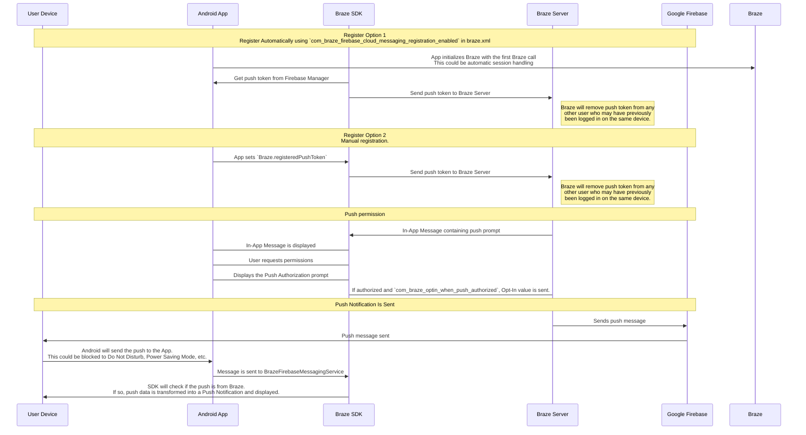

## Entendendo o fluxo de trabalho de push da Braze {#understanding-the-braze-push-workflow}

O serviço Firebase Cloud Messaging (FCM) é a infraestrutura do Google para notificações por push enviadas para aplicativos Android. Esta é a estrutura simplificada de como as notificações por push são ativadas para os dispositivos de seus usuários e como a Braze pode enviar notificações por push para eles:



### Etapa 1: Configure sua chave de API do Google Cloud {#step-1-configure-your-google-cloud-api-key}

Ao desenvolver seu app, você precisará fornecer ao SDK da Braze para Android o seu ID de remetente do Firebase. Além disso, será necessário fornecer uma chave de API para aplicativos de servidor no dashboard da Braze. A Braze usará essa chave de API para enviar mensagens para seus dispositivos. Também será necessário verificar se o serviço FCM está ativado no console de desenvolvedor do Google.


Um erro comum durante essa etapa é usar a chave de API do identificador do app em vez da chave da API REST.


### Etapa 2: Os dispositivos se registram no FCM e fornecem tokens por push à Braze {#step-2-devices-register-for-fcm-and-provide-braze-with-push-tokens}

Em integrações típicas, o SDK da Braze para Android lidará com o registro de dispositivos para o recurso FCM. Isso geralmente acontece imediatamente após a abertura do app pela primeira vez. Após o registro, a Braze receberá um ID de registro FCM, que é usado para enviar mensagens especificamente para esse dispositivo. Armazenaremos o ID de registro desse usuário, e ele se tornará "registrado por push" se anteriormente não tiver um token por push para nenhum dos seus apps.

### Etapa 3: Lance uma Campaign de push da Braze {#step-3-launch-a-braze-push-campaign}

Quando uma Campaign de push for lançada, a Braze fará solicitações ao FCM para entregar sua mensagem. A Braze usará a chave de API copiada no dashboard para autenticar e verificar se podemos enviar notificações por push para os tokens por push fornecidos.

### Etapa 4: Remova tokens inválidos {#step-4-remove-invalid-tokens}

Se o FCM nos informar que qualquer um dos tokens por push para os quais estávamos tentando enviar uma mensagem é inválido, removeremos esses tokens dos perfis de usuário aos quais eles estavam associados. Se os usuários não tiverem outros tokens por push, eles não aparecerão mais como "Push Registered" na página **Segments**.

Para obter mais detalhes sobre o FCM, acesse [Cloud messaging](https://firebase.google.com/docs/cloud-messaging/).

## Use os registros de erros do push {#use-the-push-error-logs}

A Braze fornece erros de notificações por push no registro de atividades de mensagens. Esse registro de erros fornece uma variedade de avisos que podem ser muito úteis para identificar por que suas campanhas não estão funcionando como esperado. Ao selecionar uma mensagem de erro, você será redirecionado para a documentação relevante que ajudará a solucionar um incidente específico.


## Solução de problemas {#troubleshooting}

### O push não está sendo enviado {#push-isnt-sending}

Suas mensagens push podem não estar sendo enviadas devido às seguintes situações:

- Suas credenciais existem no ID de projeto errado do Google Cloud Platform (ID de remetente errado).
- Suas credenciais têm o escopo de permissão incorreto.
- Você fez upload de credenciais erradas para o espaço de trabalho errado da Braze (ID de remetente errado).

Para outros problemas que podem impedir o envio de uma mensagem push, consulte [Guia do usuário: solução de problemas de notificações por push]({{site.baseurl}}/user_guide/message_building_by_channel/push/troubleshooting).

### Nenhum usuário "push registrado" é exibido no dashboard da Braze (antes do envio de mensagens) {#no-push-registered-users-showing-in-the-braze-dashboard-prior-to-sending-messages}

Confirme se o seu app está configurado corretamente para permitir notificações por push. Os pontos de falha comuns a serem verificados incluem:

#### ID do remetente incorreto {#incorrect-sender-id}

Verifique se o ID do remetente FCM correto está incluído no arquivo `braze.xml`. Um ID de remetente incorreto levará a erros `MismatchSenderID` relatados no registro de atividade de mensagens do dashboard.

#### O registro da Braze não está ocorrendo {#braze-registration-not-occurring}

Como o registro do FCM é feito fora da Braze, a falha no registro só pode ocorrer em dois lugares:

1. Durante o registro no FCM
2. Ao passar o token por push gerado pelo FCM para a Braze

Recomendamos definir um ponto de interrupção ou registro para confirmar que o token por push gerado pelo FCM está sendo enviado à Braze. Se um token não for gerado corretamente ou de forma alguma, recomendamos consultar a [documentação do FCM](https://firebase.google.com/docs/cloud-messaging/android/client).

#### O Google Play Services não está presente {#google-play-services-not-present}

Para que o push do FCM funcione, o Google Play Services deve estar presente no dispositivo. Se o Google Play Services não estiver em um dispositivo, o registro push não ocorrerá.


O Google Play Services não é instalado em emuladores Android sem as APIs do Google instaladas.


#### O dispositivo não está conectado à internet {#device-not-connected-to-the-internet}

Verifique se o seu dispositivo tem boa conectividade com a internet e se não está enviando tráfego de rede por meio de um proxy.

### Tocar em uma notificação por push não abre o app {#tapping-push-notification-doesnt-open-the-app}

Verifique se `com_braze_handle_push_deep_links_automatically` está definido como `true` ou `false`. Para ativar a Braze para abrir automaticamente o app e quaisquer deep links quando uma notificação por push for tocada, defina `com_braze_handle_push_deep_links_automatically` como `true` no seu arquivo `braze.xml`.

Se `com_braze_handle_push_deep_links_automatically` estiver definido como o padrão `false`, você precisará usar um retorno de chamada do Braze Push para ouvir e tratar as intenções recebidas e abertas de push.

### As notificações por push sofreram bounce {#push-notifications-bounced}

Se uma notificação por push não for entregue, verifique se não houve bounce no [console de desenvolvedor]({{site.baseurl}}/developer_guide/platforms/android/push_notifications/troubleshooting#utilizing-the-push-error-logs). A seguir estão as descrições de erros comuns que podem ser registrados no console de desenvolvedor:

#### Erro: MismatchSenderID {#error-mismatchsenderid}

`MismatchSenderID` indica uma falha de autenticação. Confirme se o ID do remetente do Firebase e a chave de API do FCM estão corretos.

#### Erro: InvalidRegistration {#error-invalidregistration}

`InvalidRegistration` pode ser causado por um token por push malformado.

1. Certifique-se de passar um token por push válido para a Braze a partir do [Firebase Cloud Messaging](https://firebase.google.com/docs/cloud-messaging/android/client#retrieve-the-current-registration-token).

#### Erro: NotRegistered {#error-notregistered}

2. `NotRegistered` também pode ocorrer quando há vários registros e um segundo registro invalida o primeiro token.

### Notificações por push enviadas, mas não exibidas nos dispositivos dos usuários {#push-notifications-sent-but-not-displayed-on-users-devices}

Há alguns motivos pelos quais isso pode estar ocorrendo:

#### O aplicativo foi encerrado à força {#application-was-force-quit}

Se você forçar o encerramento do aplicativo por meio das configurações do sistema, as notificações por push não serão enviadas. Ao iniciar o app novamente, seu dispositivo será reativado para receber notificações por push.

#### BrazeFirebaseMessagingService não registrado {#brazefirebasemessagingservice-not-registered}

O BrazeFirebaseMessagingService deve ser registrado corretamente em `AndroidManifest.xml` para que as notificações por push sejam exibidas:

```xml
<service android:name="com.braze.push.BrazeFirebaseMessagingService"
  android:exported="false">
  <intent-filter>
    <action android:name="com.google.firebase.MESSAGING_EVENT" />
  </intent-filter>
</service>
```

#### O firewall está bloqueando o push {#firewall-is-blocking-push}

Se estiver testando o push por Wi-Fi, seu firewall pode estar bloqueando as portas necessárias para que o FCM receba mensagens. Confirme se as portas `5228`, `5229` e `5230` estão abertas. Além disso, como o FCM não especifica seus IPs, você também deve permitir que seu firewall aceite conexões de saída para todos os endereços IP contidos nos blocos de IPs listados no ASN do Google de `15169`.

#### Fábrica de notificação personalizada retornando nulo {#custom-notification-factory-returning-null}

Se você tiver implementado uma [fábrica de notificações personalizada]({{site.baseurl}}/developer_guide/platform_integration_guides/android/push_notifications/android/integration/standard_integration#custom-displaying-notifications), certifique-se de que ela não esteja retornando `null`. Isso fará com que as notificações não sejam exibidas.

### Os usuários "push registrados" não estão mais ativados após o envio de mensagens {#push-registered-users-no-longer-enabled-after-sending-messages}

Há alguns motivos pelos quais isso pode estar acontecendo:

#### O aplicativo foi desinstalado {#application-was-uninstalled}

Os usuários desinstalaram o aplicativo. Isso invalidará o token por push FCM deles.

#### Chave de servidor do Firebase Cloud Messaging inválida {#invalid-firebase-cloud-messaging-server-key}

A chave do servidor do Firebase Cloud Messaging fornecida no dashboard da Braze é inválida. O ID do remetente fornecido deve corresponder àquele referenciado no arquivo `braze.xml` do seu app. A chave do servidor e o ID do remetente podem ser encontrados aqui no seu console do Firebase:


### Cliques em push não registrados {#push-clicks-not-logged}

Se os cliques em push não estiverem sendo registrados, é possível que os dados de cliques push ainda não tenham sido enviados aos nossos servidores. O SDK da Braze para Android pode limitar a frequência dos envios.

Se você implementou um tratamento de push personalizado, certifique-se de que está [preservando corretamente a análise de dados nativa de push]({{site.baseurl}}/developer_guide/push_notifications/logging_message_data/?tab=android#preserving-native-push-analytics-with-custom-push-handling).

O registro de cliques em push é uma operação de rede e está sujeito a limitações de conectividade. Dessa forma, embora o SDK da Braze para Android tente acomodar falhas de rede e reenvie solicitações com falha, alguma perda de eventos é esperada.

### Os deep links não estão funcionando {#deep-links-not-working}

#### Verificar a configuração do deep link {#verify-deep-link-configuration}

Os deep links podem ser [testados com o ADB](https://developer.android.com/training/app-indexing/deep-linking.html#testing-filters). Recomendamos testar seu deep link com o seguinte comando:

`adb shell am start -W -a android.intent.action.VIEW -d "THE_DEEP_LINK" THE_PACKAGE_NAME`

Se o deep link não funcionar, ele pode estar mal configurado. Um deep link mal configurado não funcionará quando enviado por meio do Braze push.

#### Verificar a lógica de tratamento personalizado {#verify-custom-handling-logic}

Se o deep link [funcionar corretamente com o ADB](https://developer.android.com/training/app-indexing/deep-linking.html#testing-filters), mas não funcionar com o Braze push, verifique se foi implementado algum [tratamento personalizado de abertura de push]({{site.baseurl}}/developer_guide/platform_integration_guides/android/push_notifications/android/integration/standard_integration#android-push-listener-callback). Se for o caso, verifique se o código de tratamento personalizado trata corretamente o deep link de entrada.

#### Desativar o comportamento da pilha de retorno {#disable-back-stack-behavior}

Se o deep link [funcionar corretamente com o ADB](https://developer.android.com/training/app-indexing/deep-linking.html#testing-filters), mas não funcionar com o Braze push, tente desativar a [pilha de retorno](https://developer.android.com/guide/components/activities/tasks-and-back-stack). Para fazer isso, atualize seu arquivo **braze.xml** para incluir:

```xml
<bool name="com_braze_push_deep_link_back_stack_activity_enabled">false</bool>
```
