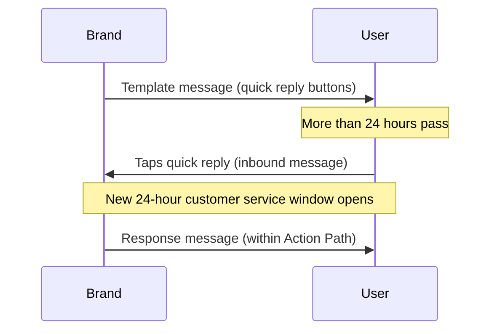

# Mensagens de usuários {#user-messages}

> O WhatsApp é um canal de comunicação de mão dupla. Sua marca não apenas pode enviar mensagens aos usuários, mas eles também podem participar de conversas usando Campaigns e Canvas com modelos. Existem várias maneiras de fazer isso, incluindo respostas rápidas do WhatsApp, mensagens de lista e palavras-gatilho. As chamadas para ação (CTAs) de respostas rápidas e mensagens de lista são uma ótima maneira de incentivar o engajamento dos usuários com suas mensagens do WhatsApp.

## Disparadores baseados em ação {#action-based-triggers}

Tanto Campaigns quanto Canvas podem iniciar, ramificar e ter alterações no meio da jornada a partir de uma mensagem de entrada do WhatsApp (um usuário enviando mensagem para o seu WhatsApp), como uma palavra de disparo.

Certifique-se de que sua palavra de disparo corresponda ao que você espera dos usuários.

**O que você precisa saber:**
- Cada letra da sua palavra de disparo deve estar em maiúscula quando configurada. A Braze não exige que as palavras de disparo de entrada enviadas pelos usuários estejam em maiúsculas. Por exemplo, enviar "jOin2023" ainda disparará o Canvas ou a Campaign.
- Se nenhuma palavra de disparo for especificada no disparador baseado em ação do cronograma de entrada, a Campaign ou o Canvas será executado para TODAS as mensagens de entrada do WhatsApp. Isso inclui mensagens que correspondem a frases em Campaigns e Canvas ativos, e nesse caso o usuário receberá duas mensagens do WhatsApp.










## Respostas não reconhecidas {#unrecognized-responses}

Recomendamos que você inclua uma opção para respostas não reconhecidas em Canvas interativos. Isso orienta os usuários a entenderem quais são os prompts disponíveis e define expectativas para o canal. O gerenciamento de expectativas pode ser especialmente útil se você tiver canais do WhatsApp com chat de agente ao vivo.
- Na etapa de ação, após criar os grupos de ação para as frases de filtro personalizadas, adicione um grupo de ação adicional para "Send WhatsApp message", mas **não marque Where the message body**. Isso capturará todas as respostas não reconhecidas dos usuários, semelhante a uma cláusula "else".
- Recomendamos enviar uma mensagem do WhatsApp informando ao usuário que esse canal não é monitorado e direcionando-o a um canal de suporte, se necessário.

## Respostas rápidas {#quick-replies}

{: style="float:right;max-width:25%;margin-left:15px;border: 0;"}

As respostas rápidas aparecem como opções de botões clicáveis dentro da conversa, mas funcionam como se o usuário tivesse respondido com texto. A Braze então processa essas respostas como mensagens de entrada e pode enviar respostas predefinidas com base no botão clicado. Use a etapa "Ação de mensagem de entrada do WhatsApp" ao criar e filtrar respostas dos seus usuários.

{: style="max-width:50%;"}

### Configure a experiência de resposta rápida no Canvas {#configure-the-quick-reply-experience-in-canvas}

#### Etapa 1: Crie os CTAs {#step-1-build-out-ctas}

Primeiro, crie seus CTAs de resposta rápida no [Gerenciador de modelos de mensagem do WhatsApp](https://business.facebook.com/wa/manage/message-templates/) dentro de um modelo de mensagem.

{: style="max-width:80%;"}

Depois que seu modelo for enviado e aprovado pelo WhatsApp, você poderá usá-lo para criar um Canvas na Braze.


Você pode criar o Canvas antes de receber a aprovação do seu modelo de mensagem.


#### Etapa 2: Crie seu Canvas {#step-2-build-your-canvas}

Em seguida, crie um Canvas com uma etapa de mensagem que inclua o modelo criado.

Crie uma etapa de ação que segue a etapa de mensagem. Crie um grupo por opção de resposta rápida nesta etapa de ação.

Para cada grupo de opção de resposta rápida, especifique o texto exato correspondente ao botão que você deseja associar. As palavras-chave devem estar em letras maiúsculas.

Se você quiser uma resposta padrão para usuários que respondem à mensagem com texto em vez de respostas rápidas, crie um grupo adicional sem corpo de mensagem correspondente.

Continue criando o Canvas normalmente a partir desse ponto.

### Respostas {#responses}

Provavelmente, você vai querer uma mensagem de resposta para cada retorno. Recomendamos ter uma opção genérica para respostas fora do escopo das respostas rápidas (como para clientes que respondem com uma mensagem geral em vez de uma opção predeterminada). Por exemplo, "Desculpe, não reconhecemos sua resposta. Para questões de suporte, envie uma mensagem para <canal de suporte>."

Você pode usar quaisquer ações subsequentes que o Canvas da Braze oferece, como mensagens de resposta, atualizações de perfil de usuário ou webhooks Braze-to-Braze.

## Mensagens de lista {#list-messages}

As mensagens de lista aparecem como uma mensagem no corpo com uma lista de opções clicáveis. Cada lista pode ter várias seções, e cada lista pode ter até 10 linhas.

{: style="max-width:40%;"}

### Configurar a experiência de mensagem de lista no Canvas {#configure-the-list-message-experience-in-canvas}

#### Etapa 1: Criar ou editar um Canvas baseado em ação existente {#step-1-create-or-edit-an-existing-action-based-canvases}

Você só pode adicionar mensagens de lista do WhatsApp a Canvas que sejam baseados em ação, pois eles precisam ser uma resposta a uma mensagem do usuário.

#### Etapa 2: Criar uma etapa de mensagem do WhatsApp {#step-2-create-a-whatsapp-message-step}

Adicione uma [etapa de mensagem]({{site.baseurl}}/user_guide/messaging/canvas/canvas_components/message_step) do WhatsApp e selecione o layout de mensagem de resposta **List Message**.

{: style="max-width:70%;"}

Adicione um nome de **List button** que os usuários selecionarão para exibir sua lista. Em seguida, use os campos em **List content** para criar sua lista:

- **Section:** Adicione até 10 seções para agrupar e organizar os itens da sua lista. Por exemplo, um varejista de roupas poderia usar seções para organizar por estilos sazonais (como primavera, verão, outono e inverno) ou itens de vestuário (como blusas, calças e sapatos).
- **Row:** Adicione até 10 linhas, ou itens de lista, em todas as seções.
- **Row description (opcional):** Adicione uma descrição opcional a todas as linhas (itens de lista).

{: style="max-width:60%;"}

Altere a ordem das seções e linhas selecionando e arrastando o ícone ao lado de seus nomes.

{: style="max-width:60%;"}

De volta ao criador do Canvas, adicione uma [jornada de ação]({{site.baseurl}}/user_guide/messaging/canvas/canvas_components/action_paths) após a etapa de mensagem que tenha um grupo para cada resposta da lista. Em cada grupo:

1. Adicione um disparador para **Sent inbound WhatsApp subscription group** e selecione o grupo de inscrições do WhatsApp correspondente.
2. Marque a caixa de seleção **Where the message body**.
3. Especifique o conteúdo de uma linha (ou item de lista).

Continue a construir seu Canvas.

### Criando jornadas de ação para descrições longas {#creating-actions-paths-for-long-descriptions}

Se você tiver descrições de linhas, deve usar **Matches regex** para especificar uma linha. Por exemplo, se quiser especificar uma linha com a descrição "Our new style that fits over your favorite pair of ankle boots", você pode usar [regex]({{site.baseurl}}/user_guide/audience/segments/regex) com "ankle boots".

## Considerações {#considerations}

### Requisitos de tempo para mensagens de resposta {#timing-requirements-for-response-messages}

As mensagens de resposta precisam ser enviadas dentro de 24 horas após o recebimento da mensagem de um usuário. Para ajudar a criar experiências bem-sucedidas, a Braze verifica a lógica da mensagem para confirmar que existe uma mensagem de entrada upstream do usuário que desbloqueia a mensagem de resposta.

Para respostas em menos de um minuto em fluxos bidirecionais do Canvas, minimize as etapas entre o gatilho de entrada e o envio da mensagem de resposta. A arquitetura do Canvas, as viagens de ida e volta de webhooks e o agrupamento em lote de User Update podem adicionar latência. Consulte [Minimizar a latência de resposta para fluxos bidirecionais]({{site.baseurl}}/user_guide/channels/whatsapp/best_practices#minimize-response-latency-for-two-way-flows).

Os seguintes eventos desbloqueiam mensagens de resposta:

- Mensagem de entrada
  - [Action Path]({{site.baseurl}}/action_paths) ou [entrada baseada em ação]({{site.baseurl}}/user_guide/messaging/campaigns/schedule_your_campaign/triggered_delivery) com o gatilho **Send a WhatsApp inbound message**.

- [Entrada disparada por API]({{site.baseurl}}/user_guide/messaging/campaigns/schedule_your_campaign/api_triggered_delivery)
- Mensagem de produto de entrada
  - Evento [`ecommerce.cart_updated`]({{site.baseurl}}/user_guide/data/activation/events/recommended_events/ecommerce_events#types-of-ecommerce-recommended-events?tab=ecommerce.cart_updated)

### Respostas rápidas e mensagens de entrada fora da janela de 24 horas {#quick-replies-and-inbound-messages-outside-the-24-hour-window}

Quando um usuário interage com sua empresa no WhatsApp — incluindo ao tocar em um botão de resposta rápida em um modelo de mensagem mais antigo — sua ação conta como uma mensagem de entrada. Essa mensagem de entrada abre uma nova janela de atendimento ao cliente de 24 horas, mesmo que o modelo original tenha sido enviado há mais de 24 horas.

Em um Canvas com botões de resposta rápida, os usuários podem tocar em um botão dias após receberem o modelo de boas-vindas e ainda entrar no Action Path correto. A Braze avalia o Action Path quando a mensagem de entrada chega; não é necessário estender a duração do Action Path além do padrão para capturar respostas tardias.

O diagrama a seguir mostra um fluxo comum de resposta rápida:

#### Informações importantes {#things-to-know}

- A etapa de mensagem de resposta ainda precisa estar dentro de 24 horas após a mensagem de entrada do usuário. Na maioria dos fluxos do Canvas, a resposta é enviada imediatamente após a avaliação do Action Path, então isso não é um problema.
- A janela de atendimento ao cliente de 24 horas é diferente dos [eventos de conversão]({{site.baseurl}}/user_guide/messaging/messaging_fundamentals/conversion_events) do Canvas, que podem usar uma janela de até 30 dias. As janelas de conversão controlam a atribuição; elas não afetam se uma mensagem de resposta pode ser enviada.
- Para informações sobre cobrança, consulte [As mensagens de resposta do WhatsApp são gratuitas?]({{site.baseurl}}/user_guide/channels/whatsapp/faq#are-whatsapp-response-messages-free).

### Filtragem por um atributo de tempo personalizado {#filtering-by-a-custom-time-attribute}

Se a Campaign ou o público do Canvas do seu WhatsApp baseado em ação depende de um atributo de tempo personalizado que se enquadra em uma janela relativa (por exemplo, entre agora e as próximas 24 horas), combine dois filtros conforme descrito em [Tempo]({{site.baseurl}}/user_guide/data/activation/custom_data/data_types#custom-attribute-data-types).

### Armazenamento de mídia de entrada e expiração de URL {#inbound-media-storage-and-url-expiration}

Quando um usuário envia uma mensagem do WhatsApp que contém mídia (como uma imagem, arquivo de áudio ou documento), a Braze armazena essa mídia no Amazon S3 por 30 dias a partir do momento em que a mensagem é recebida.

No entanto, o campo Liquid `inbound_media_urls`, que faz referência à URL dessa mídia, é válido por sete dias a partir do momento em que a Braze recebe a mensagem de entrada. Como a URL é gerada uma única vez no momento do recebimento e não é regenerada, a janela de sete dias se aplica independentemente de quando você acessa o campo. O menor dos dois limites prevalece, então, na prática, `inbound_media_urls` deve ser tratado como válido por até sete dias.


Se você salvar um valor de `inbound_media_urls` em um atributo personalizado do usuário para uso posterior, esteja ciente dessa expiração de sete dias. Tentar acessar a URL após a expiração resulta em um link quebrado.


### Nome do perfil de entrada {#inbound-profile-name}

Quando o Meta inclui um nome de exibição em uma mensagem de entrada do WhatsApp, a Braze o expõe como o atributo Liquid `{{whats_app.${inbound_profile_name}}}` nesse evento de entrada. Esse valor reflete o nome que o usuário definiu no WhatsApp e pode não corresponder aos dados de perfil do CRM. Valide os dados antes de usá-los em comunicações com o usuário, ou use uma etapa de User Update no Canvas para salvá-lo em um campo de perfil para uso posterior. Para obter uma lista completa de atributos Liquid do WhatsApp, consulte [Tags de personalização compatíveis]({{site.baseurl}}/user_guide/messaging/design_and_edit/personalize/liquid/supported_personalization_tags).