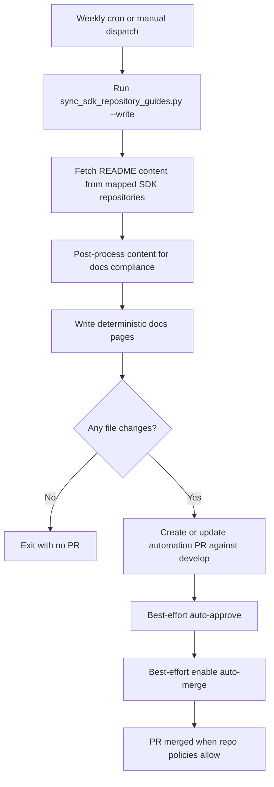

# SDK repository guides sync (internal runbook)

This internal runbook documents the weekly README synchronization system for repository guides in Braze Docs.

## Purpose

The goal is to keep docs repository guide pages aligned with upstream SDK READMEs while enforcing Braze technical writing and formatting standards before content reaches the docs site.

This solves two recurring problems:

1. README updates can drift away from docs if syncing is manual.
2. Raw README markdown is not always compliant with Braze docs style and template conventions.

## Scope

- Sources: Public `README.md` files in SDK repositories mapped in `scripts/sync_sdk_repository_guides.py`.
- Targets: `_docs/_developer_guide/sdk_repository_guides/*.md`.
- Scheduler: `.github/workflows/sync-sdk-repository-guides.yml`.

## Architecture



## Weekly lifecycle

1. Workflow triggers once per week (Sunday, 07:00 UTC), or manually by maintainers.
2. Sync script fetches all mapped READMEs.
3. Post-processing runs on each README before writing content.
4. If content changed, automation opens/updates a PR with only repository guide page changes.
5. Workflow attempts to auto-approve and enable auto-merge.
6. Once branch protection and checks are satisfied, PR merges and docs remain in sync.

## Post-processing rules

Post-processing occurs in `apply_post_processing()` in `scripts/sync_sdk_repository_guides.py`.

### Why post-processing is required

Repository READMEs are authored for GitHub rendering, but docs pages require:

- Braze-compliant alert syntax and content structure.
- Stable formatting for docs templates.
- Render-safe links and assets.
- Predictable markdown for maintainability and performance.

### Rule set

1. **Normalize line endings and markdown basics**
   - Converts CRLF to LF.
   - Fixes malformed break tags such as `</br>`.

2. **Remove non-doc-safe tags**
   - Removes `<script>` and `<style>` blocks.
   - Prevents accidental third-party JavaScript/CSS injection and avoids unnecessary render weight.

3. **Normalize heading structure**
   - Converts Setext headings to ATX headings.
   - Removes README H1 so docs page title comes from front matter/template.
   - Removes README table-of-contents blocks so docs don't show duplicated navigation.
   - Removes top preamble text before the first section heading to start pages with clean section content.
   - Prepends a standardized `About the Braze <SDK>` intro so each page starts consistently.

4. **Normalize links and media paths**
   - Relative links become absolute GitHub `blob` URLs.
   - Relative image paths become absolute GitHub `raw` URLs.
   - Inline HTML `href` and `src` references are normalized too.

5. **Convert README alerts to Braze liquid alerts**
   - Converts GitHub alert blocks (`> [!NOTE]`, `> [!TIP]`, `> [!IMPORTANT]`, `> [!WARNING]`) to:
     - `...`
     - `...`
     - `...`
     - `...`
   - Converts `::: note` style alerts to liquid syntax.
   - Converts blockquote-prefix alerts (`> **Note:**`) to liquid syntax.
   - Converts warning-style markdown headings (for example, `#### ⚠ ...`) to warning liquid alerts.

6. **Normalize code fences**
   - Ensures code fences include a language token.
   - Applies language aliases (for example, `sh` to `bash`, `js` to `javascript`, `yml` to `yaml`).

7. **Trim cosmetic noise**
   - Removes top logo blocks and title-line badge images where appropriate.
   - Reduces unnecessary visual noise and external badge requests.

8. **Enforce deterministic spacing**
   - Collapses excessive blank lines.
   - Produces stable output for cleaner diffs and easier reviews.

9. **Enforce table accessibility metadata**
   - Adds table IAL blocks with `aria-label` after markdown tables when missing.
   - Uses the nearest markdown heading to generate a descriptive label.
   - Preserves existing explicit layout-table opt-outs (`role="presentation"` or `role="none"`).

## Performance and maintainability controls

- Uses concurrent README fetching for efficient runtime.
- Writes only changed files, minimizing git churn.
- Uses deterministic output to keep diffs stable and reviewable.
- Uses workflow concurrency to avoid overlapping sync runs.
- Uses a single automation branch (`automation/sdk-repository-guides-sync`) for predictable PR behavior.

## Review, approval, and merge behavior

The workflow attempts to:

1. Open/update the sync PR.
2. Submit an approval review (best effort).
3. Enable auto-merge (best effort, squash).

Whether the PR auto-merges depends on repository policies (required checks, required reviews, and token permissions).

## How to edit in the future

### Add, remove, or update repository mappings

Edit `REPO_GUIDES` in `scripts/sync_sdk_repository_guides.py`:

- `slug` controls output filename.
- `owner`, `repo`, `branch` control source README URL.
- `nav_title`, `article_title`, `page_order`, `description` control target page front matter.

### Add or change post-processing rules

1. Update rule logic in `scripts/sync_sdk_repository_guides.py`.
2. Keep `apply_post_processing()` ordered and deterministic.
3. Run local tests (below).
4. Verify representative output pages before merging.

### Update schedule or PR behavior

Edit `.github/workflows/sync-sdk-repository-guides.yml`:

- `on.schedule` for cadence.
- `create-pull-request` block for PR title/body/branch.
- auto-approve/auto-merge steps for automation behavior.

## Local validation procedure

From repo root:

```bash
python3 scripts/sync_sdk_repository_guides.py --write
python3 scripts/sync_sdk_repository_guides.py --check
```

Recommended targeted test during rule development:

```bash
python3 scripts/sync_sdk_repository_guides.py --write --repo web
python3 scripts/sync_sdk_repository_guides.py --check --repo web
```

## Operational guardrails

- Do not hand-edit content inside generated README regions.
- Keep docs-owned edits outside generated markers.
- If upstream branches rename (`master` to `main`, etc.), update mapping immediately.
- If alert rendering breaks, validate liquid alert conversion first.
- If PR auto-approve/auto-merge stops working, inspect workflow permissions and token capabilities.
